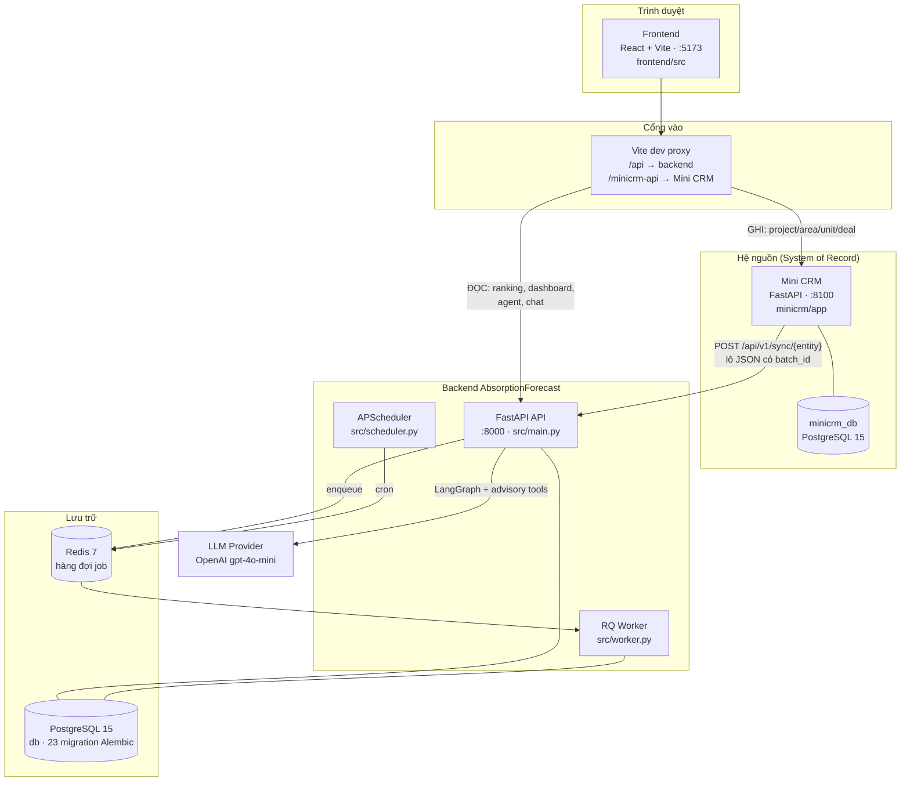
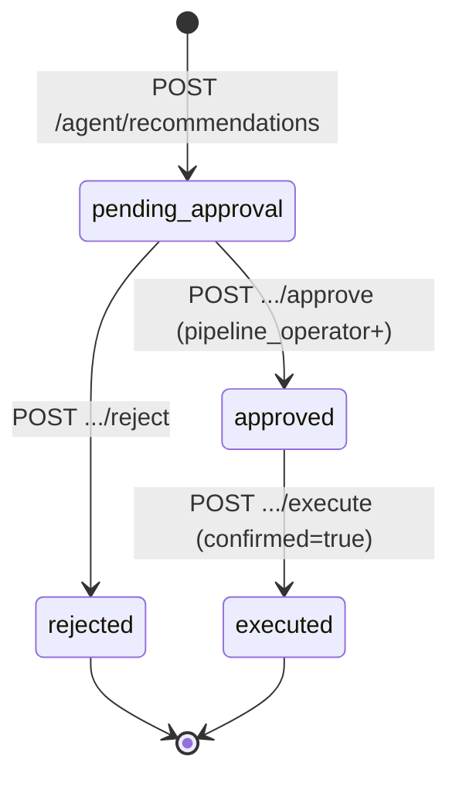

# Kiến trúc hệ thống — AbsorptionForecast AI Agent


---

## 1. Sơ đồ tổng thể — thành phần


---

## 2. Luồng dữ liệu chính — từ dữ liệu thô tới khuyến nghị

```mermaid
flowchart LR
    subgraph ingest["1 · Nạp dữ liệu"]
        A1["Mini CRM<br/>lô JSON"] --> A3
        A2["Upload Excel/CSV<br/>POST /files/upload"] --> A3
        A3["sync_runs · sync_payloads<br/>chống trùng, phát hiện xung đột"]
        A3 --> A4[("projects · areas<br/>units · deals")]
    end

    subgraph rank["2 · Xếp hạng (tất định)"]
        A4 --> B1["Tính đặc trưng<br/>chuẩn hoá về 0–1"]
        B1 --> B2[("feature_snapshots")]
        B3[("ranking_configs<br/>status = published")] --> B4
        B2 --> B4["src/ranking/engine.py<br/>tổng có trọng số ÷ coverage"]
        B4 --> B5[("ranking_runs<br/>ranking_scores")]
    end

    subgraph agent["3 · Tư vấn (LLM)"]
        B5 --> C1["analyze_node<br/>KHÔNG gọi LLM"]
        C1 --> C2["respond_node<br/>gọi LLM · trả JSON"]
        C2 --> C3[("agent_recommendations<br/>status = pending_approval")]
    end

    subgraph hitl["4 · Người duyệt (BẮT BUỘC)"]
        C3 --> D1{"Người<br/>quyết định"}
        D1 -->|"Từ chối"| D2["rejected · dừng"]
        D1 -->|"Duyệt"| D3["approved"]
        D3 --> D4["Thực thi<br/>confirmed = true"]
        D4 --> D5["Chiến dịch ưu tiên<br/>executed · một lần duy nhất"]
    end
```



### Ba tầng của con số xếp hạng

```text
SỰ THẬT NGUỒN      units.status · deals.status · deals.sold_at · areas
   ↓  biến đổi tất định, chuẩn hoá về [0,1]
GIÁ TRỊ ĐẶC TRƯNG  feature_snapshots.feature_value  ∈ [0,1]
   ↓  nhân trọng số của ranking_configs (status = 'published')
ĐIỂM CUỐI          ranking_scores.score  ∈ [0,1]  →  hạng  →  mức (high/medium/low)
```

Công thức (`src/ranking/engine.py`, thuần hàm — không I/O, không DB):

```text
oriented(v, direction) = v        nếu direction = 'positive'
                       = 1 - v    nếu direction = 'negative'

numerator   = Σ weight_i × oriented(value_i, direction_i)
denominator = Σ weight_i                       ← chỉ tính đặc trưng CÓ giá trị
coverage    = denominator
coverage < min_weight_coverage  →  BỎ QUA căn (không có điểm)
ngược lại                       →  score = round(numerator / denominator, 4)
```

Vì công thức là tất định, **cùng dữ liệu + cùng config ⇒ cùng điểm**. LLM không
tham gia vào việc tính điểm; nó chỉ *giải thích* bảng điểm đã có.

---

## 3. Vòng phê duyệt của con người (HITL)

Đây là ràng buộc cứng của dự án (`AGENTS.md` § Boundaries). Máy trạng thái:



Bốn chốt chặn, tất cả ở `src/api/agent.py`:

| Chốt | Mã lỗi | HTTP |
|---|---|---|
| Chưa duyệt mà đòi thực thi | `APPROVAL_REQUIRED` | 409 |
| Duyệt rồi nhưng thiếu xác nhận riêng | `CONFIRMATION_REQUIRED` | 409 |
| Thực thi lần thứ hai | `ALREADY_EXECUTED` | 409 |
| Hành động ngoài danh sách cho phép | `ACTION_NOT_ALLOWED` | 422 |

Executor **chỉ** biết đúng một loại hành động: `CREATE_PRIORITY_CAMPAIGN`, giới hạn
1–50 căn, và mọi căn phải còn `available` thuộc đúng dự án. Không có đường nào cho
LLM tự sinh ra một hành động mới rồi tự chạy.

---

## 4. Hai luồng AI, tách biệt có chủ đích

| | Luồng khuyến nghị | Luồng hỏi–đáp |
|---|---|---|
| Endpoint | `POST /api/v1/agent/recommendations` | `POST /api/v1/chat` |
| Khung | LangGraph 2 node (`src/agents/graph.py`) | Planner + tool + synthesis (`src/agents/advisory_tools.py`) |
| Gọi LLM | 1 lần (`respond_node`) | 2 lần (chọn tool, tổng hợp) |
| Ghi DB | Có — tạo bản ghi chờ duyệt | **Không** — chỉ đọc |
| Cần người duyệt | **Có** | Không (vì không hành động gì) |
| Đầu ra | JSON có cấu trúc + evidence | Văn bản Markdown + `sources[]` |

Luồng hỏi–đáp có 10 tool chỉ-đọc (`portfolio_overview`, `compare_areas`,
`top_ranked_units`, `area_ranking_risks`, `inventory_hotspots`, …). Planner LLM
chọn tool, tool truy vấn PostgreSQL trong phạm vi dự án mà token được cấp, rồi
synthesis LLM viết câu trả lời **chỉ từ kết quả tool** — mỗi câu trả lời kèm
`sources[]` ghi rõ tool nào, dữ liệu tính đến lúc nào.

---

## 5. Phân quyền

Vai trò suy ra từ **token nào khớp**, không bao giờ từ trường client tự khai
(`src/services/dashboard_auth.py`). Ba vai trò xếp lồng nhau:

```text
business_viewer  ⊂  pipeline_operator  ⊂  admin
```

| Thao tác | Vai trò tối thiểu |
|---|---|
| Xem xếp hạng, dashboard, chat | `business_viewer` |
| Tạo khuyến nghị AI | `business_viewer` |
| Chạy lại xếp hạng, duyệt/từ chối | `pipeline_operator` |
| Soạn & phát hành config, xem payload thô | `admin` |

Ngoài vai trò còn có **phạm vi dự án** (`DASHBOARD_PROJECT_SCOPE`): một token có
thể bị giới hạn ở vài `external_id` cụ thể, hoặc `"ALL"`. Xin dữ liệu ngoài phạm
vi ⇒ 403 `PROJECT_OUT_OF_SCOPE`.

> ⚠️ Trong `docker-compose.yml`, service `api` đặt `DEV_AUTH_BYPASS: "true"` để
> chạy local không cần dán token — chỉ có tác dụng khi `APP_ENV=development`.
> **Phải tắt khi deploy thật.**

---

## 6. Hạ tầng — 8 service của `docker compose`

| Service | Vai trò | Cổng |
|---|---|---|
| `api` | FastAPI + OpenAPI docs | 8000 |
| `worker` | RQ worker: parse upload, tính lại xếp hạng, đối soát | — |
| `scheduler` | APScheduler đẩy job theo cron | — |
| `db` | PostgreSQL 15 — dữ liệu backend | 5432 |
| `redis` | Hàng đợi job | 6379 |
| `frontend` | Vite dev server | 5173 |
| `minicrm` | Mini CRM (hệ nguồn) | 8100 |
| `minicrm_db` | PostgreSQL 15 — dữ liệu Mini CRM | 5433 |

`api`, `worker`, `scheduler` dùng **chung một image**, chỉ khác lệnh khởi động.

---

## 7. Những phần CHƯA làm (nêu rõ để không hiểu nhầm sơ đồ)

- **Đăng nhập thật**: `LoginPage.jsx` là giao diện tĩnh; token được dán tay qua
  `ConnectPanel`. JWT đã có trong config nhưng chưa nối vào luồng người dùng.
- **Cò tự động sau đồng bộ**: cột `ranking_runs.trigger` chấp nhận `sync`,
  `config_change`, `survey_snapshot`; đường chạy tự động đã có mã nhưng luồng
  đang dùng chủ yếu là `manual`.