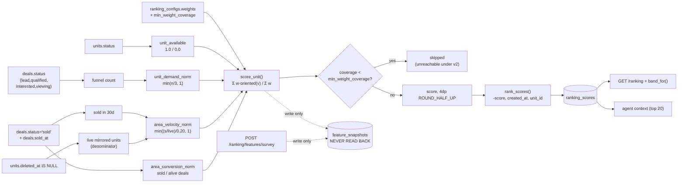
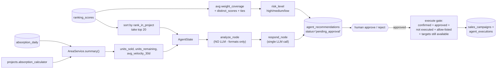
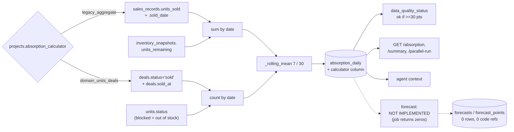

# Database Impact Analysis

**Repo**: `AI20K-Build-Phase-Cohort-3/P-100` · **Branch**: `staging` · **Date**: 2026-08-18
**Alembic head**: `0026_cloudinary_cover_images` (single head, verified by parsing every
`down_revision` in `alembic/versions/`)
**Scope**: which database fields demonstrably drive (1) Ranking, (2) Agent/advisory, (3)
Forecasting/absorption.

Every claim below is traceable to a file:line, a migration revision, or a recorded runtime
measurement. Where something could not be measured it says `NOT MEASURED`.

---

## 1. Executive Summary

1. **Ranking is fully implemented and driven by exactly four database-derived features**, computed
   from three tables only — `units.status`, `deals.status`, `deals.sold_at`, `deals.deleted_at`,
   `units.deleted_at`, `units.area_id`, `areas.project_id`. Nothing else enters the score.
   Status: **VERIFIED** (runtime: 200/200 units scored, bands reproduced exactly).
2. **`ranking_configs.weights` is the single highest-impact field in the system.** It is read at
   the start of every run (`service.py:107-123`) and decides which features exist, their weights,
   direction, and missing-data policy. One UPDATE silently re-scores every unit in every project.
3. **`feature_snapshots` is written but never read.** `src/ranking/service.py` contains exactly one
   `pg_insert(feature_snapshots)` (line 475) and **no SELECT**. Consequently the entire survey
   feature path (`POST /ranking/features/survey` → `src/services/survey_features.py`, feature keys
   `view_quality`/`natural_light`/`privacy`/`noise_level`) **cannot influence any score**, despite
   returning 202 and triggering a full rerank. This is a silent no-op, not a latent feature.
4. **`feature_snapshots.confidence` and `.sample_count` are structurally dead.** The engine has a
   confidence gate (`engine.py:81`) but `_build_feature_inputs` never passes a `confidences` dict,
   so the gate can never fire. Runtime confirmation: **0 of 616 rows non-null** for both columns.
5. **Forecasting is NOT IMPLEMENTED.** `src/jobs/forecast.py:33-36` is a `TODO (MVP 2)` that returns
   `{areas_total: 0, areas_failed: 0}` and touches no data. The four forecast tables have **zero**
   application references (the only textual hit is a docstring naming a `POST /api/forecasts/run`
   endpoint that does not exist). No forecast output exists to analyse.
   Status: **NOT_IMPLEMENTED**.
6. **What is called "forecasting" in this repo is actually retrospective absorption**, and it *is*
   implemented — two independent calculators writing `absorption_daily`, selected per project by
   `projects.absorption_calculator`. That column is a high-impact routing switch: it decides which
   of two lineages a project's numbers come from, and the two read disjoint source tables.
7. **The advisory agent consumes ranking output, not raw tables**, on its primary path: only the
   **top 20 units by `rank_in_project`** reach the LLM (`src/api/agent.py:235-246`), and
   `ranking_scores.weight_coverage` drives a risk label via `_proposal_quality`
   (`agent.py:100-114`). A second, separate path (`POST /chat`, `advisory_tools.py`) queries 8
   tables directly.
8. **A cross-lineage hazard exists in the agent path**: `AreaService().summary()` dispatches on
   `projects.absorption_calculator` (`absorption.py:68-76`), so for a project on
   `domain_units_deals` with no legacy rows the agent's absorption context can legitimately be
   0 sold / 0 remaining while the domain lineage holds real numbers. Runtime evidence: in the
   synthetic load, `syn1-P-001` produced 130 domain rows and **0 legacy rows**.
9. **Two normalization constants that materially shape scores live in code, not config**:
   `VELOCITY_SATURATION = 0.20` and `DEMAND_SATURATION = 3` (`service.py:71,76`). They are not
   versioned with `ranking_configs`, so a change to either silently invalidates comparability with
   historical `ranking_scores` rows, which record only `config_version_id`.
10. **Under the currently published config, the coverage gate can never fire.** Config v2 uses only
    `zero`/`neutral` missing policies (`0022_ranking_config_v2.py:86-89`), so `coverage` is always
    1.0 ≥ `min_weight_coverage` 0.5. Runtime: 200 units processed, **0 skipped**. Any documentation
    describing skipped units is describing an unreachable branch under v2.

---

## 2. Evidence and Scope

### Files examined

| Path | Purpose |
|---|---|
| `pipeline_status.md` | Architecture map (treated as documentation — lowest precedence) |
| `alembic/versions/*.py` (28 files) | Schema authority; parsed for CHECK/UNIQUE/FK/enum constants |
| `src/models/tables.py` | Core projection, 23 tables — exact column names/types |
| `src/ranking/engine.py` | Pure scorer (161 lines) |
| `src/ranking/service.py` | Feature derivation + persistence (585 lines) |
| `src/ranking/bands.py` | Presentation band cutoffs |
| `src/api/ranking.py` | Ranking read/compute endpoints |
| `src/services/survey_features.py` | Second writer to `feature_snapshots` |
| `src/services/domain_absorption.py` | `domain_units_deals` calculator |
| `src/services/absorption.py` | `legacy_aggregate` calculator + `AreaService` |
| `src/api/agent.py` | HITL advisory endpoints, agent state assembly |
| `src/agents/graph.py`, `src/agents/nodes/ranking_node.py` | LangGraph analyze→respond |
| `src/agents/advisory_tools.py` | 10 read-only DB tools for `POST /chat` |
| `src/jobs/forecast.py` | Forecast job (stub) |
| `datasets/synthetic_v1/exports/*.csv` | Runtime output used for cross-checking |

### Missing paths

The task's suggested layout does not match this repository. Recorded as `MISSING`, analysis
continued against the real layout:

`app/models/` · `app/schemas/` · `app/services/` · `app/pipelines/` · `app/forecasting/` ·
`app/ranking/` · `app/agents/` — all **MISSING**. The equivalents live under `src/`.
`docs/` **EXISTS**. `datasets/synthetic_v1/exports/` **EXISTS**.

### Runtime evidence available

Measurements in this report labelled *runtime* come from a session on 2026-08-18 in which
`datasets/synthetic_v1` (432 rows) was loaded into a **disposable** `postgres:15-alpine` container
(destroyed afterwards) at Alembic head `0026`, and the real absorption and ranking pipelines were
executed. This is the highest-precedence evidence class per the task's ordering.

### Limitations

- The LLM steps (`respond_node`, `advisory_tools`) were **NOT MEASURED** — no OpenAI call was made.
  Their *database reads* are traced statically; their outputs are not evaluated.
- Field impact is assessed for the **currently published config (v2)**. Publishing a different
  `ranking_configs.weights` changes which fields matter — that is precisely finding #2.
- Production data volumes and distributions are **NOT MEASURED**; all quantitative statements come
  from the synthetic dataset or from code.
- `agent_recommendations` / `sales_campaigns` / `agent_executions` were **NOT populated** in the
  runtime session (they require an LLM call), so their columns are analysed from code only.

### Evidence conflicts recorded

| Conflict | Resolution |
|---|---|
| `pipeline_status.md` §7.21 says MiniCRM `dev_auth_bypass` is "never read"; code now reads it (`minicrm/app/auth.py:106`) | Code wins (precedence 2 > 4). Doc is stale relative to the 2026-08-18 change. Not material to this analysis. |
| `pipeline_status.md` §5.4 presents `min_weight_coverage` as an active gate; runtime shows 0 skipped units | Both true. The gate is implemented and correct, but unreachable under config v2's policies. Reported as a reachability finding, not a doc error. |
| `src/ranking/service.py` docstring §5.2 says velocity denominator is `areas.total_units`; code uses live mirrored units | Code wins. The docstring itself documents the deliberate correction (module docstring item 1). `areas.total_units` is therefore `SCHEMA_ONLY` for ranking. |

---

## 3. Ranked Fields by Capability

### Scoring criteria

`impact_score = directness*2 + reach*2 + formula_weight + validation_criticality` (max 10).

| Component | 0 | 1 | 2 |
|---|---|---|---|
| **directness** | not used | feeds a feature used later | read directly in a formula/decision |
| **reach** | one row/branch | one project or one segment | every row in every project |
| **formula_weight** | not in a formula | appears, small coefficient | dominant term or a gate/switch |
| **validation_criticality** | no constraint | constrained | a CHECK/UNIQUE whose violation halts the pipeline or corrupts output |

The 0–5 capability rating is stated separately in the tables as `Impact score` (0–10 composite);
scores are a summary of the evidence, never a substitute for it.

### 3.1 Ranking — status: **VERIFIED**

| Rank | Table.column | Impact score | Directness | Transformation | Output affected | Evidence | Confidence |
|---|---|---|---|---|---|---|---|
| 1 | `ranking_configs.weights` | 10 | DIRECT | JSONB → `FeatureWeight(weight, direction, missing_value_policy, min_confidence)` per key | Every `ranking_scores.score`, `.rank_*`, `.contributions`, band | `service.py:107-123` reads the single `status='published'` row; `engine.py:78-108` iterates it. v2 values in `0022_ranking_config_v2.py:86-89` | HIGH |
| 2 | `units.status` | 10 | DIRECT | `1.0 if status=='available' else 0.0` → `unit_available` | Score (weight **0.35**, the largest single term) | `service.py:236`; enum `('available','reserved','sold','blocked')` from `0007:52,95` | HIGH |
| 3 | `deals.status` | 10 | DIRECT | Three separate roles: funnel count (`unit_demand_norm`), `sold` count (velocity + conversion), holding detection | Score via 0.25 + 0.20 + 0.20 = **0.65** of total weight | `service.py:81,170,196,210`; enum from `0007:57` | HIGH |
| 4 | `deals.sold_at` | 9 | DIRECT | `sold_at >= now()-30d` → `sold_30d`; then `min((sold_30d/live_units)/0.20, 1)` | `area_velocity_norm` (weight 0.20), broadcast to every unit in the area | `service.py:155,172`; also `domain_absorption.py` daily series | HIGH |
| 5 | `deals.deleted_at` | 9 | DIRECT | `IS NULL` filter on every deal aggregation | Silently removes deals from all three deal-derived features | `service.py:162,195`; soft-delete convention | HIGH |
| 6 | `units.deleted_at` | 9 | DIRECT | `IS NULL` filter; also sets the velocity **denominator** (live mirrored units) | Unit inclusion + `area_velocity_norm` for the whole area | `service.py:137,396-397` | HIGH |
| 7 | `ranking_configs.min_weight_coverage` | 7 | DIRECT | Compared against summed weights | Skip/keep decision (`skipped`, NULL ranks) | `engine.py:111-121`. **Unreachable under v2** — runtime 0 skipped | HIGH |
| 8 | `units.area_id` | 7 | DIRECT | Join key; defines the area aggregation boundary and `rank_in_area` | Which area's velocity/conversion a unit inherits | `service.py:136,254`; FK `0007:88` | HIGH |
| 9 | `areas.project_id` | 7 | DIRECT | Scopes every query in a run | Whole-run membership; `rank_in_project` | `service.py:137,162,193`; FK `0001` | HIGH |
| 10 | `units.created_at` | 6 | DIRECT | `tie_break_created_at` | Deterministic tie-break — decides ordering when scores tie, which is common | `engine.py:147` sort key `(-score, tie_break_created_at, unit_id)`; `service.py:248` | HIGH |
| 11 | `units.id` | 5 | DIRECT | Final tie-break; PK of `ranking_scores` | Stable ordering; `uq_ranking_scores_unit` | `engine.py:147`; `0015:208` | HIGH |
| 12 | `deals.unit_id` | 5 | DIRECT | Join key for funnel counts | `unit_demand_norm` attribution | `service.py:190-198`; FK `0007:129` | HIGH |
| 13 | `ranking_scores.score` / `.rank_in_project` / `.rank_in_area` | 5 | DIRECT (output) | Persisted result | `GET /ranking`, agent context, exports | `service.py:537-556`; `0015:198-201` | HIGH |
| 14 | `ranking_scores.weight_coverage` | 4 | DIRECT (output) | Persisted `coverage` | Displayed; **and drives the agent's risk label** | `agent.py:104-108` | HIGH |
| 15 | `ranking_scores.contributions` | 3 | METADATA_ONLY | JSONB per-feature audit | Explainability in `GET /ranking` + exports; not an input | `api/ranking.py:96-115` | HIGH |
| 16 | `projects.id` | 3 | DIRECT | Run scope | Existence check → `PROJECT_NOT_FOUND` | `service.py:342-344` | HIGH |
| 17 | `ranking_runs.status` | 3 | DIRECT | Claim guard `WHERE status IN ('queued','failed')` | Prevents double-execution by two workers | `service.py:367-390` | HIGH |
| 18 | `areas.total_units` | 1 | SCHEMA_ONLY (ranking) | — | **Not used by ranking.** Deliberately replaced by live mirrored unit count | `service.py` docstring item 1; denominator at `service.py:177` | HIGH |
| 19 | `feature_snapshots.*` | 1 | METADATA_ONLY | Written, never read | No score impact whatsoever | Only `pg_insert` at `service.py:475`; zero SELECTs | HIGH |
| 20 | `deals.source_status`, `.reserved_at`, `.lost_at` | 1 | SCHEMA_ONLY (ranking) | — | Not read by the scorer (`reserved_at`/`lost_at` are CHECK-enforced but unused in features) | `service.py:217-252` builds only 5 keys | HIGH |

**Not a ranking input despite plausible names**: `areas.bedrooms`, `areas.area_sqm`,
`units.unit_type`, `units.unit_code`, `projects.launch_date`, `absorption_daily.*`. The ranking
service explicitly does **not** read `sales_records`/`inventory_snapshots`/`absorption_daily`
(`service.py` docstring lines 6-8).

#### Absent but requested

| Field | State | Evidence |
|---|---|---|
| `price`, `price_per_sqm` | `ABSENT` | `information_schema` scan across all 36 tables: no price column. MiniCRM states it carries no prices by design |
| `floor`, `orientation`, `view`, `bathrooms` | `ABSENT` | No such columns on `units`/`areas`. `view_quality` exists only as a survey *feature key* with no data and no read path |
| `confidence` (per unit) | `PRESENT_BUT_UNPOPULATED` | `feature_snapshots.confidence` exists (`0014:119`); runtime 0/616 non-null; gate at `engine.py:81` unreachable |

### 3.2 Agent / advisory — status: **PARTIALLY_VERIFIED**

Database reads are verified; LLM behaviour was **NOT MEASURED**. Note the schema's `agent_*` tables
refer to the **AI advisory agent**, not a sales agent — no sales-staff entity exists anywhere.

| Rank | Table.column | Impact score | Directness | Transformation | Output affected | Evidence | Confidence |
|---|---|---|---|---|---|---|---|
| 1 | `ranking_scores.rank_in_project` | 9 | DIRECT | `sort by rank_in_project → [:20]` | **Selects which units the LLM ever sees** — a unit ranked 21+ is invisible to the advisory path | `agent.py:246` | HIGH |
| 2 | `ranking_scores.score` | 8 | DIRECT | Serialized into prompt context; also `score_range`, `distinct_scores`, `top_ties` | Prompt content + risk label | `agent.py:105-107,130-132,239` | HIGH |
| 3 | `ranking_scores.weight_coverage` | 8 | DIRECT | `average_coverage`; `<0.50 → 'high'` risk, `<0.80 → 'medium'` | `agent_recommendations.risk_level` | `agent.py:103-113` | HIGH |
| 4 | `agent_recommendations.status` | 8 | DIRECT | Gate: must be `approved` to execute | The HITL guarantee (`AGENTS.md` hard requirement) | `agent.py:484-489`; CHECK `0018:98`; default `'pending_approval'` | HIGH |
| 5 | `agent_recommendations.execution_status` | 8 | DIRECT | Must be `!= 'executed'` | Prevents double execution | `agent.py` execute gate; `tables.py:527` | HIGH |
| 6 | `agent_recommendations.action_type` | 7 | DIRECT | Allow-list: only `CREATE_PRIORITY_CAMPAIGN` | Execution refused for any other value | `agent.py:570` | HIGH |
| 7 | `units.status` | 7 | DIRECT | Re-checked at execute time; targets must still be `available` | 409 `TARGETS_CHANGED` | `agent.py:613` | HIGH |
| 8 | `projects.absorption_calculator` | 7 | DIRECT | Dispatches `AreaService.summary()` to legacy or domain | The absorption numbers stated in the recommendation prose | `absorption.py:68-76`; `agent.py:229` | HIGH |
| 9 | `absorption_daily.units_sold` / `.units_remaining` / `.velocity_30d` | 6 | DIRECT | Aggregated into `absorption_context` | Quoted verbatim in the LLM prompt and business summary | `agent.py:229-233,149-150` | HIGH |
| 10 | `agent_recommendations.ranking_run_id` | 6 | DIRECT | NOT NULL FK → `ranking_runs` | Provenance: ties every recommendation to a real computation | `tables.py:512`; FK `0018` | HIGH |
| 11 | `ranking_scores.contributions` | 5 | INDIRECT | Feature labels → evidence list | `agent_recommendations.evidence` | `agent.py:275-279` | MEDIUM |
| 12 | `absorption_daily.*`, `units.*`, `deals.*`, `areas.*`, `projects.*`, `ranking_runs.*`, `ranking_configs.*` (via `/chat`) | 5 | DIRECT | 10 read-only tool functions | `POST /chat` answers | `advisory_tools.py` imports 8 tables; 27 `ranking_scores` references | MEDIUM |
| 13 | `agent_recommendations.recommended_actions` | 4 | DIRECT (output) | LLM JSON | The proposal itself; empty list on LLM failure (never fabricated) | `graph.py`; `tables.py:515` | HIGH |
| 14 | `sales_campaigns.*`, `sales_campaign_units.*`, `agent_executions.*` | 3 | DIRECT (output) | Written only on approved execution | Execution record | `tables.py:536-570`; `uq_campaign_recommendation` `0020:65` | MEDIUM |
| 15 | `agent_recommendations.decided_by` / `.executed_by` / `agent_executions.actor` | 2 | METADATA_ONLY | Free **TEXT** — not an FK, no user table | Audit trail only | `tables.py:517,528,565` | HIGH |

#### Absent but requested

| Field | State | Evidence |
|---|---|---|
| `customer_id`, `lead_id` | `ABSENT` | No customer/lead/contact table in either service; a "lead" is a `deals` row with `status='lead'` |
| `budget`, `financing_status`, `preferred_*`, `next_follow_up`, `notes`, `assigned_sales_agent`, `interaction_counts` | `ABSENT` | `information_schema` scan: no such columns. MiniCRM `main.py` docstring: "không khách hàng, không giá, không PII" |
| Sales-agent identity | `ABSENT` | The `agent_*` tables are the AI advisory agent. Actor fields are free text with no FK |

### 3.3 Forecasting / absorption — status: split

- **Forecasting (predictive)**: **NOT_IMPLEMENTED**
- **Absorption (retrospective)**: **VERIFIED**

| Rank | Table.column | Impact score | Directness | Transformation | Output affected | Evidence | Confidence |
|---|---|---|---|---|---|---|---|
| 1 | `projects.absorption_calculator` | 10 | DIRECT | Routing switch: `legacy_aggregate` \| `domain_units_deals` | Decides which lineage answers every absorption read; the two use **disjoint source tables** | `absorption.py:68-85`; CHECK `0012`; default `legacy_aggregate` | HIGH |
| 2 | `deals.sold_at` | 9 | DIRECT (domain) | Bucketed by date → daily series → `_rolling_mean` | `absorption_daily.units_sold`, `.velocity_7d`, `.velocity_30d` | `domain_absorption.py:310-311` | HIGH |
| 3 | `deals.status` | 9 | DIRECT (domain) | `='sold'` selects sales; holding statuses set inventory | `units_sold`, `units_reserved` | `domain_absorption.py` | HIGH |
| 4 | `sales_records.units_sold` | 9 | DIRECT (legacy) | Summed by `sold_date` | `absorption_daily.units_sold` for legacy projects | `absorption.py` reads `sales_records.c.units_sold` | HIGH |
| 5 | `sales_records.sold_date` | 9 | DIRECT (legacy) | Time axis of the legacy series | Series shape, both velocities | `absorption.py` | HIGH |
| 6 | `inventory_snapshots.units_remaining` | 8 | DIRECT (legacy) | Latest snapshot per area | `absorption_daily.units_remaining`; agent's "units remaining" | `absorption.py:17,38,57` | HIGH |
| 7 | `inventory_snapshots.snapshot_date` | 7 | DIRECT (legacy) | Picks the latest row | Which inventory figure is reported | `absorption.py:26-41` | HIGH |
| 8 | `units.status` | 8 | DIRECT (domain) | Inventory mix; `blocked` = out of stock | `units_remaining`, `units_reserved` | `domain_absorption.py:51` `OUT_OF_STOCK_STATUSES` | HIGH |
| 9 | `units.deleted_at` / `deals.deleted_at` | 8 | DIRECT | `IS NULL` on every aggregation | Silent row exclusion from all absorption figures | `domain_absorption.py` | HIGH |
| 10 | `absorption_daily.calculator` | 8 | DIRECT | Partitions the delete-and-reinsert scope | **Makes recompute idempotent**; part of `uq` index `(area_id, stat_date, calculator)` | `0012:99`; `domain_absorption.persist` | HIGH |
| 11 | `absorption_daily.data_quality_status` | 6 | DIRECT (output) | `'ok' if index+1 >= LONG_WINDOW(30) else 'warning'` | Honest labelling of thin history. Runtime: 270 ok / 272 warning | `domain_absorption.py:313` | HIGH |
| 12 | `absorption_daily.velocity_7d` / `.velocity_30d` | 6 | DIRECT (output) | `_rolling_mean(daily, index, 7|30)` | Dashboard trend, agent context | `domain_absorption.py:310-311` | HIGH |
| 13 | `areas.id` / `.project_id` | 6 | DIRECT | Aggregation grain — absorption is **area-level**, never unit-level | Every row's identity | `0001` FK | HIGH |
| 14 | `sales_records.external_record_id` / `.source_row_hash` | 4 | INDIRECT | Dedup keys | Prevents double-counting across re-uploads | `uq_sales_area_date_external_id`, `uq_sales_area_source_row_hash` `0001:148-155` | HIGH |
| 15 | `absorption_daily.is_observed` / `.computation_id` | 2 | METADATA_ONLY | Provenance | Lineage audit | `tables.py:224,232` | MEDIUM |
| 16 | `forecasts.*`, `forecast_points.*`, `forecast_jobs.*`, `alerts.*` | 0 | SCHEMA_ONLY | — | **None.** Zero application references; never populated | `grep` across `src/`: 0 refs (single hit is a docstring naming a nonexistent endpoint) | HIGH |

#### Absent but requested

| Field | State | Evidence |
|---|---|---|
| `forecast_target`, predicted sellout, confidence intervals | `FORECAST_NOT_IMPLEMENTED` | `src/jobs/forecast.py:33-36` returns zeros; `prophet` installed but has no call site |
| `released_units` | `ABSENT` | Not a unit status; enum is `available/reserved/sold/blocked` |
| `inventory_aging` / time-in-status | `ABSENT` | `units` has no status-change timestamp, so dwell time is underivable |
| weekly / monthly absorption | `ABSENT` (as stored) | Only daily + rolling 7d/30d are persisted. `AreaService` can group by ISO week at read time (`absorption.py:97`), but no monthly grain exists |
| `unit_id` on absorption | `ABSENT` | `absorption_daily` is area-grained by design |
| price metrics | `ABSENT` | No price column anywhere |

---

## 4. End-to-End Lineage

### 4.1 Ranking

The dotted edges are the dead path: both writers reach `feature_snapshots`, and nothing reads it.

### 4.2 Agent / advisory

### 4.3 Absorption (and the missing forecast tail)

---

## 5. Critical Constraints and Failure Modes

| Constraint / rule | Where | Failure mode if violated or mishandled |
|---|---|---|
| `uq_ranking_configs_published` (partial, one `published` row) | `0014` | `_active_config` takes `.first()`; two published rows would make weight selection nondeterministic |
| `weights <> '{}'::jsonb` | `0014:185` | Empty weights ⇒ `denominator = 0` ⇒ ZeroDivisionError, or all units skipped |
| `min_weight_coverage > 0 AND <= 1` | `0014:186-187` | Out-of-range would skip everything or nothing |
| `ck_ranking_scores_score_range` (0..1) | `0015:198` | A weight set summing oddly could produce out-of-range scores and abort the write |
| `uq_ranking_scores_unit` (unique on `unit_id`) | `0015:208` | Enforces one live score per unit; the delete-and-reinsert in `_persist_scores` depends on it |
| `_persist_scores` staleness guard | `service.py:525-529` | Compares `max(computed_at)`; **silently returns** if a newer run exists. Correct, but a clock skew backwards would silently discard a valid newer run |
| Delete-and-reinsert per project | `service.py:531` | A run that fails mid-way after the DELETE leaves the project with **no scores** until the next run |
| `uq_absorption_daily (area_id, stat_date, calculator)` | `0012:99` | The `calculator` column is what makes RQ retries idempotent; dropping it would merge two lineages into one row |
| `ck_deals_sold_requires_sold_at` | `0007` | Guarantees `sold_at` is present whenever `status='sold'` — velocity math depends on this holding |
| `ck_deals_sold_after_reserved` | `0007` | Prevents negative dwell times |
| `uq_deals_active_per_unit` (partial: reserved/sold, not deleted) | `0007:157-163` | At most one holding deal per unit; a violation would double-count conversion |
| `ck_upload_files_chunk_index_within_total` | `0006` | **`chunk_index` is 0-based.** Found at runtime 2026-08-18 when a `(1,1)` row was rejected; static review had missed it |
| `feature_snapshots.feature_value` NOT NULL | `0014` | Forces the service to **omit** missing area features rather than write 0 — the mechanism that keeps "no deals yet" distinct from "selling badly" (`service.py:460-462`) |
| `uq_feature_snapshots_identity` | `0014:147-152` | One row per `(project, key, scope, scope_id)` — operational and survey writers **overwrite each other**; last writer wins (`survey_features.py:17-21` flags this) |
| 30-day velocity window is wall-clock | `service.py:155` | **Stale-data risk**: velocity decays toward 0 as data ages, with no error. A dataset untouched for 30 days scores every area at velocity 0 |
| `areas.total_units` unused by ranking | `service.py` docstring item 1 | **Semantic ambiguity**: the column reads like the natural denominator but is planned inventory (1,800–3,360) vs ~40 mirrored units — using it collapsed the feature to ~1% of its range |
| No FK on `feature_snapshots.scope_id` | `tables.py:403-405` | TEXT holding UUIDs or `unit_type` strings; orphans are possible and unenforceable |
| `absorption_daily.units_remaining` nullable | `tables.py:227` | NULL means "this calculator cannot compute it", **not zero**. Coercing NULL→0 would fabricate sold-out inventory |
| `projects.absorption_calculator` default `legacy_aggregate` | `0012` | A domain-only project left at the default reports 0 sold / 0 remaining — real risk, observed at runtime (`syn1-P-001`: 130 domain rows, 0 legacy rows) |

### Leakage risk

No temporal leakage exists in ranking today, because **ranking makes no predictions** — it scores
current state from current state. `deals.sold_at` enters only as a 30-day count, and the output is
an explicitly non-predictive priority (`bands.py:34-37` disclaimer). If forecasting is implemented
later, `deals.sold_at`, `deals.status`, and `units.status` become leakage-critical: they are
mutated in place by the mirror with no history table, so a naive backtest would train on
post-outcome values. Recorded here as a forward-looking risk, **NOT MEASURED**.

---

## 6. Missing, Unpopulated, and Unsupported Fields

### `ABSENT_FROM_SCHEMA`
`price`, `price_per_sqm`, `floor`, `orientation`, `view`, `bathrooms`, `customer_id`, `lead_id`,
`lead_source`, `budget`, `financing_status`, `preferred_project|area|unit_type|bedrooms|price_range`,
`contact_timestamps`, `next_follow_up_at`, `viewing_appointment`, `interaction_counts`, `notes`,
`assigned_sales_agent`, `released_units`, `inventory_aging`, per-unit `size`/`bedrooms`
(area-level only), monthly absorption grain, `unit_id` on absorption.
Verified by `information_schema` scan over all 36 tables — no name-based inference.

### `PRESENT_BUT_UNPOPULATED`
- `feature_snapshots.confidence` — 0/616 non-null (runtime). Gate at `engine.py:81` unreachable.
- `feature_snapshots.sample_count` — 0/616 non-null (runtime).
- `absorption_daily.units_reserved` / `.units_remaining` — nullable by design; NULL from the legacy
  calculator, which cannot compute per-unit inventory.
- `projects.created_by` / `.reviewed_by`, `areas.*`, `upload_files.uploaded_by` — nullable FKs to
  `users`, a table with no rows (auth is static env tokens).
- `agent_recommendations.confidence` — nullable, **NOT MEASURED** (no LLM run performed).

### `PRESENT_AND_USED`
The four ranking features and their source columns; `ranking_configs.weights` /
`.min_weight_coverage`; `ranking_scores.score` / `.rank_*` / `.weight_coverage` / `.contributions`;
`projects.absorption_calculator`; `absorption_daily.units_sold` / `.velocity_7d` / `.velocity_30d` /
`.calculator` / `.data_quality_status`; `sales_records.units_sold` / `.sold_date`;
`inventory_snapshots.units_remaining` / `.snapshot_date`; the `agent_recommendations` gate columns.

### `PRESENT_BUT_UNUSED`
- **All of `feature_snapshots`** as an *input* — written by two paths, read by none.
- **The entire survey feature pipeline** (`src/services/survey_features.py`,
  `POST /ranking/features/survey`, keys `view_quality`/`natural_light`/`privacy`/`noise_level`):
  accepts data, returns 202, triggers a rerank, and **cannot change any score**.
- `has_active_deal` — computed every run (`service.py:237`) but carries **zero weight** in v2;
  deliberately retained so a rollback to v1 weights would not see it as missing (`service.py:223-228`).
- `areas.total_units` — for ranking (still used for display/legacy context).
- `deals.source_status`, `.reserved_at`, `.lost_at` — CHECK-enforced, not read by ranking.
- 14-table orphan island: `users`, `user_areas`, `refresh_tokens`, `audit_logs`, `settings`,
  `suggestions`, `proposals`, `approvals`, `explanations`, `llm_calls`, `alerts` (+ forecast trio).

### `FORECAST_NOT_IMPLEMENTED`
`forecasts`, `forecast_points`, `forecast_jobs`, `alerts` — created by `0001`, **zero** application
references, never populated. `src/jobs/forecast.py` returns `{areas_total: 0, areas_failed: 0}` and
runs nightly at 02:00 doing nothing. `prophet>=1.1.6` is installed (adding 3–5 min per image build)
with no call site.

---

## 7. Minimal Data Contract

### 7.1 Ranking

| Class | Fields |
|---|---|
| **Required** | `projects.id`, `areas.id`, `areas.project_id`, `units.id`, `units.area_id`, `units.status`, `units.created_at`, `units.deleted_at`, `deals.id`, `deals.unit_id`, `deals.status`, `deals.deleted_at`, `ranking_configs.weights`, `ranking_configs.min_weight_coverage` (exactly one `published` row) |
| **Optional** | `deals.sold_at` — required only for `status='sold'` (CHECK-enforced); its absence zeroes velocity for the area |
| **Derived** | `unit_available`, `unit_demand_norm`, `area_velocity_norm`, `area_conversion_norm`, `score`, `rank_in_area`, `rank_in_project`, `weight_coverage`, `contributions`, band |
| **Freshness** | `deals.sold_at` within 30 days of run time or `area_velocity_norm` → 0. Re-run after any sync affecting units/deals; scores are a snapshot, never recomputed on read (`api/ranking.py:141-151`) |
| **Null handling** | Area with zero live deals ⇒ area features **MISSING** (not 0) ⇒ `neutral` 0.5. Unit with zero funnel deals ⇒ **0** (a measured fact). This distinction is load-bearing — do not collapse it |
| **Validation** | Score ∈ [0,1]; contributions must reconcile to `score` under 4dp `ROUND_HALF_UP` (verified 200/200 at runtime); exactly one live `ranking_scores` row per unit |

### 7.2 Agent / advisory

| Class | Fields |
|---|---|
| **Required** | A completed `ranking_runs` row; `ranking_scores.score` / `.rank_in_project` / `.weight_coverage`; `agent_recommendations.status` / `.execution_status` / `.action_type` / `.ranking_run_id`; `units.status` (re-validated at execute) |
| **Optional** | `absorption_daily` aggregates — absent ⇒ prose must say "no data", never 0 |
| **Derived** | `risk_level`, `evidence`, `recommended_actions`, `summary` |
| **Freshness** | Ranking must be recomputed **before** generating a recommendation (`agent.py` runs it inline). Target units re-validated at execute time or 409 `TARGETS_CHANGED` |
| **Null handling** | LLM failure ⇒ empty `recommended_actions` + explanatory summary; **never** fabricated actions |
| **Validation** | `status` starts `pending_approval` with no path to set `approved` except the decision endpoints; execution requires all five gates |

### 7.3 Absorption (retrospective)

| Class | Fields |
|---|---|
| **Required (domain)** | `deals.status`, `deals.sold_at`, `deals.deleted_at`, `units.status`, `units.area_id`, `units.deleted_at`, `areas.project_id`, `projects.absorption_calculator` |
| **Required (legacy)** | `sales_records.area_id` / `.sold_date` / `.units_sold`, `inventory_snapshots.area_id` / `.snapshot_date` / `.units_remaining` |
| **Derived** | `absorption_daily.units_sold`, `.velocity_7d`, `.velocity_30d`, `.units_remaining`, `.units_reserved`, `.data_quality_status`, `.calculator` |
| **Freshness** | ≥30 daily points before `data_quality_status='ok'`; hourly lineage audit re-queues stale recomputes |
| **Null handling** | `units_remaining`/`units_reserved` NULL = "not computable by this calculator" ≠ 0. `no_data`/`no_units` are distinct API states from 0 |
| **Validation** | `(area_id, stat_date, calculator)` unique; each calculator rebuilds only its own rows |

### 7.4 Forecasting

**No contract can be specified.** The capability is unimplemented and no output exists.
A future contract would additionally require an immutable history of `deals.status` /
`units.status` transitions, which the schema does not currently keep — the mirror overwrites in
place. That is the single largest schema gap blocking forecasting.

---

## 8. Recommendations

### P0 — required before trusting outputs

1. **Resolve the `feature_snapshots` dead path.** Either make `_build_feature_inputs` read it
   (so survey features affect scores) or make `POST /ranking/features/survey` return an explicit
   "accepted but not yet consumed" status. Today it returns 202 and triggers a rerank that provably
   cannot change anything — operators will reasonably believe their input mattered.
   Evidence: `service.py:475` is the only reference; zero SELECTs.
2. **Guard `projects.absorption_calculator` against the silent-zero case.** A project on
   `domain_units_deals` with no legacy rows returns 0 sold / 0 remaining through `AreaService`, and
   those zeroes are quoted verbatim in agent prose (`agent.py:149-150`). Surface `no_data` instead
   of 0. Runtime-observed on `syn1-P-001`.
3. **Version the normalization constants.** `VELOCITY_SATURATION` and `DEMAND_SATURATION`
   (`service.py:71,76`) change scores but are not captured by `config_version_id`, so historical
   `ranking_scores` cannot be interpreted after a change. Either move them into
   `ranking_configs.weights` or stamp a `feature_version` on `ranking_scores`.
4. **State the velocity freshness horizon in the API.** `GET /ranking` returns `computed_at` but
   nothing conveys that `area_velocity_norm` silently decays to 0 as `sold_at` ages past 30 days.

### P1 — reliability

5. **Populate or remove `feature_snapshots.confidence`/`sample_count`.** The engine's confidence
   gate (`engine.py:81`) is unreachable while these are always NULL (0/616 runtime). Dead safety
   machinery invites false assurance.
6. **Make the coverage gate reachable or document it as inert.** Under v2 no unit can be skipped;
   `min_weight_coverage` is currently decorative.
7. **Add a drift test pinning v2 weights**, mirroring
   `test_0015_ranking_results.py::test_core_table_definitions_match_the_migrated_schema`, so a
   weights edit cannot land unnoticed.
8. **Add a CHECK or test asserting weights sum to 1.0** (they do today: 0.35+0.25+0.20+0.20). The
   engine divides by `Σw`, so a non-unit sum still yields [0,1] but changes every score's meaning.
9. **Consider a partial index on `deals (unit_id) WHERE status IN funnel AND deleted_at IS NULL`** —
   `_funnel_deal_counts` runs per project on every rank. **NOT MEASURED** at production scale.

### P2 — later

10. **Decide the fate of the 14-table orphan island.** `approvals` has NOT NULL FKs into both
    `users` and `proposals`, so the auth half and forecast half cannot be dropped independently.
11. **Record status transitions** (`units.status`, `deals.status`) in an append-only table. Without
    it, forecasting cannot be backtested without leakage, and inventory aging stays underivable.
12. **Remove `prophet`** from the image until forecasting is real (3–5 min per build, zero call sites).
13. **Reconcile `pipeline_status.md` §7.21** with the current MiniCRM code.

---

## 9. Appendix: Field-Level Evidence

| Field | File:line | Migration | Use | Downstream | Confidence |
|---|---|---|---|---|---|
| `ranking_configs.weights` | `src/ranking/service.py:107-123` | `0014`, values `0022:86-89` | `SELECT ... WHERE status='published'` → `FeatureWeight` list | Every score | HIGH |
| `ranking_configs.min_weight_coverage` | `src/ranking/engine.py:111` | `0014:186` | `if coverage < min_weight_coverage: skip` | `skipped`, NULL ranks | HIGH |
| `units.status` | `src/ranking/service.py:236` | `0007:52,95` | `Decimal("1") if row["status"]=="available" else Decimal("0")` | `unit_available` (w 0.35) | HIGH |
| `deals.status` (funnel) | `src/ranking/service.py:81,196` | `0007:57` | `status IN ('lead','qualified','interested','viewing')` → count | `unit_demand_norm` (w 0.25) | HIGH |
| `deals.sold_at` | `src/ranking/service.py:155,172` | `0007` | `sold_at >= now()-30d` | `area_velocity_norm` (w 0.20) | HIGH |
| velocity denominator | `src/ranking/service.py:177,396-397` | — | `max(live_units_by_area, 1)`, **not** `areas.total_units` | `area_velocity_norm` | HIGH |
| `VELOCITY_SATURATION` | `src/ranking/service.py:71` | none (code) | `min(v/0.20, 1)` | `area_velocity_norm` | HIGH |
| `DEMAND_SATURATION` | `src/ranking/service.py:76` | none (code) | `min(n/3, 1)` | `unit_demand_norm` | HIGH |
| conversion | `src/ranking/service.py:179` | — | `sold / max(alive, 1)` | `area_conversion_norm` (w 0.20) | HIGH |
| missing-area rule | `src/ranking/service.py:147-153,234` | — | absent area ⇒ value `None` ⇒ `neutral` 0.5 | Prevents "no deals" reading as "selling badly" | HIGH |
| rounding | `src/ranking/engine.py:123` | — | `.quantize(Decimal("0.0001"), ROUND_HALF_UP)` | `ranking_scores.score`; reconciled 200/200 at runtime | HIGH |
| tie-break | `src/ranking/engine.py:146-147` | — | `(-score, tie_break_created_at, unit_id)` | `rank_in_area`, `rank_in_project` | HIGH |
| band cutoffs | `src/ranking/bands.py:26-27` | none (code) | `>=0.66 high`, `>=0.33 medium` | Presentation only; absolute not percentile | HIGH |
| `feature_snapshots` write-only | `src/ranking/service.py:475` | `0014` | single `pg_insert`, zero SELECTs | **No downstream effect** | HIGH |
| survey writer | `src/services/survey_features.py:10,43,133` | `0014` | second writer, `source='survey_external'` | Overwrites operational rows; never read | HIGH |
| `confidence` unpopulated | `src/ranking/engine.py:81` vs `service.py:244-251` | `0014:119` | gate exists; `confidences` never passed | Runtime 0/616 non-null | HIGH |
| `ranking_scores.rank_in_project` (agent) | `src/api/agent.py:246` | `0015` | `sorted(...)[:20]` | Selects the LLM's visible universe | HIGH |
| `ranking_scores.weight_coverage` (agent) | `src/api/agent.py:103-113` | `0015` | `avg < 0.50 → 'high'` risk | `agent_recommendations.risk_level` | HIGH |
| HITL status gate | `src/api/agent.py:484-489` | `0018:98` | `status != 'pending_approval'` → 409 `ALREADY_DECIDED` | Enforces `AGENTS.md` hard requirement | HIGH |
| action allow-list | `src/api/agent.py:570` | `0020` | only `CREATE_PRIORITY_CAMPAIGN` | Execution refusal | HIGH |
| target revalidation | `src/api/agent.py:613` | — | units must still be `available` | 409 `TARGETS_CHANGED` | HIGH |
| `projects.absorption_calculator` | `src/services/absorption.py:68-85` | `0012` | dispatch legacy vs domain | Every absorption read | HIGH |
| domain absorption inputs | `src/services/domain_absorption.py` | `0007`,`0012` | `deals.{status,sold_at,deleted_at}`, `units.{status,area_id,deleted_at}` | `absorption_daily` | HIGH |
| legacy absorption inputs | `src/services/absorption.py` | `0001` | `sales_records.{area_id,sold_date,units_sold}`, `inventory_snapshots.{area_id,snapshot_date,units_remaining}` | `absorption_daily` | HIGH |
| rolling means | `src/services/domain_absorption.py:310-311` | — | `_rolling_mean(daily, i, 7|30)` | `velocity_7d`, `velocity_30d` | HIGH |
| data quality | `src/services/domain_absorption.py:313` | `0001:213` | `'ok' if index+1 >= LONG_WINDOW else 'warning'` | Runtime 270 ok / 272 warning | HIGH |
| `absorption_daily.calculator` | migration `0012:99` | `0012` | part of `uq (area_id, stat_date, calculator)` | Idempotent retries; dual lineage | HIGH |
| forecast stub | `src/jobs/forecast.py:33-36` | — | `TODO (MVP 2)`; returns zeros | Nothing | HIGH |
| forecast tables unreferenced | `grep` over `src/` | `0001` | 0 refs (1 docstring hit for a nonexistent endpoint) | Nothing | HIGH |
| chunk CHECK (runtime find) | `alembic/versions/0006_sync_foundation.py` | `0006` | `chunk_index < chunk_total` (0-based) | Rejected a `(1,1)` row on load, 2026-08-18 | HIGH |

### Remaining unknowns

1. LLM output quality and prompt fidelity — **NOT MEASURED** (no OpenAI call made).
2. `agent_recommendations` / `sales_campaigns` / `agent_executions` column behaviour at runtime —
   **NOT MEASURED**; analysed from code only.
3. Production data distributions, index performance, and query plans — **NOT MEASURED**.
4. Whether any deployed environment has published a `ranking_configs` version other than v2 —
   **NOT MEASURED**; all analysis assumes v2.
5. Whether `POST /chat`'s 10 advisory tools return correct aggregates — their reads are traced, but
   their arithmetic was **NOT MEASURED**.
6. Behaviour of the coverage gate under a hypothetical `skip`-policy config — unreachable today,
   therefore untested in practice.

---

## Capability Status

| Capability | Status |
|---|---|
| **Ranking** | `VERIFIED` |
| **Agent / advisory** | `PARTIALLY_VERIFIED` — DB reads and HITL gates verified; LLM behaviour NOT MEASURED |
| **Absorption (retrospective)** | `VERIFIED` |
| **Forecasting (predictive)** | `NOT_IMPLEMENTED` |
