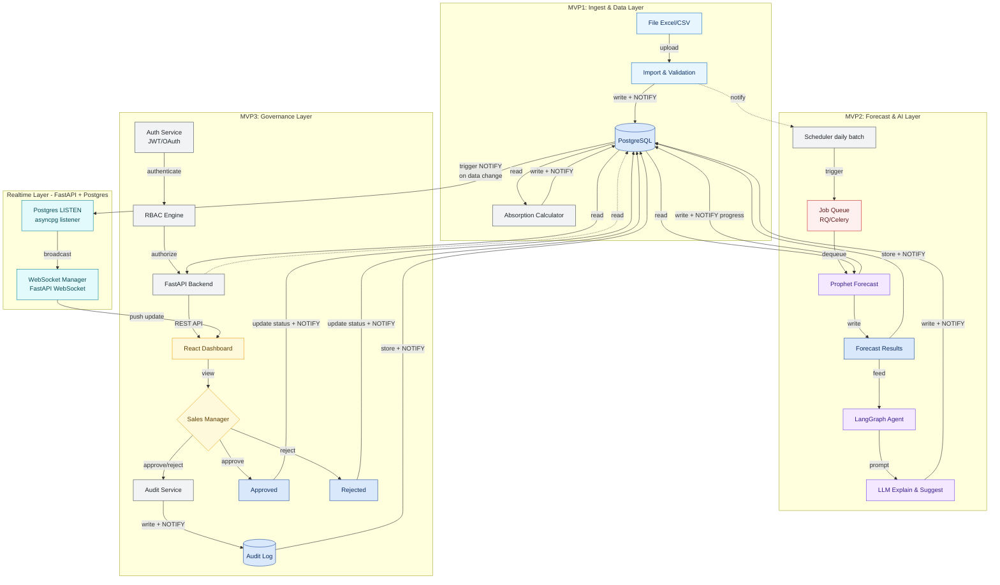
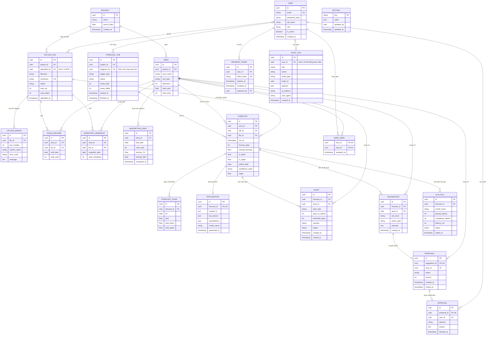

# SRS — AbsorptionForecast AI Agent (3 MVP · 5 tuần)

**Software Requirements Specification**
**Sản phẩm:** AbsorptionForecast AI Agent — Trợ lý dự báo tồn kho & tốc độ hấp thụ căn hộ
**Phiên bản:** MVP 1.0
**Nguồn:** [PRD.md](PRD.md)
**Nhóm:** G21 - T100 — Nguyễn Đức Đạt, Bùi Hoàng Vương, Nguyễn Trọng Nam, Đặng Tiến Thành
**Ngày:** 31/07/2026

---

## 1. Giới thiệu

### 1.1 Mục đích

Tài liệu này đặc tả yêu cầu phần mềm cho MVP của AbsorptionForecast AI Agent, đủ chi tiết để đội kỹ thuật (Data/AI, Backend, Frontend) triển khai theo lộ trình 3 MVP — mỗi MVP 1 tuần, xem 5.2–5.4 — cộng thời gian kiểm thử và pilot (tổng 5 tuần). Tài liệu là nguồn tham chiếu chung cho phát triển, kiểm thử và nghiệm thu.

### 1.2 Phạm vi

Hệ thống nạp dữ liệu bán hàng / tồn kho theo lô hằng ngày, tính tốc độ hấp thụ theo phân khu / loại căn, dự báo ngày dự kiến hết hàng kèm khoảng tin cậy, sinh giải thích bằng ngôn ngữ tự nhiên, xếp hạng rủi ro tồn kho và đề xuất hướng hành động. Mọi đề xuất chính sách chỉ có hiệu lực sau khi quản lý kinh doanh phê duyệt (HITL).

**Ngoài phạm vi MVP:** so sánh nhiều mô hình dự báo (ARIMA, ML khác), mô phỏng what-if, cảnh báo đa kênh (email/Zalo/Slack), tự động huấn luyện lại mô hình, kết nối API CRM/ERP, SSO/OAuth2, MFA, multi-tenant nhiều chủ đầu tư. Hệ thống không tự động thực thi thay đổi giá / chính sách, không xử lý giao dịch tài chính.

**Trong phạm vi:** dự báo chạy theo daily batch (02:00); cập nhật đẩy real-time qua WebSocket cho tiến độ job dự báo (MVP 2) và thay đổi trạng thái đề xuất (MVP 3), có fallback polling.

### 1.3 Định nghĩa & viết tắt

| Thuật ngữ | Ý nghĩa |
| --- | --- |
| Tốc độ hấp thụ | Số căn bán được trên một đơn vị thời gian của một phân khu / loại căn |
| Tỷ lệ hấp thụ | % sản phẩm đã bán trên tổng sản phẩm mở bán |
| Phân khu / loại căn | Đơn vị phân tích: nhóm căn hộ theo phân khu, diện tích, số phòng ngủ, hướng, tầng |
| Ngày dự kiến hết hàng | Ngày tồn kho của một phân khu / loại căn được dự báo về 0 theo tốc độ hấp thụ hiện tại |
| MAPE | Mean Absolute Percentage Error — thước đo sai số dự báo |
| HITL | Human-in-the-loop — bắt buộc người duyệt trước khi đề xuất có hiệu lực |
| RBAC | Role-Based Access Control — phân quyền theo vai trò |
| CI 90% | Khoảng tin cậy 90% của giá trị dự báo (cận trên / cận dưới) |
| Daily batch | Chu kỳ xử lý dữ liệu & dự báo 1 lần/ngày, chạy 02:00 |
| LangGraph | Framework điều phối pipeline agent: `load_context → summarize_stats → call_llm → validate_output → persist` |
| LISTEN/NOTIFY | Cơ chế pub/sub gốc của PostgreSQL; kênh `forecast_progress` và `proposal_events` cấp sự kiện cho WebSocket |
| JWT rotation | Mỗi lần refresh phát hành refresh token mới và thu hồi token cũ |
| Job queue | Hàng đợi tác vụ nền (RQ/Celery) chạy dự báo song song ngoài request cycle |
| MVP 1 / 2 / 3 | Ba lát cắt giao hàng: Data→Dashboard · Forecast+AI · HITL+Audit+RBAC (xem 5.2–5.4) |

---

## 2. Tổng quan hệ thống

### 2.1 Bối cảnh

Ban kinh doanh dự án căn hộ hiện theo dõi tốc độ bán bằng báo cáo Excel thủ công, cập nhật chậm và thiếu hệ thống, nên không kịp phát hiện phân khu sắp cạn hàng hoặc bán chậm để điều chỉnh giá, chiết khấu và phân bổ nguồn lực sale. Hệ thống thay thế quy trình tổng hợp thủ công này bằng một dashboard cập nhật hằng ngày, có dự báo định lượng và luồng phê duyệt có kiểm toán.

### 2.2 Tính năng MVP

| # | Tính năng | Mô tả | MVP |
| --- | --- | --- | --- |
| F1 | Nạp dữ liệu | Import Excel/CSV bán hàng & tồn kho theo template, validate theo dòng | MVP 1 |
| F2 | Tính tốc độ hấp thụ | Tổng hợp theo phân khu / loại căn, biểu đồ xu hướng theo thời gian | MVP 1 |
| F3 | Dự báo | Prophet dự báo tốc độ bán & ngày dự kiến hết hàng, kèm CI 90% | MVP 2 |
| F4 | Cảnh báo cạn hàng | Cảnh báo trong app khi số ngày tồn kho dự kiến < ngưỡng cấu hình | MVP 2 |
| F5 | Giải thích tự nhiên | LangGraph + LLM sinh đoạn giải thích tiếng Việt: yếu tố chính & giả định cho mỗi dự báo | MVP 2 |
| F6 | Xếp hạng rủi ro & đề xuất | Danh sách phân khu theo mức rủi ro tồn kho, kèm hướng hành động (siết ưu đãi / kích cầu) | MVP 2 |
| F7 | Luồng HITL | Quản lý duyệt / từ chối đề xuất; chỉ đề xuất đã duyệt mới có hiệu lực | MVP 3 |
| F8 | RBAC & audit log | Phân quyền theo vai trò; lưu lịch sử dự báo, đề xuất, quyết định | MVP 3 |
| F9 | Cập nhật real-time | WebSocket đẩy tiến độ job dự báo (MVP 2) và thay đổi trạng thái đề xuất (MVP 3); fallback polling 30s | MVP 2/3 |

### 2.3 Người dùng & quyền

| Vai trò | Mã kỹ thuật | Quyền |
| --- | --- | --- |
| Sales Staff | `sales_staff` | Xem dashboard & cảnh báo của phân khu được phân công trong `user_areas` |
| Sales Manager | `sales_manager` | Toàn quyền: import dữ liệu, cấu hình ngưỡng cảnh báo, duyệt / từ chối đề xuất, xem audit log, quản trị người dùng |
| Viewer (Ban điều hành) | `viewer` | Chỉ đọc dashboard tổng hợp toàn dự án; không xem audit log |

### 2.4 Ràng buộc kỹ thuật

- **Stack:** Python 3.11 + FastAPI async/await (API), Prophet (dự báo), LangGraph + LLM (giải thích tiếng Việt), PostgreSQL 15 + asyncpg (dữ liệu, LISTEN/NOTIFY), ReactJS (dashboard), WebSocket cho cập nhật real-time; triển khai Fly.io/Render với managed PostgreSQL, Docker Compose cho môi trường dev.
- **Chu kỳ xử lý:** job dự báo chạy 02:00 hằng ngày; không tính lại mô hình / gọi LLM quá 1 lần/ngày/phân khu trừ khi có dữ liệu mới.
- **Giới hạn upload:** file Excel/CSV tối đa 20 MB, chống trùng bằng checksum SHA-256.
- **Phiên đăng nhập:** JWT HS256, access token 30 phút, refresh token 7 ngày có rotation.
- **Quy mô pilot:** 1 dự án, 2–3 phân khu / loại căn đại diện, 3–5 Sales Staff + 1 Sales Manager.
- **Dữ liệu vào:** chỉ Excel/CSV theo template; dữ liệu khách hàng đã ẩn danh trước khi nạp.
- **Dữ liệu tối thiểu:** số căn bán được theo ngày, theo phân khu / loại căn, tối thiểu vài tháng lịch sử.
- **Mặc định cấu hình:** ngưỡng cảnh báo 30 ngày tồn kho dự kiến; khoảng tin cậy hiển thị 90%.

---

## 3. Yêu cầu chức năng

Ưu tiên: **P0** = bắt buộc để nghiệm thu MVP · **P1** = cần cho pilot · **P2** = làm nếu còn thời gian.

| ID | Tên | Mô tả | Ưu tiên |
| --- | --- | --- | --- |
| FR-001 | Import dữ liệu Excel/CSV | Sales Manager tải lên file bán hàng & tồn kho theo template quy định | P0 |
| FR-002 | Validate dữ liệu đầu vào | Kiểm tra thiếu trường, sai định dạng, trùng bản ghi; báo lỗi theo số dòng, không ghi đè dữ liệu hợp lệ đã có | P0 |
| FR-003 | Tính tốc độ hấp thụ | Tổng hợp số căn bán / đơn vị thời gian theo phân khu / loại căn | P0 |
| FR-004 | Biểu đồ xu hướng | Hiển thị tốc độ hấp thụ theo thời gian cho từng phân khu / loại căn | P0 |
| FR-005 | Job dự báo hằng ngày | Chạy Prophet theo lịch mỗi ngày cho từng phân khu / loại căn có đủ dữ liệu | P0 |
| FR-006 | Dự báo ngày hết hàng | Tính ngày dự kiến tồn kho về 0 từ dự báo tốc độ bán và tồn kho hiện tại | P0 |
| FR-007 | Khoảng tin cậy | Mọi số liệu dự báo hiển thị kèm CI 90% (cận trên / cận dưới) | P0 |
| FR-008 | Nhãn độ tin cậy thấp | Gắn nhãn "độ tin cậy thấp" cho dự báo dựa trên dữ liệu mỏng | P1 |
| FR-009 | Cảnh báo cạn hàng | Sinh cảnh báo trong app khi số ngày tồn kho dự kiến < ngưỡng cấu hình | P0 |
| FR-010 | Cấu hình ngưỡng cảnh báo | Sales Manager chỉnh ngưỡng ngày cảnh báo (mặc định 30 ngày) | P1 |
| FR-011 | Giải thích bằng LLM | Sinh đoạn giải thích tiếng Việt nêu yếu tố chính (xu hướng, mùa vụ, thay đổi tồn kho) và giả định | P0 |
| FR-012 | Xếp hạng rủi ro tồn kho | Xếp hạng phân khu / loại căn theo mức rủi ro tồn kho từ dự báo và tồn kho hiện tại | P0 |
| FR-013 | Đề xuất hướng hành động | Với mỗi nhóm rủi ro, Agent đề xuất siết ưu đãi hoặc kích cầu | P0 |
| FR-014 | Trạng thái đề xuất | Đề xuất mặc định *Chờ duyệt*; chỉ *Đã duyệt* mới được đánh dấu có hiệu lực | P0 |
| FR-015 | Duyệt / từ chối (HITL) | Sales Manager duyệt hoặc từ chối kèm lý do | P0 |
| FR-016 | Audit log | Ghi mọi dự báo, đề xuất, quyết định kèm người thực hiện, thời điểm, phiên bản dữ liệu đầu vào | P0 |
| FR-017 | Tra cứu lịch sử | Màn hình / API tra cứu lịch sử dự báo và quyết định HITL | P1 |
| FR-018 | Xác thực & RBAC | Đăng nhập qua `POST /api/auth/login` trả access token (30 phút) + refresh token (7 ngày, rotation); `RBACGuard` chặn ở tầng API: Sales Staff chỉ thấy phân khu trong `user_areas`, Manager thấy toàn dự án, Viewer chỉ đọc | P0 |
| FR-019 | Báo cáo MAPE | Tính MAPE trên tập kiểm chứng của dữ liệu pilot và hiển thị theo phân khu | P1 |
| FR-020 | Đếm lượt gọi LLM | Ghi nhận số lần gọi LLM / mô hình vào `llm_calls` để theo dõi chi phí | P2 |
| FR-021 | Tiến độ job real-time | Client subscribe `/ws/forecast-jobs`; server đẩy `job.started`, `job.area_done`, `job.completed`, `job.failed` từ kênh `NOTIFY forecast_progress` | P1 |
| FR-022 | Cập nhật đề xuất real-time | `/ws/proposals` đẩy `proposal.created`, `proposal.approved`, `proposal.rejected`, `alert.opened` từ kênh `NOTIFY proposal_events`; `ProposalInbox` cập nhật không cần reload | P1 |
| FR-023 | Reconnect & fallback | Heartbeat ping 20s; auto-reconnect backoff 1s → 30s; sau 3 lần thất bại chuyển polling (`/api/forecasts/jobs/{job_id}` 5s, `/api/proposals?status=pending` 30s) | P1 |

**Event schema chung cho `/ws/forecast-jobs` và `/ws/proposals`:**

```json
{
  "event": "job.area_done",
  "job_id": "uuid",
  "area_id": "uuid",
  "payload": { "processed": 12, "total": 40 },
  "ts": "2026-08-01T02:14:07Z"
}
```

---

## 4. Yêu cầu phi chức năng

### 4.1 Hiệu năng

| ID | Yêu cầu |
| --- | --- |
| NFR-P1 | Biểu đồ tốc độ hấp thụ (`GET /api/absorption`) render < 2 giây ở quy mô pilot; p95 thời gian phản hồi API đọc < 500 ms |
| NFR-P2 | Job dự báo hoàn tất < 10 phút cho 500 phân khu, chạy song song qua job queue (RQ/Celery); quy mô pilot < 2 phút |
| NFR-P3 | Độ trễ từ khi import dữ liệu đến khi dashboard & cảnh báo phản ánh dữ liệu mới < 24 giờ |
| NFR-P4 | Import file quy mô pilot trả kết quả validate trong < 60 giây |
| NFR-P5 | Không tính lại mô hình / gọi LLM quá 1 lần/ngày/phân khu trừ khi có dữ liệu mới |
| NFR-P6 | Backend dùng FastAPI async/await; toàn bộ truy vấn qua asyncpg connection pool (min 5 / max 20), không blocking I/O trong event loop |
| NFR-P7 | Một instance chịu tối thiểu 50 kết nối WebSocket đồng thời ở quy mô pilot |

### 4.2 Bảo mật

| ID | Yêu cầu |
| --- | --- |
| NFR-S1 | Xác thực bắt buộc cho mọi endpoint trừ health check |
| NFR-S2 | RBAC 3 vai trò (Sales Staff / Sales Manager / Viewer); kiểm tra quyền ở tầng API, không chỉ ở UI |
| NFR-S3 | Chỉ Sales Manager được import dữ liệu, cấu hình ngưỡng và duyệt đề xuất |
| NFR-S4 | Dữ liệu bán hàng chỉ lưu trong hạ tầng nội bộ / môi trường pilot được kiểm soát |
| NFR-S5 | Dữ liệu gửi tới LLM chỉ gồm số liệu tổng hợp theo phân khu, không chứa thông tin định danh khách hàng |
| NFR-S6 | Secrets (API key LLM, DB credentials) nạp qua biến môi trường, không commit vào repo |
| NFR-S7 | JWT HS256; access token TTL 30 phút; refresh token TTL 7 ngày **có rotation** — token cũ bị thu hồi ngay khi refresh; claims `sub`, `role`, `jti`, `exp` |
| NFR-S8 | Mật khẩu băm bcrypt **cost 12**, tối thiểu 10 ký tự; không ghi giá trị mật khẩu ở bất kỳ mức log nào |
| NFR-S9 | CORS whitelist tường minh (`https://<app>.fly.dev`, `http://localhost:3000` chỉ ở dev), `allow_credentials=true`, cấm wildcard `*` |
| NFR-S10 | Rate limit `POST /api/auth/login` 5 lần/phút/IP; khoá tài khoản 15 phút sau 10 lần sai liên tiếp |
| NFR-S11 | Production bắt buộc HTTPS; cookie refresh token `httpOnly` + `Secure` + `SameSite=Lax` |
| NFR-S12 | Kết nối WebSocket (`/ws/forecast-jobs`, `/ws/proposals`) bắt buộc JWT khi handshake; chỉ đẩy event thuộc phạm vi phân khu của người dùng |

### 4.3 Logging & kiểm toán

| ID | Yêu cầu |
| --- | --- |
| NFR-L1 | Bảng `audit_logs` bất biến — role ứng dụng chỉ được cấp `INSERT`/`SELECT`, **không** `UPDATE`/`DELETE`; áp dụng cho dự báo, đề xuất và quyết định duyệt / từ chối |
| NFR-L2 | Mỗi bản ghi audit gồm: actor, vai trò, hành động, đối tượng, thời điểm (UTC), phiên bản dữ liệu đầu vào |
| NFR-L3 | Log ứng dụng có cấu trúc (JSON), phân mức INFO/WARN/ERROR, kèm request id |
| NFR-L4 | Ghi log mỗi lần chạy job dự báo: thời gian chạy, số phân khu xử lý, số lỗi |
| NFR-L5 | Log không chứa dữ liệu định danh khách hàng |
| NFR-L6 | Ghi mỗi lượt gọi LLM vào `llm_calls`: model, prompt/completion tokens, `latency_ms`, status — phục vụ theo dõi chi phí (FR-020) |
| NFR-L7 | Xuất metric vận hành: MAPE theo lần chạy, thời gian job dự báo, số kết nối WebSocket đang mở |

### 4.4 Độ tin cậy & khả năng mở rộng

| ID | Yêu cầu |
| --- | --- |
| NFR-R1 | 100% dự báo đi kèm khoảng tin cậy và giả định (nguồn dữ liệu, khung thời gian) |
| NFR-R2 | Job dự báo lỗi ở một phân khu không làm dừng các phân khu còn lại |
| NFR-R3 | Import thất bại không để dữ liệu ở trạng thái dở dang (transaction hoặc rollback) |
| NFR-R4 | Schema và API gắn `project_id` để mở rộng sang dự án khác mà không đổi cấu trúc |
| NFR-R5 | WebSocket tự reconnect với backoff luỹ tiến 1s → 30s, heartbeat ping 20s; mất kết nối không làm mất dữ liệu vì client refetch trạng thái khi reconnect |
| NFR-R6 | Khi WebSocket không khả dụng, UI tự chuyển polling (30s cho dashboard/đề xuất, 5s cho tiến độ job) — real-time là tối ưu trải nghiệm, không phải điều kiện hoạt động |
| NFR-R7 | Listener `asyncpg` LISTEN tự kết nối lại khi mất kết nối Postgres; event bỏ lỡ được bù bằng refetch, không cần hàng đợi bền vững |
| NFR-R8 | Migration cộng dồn theo MVP (Alembic): MVP 1 → 2 → 3 chỉ **thêm** bảng/cột, không breaking change; bảng `suggestions` (MVP 2) được `proposals` (MVP 3) tham chiếu qua FK, không đổi tên |
| NFR-R9 | Mọi migration chạy được tiến/lùi (`upgrade`/`downgrade`) trên bản sao dữ liệu pilot trước khi áp production |
| NFR-R10 | Môi trường: Docker Compose (FastAPI + PostgreSQL + worker) cho dev; production Fly.io/Render với managed PostgreSQL và daily backup |

---

## 5. Kiến trúc

### 5.1 Sơ đồ kiến trúc tổng (3 tuần)



### 5.2 MVP 1: Data → Dashboard (1 week)

**Goal**: Sales Manager upload file Excel/CSV bán hàng & tồn kho, hệ thống validate theo dòng và lưu vào PostgreSQL; người dùng xem được biểu đồ tốc độ hấp thụ theo phân khu trên dashboard. Chưa có dự báo, AI, xác thực hay phê duyệt.

#### Backend (FastAPI)

| Endpoint | Method | Purpose |
|---|---|---|
| `/api/health` | GET | Health check hạ tầng & kết nối DB |
| `/api/files/upload` | POST | Upload Excel/CSV (multipart), khởi tạo bản ghi `upload_files`, chạy parse nền |
| `/api/files` | GET | Lịch sử upload, phân trang theo `uploaded_at` |
| `/api/files/{file_id}/status` | GET | Trạng thái parse (`pending`/`parsing`/`done`/`failed`) + số dòng OK/lỗi |
| `/api/files/{file_id}/errors` | GET | Danh sách lỗi validate theo số dòng và tên cột |
| `/api/areas` | GET | Danh sách phân khu / loại căn kèm tồn kho hiện tại |
| `/api/absorption` | GET | Chuỗi tốc độ hấp thụ theo `area_id`, `from`, `to`, `granularity=day\|week` |
| `/api/absorption/summary` | GET | Tổng hợp toàn dự án: tồn kho, đã bán, tốc độ trung bình 30 ngày |

**Services**:
- `FileUploadService`: nhận multipart, giới hạn dung lượng 20 MB, lưu file gốc, tạo `upload_files` với checksum SHA-256 để chặn upload trùng.
- `ExcelParserService`: đọc Excel/CSV bằng `pandas`/`openpyxl`, ánh xạ cột theo template cố định.
- `ValidationService`: kiểm tra cột bắt buộc, kiểu ngày, số căn âm, phân khu không tồn tại, bản ghi trùng khoá `(area_id, date)`; trả lỗi theo dòng; ghi dữ liệu trong một transaction, rollback toàn bộ nếu tỷ lệ lỗi vượt ngưỡng.
- `AbsorptionCalculatorService`: tính số căn bán và tốc độ hấp thụ theo ngày / tuần cho từng phân khu, ghi bảng tổng hợp `absorption_daily`.
- `AreaService`: CRUD đọc phân khu, join tồn kho mới nhất từ `inventory_snapshots`.

**Database Tables**:
- `projects`: id (PK), name, launch_date, created_at
- `areas`: id (PK), project_id (FK), area_name, unit_type, bedrooms, area_sqm, total_units
- `upload_files`: id (PK), project_id (FK), filename, checksum, status, rows_ok, rows_failed, uploaded_by (FK, **NULL** ở MVP 1 vì chưa có bảng `users`), uploaded_at
- `upload_errors`: id (PK), file_id (FK), row_number, column_name, error_code, message
- `sales_records`: id (PK), area_id (FK), file_id (FK), sold_date, units_sold
- `inventory_snapshots`: id (PK), area_id (FK), file_id (FK), snapshot_date, units_remaining
- `absorption_daily`: id (PK), area_id (FK), stat_date, units_sold, velocity_7d, velocity_30d, computed_at *(tên cột là `stat_date`, không dùng `date` vì trùng tên kiểu của PostgreSQL)*
- Indexes: `sales_records(area_id, sold_date)` · `inventory_snapshots(area_id, snapshot_date DESC)` · `absorption_daily(area_id, date)` UNIQUE · `upload_files(checksum)` UNIQUE · `upload_errors(file_id, row_number)`

#### Frontend (React)
- `UploadPage`: kéo-thả file, hiển thị thanh tiến độ upload, chặn file sai định dạng phía client.
- `FileStatusTable`: lịch sử upload, trạng thái parse, số dòng OK/lỗi, link mở chi tiết lỗi.
- `ValidationErrorPanel`: bảng lỗi theo dòng/cột, cho phép tải file lỗi dạng CSV.
- `AreaSelector`: chọn 1 hoặc nhiều phân khu / loại căn để lọc dashboard.
- `AbsorptionChart`: line chart tốc độ hấp thụ theo thời gian (Recharts), chuyển đổi ngày/tuần.
- `SummaryCards`: tồn kho còn lại, đã bán, tốc độ trung bình 30 ngày, mốc cập nhật gần nhất.

**Real-time**: chưa dùng WebSocket. `UploadPage` polling `GET /api/files/{file_id}/status` mỗi **3 giây**, dừng khi `done`/`failed` hoặc sau **2 phút** timeout. Dashboard polling `GET /api/absorption` mỗi **30 giây** khi tab đang active (dừng polling khi tab ẩn), kèm nút Refresh thủ công.

**Not Included in MVP 1**:
- ❌ Dự báo Prophet, ngày dự kiến hết hàng, khoảng tin cậy
- ❌ Giải thích LLM / LangGraph agent
- ❌ Xác thực, JWT, RBAC (API mở trong môi trường dev nội bộ)
- ❌ Luồng phê duyệt HITL và audit log
- ❌ WebSocket / cập nhật đẩy real-time

---

### 5.3 MVP 2: Forecast + AI → Dashboard (1 week)

**Goal**: Chạy Prophet theo lịch hằng ngày để dự báo tốc độ bán và ngày dự kiến hết hàng kèm CI 90%, dùng LangGraph + LLM sinh giải thích tiếng Việt và đề xuất hướng hành động, hiển thị kèm cảnh báo cạn hàng trên dashboard. Kế thừa toàn bộ endpoint và bảng của MVP 1.

#### Backend (FastAPI)

| Endpoint | Method | Purpose |
|---|---|---|
| *(kế thừa MVP 1)* | — | `/api/files/*`, `/api/areas`, `/api/absorption*` giữ nguyên hợp đồng |
| `/api/forecasts/run` | POST | Kích hoạt job dự báo thủ công (body: `area_ids[]`); chặn nếu đã chạy trong ngày và không có dữ liệu mới |
| `/api/forecasts/jobs/{job_id}` | GET | Trạng thái & tiến độ job (fallback khi WebSocket lỗi) |
| `/api/forecasts` | GET | Dự báo mới nhất theo `area_id`: velocity, `ci_lower`, `ci_upper`, `sellout_date`, `confidence_label` |
| `/api/forecasts/{forecast_id}` | GET | Chi tiết một lần dự báo kèm chuỗi điểm dự báo |
| `/api/forecasts/{forecast_id}/explanation` | GET | Đoạn giải thích LLM: yếu tố chính + giả định |
| `/api/forecasts/metrics` | GET | MAPE theo phân khu trên tập kiểm chứng |
| `/api/alerts` | GET | Cảnh báo cạn hàng đang mở, lọc theo `area_id`, `severity` |
| `/api/suggestions` | GET | Danh sách đề xuất xếp theo mức rủi ro tồn kho (read-only ở MVP 2) |
| `/api/settings/alert-threshold` | GET / PUT | Xem & cập nhật ngưỡng ngày cảnh báo (mặc định 30) |
| `/ws/forecast-jobs` | WS | Kênh đẩy tiến độ job dự báo |

**Services**:
- `ForecastJobRunner`: scheduler (APScheduler) chạy 02:00 hằng ngày, tạo `forecast_jobs`, xử lý từng phân khu độc lập — lỗi một phân khu không dừng các phân khu còn lại.
- `ForecastService`: huấn luyện & dự báo Prophet cho từng phân khu, `interval_width=0.90`, gắn `confidence_label='low'` khi < 60 điểm dữ liệu.
- `SelloutEstimator`: suy ra ngày tồn kho về 0 từ velocity dự báo và tồn kho mới nhất; trả `null` khi velocity ≈ 0.
- `RiskRankingService`: chấm điểm rủi ro tồn kho (days-to-sellout, độ lệch velocity 7d/30d) → `high`/`medium`/`low`.
- `AgentOrchestrator` (LangGraph): pipeline `load_context → summarize_stats → call_llm → validate_output → persist`; chỉ truyền số liệu tổng hợp theo phân khu, không có dữ liệu định danh khách hàng.
- `LLMExplainService`: sinh giải thích tiếng Việt + đề xuất siết ưu đãi / kích cầu; timeout 30s, retry 1 lần, fallback template tĩnh khi LLM lỗi.
- `AlertService`: so ngày hết hàng dự báo với ngưỡng cấu hình, tạo/đóng `alerts` idempotent theo `(area_id, forecast_id)`.
- `MetricsService`: tính MAPE trên tập kiểm chứng và đếm lượt gọi LLM để theo dõi chi phí.
- `JobEventPublisher`: phát sự kiện tiến độ job qua WebSocket Manager.

**Database Tables** *(cộng dồn trên MVP 1)*:
- `forecast_jobs`: id (PK), project_id (FK), triggered_by (FK, **NULL** khi `trigger_type='schedule'`), trigger_type (`schedule`/`manual`), status, started_at, finished_at, areas_total, areas_failed
- `forecasts`: id (PK), area_id (FK), job_id (FK), **file_id (FK → `upload_files`, NOT NULL)**, run_at, horizon_days, velocity_forecast, ci_lower, ci_upper, sellout_date, confidence_label, mape
- `forecast_points`: id (PK), forecast_id (FK), ds (date), yhat, yhat_lower, yhat_upper
- `explanations`: id (PK), forecast_id (FK), content_vi, key_factors (JSONB), assumptions (JSONB), model_name, generated_at
- `alerts`: id (PK), forecast_id (FK), area_id (FK), alert_type, days_to_sellout, threshold_days, severity, status, created_at, closed_at
- `suggestions`: id (PK), forecast_id (FK), area_id (FK), risk_level, action_type (`tighten_discount`/`stimulate_demand`), rationale, created_at
- `llm_calls`: id (PK), forecast_id (FK), model_name, prompt_tokens, completion_tokens, latency_ms, status, called_at
- `settings`: key (PK), value (JSONB), updated_by *(metadata, không phải quan hệ nghiệp vụ)*, updated_at
- Indexes: `forecasts(area_id, run_at DESC)` · `forecasts(job_id)` · `forecasts(file_id)` · `forecast_points(forecast_id, ds)` · `alerts(status, severity)` partial `WHERE status='open'` · `suggestions(risk_level, created_at DESC)` · `llm_calls(called_at)`
- Unique constraints: `explanations(forecast_id)` UNIQUE — ép quan hệ 1–0..1 với `forecasts` ở tầng DB, không chỉ ở sơ đồ

#### Frontend (React)
- `ForecastCard`: velocity dự báo, ngày dự kiến hết hàng, dải CI 90%, badge "độ tin cậy thấp".
- `ForecastChart`: chồng đường lịch sử và đường dự báo, tô vùng CI 90%.
- `ExplanationPanel`: đoạn giải thích tiếng Việt, danh sách yếu tố chính và giả định đã dùng.
- `AlertBanner` / `AlertList`: cảnh báo cạn hàng theo mức nghiêm trọng, dẫn tới phân khu tương ứng.
- `RiskRankingTable`: bảng phân khu xếp theo mức rủi ro kèm hướng hành động đề xuất (chưa có nút duyệt).
- `ForecastJobProgress`: tiến độ job dự báo theo thời gian thực (n/N phân khu đã xử lý).
- `ThresholdSettingsForm`: chỉnh ngưỡng ngày cảnh báo.
- `MapeReportView`: MAPE theo phân khu qua các lần chạy.

**Real-time**: WebSocket qua FastAPI tại `/ws/forecast-jobs`. Client subscribe theo `job_id`; server đẩy sự kiện `job.started`, `job.area_done`, `job.completed`, `job.failed`. Heartbeat ping 20 giây, tự reconnect với backoff 1s → 30s; nếu không kết nối được sau 3 lần, fallback polling `GET /api/forecasts/jobs/{job_id}` mỗi **5 giây**. Dữ liệu dashboard vẫn polling **30 giây** như MVP 1.

**Not Included in MVP 2**:
- ❌ Luồng phê duyệt HITL — đề xuất chỉ hiển thị, chưa có trạng thái duyệt
- ❌ Audit log và tra cứu lịch sử quyết định
- ❌ Xác thực, JWT, RBAC
- ❌ So sánh nhiều mô hình dự báo (ARIMA, ML khác), mô phỏng what-if
- ❌ Cảnh báo đa kênh (email, Zalo, Slack) và tự động huấn luyện lại mô hình

---

### 5.4 MVP 3: HITL + Audit Log + RBAC (1 week)

**Goal**: Bổ sung xác thực JWT, phân quyền theo vai trò và luồng phê duyệt HITL — đề xuất chỉ có hiệu lực sau khi Sales Manager duyệt; mọi hành động được ghi audit log append-only. Kế thừa toàn bộ endpoint và bảng của MVP 1 & 2, các endpoint cũ nay bắt buộc xác thực.

#### Backend (FastAPI)

| Endpoint | Method | Purpose |
|---|---|---|
| *(kế thừa MVP 1 & 2)* | — | Tất cả endpoint cũ trừ `/api/health` yêu cầu `Authorization: Bearer`; kết quả lọc theo phân khu được phân công |
| `/api/auth/login` | POST | Đăng nhập email + mật khẩu, trả access token + refresh token |
| `/api/auth/refresh` | POST | Cấp access token mới bằng refresh token (rotation) |
| `/api/auth/logout` | POST | Thu hồi refresh token hiện tại |
| `/api/auth/me` | GET | Thông tin người dùng, vai trò, danh sách phân khu được phân công |
| `/api/proposals` | GET | Danh sách đề xuất kèm trạng thái `pending`/`approved`/`rejected`, lọc theo `status`, `risk_level` |
| `/api/proposals/{id}` | GET | Chi tiết đề xuất + dự báo & giải thích nguồn |
| `/api/proposals/{id}/approve` | POST | Duyệt đề xuất (Manager), body: `reason` tuỳ chọn |
| `/api/proposals/{id}/reject` | POST | Từ chối đề xuất (Manager), body: `reason` **bắt buộc** |
| `/api/audit-logs` | GET | Tra cứu audit log theo `actor`, `entity_type`, khoảng thời gian |
| `/api/users` | GET / POST | Quản lý người dùng (Manager) |
| `/api/users/{id}/role` | PUT | Gán vai trò `sales_staff`/`sales_manager`/`viewer` |
| `/api/users/{id}/areas` | PUT | Gán phân khu phụ trách cho Sales Staff |
| `/ws/proposals` | WS | Kênh đẩy thay đổi trạng thái đề xuất & cảnh báo mới |

**Services**:
- `AuthService`: xác thực mật khẩu, phát hành/rotate JWT, thu hồi refresh token.
- `RBACGuard`: FastAPI dependency kiểm tra vai trò và phạm vi phân khu ở **tầng API** (không chỉ ẩn ở UI); mọi truy vấn dashboard tự áp bộ lọc `area_id IN (assigned)` với Sales Staff.
- `ProposalWorkflowService`: chuyển trạng thái `pending → approved | rejected` một chiều, chặn duyệt lại đề xuất đã đóng, đảm bảo idempotent qua `If-Match`/version.
- `AuditLogService`: ghi append-only mọi hành động (actor, vai trò, entity, payload, IP, user-agent, thời điểm UTC).
- `UserAdminService`: tạo người dùng, gán vai trò và phân khu.
- `RealtimeBroadcaster`: asyncpg `LISTEN` kênh `proposal_events`, đẩy tới WebSocket Manager.

**Database Tables** *(cộng dồn trên MVP 1 & 2)*:
- `users`: id (PK), email, password_hash, full_name, role, is_active, created_at
- `user_areas`: user_id (FK), area_id (FK), assigned_at — PK tổ hợp `(user_id, area_id)`, phân công phân khu cho Sales Staff
- `refresh_tokens`: id (PK), user_id (FK), token_hash, expires_at, revoked_at, replaced_by
- `proposals`: id (PK), suggestion_id (FK), area_id (FK), status, version, created_at, closed_at *(mở rộng từ `suggestions` của MVP 2)*
- `approvals`: id (PK), proposal_id (FK), user_id (FK), decision (`approve`/`reject`), reason, decided_at
- `audit_logs`: id (PK), user_id (FK), role, action, entity_type, entity_id, payload (JSONB), ip_address, user_agent, created_at
- Indexes: `users(email)` UNIQUE · `user_areas(user_id)` · `refresh_tokens(token_hash)` UNIQUE, `refresh_tokens(user_id, expires_at)` · `proposals(status, created_at DESC)` · `audit_logs(created_at DESC)`, `audit_logs(entity_type, entity_id)`, `audit_logs(user_id, created_at DESC)`
- Unique constraints: `approvals(proposal_id)` UNIQUE — mỗi đề xuất đúng một quyết định cuối · `proposals(suggestion_id)` UNIQUE — ép quan hệ 1–0..1 với `suggestions`
- `audit_logs.user_id` **NULL** cho hành động do hệ thống thực hiện (job dự báo theo lịch)

**Security Requirements**:
- **JWT**: HS256; access token TTL **30 phút**; refresh token TTL **7 ngày** có rotation, token cũ bị thu hồi khi refresh; claims gồm `sub`, `role`, `jti`, `exp`.
- **Mật khẩu**: bcrypt **cost 12**; tối thiểu 10 ký tự; không log giá trị mật khẩu ở bất kỳ mức log nào.
- **CORS**: whitelist tường minh (`https://<app>.fly.dev`, `http://localhost:3000` chỉ ở môi trường dev); `allow_credentials=true`; không dùng wildcard `*`.
- **Rate limit**: `/api/auth/login` tối đa 5 lần/phút/IP; khoá tạm tài khoản 15 phút sau 10 lần sai liên tiếp.
- **Audit bất biến**: role ứng dụng chỉ có quyền `INSERT`/`SELECT` trên `audit_logs`, không `UPDATE`/`DELETE`.
- **WebSocket**: bắt buộc JWT khi handshake; từ chối kết nối token hết hạn; server chỉ đẩy sự kiện thuộc phạm vi phân khu của người dùng.

#### Frontend (React)
- `LoginPage`: form đăng nhập, lưu access token trong bộ nhớ và refresh token trong cookie `httpOnly`, tự refresh trước khi hết hạn.
- `ProtectedRoute` / `RoleGuard`: chặn route theo vai trò, ẩn hành động không có quyền.
- `ProposalInbox`: danh sách đề xuất chờ duyệt, lọc theo mức rủi ro và phân khu.
- `ProposalDetailDrawer`: dự báo nguồn, giải thích LLM, nút Duyệt / Từ chối; bắt buộc nhập lý do khi từ chối.
- `ApprovalStatusBadge`: hiển thị `Chờ duyệt` / `Đã duyệt` / `Từ chối` kèm người quyết định và thời điểm.
- `AuditLogTable`: tra cứu lịch sử theo người dùng, loại thực thể, khoảng thời gian; phân trang server-side.
- `UserAdminPage`: quản lý người dùng, gán vai trò và phân khu (chỉ Sales Manager).

**Real-time**: WebSocket qua FastAPI tại `/ws/proposals`, nguồn sự kiện là **Postgres LISTEN/NOTIFY** — trigger trên `proposals` và `alerts` phát `NOTIFY proposal_events`, listener asyncpg trong tiến trình FastAPI nhận và broadcast tới các kết nối có quyền. Sự kiện: `proposal.created`, `proposal.approved`, `proposal.rejected`, `alert.opened`. Nhờ đó `ProposalInbox` của Sales Staff cập nhật ngay khi Manager ra quyết định, không cần reload. Fallback polling `GET /api/proposals?status=pending` mỗi **30 giây** khi WebSocket không khả dụng.

**Not Included in MVP 3**:
- ❌ SSO / OAuth2 / đăng nhập bằng tài khoản doanh nghiệp
- ❌ Xác thực đa yếu tố (MFA)
- ❌ Thông báo ngoài ứng dụng (email, Zalo, Slack) khi có đề xuất chờ duyệt
- ❌ Xuất audit log ra SIEM hoặc lưu trữ dài hạn ngoài PostgreSQL
- ❌ Phân quyền chi tiết theo từng trường dữ liệu và mô hình multi-tenant nhiều chủ đầu tư

---

### 5.5 Feature Summary by MVP

| Feature | MVP 1 | MVP 2 | MVP 3 |
|---|---|---|---|
| Upload & validate Excel/CSV theo dòng | ✅ | ✅ | ✅ |
| Dashboard tốc độ hấp thụ (biểu đồ xu hướng) | ✅ | ✅ | ✅ |
| Dự báo Prophet + CI 90% | ❌ | ✅ | ✅ |
| Ngày dự kiến hết hàng & cảnh báo cạn hàng | ❌ | ✅ | ✅ |
| Giải thích tiếng Việt bằng LangGraph + LLM | ❌ | ✅ | ✅ |
| Xếp hạng rủi ro & đề xuất hành động | ❌ | ✅ (read-only) | ✅ |
| Báo cáo MAPE & theo dõi lượt gọi LLM | ❌ | ✅ | ✅ |
| Luồng phê duyệt HITL (duyệt / từ chối) | ❌ | ❌ | ✅ |
| Audit log append-only & tra cứu lịch sử | ❌ | ❌ | ✅ |
| Xác thực JWT + RBAC 3 vai trò | ❌ | ❌ | ✅ |
| Cập nhật real-time qua WebSocket | ❌ (polling 30s) | ✅ (tiến độ job) | ✅ (LISTEN/NOTIFY cho đề xuất) |

---

### 5.6 ERD

Mô hình dữ liệu cộng dồn theo 3 MVP. **Tên thực thể trong ERD khớp 1–1 với tên bảng vật lý ở 5.2–5.4** (`AREA` ↔ `areas`, `UPLOAD_FILE` ↔ `upload_files`…), khoá ngoại dùng đúng tên cột (`area_id`, `file_id`).


### 5.7 Ghi chú mô hình dữ liệu

Phần này diễn giải sơ đồ ở 5.6. **Sơ đồ 5.6 là nguồn sự thật**; mọi khẳng định dưới đây đều đọc trực tiếp từ sơ đồ. Những gì sơ đồ không thể hiện được liệt kê riêng ở cuối.

#### 5.7.1 Quan hệ & cardinality

29 quan hệ, ký hiệu Mermaid đọc theo dạng `trái → phải`.

| Thực thể cha | Ký hiệu | Thực thể con | Cardinality | Ý nghĩa |
| --- | --- | --- | --- | --- |
| `PROJECT` | `\|\|--o{` | `AREA` | 1 → 0..N | gồm |
| `PROJECT` | `\|\|--o{` | `UPLOAD_FILE` | 1 → 0..N | nhận dữ liệu |
| `USER` | `o\|--o{` | `UPLOAD_FILE` | 0..1 → 0..N | tải lên |
| `UPLOAD_FILE` | `\|\|--o{` | `UPLOAD_ERROR` | 1 → 0..N | sinh lỗi validate |
| `UPLOAD_FILE` | `\|\|--o{` | `SALES_RECORD` | 1 → 0..N | nạp |
| `UPLOAD_FILE` | `\|\|--o{` | `INVENTORY_SNAPSHOT` | 1 → 0..N | nạp |
| `AREA` | `\|\|--o{` | `SALES_RECORD` | 1 → 0..N | ghi nhận bán |
| `AREA` | `\|\|--o{` | `INVENTORY_SNAPSHOT` | 1 → 0..N | có tồn kho |
| `AREA` | `\|\|--o{` | `ABSORPTION_DAILY` | 1 → 0..N | được tính hấp thụ |
| `USER` | `o\|--o{` | `FORECAST_JOB` | 0..1 → 0..N | kích hoạt |
| `FORECAST_JOB` | `\|\|--o{` | `FORECAST` | 1 → 0..N | sinh ra |
| `AREA` | `\|\|--o{` | `FORECAST` | 1 → 0..N | được dự báo |
| `UPLOAD_FILE` | `\|\|--o{` | `FORECAST` | 1 → 0..N | là nguồn chính |
| `FORECAST` | `\|\|--o{` | `FORECAST_POINT` | 1 → 0..N | gồm chuỗi điểm |
| `FORECAST` | `\|\|--o\|` | `EXPLANATION` | 1 → 0..1 | kèm giải thích |
| `FORECAST` | `\|\|--o{` | `ALERT` | 1 → 0..N | sinh cảnh báo |
| `FORECAST` | `\|\|--o{` | `SUGGESTION` | 1 → 0..N | dẫn tới đề xuất |
| `FORECAST` | `\|\|--o{` | `LLM_CALL` | 1 → 0..N | ghi nhận lượt gọi |
| `AREA` | `\|\|--o{` | `ALERT` | 1 → 0..N | thuộc về |
| `AREA` | `\|\|--o{` | `SUGGESTION` | 1 → 0..N | thuộc về |
| `USER` | `\|\|--o{` | `USER_AREA` | 1 → 0..N | được gán |
| `AREA` | `\|\|--o{` | `USER_AREA` | 1 → 0..N | được phân công |
| `USER` | `\|\|--o{` | `REFRESH_TOKEN` | 1 → 0..N | sở hữu |
| `REFRESH_TOKEN` | `o\|--o\|` | `REFRESH_TOKEN` | 0..1 → 0..1 | thay thế bởi (tự tham chiếu) |
| `SUGGESTION` | `\|\|--o\|` | `PROPOSAL` | 1 → 0..1 | chuyển thành |
| `AREA` | `\|\|--o{` | `PROPOSAL` | 1 → 0..N | thuộc về |
| `PROPOSAL` | `\|\|--o\|` | `APPROVAL` | 1 → 0..1 | được quyết định |
| `USER` | `\|\|--o{` | `APPROVAL` | 1 → 0..N | thực hiện |
| `USER` | `o\|--o{` | `AUDIT_LOG` | 0..1 → 0..N | ghi nhận |

`USER_AREA` là bảng nối hiện thực quan hệ **N–N** giữa `USER` và `AREA` — đây là phạm vi dữ liệu mà `RBACGuard` áp cho vai trò `sales_staff`. Không có quan hệ N–N nào khác trong mô hình.

#### 5.7.2 Khoá chính

- **21/21 thực thể đều có khoá chính.** 19 thực thể dùng `uuid id`.
- `USER_AREA` dùng **khoá chính tổ hợp** `(user_id, area_id)`; cả hai cột đồng thời là khoá ngoại.
- `SETTING` dùng `string key` làm khoá chính, không dùng surrogate id.

#### 5.7.3 Khoá ngoại

| Thực thể | Cột khoá ngoại |
| --- | --- |
| `AREA` | `project_id` |
| `UPLOAD_FILE` | `project_id`, `uploaded_by` |
| `UPLOAD_ERROR` | `file_id` |
| `SALES_RECORD` | `area_id`, `file_id` |
| `INVENTORY_SNAPSHOT` | `area_id`, `file_id` |
| `ABSORPTION_DAILY` | `area_id` |
| `FORECAST_JOB` | `project_id`, `triggered_by` |
| `FORECAST` | `area_id`, `job_id`, `file_id` |
| `FORECAST_POINT` | `forecast_id` |
| `EXPLANATION` | `forecast_id` |
| `ALERT` | `forecast_id`, `area_id` |
| `SUGGESTION` | `forecast_id`, `area_id` |
| `LLM_CALL` | `forecast_id` |
| `USER_AREA` | `user_id`, `area_id` |
| `REFRESH_TOKEN` | `user_id`, `replaced_by` |
| `PROPOSAL` | `suggestion_id`, `area_id` |
| `APPROVAL` | `proposal_id`, `user_id` |
| `AUDIT_LOG` | `user_id` |

`PROJECT`, `USER`, `SETTING` không có khoá ngoại — là ba gốc của mô hình.

#### 5.7.4 UNIQUE

| Thực thể | Cột | Mục đích |
| --- | --- | --- |
| `UPLOAD_FILE` | `checksum` | Chặn upload trùng file |
| `USER` | `email` | Định danh đăng nhập |
| `REFRESH_TOKEN` | `token_hash` | Mỗi token là duy nhất |
| `EXPLANATION` | `forecast_id` | Ép quan hệ 1–0..1 với `FORECAST` |
| `PROPOSAL` | `suggestion_id` | Ép quan hệ 1–0..1 với `SUGGESTION` |
| `APPROVAL` | `proposal_id` | Ép quan hệ 1–0..1 với `PROPOSAL` |

Ba UNIQUE cuối là cơ chế duy nhất khiến các quan hệ 0..1 được bảo đảm ở tầng dữ liệu, không chỉ ở hình vẽ.

#### 5.7.5 Cột cho phép NULL

Sơ đồ chỉ đánh dấu tường minh ba cột. Mọi cột khác mặc định hiểu là NOT NULL.

| Cột | Điều kiện NULL |
| --- | --- |
| `UPLOAD_FILE.uploaded_by` | MVP 1 chưa có bảng `users` nên chưa có người tải lên để tham chiếu |
| `FORECAST_JOB.triggered_by` | Job chạy theo lịch 02:00 không có người kích hoạt |
| `AUDIT_LOG.user_id` | Hành động do hệ thống thực hiện, không có actor là người |

Ba cột này chính là lý do các quan hệ tương ứng vẽ `o|--o{` (0..1 → 0..N) thay vì `||--o{`.

#### 5.7.6 Kiểu dữ liệu

Sơ đồ dùng 9 kiểu ở mức khái niệm: `uuid`, `string`, `text`, `int`, `numeric`, `boolean`, `date`, `timestamp`, `json`. Kiểu của từng cột đọc trực tiếp trên sơ đồ 5.6.

- `numeric` dùng cho số liệu dự báo và tốc độ hấp thụ — chọn số thập phân chính xác thay vì dấu phẩy động.
- `json` dùng cho `EXPLANATION.key_factors`, `EXPLANATION.assumptions`, `SETTING.value`, `AUDIT_LOG.payload`.
- `date` cho mốc ngày nghiệp vụ (`sold_date`, `snapshot_date`, `stat_date`, `sellout_date`, `ds`, `launch_date`); `timestamp` cho mốc thời điểm hệ thống.

#### 5.7.7 Quy tắc nghiệp vụ đọc được từ sơ đồ

- **Chuỗi truy vết** `APPROVAL → PROPOSAL → SUGGESTION → FORECAST → UPLOAD_FILE`: `FORECAST.file_id` là mắt xích bắt buộc, nên từ một quyết định phê duyệt luôn truy ngược được về lô dữ liệu đầu vào đã sinh ra dự báo (SRS §7.2 · NFR-L2).
- **Mỗi đề xuất có tối đa một quyết định cuối cùng** — `PROPOSAL ||--o| APPROVAL`. Khớp `ProposalWorkflowService`: trạng thái chuyển một chiều `pending → approved | rejected`, chặn duyệt lại đề xuất đã đóng. Lịch sử thao tác giữ ở `AUDIT_LOG`, không nhân bản trong `APPROVAL`.
- **Đề xuất của MVP 2 chỉ trở thành đối tượng phê duyệt khi vào luồng HITL của MVP 3** — `SUGGESTION ||--o| PROPOSAL` cho phép `SUGGESTION` tồn tại mà chưa có `PROPOSAL`.
- **`SETTING` là cấu hình toàn cục**, khoá theo `key`, không thuộc sở hữu người dùng nào. `updated_by` **không** mang nhãn FK và không có cạnh quan hệ — chỉ là metadata ghi ai sửa lần cuối.
- **`AUDIT_LOG` là bảng đa hình**: khoá ngoại duy nhất là `USER`; thực thể bị tác động trỏ mềm qua cặp `(entity_type, entity_id)`, nên sơ đồ không vẽ cạnh từ `PROPOSAL` hay `FORECAST` sang `AUDIT_LOG`.
- **`ALERT.area_id`, `SUGGESTION.area_id`, `PROPOSAL.area_id` là denormalize có chủ đích** — cả ba đều có đồng thời cạnh từ `AREA` và từ `FORECAST`/`SUGGESTION`, cho phép lọc theo phân khu phục vụ RBAC mà không phải join ngược qua `FORECAST`.
- **`REFRESH_TOKEN` tự tham chiếu** qua `replaced_by` — phục vụ cơ chế JWT rotation, lần refresh sau trỏ về token bị thay thế.

#### 5.7.8 Những gì sơ đồ 5.6 không thể hiện

Các mục dưới đây **không đọc được từ ERD**, xem đặc tả tương ứng ở 5.2–5.4 hoặc chốt khi viết migration:

| Hạng mục | Nơi tra cứu |
| --- | --- |
| Index (kể cả partial index) | Danh sách *Indexes* ở 5.2, 5.3, 5.4 |
| Hành vi `ON DELETE` / `ON UPDATE` của khoá ngoại | Chưa đặc tả — quyết định khi viết migration |
| Tập giá trị hợp lệ của `status`, `role`, `decision`, `action_type`, `risk_level`, `trigger_type`, `severity`, `confidence_label`, `alert_type` | 5.2–5.4 nêu một phần; phần còn lại chưa đặc tả |
| Giá trị hợp lệ của `AUDIT_LOG.entity_type` | Chưa đặc tả |
| Độ dài `varchar`, độ chính xác `numeric(p,s)`, `json` hay `jsonb` | Chưa đặc tả |
| Cột nào NULL ngoài ba cột ở 5.7.5 — ví dụ `FORECAST.mape` chỉ có giá trị sau khi chấm điểm | Chưa đặc tả trong ERD |
| Chính sách lưu trữ / xoá dữ liệu | Chưa đặc tả |

#### 5.7.9 Mâu thuẫn còn tồn đọng

- **`FORECAST_JOB.project_id` mang nhãn FK nhưng sơ đồ không vẽ cạnh `PROJECT → FORECAST_JOB`.** Mọi khoá ngoại khác đều có cạnh tương ứng. Cần bổ sung cạnh vào sơ đồ, hoặc bỏ nhãn FK nếu cột này không thực sự tham chiếu `PROJECT`. **Chưa xử lý vì phần này chỉ cập nhật ghi chú, không sửa sơ đồ.**

---

## 6. API

Base path: `/api`. Từ MVP 3, mọi endpoint (trừ `/api/health`) yêu cầu `Authorization: Bearer <access_token>`; quyền kiểm tra ở tầng API theo vai trò và phạm vi phân khu. Bảng dưới là hợp đồng API hợp nhất của 5.2–5.4.

| Method | Endpoint | Mô tả | Quyền | MVP |
| --- | --- | --- | --- | --- |
| `GET` | `/api/health` | Health check hạ tầng & kết nối DB | Public | 1 |
| `POST` | `/api/files/upload` | Upload Excel/CSV (≤ 20 MB), khởi tạo `upload_files`, parse nền | Manager | 1 |
| `GET` | `/api/files` | Lịch sử upload, phân trang theo `uploaded_at` | Manager | 1 |
| `GET` | `/api/files/{file_id}/status` | Trạng thái parse + số dòng OK/lỗi | Manager | 1 |
| `GET` | `/api/files/{file_id}/errors` | Lỗi validate theo số dòng và tên cột | Manager | 1 |
| `GET` | `/api/areas` | Danh sách phân khu / loại căn (lọc theo phân công) | All | 1 |
| `GET` | `/api/absorption` | Chuỗi tốc độ hấp thụ theo `area_id`, `from`, `to`, `granularity` | All | 1 |
| `GET` | `/api/absorption/summary` | Tổng hợp toàn dự án: tồn kho, đã bán, tốc độ 30 ngày | All | 1 |
| `POST` | `/api/forecasts/run` | Kích hoạt job dự báo thủ công (giới hạn tần suất) | Manager | 2 |
| `GET` | `/api/forecasts/jobs/{job_id}` | Trạng thái & tiến độ job (fallback khi WebSocket lỗi) | All | 2 |
| `GET` | `/api/forecasts` | Dự báo mới nhất: velocity, `ci_lower`, `ci_upper`, `sellout_date`, `confidence_label` | All | 2 |
| `GET` | `/api/forecasts/{forecast_id}` | Chi tiết một lần dự báo kèm chuỗi điểm dự báo | All | 2 |
| `GET` | `/api/forecasts/{forecast_id}/explanation` | Giải thích LLM: yếu tố chính + giả định | All | 2 |
| `GET` | `/api/forecasts/metrics` | MAPE theo phân khu trên tập kiểm chứng | Manager | 2 |
| `GET` | `/api/alerts` | Cảnh báo cạn hàng đang mở, lọc theo `area_id`, `severity` | All | 2 |
| `GET` | `/api/suggestions` | Đề xuất xếp theo mức rủi ro tồn kho (read-only ở MVP 2) | All | 2 |
| `GET` `PUT` | `/api/settings/alert-threshold` | Xem / cập nhật ngưỡng ngày cảnh báo | Manager | 2 |
| `POST` | `/api/auth/login` | Đăng nhập, trả access token + refresh token | Public | 3 |
| `POST` | `/api/auth/refresh` | Cấp access token mới (rotation) | Public | 3 |
| `POST` | `/api/auth/logout` | Thu hồi refresh token hiện tại | All | 3 |
| `GET` | `/api/auth/me` | Thông tin người dùng, vai trò, phân khu được phân công | All | 3 |
| `GET` | `/api/proposals` | Đề xuất kèm trạng thái `pending`/`approved`/`rejected` | All | 3 |
| `GET` | `/api/proposals/{id}` | Chi tiết đề xuất + dự báo & giải thích nguồn | All | 3 |
| `POST` | `/api/proposals/{id}/approve` | Duyệt đề xuất (`reason` tuỳ chọn) | Manager | 3 |
| `POST` | `/api/proposals/{id}/reject` | Từ chối đề xuất (`reason` bắt buộc) | Manager | 3 |
| `GET` | `/api/audit-logs` | Tra cứu audit theo `actor`, `entity_type`, khoảng thời gian | Manager | 3 |
| `GET` `POST` | `/api/users` | Quản lý người dùng | Manager | 3 |
| `PUT` | `/api/users/{id}/role` | Gán vai trò `sales_staff`/`sales_manager`/`viewer` | Manager | 3 |
| `PUT` | `/api/users/{id}/areas` | Gán phân khu phụ trách cho Sales Staff | Manager | 3 |
| `WS` | `/ws/forecast-jobs` | Kênh đẩy tiến độ job dự báo (`forecast_progress`) | All (JWT) | 2 |
| `WS` | `/ws/proposals` | Kênh đẩy thay đổi đề xuất & cảnh báo mới (`proposal_events`) | All (JWT) | 3 |

---

## 7. Kiểm thử

### 7.1 Unit test

| Vùng | Trường hợp kiểm thử |
| --- | --- |
| Validation | Thiếu cột bắt buộc; sai định dạng ngày; số căn âm; bản ghi trùng; file rỗng |
| Absorption Calculator | Tính đúng tốc độ hấp thụ theo ngày/tuần; xử lý ngày không có giao dịch; phân khu không có dữ liệu |
| Forecast Engine | Trả về CI 90% cận trên ≥ cận dưới; tính đúng ngày hết hàng từ tồn kho & tốc độ; gắn nhãn "độ tin cậy thấp" khi dữ liệu mỏng; xử lý tốc độ bán bằng 0 (không trả ngày hết hàng vô hạn) |
| MAPE | Tính đúng trên bộ số liệu mẫu; xử lý giá trị thực tế bằng 0 |
| Risk Ranking | Xếp hạng đúng thứ tự rủi ro; ánh xạ đúng mức rủi ro → hướng hành động |
| Explanation | Prompt không chứa trường định danh khách hàng; xử lý lỗi khi LLM trả rỗng / timeout |
| RBAC | Mỗi vai trò được / bị chặn đúng theo ma trận quyền |
| Recommendation state | Không thể chuyển sang *Đã duyệt* nếu không qua endpoint duyệt; từ chối bắt buộc lý do |
| `RealtimeBroadcaster` | Map đúng payload `NOTIFY` → event schema; bỏ qua event ngoài phạm vi phân khu của kết nối |

### 7.2 Integration test

| Kịch bản | Kỳ vọng |
| --- | --- |
| Import → tính toán → dự báo | Upload file mẫu hợp lệ, job chạy, dashboard/API trả dự báo mới kèm CI |
| Import lỗi một phần | Trả danh sách lỗi theo dòng; dữ liệu cũ không bị hỏng, không tạo dự báo từ dữ liệu lỗi |
| Sinh cảnh báo | Dữ liệu khiến tồn kho dự kiến < ngưỡng → cảnh báo xuất hiện đúng phân khu, đúng số ngày |
| Đổi ngưỡng cảnh báo | Sau khi Manager đổi ngưỡng, tập cảnh báo được tính lại đúng |
| Luồng HITL | Đề xuất mới ở *Chờ duyệt*; sau approve chuyển *Đã duyệt*; sau reject đóng lại; audit log đủ actor/thời điểm/lý do |
| Phân quyền đầu-cuối | Sales Staff không truy cập được phân khu ngoài phân công và không gọi được endpoint duyệt |
| Giới hạn tần suất | Gọi `POST /api/forecasts/run` lần hai trong ngày khi không có dữ liệu mới → HTTP 409 |
| WebSocket tiến độ job | Client nhận đủ chuỗi `job.started → job.area_done × N → job.completed` trên `/ws/forecast-jobs` |
| Fallback polling | Ngắt WebSocket → sau 3 lần reconnect thất bại, client chuyển polling `GET /api/forecasts/jobs/{job_id}` mỗi 5s |
| WebSocket phân quyền | Handshake token hết hạn bị từ chối; Sales Staff không nhận event của phân khu ngoài phân công |
| Job lỗi cục bộ | Một phân khu lỗi dự báo → các phân khu còn lại vẫn có kết quả, lỗi được ghi log |
| Truy vết kiểm toán | Với một quyết định bất kỳ, truy ngược được dự báo và batch dữ liệu đầu vào |

### 7.3 Tiêu chí thoát kiểm thử

Toàn bộ FR ưu tiên P0 có ít nhất một integration test đạt; không còn lỗi mức nghiêm trọng ở luồng import → dự báo → cảnh báo → HITL; MAPE được tính và ghi nhận trên dữ liệu pilot.

---

## 8. Rủi ro & phương án dự phòng

| # | Rủi ro | Ảnh hưởng | Giảm thiểu | Plan B |
| --- | --- | --- | --- | --- |
| R1 | Không kịp có dữ liệu thực tế của dự án pilot | Trễ toàn bộ tiến độ từ Tuần 2 | Yêu cầu dữ liệu từ Tuần 1; chuẩn bị bộ dữ liệu mẫu tương đương | Phát triển và demo trên dữ liệu mẫu theo đúng template, thay bằng dữ liệu thật khi có |
| R2 | Dữ liệu lịch sử quá mỏng / chất lượng thấp | Prophet dự báo kém chính xác | Validate đầu vào; gắn nhãn độ tin cậy thấp | Dùng ước lượng tốc độ hấp thụ trung bình trượt làm dự báo thay thế, nêu rõ trên UI |
| R3 | Chi phí / độ trễ gọi LLM vượt dự kiến | Vượt ngân sách, dashboard chậm | Giới hạn 1 lần/ngày/phân khu; đếm lượt gọi | Sinh giải thích theo template có tham số từ số liệu Prophet, LLM chỉ chạy khi Manager yêu cầu |
| R4 | Người dùng phụ thuộc quá mức vào AI | Quyết định chính sách sai lệch | HITL bắt buộc; hiển thị CI và giả định; hướng dẫn giới hạn mô hình | Hiển thị cảnh báo rõ trên mọi màn hình đề xuất rằng đây là gợi ý, không phải quyết định |
| R5 | Tiến độ 5 tuần không đủ cho toàn bộ phạm vi | Không nghiệm thu được MVP | Bám ưu tiên P0 trước; review tiến độ cuối mỗi tuần | Cắt các hạng mục P2 (FR-020) và P1 (FR-017, FR-019) ra khỏi MVP, đưa vào giai đoạn pilot |
| R6 | Sales Manager không sẵn sàng làm đầu mối duyệt | Không kiểm chứng được luồng HITL và KPI O5 | Chốt đầu mối ngay Tuần 1 | Cho Product Owner đóng vai Manager trong kiểm thử; ghi rõ đây là dữ liệu mô phỏng |
| R7 | Triển khai Fly.io gặp trở ngại | Không demo được đúng hạn | Dựng môi trường triển khai từ Tuần 3 | Chuyển sang Railway/Render hoặc demo trên môi trường local có ghi hình |
# SRS — AbsorptionForecast AI Agent (3 MVP · 5 tuần)

**Software Requirements Specification**
**Sản phẩm:** AbsorptionForecast AI Agent — Trợ lý dự báo tồn kho & tốc độ hấp thụ căn hộ
**Phiên bản:** MVP 1.0
**Nguồn:** [PRD.md](PRD.md)
**Nhóm:** G21 - T100 — Nguyễn Đức Đạt, Bùi Hoàng Vương, Nguyễn Trọng Nam, Đặng Tiến Thành
**Ngày:** 31/07/2026

---

## 1. Giới thiệu

### 1.1 Mục đích

Tài liệu này đặc tả yêu cầu phần mềm cho MVP của AbsorptionForecast AI Agent, đủ chi tiết để đội kỹ thuật (Data/AI, Backend, Frontend) triển khai theo lộ trình 3 MVP — mỗi MVP 1 tuần, xem 5.2–5.4 — cộng thời gian kiểm thử và pilot (tổng 5 tuần). Tài liệu là nguồn tham chiếu chung cho phát triển, kiểm thử và nghiệm thu.

### 1.2 Phạm vi

Hệ thống nạp dữ liệu bán hàng / tồn kho theo lô hằng ngày, tính tốc độ hấp thụ theo phân khu / loại căn, dự báo ngày dự kiến hết hàng kèm khoảng tin cậy, sinh giải thích bằng ngôn ngữ tự nhiên, xếp hạng rủi ro tồn kho và đề xuất hướng hành động. Mọi đề xuất chính sách chỉ có hiệu lực sau khi quản lý kinh doanh phê duyệt (HITL).

**Ngoài phạm vi MVP:** so sánh nhiều mô hình dự báo (ARIMA, ML khác), mô phỏng what-if, cảnh báo đa kênh (email/Zalo/Slack), tự động huấn luyện lại mô hình, kết nối API CRM/ERP, SSO/OAuth2, MFA, multi-tenant nhiều chủ đầu tư. Hệ thống không tự động thực thi thay đổi giá / chính sách, không xử lý giao dịch tài chính.

**Trong phạm vi:** dự báo chạy theo daily batch (02:00); cập nhật đẩy real-time qua WebSocket cho tiến độ job dự báo (MVP 2) và thay đổi trạng thái đề xuất (MVP 3), có fallback polling.

### 1.3 Định nghĩa & viết tắt

| Thuật ngữ | Ý nghĩa |
| --- | --- |
| Tốc độ hấp thụ | Số căn bán được trên một đơn vị thời gian của một phân khu / loại căn |
| Tỷ lệ hấp thụ | % sản phẩm đã bán trên tổng sản phẩm mở bán |
| Phân khu / loại căn | Đơn vị phân tích: nhóm căn hộ theo phân khu, diện tích, số phòng ngủ, hướng, tầng |
| Ngày dự kiến hết hàng | Ngày tồn kho của một phân khu / loại căn được dự báo về 0 theo tốc độ hấp thụ hiện tại |
| MAPE | Mean Absolute Percentage Error — thước đo sai số dự báo |
| HITL | Human-in-the-loop — bắt buộc người duyệt trước khi đề xuất có hiệu lực |
| RBAC | Role-Based Access Control — phân quyền theo vai trò |
| CI 90% | Khoảng tin cậy 90% của giá trị dự báo (cận trên / cận dưới) |
| Daily batch | Chu kỳ xử lý dữ liệu & dự báo 1 lần/ngày, chạy 02:00 |
| LangGraph | Framework điều phối pipeline agent: `load_context → summarize_stats → call_llm → validate_output → persist` |
| LISTEN/NOTIFY | Cơ chế pub/sub gốc của PostgreSQL; kênh `forecast_progress` và `proposal_events` cấp sự kiện cho WebSocket |
| JWT rotation | Mỗi lần refresh phát hành refresh token mới và thu hồi token cũ |
| Job queue | Hàng đợi tác vụ nền (RQ/Celery) chạy dự báo song song ngoài request cycle |
| MVP 1 / 2 / 3 | Ba lát cắt giao hàng: Data→Dashboard · Forecast+AI · HITL+Audit+RBAC (xem 5.2–5.4) |

---

## 2. Tổng quan hệ thống

### 2.1 Bối cảnh

Ban kinh doanh dự án căn hộ hiện theo dõi tốc độ bán bằng báo cáo Excel thủ công, cập nhật chậm và thiếu hệ thống, nên không kịp phát hiện phân khu sắp cạn hàng hoặc bán chậm để điều chỉnh giá, chiết khấu và phân bổ nguồn lực sale. Hệ thống thay thế quy trình tổng hợp thủ công này bằng một dashboard cập nhật hằng ngày, có dự báo định lượng và luồng phê duyệt có kiểm toán.

### 2.2 Tính năng MVP

| # | Tính năng | Mô tả | MVP |
| --- | --- | --- | --- |
| F1 | Nạp dữ liệu | Import Excel/CSV bán hàng & tồn kho theo template, validate theo dòng | MVP 1 |
| F2 | Tính tốc độ hấp thụ | Tổng hợp theo phân khu / loại căn, biểu đồ xu hướng theo thời gian | MVP 1 |
| F3 | Dự báo | Prophet dự báo tốc độ bán & ngày dự kiến hết hàng, kèm CI 90% | MVP 2 |
| F4 | Cảnh báo cạn hàng | Cảnh báo trong app khi số ngày tồn kho dự kiến < ngưỡng cấu hình | MVP 2 |
| F5 | Giải thích tự nhiên | LangGraph + LLM sinh đoạn giải thích tiếng Việt: yếu tố chính & giả định cho mỗi dự báo | MVP 2 |
| F6 | Xếp hạng rủi ro & đề xuất | Danh sách phân khu theo mức rủi ro tồn kho, kèm hướng hành động (siết ưu đãi / kích cầu) | MVP 2 |
| F7 | Luồng HITL | Quản lý duyệt / từ chối đề xuất; chỉ đề xuất đã duyệt mới có hiệu lực | MVP 3 |
| F8 | RBAC & audit log | Phân quyền theo vai trò; lưu lịch sử dự báo, đề xuất, quyết định | MVP 3 |
| F9 | Cập nhật real-time | WebSocket đẩy tiến độ job dự báo (MVP 2) và thay đổi trạng thái đề xuất (MVP 3); fallback polling 30s | MVP 2/3 |

### 2.3 Người dùng & quyền

| Vai trò | Mã kỹ thuật | Quyền |
| --- | --- | --- |
| Sales Staff | `sales_staff` | Xem dashboard & cảnh báo của phân khu được phân công trong `user_areas` |
| Sales Manager | `sales_manager` | Toàn quyền: import dữ liệu, cấu hình ngưỡng cảnh báo, duyệt / từ chối đề xuất, xem audit log, quản trị người dùng |
| Viewer (Ban điều hành) | `viewer` | Chỉ đọc dashboard tổng hợp toàn dự án; không xem audit log |

### 2.4 Ràng buộc kỹ thuật

- **Stack:** Python 3.11 + FastAPI async/await (API), Prophet (dự báo), LangGraph + LLM (giải thích tiếng Việt), PostgreSQL 15 + asyncpg (dữ liệu, LISTEN/NOTIFY), ReactJS (dashboard), WebSocket cho cập nhật real-time; triển khai Fly.io/Render với managed PostgreSQL, Docker Compose cho môi trường dev.
- **Chu kỳ xử lý:** job dự báo chạy 02:00 hằng ngày; không tính lại mô hình / gọi LLM quá 1 lần/ngày/phân khu trừ khi có dữ liệu mới.
- **Giới hạn upload:** file Excel/CSV tối đa 20 MB, chống trùng bằng checksum SHA-256.
- **Phiên đăng nhập:** JWT HS256, access token 30 phút, refresh token 7 ngày có rotation.
- **Quy mô pilot:** 1 dự án, 2–3 phân khu / loại căn đại diện, 3–5 Sales Staff + 1 Sales Manager.
- **Dữ liệu vào:** chỉ Excel/CSV theo template; dữ liệu khách hàng đã ẩn danh trước khi nạp.
- **Dữ liệu tối thiểu:** số căn bán được theo ngày, theo phân khu / loại căn, tối thiểu vài tháng lịch sử.
- **Mặc định cấu hình:** ngưỡng cảnh báo 30 ngày tồn kho dự kiến; khoảng tin cậy hiển thị 90%.

---

## 3. Yêu cầu chức năng

Ưu tiên: **P0** = bắt buộc để nghiệm thu MVP · **P1** = cần cho pilot · **P2** = làm nếu còn thời gian.

| ID | Tên | Mô tả | Ưu tiên |
| --- | --- | --- | --- |
| FR-001 | Import dữ liệu Excel/CSV | Sales Manager tải lên file bán hàng & tồn kho theo template quy định | P0 |
| FR-002 | Validate dữ liệu đầu vào | Kiểm tra thiếu trường, sai định dạng, trùng bản ghi; báo lỗi theo số dòng, không ghi đè dữ liệu hợp lệ đã có | P0 |
| FR-003 | Tính tốc độ hấp thụ | Tổng hợp số căn bán / đơn vị thời gian theo phân khu / loại căn | P0 |
| FR-004 | Biểu đồ xu hướng | Hiển thị tốc độ hấp thụ theo thời gian cho từng phân khu / loại căn | P0 |
| FR-005 | Job dự báo hằng ngày | Chạy Prophet theo lịch mỗi ngày cho từng phân khu / loại căn có đủ dữ liệu | P0 |
| FR-006 | Dự báo ngày hết hàng | Tính ngày dự kiến tồn kho về 0 từ dự báo tốc độ bán và tồn kho hiện tại | P0 |
| FR-007 | Khoảng tin cậy | Mọi số liệu dự báo hiển thị kèm CI 90% (cận trên / cận dưới) | P0 |
| FR-008 | Nhãn độ tin cậy thấp | Gắn nhãn "độ tin cậy thấp" cho dự báo dựa trên dữ liệu mỏng | P1 |
| FR-009 | Cảnh báo cạn hàng | Sinh cảnh báo trong app khi số ngày tồn kho dự kiến < ngưỡng cấu hình | P0 |
| FR-010 | Cấu hình ngưỡng cảnh báo | Sales Manager chỉnh ngưỡng ngày cảnh báo (mặc định 30 ngày) | P1 |
| FR-011 | Giải thích bằng LLM | Sinh đoạn giải thích tiếng Việt nêu yếu tố chính (xu hướng, mùa vụ, thay đổi tồn kho) và giả định | P0 |
| FR-012 | Xếp hạng rủi ro tồn kho | Xếp hạng phân khu / loại căn theo mức rủi ro tồn kho từ dự báo và tồn kho hiện tại | P0 |
| FR-013 | Đề xuất hướng hành động | Với mỗi nhóm rủi ro, Agent đề xuất siết ưu đãi hoặc kích cầu | P0 |
| FR-014 | Trạng thái đề xuất | Đề xuất mặc định *Chờ duyệt*; chỉ *Đã duyệt* mới được đánh dấu có hiệu lực | P0 |
| FR-015 | Duyệt / từ chối (HITL) | Sales Manager duyệt hoặc từ chối kèm lý do | P0 |
| FR-016 | Audit log | Ghi mọi dự báo, đề xuất, quyết định kèm người thực hiện, thời điểm, phiên bản dữ liệu đầu vào | P0 |
| FR-017 | Tra cứu lịch sử | Màn hình / API tra cứu lịch sử dự báo và quyết định HITL | P1 |
| FR-018 | Xác thực & RBAC | Đăng nhập qua `POST /api/auth/login` trả access token (30 phút) + refresh token (7 ngày, rotation); `RBACGuard` chặn ở tầng API: Sales Staff chỉ thấy phân khu trong `user_areas`, Manager thấy toàn dự án, Viewer chỉ đọc | P0 |
| FR-019 | Báo cáo MAPE | Tính MAPE trên tập kiểm chứng của dữ liệu pilot và hiển thị theo phân khu | P1 |
| FR-020 | Đếm lượt gọi LLM | Ghi nhận số lần gọi LLM / mô hình vào `llm_calls` để theo dõi chi phí | P2 |
| FR-021 | Tiến độ job real-time | Client subscribe `/ws/forecast-jobs`; server đẩy `job.started`, `job.area_done`, `job.completed`, `job.failed` từ kênh `NOTIFY forecast_progress` | P1 |
| FR-022 | Cập nhật đề xuất real-time | `/ws/proposals` đẩy `proposal.created`, `proposal.approved`, `proposal.rejected`, `alert.opened` từ kênh `NOTIFY proposal_events`; `ProposalInbox` cập nhật không cần reload | P1 |
| FR-023 | Reconnect & fallback | Heartbeat ping 20s; auto-reconnect backoff 1s → 30s; sau 3 lần thất bại chuyển polling (`/api/forecasts/jobs/{job_id}` 5s, `/api/proposals?status=pending` 30s) | P1 |

**Event schema chung cho `/ws/forecast-jobs` và `/ws/proposals`:**

```json
{
  "event": "job.area_done",
  "job_id": "uuid",
  "area_id": "uuid",
  "payload": { "processed": 12, "total": 40 },
  "ts": "2026-08-01T02:14:07Z"
}
```

---

## 4. Yêu cầu phi chức năng

### 4.1 Hiệu năng

| ID | Yêu cầu |
| --- | --- |
| NFR-P1 | Biểu đồ tốc độ hấp thụ (`GET /api/absorption`) render < 2 giây ở quy mô pilot; p95 thời gian phản hồi API đọc < 500 ms |
| NFR-P2 | Job dự báo hoàn tất < 10 phút cho 500 phân khu, chạy song song qua job queue (RQ/Celery); quy mô pilot < 2 phút |
| NFR-P3 | Độ trễ từ khi import dữ liệu đến khi dashboard & cảnh báo phản ánh dữ liệu mới < 24 giờ |
| NFR-P4 | Import file quy mô pilot trả kết quả validate trong < 60 giây |
| NFR-P5 | Không tính lại mô hình / gọi LLM quá 1 lần/ngày/phân khu trừ khi có dữ liệu mới |
| NFR-P6 | Backend dùng FastAPI async/await; toàn bộ truy vấn qua asyncpg connection pool (min 5 / max 20), không blocking I/O trong event loop |
| NFR-P7 | Một instance chịu tối thiểu 50 kết nối WebSocket đồng thời ở quy mô pilot |

### 4.2 Bảo mật

| ID | Yêu cầu |
| --- | --- |
| NFR-S1 | Xác thực bắt buộc cho mọi endpoint trừ health check |
| NFR-S2 | RBAC 3 vai trò (Sales Staff / Sales Manager / Viewer); kiểm tra quyền ở tầng API, không chỉ ở UI |
| NFR-S3 | Chỉ Sales Manager được import dữ liệu, cấu hình ngưỡng và duyệt đề xuất |
| NFR-S4 | Dữ liệu bán hàng chỉ lưu trong hạ tầng nội bộ / môi trường pilot được kiểm soát |
| NFR-S5 | Dữ liệu gửi tới LLM chỉ gồm số liệu tổng hợp theo phân khu, không chứa thông tin định danh khách hàng |
| NFR-S6 | Secrets (API key LLM, DB credentials) nạp qua biến môi trường, không commit vào repo |
| NFR-S7 | JWT HS256; access token TTL 30 phút; refresh token TTL 7 ngày **có rotation** — token cũ bị thu hồi ngay khi refresh; claims `sub`, `role`, `jti`, `exp` |
| NFR-S8 | Mật khẩu băm bcrypt **cost 12**, tối thiểu 10 ký tự; không ghi giá trị mật khẩu ở bất kỳ mức log nào |
| NFR-S9 | CORS whitelist tường minh (`https://<app>.fly.dev`, `http://localhost:3000` chỉ ở dev), `allow_credentials=true`, cấm wildcard `*` |
| NFR-S10 | Rate limit `POST /api/auth/login` 5 lần/phút/IP; khoá tài khoản 15 phút sau 10 lần sai liên tiếp |
| NFR-S11 | Production bắt buộc HTTPS; cookie refresh token `httpOnly` + `Secure` + `SameSite=Lax` |
| NFR-S12 | Kết nối WebSocket (`/ws/forecast-jobs`, `/ws/proposals`) bắt buộc JWT khi handshake; chỉ đẩy event thuộc phạm vi phân khu của người dùng |

### 4.3 Logging & kiểm toán

| ID | Yêu cầu |
| --- | --- |
| NFR-L1 | Bảng `audit_logs` bất biến — role ứng dụng chỉ được cấp `INSERT`/`SELECT`, **không** `UPDATE`/`DELETE`; áp dụng cho dự báo, đề xuất và quyết định duyệt / từ chối |
| NFR-L2 | Mỗi bản ghi audit gồm: actor, vai trò, hành động, đối tượng, thời điểm (UTC), phiên bản dữ liệu đầu vào |
| NFR-L3 | Log ứng dụng có cấu trúc (JSON), phân mức INFO/WARN/ERROR, kèm request id |
| NFR-L4 | Ghi log mỗi lần chạy job dự báo: thời gian chạy, số phân khu xử lý, số lỗi |
| NFR-L5 | Log không chứa dữ liệu định danh khách hàng |
| NFR-L6 | Ghi mỗi lượt gọi LLM vào `llm_calls`: model, prompt/completion tokens, `latency_ms`, status — phục vụ theo dõi chi phí (FR-020) |
| NFR-L7 | Xuất metric vận hành: MAPE theo lần chạy, thời gian job dự báo, số kết nối WebSocket đang mở |

### 4.4 Độ tin cậy & khả năng mở rộng

| ID | Yêu cầu |
| --- | --- |
| NFR-R1 | 100% dự báo đi kèm khoảng tin cậy và giả định (nguồn dữ liệu, khung thời gian) |
| NFR-R2 | Job dự báo lỗi ở một phân khu không làm dừng các phân khu còn lại |
| NFR-R3 | Import thất bại không để dữ liệu ở trạng thái dở dang (transaction hoặc rollback) |
| NFR-R4 | Schema và API gắn `project_id` để mở rộng sang dự án khác mà không đổi cấu trúc |
| NFR-R5 | WebSocket tự reconnect với backoff luỹ tiến 1s → 30s, heartbeat ping 20s; mất kết nối không làm mất dữ liệu vì client refetch trạng thái khi reconnect |
| NFR-R6 | Khi WebSocket không khả dụng, UI tự chuyển polling (30s cho dashboard/đề xuất, 5s cho tiến độ job) — real-time là tối ưu trải nghiệm, không phải điều kiện hoạt động |
| NFR-R7 | Listener `asyncpg` LISTEN tự kết nối lại khi mất kết nối Postgres; event bỏ lỡ được bù bằng refetch, không cần hàng đợi bền vững |
| NFR-R8 | Migration cộng dồn theo MVP (Alembic): MVP 1 → 2 → 3 chỉ **thêm** bảng/cột, không breaking change; bảng `suggestions` (MVP 2) được `proposals` (MVP 3) tham chiếu qua FK, không đổi tên |
| NFR-R9 | Mọi migration chạy được tiến/lùi (`upgrade`/`downgrade`) trên bản sao dữ liệu pilot trước khi áp production |
| NFR-R10 | Môi trường: Docker Compose (FastAPI + PostgreSQL + worker) cho dev; production Fly.io/Render với managed PostgreSQL và daily backup |

---

## 5. Kiến trúc

### 5.1 Sơ đồ kiến trúc tổng (3 tuần)


### 5.2 MVP 1: Data → Dashboard (1 week)

**Goal**: Sales Manager upload file Excel/CSV bán hàng & tồn kho, hệ thống validate theo dòng và lưu vào PostgreSQL; người dùng xem được biểu đồ tốc độ hấp thụ theo phân khu trên dashboard. Chưa có dự báo, AI, xác thực hay phê duyệt.

#### Backend (FastAPI)

| Endpoint | Method | Purpose |
|---|---|---|
| `/api/health` | GET | Health check hạ tầng & kết nối DB |
| `/api/files/upload` | POST | Upload Excel/CSV (multipart), khởi tạo bản ghi `upload_files`, chạy parse nền |
| `/api/files` | GET | Lịch sử upload, phân trang theo `uploaded_at` |
| `/api/files/{file_id}/status` | GET | Trạng thái parse (`pending`/`parsing`/`done`/`failed`) + số dòng OK/lỗi |
| `/api/files/{file_id}/errors` | GET | Danh sách lỗi validate theo số dòng và tên cột |
| `/api/areas` | GET | Danh sách phân khu / loại căn kèm tồn kho hiện tại |
| `/api/absorption` | GET | Chuỗi tốc độ hấp thụ theo `area_id`, `from`, `to`, `granularity=day\|week` |
| `/api/absorption/summary` | GET | Tổng hợp toàn dự án: tồn kho, đã bán, tốc độ trung bình 30 ngày |

**Services**:
- `FileUploadService`: nhận multipart, giới hạn dung lượng 20 MB, lưu file gốc, tạo `upload_files` với checksum SHA-256 để chặn upload trùng.
- `ExcelParserService`: đọc Excel/CSV bằng `pandas`/`openpyxl`, ánh xạ cột theo template cố định.
- `ValidationService`: kiểm tra cột bắt buộc, kiểu ngày, số căn âm, phân khu không tồn tại, bản ghi trùng khoá `(area_id, date)`; trả lỗi theo dòng; ghi dữ liệu trong một transaction, rollback toàn bộ nếu tỷ lệ lỗi vượt ngưỡng.
- `AbsorptionCalculatorService`: tính số căn bán và tốc độ hấp thụ theo ngày / tuần cho từng phân khu, ghi bảng tổng hợp `absorption_daily`.
- `AreaService`: CRUD đọc phân khu, join tồn kho mới nhất từ `inventory_snapshots`.

**Database Tables**:
- `projects`: id (PK), name, launch_date, created_at
- `areas`: id (PK), project_id (FK), area_name, unit_type, bedrooms, area_sqm, total_units
- `upload_files`: id (PK), project_id (FK), filename, checksum, status, rows_ok, rows_failed, uploaded_by (FK, **NULL** ở MVP 1 vì chưa có bảng `users`), uploaded_at
- `upload_errors`: id (PK), file_id (FK), row_number, column_name, error_code, message
- `sales_records`: id (PK), area_id (FK), file_id (FK), sold_date, units_sold
- `inventory_snapshots`: id (PK), area_id (FK), file_id (FK), snapshot_date, units_remaining
- `absorption_daily`: id (PK), area_id (FK), stat_date, units_sold, velocity_7d, velocity_30d, computed_at *(tên cột là `stat_date`, không dùng `date` vì trùng tên kiểu của PostgreSQL)*
- Indexes: `sales_records(area_id, sold_date)` · `inventory_snapshots(area_id, snapshot_date DESC)` · `absorption_daily(area_id, date)` UNIQUE · `upload_files(checksum)` UNIQUE · `upload_errors(file_id, row_number)`

#### Frontend (React)
- `UploadPage`: kéo-thả file, hiển thị thanh tiến độ upload, chặn file sai định dạng phía client.
- `FileStatusTable`: lịch sử upload, trạng thái parse, số dòng OK/lỗi, link mở chi tiết lỗi.
- `ValidationErrorPanel`: bảng lỗi theo dòng/cột, cho phép tải file lỗi dạng CSV.
- `AreaSelector`: chọn 1 hoặc nhiều phân khu / loại căn để lọc dashboard.
- `AbsorptionChart`: line chart tốc độ hấp thụ theo thời gian (Recharts), chuyển đổi ngày/tuần.
- `SummaryCards`: tồn kho còn lại, đã bán, tốc độ trung bình 30 ngày, mốc cập nhật gần nhất.

**Real-time**: chưa dùng WebSocket. `UploadPage` polling `GET /api/files/{file_id}/status` mỗi **3 giây**, dừng khi `done`/`failed` hoặc sau **2 phút** timeout. Dashboard polling `GET /api/absorption` mỗi **30 giây** khi tab đang active (dừng polling khi tab ẩn), kèm nút Refresh thủ công.

**Not Included in MVP 1**:
- ❌ Dự báo Prophet, ngày dự kiến hết hàng, khoảng tin cậy
- ❌ Giải thích LLM / LangGraph agent
- ❌ Xác thực, JWT, RBAC (API mở trong môi trường dev nội bộ)
- ❌ Luồng phê duyệt HITL và audit log
- ❌ WebSocket / cập nhật đẩy real-time

---

### 5.3 MVP 2: Forecast + AI → Dashboard (1 week)

**Goal**: Chạy Prophet theo lịch hằng ngày để dự báo tốc độ bán và ngày dự kiến hết hàng kèm CI 90%, dùng LangGraph + LLM sinh giải thích tiếng Việt và đề xuất hướng hành động, hiển thị kèm cảnh báo cạn hàng trên dashboard. Kế thừa toàn bộ endpoint và bảng của MVP 1.

#### Backend (FastAPI)

| Endpoint | Method | Purpose |
|---|---|---|
| *(kế thừa MVP 1)* | — | `/api/files/*`, `/api/areas`, `/api/absorption*` giữ nguyên hợp đồng |
| `/api/forecasts/run` | POST | Kích hoạt job dự báo thủ công (body: `area_ids[]`); chặn nếu đã chạy trong ngày và không có dữ liệu mới |
| `/api/forecasts/jobs/{job_id}` | GET | Trạng thái & tiến độ job (fallback khi WebSocket lỗi) |
| `/api/forecasts` | GET | Dự báo mới nhất theo `area_id`: velocity, `ci_lower`, `ci_upper`, `sellout_date`, `confidence_label` |
| `/api/forecasts/{forecast_id}` | GET | Chi tiết một lần dự báo kèm chuỗi điểm dự báo |
| `/api/forecasts/{forecast_id}/explanation` | GET | Đoạn giải thích LLM: yếu tố chính + giả định |
| `/api/forecasts/metrics` | GET | MAPE theo phân khu trên tập kiểm chứng |
| `/api/alerts` | GET | Cảnh báo cạn hàng đang mở, lọc theo `area_id`, `severity` |
| `/api/suggestions` | GET | Danh sách đề xuất xếp theo mức rủi ro tồn kho (read-only ở MVP 2) |
| `/api/settings/alert-threshold` | GET / PUT | Xem & cập nhật ngưỡng ngày cảnh báo (mặc định 30) |
| `/ws/forecast-jobs` | WS | Kênh đẩy tiến độ job dự báo |

**Services**:
- `ForecastJobRunner`: scheduler (APScheduler) chạy 02:00 hằng ngày, tạo `forecast_jobs`, xử lý từng phân khu độc lập — lỗi một phân khu không dừng các phân khu còn lại.
- `ForecastService`: huấn luyện & dự báo Prophet cho từng phân khu, `interval_width=0.90`, gắn `confidence_label='low'` khi < 60 điểm dữ liệu.
- `SelloutEstimator`: suy ra ngày tồn kho về 0 từ velocity dự báo và tồn kho mới nhất; trả `null` khi velocity ≈ 0.
- `RiskRankingService`: chấm điểm rủi ro tồn kho (days-to-sellout, độ lệch velocity 7d/30d) → `high`/`medium`/`low`.
- `AgentOrchestrator` (LangGraph): pipeline `load_context → summarize_stats → call_llm → validate_output → persist`; chỉ truyền số liệu tổng hợp theo phân khu, không có dữ liệu định danh khách hàng.
- `LLMExplainService`: sinh giải thích tiếng Việt + đề xuất siết ưu đãi / kích cầu; timeout 30s, retry 1 lần, fallback template tĩnh khi LLM lỗi.
- `AlertService`: so ngày hết hàng dự báo với ngưỡng cấu hình, tạo/đóng `alerts` idempotent theo `(area_id, forecast_id)`.
- `MetricsService`: tính MAPE trên tập kiểm chứng và đếm lượt gọi LLM để theo dõi chi phí.
- `JobEventPublisher`: phát sự kiện tiến độ job qua WebSocket Manager.

**Database Tables** *(cộng dồn trên MVP 1)*:
- `forecast_jobs`: id (PK), project_id (FK), triggered_by (FK, **NULL** khi `trigger_type='schedule'`), trigger_type (`schedule`/`manual`), status, started_at, finished_at, areas_total, areas_failed
- `forecasts`: id (PK), area_id (FK), job_id (FK), **file_id (FK → `upload_files`, NOT NULL)**, run_at, horizon_days, velocity_forecast, ci_lower, ci_upper, sellout_date, confidence_label, mape
- `forecast_points`: id (PK), forecast_id (FK), ds (date), yhat, yhat_lower, yhat_upper
- `explanations`: id (PK), forecast_id (FK), content_vi, key_factors (JSONB), assumptions (JSONB), model_name, generated_at
- `alerts`: id (PK), forecast_id (FK), area_id (FK), alert_type, days_to_sellout, threshold_days, severity, status, created_at, closed_at
- `suggestions`: id (PK), forecast_id (FK), area_id (FK), risk_level, action_type (`tighten_discount`/`stimulate_demand`), rationale, created_at
- `llm_calls`: id (PK), forecast_id (FK), model_name, prompt_tokens, completion_tokens, latency_ms, status, called_at
- `settings`: key (PK), value (JSONB), updated_by *(metadata, không phải quan hệ nghiệp vụ)*, updated_at
- Indexes: `forecasts(area_id, run_at DESC)` · `forecasts(job_id)` · `forecasts(file_id)` · `forecast_points(forecast_id, ds)` · `alerts(status, severity)` partial `WHERE status='open'` · `suggestions(risk_level, created_at DESC)` · `llm_calls(called_at)`
- Unique constraints: `explanations(forecast_id)` UNIQUE — ép quan hệ 1–0..1 với `forecasts` ở tầng DB, không chỉ ở sơ đồ

#### Frontend (React)
- `ForecastCard`: velocity dự báo, ngày dự kiến hết hàng, dải CI 90%, badge "độ tin cậy thấp".
- `ForecastChart`: chồng đường lịch sử và đường dự báo, tô vùng CI 90%.
- `ExplanationPanel`: đoạn giải thích tiếng Việt, danh sách yếu tố chính và giả định đã dùng.
- `AlertBanner` / `AlertList`: cảnh báo cạn hàng theo mức nghiêm trọng, dẫn tới phân khu tương ứng.
- `RiskRankingTable`: bảng phân khu xếp theo mức rủi ro kèm hướng hành động đề xuất (chưa có nút duyệt).
- `ForecastJobProgress`: tiến độ job dự báo theo thời gian thực (n/N phân khu đã xử lý).
- `ThresholdSettingsForm`: chỉnh ngưỡng ngày cảnh báo.
- `MapeReportView`: MAPE theo phân khu qua các lần chạy.

**Real-time**: WebSocket qua FastAPI tại `/ws/forecast-jobs`. Client subscribe theo `job_id`; server đẩy sự kiện `job.started`, `job.area_done`, `job.completed`, `job.failed`. Heartbeat ping 20 giây, tự reconnect với backoff 1s → 30s; nếu không kết nối được sau 3 lần, fallback polling `GET /api/forecasts/jobs/{job_id}` mỗi **5 giây**. Dữ liệu dashboard vẫn polling **30 giây** như MVP 1.

**Not Included in MVP 2**:
- ❌ Luồng phê duyệt HITL — đề xuất chỉ hiển thị, chưa có trạng thái duyệt
- ❌ Audit log và tra cứu lịch sử quyết định
- ❌ Xác thực, JWT, RBAC
- ❌ So sánh nhiều mô hình dự báo (ARIMA, ML khác), mô phỏng what-if
- ❌ Cảnh báo đa kênh (email, Zalo, Slack) và tự động huấn luyện lại mô hình

---

### 5.4 MVP 3: HITL + Audit Log + RBAC (1 week)

**Goal**: Bổ sung xác thực JWT, phân quyền theo vai trò và luồng phê duyệt HITL — đề xuất chỉ có hiệu lực sau khi Sales Manager duyệt; mọi hành động được ghi audit log append-only. Kế thừa toàn bộ endpoint và bảng của MVP 1 & 2, các endpoint cũ nay bắt buộc xác thực.

#### Backend (FastAPI)

| Endpoint | Method | Purpose |
|---|---|---|
| *(kế thừa MVP 1 & 2)* | — | Tất cả endpoint cũ trừ `/api/health` yêu cầu `Authorization: Bearer`; kết quả lọc theo phân khu được phân công |
| `/api/auth/login` | POST | Đăng nhập email + mật khẩu, trả access token + refresh token |
| `/api/auth/refresh` | POST | Cấp access token mới bằng refresh token (rotation) |
| `/api/auth/logout` | POST | Thu hồi refresh token hiện tại |
| `/api/auth/me` | GET | Thông tin người dùng, vai trò, danh sách phân khu được phân công |
| `/api/proposals` | GET | Danh sách đề xuất kèm trạng thái `pending`/`approved`/`rejected`, lọc theo `status`, `risk_level` |
| `/api/proposals/{id}` | GET | Chi tiết đề xuất + dự báo & giải thích nguồn |
| `/api/proposals/{id}/approve` | POST | Duyệt đề xuất (Manager), body: `reason` tuỳ chọn |
| `/api/proposals/{id}/reject` | POST | Từ chối đề xuất (Manager), body: `reason` **bắt buộc** |
| `/api/audit-logs` | GET | Tra cứu audit log theo `actor`, `entity_type`, khoảng thời gian |
| `/api/users` | GET / POST | Quản lý người dùng (Manager) |
| `/api/users/{id}/role` | PUT | Gán vai trò `sales_staff`/`sales_manager`/`viewer` |
| `/api/users/{id}/areas` | PUT | Gán phân khu phụ trách cho Sales Staff |
| `/ws/proposals` | WS | Kênh đẩy thay đổi trạng thái đề xuất & cảnh báo mới |

**Services**:
- `AuthService`: xác thực mật khẩu, phát hành/rotate JWT, thu hồi refresh token.
- `RBACGuard`: FastAPI dependency kiểm tra vai trò và phạm vi phân khu ở **tầng API** (không chỉ ẩn ở UI); mọi truy vấn dashboard tự áp bộ lọc `area_id IN (assigned)` với Sales Staff.
- `ProposalWorkflowService`: chuyển trạng thái `pending → approved | rejected` một chiều, chặn duyệt lại đề xuất đã đóng, đảm bảo idempotent qua `If-Match`/version.
- `AuditLogService`: ghi append-only mọi hành động (actor, vai trò, entity, payload, IP, user-agent, thời điểm UTC).
- `UserAdminService`: tạo người dùng, gán vai trò và phân khu.
- `RealtimeBroadcaster`: asyncpg `LISTEN` kênh `proposal_events`, đẩy tới WebSocket Manager.

**Database Tables** *(cộng dồn trên MVP 1 & 2)*:
- `users`: id (PK), email, password_hash, full_name, role, is_active, created_at
- `user_areas`: user_id (FK), area_id (FK), assigned_at — PK tổ hợp `(user_id, area_id)`, phân công phân khu cho Sales Staff
- `refresh_tokens`: id (PK), user_id (FK), token_hash, expires_at, revoked_at, replaced_by
- `proposals`: id (PK), suggestion_id (FK), area_id (FK), status, version, created_at, closed_at *(mở rộng từ `suggestions` của MVP 2)*
- `approvals`: id (PK), proposal_id (FK), user_id (FK), decision (`approve`/`reject`), reason, decided_at
- `audit_logs`: id (PK), user_id (FK), role, action, entity_type, entity_id, payload (JSONB), ip_address, user_agent, created_at
- Indexes: `users(email)` UNIQUE · `user_areas(user_id)` · `refresh_tokens(token_hash)` UNIQUE, `refresh_tokens(user_id, expires_at)` · `proposals(status, created_at DESC)` · `audit_logs(created_at DESC)`, `audit_logs(entity_type, entity_id)`, `audit_logs(user_id, created_at DESC)`
- Unique constraints: `approvals(proposal_id)` UNIQUE — mỗi đề xuất đúng một quyết định cuối · `proposals(suggestion_id)` UNIQUE — ép quan hệ 1–0..1 với `suggestions`
- `audit_logs.user_id` **NULL** cho hành động do hệ thống thực hiện (job dự báo theo lịch)

**Security Requirements**:
- **JWT**: HS256; access token TTL **30 phút**; refresh token TTL **7 ngày** có rotation, token cũ bị thu hồi khi refresh; claims gồm `sub`, `role`, `jti`, `exp`.
- **Mật khẩu**: bcrypt **cost 12**; tối thiểu 10 ký tự; không log giá trị mật khẩu ở bất kỳ mức log nào.
- **CORS**: whitelist tường minh (`https://<app>.fly.dev`, `http://localhost:3000` chỉ ở môi trường dev); `allow_credentials=true`; không dùng wildcard `*`.
- **Rate limit**: `/api/auth/login` tối đa 5 lần/phút/IP; khoá tạm tài khoản 15 phút sau 10 lần sai liên tiếp.
- **Audit bất biến**: role ứng dụng chỉ có quyền `INSERT`/`SELECT` trên `audit_logs`, không `UPDATE`/`DELETE`.
- **WebSocket**: bắt buộc JWT khi handshake; từ chối kết nối token hết hạn; server chỉ đẩy sự kiện thuộc phạm vi phân khu của người dùng.

#### Frontend (React)
- `LoginPage`: form đăng nhập, lưu access token trong bộ nhớ và refresh token trong cookie `httpOnly`, tự refresh trước khi hết hạn.
- `ProtectedRoute` / `RoleGuard`: chặn route theo vai trò, ẩn hành động không có quyền.
- `ProposalInbox`: danh sách đề xuất chờ duyệt, lọc theo mức rủi ro và phân khu.
- `ProposalDetailDrawer`: dự báo nguồn, giải thích LLM, nút Duyệt / Từ chối; bắt buộc nhập lý do khi từ chối.
- `ApprovalStatusBadge`: hiển thị `Chờ duyệt` / `Đã duyệt` / `Từ chối` kèm người quyết định và thời điểm.
- `AuditLogTable`: tra cứu lịch sử theo người dùng, loại thực thể, khoảng thời gian; phân trang server-side.
- `UserAdminPage`: quản lý người dùng, gán vai trò và phân khu (chỉ Sales Manager).

**Real-time**: WebSocket qua FastAPI tại `/ws/proposals`, nguồn sự kiện là **Postgres LISTEN/NOTIFY** — trigger trên `proposals` và `alerts` phát `NOTIFY proposal_events`, listener asyncpg trong tiến trình FastAPI nhận và broadcast tới các kết nối có quyền. Sự kiện: `proposal.created`, `proposal.approved`, `proposal.rejected`, `alert.opened`. Nhờ đó `ProposalInbox` của Sales Staff cập nhật ngay khi Manager ra quyết định, không cần reload. Fallback polling `GET /api/proposals?status=pending` mỗi **30 giây** khi WebSocket không khả dụng.

**Not Included in MVP 3**:
- ❌ SSO / OAuth2 / đăng nhập bằng tài khoản doanh nghiệp
- ❌ Xác thực đa yếu tố (MFA)
- ❌ Thông báo ngoài ứng dụng (email, Zalo, Slack) khi có đề xuất chờ duyệt
- ❌ Xuất audit log ra SIEM hoặc lưu trữ dài hạn ngoài PostgreSQL
- ❌ Phân quyền chi tiết theo từng trường dữ liệu và mô hình multi-tenant nhiều chủ đầu tư

---

### 5.5 Feature Summary by MVP

| Feature | MVP 1 | MVP 2 | MVP 3 |
|---|---|---|---|
| Upload & validate Excel/CSV theo dòng | ✅ | ✅ | ✅ |
| Dashboard tốc độ hấp thụ (biểu đồ xu hướng) | ✅ | ✅ | ✅ |
| Dự báo Prophet + CI 90% | ❌ | ✅ | ✅ |
| Ngày dự kiến hết hàng & cảnh báo cạn hàng | ❌ | ✅ | ✅ |
| Giải thích tiếng Việt bằng LangGraph + LLM | ❌ | ✅ | ✅ |
| Xếp hạng rủi ro & đề xuất hành động | ❌ | ✅ (read-only) | ✅ |
| Báo cáo MAPE & theo dõi lượt gọi LLM | ❌ | ✅ | ✅ |
| Luồng phê duyệt HITL (duyệt / từ chối) | ❌ | ❌ | ✅ |
| Audit log append-only & tra cứu lịch sử | ❌ | ❌ | ✅ |
| Xác thực JWT + RBAC 3 vai trò | ❌ | ❌ | ✅ |
| Cập nhật real-time qua WebSocket | ❌ (polling 30s) | ✅ (tiến độ job) | ✅ (LISTEN/NOTIFY cho đề xuất) |

---

### 5.6 ERD

Mô hình dữ liệu cộng dồn theo 3 MVP. **Tên thực thể trong ERD khớp 1–1 với tên bảng vật lý ở 5.2–5.4** (`AREA` ↔ `areas`, `UPLOAD_FILE` ↔ `upload_files`…), khoá ngoại dùng đúng tên cột (`area_id`, `file_id`).



**Ghi chú mô hình**

- **Chuỗi truy vết (SRS §7.2 · NFR-L2):** `APPROVAL → PROPOSAL → SUGGESTION → FORECAST → UPLOAD_FILE`. Cột `forecasts.file_id` (NOT NULL) là mắt xích bắt buộc — từ một quyết định phê duyệt luôn truy ngược được về lô dữ liệu đầu vào đã sinh ra dự báo.
- `USER_AREA` dùng khoá chính tổ hợp `(user_id, area_id)`, cả hai cột đồng thời là khoá ngoại `ON DELETE CASCADE`; đây là phạm vi dữ liệu mà `RBACGuard` áp cho vai trò `sales_staff`.
- **Optionality:** `UPLOAD_FILE.uploaded_by` NULL ở MVP 1 (chưa có bảng `users`), `FORECAST_JOB.triggered_by` NULL khi job chạy theo lịch 02:00, `AUDIT_LOG.user_id` NULL khi hành động do hệ thống thực hiện — nên ba quan hệ này vẽ `|o--o{`, không phải `||--o{`.
- `SUGGESTION → PROPOSAL` và `PROPOSAL → APPROVAL` là 1–0..1, được ép ở tầng DB bằng UNIQUE trên `proposals(suggestion_id)` và `approvals(proposal_id)`; `EXPLANATION` tương tự với UNIQUE `explanations(forecast_id)`.
- `PROPOSAL → APPROVAL` 1–0..1 khớp `ProposalWorkflowService`: trạng thái chuyển một chiều `pending → approved | rejected`, chặn duyệt lại đề xuất đã đóng. Lịch sử thao tác giữ ở `AUDIT_LOG`, không nhân bản trong `APPROVAL`.
- `SETTING` là bảng cấu hình toàn cục theo `key` (ví dụ ngưỡng ngày cảnh báo), không thuộc sở hữu của người dùng nào; `updated_by` chỉ là metadata ghi ai sửa lần cuối nên **không** gắn nhãn FK và không vẽ thành cạnh quan hệ.
- `AUDIT_LOG` là bảng **append-only đa hình**: khoá ngoại duy nhất là `USER`; thực thể bị tác động trỏ mềm qua `(entity_type, entity_id)` — dùng chung cho `PROPOSAL`, `FORECAST`, `UPLOAD_FILE`, `SETTING`. Vì vậy sơ đồ không vẽ cạnh FK từ `PROPOSAL` sang `AUDIT_LOG`.
- `ALERT.area_id`, `SUGGESTION.area_id`, `PROPOSAL.area_id` là **denormalize có chủ đích** để lọc theo phân khu cho RBAC mà không phải join qua `FORECAST`; giá trị suy ra từ `forecasts.area_id`.
- `FORECAST.mape` chỉ có giá trị sau khi đánh giá trên tập kiểm chứng; `NULL` ở các dự báo chưa được chấm điểm.

---

## 6. API

Base path: `/api`. Từ MVP 3, mọi endpoint (trừ `/api/health`) yêu cầu `Authorization: Bearer <access_token>`; quyền kiểm tra ở tầng API theo vai trò và phạm vi phân khu. Bảng dưới là hợp đồng API hợp nhất của 5.2–5.4.

| Method | Endpoint | Mô tả | Quyền | MVP |
| --- | --- | --- | --- | --- |
| `GET` | `/api/health` | Health check hạ tầng & kết nối DB | Public | 1 |
| `POST` | `/api/files/upload` | Upload Excel/CSV (≤ 20 MB), khởi tạo `upload_files`, parse nền | Manager | 1 |
| `GET` | `/api/files` | Lịch sử upload, phân trang theo `uploaded_at` | Manager | 1 |
| `GET` | `/api/files/{file_id}/status` | Trạng thái parse + số dòng OK/lỗi | Manager | 1 |
| `GET` | `/api/files/{file_id}/errors` | Lỗi validate theo số dòng và tên cột | Manager | 1 |
| `GET` | `/api/areas` | Danh sách phân khu / loại căn (lọc theo phân công) | All | 1 |
| `GET` | `/api/absorption` | Chuỗi tốc độ hấp thụ theo `area_id`, `from`, `to`, `granularity` | All | 1 |
| `GET` | `/api/absorption/summary` | Tổng hợp toàn dự án: tồn kho, đã bán, tốc độ 30 ngày | All | 1 |
| `POST` | `/api/forecasts/run` | Kích hoạt job dự báo thủ công (giới hạn tần suất) | Manager | 2 |
| `GET` | `/api/forecasts/jobs/{job_id}` | Trạng thái & tiến độ job (fallback khi WebSocket lỗi) | All | 2 |
| `GET` | `/api/forecasts` | Dự báo mới nhất: velocity, `ci_lower`, `ci_upper`, `sellout_date`, `confidence_label` | All | 2 |
| `GET` | `/api/forecasts/{forecast_id}` | Chi tiết một lần dự báo kèm chuỗi điểm dự báo | All | 2 |
| `GET` | `/api/forecasts/{forecast_id}/explanation` | Giải thích LLM: yếu tố chính + giả định | All | 2 |
| `GET` | `/api/forecasts/metrics` | MAPE theo phân khu trên tập kiểm chứng | Manager | 2 |
| `GET` | `/api/alerts` | Cảnh báo cạn hàng đang mở, lọc theo `area_id`, `severity` | All | 2 |
| `GET` | `/api/suggestions` | Đề xuất xếp theo mức rủi ro tồn kho (read-only ở MVP 2) | All | 2 |
| `GET` `PUT` | `/api/settings/alert-threshold` | Xem / cập nhật ngưỡng ngày cảnh báo | Manager | 2 |
| `POST` | `/api/auth/login` | Đăng nhập, trả access token + refresh token | Public | 3 |
| `POST` | `/api/auth/refresh` | Cấp access token mới (rotation) | Public | 3 |
| `POST` | `/api/auth/logout` | Thu hồi refresh token hiện tại | All | 3 |
| `GET` | `/api/auth/me` | Thông tin người dùng, vai trò, phân khu được phân công | All | 3 |
| `GET` | `/api/proposals` | Đề xuất kèm trạng thái `pending`/`approved`/`rejected` | All | 3 |
| `GET` | `/api/proposals/{id}` | Chi tiết đề xuất + dự báo & giải thích nguồn | All | 3 |
| `POST` | `/api/proposals/{id}/approve` | Duyệt đề xuất (`reason` tuỳ chọn) | Manager | 3 |
| `POST` | `/api/proposals/{id}/reject` | Từ chối đề xuất (`reason` bắt buộc) | Manager | 3 |
| `GET` | `/api/audit-logs` | Tra cứu audit theo `actor`, `entity_type`, khoảng thời gian | Manager | 3 |
| `GET` `POST` | `/api/users` | Quản lý người dùng | Manager | 3 |
| `PUT` | `/api/users/{id}/role` | Gán vai trò `sales_staff`/`sales_manager`/`viewer` | Manager | 3 |
| `PUT` | `/api/users/{id}/areas` | Gán phân khu phụ trách cho Sales Staff | Manager | 3 |
| `WS` | `/ws/forecast-jobs` | Kênh đẩy tiến độ job dự báo (`forecast_progress`) | All (JWT) | 2 |
| `WS` | `/ws/proposals` | Kênh đẩy thay đổi đề xuất & cảnh báo mới (`proposal_events`) | All (JWT) | 3 |

---

## 7. Kiểm thử

### 7.1 Unit test

| Vùng | Trường hợp kiểm thử |
| --- | --- |
| Validation | Thiếu cột bắt buộc; sai định dạng ngày; số căn âm; bản ghi trùng; file rỗng |
| Absorption Calculator | Tính đúng tốc độ hấp thụ theo ngày/tuần; xử lý ngày không có giao dịch; phân khu không có dữ liệu |
| Forecast Engine | Trả về CI 90% cận trên ≥ cận dưới; tính đúng ngày hết hàng từ tồn kho & tốc độ; gắn nhãn "độ tin cậy thấp" khi dữ liệu mỏng; xử lý tốc độ bán bằng 0 (không trả ngày hết hàng vô hạn) |
| MAPE | Tính đúng trên bộ số liệu mẫu; xử lý giá trị thực tế bằng 0 |
| Risk Ranking | Xếp hạng đúng thứ tự rủi ro; ánh xạ đúng mức rủi ro → hướng hành động |
| Explanation | Prompt không chứa trường định danh khách hàng; xử lý lỗi khi LLM trả rỗng / timeout |
| RBAC | Mỗi vai trò được / bị chặn đúng theo ma trận quyền |
| Recommendation state | Không thể chuyển sang *Đã duyệt* nếu không qua endpoint duyệt; từ chối bắt buộc lý do |
| `RealtimeBroadcaster` | Map đúng payload `NOTIFY` → event schema; bỏ qua event ngoài phạm vi phân khu của kết nối |

### 7.2 Integration test

| Kịch bản | Kỳ vọng |
| --- | --- |
| Import → tính toán → dự báo | Upload file mẫu hợp lệ, job chạy, dashboard/API trả dự báo mới kèm CI |
| Import lỗi một phần | Trả danh sách lỗi theo dòng; dữ liệu cũ không bị hỏng, không tạo dự báo từ dữ liệu lỗi |
| Sinh cảnh báo | Dữ liệu khiến tồn kho dự kiến < ngưỡng → cảnh báo xuất hiện đúng phân khu, đúng số ngày |
| Đổi ngưỡng cảnh báo | Sau khi Manager đổi ngưỡng, tập cảnh báo được tính lại đúng |
| Luồng HITL | Đề xuất mới ở *Chờ duyệt*; sau approve chuyển *Đã duyệt*; sau reject đóng lại; audit log đủ actor/thời điểm/lý do |
| Phân quyền đầu-cuối | Sales Staff không truy cập được phân khu ngoài phân công và không gọi được endpoint duyệt |
| Giới hạn tần suất | Gọi `POST /api/forecasts/run` lần hai trong ngày khi không có dữ liệu mới → HTTP 409 |
| WebSocket tiến độ job | Client nhận đủ chuỗi `job.started → job.area_done × N → job.completed` trên `/ws/forecast-jobs` |
| Fallback polling | Ngắt WebSocket → sau 3 lần reconnect thất bại, client chuyển polling `GET /api/forecasts/jobs/{job_id}` mỗi 5s |
| WebSocket phân quyền | Handshake token hết hạn bị từ chối; Sales Staff không nhận event của phân khu ngoài phân công |
| Job lỗi cục bộ | Một phân khu lỗi dự báo → các phân khu còn lại vẫn có kết quả, lỗi được ghi log |
| Truy vết kiểm toán | Với một quyết định bất kỳ, truy ngược được dự báo và batch dữ liệu đầu vào |

### 7.3 Tiêu chí thoát kiểm thử

Toàn bộ FR ưu tiên P0 có ít nhất một integration test đạt; không còn lỗi mức nghiêm trọng ở luồng import → dự báo → cảnh báo → HITL; MAPE được tính và ghi nhận trên dữ liệu pilot.

---

## 8. Rủi ro & phương án dự phòng

| # | Rủi ro | Ảnh hưởng | Giảm thiểu | Plan B |
| --- | --- | --- | --- | --- |
| R1 | Không kịp có dữ liệu thực tế của dự án pilot | Trễ toàn bộ tiến độ từ Tuần 2 | Yêu cầu dữ liệu từ Tuần 1; chuẩn bị bộ dữ liệu mẫu tương đương | Phát triển và demo trên dữ liệu mẫu theo đúng template, thay bằng dữ liệu thật khi có |
| R2 | Dữ liệu lịch sử quá mỏng / chất lượng thấp | Prophet dự báo kém chính xác | Validate đầu vào; gắn nhãn độ tin cậy thấp | Dùng ước lượng tốc độ hấp thụ trung bình trượt làm dự báo thay thế, nêu rõ trên UI |
| R3 | Chi phí / độ trễ gọi LLM vượt dự kiến | Vượt ngân sách, dashboard chậm | Giới hạn 1 lần/ngày/phân khu; đếm lượt gọi | Sinh giải thích theo template có tham số từ số liệu Prophet, LLM chỉ chạy khi Manager yêu cầu |
| R4 | Người dùng phụ thuộc quá mức vào AI | Quyết định chính sách sai lệch | HITL bắt buộc; hiển thị CI và giả định; hướng dẫn giới hạn mô hình | Hiển thị cảnh báo rõ trên mọi màn hình đề xuất rằng đây là gợi ý, không phải quyết định |
| R5 | Tiến độ 5 tuần không đủ cho toàn bộ phạm vi | Không nghiệm thu được MVP | Bám ưu tiên P0 trước; review tiến độ cuối mỗi tuần | Cắt các hạng mục P2 (FR-020) và P1 (FR-017, FR-019) ra khỏi MVP, đưa vào giai đoạn pilot |
| R6 | Sales Manager không sẵn sàng làm đầu mối duyệt | Không kiểm chứng được luồng HITL và KPI O5 | Chốt đầu mối ngay Tuần 1 | Cho Product Owner đóng vai Manager trong kiểm thử; ghi rõ đây là dữ liệu mô phỏng |
| R7 | Triển khai Fly.io gặp trở ngại | Không demo được đúng hạn | Dựng môi trường triển khai từ Tuần 3 | Chuyển sang Railway/Render hoặc demo trên môi trường local có ghi hình |
