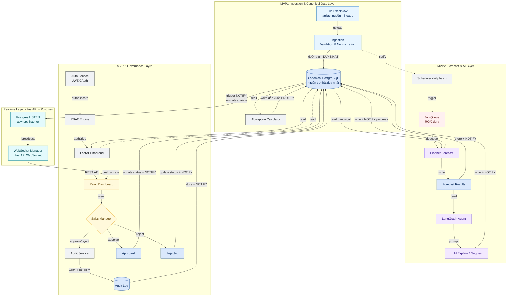
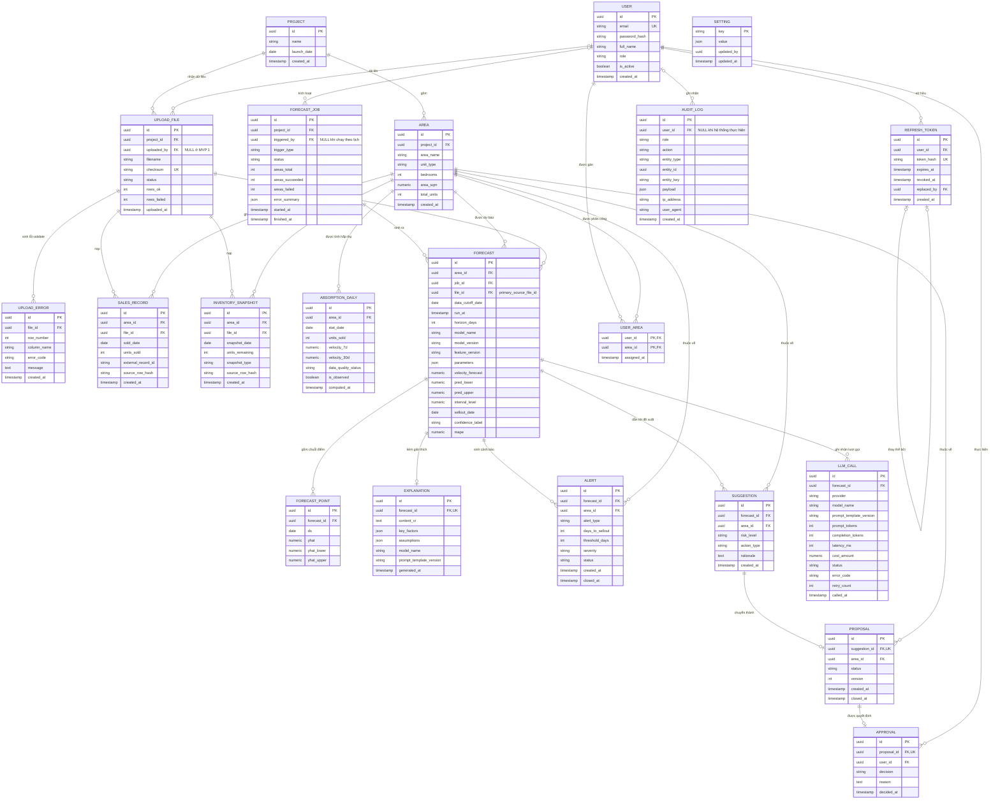

# SRS — AbsorptionForecast AI Agent (3 MVP · 5 tuần)

**Software Requirements Specification**
**Sản phẩm:** AbsorptionForecast — Tầng dữ liệu canonical & trợ lý dự báo tốc độ hấp thụ căn hộ
**Phiên bản:** MVP 1.1
**Nguồn:** [PRD.md](PRD.md) · [Brief](AbsorptionForecast_AI_Agent_Brief.md)
**Nhóm:** G21 - T100 — Nguyễn Đức Đạt, Bùi Hoàng Vương, Nguyễn Trọng Nam, Đặng Tiến Thành
**Ngày:** 08/08/2026

---

## 1. Giới thiệu

### 1.1 Mục đích

Tài liệu này đặc tả yêu cầu phần mềm cho MVP của AbsorptionForecast, đủ chi tiết để đội kỹ thuật (Data/AI, Backend, Frontend) triển khai theo lộ trình 3 MVP — mỗi MVP 1 tuần, xem 5.2–5.4 — cộng thời gian kiểm thử và pilot (tổng 5 tuần). Tài liệu là nguồn tham chiếu chung cho phát triển, kiểm thử và nghiệm thu.

### 1.2 Phạm vi

**Định vị:** hệ thống dựng một **tầng dữ liệu canonical đã được kiểm tra** từ các nguồn bán hàng / tồn kho đã được duyệt. **PostgreSQL là nguồn sự thật duy nhất cho dữ liệu đã chuẩn hoá.** Dashboard, phân tích hấp thụ, dự báo và AI agent đều đọc từ chính nguồn canonical đó — không nhánh nào đọc lại file thô.

Trên nền đó, hệ thống tính tốc độ hấp thụ theo phân khu / loại căn, dự báo ngày dự kiến hết hàng kèm khoảng tin cậy, sinh giải thích bằng ngôn ngữ tự nhiên, xếp hạng rủi ro tồn kho và đề xuất hướng hành động. Mọi đề xuất chính sách chỉ có hiệu lực sau khi quản lý kinh doanh phê duyệt (HITL).

**Ngoài phạm vi MVP:** data warehouse / lakehouse riêng, so sánh nhiều mô hình dự báo (ARIMA, ML khác), mô phỏng what-if, cảnh báo đa kênh (email/Zalo/Slack), tự động huấn luyện lại mô hình, kết nối API CRM/ERP, SSO/OAuth2, MFA, multi-tenant nhiều chủ đầu tư. Hệ thống không tự động thực thi thay đổi giá / chính sách, không xử lý giao dịch tài chính, và không nhận vai trò nguồn sự thật cho dữ liệu nằm ngoài đường ingestion của chính nó.

**Trong phạm vi:** ingestion theo lô (Excel/CSV theo template) là đường ghi duy nhất; dự báo chạy theo daily batch (02:00); cập nhật đẩy real-time qua WebSocket cho tiến độ job dự báo (MVP 2) và thay đổi trạng thái đề xuất (MVP 3), có fallback polling.

### 1.2b Luồng dữ liệu bắt buộc

```text
Excel/CSV hoặc nguồn dữ liệu đã được duyệt
        ↓
Ingestion (đường ghi duy nhất)
        ↓
Validation & normalization
        ↓
Canonical PostgreSQL data          ← nguồn sự thật duy nhất
        ↓
Absorption analytics
        ↓
Forecasting & AI explanation
        ↓
Alerts & recommendations
        ↓
Human approval & audit trail
```

### 1.3 Định nghĩa & viết tắt

| Thuật ngữ | Ý nghĩa |
| --- | --- |
| **Canonical data** | Biểu diễn đã chuẩn hoá, đã kiểm tra của dữ liệu bán hàng / tồn kho / hấp thụ trong PostgreSQL. Nguồn có thẩm quyền cho mọi tiêu dùng |
| **Canonical tables** | `projects`, `areas`, `sales_records`, `inventory_snapshots`, `absorption_daily` (dữ liệu nguồn & tổng hợp) và các bảng dẫn xuất `forecasts`, `alerts`, `suggestions`, `proposals`, `audit_logs` |
| **Ingestion** | Đường ghi duy nhất từ ngoài vào canonical: nhận file → parse → validate → normalize → ghi trong một transaction |
| **Lô nạp (batch)** | Một lần upload, ghi nhận thành một dòng `upload_files` (filename, checksum, status, rows_ok/failed, uploaded_at) |
| **Lineage** | Chuỗi truy vết bản ghi canonical → lô nạp → file nguồn, hiện thực bằng khoá ngoại `file_id` |
| **Artifact nguồn (raw file)** | File gốc trên volume `uploads/`. Giữ để kiểm toán & nạp lại; **không** phải nguồn đọc của bất kỳ tính năng nào |
| **Bản ghi dẫn xuất** | Dự báo, giải thích, cảnh báo, đề xuất — tính từ canonical, ghi vào bảng riêng, không ghi đè dữ liệu nguồn |
| **Seed data** | `scripts/seed_dev.py` — dữ liệu hư cấu cho dev/test. Không nằm trong migration, không thuộc luồng khách hàng |
| Tốc độ hấp thụ | Số căn bán được trên một đơn vị thời gian của một phân khu / loại căn |
| Tỷ lệ hấp thụ | % sản phẩm đã bán trên tổng sản phẩm mở bán |
| Phân khu / loại căn | Đơn vị phân tích: nhóm căn hộ theo phân khu, diện tích, số phòng ngủ, hướng, tầng |
| Ngày dự kiến hết hàng | Ngày tồn kho của một phân khu / loại căn được dự báo về 0 theo tốc độ hấp thụ hiện tại |
| MAPE | Mean Absolute Percentage Error — thước đo sai số dự báo |
| HITL | Human-in-the-loop — bắt buộc người duyệt trước khi đề xuất có hiệu lực |
| RBAC | Role-Based Access Control — phân quyền theo vai trò |
| CI 90% | Khoảng tin cậy 90% của giá trị dự báo (cận trên / cận dưới) |
| Daily batch | Chu kỳ xử lý dữ liệu & dự báo 1 lần/ngày, chạy 02:00 |
| LangGraph | Framework điều phối pipeline agent: `load_context → summarize_stats → call_llm → validate_output → persist` |
| LISTEN/NOTIFY | Cơ chế pub/sub gốc của PostgreSQL; kênh `forecast_progress` và `proposal_events` cấp sự kiện cho WebSocket |
| JWT rotation | Mỗi lần refresh phát hành refresh token mới và thu hồi token cũ |
| Job queue | Hàng đợi tác vụ nền (RQ/Celery) chạy dự báo song song ngoài request cycle |
| MVP 1 / 2 / 3 | Ba lát cắt giao hàng: Data→Dashboard · Forecast+AI · HITL+Audit+RBAC (xem 5.2–5.4) |

---

## 2. Tổng quan hệ thống

### 2.1 Bối cảnh

Dữ liệu bán hàng và tồn kho đã tồn tại trong doanh nghiệp, và doanh nghiệp đã có quy trình báo cáo riêng. Cái chưa có là một **biểu diễn dữ liệu đã chuẩn hoá, đã kiểm tra theo từng dòng và có truy vết nguồn** để phân tích hấp thụ, dự báo và AI agent cùng dựa vào.

Hệ thống này cung cấp chính tầng đó: một đường ingestion duy nhất đưa dữ liệu đã được duyệt vào bảng canonical trong PostgreSQL, kèm kiểm tra theo dòng, chống trùng và lineage; rồi phục vụ dashboard, dự báo định lượng và luồng phê duyệt có kiểm toán **từ cùng một nguồn**.

Hệ thống **không** khẳng định thay thế quy trình báo cáo hiện có của khách hàng, và **không** coi file thô là hệ thống ghi nhận.

### 2.2 Tính năng MVP

| # | Tính năng | Mô tả | MVP |
| --- | --- | --- | --- |
| F0 | **Tầng dữ liệu canonical** | Lược đồ chuẩn hoá trong PostgreSQL cho bán hàng / tồn kho / hấp thụ; ràng buộc toàn vẹn, chống trùng, lineage tới lô & file nguồn | MVP 1 |
| F1 | Ingestion & validation | Nạp Excel/CSV theo template, validate theo dòng, chuẩn hoá và ghi canonical trong một transaction; chặn nạp trùng | MVP 1 |
| F2 | Tính tốc độ hấp thụ | Tính **từ dữ liệu canonical**, tổng hợp theo phân khu / loại căn, biểu đồ xu hướng theo thời gian | MVP 1 |
| F2b | Độ tươi & chất lượng dữ liệu | Mốc cập nhật gần nhất của dự án; trạng thái chất lượng từng điểm trong chuỗi hấp thụ | MVP 1 |
| F3 | Dự báo | Prophet dự báo tốc độ bán & ngày dự kiến hết hàng, kèm CI 90% | MVP 2 |
| F4 | Cảnh báo cạn hàng | Cảnh báo trong app khi số ngày tồn kho dự kiến < ngưỡng cấu hình | MVP 2 |
| F5 | Giải thích tự nhiên | LangGraph + LLM sinh đoạn giải thích tiếng Việt: yếu tố chính & giả định cho mỗi dự báo | MVP 2 |
| F6 | Xếp hạng rủi ro & đề xuất | Danh sách phân khu theo mức rủi ro tồn kho, kèm hướng hành động (siết ưu đãi / kích cầu) | MVP 2 |
| F7 | Luồng HITL | Quản lý duyệt / từ chối đề xuất; chỉ đề xuất đã duyệt mới có hiệu lực | MVP 3 |
| F8 | RBAC & audit log | Phân quyền theo vai trò; lưu lịch sử dự báo, đề xuất, quyết định | MVP 3 |
| F9 | Cập nhật real-time | WebSocket đẩy tiến độ job dự báo (MVP 2) và thay đổi trạng thái đề xuất (MVP 3); fallback polling 30s | MVP 2/3 |

### 2.3 Người dùng & quyền

| Vai trò | Mã kỹ thuật | Quyền |
| --- | --- | --- |
| Sales Staff | `sales_staff` | Xem dashboard & cảnh báo của phân khu được phân công trong `user_areas` |
| Sales Manager | `sales_manager` | Toàn quyền: import dữ liệu, cấu hình ngưỡng cảnh báo, duyệt / từ chối đề xuất, xem audit log, quản trị người dùng |
| Viewer (Ban điều hành) | `viewer` | Chỉ đọc dashboard tổng hợp toàn dự án; không xem audit log |

### 2.4 Ràng buộc kỹ thuật

- **Stack:** Python 3.11 + FastAPI async/await (API), SQLAlchemy Core + asyncpg và Alembic (truy cập dữ liệu & migration), Redis + RQ (worker ingestion/dự báo) và APScheduler (lịch 02:00), Prophet (dự báo), LangGraph + LLM (giải thích tiếng Việt), PostgreSQL 15 (tầng canonical, LISTEN/NOTIFY), ReactJS (dashboard), WebSocket cho cập nhật real-time; triển khai Fly.io/Render với managed PostgreSQL, Docker Compose cho môi trường dev.
- **Chu kỳ xử lý:** job dự báo chạy 02:00 hằng ngày; không tính lại mô hình / gọi LLM quá 1 lần/ngày/phân khu trừ khi có dữ liệu mới.
- **Giới hạn upload:** file Excel/CSV tối đa 20 MB, chống trùng bằng checksum SHA-256.
- **Phiên đăng nhập:** JWT HS256, access token 30 phút, refresh token 7 ngày có rotation.
- **Quy mô pilot:** 1 dự án, 2–3 phân khu / loại căn đại diện, 3–5 Sales Staff + 1 Sales Manager.
- **Dữ liệu vào:** chỉ Excel/CSV theo template; dữ liệu khách hàng đã ẩn danh trước khi nạp.
- **Dữ liệu tối thiểu:** số căn bán được theo ngày, theo phân khu / loại căn, tối thiểu vài tháng lịch sử.
- **Mặc định cấu hình:** ngưỡng cảnh báo 30 ngày tồn kho dự kiến; khoảng tin cậy hiển thị 90%.
- **Thời điểm xác thực & phê duyệt:** không có tầng xác thực nào ở MVP 1 và MVP 2 (API chạy mở trong môi trường dev/pilot nội bộ). Đăng nhập, RBAC, luồng duyệt và audit log xuất hiện lần đầu ở MVP 3.

### 2.5 Quyền sở hữu dữ liệu

Bảy quy tắc dưới đây là **ràng buộc kiến trúc bắt buộc**. Mọi thiết kế, mã nguồn và test phải tuân thủ; vi phạm là lỗi thiết kế, không phải lựa chọn triển khai.

| # | Quy tắc | Hiện thực / cách kiểm chứng |
| --- | --- | --- |
| D1 | **Ingestion là đường ghi duy nhất** cho dữ liệu bán hàng / tồn kho nạp từ ngoài | Chỉ `ImportService` (chạy trong worker sau `POST /files/upload`) được `INSERT` vào `sales_records`, `inventory_snapshots`. Không endpoint nào khác ghi hai bảng này |
| D2 | **Bảng canonical là nguồn đọc** cho dashboard, phân tích và dự báo | `GET /absorption*` đọc `absorption_daily` / `inventory_snapshots`; `ForecastService` đọc `absorption_daily`. Không nhánh nào mở file thô để tính hay hiển thị |
| D3 | **File thô là artifact nguồn và bản ghi lineage** | File lưu trên volume `uploads/`; bản ghi `upload_files` giữ filename + checksum. Dùng cho kiểm toán và nạp lại, không phải hệ thống ghi nhận |
| D4 | **AI agent không đọc file thô sau khi ingest** | Đầu vào của `AgentOrchestrator` (LangGraph) chỉ là số liệu tổng hợp theo phân khu lấy từ canonical — cũng là điều kiện của NFR-S5 |
| D5 | **Dự báo và đề xuất là bản ghi dẫn xuất** | `forecasts`, `forecast_points`, `explanations`, `alerts`, `suggestions`, `proposals` là bảng riêng. Luồng dự báo **không** `UPDATE` `sales_records` / `inventory_snapshots` |
| D6 | **Audit log chỉ ghi thêm** | Role ứng dụng chỉ có `INSERT`/`SELECT` trên `audit_logs` (NFR-L1) |
| D7 | **Seed data chỉ dùng cho dev/test** | `scripts/seed_dev.py`, không nằm trong migration; dữ liệu hư cấu (`DEMO`, `@demo.local`, `password_hash` cố ý không hợp lệ). Không xuất hiện trong môi trường pilot của khách hàng |

**Quan hệ giữa `absorption_daily` và dữ liệu nguồn.** `absorption_daily` là bảng **tổng hợp dẫn xuất**, tính lại toàn bộ theo phạm vi dự án từ `sales_records` sau mỗi lần nạp — không cập nhật tăng dần, vì nạp bổ sung một lô cũ có thể làm đổi vận tốc của những ngày đã tính. Nó là nguồn đọc của dashboard và dự báo, nhưng **không** phải nguồn sự thật gốc: nguồn gốc luôn là `sales_records` / `inventory_snapshots`.

---

## 3. Yêu cầu chức năng

Ưu tiên: **P0** = bắt buộc để nghiệm thu MVP · **P1** = cần cho pilot · **P2** = làm nếu còn thời gian.

| ID | Tên | Mô tả | Ưu tiên |
| --- | --- | --- | --- |
| FR-001 | Ingest dữ liệu Excel/CSV | Sales Manager nạp file bán hàng / tồn kho / danh mục phân khu theo template quy định, gắn với một `project_id` | P0 |
| FR-002 | Validate & normalize | Kiểm tra thiếu trường, sai kiểu, giá trị âm, giá trị ngoài tập cho phép; báo lỗi theo **số dòng và tên cột**; chuẩn hoá và ghi canonical trong một transaction; lô vượt ngưỡng tỷ lệ lỗi bị từ chối nguyên vẹn | P0 |
| FR-024 | Chặn nạp trùng | Từ chối upload có cùng `(project_id, checksum SHA-256)` với một lô đã nạp; phản hồi đồng bộ, chỉ ra lô trùng | P0 |
| FR-025 | Lineage lô & file nguồn | Mỗi bản ghi canonical mang khoá ngoại tới lô nạp (`file_id`); lô mang filename, checksum, thời điểm, số dòng OK/lỗi; file gốc được lưu lại phục vụ kiểm toán và nạp lại | P0 |
| FR-003 | Tính tốc độ hấp thụ | Tổng hợp số căn bán / đơn vị thời gian theo phân khu / loại căn, **tính từ bản ghi bán hàng canonical**, tính lại sau mỗi lần nạp | P0 |
| FR-004 | Biểu đồ xu hướng | Hiển thị tốc độ hấp thụ theo thời gian cho từng phân khu / loại căn, đọc từ canonical | P0 |
| FR-026 | Độ tươi dữ liệu | Dashboard hiển thị mốc cập nhật gần nhất của dữ liệu hấp thụ theo dự án | P0 |
| FR-027 | Trạng thái chất lượng dữ liệu | Mỗi điểm trong chuỗi hấp thụ mang trạng thái chất lượng (đủ / chưa đủ cửa sổ lịch sử) và cờ cho biết ngày đó là quan sát thật hay được điền bù | P1 |
| FR-005 | Job dự báo hằng ngày | Chạy Prophet theo lịch mỗi ngày cho từng phân khu / loại căn có đủ dữ liệu | P0 |
| FR-006 | Dự báo ngày hết hàng | Tính ngày dự kiến tồn kho về 0 từ dự báo tốc độ bán và tồn kho hiện tại | P0 |
| FR-007 | Khoảng tin cậy | Mọi số liệu dự báo hiển thị kèm CI 90% (cận trên / cận dưới) | P0 |
| FR-008 | Nhãn độ tin cậy thấp | Gắn nhãn "độ tin cậy thấp" cho dự báo dựa trên dữ liệu mỏng | P1 |
| FR-009 | Cảnh báo cạn hàng | Sinh cảnh báo trong app khi số ngày tồn kho dự kiến < ngưỡng cấu hình | P0 |
| FR-010 | Cấu hình ngưỡng cảnh báo | Sales Manager chỉnh ngưỡng ngày cảnh báo (mặc định 30 ngày) | P1 |
| FR-011 | Giải thích bằng LLM | Sinh đoạn giải thích tiếng Việt nêu yếu tố chính (xu hướng, mùa vụ, thay đổi tồn kho) và giả định | P0 |
| FR-012 | Xếp hạng rủi ro tồn kho | Xếp hạng phân khu / loại căn theo mức rủi ro tồn kho từ dự báo và tồn kho hiện tại | P0 |
| FR-013 | Đề xuất hướng hành động | Với mỗi nhóm rủi ro, Agent đề xuất siết ưu đãi hoặc kích cầu | P0 |
| FR-014 | Trạng thái đề xuất | Đề xuất mặc định *Chờ duyệt*; chỉ *Đã duyệt* mới được đánh dấu có hiệu lực | P0 |
| FR-015 | Duyệt / từ chối (HITL) | Sales Manager duyệt hoặc từ chối kèm lý do | P0 |
| FR-016 | Audit log | Ghi mọi dự báo, đề xuất, quyết định kèm người thực hiện, thời điểm, phiên bản dữ liệu đầu vào | P0 |
| FR-017 | Tra cứu lịch sử | Màn hình / API tra cứu lịch sử dự báo và quyết định HITL | P1 |
| FR-018 | Xác thực & RBAC | Đăng nhập qua `POST /api/v1/auth/login` trả access token (30 phút) + refresh token (7 ngày, rotation); `RBACGuard` chặn ở tầng API: Sales Staff chỉ thấy phân khu trong `user_areas`, Manager thấy toàn dự án, Viewer chỉ đọc | P0 |
| FR-019 | Báo cáo MAPE | Tính MAPE trên tập kiểm chứng của dữ liệu pilot và hiển thị theo phân khu | P1 |
| FR-020 | Đếm lượt gọi LLM | Ghi nhận số lần gọi LLM / mô hình vào `llm_calls` để theo dõi chi phí | P2 |
| FR-021 | Tiến độ job real-time | Client subscribe `/ws/forecast-jobs`; server đẩy `job.started`, `job.area_done`, `job.completed`, `job.failed` từ kênh `NOTIFY forecast_progress` | P1 |
| FR-022 | Cập nhật đề xuất real-time | `/ws/proposals` đẩy `proposal.created`, `proposal.approved`, `proposal.rejected`, `alert.opened` từ kênh `NOTIFY proposal_events`; `ProposalInbox` cập nhật không cần reload | P1 |
| FR-023 | Reconnect & fallback | Heartbeat ping 20s; auto-reconnect backoff 1s → 30s; sau 3 lần thất bại chuyển polling (`/api/v1/forecasts/jobs/{job_id}` 5s, `/api/v1/proposals?status=pending` 30s) | P1 |

**Event schema chung cho `/ws/forecast-jobs` và `/ws/proposals`:**

```json
{
  "event": "job.area_done",
  "job_id": "uuid",
  "area_id": "uuid",
  "payload": { "processed": 12, "total": 40 },
  "ts": "2026-08-01T02:14:07Z"
}
```

---

## 4. Yêu cầu phi chức năng

### 4.1 Hiệu năng

| ID | Yêu cầu |
| --- | --- |
| NFR-P1 | Biểu đồ tốc độ hấp thụ (`GET /api/v1/absorption`) render < 2 giây ở quy mô pilot; p95 thời gian phản hồi API đọc < 500 ms |
| NFR-P2 | Job dự báo hoàn tất < 10 phút cho 500 phân khu, chạy song song qua job queue (RQ/Celery); quy mô pilot < 2 phút |
| NFR-P3 | Độ trễ từ khi import dữ liệu đến khi dashboard & cảnh báo phản ánh dữ liệu mới < 24 giờ |
| NFR-P4 | Import file quy mô pilot trả kết quả validate trong < 60 giây |
| NFR-P5 | Không tính lại mô hình / gọi LLM quá 1 lần/ngày/phân khu trừ khi có dữ liệu mới |
| NFR-P6 | Backend dùng FastAPI async/await; toàn bộ truy vấn qua asyncpg connection pool (min 5 / max 20), không blocking I/O trong event loop |
| NFR-P7 | Một instance chịu tối thiểu 50 kết nối WebSocket đồng thời ở quy mô pilot |

### 4.2 Bảo mật

| ID | Yêu cầu |
| --- | --- |
| NFR-S1 | Xác thực bắt buộc cho mọi endpoint trừ health check |
| NFR-S2 | RBAC 3 vai trò (Sales Staff / Sales Manager / Viewer); kiểm tra quyền ở tầng API, không chỉ ở UI |
| NFR-S3 | Chỉ Sales Manager được import dữ liệu, cấu hình ngưỡng và duyệt đề xuất |
| NFR-S4 | Dữ liệu bán hàng chỉ lưu trong hạ tầng nội bộ / môi trường pilot được kiểm soát |
| NFR-S5 | Dữ liệu gửi tới LLM chỉ gồm số liệu tổng hợp theo phân khu, không chứa thông tin định danh khách hàng |
| NFR-S6 | Secrets (API key LLM, DB credentials) nạp qua biến môi trường, không commit vào repo |
| NFR-S7 | JWT HS256; access token TTL 30 phút; refresh token TTL 7 ngày **có rotation** — token cũ bị thu hồi ngay khi refresh; claims `sub`, `role`, `jti`, `exp` |
| NFR-S8 | Mật khẩu băm bcrypt **cost 12**, tối thiểu 10 ký tự; không ghi giá trị mật khẩu ở bất kỳ mức log nào |
| NFR-S9 | CORS whitelist tường minh (`https://<app>.fly.dev`, `http://localhost:3000` chỉ ở dev), `allow_credentials=true`, cấm wildcard `*` |
| NFR-S10 | Rate limit `POST /api/v1/auth/login` 5 lần/phút/IP; khoá tài khoản 15 phút sau 10 lần sai liên tiếp |
| NFR-S11 | Production bắt buộc HTTPS; cookie refresh token `httpOnly` + `Secure` + `SameSite=Lax` |
| NFR-S12 | Kết nối WebSocket (`/ws/forecast-jobs`, `/ws/proposals`) bắt buộc JWT khi handshake; chỉ đẩy event thuộc phạm vi phân khu của người dùng |

### 4.3 Logging & kiểm toán

| ID | Yêu cầu |
| --- | --- |
| NFR-L1 | Bảng `audit_logs` bất biến — role ứng dụng chỉ được cấp `INSERT`/`SELECT`, **không** `UPDATE`/`DELETE`; áp dụng cho dự báo, đề xuất và quyết định duyệt / từ chối |
| NFR-L2 | Mỗi bản ghi audit gồm: actor, vai trò, hành động, đối tượng, thời điểm (UTC), phiên bản dữ liệu đầu vào |
| NFR-L3 | Log ứng dụng có cấu trúc (JSON), phân mức INFO/WARN/ERROR, kèm request id |
| NFR-L4 | Ghi log mỗi lần chạy job dự báo: thời gian chạy, số phân khu xử lý, số lỗi |
| NFR-L5 | Log không chứa dữ liệu định danh khách hàng |
| NFR-L6 | Ghi mỗi lượt gọi LLM vào `llm_calls`: model, prompt/completion tokens, `latency_ms`, status — phục vụ theo dõi chi phí (FR-020) |
| NFR-L7 | Xuất metric vận hành: MAPE theo lần chạy, thời gian job dự báo, số kết nối WebSocket đang mở |

### 4.4 Độ tin cậy & khả năng mở rộng

| ID | Yêu cầu |
| --- | --- |
| NFR-R1 | 100% dự báo đi kèm khoảng tin cậy và giả định (nguồn dữ liệu, khung thời gian) |
| NFR-R2 | Job dự báo lỗi ở một phân khu không làm dừng các phân khu còn lại |
| NFR-R3 | Import thất bại không để dữ liệu ở trạng thái dở dang (transaction hoặc rollback) |
| NFR-R4 | Schema và API gắn `project_id` để mở rộng sang dự án khác mà không đổi cấu trúc |
| NFR-R5 | WebSocket tự reconnect với backoff luỹ tiến 1s → 30s, heartbeat ping 20s; mất kết nối không làm mất dữ liệu vì client refetch trạng thái khi reconnect |
| NFR-R6 | Khi WebSocket không khả dụng, UI tự chuyển polling (30s cho dashboard/đề xuất, 5s cho tiến độ job) — real-time là tối ưu trải nghiệm, không phải điều kiện hoạt động |
| NFR-R7 | Listener `asyncpg` LISTEN tự kết nối lại khi mất kết nối Postgres; event bỏ lỡ được bù bằng refetch, không cần hàng đợi bền vững |
| NFR-R8 | Migration cộng dồn theo MVP (Alembic): MVP 1 → 2 → 3 chỉ **thêm** bảng/cột, không breaking change; bảng `suggestions` (MVP 2) được `proposals` (MVP 3) tham chiếu qua FK, không đổi tên |
| NFR-R9 | Mọi migration chạy được tiến/lùi (`upgrade`/`downgrade`) trên bản sao dữ liệu pilot trước khi áp production |
| NFR-R10 | Môi trường: Docker Compose (FastAPI + PostgreSQL + worker) cho dev; production Fly.io/Render với managed PostgreSQL và daily backup |

---

## 5. Kiến trúc

### 5.1 Sơ đồ kiến trúc tổng (3 tuần)



### 5.2 MVP 1: Mini CRM → Canonical Data Store → Absorption Dashboard (1 week)

**Goal**: Sales Staff nhập và cập nhật dữ liệu khách hàng, tương tác, căn hộ và giao dịch **trực tiếp trên giao diện ứng dụng**. Backend kiểm tra hợp lệ rồi ghi vào bảng canonical trong PostgreSQL. Hệ thống tính tốc độ hấp thụ từ dữ liệu canonical đó và phục vụ dashboard. Chưa có dự báo, AI, JWT hay phê duyệt HITL.

**Luồng nghiệp vụ MVP 1**

```text
Sales Staff nhập liệu trên giao diện mini CRM
        ↓
Backend validation (business services)
        ↓
Canonical PostgreSQL data          ← nguồn sự thật duy nhất
        ↓
Absorption calculation (bảng dẫn xuất)
        ↓
Absorption dashboard
```

**MVP 1 không dùng file làm nguồn dữ liệu.** Không có upload Excel/CSV, không parse file, không template, không checksum, không artifact file thô, không lineage theo `file_id`. Nguồn dữ liệu duy nhất của MVP 1 là thao tác nhập liệu của người dùng qua API.

**Base path**: `/api/v1` — router FastAPI được gắn với `prefix="/api/v1"` (`src/main.py`). Health check nằm ở `/health`, ngoài prefix.

#### 5.2.1 Phạm vi chức năng

| # | Năng lực | Mô tả |
|---|---|---|
| C1 | Quản lý dự án | Tạo / sửa / xem dự án (master data) |
| C2 | Quản lý phân khu | Tạo / sửa / xem phân khu thuộc dự án |
| C3 | Quản lý căn hộ / tồn kho | Tạo / sửa / xem từng căn (`units`); `units` là bản ghi tồn kho có thẩm quyền |
| C4 | Quản lý khách hàng | Tạo / sửa / xem khách hàng, kèm nhu cầu (ngân sách, phân khu và loại căn quan tâm) |
| C5 | Phân công Sales Staff | Gán khách hàng và giao dịch cho nhân viên; gán phân khu phụ trách qua `user_areas` |
| C6 | Lịch sử tương tác | Ghi nhận cuộc gọi / gặp / dẫn xem căn / ghi chú, kèm mốc hẹn theo dõi tiếp |
| C7 | Quản lý booking & giao dịch | Tạo giao dịch giữa một khách hàng và một căn |
| C8 | Luồng trạng thái giao dịch | Chuyển trạng thái có kiểm soát, xem 5.2.5 |
| C9 | Cập nhật trạng thái tồn kho | Trạng thái căn đổi theo giao dịch, trong cùng transaction |
| C10 | Tính tốc độ hấp thụ | Tính lại `absorption_daily` từ `deals` + `units` |
| C11 | Dashboard hấp thụ | Biểu đồ xu hướng, bộ lọc, thẻ tổng hợp, mốc cập nhật gần nhất |
| C12 | Validation ở backend | Kiểm tra ở tầng service, không chỉ ở form |
| C13 | Chống trùng bản ghi CRM | Khách hàng theo số điện thoại / email chuẩn hoá; căn theo mã căn; giao dịch theo căn đang được giữ |
| C14 | Trường kiểm toán cơ bản | `created_by`, `updated_by`, `created_at`, `updated_at` trên mọi bảng nghiệp vụ |

#### 5.2.2 Quyền sở hữu dữ liệu ở MVP 1

Mười quy tắc dưới đây là ràng buộc bắt buộc của MVP 1. Chúng **thay thế** D1 và D3 của §2.5 trong phạm vi MVP 1 (§2.5 mô tả đường ghi qua ingestion file — xem *MVP 1 Open Issues*); D2, D5, D6, D7 giữ nguyên hiệu lực.

| # | Quy tắc | Hiện thực / cách kiểm chứng |
|---|---|---|
| M1 | **Chỉ business service của backend được ghi bảng nghiệp vụ canonical** | Mọi `INSERT`/`UPDATE` đi qua service tương ứng; không route nào ghi thẳng bảng |
| M2 | **Frontend không bao giờ ghi thẳng PostgreSQL** | Frontend chỉ gọi REST API; không có kết nối DB từ trình duyệt |
| M3 | `CustomerService` ghi dữ liệu khách hàng | Bảng `customers` |
| M4 | `InteractionService` ghi tương tác khách hàng | Bảng `customer_interactions` (chỉ ghi thêm) |
| M5 | `DealService` ghi giao dịch và kiểm tra chuyển trạng thái | Bảng `deals`; ma trận chuyển trạng thái ở 5.2.5 |
| M6 | `InventoryService` ghi căn và trạng thái tồn kho | Bảng `units`; được `DealService` gọi trong **cùng transaction** |
| M7 | `AbsorptionCalculatorService` chỉ ghi bảng hấp thụ dẫn xuất | Bảng `absorption_daily`; không đụng `deals`/`units`/`customers` |
| M8 | API dashboard chỉ đọc dữ liệu canonical hoặc dẫn xuất trong PostgreSQL | `GET /absorption*`, `GET /inventory` |
| M9 | **MVP 1 không dùng file làm nguồn dữ liệu** | Không có endpoint upload, không có parser, không đọc `uploads/` |
| M10 | **Không tạo nguồn sự thật thứ hai** | Không cache nghiệp vụ ngoài DB; không bảng sao chép; số liệu dẫn xuất luôn tính lại được từ canonical |

**Ranh giới gốc ↔ dẫn xuất.** `customers`, `customer_interactions`, `units`, `deals`, `projects`, `areas` là **dữ liệu gốc**. `absorption_daily` là **bảng dẫn xuất**, xoá và tính lại theo phạm vi dự án; mất bảng này không mất thông tin nghiệp vụ nào.

#### 5.2.3 Backend (FastAPI)

| Endpoint | Method | Purpose |
|---|---|---|
| `/health` | GET | Health check hạ tầng & môi trường |
| `/api/v1/projects` | GET / POST | Danh sách dự án · tạo dự án |
| `/api/v1/projects/{project_id}` | PATCH | Sửa thông tin dự án |
| `/api/v1/areas` | GET / POST | Phân khu của một dự án · tạo phân khu |
| `/api/v1/areas/{area_id}` | PATCH | Sửa thông tin phân khu |
| `/api/v1/units` | GET / POST | Danh sách căn (lọc `project_id`, `area_id`, `status`, `unit_type`) · tạo căn |
| `/api/v1/units/{unit_id}` | PATCH | Sửa thuộc tính căn; đổi `status` sang `blocked`/`available` khi không có giao dịch đang giữ |
| `/api/v1/customers` | GET / POST | Danh sách khách hàng (lọc `project_id`, `assigned_to`, `status`, `q`) · tạo khách hàng |
| `/api/v1/customers/{customer_id}` | GET / PATCH | Chi tiết · sửa khách hàng |
| `/api/v1/customers/{customer_id}/interactions` | GET / POST | Dòng thời gian tương tác · ghi nhận tương tác mới |
| `/api/v1/deals` | GET / POST | Danh sách giao dịch (lọc `project_id`, `area_id`, `status`, `assigned_to`, `customer_id`) · tạo giao dịch |
| `/api/v1/deals/{deal_id}` | GET | Chi tiết giao dịch kèm khách hàng và căn |
| `/api/v1/deals/{deal_id}/status` | PATCH | Chuyển trạng thái giao dịch (body: `status`, `loss_reason?`, `effective_at?`) |
| `/api/v1/inventory` | GET | Tổng hợp tồn kho theo phân khu / loại căn: tổng căn, đã bán, đang giữ chỗ, còn lại, tỷ lệ hấp thụ |
| `/api/v1/absorption` | GET | Chuỗi tốc độ hấp thụ theo `area_id`, `from`, `to`, `granularity=day\|week`; mỗi điểm kèm trạng thái chất lượng |
| `/api/v1/absorption/summary` | GET | Tổng hợp theo dự án: tổng căn, đã bán, giữ chỗ, còn lại, tốc độ trung bình 30 ngày, **mốc cập nhật gần nhất** |
| `/api/v1/{projects\|areas}/{id}/image` | GET / POST / PUT / DELETE | Ảnh bìa dự án / phân khu (nội dung hiển thị, không thuộc dữ liệu nghiệp vụ) |

**Mã lỗi nghiệp vụ** (giữ quy ước `error_code` sẵn có của repo):

| Tình huống | HTTP | `error_code` |
|---|---|---|
| Dữ liệu sai kiểu / thiếu trường / vi phạm ràng buộc giá trị | 422 | (pydantic) |
| Dự án · phân khu · căn · khách hàng · giao dịch không tồn tại | 404 | `PROJECT_NOT_FOUND` · `AREA_NOT_FOUND` · `UNIT_NOT_FOUND` · `CUSTOMER_NOT_FOUND` · `DEAL_NOT_FOUND` |
| Dự án không ở trạng thái `active` | 409 | `PROJECT_NOT_ACTIVE` |
| Trùng `(project_id, phone_normalized)` hoặc `(project_id, email_normalized)` | 409 | `DUPLICATE_CUSTOMER` |
| Trùng `(area_id, unit_code)` | 409 | `DUPLICATE_UNIT` |
| Đã có giao dịch mở của cùng khách hàng trên cùng căn | 409 | `DUPLICATE_DEAL` |
| Tạo giao dịch trên căn `sold` / `blocked` | 409 | `UNIT_NOT_AVAILABLE` |
| Căn đã bị một giao dịch khác giữ chỗ / bán | 409 | `UNIT_ALREADY_CLAIMED` |
| Chuyển trạng thái không nằm trong ma trận 5.2.5 | 409 | `INVALID_STATUS_TRANSITION` |
| Chuyển sang `lost` mà thiếu `loss_reason` | 422 | `LOSS_REASON_REQUIRED` |
| PATCH không gửi trường nào | 422 | `NO_CHANGES` |
| Sửa trường không được phép qua API (`status` của deal, `created_by`, …) | 422 | `FIELD_NOT_EDITABLE` |

#### 5.2.4 Services

- `ProjectService` — tạo / sửa dự án và phân khu. Kiểm tra dự án tồn tại và đang `active` trong **cùng transaction** với `INSERT` phân khu, để trạng thái dự án không đổi giữa hai bước.
- `CustomerService` — tạo / sửa khách hàng. Chuẩn hoá `phone` và `email` trước khi ghi (5.2.6), phát hiện trùng, kiểm tra `budget_min ≤ budget_max`, kiểm tra `preferred_area_id` thuộc đúng dự án của khách hàng.
- `InteractionService` — ghi tương tác. Bảng **chỉ ghi thêm**: không có endpoint sửa hay xoá; ghi sai thì ghi một tương tác đính chính mới. Kiểm tra `next_follow_up_at ≥ interaction_at`.
- `DealService` — tạo giao dịch và **là nơi duy nhất** kiểm tra chuyển trạng thái. Mỗi lần chuyển trạng thái nằm trong một transaction cùng với lời gọi `InventoryService`, rồi kích hoạt tính lại hấp thụ.
- `InventoryService` — tạo / sửa căn và **sở hữu cột `units.status`**. `DealService` không tự `UPDATE` `units`; nó gọi service này để mọi quy tắc tồn kho nằm một chỗ.
- `AbsorptionCalculatorService` — tính lại `absorption_daily` theo phạm vi dự án từ `deals` + `units` (5.2.7). Không cập nhật tăng dần: một giao dịch được đính chính có thể làm đổi số liệu của những ngày đã tính, nên cập nhật tăng dần sẽ sai một cách âm thầm.
- `AreaService` — đọc phân khu kèm tồn kho hiện tại, đọc chuỗi hấp thụ và số liệu tổng hợp cho dashboard.

**Ghi nhận actor.** Mọi thao tác ghi nhận `created_by` / `updated_by` là `users.id` của nhân viên thực hiện. MVP 1 **chưa có JWT** (§2.4): actor lấy từ header `X-Staff-Id` do frontend gửi sau khi người dùng chọn tài khoản nhân viên; giá trị phải tồn tại trong `users` và `is_active = true`, nếu không thì 422 `UNKNOWN_STAFF`. Đây là **cơ chế ghi nhận, không phải cơ chế bảo mật** — xem *MVP 1 Open Issues*.

#### 5.2.5 Luồng trạng thái giao dịch

```text
lead → qualified → interested → viewing → reserved → sold
  └────────┴───────────┴────────────┴─────────→ lost
```

Ma trận chuyển trạng thái hợp lệ — mọi chuyển đổi khác trả 409 `INVALID_STATUS_TRANSITION`:

| Từ | Được phép sang | Ghi chú |
|---|---|---|
| `lead` | `qualified`, `lost` | Trạng thái khởi tạo mặc định |
| `qualified` | `interested`, `lost` | |
| `interested` | `viewing`, `lost` | |
| `viewing` | `reserved`, `lost` | |
| `reserved` | `sold`, `lost` | Vào `reserved` mới **giữ căn**; đặt `booked_at` |
| `sold` | `lost` | **Chỉ để đính chính** — bắt buộc `loss_reason`; ghi `lost_at`, giữ nguyên `sold_at` để tra vết |
| `lost` | — | Trạng thái kết thúc. Muốn theo đuổi lại thì tạo giao dịch mới |

Quy tắc bổ sung:

- **Không nhảy bước tiến.** Đi tới chỉ được một bước; muốn ghi nhận nhanh thì gọi PATCH nhiều lần, mỗi lần là một bản ghi kiểm toán riêng.
- `lost` được phép từ mọi trạng thái chưa kết thúc, và bắt buộc có `loss_reason` khác rỗng.
- **Chỉ `reserved` và `sold` mới giữ căn.** Nhiều giao dịch ở giai đoạn `lead`…`viewing` được phép cùng trỏ vào một căn `available` (nhiều khách cùng quan tâm). Ai vào `reserved` trước thì giữ được — ràng buộc UNIQUE từng phần ở tầng DB quyết định, không phải kiểm tra ở tầng ứng dụng, nên hai request đồng thời không thể cùng thắng.
- Mốc thời gian điền tự động theo trạng thái đích (`booked_at` / `sold_at` / `lost_at`), cho phép ghi đè bằng `effective_at` để nhập bù dữ liệu quá khứ; `effective_at` không được ở tương lai.

**Hệ quả tồn kho** (do `InventoryService` thực hiện, cùng transaction):

| Chuyển trạng thái | `units.status` |
|---|---|
| `viewing → reserved` | `available → reserved` |
| `reserved → sold` | `reserved → sold` |
| `reserved → lost` | `reserved → available` |
| `sold → lost` (đính chính) | `sold → available` |
| Các chuyển đổi còn lại | không đổi |

#### 5.2.6 Chống trùng bản ghi CRM

**Khách hàng** — chuẩn hoá trước khi so sánh, lưu vào cột riêng để ràng buộc DB làm việc chứ không phải tầng ứng dụng:

- `phone_normalized`: bỏ mọi ký tự không phải chữ số; `+84`/`84` ở đầu đổi thành `0`; kết quả phải khớp `^0\d{8,10}$`.
- `email_normalized`: `trim` rồi `lower`.
- UNIQUE `(project_id, phone_normalized)` WHERE `phone_normalized IS NOT NULL`.
- UNIQUE `(project_id, email_normalized)` WHERE `email_normalized IS NOT NULL`.
- CHECK: phải có ít nhất một trong hai (`phone_normalized IS NOT NULL OR email_normalized IS NOT NULL`) — khách không có cách liên hệ nào thì không dùng được cho nghiệp vụ.
- Vi phạm → 409 `DUPLICATE_CUSTOMER`, kèm `customer_id` của bản ghi đã có để giao diện mở thẳng khách hàng đó. Gộp / tách khách hàng trùng **không** thuộc MVP 1.

**Căn hộ** — UNIQUE `(area_id, unit_code)`. Vì `areas.project_id` là NOT NULL nên ràng buộc này cũng bảo đảm duy nhất trong phạm vi phân khu của một dự án. Mã căn có duy nhất trên toàn dự án hay không là câu hỏi nghiệp vụ — `[NEEDS CONFIRMATION]`.

**Giao dịch** — hai ràng buộc từng phần:

- UNIQUE `(unit_id)` WHERE `status IN ('reserved','sold')` — một căn tối đa một giao dịch đang giữ.
- UNIQUE `(customer_id, unit_id)` WHERE `status NOT IN ('sold','lost')` — một khách không có hai giao dịch mở trên cùng một căn.

Đính chính giao dịch làm bằng `PATCH /deals/{id}/status`, **không** bằng cách tạo bản ghi thứ hai; nhờ vậy `absorption_daily` chỉ cần tính lại từ trạng thái hiện tại là đúng.

#### 5.2.7 Quy tắc tính hấp thụ

Định nghĩa dưới đây là hợp đồng của `AbsorptionCalculatorService`.

- **Đếm căn bán theo ngày.** Một căn được tính là bán vào `date(deals.sold_at)` của giao dịch có `status = 'sold'`. `units_sold(area, d) = COUNT(deals WHERE status='sold' AND area_of(unit_id) = area AND date(sold_at) = d)`. Ràng buộc UNIQUE từng phần trên `unit_id` bảo đảm mỗi căn góp tối đa 1 vào đúng một ngày.
- **Chỉ `sold` mới được tính.** `lead`, `qualified`, `interested`, `viewing`, `reserved`, `lost` và mọi tương tác / ghi chú **không** góp vào số căn đã bán, tồn kho còn lại, tỷ lệ hấp thụ, tốc độ hấp thụ hay thống kê hấp thụ hằng ngày.
- **Tồn kho còn lại cuối ngày.** `units_remaining(area, d) = total_units(area) − Σ units_sold(area, ≤ d)`, với `total_units(area) = COUNT(units WHERE area_id = area AND status <> 'blocked')`. Căn `blocked` nằm ngoài quỹ hàng nên không làm loãng tỷ lệ hấp thụ.
- **Giữ chỗ (`reserved`).** Không tính là đã bán và **không** lưu theo ngày. `reserved` là trạng thái *hiện tại* và MVP 1 không có nhật ký sự kiện tồn kho để dựng lại lịch sử giữ chỗ, nên con số giữ chỗ chỉ xuất hiện ở `GET /inventory` và thẻ tổng hợp (giá trị tại thời điểm đọc), không xuất hiện trong `absorption_daily`.
- **Giao dịch huỷ / thua.** Chuyển sang `lost` làm căn quay lại `available`; nếu giao dịch từng ở `sold` thì lần tính lại kế tiếp **gỡ** căn đó khỏi ngày đã đếm, và `units_remaining` của mọi ngày từ đó trở đi tăng lại 1. Số liệu lịch sử vì vậy luôn phản ánh trạng thái đúng nhất hiện biết, không phải trạng thái từng hiển thị.
- **Trùng / đính chính.** Vì đính chính là chuyển trạng thái trên chính giao dịch cũ, và một căn tối đa một giao dịch giữ, không có đường nào để một căn bị đếm hai lần.
- **Tính lại.** `recompute(project_id)` chạy sau mỗi chuyển trạng thái chạm `reserved`/`sold`/`lost`, và sau mỗi thay đổi `units` ảnh hưởng quỹ hàng (thêm căn, đổi `blocked`). Phạm vi tính lại là **toàn bộ dự án**: xoá các dòng `absorption_daily` của dự án rồi ghi lại. Chạy trong worker nền (RQ) để không chẹn request; giao diện đọc số cũ cho tới khi tính xong.
- **Ngày thiếu.** Khoảng ngày từ `min(sold_at)` của dự án tới hôm nay được điền đủ; ngày không có giao dịch bán nào ghi `units_sold = 0`, `is_observed = false`. Phải điền bù thì trung bình trượt mới đúng — bỏ trống ngày không bán sẽ làm mẫu số co lại và thổi vận tốc lên.
- **Vận tốc.** `velocity_7d` / `velocity_30d` là trung bình cộng `units_sold` trong cửa sổ 7 / 30 ngày gần nhất tính cả ngày hiện tại, để con số đọc được là "mỗi ngày bán bao nhiêu căn".
- **Trạng thái chất lượng dữ liệu.** `data_quality_status = 'warning'` khi cửa sổ 30 ngày chưa đủ dữ liệu lịch sử (những ngày đầu chuỗi), `'ok'` khi đã đủ. Giá trị `'error'` được CHECK cho phép nhưng MVP 1 không sinh ra — xem *MVP 1 Open Issues*.
- **Mốc cập nhật gần nhất.** `GET /absorption/summary` trả `updated_at = MAX(absorption_daily.computed_at)` trong phạm vi dự án. Đây là mốc **dữ liệu hấp thụ được tính lại lần cuối**, không phải mốc nhập liệu gần nhất.

#### 5.2.8 Database Tables *(tầng canonical của MVP 1)*

**Giữ nguyên:** `projects`, `areas` (master data, đã có từ revision `0001`/`0002`).

**Bổ sung — bảng nghiệp vụ CRM:**

- `customers`: id (PK), project_id (FK → `projects`), full_name, phone, email, `phone_normalized`, `email_normalized`, budget_min, budget_max, preferred_area_id (FK → `areas`, NULL), preferred_unit_type (NULL), status, assigned_to (FK → `users`, NULL), created_by (FK → `users`), updated_by (FK → `users`), created_at, updated_at
- `customer_interactions`: id (PK), customer_id (FK → `customers`), staff_id (FK → `users`), interaction_type, note, interaction_at, next_follow_up_at (NULL), created_by (FK → `users`), created_at
- `units`: id (PK), area_id (FK → `areas`), unit_code, unit_type, bedrooms, area_sqm, price, status, created_by (FK → `users`), updated_by (FK → `users`), created_at, updated_at
- `deals`: id (PK), customer_id (FK → `customers`), unit_id (FK → `units`), assigned_to (FK → `users`), status, booked_at (NULL), sold_at (NULL), lost_at (NULL), loss_reason (NULL), created_by (FK → `users`), updated_by (FK → `users`), created_at, updated_at

**Điều chỉnh — bảng dẫn xuất:**

- `absorption_daily`: id (PK), area_id (FK → `areas`), stat_date, units_sold, **`units_remaining`** *(cột mới)*, velocity_7d, velocity_30d, data_quality_status, is_observed, computed_at *(tên cột là `stat_date`, không dùng `date` vì trùng tên kiểu của PostgreSQL)*

**Tập giá trị (CHECK)**

| Cột | Giá trị hợp lệ |
|---|---|
| `customers.status` | `new` · `active` · `inactive` |
| `customer_interactions.interaction_type` | `call` · `meeting` · `site_visit` · `message` · `email` · `note` |
| `units.status` | `available` · `reserved` · `sold` · `blocked` |
| `deals.status` | `lead` · `qualified` · `interested` · `viewing` · `reserved` · `sold` · `lost` |
| `absorption_daily.data_quality_status` | `ok` · `warning` · `error` |

**Ràng buộc giá trị (CHECK)**

- `customers`: `full_name` khác rỗng sau khi trim · `budget_min ≥ 0` · `budget_max ≥ 0` · `budget_max ≥ budget_min` khi cả hai có giá trị · `phone_normalized IS NOT NULL OR email_normalized IS NOT NULL`
- `customer_interactions`: `next_follow_up_at IS NULL OR next_follow_up_at ≥ interaction_at`
- `units`: `unit_code` khác rỗng · `bedrooms ≥ 0` · `area_sqm > 0` · `price ≥ 0`
- `deals` — ràng buộc chéo giữa `status` và các mốc thời gian, để trạng thái không thể mâu thuẫn với dữ liệu:
  - `status = 'sold'` → `sold_at IS NOT NULL AND booked_at IS NOT NULL`
  - `status = 'lost'` → `lost_at IS NOT NULL AND loss_reason` khác rỗng
  - `status = 'reserved'` → `booked_at IS NOT NULL AND sold_at IS NULL AND lost_at IS NULL`
  - `status IN ('lead','qualified','interested','viewing')` → `booked_at IS NULL AND sold_at IS NULL AND lost_at IS NULL`
  - `sold_at IS NULL OR sold_at ≥ booked_at`
- `absorption_daily`: `units_sold ≥ 0` · `units_remaining ≥ 0` · `velocity_7d ≥ 0` · `velocity_30d ≥ 0`

**UNIQUE**

| Bảng | Ràng buộc | Mục đích |
|---|---|---|
| `customers` | `(project_id, phone_normalized)` WHERE NOT NULL | Chống trùng khách theo số điện thoại |
| `customers` | `(project_id, email_normalized)` WHERE NOT NULL | Chống trùng khách theo email |
| `units` | `(area_id, unit_code)` | Chống trùng mã căn trong phân khu |
| `deals` | `(unit_id)` WHERE `status IN ('reserved','sold')` | Một căn tối đa một giao dịch đang giữ |
| `deals` | `(customer_id, unit_id)` WHERE `status NOT IN ('sold','lost')` | Một khách không có hai giao dịch mở trên cùng căn |
| `absorption_daily` | `(area_id, stat_date)` | Một dòng cho mỗi phân khu mỗi ngày |

**Indexes**

`customers(project_id, assigned_to)` · `customers(project_id, status)` · `customers(preferred_area_id)` ·
`customer_interactions(customer_id, interaction_at DESC)` · `customer_interactions(staff_id, next_follow_up_at)` partial `WHERE next_follow_up_at IS NOT NULL` ·
`units(area_id, status)` · `units(area_id, unit_type)` ·
`deals(unit_id)` · `deals(customer_id, created_at DESC)` · `deals(assigned_to, status)` · `deals(sold_at)` partial `WHERE status = 'sold'` *(truy vấn nóng của phép tính hấp thụ)* ·
`absorption_daily(area_id, stat_date)` UNIQUE

**Trường kiểm toán.** Mọi bảng nghiệp vụ có `created_at` (mặc định `now()`) và `created_by`; các bảng cho sửa có thêm `updated_at` và `updated_by`. `customer_interactions` không có `updated_*` vì chỉ ghi thêm. `created_by` / `updated_by` là NOT NULL và tham chiếu `users` — đây là điểm khác với `upload_files.uploaded_by` của bản SRS trước (luôn NULL vì chưa có auth).

**Vai trò từng bảng**

| Bảng | Vai trò | Ai được ghi |
|---|---|---|
| `projects`, `areas` | Master data | `ProjectService` |
| `units` | **Tồn kho canonical** — trạng thái từng căn | `InventoryService` |
| `customers` | **Dữ liệu khách hàng canonical (PII)** | `CustomerService` |
| `customer_interactions` | Lịch sử tương tác, chỉ ghi thêm | `InteractionService` |
| `deals` | **Dữ liệu bán hàng canonical** — nguồn duy nhất của "đã bán" | `DealService` |
| `absorption_daily` | Tổng hợp dẫn xuất, tính lại từ `deals` + `units` | `AbsorptionCalculatorService` |

**Migration.** Cần một revision Alembic mới thêm `customers`, `customer_interactions`, `units`, `deals`, cột `absorption_daily.units_remaining` và các trường kiểm toán. Theo NFR-R8 migration chỉ **thêm**, không xoá: `upload_files`, `upload_errors`, `sales_records`, `inventory_snapshots` vẫn tồn tại trong lược đồ nhưng **nằm ngoài đường ghi và đường đọc của MVP 1** — xem *MVP 1 Open Issues*.

#### 5.2.9 Bảo mật & phạm vi dữ liệu

- **Dữ liệu khách hàng là PII.** `customers.full_name`, `phone`, `email` và `customer_interactions.note` là thông tin định danh cá nhân, không phải số liệu tổng hợp. Chúng chỉ nằm trong hạ tầng nội bộ / môi trường pilot được kiểm soát (NFR-S4).
- **Không đưa PII vào LLM.** `full_name`, `phone`, `email`, `note` và mọi trường định danh khác **không** được đưa vào prompt của bất kỳ tính năng LLM nào ở MVP 2 trở đi. Agent chỉ nhận số liệu tổng hợp theo phân khu (NFR-S5, §2.5 D4).
- **Không ghi PII vào log.** Log ứng dụng ghi `customer_id`, không ghi tên / số điện thoại / email / nội dung ghi chú (NFR-L5).
- **Phạm vi truy cập đích:** Sales Staff chỉ thấy phân khu được phân công trong `user_areas`, cùng khách hàng và giao dịch được gán cho mình; Sales Manager thấy toàn dự án; Viewer chỉ đọc dashboard tổng hợp và **không** thấy PII. Ma trận quyền giữ nguyên §2.3.
- **Cách áp ở MVP 1:** bộ lọc phạm vi được cài ở tầng truy vấn của service (`area_id IN (assigned)`, `assigned_to = staff`), lấy `staff_id` từ header `X-Staff-Id`. Vì header do client tự khai và chưa có JWT (§2.4), **đây là bộ lọc dữ liệu, không phải cơ chế bảo mật**; `RBACGuard` của MVP 3 (FR-018) thay nguồn `staff_id` bằng claim `sub` mà không phải viết lại truy vấn. Xem *MVP 1 Open Issues*.

#### 5.2.10 Frontend (React)

Nguyên tắc: **frontend không ghi thẳng PostgreSQL và không tự tính lại số liệu nghiệp vụ.** Mọi con số hiển thị đến từ API; `frontend/src/api/endpoints.js` là nơi duy nhất khai báo lời gọi API.

- `CrmDashboardPage`: màn hình làm việc của Sales Staff — khách cần theo dõi hôm nay, giao dịch đang mở, căn mới giữ chỗ.
- `CustomerListPage`: danh sách khách hàng, lọc theo phân khu quan tâm / trạng thái / người phụ trách, tìm theo tên và số điện thoại.
- `CustomerDetailPage`: hồ sơ khách hàng, nhu cầu, người phụ trách, danh sách giao dịch của khách.
- `CustomerForm`: tạo / sửa khách hàng; hiển thị lỗi trùng 409 `DUPLICATE_CUSTOMER` kèm link mở khách hàng đã có.
- `InteractionTimeline`: dòng thời gian tương tác theo thứ tự giảm dần, kèm form ghi tương tác mới và mốc hẹn theo dõi tiếp.
- `UnitInventoryTable`: danh sách căn theo phân khu, badge trạng thái `available`/`reserved`/`sold`/`blocked`, lọc theo loại căn và trạng thái.
- `DealForm`: tạo giao dịch — chọn khách hàng và căn còn bán được; chặn ở client các căn `sold`/`blocked`, nhưng quyết định cuối vẫn ở backend.
- `DealStatusStepper`: chuyển trạng thái theo ma trận 5.2.5 — chỉ bật những bước hợp lệ, bắt buộc nhập `loss_reason` khi chọn `lost`, hiển thị lỗi backend khi có tranh chấp căn.
- `AbsorptionChart`: line chart tốc độ hấp thụ theo thời gian, chuyển đổi ngày / tuần.
- `AreaSelector` / `UnitTypeFilter`: lọc dashboard theo phân khu và loại căn.
- `SummaryCards`: tổng số căn · đã bán · đang giữ chỗ · còn lại · tốc độ trung bình 30 ngày · **mốc cập nhật dữ liệu gần nhất**.

**Real-time**: chưa dùng WebSocket. Sau khi chuyển trạng thái giao dịch, giao diện refetch `GET /inventory` và `GET /absorption/summary`; vì tính lại chạy nền, thẻ tổng hợp hiển thị mốc `updated_at` để người dùng biết số đang xem thuộc lần tính nào. Dashboard polling `GET /api/v1/absorption` mỗi **30 giây** khi tab đang active (dừng khi tab ẩn), kèm nút Refresh thủ công.

#### 5.2.11 Tiêu chí chấp nhận MVP 1

| # | Tiêu chí | Cách kiểm chứng |
|---|---|---|
| A1 | Sales Staff tạo được khách hàng | `POST /customers` → 201; đọc lại bằng `SELECT` thấy đúng bản ghi |
| A2 | Backend từ chối dữ liệu khách hàng không hợp lệ | Thiếu `full_name`, không có cả `phone` lẫn `email`, `budget_max < budget_min`, `preferred_area_id` thuộc dự án khác → 422, không ghi dòng nào |
| A3 | Phát hiện khách hàng trùng theo số điện thoại / email chuẩn hoá | `0901234567`, `+84901234567`, `090 123 4567` cùng chuẩn hoá về một giá trị → lần tạo thứ hai trả 409 `DUPLICATE_CUSTOMER` kèm `customer_id` đã có |
| A4 | Sales Staff ghi được tương tác khách hàng | `POST /customers/{id}/interactions` → 201; xuất hiện đúng thứ tự trên `GET` cùng đường dẫn |
| A5 | Sales Staff tạo được giao dịch trên căn hợp lệ | `POST /deals` với căn `available` → 201, `status = 'lead'`; căn `sold`/`blocked` → 409 `UNIT_NOT_AVAILABLE` |
| A6 | Chuyển trạng thái sai bị từ chối | `lead → sold`, `lead → reserved`, `lost → *`, `sold → reserved` đều trả 409 `INVALID_STATUS_TRANSITION`; `→ lost` thiếu `loss_reason` trả 422 |
| A7 | Chỉ giao dịch `sold` làm tăng số căn đã bán | Tạo giao dịch ở `lead`…`reserved` và ghi tương tác → `units_sold` không đổi; chuyển sang `sold` → tăng đúng 1 vào ngày của `sold_at` |
| A8 | Tồn kho đổi đúng sau `sold`, `lost` và huỷ giữ chỗ | `reserved` → căn `reserved`, còn lại giảm 1 ở `GET /inventory`; `sold` → căn `sold`; `reserved → lost` và `sold → lost` → căn về `available`, còn lại tăng lại 1 |
| A9 | Số liệu hấp thụ tính từ dữ liệu canonical trong PostgreSQL | `absorption_daily` dựng lại được từ `deals` + `units`: xoá sạch bảng rồi `recompute()` cho ra đúng bộ số cũ |
| A10 | Dashboard hiển thị dữ liệu hấp thụ canonical mới nhất | Sau khi chuyển một giao dịch sang `sold` và tính lại xong, `GET /absorption` và `/absorption/summary` phản ánh thay đổi; `updated_at` tiến lên |
| A11 | Sales Staff không truy cập được dữ liệu ngoài phân khu được phân công | Với `X-Staff-Id` của nhân viên chỉ phụ trách phân khu A: `GET /units`, `/customers`, `/deals`, `/absorption` không trả bản ghi của phân khu B; gọi thẳng bằng id của B trả 404 |
| A12 | Mọi thao tác tạo / sửa quan trọng lưu người thực hiện và thời điểm | Sau `POST`/`PATCH` trên `customers`, `units`, `deals`: `created_by`/`updated_by` khớp `X-Staff-Id`, `created_at`/`updated_at` khác NULL và `updated_at ≥ created_at` |

#### 5.2.12 Not Included in MVP 1

- ❌ **Nạp dữ liệu từ file** — không upload Excel/CSV, không parse, không template, không checksum, không lineage theo `file_id`
- ❌ Dự báo Prophet, ngày dự kiến hết hàng, khoảng tin cậy
- ❌ Giải thích LLM / LangGraph agent
- ❌ Xác thực JWT, RBAC ở tầng bảo mật (API mở trong môi trường dev/pilot nội bộ — xem 5.2.9)
- ❌ Luồng phê duyệt HITL và audit log đầy đủ (MVP 1 chỉ có trường kiểm toán trên bảng nghiệp vụ)
- ❌ Duyệt master data: cột workflow `pending`/`active`/`rejected`/`archived` đã có trong lược đồ (revision `0002`), nhưng chưa có endpoint duyệt và chưa nơi nào lọc theo `status` — dự án tạo ra là `active` ngay
- ❌ Gộp / tách khách hàng trùng; nhập hàng loạt khách hàng hay căn hộ
- ❌ Bảng giá theo thời gian, chiết khấu, hợp đồng, thanh toán, công nợ
- ❌ Tích hợp CRM/ERP ngoài, đồng bộ Zalo / Facebook, marketing automation
- ❌ WebSocket / cập nhật đẩy real-time
- ❌ Xoá dự án / phân khu / căn / khách hàng (chỉ đổi trạng thái)

#### 5.2.13 MVP 1 Open Issues

Các mâu thuẫn liên mục do việc đổi nguồn dữ liệu MVP 1 sinh ra. **Không xử lý ở đây** vì nằm ngoài phạm vi MVP 1; ghi lại để chốt trước khi cài đặt.

| # | Vấn đề | Ảnh hưởng | Đề xuất |
|---|---|---|---|
| O1 | §1.2b, §2.2 (F0/F1), §2.5 (D1, D3) và §3 (FR-001, FR-002, FR-024, FR-025) vẫn mô tả ingestion file là đường ghi duy nhất | Mâu thuẫn trực tiếp với 5.2.2 M9 | Cập nhật các mục toàn cục sang "nhập liệu trực tiếp qua API" ở lần sửa kế tiếp; 5.2.2 là bản có hiệu lực cho MVP 1 |
| O2 | §5.3 quy định `forecasts.file_id` **NOT NULL** trỏ `upload_files`, và §5.7.7 dựng chuỗi truy vết `APPROVAL → PROPOSAL → SUGGESTION → FORECAST → UPLOAD_FILE` | MVP 1 không còn sinh `upload_files` ⇒ MVP 2 không có giá trị hợp lệ để điền | Đổi mắt xích truy vết của MVP 2 sang ảnh chụp dữ liệu canonical (ví dụ `data_cutoff_date` + phiên bản tính hấp thụ) thay vì `file_id`. **Không sửa ở đây** vì thuộc MVP 2 |
| O3 | §2.4 khẳng định MVP 1 và MVP 2 không có tầng xác thực, nhưng MVP 1 nay cần actor cho `created_by`/`updated_by` và cần lọc phạm vi phân khu (A11) | `X-Staff-Id` là dữ liệu do client tự khai — đủ để ghi nhận và lọc, **không** đủ để bảo mật | Giữ nguyên mốc auth ở MVP 3 (FR-018); nêu rõ trong biên bản pilot rằng MVP 1 chạy trong mạng nội bộ tin cậy. Không redesign MVP 3 |
| O4 | §5.4 xếp bảng `users` vào MVP 3, nhưng MVP 1 cần `users` làm danh bạ nhân viên cho `assigned_to`, `staff_id`, `created_by` | Bảng đã tồn tại vật lý từ revision `0001` nên không chặn cài đặt | Ghi nhận `users` là bảng dùng chung từ MVP 1 (danh bạ nhân viên); MVP 3 bổ sung đăng nhập trên chính bảng đó |
| O5 | §5.5 (Feature Summary), §6 (bảng API hợp nhất), §7 (kịch bản test) và §9 (bảng truy vết) vẫn liệt kê upload / parse / dedup theo checksum ở MVP 1 | Tài liệu không nhất quán khi đọc từ đầu | Cập nhật đồng loạt ở lần sửa kế tiếp, sau khi 5.2 được duyệt |
| O6 | `absorption_daily.data_quality_status = 'error'` được CHECK cho phép nhưng không có đường sinh | Giá trị chết trong lược đồ | Giữ nguyên `[NEEDS CONFIRMATION]` đã ghi ở §9 |
| O7 | Mã căn (`unit_code`) duy nhất trong phân khu hay trên toàn dự án | Ảnh hưởng ràng buộc UNIQUE của `units` | Chốt với nghiệp vụ ở Tuần 1 — `[NEEDS CONFIRMATION]` |

---

### 5.3 MVP 2: Forecast + AI → Dashboard (1 week)

**Goal**: Chạy Prophet theo lịch hằng ngày để dự báo tốc độ bán và ngày dự kiến hết hàng kèm CI 90%, dùng LangGraph + LLM sinh giải thích tiếng Việt và đề xuất hướng hành động, hiển thị kèm cảnh báo cạn hàng trên dashboard. Kế thừa toàn bộ endpoint và bảng của MVP 1.

**Nguồn dữ liệu (bắt buộc, §2.5)**: Prophet và LangGraph agent đọc **`absorption_daily` / `inventory_snapshots` canonical**, không đọc file thô và không đọc lại `uploads/`. Kết quả ghi vào bảng dẫn xuất; không thao tác nào `UPDATE` `sales_records` / `inventory_snapshots`. Mỗi dự báo lưu `file_id` của lô nguồn chính và `data_cutoff_date` để truy vết.

#### Backend (FastAPI)

| Endpoint | Method | Purpose |
|---|---|---|
| *(kế thừa MVP 1)* | — | `/api/v1/files/*`, `/api/v1/projects`, `/api/v1/areas`, `/api/v1/absorption*` giữ nguyên hợp đồng |
| `/api/v1/forecasts/run` | POST | Kích hoạt job dự báo thủ công (body: `area_ids[]`); chặn nếu đã chạy trong ngày và không có dữ liệu mới |
| `/api/v1/forecasts/jobs/{job_id}` | GET | Trạng thái & tiến độ job (fallback khi WebSocket lỗi) |
| `/api/v1/forecasts` | GET | Dự báo mới nhất theo `area_id`: velocity, `ci_lower`, `ci_upper`, `sellout_date`, `confidence_label` |
| `/api/v1/forecasts/{forecast_id}` | GET | Chi tiết một lần dự báo kèm chuỗi điểm dự báo |
| `/api/v1/forecasts/{forecast_id}/explanation` | GET | Đoạn giải thích LLM: yếu tố chính + giả định |
| `/api/v1/forecasts/metrics` | GET | MAPE theo phân khu trên tập kiểm chứng |
| `/api/v1/alerts` | GET | Cảnh báo cạn hàng đang mở, lọc theo `area_id`, `severity` |
| `/api/v1/suggestions` | GET | Danh sách đề xuất xếp theo mức rủi ro tồn kho (read-only ở MVP 2) |
| `/api/v1/settings/alert-threshold` | GET / PUT | Xem & cập nhật ngưỡng ngày cảnh báo (mặc định 30) |
| `/ws/forecast-jobs` | WS | Kênh đẩy tiến độ job dự báo |

**Services**:
- `ForecastJobRunner`: scheduler (APScheduler) chạy 02:00 hằng ngày, tạo `forecast_jobs`, xử lý từng phân khu độc lập — lỗi một phân khu không dừng các phân khu còn lại.
- `ForecastService`: huấn luyện & dự báo Prophet cho từng phân khu, `interval_width=0.90`, gắn `confidence_label='low'` khi < 60 điểm dữ liệu.
- `SelloutEstimator`: suy ra ngày tồn kho về 0 từ velocity dự báo và tồn kho mới nhất; trả `null` khi velocity ≈ 0.
- `RiskRankingService`: chấm điểm rủi ro tồn kho (days-to-sellout, độ lệch velocity 7d/30d) → `high`/`medium`/`low`.
- `AgentOrchestrator` (LangGraph): pipeline `load_context → summarize_stats → call_llm → validate_output → persist`; `load_context` **đọc từ bảng canonical**, không đọc file thô (§2.5 D4); chỉ truyền số liệu tổng hợp theo phân khu, không có dữ liệu định danh khách hàng.
- `LLMExplainService`: sinh giải thích tiếng Việt + đề xuất siết ưu đãi / kích cầu; timeout 30s, retry 1 lần, fallback template tĩnh khi LLM lỗi.
- `AlertService`: so ngày hết hàng dự báo với ngưỡng cấu hình, tạo/đóng `alerts` idempotent theo `(area_id, forecast_id)`.
- `MetricsService`: tính MAPE trên tập kiểm chứng và đếm lượt gọi LLM để theo dõi chi phí.
- `JobEventPublisher`: phát sự kiện tiến độ job qua WebSocket Manager.

**Database Tables** *(cộng dồn trên MVP 1)*:
- `forecast_jobs`: id (PK), project_id (FK), triggered_by (FK, **NULL** khi `trigger_type='schedule'`), trigger_type (`schedule`/`manual`), status, started_at, finished_at, areas_total, areas_failed
- `forecasts`: id (PK), area_id (FK), job_id (FK), **file_id (FK → `upload_files`, NOT NULL)**, run_at, horizon_days, velocity_forecast, ci_lower, ci_upper, sellout_date, confidence_label, mape
- `forecast_points`: id (PK), forecast_id (FK), ds (date), yhat, yhat_lower, yhat_upper
- `explanations`: id (PK), forecast_id (FK), content_vi, key_factors (JSONB), assumptions (JSONB), model_name, generated_at
- `alerts`: id (PK), forecast_id (FK), area_id (FK), alert_type, days_to_sellout, threshold_days, severity, status, created_at, closed_at
- `suggestions`: id (PK), forecast_id (FK), area_id (FK), risk_level, action_type (`tighten_discount`/`stimulate_demand`), rationale, created_at
- `llm_calls`: id (PK), forecast_id (FK), model_name, prompt_tokens, completion_tokens, latency_ms, status, called_at
- `settings`: key (PK), value (JSONB), updated_by *(metadata, không phải quan hệ nghiệp vụ)*, updated_at
- Indexes: `forecasts(area_id, run_at DESC)` · `forecasts(job_id)` · `forecasts(file_id)` · `forecast_points(forecast_id, ds)` · `alerts(status, severity)` partial `WHERE status='open'` · `suggestions(risk_level, created_at DESC)` · `llm_calls(called_at)`
- Unique constraints: `explanations(forecast_id)` UNIQUE — ép quan hệ 1–0..1 với `forecasts` ở tầng DB, không chỉ ở sơ đồ

#### Frontend (React)
- `ForecastCard`: velocity dự báo, ngày dự kiến hết hàng, dải CI 90%, badge "độ tin cậy thấp".
- `ForecastChart`: chồng đường lịch sử và đường dự báo, tô vùng CI 90%.
- `ExplanationPanel`: đoạn giải thích tiếng Việt, danh sách yếu tố chính và giả định đã dùng.
- `AlertBanner` / `AlertList`: cảnh báo cạn hàng theo mức nghiêm trọng, dẫn tới phân khu tương ứng.
- `RiskRankingTable`: bảng phân khu xếp theo mức rủi ro kèm hướng hành động đề xuất (chưa có nút duyệt).
- `ForecastJobProgress`: tiến độ job dự báo theo thời gian thực (n/N phân khu đã xử lý).
- `ThresholdSettingsForm`: chỉnh ngưỡng ngày cảnh báo.
- `MapeReportView`: MAPE theo phân khu qua các lần chạy.

**Real-time**: WebSocket qua FastAPI tại `/ws/forecast-jobs`. Client subscribe theo `job_id`; server đẩy sự kiện `job.started`, `job.area_done`, `job.completed`, `job.failed`. Heartbeat ping 20 giây, tự reconnect với backoff 1s → 30s; nếu không kết nối được sau 3 lần, fallback polling `GET /api/v1/forecasts/jobs/{job_id}` mỗi **5 giây**. Dữ liệu dashboard vẫn polling **30 giây** như MVP 1.

**Not Included in MVP 2**:
- ❌ Luồng phê duyệt HITL — đề xuất chỉ hiển thị, chưa có trạng thái duyệt
- ❌ Audit log và tra cứu lịch sử quyết định
- ❌ Xác thực, JWT, RBAC
- ❌ So sánh nhiều mô hình dự báo (ARIMA, ML khác), mô phỏng what-if
- ❌ Cảnh báo đa kênh (email, Zalo, Slack) và tự động huấn luyện lại mô hình

---

### 5.4 MVP 3: HITL + Audit Log + RBAC (1 week)

**Goal**: Bổ sung xác thực JWT, phân quyền theo vai trò và luồng phê duyệt HITL — đề xuất chỉ có hiệu lực sau khi Sales Manager duyệt; mọi hành động được ghi audit log append-only. Kế thừa toàn bộ endpoint và bảng của MVP 1 & 2, các endpoint cũ nay bắt buộc xác thực.

#### Backend (FastAPI)

| Endpoint | Method | Purpose |
|---|---|---|
| *(kế thừa MVP 1 & 2)* | — | Tất cả endpoint cũ trừ `/health` yêu cầu `Authorization: Bearer`; kết quả lọc theo phân khu được phân công |
| `/api/v1/auth/login` | POST | Đăng nhập email + mật khẩu, trả access token + refresh token |
| `/api/v1/auth/refresh` | POST | Cấp access token mới bằng refresh token (rotation) |
| `/api/v1/auth/logout` | POST | Thu hồi refresh token hiện tại |
| `/api/v1/auth/me` | GET | Thông tin người dùng, vai trò, danh sách phân khu được phân công |
| `/api/v1/proposals` | GET | Danh sách đề xuất kèm trạng thái `pending`/`approved`/`rejected`, lọc theo `status`, `risk_level` |
| `/api/v1/proposals/{id}` | GET | Chi tiết đề xuất + dự báo & giải thích nguồn |
| `/api/v1/proposals/{id}/approve` | POST | Duyệt đề xuất (Manager), body: `reason` tuỳ chọn |
| `/api/v1/proposals/{id}/reject` | POST | Từ chối đề xuất (Manager), body: `reason` **bắt buộc** |
| `/api/v1/audit-logs` | GET | Tra cứu audit log theo `actor`, `entity_type`, khoảng thời gian |
| `/api/v1/users` | GET / POST | Quản lý người dùng (Manager) |
| `/api/v1/users/{id}/role` | PUT | Gán vai trò `sales_staff`/`sales_manager`/`viewer` |
| `/api/v1/users/{id}/areas` | PUT | Gán phân khu phụ trách cho Sales Staff |
| `/ws/proposals` | WS | Kênh đẩy thay đổi trạng thái đề xuất & cảnh báo mới |

**Services**:
- `AuthService`: xác thực mật khẩu, phát hành/rotate JWT, thu hồi refresh token.
- `RBACGuard`: FastAPI dependency kiểm tra vai trò và phạm vi phân khu ở **tầng API** (không chỉ ẩn ở UI); mọi truy vấn dashboard tự áp bộ lọc `area_id IN (assigned)` với Sales Staff.
- `ProposalWorkflowService`: chuyển trạng thái `pending → approved | rejected` một chiều, chặn duyệt lại đề xuất đã đóng, đảm bảo idempotent qua `If-Match`/version.
- `AuditLogService`: ghi append-only mọi hành động (actor, vai trò, entity, payload, IP, user-agent, thời điểm UTC).
- `UserAdminService`: tạo người dùng, gán vai trò và phân khu.
- `RealtimeBroadcaster`: asyncpg `LISTEN` kênh `proposal_events`, đẩy tới WebSocket Manager.

**Database Tables** *(cộng dồn trên MVP 1 & 2)*:
- `users`: id (PK), email, password_hash, full_name, role, is_active, created_at
- `user_areas`: user_id (FK), area_id (FK), assigned_at — PK tổ hợp `(user_id, area_id)`, phân công phân khu cho Sales Staff
- `refresh_tokens`: id (PK), user_id (FK), token_hash, expires_at, revoked_at, replaced_by
- `proposals`: id (PK), suggestion_id (FK), area_id (FK), status, version, created_at, closed_at *(mở rộng từ `suggestions` của MVP 2)*
- `approvals`: id (PK), proposal_id (FK), user_id (FK), decision (`approve`/`reject`), reason, decided_at
- `audit_logs`: id (PK), user_id (FK), role, action, entity_type, entity_id, payload (JSONB), ip_address, user_agent, created_at
- Indexes: `users(email)` UNIQUE · `user_areas(user_id)` · `refresh_tokens(token_hash)` UNIQUE, `refresh_tokens(user_id, expires_at)` · `proposals(status, created_at DESC)` · `audit_logs(created_at DESC)`, `audit_logs(entity_type, entity_id)`, `audit_logs(user_id, created_at DESC)`
- Unique constraints: `approvals(proposal_id)` UNIQUE — mỗi đề xuất đúng một quyết định cuối · `proposals(suggestion_id)` UNIQUE — ép quan hệ 1–0..1 với `suggestions`
- `audit_logs.user_id` **NULL** cho hành động do hệ thống thực hiện (job dự báo theo lịch)

**Security Requirements**:
- **JWT**: HS256; access token TTL **30 phút**; refresh token TTL **7 ngày** có rotation, token cũ bị thu hồi khi refresh; claims gồm `sub`, `role`, `jti`, `exp`.
- **Mật khẩu**: bcrypt **cost 12**; tối thiểu 10 ký tự; không log giá trị mật khẩu ở bất kỳ mức log nào.
- **CORS**: whitelist tường minh (`https://<app>.fly.dev`, `http://localhost:3000` chỉ ở môi trường dev); `allow_credentials=true`; không dùng wildcard `*`.
- **Rate limit**: `/api/v1/auth/login` tối đa 5 lần/phút/IP; khoá tạm tài khoản 15 phút sau 10 lần sai liên tiếp.
- **Audit bất biến**: role ứng dụng chỉ có quyền `INSERT`/`SELECT` trên `audit_logs`, không `UPDATE`/`DELETE`.
- **WebSocket**: bắt buộc JWT khi handshake; từ chối kết nối token hết hạn; server chỉ đẩy sự kiện thuộc phạm vi phân khu của người dùng.

#### Frontend (React)
- `LoginPage`: form đăng nhập, lưu access token trong bộ nhớ và refresh token trong cookie `httpOnly`, tự refresh trước khi hết hạn.
- `ProtectedRoute` / `RoleGuard`: chặn route theo vai trò, ẩn hành động không có quyền.
- `ProposalInbox`: danh sách đề xuất chờ duyệt, lọc theo mức rủi ro và phân khu.
- `ProposalDetailDrawer`: dự báo nguồn, giải thích LLM, nút Duyệt / Từ chối; bắt buộc nhập lý do khi từ chối.
- `ApprovalStatusBadge`: hiển thị `Chờ duyệt` / `Đã duyệt` / `Từ chối` kèm người quyết định và thời điểm.
- `AuditLogTable`: tra cứu lịch sử theo người dùng, loại thực thể, khoảng thời gian; phân trang server-side.
- `UserAdminPage`: quản lý người dùng, gán vai trò và phân khu (chỉ Sales Manager).

**Real-time**: WebSocket qua FastAPI tại `/ws/proposals`, nguồn sự kiện là **Postgres LISTEN/NOTIFY** — trigger trên `proposals` và `alerts` phát `NOTIFY proposal_events`, listener asyncpg trong tiến trình FastAPI nhận và broadcast tới các kết nối có quyền. Sự kiện: `proposal.created`, `proposal.approved`, `proposal.rejected`, `alert.opened`. Nhờ đó `ProposalInbox` của Sales Staff cập nhật ngay khi Manager ra quyết định, không cần reload. Fallback polling `GET /api/v1/proposals?status=pending` mỗi **30 giây** khi WebSocket không khả dụng.

**Not Included in MVP 3**:
- ❌ SSO / OAuth2 / đăng nhập bằng tài khoản doanh nghiệp
- ❌ Xác thực đa yếu tố (MFA)
- ❌ Thông báo ngoài ứng dụng (email, Zalo, Slack) khi có đề xuất chờ duyệt
- ❌ Xuất audit log ra SIEM hoặc lưu trữ dài hạn ngoài PostgreSQL
- ❌ Phân quyền chi tiết theo từng trường dữ liệu và mô hình multi-tenant nhiều chủ đầu tư

---

### 5.5 Feature Summary by MVP

| Feature | MVP 1 | MVP 2 | MVP 3 |
|---|---|---|---|
| Tầng dữ liệu canonical (lược đồ chuẩn hoá + ràng buộc toàn vẹn) | ✅ | ✅ | ✅ |
| Ingestion Excel/CSV + validate theo dòng/cột | ✅ | ✅ | ✅ |
| Chặn nạp trùng + lineage lô/file nguồn | ✅ | ✅ | ✅ |
| Dashboard tốc độ hấp thụ đọc từ canonical (biểu đồ xu hướng) | ✅ | ✅ | ✅ |
| Độ tươi & trạng thái chất lượng dữ liệu | ✅ | ✅ | ✅ |
| Dự báo Prophet + CI 90% | ❌ | ✅ | ✅ |
| Ngày dự kiến hết hàng & cảnh báo cạn hàng | ❌ | ✅ | ✅ |
| Giải thích tiếng Việt bằng LangGraph + LLM | ❌ | ✅ | ✅ |
| Xếp hạng rủi ro & đề xuất hành động | ❌ | ✅ (read-only) | ✅ |
| Báo cáo MAPE & theo dõi lượt gọi LLM | ❌ | ✅ | ✅ |
| Luồng phê duyệt HITL (duyệt / từ chối) | ❌ | ❌ | ✅ |
| Audit log append-only & tra cứu lịch sử | ❌ | ❌ | ✅ |
| Xác thực JWT + RBAC 3 vai trò | ❌ | ❌ | ✅ |
| Cập nhật real-time qua WebSocket | ❌ (polling 30s) | ✅ (tiến độ job) | ✅ (LISTEN/NOTIFY cho đề xuất) |

---

### 5.6 ERD

Mô hình dữ liệu cộng dồn theo 3 MVP. **Tên thực thể trong ERD khớp 1–1 với tên bảng vật lý ở 5.2–5.4** (`AREA` ↔ `areas`, `UPLOAD_FILE` ↔ `upload_files`…), khoá ngoại dùng đúng tên cột (`area_id`, `file_id`).



### 5.7 Ghi chú mô hình dữ liệu

Phần này diễn giải sơ đồ ở 5.6. **Sơ đồ 5.6 là nguồn sự thật**; mọi khẳng định dưới đây đều đọc trực tiếp từ sơ đồ. Những gì sơ đồ không thể hiện được liệt kê riêng ở cuối.

#### 5.7.1 Quan hệ & cardinality

29 quan hệ, ký hiệu Mermaid đọc theo dạng `trái → phải`.

| Thực thể cha | Ký hiệu | Thực thể con | Cardinality | Ý nghĩa |
| --- | --- | --- | --- | --- |
| `PROJECT` | `\|\|--o{` | `AREA` | 1 → 0..N | gồm |
| `PROJECT` | `\|\|--o{` | `UPLOAD_FILE` | 1 → 0..N | nhận dữ liệu |
| `USER` | `o\|--o{` | `UPLOAD_FILE` | 0..1 → 0..N | tải lên |
| `UPLOAD_FILE` | `\|\|--o{` | `UPLOAD_ERROR` | 1 → 0..N | sinh lỗi validate |
| `UPLOAD_FILE` | `\|\|--o{` | `SALES_RECORD` | 1 → 0..N | nạp |
| `UPLOAD_FILE` | `\|\|--o{` | `INVENTORY_SNAPSHOT` | 1 → 0..N | nạp |
| `AREA` | `\|\|--o{` | `SALES_RECORD` | 1 → 0..N | ghi nhận bán |
| `AREA` | `\|\|--o{` | `INVENTORY_SNAPSHOT` | 1 → 0..N | có tồn kho |
| `AREA` | `\|\|--o{` | `ABSORPTION_DAILY` | 1 → 0..N | được tính hấp thụ |
| `USER` | `o\|--o{` | `FORECAST_JOB` | 0..1 → 0..N | kích hoạt |
| `FORECAST_JOB` | `\|\|--o{` | `FORECAST` | 1 → 0..N | sinh ra |
| `AREA` | `\|\|--o{` | `FORECAST` | 1 → 0..N | được dự báo |
| `UPLOAD_FILE` | `\|\|--o{` | `FORECAST` | 1 → 0..N | là nguồn chính |
| `FORECAST` | `\|\|--o{` | `FORECAST_POINT` | 1 → 0..N | gồm chuỗi điểm |
| `FORECAST` | `\|\|--o\|` | `EXPLANATION` | 1 → 0..1 | kèm giải thích |
| `FORECAST` | `\|\|--o{` | `ALERT` | 1 → 0..N | sinh cảnh báo |
| `FORECAST` | `\|\|--o{` | `SUGGESTION` | 1 → 0..N | dẫn tới đề xuất |
| `FORECAST` | `\|\|--o{` | `LLM_CALL` | 1 → 0..N | ghi nhận lượt gọi |
| `AREA` | `\|\|--o{` | `ALERT` | 1 → 0..N | thuộc về |
| `AREA` | `\|\|--o{` | `SUGGESTION` | 1 → 0..N | thuộc về |
| `USER` | `\|\|--o{` | `USER_AREA` | 1 → 0..N | được gán |
| `AREA` | `\|\|--o{` | `USER_AREA` | 1 → 0..N | được phân công |
| `USER` | `\|\|--o{` | `REFRESH_TOKEN` | 1 → 0..N | sở hữu |
| `REFRESH_TOKEN` | `o\|--o\|` | `REFRESH_TOKEN` | 0..1 → 0..1 | thay thế bởi (tự tham chiếu) |
| `SUGGESTION` | `\|\|--o\|` | `PROPOSAL` | 1 → 0..1 | chuyển thành |
| `AREA` | `\|\|--o{` | `PROPOSAL` | 1 → 0..N | thuộc về |
| `PROPOSAL` | `\|\|--o\|` | `APPROVAL` | 1 → 0..1 | được quyết định |
| `USER` | `\|\|--o{` | `APPROVAL` | 1 → 0..N | thực hiện |
| `USER` | `o\|--o{` | `AUDIT_LOG` | 0..1 → 0..N | ghi nhận |

`USER_AREA` là bảng nối hiện thực quan hệ **N–N** giữa `USER` và `AREA` — đây là phạm vi dữ liệu mà `RBACGuard` áp cho vai trò `sales_staff`. Không có quan hệ N–N nào khác trong mô hình.

#### 5.7.2 Khoá chính

- **21/21 thực thể đều có khoá chính.** 19 thực thể dùng `uuid id`.
- `USER_AREA` dùng **khoá chính tổ hợp** `(user_id, area_id)`; cả hai cột đồng thời là khoá ngoại.
- `SETTING` dùng `string key` làm khoá chính, không dùng surrogate id.

#### 5.7.3 Khoá ngoại

| Thực thể | Cột khoá ngoại |
| --- | --- |
| `AREA` | `project_id` |
| `UPLOAD_FILE` | `project_id`, `uploaded_by` |
| `UPLOAD_ERROR` | `file_id` |
| `SALES_RECORD` | `area_id`, `file_id` |
| `INVENTORY_SNAPSHOT` | `area_id`, `file_id` |
| `ABSORPTION_DAILY` | `area_id` |
| `FORECAST_JOB` | `project_id`, `triggered_by` |
| `FORECAST` | `area_id`, `job_id`, `file_id` |
| `FORECAST_POINT` | `forecast_id` |
| `EXPLANATION` | `forecast_id` |
| `ALERT` | `forecast_id`, `area_id` |
| `SUGGESTION` | `forecast_id`, `area_id` |
| `LLM_CALL` | `forecast_id` |
| `USER_AREA` | `user_id`, `area_id` |
| `REFRESH_TOKEN` | `user_id`, `replaced_by` |
| `PROPOSAL` | `suggestion_id`, `area_id` |
| `APPROVAL` | `proposal_id`, `user_id` |
| `AUDIT_LOG` | `user_id` |

`PROJECT`, `USER`, `SETTING` không có khoá ngoại — là ba gốc của mô hình.

#### 5.7.4 UNIQUE

| Thực thể | Cột | Mục đích |
| --- | --- | --- |
| `UPLOAD_FILE` | `checksum` | Chặn upload trùng file |
| `USER` | `email` | Định danh đăng nhập |
| `REFRESH_TOKEN` | `token_hash` | Mỗi token là duy nhất |
| `EXPLANATION` | `forecast_id` | Ép quan hệ 1–0..1 với `FORECAST` |
| `PROPOSAL` | `suggestion_id` | Ép quan hệ 1–0..1 với `SUGGESTION` |
| `APPROVAL` | `proposal_id` | Ép quan hệ 1–0..1 với `PROPOSAL` |

Ba UNIQUE cuối là cơ chế duy nhất khiến các quan hệ 0..1 được bảo đảm ở tầng dữ liệu, không chỉ ở hình vẽ.

#### 5.7.5 Cột cho phép NULL

Sơ đồ chỉ đánh dấu tường minh ba cột. Mọi cột khác mặc định hiểu là NOT NULL.

| Cột | Điều kiện NULL |
| --- | --- |
| `UPLOAD_FILE.uploaded_by` | MVP 1 chưa có bảng `users` nên chưa có người tải lên để tham chiếu |
| `FORECAST_JOB.triggered_by` | Job chạy theo lịch 02:00 không có người kích hoạt |
| `AUDIT_LOG.user_id` | Hành động do hệ thống thực hiện, không có actor là người |

Ba cột này chính là lý do các quan hệ tương ứng vẽ `o|--o{` (0..1 → 0..N) thay vì `||--o{`.

#### 5.7.6 Kiểu dữ liệu

Sơ đồ dùng 9 kiểu ở mức khái niệm: `uuid`, `string`, `text`, `int`, `numeric`, `boolean`, `date`, `timestamp`, `json`. Kiểu của từng cột đọc trực tiếp trên sơ đồ 5.6.

- `numeric` dùng cho số liệu dự báo và tốc độ hấp thụ — chọn số thập phân chính xác thay vì dấu phẩy động.
- `json` dùng cho `EXPLANATION.key_factors`, `EXPLANATION.assumptions`, `SETTING.value`, `AUDIT_LOG.payload`.
- `date` cho mốc ngày nghiệp vụ (`sold_date`, `snapshot_date`, `stat_date`, `sellout_date`, `ds`, `launch_date`); `timestamp` cho mốc thời điểm hệ thống.

#### 5.7.7 Quy tắc nghiệp vụ đọc được từ sơ đồ

- **Chuỗi truy vết** `APPROVAL → PROPOSAL → SUGGESTION → FORECAST → UPLOAD_FILE`: `FORECAST.file_id` là mắt xích bắt buộc, nên từ một quyết định phê duyệt luôn truy ngược được về lô dữ liệu đầu vào đã sinh ra dự báo (SRS §7.2 · NFR-L2).
- **Mỗi đề xuất có tối đa một quyết định cuối cùng** — `PROPOSAL ||--o| APPROVAL`. Khớp `ProposalWorkflowService`: trạng thái chuyển một chiều `pending → approved | rejected`, chặn duyệt lại đề xuất đã đóng. Lịch sử thao tác giữ ở `AUDIT_LOG`, không nhân bản trong `APPROVAL`.
- **Đề xuất của MVP 2 chỉ trở thành đối tượng phê duyệt khi vào luồng HITL của MVP 3** — `SUGGESTION ||--o| PROPOSAL` cho phép `SUGGESTION` tồn tại mà chưa có `PROPOSAL`.
- **`SETTING` là cấu hình toàn cục**, khoá theo `key`, không thuộc sở hữu người dùng nào. `updated_by` **không** mang nhãn FK và không có cạnh quan hệ — chỉ là metadata ghi ai sửa lần cuối.
- **`AUDIT_LOG` là bảng đa hình**: khoá ngoại duy nhất là `USER`; thực thể bị tác động trỏ mềm qua cặp `(entity_type, entity_id)`, nên sơ đồ không vẽ cạnh từ `PROPOSAL` hay `FORECAST` sang `AUDIT_LOG`.
- **`ALERT.area_id`, `SUGGESTION.area_id`, `PROPOSAL.area_id` là denormalize có chủ đích** — cả ba đều có đồng thời cạnh từ `AREA` và từ `FORECAST`/`SUGGESTION`, cho phép lọc theo phân khu phục vụ RBAC mà không phải join ngược qua `FORECAST`.
- **`REFRESH_TOKEN` tự tham chiếu** qua `replaced_by` — phục vụ cơ chế JWT rotation, lần refresh sau trỏ về token bị thay thế.

#### 5.7.8 Những gì sơ đồ 5.6 không thể hiện

Các mục dưới đây **không đọc được từ ERD**, xem đặc tả tương ứng ở 5.2–5.4 hoặc chốt khi viết migration:

| Hạng mục | Nơi tra cứu |
| --- | --- |
| Index (kể cả partial index) | Danh sách *Indexes* ở 5.2, 5.3, 5.4 |
| Hành vi `ON DELETE` / `ON UPDATE` của khoá ngoại | Chưa đặc tả — quyết định khi viết migration |
| Tập giá trị hợp lệ của `status`, `role`, `decision`, `action_type`, `risk_level`, `trigger_type`, `severity`, `confidence_label`, `alert_type` | 5.2–5.4 nêu một phần; phần còn lại chưa đặc tả |
| Giá trị hợp lệ của `AUDIT_LOG.entity_type` | Chưa đặc tả |
| Độ dài `varchar`, độ chính xác `numeric(p,s)`, `json` hay `jsonb` | Chưa đặc tả |
| Cột nào NULL ngoài ba cột ở 5.7.5 — ví dụ `FORECAST.mape` chỉ có giá trị sau khi chấm điểm | Chưa đặc tả trong ERD |
| Chính sách lưu trữ / xoá dữ liệu | Chưa đặc tả |

#### 5.7.9 Mâu thuẫn còn tồn đọng

- **`FORECAST_JOB.project_id` mang nhãn FK nhưng sơ đồ không vẽ cạnh `PROJECT → FORECAST_JOB`.** Mọi khoá ngoại khác đều có cạnh tương ứng. Cần bổ sung cạnh vào sơ đồ, hoặc bỏ nhãn FK nếu cột này không thực sự tham chiếu `PROJECT`. **Chưa xử lý vì phần này chỉ cập nhật ghi chú, không sửa sơ đồ.**

---

## 6. API

**Base path: `/api/v1`** — router FastAPI gắn với `prefix="/api/v1"` (`src/main.py`). Ngoại lệ duy nhất là `GET /health`, nằm ngoài prefix.

Từ MVP 3, mọi endpoint (trừ `/health`) yêu cầu `Authorization: Bearer <access_token>`; quyền kiểm tra ở tầng API theo vai trò và phạm vi phân khu. Ở MVP 1 và MVP 2 **chưa có tầng xác thực** — cột "Quyền" mô tả trạng thái đích từ MVP 3, không phải hành vi hiện tại.

Bảng dưới là hợp đồng API hợp nhất của 5.2–5.4. Đường đọc của mọi endpoint `GET` là tầng canonical (§2.5 D2); đường ghi dữ liệu bán hàng / tồn kho duy nhất là `POST /api/v1/files/upload` (§2.5 D1).

| Method | Endpoint | Mô tả | Quyền | MVP |
| --- | --- | --- | --- | --- |
| `GET` | `/health` | Health check hạ tầng & môi trường | Public | 1 |
| `GET` `POST` | `/api/v1/projects` | Danh sách dự án · tạo dự án (master data) | Manager | 1 |
| `PATCH` | `/api/v1/projects/{project_id}` | Sửa thông tin dự án | Manager | 1 |
| `GET` `POST` | `/api/v1/areas` | Phân khu của một dự án kèm tồn kho hiện tại · tạo phân khu | All (đọc) / Manager (ghi) | 1 |
| `PATCH` | `/api/v1/areas/{area_id}` | Sửa thông tin phân khu | Manager | 1 |
| `POST` | `/api/v1/files/upload` | **Đường ghi duy nhất**: nạp lô Excel/CSV (≤ 20 MB), khởi tạo `upload_files`, parse nền → 202 | Manager | 1 |
| `GET` | `/api/v1/files` | Lịch sử lô nạp, phân trang theo `uploaded_at` | Manager | 1 |
| `GET` | `/api/v1/files/{file_id}/status` | Trạng thái xử lý lô + số dòng OK/lỗi | Manager | 1 |
| `GET` | `/api/v1/files/{file_id}/errors` | Lỗi validate theo số dòng và tên cột | Manager | 1 |
| `GET` | `/api/v1/files/{file_id}/errors.csv` | Toàn bộ lỗi dạng CSV để sửa và nạp lại | Manager | 1 |
| `GET` | `/api/v1/absorption` | Chuỗi tốc độ hấp thụ theo `area_id`, `from`, `to`, `granularity`; kèm trạng thái chất lượng từng điểm | All | 1 |
| `GET` | `/api/v1/absorption/summary` | Tổng hợp theo dự án: tồn kho, đã bán, tốc độ 30 ngày, mốc cập nhật gần nhất | All | 1 |
| `GET` `POST` `PUT` `DELETE` | `/api/v1/{projects\|areas}/{id}/image` | Ảnh bìa dự án / phân khu (nội dung hiển thị) | Manager (ghi) | 1 |
| `POST` | `/api/v1/forecasts/run` | Kích hoạt job dự báo thủ công (giới hạn tần suất) | Manager | 2 |
| `GET` | `/api/v1/forecasts/jobs/{job_id}` | Trạng thái & tiến độ job (fallback khi WebSocket lỗi) | All | 2 |
| `GET` | `/api/v1/forecasts` | Dự báo mới nhất: velocity, `ci_lower`, `ci_upper`, `sellout_date`, `confidence_label` | All | 2 |
| `GET` | `/api/v1/forecasts/{forecast_id}` | Chi tiết một lần dự báo kèm chuỗi điểm dự báo | All | 2 |
| `GET` | `/api/v1/forecasts/{forecast_id}/explanation` | Giải thích LLM: yếu tố chính + giả định | All | 2 |
| `GET` | `/api/v1/forecasts/metrics` | MAPE theo phân khu trên tập kiểm chứng | Manager | 2 |
| `GET` | `/api/v1/alerts` | Cảnh báo cạn hàng đang mở, lọc theo `area_id`, `severity` | All | 2 |
| `GET` | `/api/v1/suggestions` | Đề xuất xếp theo mức rủi ro tồn kho (read-only ở MVP 2) | All | 2 |
| `GET` `PUT` | `/api/v1/settings/alert-threshold` | Xem / cập nhật ngưỡng ngày cảnh báo | Manager | 2 |
| `POST` | `/api/v1/auth/login` | Đăng nhập, trả access token + refresh token | Public | 3 |
| `POST` | `/api/v1/auth/refresh` | Cấp access token mới (rotation) | Public | 3 |
| `POST` | `/api/v1/auth/logout` | Thu hồi refresh token hiện tại | All | 3 |
| `GET` | `/api/v1/auth/me` | Thông tin người dùng, vai trò, phân khu được phân công | All | 3 |
| `GET` | `/api/v1/proposals` | Đề xuất kèm trạng thái `pending`/`approved`/`rejected` | All | 3 |
| `GET` | `/api/v1/proposals/{id}` | Chi tiết đề xuất + dự báo & giải thích nguồn | All | 3 |
| `POST` | `/api/v1/proposals/{id}/approve` | Duyệt đề xuất (`reason` tuỳ chọn) | Manager | 3 |
| `POST` | `/api/v1/proposals/{id}/reject` | Từ chối đề xuất (`reason` bắt buộc) | Manager | 3 |
| `GET` | `/api/v1/audit-logs` | Tra cứu audit theo `actor`, `entity_type`, khoảng thời gian | Manager | 3 |
| `GET` `POST` | `/api/v1/users` | Quản lý người dùng | Manager | 3 |
| `PUT` | `/api/v1/users/{id}/role` | Gán vai trò `sales_staff`/`sales_manager`/`viewer` | Manager | 3 |
| `PUT` | `/api/v1/users/{id}/areas` | Gán phân khu phụ trách cho Sales Staff | Manager | 3 |
| `WS` | `/ws/forecast-jobs` | Kênh đẩy tiến độ job dự báo (`forecast_progress`) | All (JWT) | 2 |
| `WS` | `/ws/proposals` | Kênh đẩy thay đổi đề xuất & cảnh báo mới (`proposal_events`) | All (JWT) | 3 |

---

## 7. Kiểm thử

### 7.1 Unit test

| Vùng | Trường hợp kiểm thử |
| --- | --- |
| Validation | Thiếu cột bắt buộc; sai định dạng ngày; số căn âm; bản ghi trùng; file rỗng; giá trị ngoài tập cho phép |
| Ingestion & canonical | Lô hợp lệ ghi đúng bảng đích; lô vượt ngưỡng lỗi rollback toàn bộ, không nạp một phần; nạp trùng `(project_id, checksum)` bị từ chối; mọi bản ghi canonical mang `file_id` hợp lệ |
| Quyền sở hữu dữ liệu (§2.5) | Luồng dự báo không `UPDATE` `sales_records`/`inventory_snapshots`; không thành phần nào ngoài `ImportService` ghi hai bảng đó; đầu vào của agent không chứa đường dẫn file thô |
| Absorption Calculator | Tính đúng tốc độ hấp thụ theo ngày/tuần **từ `sales_records`**; điền bù ngày không có giao dịch (`is_observed=false`); gắn `data_quality_status` đúng ở đầu chuỗi; phân khu không có dữ liệu |
| Forecast Engine | Trả về CI 90% cận trên ≥ cận dưới; tính đúng ngày hết hàng từ tồn kho & tốc độ; gắn nhãn "độ tin cậy thấp" khi dữ liệu mỏng; xử lý tốc độ bán bằng 0 (không trả ngày hết hàng vô hạn) |
| MAPE | Tính đúng trên bộ số liệu mẫu; xử lý giá trị thực tế bằng 0 |
| Risk Ranking | Xếp hạng đúng thứ tự rủi ro; ánh xạ đúng mức rủi ro → hướng hành động |
| Explanation | Prompt không chứa trường định danh khách hàng; xử lý lỗi khi LLM trả rỗng / timeout |
| RBAC | Mỗi vai trò được / bị chặn đúng theo ma trận quyền |
| Recommendation state | Không thể chuyển sang *Đã duyệt* nếu không qua endpoint duyệt; từ chối bắt buộc lý do |
| `RealtimeBroadcaster` | Map đúng payload `NOTIFY` → event schema; bỏ qua event ngoài phạm vi phân khu của kết nối |

### 7.2 Integration test

| Kịch bản | Kỳ vọng |
| --- | --- |
| Ingest → canonical → tính toán → dự báo | Nạp lô hợp lệ, dữ liệu xuất hiện trong bảng canonical, hấp thụ tính lại, job dự báo chạy, dashboard/API trả dự báo mới kèm CI |
| Ingest lỗi một phần | Trả danh sách lỗi theo dòng và cột; dữ liệu canonical cũ không bị hỏng; không tạo dự báo từ dữ liệu lỗi |
| Nạp trùng lô | Upload lại cùng file cho cùng dự án → 409, số dòng trong bảng canonical không đổi |
| Truy vết lineage | Từ một dòng `sales_records` bất kỳ đọc ngược được lô nạp và tên file gốc |
| Dashboard đọc canonical | Xoá file gốc khỏi `uploads/` rồi gọi lại `GET /absorption` — kết quả không đổi, chứng minh dashboard không phụ thuộc file thô |
| Sinh cảnh báo | Dữ liệu khiến tồn kho dự kiến < ngưỡng → cảnh báo xuất hiện đúng phân khu, đúng số ngày |
| Đổi ngưỡng cảnh báo | Sau khi Manager đổi ngưỡng, tập cảnh báo được tính lại đúng |
| Luồng HITL | Đề xuất mới ở *Chờ duyệt*; sau approve chuyển *Đã duyệt*; sau reject đóng lại; audit log đủ actor/thời điểm/lý do |
| Phân quyền đầu-cuối | Sales Staff không truy cập được phân khu ngoài phân công và không gọi được endpoint duyệt |
| Giới hạn tần suất | Gọi `POST /api/v1/forecasts/run` lần hai trong ngày khi không có dữ liệu mới → HTTP 409 |
| WebSocket tiến độ job | Client nhận đủ chuỗi `job.started → job.area_done × N → job.completed` trên `/ws/forecast-jobs` |
| Fallback polling | Ngắt WebSocket → sau 3 lần reconnect thất bại, client chuyển polling `GET /api/v1/forecasts/jobs/{job_id}` mỗi 5s |
| WebSocket phân quyền | Handshake token hết hạn bị từ chối; Sales Staff không nhận event của phân khu ngoài phân công |
| Job lỗi cục bộ | Một phân khu lỗi dự báo → các phân khu còn lại vẫn có kết quả, lỗi được ghi log |
| Truy vết kiểm toán | Với một quyết định bất kỳ, truy ngược được chuỗi quyết định → dự báo → dữ liệu canonical → lô/file nguồn |

### 7.3 Tiêu chí thoát kiểm thử

Toàn bộ FR ưu tiên P0 có ít nhất một integration test đạt; không còn lỗi mức nghiêm trọng ở luồng import → dự báo → cảnh báo → HITL; MAPE được tính và ghi nhận trên dữ liệu pilot.

---

## 8. Rủi ro & phương án dự phòng

| # | Rủi ro | Ảnh hưởng | Giảm thiểu | Plan B |
| --- | --- | --- | --- | --- |
| R1 | Không kịp có dữ liệu thực tế của dự án pilot | Trễ toàn bộ tiến độ từ Tuần 2 | Yêu cầu dữ liệu từ Tuần 1; chuẩn bị bộ dữ liệu mẫu tương đương | Phát triển và demo trên dữ liệu mẫu theo đúng template, thay bằng dữ liệu thật khi có |
| R2 | Dữ liệu lịch sử quá mỏng / chất lượng thấp | Prophet dự báo kém chính xác | Validate đầu vào; gắn nhãn độ tin cậy thấp | Dùng ước lượng tốc độ hấp thụ trung bình trượt làm dự báo thay thế, nêu rõ trên UI |
| R3 | Chi phí / độ trễ gọi LLM vượt dự kiến | Vượt ngân sách, dashboard chậm | Giới hạn 1 lần/ngày/phân khu; đếm lượt gọi | Sinh giải thích theo template có tham số từ số liệu Prophet, LLM chỉ chạy khi Manager yêu cầu |
| R4 | Người dùng phụ thuộc quá mức vào AI | Quyết định chính sách sai lệch | HITL bắt buộc; hiển thị CI và giả định; hướng dẫn giới hạn mô hình | Hiển thị cảnh báo rõ trên mọi màn hình đề xuất rằng đây là gợi ý, không phải quyết định |
| R5 | Tiến độ 5 tuần không đủ cho toàn bộ phạm vi | Không nghiệm thu được MVP | Bám ưu tiên P0 trước; review tiến độ cuối mỗi tuần | Cắt các hạng mục P2 (FR-020) và P1 (FR-017, FR-019) ra khỏi MVP, đưa vào giai đoạn pilot |
| R6 | Sales Manager không sẵn sàng làm đầu mối duyệt | Không kiểm chứng được luồng HITL và KPI O5 | Chốt đầu mối ngay Tuần 1 | Cho Product Owner đóng vai Manager trong kiểm thử; ghi rõ đây là dữ liệu mô phỏng |
| R7 | Triển khai Fly.io gặp trở ngại | Không demo được đúng hạn | Dựng môi trường triển khai từ Tuần 3 | Chuyển sang Railway/Render hoặc demo trên môi trường local có ghi hình |
| R8 | Có thành phần ghi thẳng vào bảng canonical, không qua ingestion | Tầng canonical mất tính thẩm quyền; số liệu không truy vết được | Ràng buộc §2.5 D1; test khẳng định chỉ `ImportService` ghi `sales_records`/`inventory_snapshots`; `file_id` để NOT NULL nên không ghi được nếu không có lô | Nếu buộc phải nạp tay, tạo một lô nạp giả có lineage rõ ràng thay vì `INSERT` trực tiếp |
| R9 | Dữ liệu seed lọt vào môi trường pilot | Khách hàng thấy dữ liệu giả, mất niềm tin vào tầng canonical | Seed không nằm trong migration; dữ liệu mang tiền tố `DEMO` và email `@demo.local` nên nhận diện được ngay | Kiểm tra trước demo: đếm bản ghi có tiền tố `DEMO` trên môi trường pilot phải bằng 0 |

---

## 9. Bảng truy vết (Traceability)

Cột **Code/schema evidence** đọc trực tiếp từ mã nguồn, `alembic/versions/*` và `pipeline_status.md` (2026-08-07). Một FR **không** được coi là đã cài đặt chỉ vì nó xuất hiện trong tài liệu này hoặc trong PRD. Bảng ở góc nhìn sản phẩm: [PRD §18](PRD.md).

Trạng thái: `Confirmed` · `Implemented` · `Partially implemented` · `Planned` · `Needs confirmation` · `Removed/reframed`.

| Requirement/Product claim | PRD | SRS | Code/schema evidence | Status |
|---|---|---|---|---|
| PostgreSQL là nguồn sự thật cho dữ liệu đã chuẩn hoá | §0, §6b | §1.2, §2.5 | `alembic/versions/0001…0004` — 21 bảng; không có kho dữ liệu thứ hai trong repo | Implemented |
| D1 — ingestion là đường ghi duy nhất | §6b | §2.5 | `src/api/files.py` → `src/jobs/parse_upload.py` → `src/services/import_records.py`; không router nào khác ghi `sales_records`/`inventory_snapshots` | Implemented |
| D2 — canonical là nguồn đọc của dashboard | §6b | §2.5 | `src/api/dashboard.py` đọc `absorption_daily`/`inventory_snapshots`; `frontend/src/api/endpoints.js` không có đường đọc file thô | Implemented |
| D3 — file thô là artifact lineage | §6b | §2.5 | `src/services/file_upload.py` lưu vào `uploads/`; `upload_files` giữ filename + checksum | Implemented |
| D4 — AI agent không đọc file thô | §6b | §2.5, §5.3 | Chưa kiểm chứng được: luồng agent MVP 2 chưa cài đặt (`src/agents/` mới là scaffolding) | Confirmed |
| D5 — dự báo là bản ghi dẫn xuất | §6b | §2.5, §5.3 | Bảng `forecasts`/`forecast_points`/`explanations` tách riêng trong `0001`; luồng ghi chưa cài đặt | Partially implemented |
| D6 — audit log append-only | §6b | §2.5, NFR-L1 | Bảng `audit_logs` có schema; chưa thu hồi quyền `UPDATE`/`DELETE`, chưa có `AuditLogService` | Planned |
| D7 — seed chỉ dùng dev/test | §6b | §2.5 | `scripts/seed_dev.py` ngoài migration; `DEMO`/`@demo.local`/`password_hash` cố ý không hợp lệ | Implemented |
| FR-001 Ingest Excel/CSV theo template | §5.1 (1) | §3, §5.2 | `POST /api/v1/files/upload`; `TEMPLATES = {sales, inventory, areas}` | Implemented |
| FR-002 Validate & normalize, một transaction | §5.1 (2,3) | §3, §5.2 | `src/services/excel_parser.py`, `ImportService` + `ImportRejectedError` rollback | Implemented |
| FR-024 Chặn nạp trùng | §5.1 (4) | §3, §5.2 | `uq_upload_files_project_checksum`; `_find_duplicate()` → 409 `DUPLICATE_FILE` | Implemented |
| FR-025 Lineage lô & file | §5.1 (5) | §3, §5.2 | `sales_records.file_id`, `inventory_snapshots.file_id` NOT NULL; `source_row_hash`, `external_record_id` | Implemented |
| FR-003 Tính hấp thụ từ canonical | §5.1 (6) | §3, §5.2 | `src/services/absorption.py::recompute()` đọc `sales_records` → ghi `absorption_daily` | Implemented |
| FR-004 Biểu đồ xu hướng | §5.1 (7) | §3, §5.2 | `GET /api/v1/absorption`; `frontend/src/components/AbsorptionChart.jsx` | Implemented |
| FR-026 Độ tươi dữ liệu | §5.1 (8) | §3 | `AbsorptionSummaryOut.updated_at`; `SummaryCards.jsx` | Implemented |
| FR-027 Trạng thái chất lượng dữ liệu | §5.1 (8) | §3 | `absorption_daily.data_quality_status` — calculator sinh `ok`/`warning`; giá trị `error` có trong CHECK nhưng **chưa có đường sinh** | Partially implemented |
| Master data: tạo/sửa dự án & phân khu | §6.1 | §5.2 | `POST`/`PATCH /api/v1/projects`, `/areas`; `tests/test_api/test_catalog.py` | Implemented |
| Duyệt master data (`pending`→`active`) | — | §5.2 | Cột workflow có ở `0002`; **không có endpoint duyệt**, không nơi nào lọc theo `status` | Planned |
| FR-005…FR-008 Dự báo Prophet + CI 90% | §5.2 | §3, §5.3 | `src/jobs/forecast.py` là stub (`TODO (MVP 2)`); `prophet` có trong `requirements.txt` | Planned |
| FR-011 Giải thích LLM tiếng Việt | §5.2 | §3, §5.3 | `src/agents/graph.py` mới là scaffolding; `src/services/llm.py` có client | Planned |
| FR-009, FR-012, FR-013 Cảnh báo & xếp hạng rủi ro | §5.2 | §3, §5.3 | Bảng `alerts`, `suggestions` có schema; chưa có service/endpoint | Planned |
| FR-014, FR-015 Luồng HITL | §5.3 | §3, §5.4 | `proposals`, `approvals` có schema; chưa có endpoint duyệt/từ chối | Planned |
| FR-016 Audit log | §5.3 | §3, §5.4 | Bảng `audit_logs` có schema; chưa có service | Planned |
| FR-018 Xác thực & RBAC | §5.3 | §3, §5.4 | **Không có tầng auth nào trong mã nguồn** (`pipeline_status.md` — Known Issues); `uploaded_by`, `created_by` luôn NULL | Planned |
| FR-021…FR-023 Real-time WebSocket | §5.2, §5.3 | §3, §5.3, §5.4 | Không có endpoint `/ws/*` trong `src/`; MVP 1 dùng polling | Planned |
| Truy vết quyết định → dự báo → canonical → lô | §5.3 | §5.7.7 | Chuỗi khoá ngoại đủ trong schema (`forecasts.file_id` NOT NULL); chưa có đường đọc | Partially implemented |
| Base path API là `/api/v1`, health ở `/health` | §8 | §6 | `src/main.py` — `include_router(..., prefix="/api/v1")`; `@app.get("/health")` | Implemented |
| "Khách hàng có dữ liệu phân tán / không có nguồn sự thật / tổng hợp Excel thủ công hằng tuần / báo cáo thiếu nhất quán" | §2 | §2.1 | Không có bằng chứng khách hàng ở bất kỳ nguồn nào trong repo | Removed/reframed |
| Ai ký nhận / duyệt lô dữ liệu đầu vào | §10, §14 | §2.5 | Chưa có; `upload_files.uploaded_by` luôn NULL vì chưa có auth | Needs confirmation |
| Trạng thái hợp lệ của `data_quality_status` = `error` | — | §3 (FR-027) | CHECK cho phép nhưng không có mã nào sinh ra giá trị này | Needs confirmation |

### 9.1 Mâu thuẫn tài liệu ↔ mã nguồn đã xử lý

| Mâu thuẫn | Xử lý |
|---|---|
| SRS ghi base path `/api`, mã nguồn dùng `/api/v1` | Sửa tài liệu theo mã nguồn (§6, §5.2–5.4) |
| SRS ghi health check ở `/api/health`, mã nguồn đặt ở `/health` | Sửa tài liệu theo mã nguồn |
| SRS §5.2 nêu `ValidationService` và `AreaService` CRUD; mã nguồn chia thành `ExcelParserService` + `ImportService` + `ProjectService` + `AreaService` | Sửa tài liệu theo mã nguồn |
| SRS §5.2 nêu parser dùng `pandas`/`openpyxl`; mã nguồn dùng `python-calamine` | Sửa tài liệu theo mã nguồn |
| SRS §5.2 nêu `upload_files(checksum)` UNIQUE; lược đồ thật là UNIQUE trên `(project_id, checksum)` | Sửa tài liệu theo lược đồ |
| SRS §5.2 nêu index `absorption_daily(area_id, date)`; cột thật tên `stat_date` | Sửa tài liệu theo lược đồ |
| Toàn bộ nội dung SRS bị nhân đôi trong cùng một file (2 bản, ERD lệch nhau) | Giữ bản đầy đủ hơn (ERD có `source_row_hash`, `data_quality_status`, `is_observed`, `areas_succeeded`), xoá bản cũ |
| §5.7.9 — `FORECAST_JOB.project_id` mang nhãn FK nhưng ERD không vẽ cạnh `PROJECT → FORECAST_JOB` | **Chưa xử lý** — cần sửa sơ đồ hoặc bỏ nhãn FK; `[NEEDS CONFIRMATION]` |
