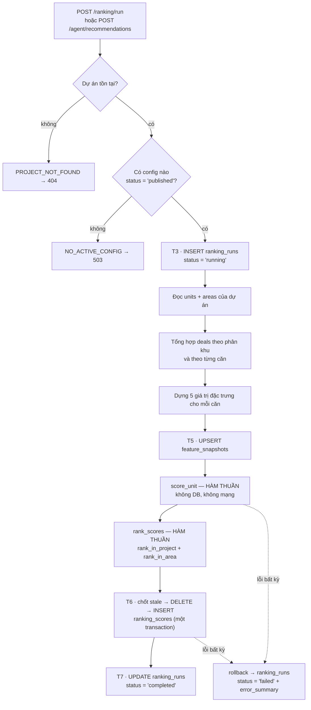

# Workflow của động cơ xếp hạng

Tài liệu **hiện thực đang chạy**, không phải kế hoạch. Kế hoạch đầy đủ (gồm cả phần
chưa làm) nằm ở [`implementation_plan.md`](./implementation_plan.md); file này mô tả
đúng những gì mã nguồn hôm nay làm, từ lúc có người bấm nút tới lúc con số hiện lên
màn hình.

Cập nhật: 2026-08-16 · config đang phát hành: **v2** (`0022_ranking_config_v2`)

---

## 0. Ba tầng, đọc từ dưới lên

```text
SỰ THẬT NGUỒN      units.status · deals.status · deals.sold_at · areas
   ↓  biến đổi tất định, chuẩn hoá về [0,1]
GIÁ TRỊ ĐẶC TRƯNG  feature_snapshots.feature_value  ∈ [0,1]
   ↓  nhân với trọng số của ranking_configs (status = 'published')
ĐIỂM CUỐI          ranking_scores.score  ∈ [0,1]  →  hạng  →  mức (high/medium/low)
```

Ranh giới quan trọng: **sự thật nguồn không bao giờ bị sao chép**. Chúng được ĐỌC lúc
chạy job và biến đổi ngay thành giá trị đặc trưng; `feature_snapshots` chỉ chứa kết quả
của phép biến đổi đó.

---

## 1. Cái gì kích hoạt một lần chạy

Hiện có **đúng hai** đường, cả hai đều đồng bộ trong request — không worker, không hàng đợi:

| Đường | Làm gì thêm | Vai trò tối thiểu |
|---|---|---|
| `POST /api/v1/ranking/run` | không gì cả — chỉ tính lại | `pipeline_operator` |
| `POST /api/v1/agent/recommendations` | tính lại **và** tạo một `agent_recommendations` ở trạng thái `pending_approval` | `business_viewer` |

Hai đường tách nhau có chủ đích: xem bảng xếp hạng mà bắt buộc phải đẻ ra một đề xuất
chờ người duyệt là làm loãng chính vòng duyệt mà `AGENTS.md` yêu cầu.

**`GET /api/v1/ranking` KHÔNG kích hoạt gì.** Nó thuần đọc. Nếu một lượt đọc cũng tính
lại thì hai người mở trang cùng lúc sẽ ghi đè điểm của nhau — `_persist_scores` là
xoá-rồi-chèn theo dự án.

Cột `ranking_runs.trigger` chấp nhận `sync` · `config_change` · `survey_snapshot` ·
`manual` · `audit_repair`. Hiện **chỉ `manual`** được dùng: cò tự động sau sync và cò
sau khi đổi config vẫn thuộc phần chưa làm.

---

## 2. Sơ đồ luồng



---

## 3. Ranh giới transaction

Bốn transaction riêng biệt, không phải một transaction dài:

| | Việc | Vì sao tách |
|---|---|---|
| **T3** | `INSERT ranking_runs` → `running`, rồi **commit ngay** | Lần chạy phải nhìn thấy được từ bên ngoài *trong khi* nó đang chạy. Gộp vào transaction cuối thì một job treo sẽ vô hình. |
| **T5** | `UPSERT feature_snapshots`, commit | Đặc trưng là kết quả dùng lại được, không phụ thuộc việc chấm điểm có thành công hay không. |
| — | `score_unit` + `rank_scores` | **Thuần bộ nhớ, KHÔNG transaction.** Không giữ kết nối DB trong lúc tính. |
| **T6** | `SELECT max(computed_at)` → `DELETE` → `INSERT` ranking_scores | **Một transaction.** Không bao giờ được tồn tại trạng thái "đã xoá điểm cũ, chưa chèn điểm mới" — trạng thái đó làm cả dự án biến mất khỏi đường đọc. |
| **T7** | `UPDATE ranking_runs` → trạng thái kết thúc | Ràng buộc `ck_ranking_runs_finished_by_status` ép `finished_at` phải có mặt đúng ở các trạng thái kết thúc. |

Guard chống ghi đè ở T6: nếu `max(computed_at)` của dự án **≥** mốc của lần chạy hiện
tại thì bỏ qua toàn bộ việc ghi. Nó chặn trường hợp hai request trùng thời điểm ghi
chồng lên nhau.

---

## 4. Bước 1 — Đọc sự thật nguồn

Bốn truy vấn, tất cả đều lọc `deleted_at IS NULL` ở **cả** `units` lẫn `deals`:

| Hàm | Trả về |
|---|---|
| `_project_units` | mọi căn còn sống của dự án + `created_at` (dùng để phá hoà) |
| `_area_features` | tổng hợp deal theo phân khu: số deal còn sống, số đã bán, số bán trong 30 ngày |
| `_has_active_deal_by_unit` | tập căn đang có deal `reserved`/`sold` |
| `_funnel_deal_counts` | số deal đang trong phễu của **từng căn** |

Số căn còn sống theo phân khu được đếm từ chính `unit_rows` đã đọc, không phải truy vấn
thêm — và nó là **mẫu số của `area_velocity_norm`** (xem mục 8).

Bộ đặc trưng này **không đọc** `sales_records` / `inventory_snapshots` /
`absorption_daily`. Ba bảng đó thuộc dashboard cũ; §6.5 của kế hoạch ghi rõ "KHÔNG dùng,
ở mọi mức" cho xếp hạng.

---

## 5. Bước 2 — Năm giá trị đặc trưng

| Khoá | Phạm vi | Công thức | Thiếu dữ liệu khi |
|---|---|---|---|
| `unit_available` | unit | `1` nếu `status = 'available'`, ngược lại `0` | không bao giờ |
| `unit_demand_norm` | unit | `min(số deal phễu của căn / 3, 1)` | không bao giờ |
| `has_active_deal` | unit | `1` nếu có deal `reserved`/`sold` còn sống | không bao giờ |
| `area_velocity_norm` | area | `min( (deal sold 30 ngày / số căn còn sống của phân khu) / 0.20 , 1 )` | phân khu chưa có deal nào |
| `area_conversion_norm` | area | `số deal sold / số deal còn sống của phân khu` | phân khu chưa có deal nào |

"Deal phễu" = `lead` · `qualified` · `interested` · `viewing`. `reserved`/`sold` **cố ý
không** nằm trong đó: chúng là trạng thái GIỮ, đã được `unit_available` phản ánh, và đếm
chúng vào "nhu cầu" sẽ thưởng điểm cho căn không còn bán được nữa.

**`has_active_deal` vẫn được tính dù config v2 không dùng nó.** `ranking_configs` là bảng
chỉ-thêm và rollback về trọng số v1 là thao tác hợp lệ; ngừng tính khoá này sẽ biến một
lần rollback đúng luật thành "đặc trưng MISSING" — sai âm thầm, không lỗi nào bật lên.

**"Chưa có deal nào" là THIẾU DỮ LIỆU, không phải "bán tệ".** Phân khu không có deal sẽ
vắng mặt khỏi kết quả `_area_features`, và bộ dựng đặc trưng để giá trị là `None` để
engine áp đúng chính sách `neutral` mà config khai báo. Điền sẵn `0` ở đây sẽ chấm một
phân khu vừa đồng bộ như phân khu bán **tệ nhất** dự án.

### Ghi `feature_snapshots`

Upsert theo khoá `(project_id, feature_key, scope, scope_id)`, kèm điều kiện
`WHERE excluded.calculated_at > feature_snapshots.calculated_at` — một ảnh chụp **cũ**
không bao giờ đè lên ảnh chụp mới hơn.

Đặc trưng MISSING **không được ghi**: cột `feature_value` là `NOT NULL`, và ghi `0` vào
đó chính là vật chất hoá đúng lời nói dối vừa gỡ ở trên.

---

## 6. Bước 3 — Chấm điểm (hàm thuần)

`src/ranking/engine.py` không import `sqlalchemy`, `asyncio`, `httpx`, `src.db` hay
`AsyncSession`. Ràng buộc này được canh bằng test, không phải bằng lời hứa.

```text
oriented(v, direction) = v        nếu 'positive'
                       = 1 - v    nếu 'negative'

Với mỗi feature_key trong config.weights:
    nếu giá trị là None, HOẶC (confidence có mặt VÀ < min_confidence):
        skip     → bỏ số hạng VÀ bỏ trọng số khỏi mẫu số
        zero     → value = 0.0,  trọng số VẪN tính
        neutral  → value = 0.5,  trọng số VẪN tính

    contribution = weight × oriented(value, direction)
    numerator   += contribution
    denominator += weight

coverage = denominator

nếu coverage < config.min_weight_coverage:
    BỎ QUA căn — không có dòng ranking_scores, đếm vào units_skipped
ngược lại:
    score = round(numerator / denominator, 4)   ROUND_HALF_UP   ∈ [0,1]
```

Từng số hạng được lưu nguyên vào `ranking_scores.contributions` (jsonb), và đó chính là
nguyên liệu cho phần "vì sao" mà giao diện mở ra dưới mỗi dòng.

> Với config v2, **không đặc trưng nào** dùng `skip`, nên `coverage` luôn bằng `1.0` và
> không căn nào bị bỏ qua. Đổi một đặc trưng sang `skip` sẽ khiến
> `min_weight_coverage = 0.5` bắt đầu loại căn một cách lặng lẽ.

---

## 7. Bước 4 — Xếp hạng (hàm thuần)

Căn bị `skipped` **không được xếp hạng** và giữ `rank_in_area` / `rank_in_project` là
`NULL` — thiếu dữ liệu và thật sự khó bán là hai chuyện khác nhau.

Khoá sắp xếp, hoàn toàn tất định:

```text
score DESC  →  units.created_at ASC  →  unit_id ASC
```

Hạng được gán ở **hai mức**: `rank_in_project` trên toàn dự án, `rank_in_area` trong từng
phân khu. Đặc trưng phạm vi `area` là hằng số bên trong một phân khu (không ảnh hưởng
`rank_in_area`) nhưng phân biệt được các căn thuộc hai phân khu khác nhau — đó là lý do
chúng vẫn có ích.

---

## 8. Bước 5 — Ghi kết quả

| Bảng | Ý nghĩa | Cách ghi |
|---|---|---|
| `ranking_scores` | **hiện tại** | xoá toàn bộ theo `project_id` rồi chèn lại |
| `ranking_runs` | **lịch sử** | chỉ thêm, không bao giờ xoá |
| `feature_snapshots` | **hiện tại** | upsert, bản cũ không đè bản mới |

Mỗi dòng `ranking_scores` mang `config_version_id` trỏ tới đúng config đã sinh ra nó.
Đây chính là lý do `ranking_configs` phải là bảng chỉ-thêm: sửa trọng số tại chỗ sẽ khiến
mọi điểm cũ trỏ tới một config đã đổi nghĩa, và không lần chạy nào giải thích lại được.

---

## 9. Đường đọc

```text
GET /api/v1/ranking
  → SELECT ranking_scores ⋈ units ⋈ areas   ORDER BY rank_in_project
  → band_for(score)        high ≥ 0.66 · medium ≥ 0.33 · thấp hơn = low
  → as_percent(score)      thang 0–100, làm tròn 1 chữ số
  → contributions          trải phẳng, sắp theo đóng góp GIẢM DẦN
```

Bộ lọc `band` được áp **trong Python**, không phải bằng `WHERE score >= 0.66`. Ngưỡng mức
sống ở `src/ranking/bands.py`; viết lại nó thành SQL là tạo bản sao thứ hai của cùng một
quy tắc, và hai bản sao sẽ lệch nhau đúng vào lần đầu ai đó chỉnh ngưỡng.

`band_counts` được tính trên toàn bộ tập khớp bộ lọc phân khu/trạng thái, và **không** bị
chính bộ lọc `band` thu hẹp — nếu không, chọn một mức sẽ làm số đếm trên các chip mức
khác tụt về 0 ngay khi người dùng bấm vào.

`computed_at = NULL` nghĩa là **chưa từng xếp hạng lần nào**, khác hẳn "đã xếp hạng nhưng
không căn nào đạt ngưỡng". Giao diện phải phân biệt được hai trạng thái đó.

---

## 10. Khi có lỗi

Mọi ngoại lệ trong thân job đều `rollback`, rồi ghi `ranking_runs.status = 'failed'` kèm
`error_summary`, rồi **ném lại**. Không có nhánh nào nuốt lỗi và để lại một lần chạy mãi
mãi ở trạng thái `running`.

| Mã lỗi | HTTP | Nghĩa |
|---|---|---|
| `PROJECT_NOT_FOUND` | 404 | không có dự án với `external_id` đó |
| `AREA_NOT_FOUND` | 404 | không có phân khu đó |
| `NO_ACTIVE_CONFIG` | 503 | không config nào đang `published` — lỗi **cấu hình hệ thống**, không phải lỗi tham số người gọi |
| `PROJECT_OUT_OF_SCOPE` | 403 | token không được cấp dự án này. **403 chứ không 404**: "không có quyền" và "không tồn tại" là hai sự thật khác nhau |
| `INVALID_BAND` | 422 | `band` không thuộc `high`/`medium`/`low` |

---

## 11. Bốn ranh giới không được phá

1. **Chỉ `src/ranking/service.py` được GHI** vào `feature_snapshots` / `ranking_configs` /
   `ranking_runs` / `ranking_scores`. Đọc thì ai cũng được — `src/api/ranking.py` và
   `src/agents/advisory_tools.py` đều đọc.
2. **`src/ranking/engine.py` là hàm thuần.** Không I/O, không mạng, không session DB.
3. **`agent_recommendations` luôn khởi tạo ở `pending_approval`.** Không đường nào tạo
   thẳng ở `approved`/`rejected`; chỉ đúng hai endpoint quyết định được phép đổi.
4. **Đổi schema chỉ qua `scripts/migrate.sh`** (sao lưu → kiểm chứng bản sao lưu →
   migrate), không bao giờ `alembic upgrade` trần.

Cả bốn đều được canh bởi `tests/test_ranking_boundary.py`. File đó **đỏ mỗi khi có
revision mới là tín hiệu đúng**, không phải hồi quy — ai cập nhật nó theo hiện thực mới
thì đang làm đúng việc.

---

## 12. Hằng số — và vì sao chúng không nằm trong config

| Hằng số | Giá trị | Ở đâu |
|---|---|---|
| `VELOCITY_SATURATION` | `0.20` | `src/ranking/service.py` |
| `DEMAND_SATURATION` | `3` | `src/ranking/service.py` |
| `FEATURE_VERSION` | `"v2"` | `src/ranking/service.py` |
| ngưỡng mức | `0.66` / `0.33` | `src/ranking/bands.py` |
| cửa sổ vận tốc | 30 ngày | `src/ranking/service.py` |

Đây là hằng số **chuẩn hoá** và **trình bày**, không phải quyết định trọng số. Trộn chúng
vào `ranking_configs` sẽ đặt hai thứ khác bản chất chung một chỗ, và lần sau không ai biết
mình đang chỉnh cái gì. Đổi trọng số → viết migration mới; đổi hằng số chuẩn hoá → sửa mã
và mọi điểm cũ đổi nghĩa, nên nó phải là một quyết định lớn hơn, không phải một dòng
config.

---

## 13. Giới hạn đã biết (số đo thật, không phải phỏng đoán)

- **Mức `high` hiện không với tới được với dữ liệu fixture.** Công thức cho phép — một căn
  có 2–3 người cùng quan tâm trong phân khu bán nhanh đạt ~0.73 — nhưng không căn nào
  trong fixture có quá **một** deal phễu, nên điểm cao nhất dừng ở `0.6590`. Đây là khoảng
  trống của `0021`, không phải của công thức.
- **Trong một phân khu, các căn còn trống chỉ có 2 giá trị điểm phân biệt** (có / không có
  deal phễu). Muốn phân biệt mịn hơn cần đặc trưng mức căn mà schema chưa có: giá, tầng,
  hướng nhìn.
- **`sold_at` của fixture neo vào khoảng cố định 2026-05-18 → 2026-08-03.** Khi thời gian
  thật trôi qua đầu tháng 9, cửa sổ 30 ngày cạn dần và `area_velocity_norm` tự tụt về 0.
- **Phạm vi `unit_type` không dùng được ở bộ dữ liệu này**: 0/58 phân khu có nhiều hơn một
  `unit_type` (phân khu vốn đã tách sẵn theo loại), nên đặc trưng phạm vi `unit_type` sẽ
  trùng hoàn toàn với phạm vi `area`.
- **Trạng thái dẫn xuất không sống sót khi volume database bị dựng lại.** Không có gì tự
  tính lại lúc khởi động; môi trường mới sẽ hiện "chưa được xếp hạng lần nào" cho tới khi
  có người bấm Tính lại.

---

## 14. Phần CHƯA làm

Ghi ở đây để không ai đọc lướt rồi tưởng đã đủ so với kế hoạch:

- worker RQ — mọi thứ chạy đồng bộ trong request
- cò tự động sau sync, và cò sau khi đổi config
- endpoint nhập đặc trưng khảo sát (`view_quality`, `natural_light`, `privacy`,
  `noise_level`)
- `days_on_market` — cần `units.listed_at`, một trường chưa tồn tại.
  **Không được dùng `units.created_at` thay thế**: đó là lúc bắt đầu soi gương, không phải
  lúc mở bán
- màn hình quản trị `ranking_configs` — đổi trọng số hiện chỉ đi qua migration
