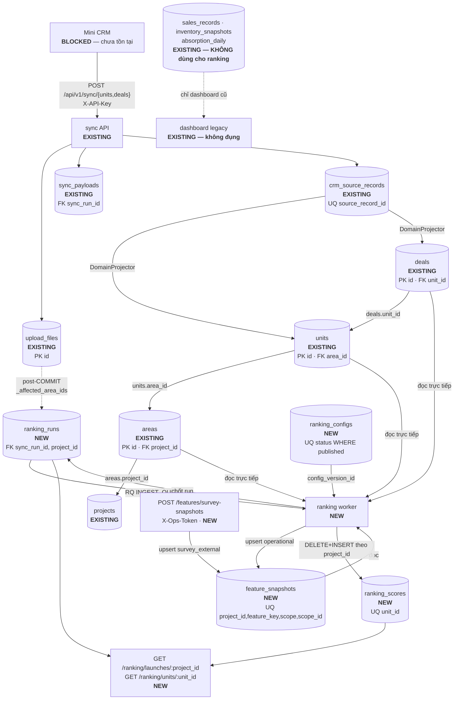

# Kê hoạch triển khai: database + pipeline cho bộ xếp hạng căn hộ

> **Trạng thái: KẾ HOẠCH cho MVP một tuần.** Tài liệu này là bản tư vấn kỹ thuật,
> không phải mô tả hệ thống đang chạy. Nó trả lời đúng một câu hỏi:
>
> > *Phải thêm bảng / cột / index / ràng buộc / phép biến đổi nào để hệ thống hiện
> > tại chạy được luồng: Mini CRM → nạp → bản sao miền → làm mới đặc trưng →
> > bộ xếp hạng → kết quả lưu lại → tự động xếp hạng lại theo phạm vi khi có dữ
> > liệu mới?*
>
> Đi kèm: `docs/ranking/data_contracts.md` (hợp đồng dữ liệu đầu-cuối chi tiết).

| Nhãn | Nghĩa |
|---|---|
| `EXISTING` | Đã có, dùng lại nguyên trạng, KHÔNG sửa |
| `MODIFY` | Đã có, phải sửa/mở rộng |
| `NEW` | Phải tạo mới tuần này |
| `BLOCKED` | Không làm được cho tới khi có Mini CRM thật / dữ liệu thật |
| `UNKNOWN` | Repo không đủ bằng chứng — KHÔNG được đoán |

---

## 1. Executive Decision

**Bộ xếp hạng chạy được NGAY tuần này mà không cần một trường nguồn mới nào.**
`units` + `deals` + `areas` đã đủ để tính bốn đặc trưng vận hành tất định. Thứ
thiếu **không phải dữ liệu nguồn** mà là **tầng lưu trữ kết quả** (4 bảng mới) và
**dây kích hoạt** sau khi lô đồng bộ commit.

Bảy quyết định chốt, không bàn lại trong tuần:

| # | Quyết định | Lý do |
|---|---|---|
| 1 | **Đơn vị nguyên tử của việc xếp hạng lại là DỰ ÁN, không phải phân khu.** | `rank_in_project` (endpoint "ranking by launch") đổi khi BẤT KỲ căn nào đổi điểm. Xếp hạng theo phạm vi phân khu không giữ được `rank_in_project` đúng. Ở quy mô pilot (≤ vài nghìn căn) một lần tính lại toàn dự án là ~1 giây. **Đây là điều chỉnh so với bản `data_contracts.md` §5.3** (bản đó nói "phân khu"; tài liệu đã được xuất PDF và gỡ khỏi repo — quyết định ở đây là bản chuẩn) — chi tiết ở §8. |
| 2 | **Chống dồn job bằng partial unique index** `ranking_runs (project_id) WHERE status='queued'`. | 100 lô đồng bộ trong một phút → vẫn chỉ 1 lần tính lại. Ràng buộc nằm ở DB, không nằm ở trí nhớ người viết code. |
| 3 | **Config seed v1 CHỈ dùng đặc trưng vận hành**, tổng trọng số = 1.0. | Hệ thống cho ra thứ hạng thật từ ngày đầu, không cần chờ dữ liệu khảo sát. Đặc trưng khảo sát vào ở config v2. |
| 4 | **KHÔNG tạo bảng `ranking_audit`.** | Mọi trạng thái nó định ghi đã nằm ở `ranking_runs` (`status`, `attempt`, `enqueued_at`). Audit là một JOB, không phải một bảng. |
| 5 | **`days_on_market` bị HOÃN, không dùng `units.created_at`.** | `units.created_at` là *lúc bắt đầu soi gương*, không phải *lúc mở bán*. Dùng nó là bịa ra ý nghĩa. Cần trường nguồn mới `listed_at`. |
| 6 | **`feature_snapshots` mang `project_id`.** | Không có nó, đặc trưng phạm vi `unit_type` là toàn cục xuyên dự án — "2PN" của dự án A đè lên "2PN" của dự án B. |
| 7 | **`ranking_scores` là TRẠNG THÁI HIỆN TẠI, xoá-rồi-chèn theo dự án.** | Căn vừa bị tombstone hoặc rơi dưới ngưỡng phủ trọng số phải BIẾN MẤT khỏi mô hình đọc. Upsert sẽ để lại dòng ma. |

---

## 2. Existing Data Reusable by Ranking

### 2.1 Bảng phân tích khoảng trống

| Năng lực | Bảng/trường đang có | Dữ liệu còn thiếu | Hành động | Trạng thái | Ưu tiên |
|---|---|---|---|---|---|
| Danh sách căn theo dự án | `units(id, area_id, unit_code, unit_type, status, deleted_at)` ⋈ `areas(project_id)` | — | Đọc trực tiếp | `EXISTING` | P0 |
| Căn còn bán được | `units.status='available'`, `deleted_at IS NULL` | — | Đọc trực tiếp | `EXISTING` | P0 |
| Căn đang bị giữ | `deals(unit_id, status, deleted_at)`, partial unique `uq_deals_active_per_unit` | — | Đọc trực tiếp | `EXISTING` | P0 |
| Vận tốc bán theo phân khu | `deals.sold_at` ⋈ `units.area_id` ⋈ `areas.total_units` | — | Tính lúc chạy job | `EXISTING` | P0 |
| Tỷ lệ chốt theo phân khu | `deals.status` ⋈ `units.area_id` | — | Tính lúc chạy job | `EXISTING` | P0 |
| Quy mô phân khu | `areas(total_units, area_sqm, bedrooms)` | — | Đọc trực tiếp | `EXISTING` | P0 |
| Phạm vi bị ảnh hưởng sau đồng bộ | `SyncRunService._affected_area_ids`, `RecordOutcomes.touched` | — | Dùng lại nguyên trạng | `EXISTING` | P0 |
| Danh tính/phiên bản nguồn | `crm_source_records` | — | Không đụng | `EXISTING` | — |
| Payload thô để chạy lại | `sync_payloads` | — | Không đụng | `EXISTING` | — |
| Trạng thái lô | `upload_files` | trường ranking trong **response** (không phải cột DB) | Mở rộng Pydantic model | `MODIFY` | P0 |
| **Ngày mở bán / niêm yết** | — | `units.listed_at` | Trường nguồn mới + cột mới | `BLOCKED` | P2 |
| **Giá căn** | — | toàn bộ | Không có ở bất kỳ đâu trong repo | `BLOCKED` | P2 |
| **Chất lượng view / ánh sáng / riêng tư / ồn** | — | toàn bộ | Ảnh chụp đặc trưng khảo sát | `NEW` | P1 |
| **Lưu giá trị đặc trưng** | — | toàn bộ | `feature_snapshots` | `NEW` | P0 |
| **Trọng số xếp hạng** | — | toàn bộ | `ranking_configs` | `NEW` | P0 |
| **Vòng đời lần xếp hạng** | — | toàn bộ | `ranking_runs` | `NEW` | P0 |
| **Điểm + thứ hạng** | — | toàn bộ | `ranking_scores` | `NEW` | P0 |

### 2.2 Trả lời thẳng các câu hỏi

**Bảng cũ nào bộ xếp hạng ĐỌC TRỰC TIẾP được?**
`units`, `deals`, `areas`, `projects`. Đủ cho toàn bộ đặc trưng vận hành của MVP.

**Bảng cũ nào CHỈ có dữ liệu tổng hợp (không dùng được cho xếp hạng từng căn)?**
`sales_records`, `inventory_snapshots`, `absorption_daily`. Cả ba ở mức **phân
khu × ngày**, sinh từ Excel/CSV. Chúng **không chứa và không dựng lại được** thông
tin từng căn. Bộ xếp hạng **KHÔNG đọc ba bảng này** — xem §6.5.

**Trường hiện có nào KHÔNG đủ cho xếp hạng mức căn?**

| Trường | Vì sao không đủ |
|---|---|
| `units.created_at` | Lúc bắt đầu soi gương, KHÔNG phải lúc mở bán. Dùng làm `days_on_market` là bịa nghĩa. Chỉ an toàn khi làm **khoá phụ phá hoà** (tất định, không mang nghĩa nghiệp vụ). |
| `units.unit_code` | Chuỗi tự do. Không tách được tầng/hướng nếu không có quy ước đặt tên — repo không chứng minh có quy ước nào. `UNKNOWN`. |
| `areas.area_sqm` | Diện tích của **phân khu**, không phải của từng căn. Không dùng cho so sánh giữa các căn cùng phân khu. |
| `absorption_daily.units_reserved` | NULL với lineage `legacy_aggregate` (mọi dự án hiện tại). Không dùng được. |
| `deals.source_status` | Có ích để truy vết, vô nghĩa để tính điểm (đã chuẩn hoá sang `deals.status`). |

**Dữ liệu nào KHÔNG được sao chép sang bảng mới?**
`units.status`, `deals.status`, `units.area_id`, mọi cột phiên bản nguồn. CRM là
nguồn sự thật; sao chép sang `feature_snapshots` sẽ tạo hai giá trị mâu thuẫn về
cùng một sự thật. `feature_snapshots` **chỉ chứa giá trị ĐÃ CHUẨN HOÁ [0,1]**, là
dẫn xuất, luôn tính lại được, không bao giờ là nguồn.

**Dữ liệu mới nào cần hợp đồng nguồn mới?**
Chỉ đặc trưng khảo sát (`view_quality`, `natural_light`, `privacy`, `noise_level`)
qua `POST /api/v1/features/survey-snapshots` — endpoint riêng, xem
`data_contracts.md` §1.8.

**Trường nguồn nào KHÔNG AN TOÀN về ngữ nghĩa hoặc `UNKNOWN`?**

| Trường | Vấn đề |
|---|---|
| `units.created_at` | `UNKNOWN` với vai trò ngày niêm yết — **cấm dùng** làm `days_on_market` |
| `units.status` từ CRM thật | `UNKNOWN` — mã nguồn chỉ nhận `available/reserved/sold/blocked` viết thường, **không có bảng alias** cho unit (khác deal). CRM phát `con_trong` sẽ bị từ chối. |
| `source_extracted_at` | Được kiểm nhưng **không được lưu** — không có cột. Không dùng làm mốc độ tươi. |
| `deals` không có nhật ký sự kiện | Chỉ có `reserved_at`/`sold_at`/`lost_at` hiện tại. Không dựng lại được trạng thái giữ chỗ theo từng ngày trong quá khứ. |

---

## 3. Missing Data

| Dữ liệu | Vì sao cần | Đường vào | Trạng thái | Ưu tiên |
|---|---|---|---|---|
| `view_quality`, `natural_light`, `privacy`, `noise_level` | Đây là **lý do tồn tại** của bộ xếp hạng — đặc trưng vận hành chỉ phân biệt được căn còn trống với căn đã giữ | `POST /features/survey-snapshots` → `feature_snapshots` | `NEW` | P1 |
| `units.listed_at` | `days_on_market` đúng nghĩa | Trường mới ở hợp đồng v1 + cột mới + migration | `BLOCKED` (chờ CRM) | P2 |
| Giá bán / giá niêm yết | Xếp hạng theo giá trị đồng tiền | Không có ở bất kỳ đâu — hợp đồng lẫn mô hình miền đều không có | `BLOCKED` | P2 |
| Bảng alias trạng thái unit | CRM thật có thể phát từ vựng tiếng Việt | Xác nhận với đội CRM → bảng ánh xạ trong `domain_projection.py` | `UNKNOWN` | P1 |
| Tầng / hướng / view code của từng căn | Đặc trưng vật lý ổn định | Không có; `unit_code` không tách được | `BLOCKED` | P2 |

---

## 4. Tables and Schema Changes

### 4.1 Tổng quan bảng mới

| Bảng | Mục đích | Nguồn sự thật | Bên ghi | Bên đọc | Lưu giữ | Trạng thái |
|---|---|---|---|---|---|---|
| `feature_snapshots` | Giá trị đặc trưng đã chuẩn hoá [0,1] | bộ tính vận hành (tự sinh) + bộ tổng hợp khảo sát ngoài | job xếp hạng, endpoint khảo sát | job xếp hạng, API preview | trạng thái hiện tại, upsert | `NEW` P0 |
| `ranking_configs` | Trọng số + chính sách, có version | kỹ sư (qua API có bảo vệ) | API config, migration seed | job xếp hạng, API đọc | chỉ-thêm, giữ mãi | `NEW` P0 |
| `ranking_runs` | Vòng đời một lần xếp hạng | ứng dụng này | bên xếp hàng, worker | API trạng thái, job audit | chỉ-thêm, giữ mãi | `NEW` P0 |
| `ranking_scores` | Điểm + thứ hạng hiện hành | dẫn xuất | worker xếp hạng | API đọc | **trạng thái hiện tại**, xoá-rồi-chèn | `NEW` P0 |
| ~~`ranking_audit`~~ | — | — | — | — | — | **KHÔNG TẠO** — xem §1 quyết định 4 |

### 4.2 `feature_snapshots` — `NEW`, P0

| Cột | Kiểu | Bắt buộc | Mặc định | Ràng buộc | Index | Vì sao cần |
|---|---|---|---|---|---|---|
| `id` | uuid | Có | — | PK `pk_feature_snapshots` | PK | khoá kỹ thuật |
| `project_id` | uuid | Có | — | FK → `projects.id` ON DELETE CASCADE | (dưới) | **cô lập `unit_type` theo dự án** |
| `feature_key` | text | Có | — | `<> ''` | (dưới) | định danh đặc trưng |
| `scope` | text | Có | — | `IN ('unit','area','unit_type')` | (dưới) | mức áp dụng |
| `scope_id` | text | Có | — | `<> ''` | (dưới) | **TEXT**: uuid dạng chuỗi với unit/area, chuỗi `unit_type` với unit_type |
| `feature_value` | numeric(6,4) | Có | — | `>= 0 AND <= 1` | — | mọi giá trị đã chuẩn hoá; DB cưỡng chế |
| `sample_count` | integer | Không | NULL | `IS NULL OR >= 0` | — | cỡ mẫu khảo sát |
| `confidence` | numeric(5,4) | Không | NULL | `IS NULL OR (>= 0 AND <= 1)` | — | so với `min_confidence` |
| `source` | text | Có | — | `IN ('operational','survey_external')` | — | phân biệt tự tính với nhập ngoài |
| `feature_version` | text | Có | — | `<> ''` | — | truy vết cách tính |
| `calculated_at` | timestamptz | Có | — | — | — | mốc độ tươi + chốt chống ghi đè |
| `created_at` | timestamptz | Có | `now()` | — | — | — |
| `updated_at` | timestamptz | Có | `now()` | `>= created_at` | — | — |

```sql
-- Khoá upsert
CREATE UNIQUE INDEX uq_feature_snapshots_identity
  ON feature_snapshots (project_id, feature_key, scope, scope_id);
-- Đường đọc của job xếp hạng
CREATE INDEX ix_feature_snapshots_project_scope
  ON feature_snapshots (project_id, scope, scope_id);
```

* **Khoá upsert:** `(project_id, feature_key, scope, scope_id)`
* **Xoá/tombstone:** không có. Đặc trưng lỗi thời được ghi đè, không đánh dấu xoá.
* **Hiện tại vs chỉ-thêm:** **trạng thái hiện tại**. Lịch sử đặc trưng bị `DEFER` —
  chưa có ai đọc, thêm bây giờ là thêm bảo trì thừa.
* **Chống ghi đè ngược:** `ON CONFLICT ... WHERE excluded.calculated_at > feature_snapshots.calculated_at`.

### 4.3 `ranking_configs` — `NEW`, P0

| Cột | Kiểu | Bắt buộc | Mặc định | Ràng buộc | Index | Vì sao cần |
|---|---|---|---|---|---|---|
| `id` | uuid | Có | — | PK | PK | |
| `version` | integer | Có | — | `> 0`, UNIQUE | unique | số hiệu người đọc được |
| `status` | text | Có | `'draft'` | `IN ('draft','published','archived')` | (dưới) | vòng đời |
| `weights` | jsonb | Có | — | `<> '{}'::jsonb` | — | `{feature_key: {weight, direction, missing_value_policy, min_confidence}}` |
| `min_weight_coverage` | numeric(5,4) | Có | `0.5` | `> 0 AND <= 1` | — | ngưỡng bỏ qua căn thiếu dữ liệu |
| `note` | text | Có | `''` | — | — | vì sao đổi |
| `copied_from_version` | integer | Không | NULL | — | — | dấu vết rollback |
| `created_by` | text | Có | — | `<> ''` | — | kiểm toán |
| `created_at` | timestamptz | Có | `now()` | — | — | |
| `published_by` | text | Không | NULL | — | — | kiểm toán |
| `published_at` | timestamptz | Không | NULL | (dưới) | — | |
| `archived_at` | timestamptz | Không | NULL | — | — | |

```sql
-- ĐÚNG MỘT config đang phát hành, cưỡng chế ở DB (cùng ý tưởng uq_deals_active_per_unit)
CREATE UNIQUE INDEX uq_ranking_configs_published
  ON ranking_configs (status) WHERE status = 'published';

ALTER TABLE ranking_configs ADD CONSTRAINT ck_ranking_configs_published_stamp
  CHECK ((status = 'published') = (published_at IS NOT NULL));
ALTER TABLE ranking_configs ADD CONSTRAINT ck_ranking_configs_archived_stamp
  CHECK ((status = 'archived') = (archived_at IS NOT NULL));
```

* **Khoá upsert:** không có — luôn INSERT bản mới.
* **Xoá:** không bao giờ. Rollback = chép trọng số cũ sang **version mới**.
* **Hiện tại vs chỉ-thêm:** **chỉ-thêm**. `weights` của một dòng `published`
  không bao giờ được UPDATE — nếu không, mọi `ranking_scores` cũ trỏ tới một
  config đã đổi nghĩa và không giải thích lại được.

**Seed trong migration — version 1, `published`, CHỈ đặc trưng vận hành:**

```json
{
  "unit_available":       { "weight": 0.50, "direction": "positive", "missing_value_policy": "zero",    "min_confidence": 0.0 },
  "has_active_deal":      { "weight": 0.20, "direction": "negative", "missing_value_policy": "zero",    "min_confidence": 0.0 },
  "area_velocity_norm":   { "weight": 0.20, "direction": "positive", "missing_value_policy": "neutral", "min_confidence": 0.0 },
  "area_conversion_norm": { "weight": 0.10, "direction": "positive", "missing_value_policy": "neutral", "min_confidence": 0.0 }
}
```

Tổng = 1.0. Cả bốn đều `DERIVED FROM EXISTING DATA` ⇒ **hệ thống cho ra thứ hạng
thật ngay ngày migration chạy, không cần một byte dữ liệu khảo sát nào.**

### 4.4 `ranking_runs` — `NEW`, P0

| Cột | Kiểu | Bắt buộc | Mặc định | Ràng buộc | Index | Vì sao cần |
|---|---|---|---|---|---|---|
| `id` | uuid | Có | — | PK | PK | `ranking_run_id`, đồng thời là **claim token** |
| `project_id` | uuid | Có | — | FK → `projects.id` ON DELETE CASCADE | (dưới) | phạm vi |
| `sync_run_id` | uuid | Không | NULL | FK → `upload_files.id` ON DELETE SET NULL | (dưới) | nối thứ hạng ngược về lô CRM |
| `trigger` | text | Có | — | `IN ('sync','config_change','survey_snapshot','manual','audit_repair')` | — | vì sao chạy |
| `scope_type` | text | Có | `'project'` | `IN ('project')` | — | MVP chỉ có phạm vi dự án (§1 qđ 1) |
| `scope_ids` | jsonb | Có | `'{}'` | — | — | `{"unit_ids":[...],"area_ids":[...]}` — **chỉ để kiểm toán** |
| `config_version_id` | uuid | Không | NULL | FK → `ranking_configs.id` | — | NULL tới khi claim |
| `status` | text | Có | `'queued'` | `IN ('queued','running','completed','partially_completed','failed','skipped_stale')` | (dưới) | |
| `attempt` | integer | Có | `0` | `>= 0` | — | tăng mỗi lần claim |
| `units_processed` | integer | Có | `0` | `>= 0` | — | |
| `units_ranked` | integer | Có | `0` | `>= 0` | — | |
| `units_skipped` | integer | Có | `0` | `>= 0` | — | |
| `error_summary` | jsonb | Có | `'{}'` | — | — | lý do bỏ qua từng căn |
| `enqueued_at` | timestamptz | Có | `now()` | — | (dưới) | |
| `started_at` | timestamptz | Không | NULL | (dưới) | — | **lần đọc đồng hồ DUY NHẤT** của run |
| `finished_at` | timestamptz | Không | NULL | (dưới) | — | |

```sql
-- CHỐNG DỒN: tối đa MỘT run đang chờ cho mỗi dự án.
-- 100 lô đồng bộ trong một phút vẫn chỉ sinh 1 lần tính lại.
CREATE UNIQUE INDEX uq_ranking_runs_queued_per_project
  ON ranking_runs (project_id) WHERE status = 'queued';

CREATE INDEX ix_ranking_runs_project_enqueued
  ON ranking_runs (project_id, enqueued_at DESC);
CREATE INDEX ix_ranking_runs_sync_run_id ON ranking_runs (sync_run_id);

ALTER TABLE ranking_runs ADD CONSTRAINT ck_ranking_runs_started_by_status
  CHECK ((status = 'queued') = (started_at IS NULL));
ALTER TABLE ranking_runs ADD CONSTRAINT ck_ranking_runs_finished_by_status
  CHECK ((status IN ('queued','running') AND finished_at IS NULL)
      OR (status IN ('completed','partially_completed','failed','skipped_stale')
          AND finished_at IS NOT NULL));
ALTER TABLE ranking_runs ADD CONSTRAINT ck_ranking_runs_time_order
  CHECK (finished_at IS NULL OR started_at IS NULL OR finished_at >= started_at);
ALTER TABLE ranking_runs ADD CONSTRAINT ck_ranking_runs_counts
  CHECK (units_ranked + units_skipped <= units_processed);
```

* **Khoá upsert:** `(project_id) WHERE status='queued'` — bên xếp hàng dùng
  `ON CONFLICT DO UPDATE` để **gộp** `scope_ids` thay vì tạo run thứ hai.
* **Xoá:** không bao giờ. Lịch sử vận hành.
* **Hiện tại vs chỉ-thêm:** **chỉ-thêm**, giữ mãi.
* Từ vựng `status` cố ý soi gương `upload_files` để người vận hành đọc cùng một
  ngôn ngữ trạng thái ở cả hai luồng.

### 4.5 `ranking_scores` — `NEW`, P0

| Cột | Kiểu | Bắt buộc | Mặc định | Ràng buộc | Index | Vì sao cần |
|---|---|---|---|---|---|---|
| `id` | uuid | Có | — | PK | PK | |
| `unit_id` | uuid | Có | — | FK → `units.id` ON DELETE CASCADE, **UNIQUE** | unique | một điểm hiện hành mỗi căn |
| `area_id` | uuid | Có | — | FK → `areas.id` | (dưới) | phi chuẩn hoá cho đường đọc |
| `project_id` | uuid | Có | — | FK → `projects.id` ON DELETE CASCADE | (dưới) | phạm vi xoá-rồi-chèn |
| `ranking_run_id` | uuid | Có | — | FK → `ranking_runs.id` | — | nguồn gốc |
| `config_version_id` | uuid | Có | — | FK → `ranking_configs.id` | — | nguồn gốc |
| `score` | numeric(6,4) | Có | — | `>= 0 AND <= 1` | — | |
| `rank_in_area` | integer | Có | — | `> 0` | (dưới) | thứ hạng trong phân khu |
| `rank_in_project` | integer | Có | — | `> 0` | (dưới) | thứ hạng toàn dự án ("ranking by launch") |
| `weight_coverage` | numeric(5,4) | Có | — | `> 0 AND <= 1` | — | phần trọng số thực sự có mặt |
| `contributions` | jsonb | Có | `'{}'` | — | — | **giải thích được**: đóng góp từng đặc trưng |
| `feature_freshness_at` | timestamptz | Không | NULL | — | — | `min(calculated_at)` các đặc trưng đã dùng |
| `computed_at` | timestamptz | Có | — | — | — | `= ranking_runs.started_at`; căn cứ chống ghi đè |

```sql
CREATE UNIQUE INDEX uq_ranking_scores_unit ON ranking_scores (unit_id);
CREATE INDEX ix_ranking_scores_project_rank ON ranking_scores (project_id, rank_in_project);
CREATE INDEX ix_ranking_scores_area_rank    ON ranking_scores (area_id, rank_in_area);
```

* **Khoá upsert:** không dùng upsert. **DELETE theo `project_id` rồi INSERT**,
  trong một transaction — đúng ý tưởng `DomainAbsorptionCalculatorService.persist()`.
* **Xoá/tombstone:** căn bị tombstone hoặc rơi dưới `min_weight_coverage` **biến
  mất** khỏi bảng ở lần tính lại kế tiếp. Đây là lý do phải xoá-rồi-chèn.
* **Hiện tại vs chỉ-thêm:** **trạng thái hiện tại**. Lịch sử thứ hạng bị `DEFER`
  — muốn có thì thêm `ranking_score_history` sau, không phải tuần này.
* **KHÔNG** đặt UNIQUE trên `(project_id, rank_in_project)`: trong lúc chèn lại cả
  dự án nó sẽ vỡ giữa chừng nếu không deferrable, và cái giá không đáng.

### 4.6 `MODIFY` — không đổi schema

| Hạng mục | Thay đổi | Trạng thái |
|---|---|---|
| `src/models/schemas.py::SyncRunAccepted` | +`ranking_status`, `ranking_job_id`, `ranking_run_id`, `affected_scope` | `MODIFY`, chỉ thêm |
| `src/models/schemas.py::SyncRunDetail` | +`ranking_status`, `ranking_run_id` | `MODIFY`, chỉ thêm |
| `src/services/sync_runs.py::_process` | sau COMMIT: tạo/gộp `ranking_runs` + xếp hàng | `MODIFY` |
| `src/services/domain_projection.py::_project_unit` | chấp nhận `area_ref` dạng `area_id` | `MODIFY` (**PHẢI SỬA**, xem §10) |
| `src/models/tables.py` | +4 bản chiếu `sa.Table` | `MODIFY` |
| `src/main.py` | +2 router | `MODIFY` |
| `src/scheduler.py` | +cron `ranking_audit` | `MODIFY` |

**Không đụng tới:** `sales_records`, `inventory_snapshots`, `absorption_daily`,
`src/services/absorption.py`, `src/api/dashboard.py`, `src/jobs/parse_upload.py`,
`src/services/excel_parser.py`, `src/services/import_records.py`. Luồng Excel/CSV
và dashboard cũ giữ nguyên hoàn toàn.

---

## 5. Feature Model

### 5.1 Ba khái niệm tách bạch

```text
SOURCE FACTS          units.status, deals.status, deals.sold_at, areas.total_units
   ↓ phép biến đổi tất định, chuẩn hoá về [0,1]
FEATURE VALUES        feature_snapshots.feature_value  ∈ [0,1]
   ↓ nhân với
FEATURE WEIGHTS       ranking_configs.weights[feature_key].weight
   ↓ tổng có trọng số / tổng trọng số đã dùng
FINAL SCORE           ranking_scores.score  ∈ [0,1]
```

Ranh giới quan trọng: **source facts không bao giờ bị sao chép**; chúng được ĐỌC
lúc chạy job và biến đổi thành feature values. `feature_snapshots` chỉ chứa kết
quả của phép biến đổi.

### 5.2 Bộ đặc trưng MVP

| Đặc trưng | Nguồn | Cách tính | Phạm vi | Khoảng chuẩn hoá | Chính sách thiếu | Cần confidence | Trạng thái |
|---|---|---|---|---|---|---|---|
| `unit_available` | `units.status` | `1.0` nếu `= 'available'`, ngược lại `0.0` | unit | {0,1} | `zero` | không | **DERIVED FROM EXISTING DATA** |
| `has_active_deal` | `deals` | `1.0` nếu tồn tại deal `status IN ('reserved','sold') AND deleted_at IS NULL`, ngược lại `0.0`; direction `negative` | unit | {0,1} | `zero` | không | **DERIVED FROM EXISTING DATA** |
| `area_velocity_norm` | `deals.sold_at` ⋈ `units.area_id` ⋈ `areas.total_units` | `min( (số deal sold 30 ngày qua trong phân khu) / max(areas.total_units,1) / 0.20 , 1.0)` | area | [0,1] | `neutral` | không | **DERIVED FROM EXISTING DATA** |
| `area_conversion_norm` | `deals` ⋈ `units.area_id` | `(số deal sold) / max(số deal còn sống trong phân khu, 1)` | area | [0,1] | `neutral` | không | **DERIVED FROM EXISTING DATA** |
| `view_quality` | khảo sát ngoài | bộ tổng hợp ngoài chuẩn hoá sẵn | unit hoặc area | [0,1] | `skip` | **có**, `0.6` | **REQUIRES NEW SURVEY SNAPSHOT** |
| `natural_light` | khảo sát ngoài | như trên | unit hoặc area | [0,1] | `skip` | **có**, `0.6` | **REQUIRES NEW SURVEY SNAPSHOT** |
| `privacy` | khảo sát ngoài | như trên | unit hoặc area | [0,1] | `neutral` | **có**, `0.5` | **REQUIRES NEW SURVEY SNAPSHOT** |
| `noise_level` | khảo sát ngoài | như trên; direction `negative` | unit hoặc area | [0,1] | `neutral` | **có**, `0.5` | **REQUIRES NEW SURVEY SNAPSHOT** |
| `days_on_market` | — | `min((now − listed_at).days / 180, 1.0)` | unit | [0,1] | `skip` | không | **BLOCKED** — cần `units.listed_at`. **KHÔNG dùng `units.created_at`** |
| `price` / `price_per_sqm` | — | — | unit | — | — | — | **BLOCKED** — không có trường giá ở bất kỳ đâu |
| `historical booking velocity` (mức căn) | — | — | unit | — | — | — | **BLOCKED** — `deals` không có nhật ký sự kiện; một căn chỉ có vài giao dịch, không thành chuỗi |
| `conversion rate` (mức căn) | — | — | unit | — | — | — | **DEFERRED** → đã có ở mức phân khu qua `area_conversion_norm` |

**Hằng số `0.20` trong `area_velocity_norm`**: coi "bán 20% quỹ hàng trong 30
ngày" là mốc bão hoà. Đây là **quyết định kỹ thuật**, đặt làm hằng số có tên
`VELOCITY_SATURATION = 0.20` trong mã, **không** đưa vào config — trộn hằng số
chuẩn hoá vào trọng số sẽ khiến hai thứ khác bản chất nằm chung một chỗ.

### 5.3 Vì sao đặc trưng mức phân khu VẪN có ích

Vì thứ hạng được tính ở **cả hai mức**: `rank_in_area` và `rank_in_project`. Đặc
trưng phạm vi `area` là hằng số bên trong một phân khu (không ảnh hưởng
`rank_in_area`) nhưng **phân biệt được các căn thuộc hai phân khu khác nhau**
(ảnh hưởng `rank_in_project`).

---

## 6. Data Relationships

### 6.1 Sơ đồ



### 6.2 Khoá kết nối

| Từ | Tới | Khoá |
|---|---|---|
| `upload_files.id` | `ranking_runs.sync_run_id` | uuid, nullable |
| `units.area_id` | `areas.id` | uuid |
| `areas.project_id` | `projects.id` | uuid |
| `deals.unit_id` | `units.id` | uuid |
| `units.id` | `feature_snapshots.scope_id` | **uuid → TEXT** khi `scope='unit'` |
| `areas.id` | `feature_snapshots.scope_id` | **uuid → TEXT** khi `scope='area'` |
| `units.unit_type` | `feature_snapshots.scope_id` | **chuỗi literal** khi `scope='unit_type'`, cô lập thêm bởi `project_id` |
| `units.id` | `ranking_scores.unit_id` | uuid, UNIQUE |
| `ranking_configs.id` | `ranking_runs.config_version_id`, `ranking_scores.config_version_id` | uuid |

### 6.3 Dữ liệu nào ĐỌC TRỰC TIẾP, dữ liệu nào VẬT CHẤT HOÁ

| Loại | Cách xử lý | Vì sao |
|---|---|---|
| `units.status`, `deals.status`, quan hệ căn ↔ phân khu | **đọc trực tiếp** mỗi lần chạy job | CRM là nguồn sự thật; sao chép sinh ra hai giá trị mâu thuẫn |
| Đặc trưng vận hành (4 cái) | **vật chất hoá** vào `feature_snapshots` | để API preview và bước gỡ lỗi nhìn thấy đúng con số job đã dùng |
| Đặc trưng khảo sát | **vật chất hoá** (chỉ có đường vào này) | bộ tổng hợp ngoài là nguồn duy nhất |
| Điểm + thứ hạng | **vật chất hoá** vào `ranking_scores` | đường đọc phải là O(1), không tính lại mỗi request |
| Đóng góp từng đặc trưng | **vật chất hoá** vào `ranking_scores.contributions` | giải thích được mà không cần dựng lại toàn bộ phép tính |

### 6.4 Kế thừa theo phạm vi

```text
với mỗi (căn, feature_key):
    unit-scope   (project_id, feature_key, 'unit',      units.id::text)
 ?? area-scope   (project_id, feature_key, 'area',      units.area_id::text)
 ?? unit_type    (project_id, feature_key, 'unit_type', units.unit_type)
 ?? MISSING → áp missing_value_policy
```
Cụ thể nhất thắng. `project_id` có mặt ở mọi tầng nên `unit_type` **không** rò rỉ
giữa các dự án.

### 6.5 Bảng tổng hợp cũ — dùng tới đâu

**`sales_records`, `inventory_snapshots`, `absorption_daily`: KHÔNG dùng, ở mọi
mức.** Ba lý do:

1. Chúng ở mức **phân khu × ngày**, không dựng lại được thông tin từng căn.
2. Chúng đến từ Excel/CSV, không đến từ CRM — trộn hai nguồn vào một điểm số sẽ
   khiến không ai giải thích được con số đó nghĩa là gì.
3. `absorption_daily` đang có lineage `legacy_aggregate` cho mọi dự án, với
   `units_reserved = NULL` — không có gì để dùng.

Vận tốc mức phân khu mà bộ xếp hạng cần được tính **thẳng từ `deals`**, không đi
qua `absorption_daily`. Nhờ đó luồng Excel/CSV và dashboard cũ **không bị đụng tới
một dòng nào**.

---

## 7. Mini CRM to Ranking Flow

| # | Bước | Đầu vào | Đầu ra | Ghi DB | Transaction | Hành vi khi hỏng |
|---|---|---|---|---|---|---|
| 1 | CRM gửi payload | — | HTTP request | — | — | `BLOCKED` — mô phỏng bằng `scripts/sync_simulator.py` |
| 2 | Nạp: kiểm + lưu | raw bytes | `sync_run_id` | `upload_files`, `sync_payloads` | T1 (commit ngay) | 413/401/422 tuỳ cổng · `EXISTING` |
| 3 | Chiếu vào miền | `SyncEnvelope` | `RecordOutcomes` | `crm_source_records`, `units`, `deals` | T2 + SAVEPOINT/bản ghi | bản ghi hỏng chỉ rollback SAVEPOINT của nó · `EXISTING` |
| 4 | Xác định dòng đã chạm | `projections` | `touched{units,deals}` | — | trong T2 | — · `EXISTING` |
| 5 | Suy ra căn + phân khu | `touched` | `area_ids`, `unit_ids` | — | trong T2 (chỉ đọc) | — · `EXISTING` (`_affected_area_ids`) |
| 6 | Tạo/gộp `ranking_run` | project, scope | `ranking_run_id` | `ranking_runs` INSERT **ON CONFLICT DO UPDATE** (gộp `scope_ids`) | **T3 riêng, SAU commit T2** | GHI LOG, **không ném** — lô đã commit · `NEW` |
| 7 | Xếp hàng job | `ranking_run_id` | `ranking_job_id` | — | ngoài transaction | GHI LOG; run nằm ở `queued`, job audit vớt · `NEW` |
| 8 | Worker claim run | `ranking_run_id` | quyền sở hữu | `ranking_runs` → `running` | T4 riêng | 0 dòng ⇒ worker khác đã sở hữu ⇒ **thoát êm** · `NEW` |
| 9 | Truy vấn trạng thái hiện tại | `project_id` | căn + deal đang giữ + phân khu | — | không (chỉ đọc) | lỗi ⇒ run `failed`, RQ retry · `NEW` |
| 10 | Tính + lưu đặc trưng vận hành | facts | 4 đặc trưng × phạm vi | `feature_snapshots` upsert | T5 | như trên · `NEW` |
| 11 | Nạp config đang phát hành | — | `weights`, `min_weight_coverage` | — | trong T4 | không có ⇒ `failed`, `NO_ACTIVE_CONFIG` · `NEW` |
| 12 | Tính điểm + xếp hạng | đặc trưng + config | điểm, `rank_in_area`, `rank_in_project` | — | không (thuần bộ nhớ) | hàm thuần, không hỏng được vì I/O · `NEW` |
| 13 | Lưu `ranking_scores` | kết quả | — | `DELETE` + `INSERT` theo `project_id` | **T6, một transaction** | chốt chống ghi đè trong T6 ⇒ `skipped_stale` · `NEW` |
| 14 | Chốt run | số đếm | trạng thái kết thúc | `ranking_runs` UPDATE | T7 riêng | job audit vớt run kẹt `running` · `NEW` |
| 15 | API phơi kết quả | `project_id`/`unit_id` | JSON | — | không | 404 nếu chưa có run nào · `NEW` |

**Bảo đảm cô lập lỗi:** bước 6–15 hỏng **không bao giờ** rollback bước 2–3. Chúng
ở hai tiến trình, hai transaction khác nhau — bảo đảm **cấu trúc**, không phải
chính sách.

---

## 8. Reranking Trigger Matrix

### 8.1 Câu hỏi trung tâm — trả lời trước

> *Một căn đổi điểm có bắt buộc xếp hạng lại mọi căn còn sống trong phân khu không?*

**Có — và còn hơn thế: phải xếp hạng lại toàn DỰ ÁN.**

`rank_in_area` của căn X đổi ⇒ thứ hạng của mọi căn cùng phân khu dịch chuyển.
`rank_in_project` của căn X đổi ⇒ thứ hạng của **mọi căn trong dự án** dịch
chuyển. Vì endpoint "ranking by launch" phơi `rank_in_project`, phạm vi tính lại
đúng duy nhất là **cả dự án**.

Chi phí ở quy mô pilot: một truy vấn căn + một truy vấn deal + một phép sắp xếp
trong bộ nhớ trên ≤ vài nghìn dòng ≈ **dưới 1 giây**. Việc "tối ưu" bằng cách chỉ
tính lại một phân khu đổi lấy một lớp lỗi thứ hạng không nhất quán — không đáng.

`unit_ids`/`area_ids` vẫn được ghi vào `scope_ids` để **kiểm toán** ("lô nào đã
gây ra lần tính lại này"), nhưng **không bao giờ** dùng để thu hẹp công việc.

### 8.2 Ma trận

| Kích hoạt | Dữ liệu bị ảnh hưởng | Phạm vi tính lại | Toàn bộ / gia tăng | Lý do |
|---|---|---|---|---|
| Căn mới (`inserted`) | `units` +1 dòng | **cả dự án** | toàn bộ | thêm một căn đẩy thứ hạng của mọi căn xếp sau nó |
| Đổi trạng thái căn | `units.status` | **cả dự án** | toàn bộ | `unit_available` đổi ⇒ điểm đổi ⇒ thứ hạng dịch |
| Deal mới | `deals` +1 dòng | **cả dự án** | toàn bộ | `has_active_deal` + `area_conversion_norm` đổi |
| Đổi trạng thái deal | `deals.status` | **cả dự án** | toàn bộ | như trên; `reserved → sold` còn đổi `area_velocity_norm` |
| Xoá / tombstone deal | `deals.deleted_at` | **cả dự án** | toàn bộ | căn quay lại quỹ hàng |
| Tombstone căn | `units.deleted_at` | **cả dự án** | toàn bộ | căn phải **biến mất** khỏi `ranking_scores` |
| Khảo sát mức `unit` | `feature_snapshots` | **cả dự án** | toàn bộ | như trên |
| Khảo sát mức `area` | `feature_snapshots` | **cả dự án** | toàn bộ | mọi căn trong phân khu đổi điểm ⇒ `rank_in_project` dịch |
| Khảo sát mức `unit_type` | `feature_snapshots` | **cả dự án** | toàn bộ | như trên |
| **Publish config** | `ranking_configs` | **MỌI dự án** | toàn bộ | trọng số toàn cục ⇒ mọi điểm cũ mất hiệu lực; 1 job/dự án |
| **Rollback config** | `ranking_configs` | **MỌI dự án** | toàn bộ | rollback chính là một lần publish |
| Tính lại thủ công | — | cả dự án | toàn bộ | `trigger='manual'` |
| **Retry cùng job** | — | cả dự án | toàn bộ | claim từ `('queued','failed')`; kết quả **giống hệt** (tất định) |
| **Job xong sai thứ tự** | — | **BỎ QUA** | — | chốt `max(computed_at)` theo dự án ⇒ `skipped_stale` |
| Chỉ có `duplicate_noop`/`skip_stale`/`conflict` | không dòng nào đổi | **KHÔNG tính lại** | — | `inserted+updated+tombstoned = 0` ⇒ không xếp hàng |
| Nạp file Excel/CSV | `sales_records`, `inventory_snapshots` | **KHÔNG tính lại** | — | bộ xếp hạng không đọc bảng tổng hợp (§6.5) |

### 8.3 Chống dồn và chống ghi đè

```sql
-- Chống dồn: gộp mọi kích hoạt trong lúc chờ vào MỘT run
INSERT INTO ranking_runs (id, project_id, sync_run_id, trigger, scope_type, scope_ids, status, enqueued_at)
VALUES (:id, :project_id, :sync_run_id, :trigger, 'project', :scope_ids, 'queued', now())
ON CONFLICT (project_id) WHERE status = 'queued'
DO UPDATE SET scope_ids = ranking_runs.scope_ids || excluded.scope_ids
RETURNING id, (xmax = 0) AS created;
-- created=false ⇒ đã có run chờ, KHÔNG xếp hàng job thứ hai

-- Chống ghi đè, bên trong T6:
SELECT max(computed_at) FROM ranking_scores WHERE project_id = :project_id;
-- >= :run_started_at  ⇒  status='skipped_stale', không ghi gì
```

---

## 9. Ranking Job Contract

### 9.1 Payload

```json
{
  "ranking_run_id": "5d4c3b2a-0000-4000-8000-00000000bbbb",
  "project_id":     "3f1c8e2a-0000-4000-8000-000000000001",
  "trigger":        "sync",
  "sync_run_id":    "9c2b7a10-0000-4000-8000-00000000aaaa"
}
```

| Trường | Phân loại | Ghi chú |
|---|---|---|
| `ranking_run_id` | **required** · **stored** | claim token; dòng `ranking_runs` đã tồn tại trước khi job chạy |
| `project_id` | **required** · **stored** | phạm vi thật sự của công việc |
| `trigger` | **required** · **stored** | `sync`\|`config_change`\|`survey_snapshot`\|`manual`\|`audit_repair` |
| `sync_run_id` | *optional* · **stored** | null với trigger không phải sync |
| `unit_ids`, `area_ids` | *optional* · **derived** · **stored trong `scope_ids`** | **chỉ kiểm toán** — không thu hẹp công việc |
| `config_version_id` | **derived lúc chạy**, KHÔNG truyền vào | đóng dấu lên run và mọi dòng điểm |

Xếp hàng: `INGEST_QUEUE`, `Retry(max=3, interval=[10,30,60])` — đúng chính sách
của lệnh xếp hàng tính lại lineage miền đang có.

### 9.2 Đầu ra thành công

```json
{
  "status": "done",
  "ranking_run_id": "5d4c3b2a-0000-4000-8000-00000000bbbb",
  "run_status": "completed",
  "project_id": "3f1c8e2a-0000-4000-8000-000000000001",
  "sync_run_id": "9c2b7a10-0000-4000-8000-00000000aaaa",
  "trigger": "sync",
  "units_processed": 312,
  "units_ranked": 310,
  "units_skipped": 2,
  "areas_reranked": 7,
  "config_version": 1,
  "config_version_id": "cfg-0001-0000-4000-8000-00000000cccc",
  "feature_freshness_at": "2026-08-11T01:30:00Z",
  "finished_at": "2026-08-11T02:15:10.482Z",
  "duration_ms": 384.2
}
```

### 9.3 Đầu ra thất bại

```json
{
  "status": "failed",
  "ranking_run_id": "5d4c3b2a-0000-4000-8000-00000000bbbb",
  "run_status": "failed",
  "project_id": "3f1c8e2a-0000-4000-8000-000000000001",
  "error_code": "NO_ACTIVE_CONFIG",
  "message": "Không có ranking_configs nào ở trạng thái 'published'",
  "attempt": 2,
  "finished_at": "2026-08-11T02:15:10.482Z"
}
```

| Mã lỗi | Nghĩa | Có retry không |
|---|---|---|
| `NO_ACTIVE_CONFIG` | chưa publish config nào | **không** — retry vô ích, cần người vào publish |
| `PROJECT_NOT_FOUND` | dự án đã bị xoá | **không** |
| `ALREADY_CLAIMED` | worker khác đang chạy | **không** — thoát êm, `status='done'` |
| `STALE_RESULT` | run mới hơn đã ghi | **không** — `run_status='skipped_stale'` |
| lỗi DB / kết nối | hạ tầng | **có** — RQ retry 3 lần |

**Hành vi retry:** khối `except` đặt `status='failed'` trước khi ném lại, nên lần
claim sau (`WHERE status IN ('queued','failed')`) nhận được run. Tiến trình bị
giết cứng để lại `status='running'` → job `ranking_audit` chạy hằng giờ đưa các
run kẹt quá ngưỡng về `queued` và xếp hàng lại, **luôn phát cảnh báo kể cả khi vá
thành công** — cùng triết lý với `domain_recompute_audit`.

---

## 10. Ranking Calculation and Persistence

### 10.1 Công thức

```text
oriented(v, direction) = v              nếu direction = 'positive'
                       = 1 - v          nếu direction = 'negative'

Với mỗi căn, duyệt mọi feature_key trong config.weights:
    resolve giá trị theo kế thừa unit → area → unit_type
    nếu MISSING, hoặc (confidence IS NOT NULL AND confidence < min_confidence):
        skip    → bỏ số hạng VÀ bỏ trọng số khỏi mẫu số
        zero    → value = 0.0, trọng số vẫn tính
        neutral → value = 0.5, trọng số vẫn tính

numerator   = Σ weight_i × oriented(value_i, direction_i)
denominator = Σ weight_i                       (chỉ các đặc trưng được tính)
coverage    = denominator                      (Σ toàn bộ trọng số = 1.0)

nếu coverage < config.min_weight_coverage:
    BỎ QUA căn — không ghi dòng ranking_scores, đếm vào units_skipped
ngược lại:
    score = round(numerator / denominator, 4)          ∈ [0,1]
```

| Hạng mục | Quyết định |
|---|---|
| Độ chính xác điểm | `numeric(6,4)`, làm tròn 4 chữ số thập phân |
| Phạm vi thứ hạng | **hai mức**: `rank_in_area` và `rank_in_project` |
| Phá hoà | `score DESC`, rồi `units.created_at ASC`, rồi `units.id ASC` — hoàn toàn tất định. `created_at` an toàn ở vai trò này (chỉ cần ổn định, không mang nghĩa nghiệp vụ) |
| Thứ tự tất định | mọi truy vấn có `ORDER BY` tường minh; không phụ thuộc thứ tự trả về của Postgres |
| Đóng góp từng đặc trưng | lưu vào `ranking_scores.contributions` (jsonb): `{feature_key: {value, weight, direction, contribution, source, resolved_from}}` |
| Chống ghi đè | `SELECT max(computed_at) ... WHERE project_id` bên trong T6; `>=` ⇒ `skipped_stale`. Dùng `>` chặt để ghi đè, khớp quy ước so phiên bản đang có |
| Hiện tại hay lịch sử | `ranking_scores` = **hiện tại**; `ranking_runs` = **lịch sử** |
| LLM | **không xuất hiện trên đường này**. Hàm tính điểm là hàm thuần, không I/O, không mạng |

### 10.2 Ranh giới transaction

```text
T4  claim run                  UPDATE ranking_runs → 'running'   (riêng)
T5  lưu đặc trưng vận hành     UPSERT feature_snapshots           (riêng)
    tính điểm + xếp hạng       thuần bộ nhớ, KHÔNG transaction
T6  chốt stale + xoá + chèn    SELECT max / DELETE / INSERT       (MỘT transaction)
T7  chốt run                   UPDATE ranking_runs → terminal     (riêng)
```

T6 là một transaction để không bao giờ tồn tại trạng thái "đã xoá điểm cũ, chưa
chèn điểm mới" — trạng thái đó làm cả dự án biến mất khỏi đường đọc.

---

## 11. Migration Plan

### 11.1 Migration `0014_ranking_foundation`

```text
Revision:     0014_ranking_foundation
Down revision: 0013_calculator_comparisons

Tạo bảng:     feature_snapshots, ranking_configs
Thêm cột:     — (không đụng bảng nào đang có)
Ràng buộc:    ck_feature_snapshots_scope, ck_feature_snapshots_value_range,
              ck_feature_snapshots_confidence_range, ck_feature_snapshots_source,
              ck_ranking_configs_status, ck_ranking_configs_weights_not_empty,
              ck_ranking_configs_coverage_range, ck_ranking_configs_published_stamp,
              ck_ranking_configs_archived_stamp
Index:        uq_feature_snapshots_identity (UNIQUE),
              ix_feature_snapshots_project_scope,
              uq_ranking_configs_version (UNIQUE),
              uq_ranking_configs_published (PARTIAL UNIQUE WHERE status='published')
Backfill:     INSERT ranking_configs version 1, status='published', 4 đặc trưng
              vận hành, tổng trọng số 1.0, min_weight_coverage 0.5,
              created_by='migration_0014'
Rollback:     DROP TABLE ranking_configs; DROP TABLE feature_snapshots.
              Không bảng nào khác tham chiếu tới chúng ⇒ đối xứng hoàn toàn.
              MẤT: toàn bộ lịch sử config và mọi giá trị đặc trưng khảo sát đã nhập.
```

### 11.2 Migration `0015_ranking_results`

```text
Revision:     0015_ranking_results
Down revision: 0014_ranking_foundation

Tạo bảng:     ranking_runs, ranking_scores
Thêm cột:     — (không đụng bảng nào đang có)
Ràng buộc:    ck_ranking_runs_trigger, ck_ranking_runs_scope_type,
              ck_ranking_runs_status, ck_ranking_runs_started_by_status,
              ck_ranking_runs_finished_by_status, ck_ranking_runs_time_order,
              ck_ranking_runs_counts,
              ck_ranking_scores_score_range, ck_ranking_scores_rank_positive,
              ck_ranking_scores_coverage_range
FK:           ranking_runs.project_id → projects ON DELETE CASCADE
              ranking_runs.sync_run_id → upload_files ON DELETE SET NULL
              ranking_runs.config_version_id → ranking_configs
              ranking_scores.unit_id → units ON DELETE CASCADE
              ranking_scores.area_id → areas
              ranking_scores.project_id → projects ON DELETE CASCADE
              ranking_scores.ranking_run_id → ranking_runs
              ranking_scores.config_version_id → ranking_configs
Index:        uq_ranking_runs_queued_per_project (PARTIAL UNIQUE WHERE status='queued'),
              ix_ranking_runs_project_enqueued, ix_ranking_runs_sync_run_id,
              uq_ranking_scores_unit (UNIQUE),
              ix_ranking_scores_project_rank, ix_ranking_scores_area_rank
Backfill:     KHÔNG. Lần chạy job đầu tiên sinh toàn bộ dữ liệu.
Rollback:     DROP TABLE ranking_scores; DROP TABLE ranking_runs. (thứ tự bắt buộc:
              ranking_scores tham chiếu ranking_runs)
              MẤT: toàn bộ thứ hạng và lịch sử vận hành. Dữ liệu nghiệp vụ
              (units/deals/absorption_daily) KHÔNG bị ảnh hưởng.
```

**Quy trình chạy — bắt buộc:** `bash scripts/migrate.sh 0015_ranking_results`.
Không dùng `alembic upgrade head` trực tiếp; `RUN_MIGRATIONS=true` bị entrypoint
từ chối ở production.

### 11.3 Migration `0016_units_listed_at` — **BLOCKED, không làm tuần này**

```text
Thêm cột:     units.listed_at timestamptz NULL
Backfill:     KHÔNG THỂ — không có nguồn nào biết ngày mở bán thật.
              Điền units.created_at vào đây là bịa dữ liệu.
Chặn bởi:     Mini CRM phải công bố trường này trong hợp đồng v1 trước.
```

### 11.4 Phân loại công việc

#### MUST FIX

| Hạng mục | Module | Test | Tiêu chí nghiệm thu |
|---|---|---|---|
| `area_ref` dạng `area_id` bị từ chối | `src/services/domain_projection.py::_project_unit` | `test_domain_projection.py` | Payload dùng `{"area_ref":{"area_id":"<uuid>"}}` được chấp nhận; `area_id` không thuộc dự án → `UNKNOWN_AREA`; khi cả `area_id` lẫn `area_name` cùng có sau merge partial, **`area_id` thắng** |
| Docstring nói sai hiện trạng | `sync_runs.py`, `json_payload.py`, `domain_absorption.py`, `tables.py` | — | Không docstring nào còn nói "units/deals chưa tồn tại" hay "chưa có đường gọi production" |

#### MUST ADD

| Hạng mục | Module | Test | Tiêu chí nghiệm thu |
|---|---|---|---|
| 2 migration | `alembic/versions/0014_*`, `0015_*` | `tests/test_migrations/test_0014_*.py`, `test_0015_*.py` | upgrade + downgrade sạch; mọi CHECK/partial-unique được kiểm bằng lệnh INSERT vi phạm |
| Bản chiếu Core | `src/models/tables.py` | `test_tables_match_migration.py` | 4 bảng mới khớp migration |
| Bộ tính đặc trưng | `src/services/ranking_features.py` `NEW` | `test_ranking_features.py` | 4 đặc trưng đúng công thức; mọi giá trị ∈ [0,1] |
| Bộ tính điểm | `src/services/ranking_score.py` `NEW` | `test_ranking_score.py` | hàm thuần, không DB; phủ đủ skip/zero/neutral/coverage/phá hoà |
| Service xếp hạng | `src/services/ranking.py` `NEW` | `test_ranking_service.py` | claim, stale-guard, delete+insert, chốt run |
| Job | `src/jobs/ranking.py` `NEW` | `test_ranking_job.py`, `test_ranking_worker.py` | chạy qua `SimpleWorker` burst thật |
| Dây kích hoạt sau COMMIT | `src/services/sync_runs.py` | `test_sync_ranking_enqueue.py` | chỉ xếp hàng khi `inserted+updated+tombstoned > 0`; hai lô liên tiếp → **một** run |
| API config | `src/api/ranking_config.py` `NEW` | `test_ranking_config_api.py` | 8 quy tắc kiểm tra, draft/publish/preview/rollback |
| API đọc | `src/api/ranking.py` `NEW` | `test_ranking_api.py` | 3 endpoint đọc + `contributions` |
| Endpoint khảo sát | `src/api/features.py` `NEW` | `test_survey_snapshots_api.py` | `X-Ops-Token`; `feature_key` lạ → 422 |
| Job audit | `src/jobs/ranking_audit.py` `NEW` + `src/scheduler.py` | `test_ranking_audit.py` | run kẹt `running` được vớt; **cảnh báo phát ra kể cả khi vá thành công** |

#### CAN REUSE

`SyncRunService`, `DomainProjector`, `SourceIdentityService`, `history_guard`,
`_affected_area_ids`, `INGEST_QUEUE` + `Retry`, `require_ops_token`,
`get_session_factory` (NullPool), mẫu `pytest_sessionstart` chặn DB không phải
`_test`, `scripts/migrate.sh`, mẫu `domain_recompute_audit`, mẫu delete-rồi-insert
của `DomainAbsorptionCalculatorService.persist()`.

#### CAN DEFER

Lịch sử thứ hạng · lịch sử đặc trưng · rerank theo phạm vi phân khu · UI quản trị
· nhận khảo sát thô · giải thích thứ hạng bằng LLM (đọc `contributions`, **không
bao giờ** tính điểm) · chuẩn hoá tự thích nghi · A/B hai config song song.

#### BLOCKED BY MINI CRM

`units.listed_at` + `days_on_market` · mọi đặc trưng theo giá · bảng alias trạng
thái unit · chứng minh tương thích với payload thật · `source_extracted_at` làm
mốc độ tươi.

---

## 12. One-Week MVP Plan

| Ngày | FIX | ADD | TEST | DONE WHEN |
|---|---|---|---|---|
| **1** — quyết định & chốt chặn | Sửa `area_ref` dạng `area_id`; dọn docstring nói sai hiện trạng | Chốt danh sách 4 đặc trưng vận hành + hằng số `VELOCITY_SATURATION`; viết `docs/ranking/` (xong) | `test_domain_projection.py` +3 ca `area_id` | Payload `area_id` đi hết đường; đội CRM đã nhận câu hỏi về `listed_at`, từ vựng trạng thái, giá |
| **2** — migration & đặc trưng | — | `0014` + `0015`; bản chiếu Core; `ranking_features.py` | test 2 migration (up/down/CHECK/partial-unique); `test_ranking_features.py` | `bash scripts/migrate.sh 0015_ranking_results` chạy sạch; config v1 `published`; 4 đặc trưng tính đúng trên dữ liệu seed |
| **3** — tính điểm | — | `ranking_score.py` (hàm thuần) | `test_ranking_score.py`: skip/zero/neutral, coverage dưới ngưỡng, phá hoà, kế thừa 3 tầng, direction âm | Cùng đầu vào ⇒ cùng đầu ra, 100 lần; không import DB nào trong module |
| **4** — worker & kích hoạt | — | `ranking.py`, `jobs/ranking.py`, dây sau-COMMIT ở `sync_runs.py` | `test_ranking_service.py`, `test_ranking_worker.py` (worker thật, hàng đợi riêng), `test_sync_ranking_enqueue.py` | Một lô đồng bộ tổng hợp ⇒ `ranking_scores` có dòng; hai lô liên tiếp ⇒ **một** run (chống dồn); lô toàn `duplicate_noop` ⇒ **không** run |
| **5** — config & API | — | `ranking_config.py`, `ranking.py` (đọc), `features.py` (khảo sát) | `test_ranking_config_api.py`, `test_ranking_api.py`, `test_survey_snapshots_api.py` | Publish v2 kèm 4 đặc trưng khảo sát ⇒ tự động tính lại mọi dự án; rollback về v1 chạy; preview **không ghi gì** (kiểm bằng đếm dòng ở session khác) |
| **6** — đồng thời & phục hồi | — | `jobs/ranking_audit.py` + cron | `test_ranking_audit.py`; test claim đua; test `skipped_stale`; test retry sau `failed`; **test đầu-cuối sync→ranking** | Hai worker cùng claim ⇒ đúng một thắng; run cũ **không** ghi đè run mới; run kẹt `running` được vớt và có cảnh báo |
| **7** — siết & demo | Vá lỗi phát sinh | Cập nhật `pipeline_status.md`, `activation_prerequisites.md` (mục B mới) | `ruff` sạch; toàn bộ suite xanh; đối chiếu baseline dev | Demo: chạy `sync_simulator.py` → thứ hạng đổi trong vài giây; `GET /ranking/launches/{id}` trả danh sách có `contributions`; **mọi phản hồi mang `disclaimer` dữ liệu tổng hợp** |

---

## 13. Definition of Done

**Schema**
- `alembic current` = `0015_ranking_results`; upgrade **và** downgrade đã chạy thật trên DB dev.
- 4 bảng mới khớp bản chiếu Core (`test_tables_match_migration.py`).
- Mọi CHECK và partial-unique được kiểm bằng một lệnh INSERT vi phạm, không chỉ bằng mắt.
- `ranking_configs` có đúng một dòng `published`.

**Hành vi**
- Một lô đồng bộ đổi bản sao ⇒ có `ranking_scores` mới trong vài giây.
- Lô không đổi gì (`duplicate_noop`/`skip_stale`/`conflict`) ⇒ **không** sinh run.
- Nhiều lô liên tiếp ⇒ **một** run (chống dồn qua partial unique).
- Job chạy hai lần ⇒ kết quả giống hệt; job cũ **không** ghi đè job mới.
- Publish config ⇒ tính lại mọi dự án; rollback trả về đúng thứ hạng cũ.
- Căn bị tombstone **biến mất** khỏi `ranking_scores` ở lần tính lại kế tiếp.
- Ranking hỏng **không** rollback lô CRM đã commit (chứng minh bằng test).

**Ranh giới không được vượt**
- `absorption_daily`, `sales_records`, `inventory_snapshots` **không đổi một dòng
  nào** — chứng minh bằng dấu vân toàn bảng trước/sau, như test 8D đã làm.
- `projects.absorption_calculator` vẫn `legacy_aggregate` ở mọi dự án.
- Dashboard cũ trả đúng số liệu như trước.
- Không có LLM trên đường tính điểm.

**Trung thực**
- Mọi phản hồi ranking mang `disclaimer`: dữ liệu tổng hợp, chưa có Mini CRM thật.
- `docs/crm/activation_prerequisites.md` có mục B mới cho ranking, trạng thái ⬜.
- Không tài liệu nào nói ranking đã được kiểm chứng với CRM thật.

---

## 14. FIX / ADD / DEFER / BLOCKED

```text
FIX THIS WEEK:
- area_ref dạng {area_id} bị DomainProjector từ chối (schema cho phép, mã nguồn không)
- Docstring nói sai hiện trạng ở sync_runs.py, json_payload.py,
  domain_absorption.py, models/tables.py

ADD THIS WEEK:
- Migration 0014: feature_snapshots + ranking_configs (+ seed config v1 published)
- Migration 0015: ranking_runs + ranking_scores
- ranking_features.py — 4 đặc trưng vận hành từ units/deals/areas
- ranking_score.py — hàm tính điểm thuần, tất định, không LLM
- ranking.py + jobs/ranking.py — service + job, claim/stale-guard/delete-insert
- Dây kích hoạt sau COMMIT ở sync_runs.py, chống dồn bằng partial unique
- API config (draft/publish/preview/rollback) và API đọc (launch/unit/run/config)
- POST /features/survey-snapshots
- jobs/ranking_audit.py + cron

DEFER:
- Lịch sử thứ hạng và lịch sử đặc trưng
- Rerank theo phạm vi phân khu (tối ưu chưa cần thiết)
- UI quản trị trọng số
- Nhận khảo sát thô
- Giải thích thứ hạng bằng LLM (đọc contributions, KHÔNG tính điểm)

BLOCKED:
- units.listed_at → days_on_market  (cần trường nguồn mới từ Mini CRM)
- Mọi đặc trưng theo giá         (không có trường giá ở bất kỳ đâu trong repo)
- Bảng alias trạng thái unit      (UNKNOWN — chờ từ vựng thật của CRM)
- Chứng minh tương thích payload thật (Mini CRM chưa tồn tại)

MVP GO/NO-GO:
- GO
- Reason: units + deals + areas đã đủ để tính bốn đặc trưng vận hành tất định.
  Không cần một trường nguồn mới nào. Toàn bộ phần thiếu là tầng lưu trữ
  (4 bảng) và dây kích hoạt sau COMMIT — cả hai đều là việc cộng thêm, không
  đụng tới luồng nạp, luồng Excel/CSV hay dashboard cũ.
- Blocking item: KHÔNG có mục nào chặn MVP. Chặn PILOT THẬT: đặc trưng khảo sát
  chưa có dữ liệu (config v2), và Mini CRM chưa tồn tại.
```

---

## 15. Phán quyết cuối

**Backend hiện tại CÓ THỂ tạo ra đầu vào sẵn sàng cho xếp hạng ngay hôm nay — một
phần.** `units`, `deals` và `areas` đã chứa đủ sự thật để tính bốn đặc trưng vận
hành tất định (`unit_available`, `has_active_deal`, `area_velocity_norm`,
`area_conversion_norm`), và `SyncRunService` đã biết chính xác căn/phân khu nào
vừa đổi sau mỗi lô đồng bộ. Không có gì trong luồng nạp chặn việc xếp hạng. Thứ
**thiếu hoàn toàn là tầng lưu trữ và dây kích hoạt**: bốn bảng mới
(`feature_snapshots`, `ranking_configs`, `ranking_runs`, `ranking_scores`) qua hai
migration cộng thêm không đụng bảng nào đang có, một dây xếp hàng sau COMMIT trong
`SyncRunService._process`, và một sửa lỗi bắt buộc để `area_ref` dạng `area_id`
không bị `DomainProjector` từ chối. Ba loại dữ liệu **thật sự thiếu và không lấp
được bằng mã nguồn**: đặc trưng khảo sát (cần bộ tổng hợp ngoài gửi vào
`feature_snapshots` — đây là lý do tồn tại của cả bộ xếp hạng, vì đặc trưng vận
hành chỉ phân biệt được căn còn trống với căn đã giữ), `units.listed_at` cho
`days_on_market` (**không được thay bằng `units.created_at`** — đó là lúc bắt đầu
soi gương, không phải lúc mở bán), và giá (không tồn tại ở bất kỳ đâu trong hợp
đồng lẫn mô hình miền). Xếp hạng chạy được từ ngày migration chạy; xếp hạng **có ý
nghĩa nghiệp vụ** cần dữ liệu khảo sát; xếp hạng **được chứng minh** cần Mini CRM
thật.
