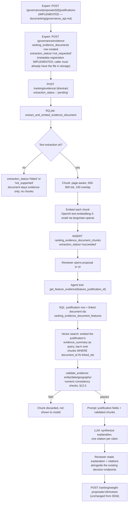
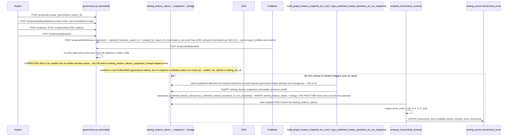

# Apartment Absorption Ranking Consultant — Audit and Design Proposal

## 1. Document metadata and review date

| Field | Value |
|---|---|
| File | `docs/ranking/ranking_consultant.md` |
| Status | Design proposal + current-state audit. **Documentation only.** |
| Review date | 2026-08-22 |
| Repository | P-100 (`AbsorptionForecast AI Agent`, Team ZeroToZeros) |
| Audited git ref | `HEAD` = `c24c14d` ("Create resolve branch - #37"), plus uncommitted working tree |
| Alembic head at audit | `0027_project_price_observations` (`alembic/versions/0027_project_price_observations.py`) |
| Audit method | Direct reading of `alembic/versions/*.py`, `src/**`, `tests/**`, `frontend/src/**`. `pipeline_status.md` used only as a lead, never as proof. |
| Code changed by this task | **None.** No Python, no migration, no schema, no data, no test, no frontend, no Docker, no config. |
| Re-audited | 2026-08-26 at Alembic head `0036_remove_historical_ranking` (38 revisions). §1's original `0027` stamp above reflects the 2026-08-22 audit only — not updated in place so the original audit remains a fixed historical record; see §20 change history for what changed at each re-audit. |
| Re-audited (2) | 2026-08-27, same Alembic head `0036_remove_historical_ranking` (38 files, single head — verified by parsing every `revision`/`down_revision` pair). This pass added §24 (hierarchical scoring) and corrected three current-state errors §1–§23 had carried since the original audit: the published V2 weights in §11.0, the price-ingest status, and the deal/unit event-log status. **Prior rows are struck through or annotated, never deleted** — see §4.1, §5.2, §5.3, §18, §19 and the §20 entry. |

**Separation of responsibilities enforced throughout this document:**

```text
The model computes the ranking.
Attribution explains the model output.
Retrieval finds supporting evidence.
The agent synthesizes the explanation.
```

Additional standing rules for every design in this document:

- Numeric aggregates come from SQL/analytical services, **not** semantic retrieval.
- Spatial metrics come from PostGIS or an equivalent geospatial service.
- Exact IDs, dates, codes, and numeric references use exact/lexical retrieval.
- Vector search is used for narrative, legal, and market context only.
- Citations must match entity, time, geography, and source scope.
- Feature importance is **not** causal impact.
- Ranking is decision support, **not** a sales guarantee.

---

## 2. Executive summary

1. A **deterministic, tested, database-backed ranking engine exists** — but it ranks **units inside one project**, not **projects against each other by absorption speed**. `src/ranking/engine.py::score_unit` is a pure function; `src/ranking/service.py::run_ranking` persists `feature_snapshots`, `ranking_runs`, `ranking_scores`. Status: `IMPLEMENTED` (for unit ranking), `NOT FOUND` (for project absorption ranking).
2. **No `absorption_rate` in the sense of `units_sold_in_period / sellable_inventory_at_period_start` exists anywhere in the backend.** What exists is (a) `velocity_7d`/`velocity_30d`, a rolling **mean of units per day** (`src/services/absorption.py::_rolling_mean`), and (b) `sell_through`, a **cumulative** `units_sold / total_units` (`src/services/domain_absorption.py:631`). The frontend then aliases `sell_through` to the field name `absorption_rate` (`frontend/src/api/endpoints.js:206`). That alias is the single most misleading naming conflict in the repository.
3. **The forecast layer is a stub, but its schema already exists and is high-quality.** `src/jobs/forecast.py::run_daily_forecast` computes nothing (`processed = 0`, explicit `TODO (MVP 2)`), yet `alembic/versions/0001_initial_schema.py` already created `forecast_jobs`, `forecasts` (with `data_cutoff_date`, `model_version`, `feature_version`, `pred_lower`, `pred_upper`, `interval_level`, `sellout_date`, `confidence_label`, `mape`), `forecast_points`, `explanations`, `alerts`, `suggestions`. **These tables are never read or written by any code** and are absent from `src/models/tables.py`. This is the largest reusable asset in the repo.
4. **Nine of the eleven requested feature groups have no data source at all.** No latitude/longitude, no PostGIS, no demographics, no legal-status table, no developer table, no bank/financing table, no infrastructure table, no competitor/nearby-project table. Verified by exhaustive grep over `alembic/` and `src/`: zero hits for `postgis|geometry(|geography(|latitude|longitude|legal_|developer_|bank_|demograph|infrastructure|competitor|poi_`.
5. **Price just arrived as schema only.** `alembic/versions/0027_project_price_observations.py` creates `project_price_observations` (`unit_id`, `official_price`, `effective_from`, `effective_to`, `source`), deliberately **empty, with no backfill**. No service, endpoint, or job reads or writes it — only `src/models/tables.py:583` declares it. Status: `PARTIALLY IMPLEMENTED` (schema present, pipeline absent).
6. **Feature snapshots exist but are not immutable per run.** `feature_snapshots` is keyed `(project_id, feature_key, scope, scope_id)` and **upserted in place** (`src/ranking/service.py::_persist_feature_snapshots`). There is no `feature_snapshot_id` that a `ranking_run` can pin. A ranking run from last week cannot be reproduced from the table today. Status: `PARTIALLY IMPLEMENTED`.
7. **Attribution already exists and is honest.** `ranking_scores.contributions` (JSONB) stores per-feature `value`, `weight`, `direction`, `contribution`, and `source` (`resolved` / `missing_skipped` / `missing_defaulted`), and `tests/test_api/test_ranking_endpoint.py::test_contributions_are_returned_and_sum_to_the_score` proves it reconciles. Status: `IMPLEMENTED`.
8. **There is no retrieval/evidence layer.** No pgvector, no embeddings, no BM25, no document/chunk table, no citation validation. Grep for `pgvector|embedding|faiss|chroma|retriev|bm25|rerank` over `src/` and `requirements.txt` returns only the unrelated word `reranked` in `src/api/ranking.py:519`. Status: `NOT FOUND`.
9. **Human-in-the-loop is real and structurally enforced**, not just documented. `agent_recommendations.status` defaults to `'pending_approval'` (`0018_agent_recommendations.py`), and `tests/test_ranking_boundary.py::test_create_recommendation_always_inserts_pending_approval` plus `::test_no_route_can_set_a_recommendation_to_approved_or_rejected_except_the_decision_endpoints` enforce it at AST level. Status: `IMPLEMENTED`.
10. **Largest risks:** (a) shipping a "project absorption ranking" on a denominator that is currently `areas.total_units` (planned inventory) rather than sellable inventory; (b) the `sell_through`→`absorption_rate` alias reaching a sales team as a period rate; (c) building 11 feature groups when 9 have no source, producing an authoritative-looking score made mostly of `neutral` defaults; (d) `prophet>=1.1.6` sitting in `requirements.txt` with zero imports, implying a capability that does not exist.

---

## 3. Scope and non-goals

### In scope

- Absorption-speed forecasting and ranking for **1–2 projects at a time**, compared against each other and/or against their own history.
- Reuse-first design over the existing Alembic chain, CRM sync contract, domain projection, and ranking tables.
- A feature catalog with measurable definitions for all eleven requested groups, honestly labeled where no source exists.

### Non-goals

- A full-market ranking platform. Explicitly excluded.
- Resale/secondary-market liquidity. **Absorption speed of primary sales is not resale liquidity** and this document never conflates them.
- Any code, schema, migration, data, or test change. This task produced documentation only.
- Replacing the existing unit-level ranking. The proposal here is a **second, project-level scoring surface** that reuses the same engine discipline.

---

## 4. Current-state audit

### 4.1 Audit table

| Area | Current evidence | File/symbol/table | Status | Confidence | Implication |
|---|---|---|---|---|---|
| Absorption calculation (legacy) | Rolling mean of `sales_records.units_sold` per day; delete-and-rebuild per project | `src/services/absorption.py::AbsorptionCalculatorService.recompute`, `::_rolling_mean`; tables `sales_records`, `inventory_snapshots`, `absorption_daily` | `IMPLEMENTED` | High | Produces **units/day velocity**, not a rate ratio |
| Absorption calculation (domain) | Per-unit counting from `units`/`deals`; `sellable = total - blocked` | `src/services/domain_absorption.py::DomainAbsorptionCalculatorService.compute` (line 198), `::persist` | `IMPLEMENTED` | High | This is the only place a *sellable* denominator is computed today |
| Period absorption rate `sold/sellable_start` | Grep across `src/`, `alembic/`, `tests/` finds no such formula | — | `NOT FOUND` | High | Must be defined before any ranking target exists |
| `sell_through` | `_percent(units_sold, total_units)` — cumulative, uses `total_units` not sellable-at-period-start | `src/services/domain_absorption.py:631`, `DomainAnalyticsSummary.sell_through` | `IMPLEMENTED` | High | Correct as *sell-through*, wrong if read as period absorption |
| `absorption_rate` field name in API output | Frontend sets `absorption_rate: sell_through` | `frontend/src/api/endpoints.js:206` | `IMPLEMENTED` (as alias) | High | **Naming conflict** — a cumulative ratio is surfaced under a period-rate name |
| Months/weeks of inventory | `remaining / velocity_30d` | `src/services/domain_absorption.py::_weeks_to_sell_out` (line 784) | `IMPLEMENTED` | High | Reusable; unit is **weeks**, not months |
| `projects` table | `id`, `name`, `launch_date`, `status`, `absorption_calculator`, source-identity columns | `alembic/versions/0001_initial_schema.py:28`, `0002`, `0012`, `0017`; `src/models/tables.py:30` | `IMPLEMENTED` | High | No coordinates, no developer FK, no legal fields |
| `areas` table | `project_id`, `area_name`, `unit_type`, `bedrooms`, `area_sqm`, `total_units` | `0001_initial_schema.py:64`; `src/models/tables.py:153` | `IMPLEMENTED` | High | `total_units` is **planned** inventory, not sellable |
| `units` table | `area_id`, `unit_code`, `unit_type`, `status`, source identity, `deleted_at` | `alembic/versions/0007_s3_domain_model.py:68`; `src/models/tables.py:247` | `IMPLEMENTED` | High | **No price, no floor, no orientation, no `listed_at`** |
| `deals` table | `unit_id`, `status`, `source_status`, `reserved_at`, `sold_at`, `lost_at` | `0007_s3_domain_model.py:109`; `src/models/tables.py:265` | `IMPLEMENTED` | High | Three timestamps on the row itself. ~~No event log, so historical state is not reconstructable~~ — **superseded 2026-08-27, see the two rows below** |
| Unit status event log | `unit_status_history` — `unit_id`, `deal_id`, `old_status`, `new_status`, `changed_at`, `recorded_at`, `source`, `metadata_json`; append-only | `alembic/versions/0028_unit_status_history.py:114-147` | `IMPLEMENTED` | High | **Superseded the `NOT FOUND` this document recorded in §5.2 and R6.** Written by DB trigger, not by application code |
| Deal status event log | `deal_status_history` — adds `prior_status_was_holding`, `new_status_is_holding` to the same shape; append-only. Exists separately because `UNIT_STATUSES` has no `lost`, so a cancellation is indistinguishable from an admin re-open on the unit side alone | `alembic/versions/0029_deal_status_history.py:77-88`, docstring `:10-13` | `IMPLEMENTED` | High | Makes cancellation attribution and cutoff-aware funnel reconstruction feasible for the first time |
| Event capture mechanism | `AFTER INSERT/UPDATE` triggers on `units`/`deals`; no column, constraint or index of `0007` altered; `domain_projection.py` untouched | `alembic/versions/0030_status_history_triggers.py:8-15` | `IMPLEMENTED` | High | Capture is at the database, so it cannot be bypassed by a second write path |
| Event-log replay/backfill | Two partial `UNIQUE INDEX`es supporting `INSERT ... ON CONFLICT DO NOTHING` | `alembic/versions/0032_replay_identity_index.py:8-13`; `scripts/backfill_status_history.py` | `IMPLEMENTED` | High | Backfill from `sync_payloads` is idempotent; history depth is still bounded by retained payloads |
| Sellable inventory | `sellable = total - blocked` at compute time | `src/services/domain_absorption.py:198` | `PARTIALLY IMPLEMENTED` | High | Computed in memory, **never persisted as a time series** |
| `absorption_daily` | `area_id`, `stat_date`, `units_sold`, `velocity_7d/30d`, `units_remaining`, `units_reserved`, `calculator`, `computation_id` | `0001_initial_schema.py:197`, `0007`, `0012`; `src/models/tables.py:214` | `IMPLEMENTED` | High | Derived output; two calculator lineages coexist |
| `feature_snapshots` | `project_id`, `feature_key`, `scope`, `scope_id`, `feature_value NUMERIC(6,4)`, `sample_count`, `confidence`, `source`, `feature_version`, `calculated_at` | `alembic/versions/0014_ranking_foundation.py:98`; `src/models/tables.py:409` | `PARTIALLY IMPLEMENTED` | High | **Current-state, upserted in place** — not an immutable per-run snapshot; no formula or source-record columns |
| Immutable snapshot pinned to a run | `ranking_runs` has no `feature_snapshot_id`; upsert guarded only by `calculated_at` | `src/ranking/service.py::_persist_feature_snapshots`; `src/models/tables.py:453` | `NOT FOUND` | High | **Past-cutoff project scores are not reproducible** |
| Lineage raw → fact → feature → ranking | `sync_payloads` (raw) → `crm_source_records` (identity) → `units`/`deals` (fact) → `feature_snapshots` → `ranking_scores` exists as a *flow*, but no row-level foreign keys tie a feature value to the source rows | `0009_sync_payloads.py`, `0006_sync_foundation.py`, `src/services/domain_projection.py`, `src/ranking/service.py` | `PARTIALLY IMPLEMENTED` | Medium-High | Lineage is traceable by convention, not enforceable by join |
| Ranking engine purity | No `src.db`/SQLAlchemy import; AST-enforced | `src/ranking/engine.py`; `tests/test_ranking_boundary.py::test_ranking_engine_is_a_pure_function_no_db_no_network` | `IMPLEMENTED` | High | Satisfies hard constraint 13 (deterministic scoring engine) |
| Ranking write boundary | Only `src/ranking/service.py` writes `ranking_scores`/`ranking_runs` | `tests/test_ranking_boundary.py::test_model_result_tables_have_exactly_one_writer` | `IMPLEMENTED` | High | Strong guarantee that no LLM path can write scores |
| Ranking scope | Always whole-project, unit-level; `rank_in_area` + `rank_in_project` | `src/ranking/service.py::run_ranking` docstring; `ranking_scores.rank_in_area/rank_in_project` | `IMPLEMENTED` | High | **No `comparison_set_id`, no cross-project rank** |
| Ranking weights | v2 published: `unit_available` 0.35, `unit_demand_norm` 0.25, `area_velocity_norm` 0.20, `area_conversion_norm` 0.20 | `alembic/versions/0022_ranking_config_v2.py:85-90` (`V2_WEIGHTS`) | `IMPLEMENTED` | High | Four operational features only; none is a market, price, location, or legal feature |
| Survey features ingress | `view_quality`, `natural_light`, `privacy`, `noise_level` | `src/services/survey_features.py::SURVEY_FEATURES`, `upsert_survey_features`; `POST /api/v1/ranking/features/survey` (`src/api/ranking.py:394`) | `IMPLEMENTED` (ingress); `NOT FOUND` (data) | High | Path exists; no weight in v2 config references these keys, so they currently score nothing |
| Forecast engine | Logs only; `processed = 0`; explicit `TODO (MVP 2)` | `src/jobs/forecast.py::run_daily_forecast` | `PLANNED/TODO` | High | **No forecast output is ever written** |
| Forecast schema | `forecast_jobs`, `forecasts`, `forecast_points`, `explanations`, `alerts`, `suggestions` created and constrained | `alembic/versions/0001_initial_schema.py:224,266,316,333,354,398` | `IMPLEMENTED` (schema); `NOT FOUND` (usage) | High | **Not declared in `src/models/tables.py`; zero readers/writers.** Largest reuse opportunity |
| `forecasts.file_id` | `nullable=False`, FK to `upload_files.id` | `0001_initial_schema.py:271,289` | `BLOCKED` for domain path | High | A forecast computed from `units`/`deals` has **no originating upload file** — this NOT NULL blocks reuse as-is |
| Prophet | `prophet>=1.1.6` in requirements; no `import prophet` anywhere in `src/` | `requirements.txt`; grep of `src/` finds only comments | `NOT FOUND` (as code) | High | Dependency implies a capability that does not exist |
| Ranking API | `GET /ranking`, `POST /ranking/run`, `POST /ranking/runs`, `GET /ranking/runs/{id}`, `POST /ranking/features/survey`, config CRUD/publish/rollback | `src/api/ranking.py:125,254,315,353,394,457,466,494,523`; mounted at `/api/v1` (`src/main.py:60`) | `IMPLEMENTED` | High | All unit-scoped; no project-comparison endpoint |
| Forecast API | No route registered | grep of `@router` across `src/api/*.py` | `NOT FOUND` | High | `POST /api/forecasts/run` referenced in `src/jobs/forecast.py` docstring **does not exist** |
| Background jobs | RQ `src/jobs/rank_project.py::rank_project`; APScheduler enqueues `run_daily_forecast`, domain-recompute audit, parallel-run capture | `src/jobs/`, `src/scheduler.py`, `src/task_queue.py::get_queue`, `src/worker.py` | `IMPLEMENTED` | High | Infrastructure for a real forecast job already runs daily — it just does nothing |
| Ranking triggers | Post-sync, post-config-publish, post-survey; DB-level coalescing via partial unique index | `src/services/ranking_trigger.py`; `src/ranking/service.py::enqueue_ranking`; `uq_ranking_runs_queued_per_project` (`0015`) | `IMPLEMENTED` | High | Solid; reusable pattern for a project-level run |
| Agent graph | 2-node LangGraph (`analyze` → `respond`); `analyze_node` calls no LLM | `src/agents/graph.py`, `src/agents/nodes/ranking_node.py` | `IMPLEMENTED` | High | LLM never sees raw tables; it receives formatted ranking context |
| Agent tools | 10 allow-listed SQL-backed read tools + deterministic tool plan | `src/agents/advisory_tools.py::ALLOWED_ADVISORY_TOOLS` (line 30), `_deterministic_tool_plan` (85), `_sanitize_tool_plan` (110) | `IMPLEMENTED` | High | Already matches hard constraint 12 (agent does not rank from text) |
| Human-in-the-loop | `status` default `'pending_approval'`; AST-enforced | `0018_agent_recommendations.py`; `tests/test_ranking_boundary.py:121,138,151` | `IMPLEMENTED` | High | Hard project requirement satisfied |
| Price | ~~Table created empty, no backfill, no reader/writer~~ — **superseded 2026-08-27.** `listing_price` entered the v2 contract on 2026-08-23 and is projected into `project_price_observations` on every accepted unit upsert: absent → no action, explicit `null` → close the open observation, positive → close-and-open on change, equal → no-op | `alembic/versions/0027_project_price_observations.py`; writer `src/services/domain_projection.py::_apply_price_observation` (`:427-497`), called from `_project_unit`; `src/models/tables.py:820` | `IMPLEMENTED` (ingest path) | High | `official_price` is still **list price, not transaction price** — `crm_deals.transaction_price` remains an unimplemented CRM product decision. The table is no longer empty-by-design; it is fed by sync |
| CRM contract and price | `"additionalProperties": false` still holds at envelope and record level, but the v2 `unit_payload`/`unit_payload_partial` allowlist now **includes** an optional, nullable `listing_price` with `exclusiveMinimum: 0`. v1 was not touched and still rejects any price field | `src/contracts/crm_sync_v2.schema.json:17,128,141` and `:626,659`; `pipeline_status.md` "2026-08-23 — MiniCRM price field and sync verification" | `IMPLEMENTED` | High | **Narrowed 2026-08-27.** Price still does not become a column on `units`; it lands in the second-path table as effective-dated observations. The "second path" pattern is intact — what changed is that the CRM now carries the value |
| Geospatial | No `latitude`, `longitude`, `geometry`, `geography`, PostGIS extension | Exhaustive grep of `alembic/`, `src/` | `NOT FOUND` | High | **All of groups A, F, G, H are unbuildable today** |
| Demographics / target audience | No table, no column, no connector | Exhaustive grep | `NOT FOUND` | High | Group B unbuildable |
| Developer / legal / bank facts | No table, no column, no connector | Exhaustive grep | `NOT FOUND` | High | Groups D, I, K unbuildable |
| Documents / evidence / RAG | No documents, chunks, embeddings, or retrieval code | Exhaustive grep; `requirements.txt` has no vector library | `NOT FOUND` | High | Evidence layer must be built from zero |
| Alembic head | Linear to `0022`, forks `0023_config_publish_stamp` / `0023_seed_domain_demo_2026`, merged at `7022f5bfa250`, then continues through `0036_remove_historical_ranking` | `alembic/versions/*.py` `down_revision` chain | `IMPLEMENTED`, single head | High | **Historical fork already merged.** Any new migration must descend from `0036_remove_historical_ranking` |
| Fixtures: simulated vs real | `docs/ai_fixtures/simulated_ranking_fixture.json` self-declares `"provenance": "simulated_fixture"` and warns scores are placeholders; `0023_seed_domain_demo_2026` seeds 4 synthetic `DEMO 2026 *` projects; `datasets/synthetic_v1/` | Those files | `IMPLEMENTED` (as fixtures) | High | **No production or real market data is present.** No accuracy claim may be made from these |
| Real-source reconciliation | `scope='source'` explicitly rejected — no live CRM source available | `src/services/reconciliation.py`; `pipeline_status.md` Stage 6 | `BLOCKED` | High | Data freshness against a real CRM cannot currently be proven |

### 4.2 Sources of truth vs. derived outputs

| Layer | Tables | Owner |
|---|---|---|
| **Raw** | `sync_payloads`, `upload_files`, `crm_source_records` | Ingestion; append/retention-managed |
| **Source of truth (mirrored)** | `projects`, `areas`, `units`, `deals` | **Mini CRM owns every business field**; the app owns only `deleted_at` and bookkeeping timestamps (`0007_s3_domain_model.py`, `0017_hierarchy_projection.py`) |
| **Source of truth (app-owned)** | `ranking_configs`, `project_price_observations`, survey rows in `feature_snapshots`, `sales_campaigns` | The app; human-entered |
| **Derived** | `absorption_daily`, `feature_snapshots` (operational rows), `ranking_runs`, `ranking_scores`, `calculator_comparisons`, `reconciliation_runs/_findings` | Recomputable; delete-and-rebuild semantics |
| **Created but unused** | `forecast_jobs`, `forecasts`, `forecast_points`, `explanations`, `alerts`, `suggestions`, `proposals`, `approvals`, `llm_calls`, `settings`, `user_areas` | None — no code path touches them |

### 4.3 Conflicts between `pipeline_status.md` and code

Per hard constraint 9, code and migrations win. Recorded conflicts:

| # | Claim | Reality | Evidence |
|---|---|---|---|
| C1 | `pipeline_status.md` header says "Date: 2026-08-15 (b) (most recent entry)" | The most recent entry is `# Đợt 2026-08-21 — Migration 0027`, at line 145 | `pipeline_status.md:3-6` vs `:145` |
| C2 | `src/jobs/forecast.py` docstring references `POST /api/forecasts/run` | No such route exists in any `src/api/*.py` | grep of all `@router` decorators |
| C3 | `docs/ranking/implementation_plan.md` §5.2 defines `area_velocity_norm` denominator as `max(areas.total_units, 1)` | Code uses **live mirrored units per area**, not `areas.total_units` | `src/ranking/service.py::_area_features` docstring point 1, and its `live_units_by_area` argument |
| C4 | `AGENTS.md` states "Prophet-based absorption-rate forecasting is a future goal" | Correct — but `requirements.txt` pins `prophet>=1.1.6` as if it were in use, and `0001` shipped a full forecast schema | `requirements.txt`; `0001_initial_schema.py:266` |
| C5 | Frontend field named `absorption_rate` | Value is `sell_through` (cumulative), not a period absorption rate | `frontend/src/api/endpoints.js:206` |
| C6 | `tests/test_ranking_boundary.py::test_the_backend_alembic_history_is_now_twentythree_linear_revisions` — name says "twentythree linear" | **Narrowed 2026-08-26:** the function *name* is still stale (never renamed), but the assertion is current — it reads `len(revisions) == 38` and requires `0036_remove_historical_ranking.py` as the head file. | `tests/test_ranking_boundary.py:242` (name), `:305` (assertion); `ls alembic/versions/` |

| C7 | This document's own §11.0 stated the published V2 config is `unit_available` 0.4551, `unit_demand_norm` 0.2627, `area_velocity_norm` 0.1411, `area_conversion_norm` 0.1411, citing `0022_ranking_config_v2.py` | The migration that publishes V2 contains **0.35 / 0.25 / 0.20 / 0.20**. The AHP figures exist only as an unpublished derivation. §4.1's weights row was correct all along; §11.0 contradicted it inside the same document | `alembic/versions/0022_ranking_config_v2.py:87-92` (`V2_WEIGHTS`) vs. `docs/ranking/ranking_v2_ahp.md:134,172` and `src/ranking/ahp.py:326`. **Corrected 2026-08-27** — see §11.0 |
| C8 | §4.1, §5.3, §8, §15, R6 and D6/D7 described price and deal-state history as absent | Both landed after the 2026-08-22 audit and this document never re-audited them: `listing_price` reaches `project_price_observations` through sync, and `unit_status_history`/`deal_status_history` capture every status transition by trigger | `src/services/domain_projection.py:427-497`; `src/contracts/crm_sync_v2.schema.json:626,659`; `alembic/versions/0028`–`0030`, `0032`. **Corrected 2026-08-27** in the rows and sections named |
| C9 | The word `status_history` and the word `listing_price` appeared **zero times** in this document before 2026-08-27, despite five migrations (`0028`–`0032`) landing between the original audit and the `0036` re-audit | The 2026-08-26 re-audit updated the Alembic head stamp and §21/§23 but did not re-read `0028`–`0032`. A head-revision stamp is not a re-audit of the revisions it skipped past | `git` history of this file; grep of this document before this pass |

C1–C6 are documentation/naming drift with no defect in shipped behavior; C5 is the one with business risk. **C7–C9, added 2026-08-27, are different in kind:** they are places where this document was stale against shipped code, which is the failure mode hard constraint 9 exists to catch. They are corrected in place above and in the sections named, with the superseded text struck through rather than deleted.

**C5 status at 2026-08-27:** still open. `frontend/src/api/endpoints.js:212` continues to emit `absorption_rate: sell_through`, five days after this document flagged it as the highest correctness-per-line-changed change in the repository. D12 remains undecided.

---

## 5. Business definitions and target variables

### 5.1 Absorption rate — the definition this project should adopt

```text
absorption_rate(period)
= units_sold_in_period / sellable_inventory_at_period_start
```

**Why the denominator must be sellable inventory, not total project units.**

`areas.total_units` is *planned* inventory. In this repository it is measurably wrong as a denominator: `src/ranking/service.py` module docstring, point 1, records that `areas.total_units` runs 1,800–3,360 per area while only 40 units per area are actually mirrored — numerator and denominator drawn from two different populations. That is a dimensional error, not a calibration choice. Three further reasons:

1. **Units not yet released cannot be sold.** Including them makes a fast-selling first release look slow, and makes a project that releases inventory in small batches look artificially fast once released units run out.
2. **Blocked units are outside the sellable pool.** `src/services/domain_absorption.py:198` already excludes them (`sellable = total - blocked`); the ranking denominator must agree with the absorption denominator or the two numbers will contradict each other on the same screen.
3. **Comparability across projects requires a denominator each project controls the same way.** Total project units is a planning artifact that differs in meaning between developers; sellable inventory at a stated instant is an observable state.

**"At period start" matters.** Using end-of-period inventory lets the same sale shrink the denominator it is measured against, inflating the rate. Using a mid-period average hides batch releases. Period-start is the only choice that makes the rate additive across consecutive periods.

### 5.2 Distinctions that must never collapse

| Concept | Definition here | Present in code? |
|---|---|---|
| Total project units | `Σ areas.total_units` for the project — planning figure | Yes — `areas.total_units` |
| Released units | Units the developer has opened for sale | **`NOT FOUND`** — no release/batch column; `units.created_at` is mirror time, not release time |
| Sellable inventory | Released, not blocked, not sold, not under a live reservation | Partially — `src/services/domain_absorption.py:198,207` computes it in memory, does not persist a series |
| Booked units | Soft interest, no money committed | Approximated by `deals.status IN ('lead','qualified','interested','viewing')` (`src/ranking/service.py::FUNNEL_STATUSES`) |
| Deposited units | Deposit paid, contract not signed | **`NOT FOUND`** — `deals` has no deposit state; `reserved` conflates hold and deposit. Unchanged at 2026-08-27: `deal_status_history` records *transitions between existing statuses*, so it inherits the same vocabulary and cannot manufacture a deposit state the source never emitted |
| Successfully contracted units | Contract signed | Approximated by `deals.status = 'sold'` with `sold_at` |
| Cancelled units | Returned to inventory | `deals.status = 'lost'` (incl. mapped `cancelled`); `src/services/domain_absorption.py` docstring: "`lost` counts for nothing — the unit returns to inventory". **Narrowed 2026-08-27:** the *timing* of a cancellation is now recorded — `deal_status_history.changed_at` with `prior_status_was_holding`/`new_status_is_holding` (`0029:83-86`) — so a cancellation can be attributed to the period it happened in |
| Primary-market transaction | Developer → first buyer | All of `deals` is assumed primary; **not flagged** |
| Secondary-market transaction | Resale between owners | **`NOT FOUND`** and out of scope — absorption speed is not resale liquidity |

~~**`INSUFFICIENT DATA` for net absorption.** Because `deals` carries only `reserved_at`/`sold_at`/`lost_at` and no event log, a cancellation that occurred *inside* a past period cannot be attributed to that period. `docs/signal_prerequisites.md` §1 reaches the same conclusion independently. Net (cancellation-adjusted) absorption is therefore `BLOCKED` until a status-event log exists.~~

**Superseded 2026-08-27 — the status-event log exists.** `unit_status_history` (`0028`) and `deal_status_history` (`0029`) are append-only transition logs, populated by `AFTER INSERT/UPDATE` triggers on `units`/`deals` (`0030`), with partial `UNIQUE INDEX`es making replay idempotent (`0032`) and `scripts/backfill_status_history.py` replaying from `sync_payloads`. Net (cancellation-adjusted) absorption moves from `BLOCKED` to **`PROPOSED`, source now available**.

Three limits survive the correction and must not be lost:

1. **Depth, not existence, is the remaining constraint.** Triggers capture transitions from the moment `0030` ran forward. Anything earlier exists only to the extent `sync_payloads` retained the payloads to replay, and `0010_sync_payload_retention.py` bounds that. History depth is an empirical question this document cannot answer — it must be measured before any backtest claims a window.
2. **A transition log is not a deposit state.** §5.2's `Deposited units` row is unchanged: the log records movement between statuses the source already emits, and no source status distinguishes a hold from a paid deposit.
3. **The log is not yet read by anything in the ranking path.** Writers are the triggers; readers today are `src/services/sync_runs.py`, the backfill script, and the reset scripts. Nothing in `src/ranking/` or `src/services/absorption.py` consumes it. Every absorption feature derived from it is `PROPOSED`, not `IMPLEMENTED`.

### 5.3 Target variables

**Project-level (primary):**

| Target | Definition | Feasible today? |
|---|---|---|
| `absorption_rate_next_30d` | `units_sold[t, t+30) / sellable_inventory(t)` | Feature computable; **label history is thin** — see §5.4 |
| `absorption_rate_next_90d` | Same, 90-day window | Same |
| `units_sold_next_30d` | Count of `deals.status='sold'` with `sold_at ∈ [t, t+30)`, `deleted_at IS NULL` | Yes, from `deals` |
| `units_sold_next_90d` | Same, 90-day window | Yes |
| `months_to_sell_out` | `sellable_inventory(t) / monthly_absorption_run_rate(t)`; `NOT_APPLICABLE` when run rate ≤ 0 | Yes — `_weeks_to_sell_out` already does the weekly form |

**Secondary:** `months_of_inventory`, `confidence_interval`, `ranking_score`, `rank_within_comparison_set`.

**Product-level (where data permits):**

| Segment dimension | Source | Status |
|---|---|---|
| `unit_type` | `units.unit_type`, `areas.unit_type` | `IMPLEMENTED` — but see caution below |
| `bedrooms` | `areas.bedrooms` | `IMPLEMENTED` (area grain only) |
| `area_sqm` band | `areas.area_sqm` | `IMPLEMENTED` (area grain only) |
| `price_band` | `project_price_observations` ⋈ `units` ⋈ `areas`, filtered by the effective interval in force at the cutoff | **Narrowed 2026-08-27:** the ingest path exists (`src/services/domain_projection.py:427-497`) and rows accumulate as the CRM syncs prices. `PROPOSED` — banding logic, currency convention and coverage measurement are all still unbuilt, and the schema carries **no currency column** (`0027`; the contract states the same, `crm_sync_v2.schema.json:626`) |
| `floor` / `orientation` | not derivable — `docs/ranking/implementation_plan.md` §3 records `unit_code` is not splittable | `BLOCKED` |

**Caution on `unit_type` segmentation:** `src/ranking/service.py` module docstring, point 3, records a measurement — **0 of 58 areas contain more than one `unit_type`**. Areas are already split by type ("Sapphire 2 - 2PN"). A `unit_type`-scoped feature would therefore duplicate an `area`-scoped one exactly. Segment by area, and treat `unit_type` as a label on the area, not an independent axis.

### 5.4 Label-history reality check

`INSUFFICIENT DATA` for supervised training. The only sold-date history is (a) the synthetic `DEMO 2026 *` seed from `0023_seed_domain_demo_2026.py`, and (b) the AI/dev fixture from `0019`/`0021`. Per hard constraint 10, **no accuracy claim may be made from these**. With 1–2 real projects, the number of independent project-period observations is in the tens, not thousands — which drives the ranking design in §11 toward a deterministic baseline, not a learned cross-sectional model.

### 5.5 Comparison scope for 1–2 projects

The ranking must state, for every run, what it is comparing. Logical structure:

```text
project_id
comparison_set_id
snapshot_date
forecast_period
forecast_horizon
segment_key
sellable_inventory_start
units_sold_period
absorption_rate
data_quality_status
```

A `comparison_set` is admissible only when its members share **all five** of:

| Axis | Rule | Source today |
|---|---|---|
| Geography | same district (or explicitly documented cross-district comparison) | **`NOT FOUND`** — no geography column at all |
| Market segment | same price band and unit-type family | **`BLOCKED`** — no price data |
| Observation period | identical `[period_start, period_end)` and identical data cutoff | `deals.sold_at`, plus a cutoff the run must record |
| Sales status | both in open-sale phase | **`NOT FOUND`** — `projects.status` is an approval workflow state (`0002`), not a sales phase |
| Denominator basis | both use sellable inventory at period start | Computable from `units`/`deals` |

**`NEEDS DECISION`:** with two projects and none of the three missing axes available, the honest MVP comparison set is "these two named projects, same period, same denominator basis, geography and segment comparability asserted manually by the owner and recorded as a field." That assertion must be stored, not assumed.

---

## 6. Ranking scope for 1–2 projects

| Question | Answer | Rationale |
|---|---|---|
| What is ranked? | **Projects** (and optionally project × segment), not units | The unit ranking already exists and answers a different question ("which unit should a salesperson call about first") |
| How many members? | 2–5. Below 2 there is no rank; above ~5 the design drifts toward the market platform this task excludes | Explicit business objective |
| Grain | One row per `(comparison_set_id, project_id, segment_key, snapshot_date)` | Makes rank reproducible and auditable |
| Rank basis | `ranking_score` descending; ties broken deterministically by `absorption_rate` desc, then `snapshot_date` asc, then `project_id` asc | Mirrors the existing deterministic tie-break in `src/ranking/engine.py::rank_scores` |
| Relationship to existing unit ranking | Additive. `ranking_scores`, `ranking_runs`, `ranking_configs`, and the write boundary in `tests/test_ranking_boundary.py` stay untouched | Zero-regression requirement |

---

## 7. Feature catalog

### 7.0 How to read these tables

**Column legend.** `Type` — one or more of `static`, `time-varying`, `lagged`, `aggregated`, `derived`, `text-derived`, `scenario-only`. `Grain` — time grain. `Geo` — geographic grain. `Avail` — availability today. `Leak` — leakage risk. `Miss` — missing-data behavior in the scoring engine (`skip` removes the weight from the denominator, `neutral` substitutes 0.5, `zero` substitutes 0 — semantics per `src/ranking/engine.py::score_unit`). `Conf` — confidence in the definition and in obtaining the data. `Prio` — P0 (MVP), P1 (next), P2 (later). `Status` — one of `IMPLEMENTED`, `PARTIALLY IMPLEMENTED`, `PROPOSED`, `TODO`, `NOT FOUND`, `BLOCKED`, `NEEDS DECISION`.

**Normalization convention.** Every feature entering the scorer is normalized to `[0,1]`. Unless stated otherwise, the normalizer is min–max against a **named, versioned reference band** stored with the config — never against the comparison set itself, because a set-relative normalizer makes a project's score change when an unrelated project's data changes.

**Rule applied throughout:** a feature with no named source and no formula is not proposed as buildable. Where the source does not exist, the row states the **source contract** required, and the status is `NOT FOUND` or `BLOCKED`.

---

### 7.A Location

**Blanket finding:** `NOT FOUND` for the entire group. There is no coordinate anywhere in the schema. Exhaustive grep over `alembic/versions/*.py` and `src/**/*.py` for `postgis|geometry(|geography(|latitude|longitude|ST_Distance|lng` returns zero schema hits. Every feature below therefore requires (i) a `project_location` fact carrying a coordinate and an administrative code, and (ii) a routing/POI provider.

**Source contract required before any of group A can be built:**

```text
project_location(project_id, lat, lon, ward_code, district_code, province_code,
                 geocode_source, geocode_precision, geocoded_at, verified_by)
```

Precision must be recorded: a project geocoded to a ward centroid cannot support a 1 km radius metric, and using it as if it could is a silent error.

| Feature key | Business meaning | Type | Unit | Grain | Geo | Formula | Source | Avail | Leak | Data quality | Miss | Conf | Prio | Status |
|---|---|---|---|---|---|---|---|---|---|---|---|---|---|---|
| `distance_to_cbd_km` | Straight-line remoteness from the city core | static | km | one-off, re-verify yearly | point | `haversine(project.geom, cbd.geom)` | PostGIS + `project_location` | none | none | high once geocoded | `skip` | High | P1 | `NOT FOUND` |
| `road_distance_to_cbd_km` | Actual driving distance | static | km | yearly | point→point | routing provider shortest-path length | external routing API | none | none | depends on provider | `skip` | Med | P2 | `NOT FOUND` |
| `travel_time_peak_to_cbd_min` | Real commute burden at 08:00 local | time-varying | minutes | quarterly | point→point | routing provider duration with peak-hour traffic profile | external routing API | none | **medium** — must be sampled at a fixed hour and stored with that hour | provider-dependent, record provider+version | `skip` | Med | P2 | `NOT FOUND` |
| `distance_to_school_km` | Nearest primary/secondary school | static | km | yearly | 5 km radius | `min(ST_Distance(project, school))` over POI set | PostGIS + POI dataset | none | none | depends on POI completeness | `neutral` | Med | P2 | `NOT FOUND` |
| `distance_to_hospital_km` | Nearest general hospital | static | km | yearly | 5 km radius | as above | PostGIS + POI dataset | none | none | as above | `neutral` | Med | P2 | `NOT FOUND` |
| `distance_to_mall_km` | Nearest retail anchor | static | km | yearly | 5 km radius | as above | PostGIS + POI dataset | none | none | as above | `neutral` | Med | P2 | `NOT FOUND` |
| `distance_to_transit_km` | Nearest **operating** transit stop | static | km | yearly | 3 km radius | `min(ST_Distance(project, stop))` where `stop.status='operating'` | PostGIS + transit dataset | none | **high** — must exclude planned stops; see group H | must carry `status` | `neutral` | Med | P1 | `NOT FOUND` |
| `distance_to_employment_center_km` | Nearest industrial park / office cluster | static | km | yearly | 10 km radius | `min(ST_Distance(project, employment_site))` | PostGIS + employment dataset | none | none | dataset-dependent | `neutral` | Low | P2 | `NOT FOUND` |
| `poi_density_1km` | Amenity richness | aggregated | count/km² | yearly | 1 km radius | `count(POI within 1 km) / (π·1²)` | PostGIS + POI dataset | none | none | sensitive to POI source bias | `neutral` | Low | P2 | `NOT FOUND` |
| `accessibility_score` | Composite of the distance features | derived | index 0–1 | yearly | project | published weighted combination of the normalized distance features, weights stored in config | derived from the above | none | inherits | inherits worst input | `skip` | Med | P1 | `PROPOSED` (composite only; inputs `NOT FOUND`) |
| `neighborhood_price_level` | Local price plane vs. city median | time-varying | ratio | quarterly | ward | `median(ward listing price/m²) / median(city listing price/m²)` | external market data connector | none | **high** — must use only observations at or before the cutoff | listing ≠ transaction; label it | `skip` | Med | P1 | `NOT FOUND` |
| `flood_risk_level` | Inundation exposure | static | ordinal 0–3 | yearly | parcel/ward | authority hazard map lookup | external authority dataset | none | none | authority-dependent | `neutral` | Low | P2 | `NOT FOUND` |
| `noise_exposure_level` | Ambient noise | static | ordinal 0–3 | yearly | parcel | noise map lookup, else field survey | external dataset or survey | none | none | subjective if surveyed | `neutral` | Low | P2 | `NOT FOUND` |

**Distinctions this group must preserve:** straight-line distance ≠ road-network distance ≠ peak-hour travel time; and **existing infrastructure ≠ planned infrastructure** (planned belongs to group H and must never be silently folded into a `distance_to_transit` metric).

---

### 7.B Target audience

**Blanket finding:** `NOT FOUND`. There is no demographic, income, or household table, and no connector. The system also holds no buyer-side data — the CRM sync contract forbids customer fields (`src/contracts/crm_sync_v2.schema.json`, `additionalProperties: false`, enforced at the source per the `0027` docstring), so buyer demographics cannot be inferred from `deals` either.

**Source contract required:**

```text
demographic_snapshot(geo_code, geo_level, as_of_date, population_total,
                     population_by_age_band, households_total,
                     household_income_median, renter_share, source_authority,
                     collected_at, source_url)
```

| Feature key | Business meaning | Type | Unit | Grain | Geo | Formula | Source | Avail | Leak | Data quality | Miss | Conf | Prio | Status |
|---|---|---|---|---|---|---|---|---|---|---|---|---|---|---|
| `target_households_in_radius` | Households in the catchment matching the product | aggregated | households | annual | 5 km radius or district | `Σ households where income_band ∈ product_target_bands` | demographic connector | none | none | census lag is often 1–5 yrs — record `as_of_date` | `skip` | Med | P1 | `NOT FOUND` |
| `population_by_age_25_44` | Prime first-buyer cohort size | aggregated | persons | annual | district | `Σ population in age bands 25–44` | demographic connector | none | none | as above | `neutral` | Med | P2 | `NOT FOUND` |
| `household_income_median` | Local purchasing power | static | currency/month | annual | district | median from source | demographic connector | none | none | self-reported income is biased low | `skip` | Med | P1 | `NOT FOUND` |
| `renter_share` | Rental-to-own conversion pool | static | ratio | annual | district | `renter_households / total_households` | demographic connector | none | none | as above | `neutral` | Low | P2 | `NOT FOUND` |
| `employment_growth_12m` | Demand momentum | time-varying | ratio | annual | district | `(employed_t − employed_{t−12m}) / employed_{t−12m}` | labour statistics connector | none | **medium** — publication lag must be respected at cutoff | lagged publication | `neutral` | Low | P2 | `NOT FOUND` |
| `migrant_worker_population` | In-migration demand | aggregated | persons | annual | district | source figure | statistics connector | none | none | frequently unmeasured | `neutral` | Low | P2 | `NOT FOUND` |
| `target_household_growth` | Catchment growth | derived | ratio | annual | district | `(target_households_t − target_households_{t−1y}) / target_households_{t−1y}` | derived | none | inherits | inherits | `neutral` | Low | P2 | `NOT FOUND` |
| `affordability_eligible_households` | Households that can actually buy | derived | households | quarterly | 5 km radius | `Σ households where monthly_payment ≤ 0.4 × household_income` | demographic connector **+** price (group C) | none | **high** — price must be the price in force at cutoff | doubly dependent | `skip` | Med | P0-if-data | `BLOCKED` (needs B **and** C) |
| `target_fit_score` | Demand pool per sellable unit | derived | households/unit | quarterly | project | `matching_target_households / sellable_units` | derived: B numerator, `units`/`deals` denominator | denominator only | **high** — denominator must be sellable inventory at the **snapshot**, not today | half-computable | `skip` | High (definition) / Low (data) | P0-if-data | `BLOCKED` |
| `owner_occupier_ratio` | Owner vs. investor mix | static | ratio | annual | project | survey of buyers | field survey | none | none | subjective, small n | `neutral` | Low | P2 | `NOT FOUND` |
| `investor_demand_proxy` | Speculative share | derived | ratio | quarterly | project | `deals_by_repeat_buyer / deals_total` | **requires buyer identity — forbidden by contract** | none | n/a | n/a | n/a | Low | — | `BLOCKED` (privacy + contract) |

Note the denominator on `target_fit_score`: **sellable units**, matching §5.1. Using total project units would make a project with a large unreleased pipeline look like it has no demand.

---

### 7.C Price and affordability

**Finding:** `PARTIALLY IMPLEMENTED`. `project_price_observations` exists (`0027`) with `unit_id`, `official_price`, `effective_from`, `effective_to`, `source`, and a partial unique index `ix_price_obs_unit_current` enforcing exactly one current row per unit. The table is **empty by design** — the migration docstring is explicit: "No backfill... Filling fake numbers here would turn an honest blank into an authoritative wrong number." No service, job, or endpoint reads or writes it.

**Critical semantic:** `official_price` is **list price**, not transaction price. There is no discount, incentive, or realized-price field anywhere.

| Feature key | Business meaning | Type | Unit | Grain | Geo | Formula | Source | Avail | Leak | Data quality | Miss | Conf | Prio | Status |
|---|---|---|---|---|---|---|---|---|---|---|---|---|---|---|
| `list_price_total` | Posted price of a unit | time-varying | currency | per price epoch | unit | `official_price` where `effective_from ≤ cutoff < coalesce(effective_to,'infinity')` | `project_price_observations` | **schema only** | **high** — must select by effective range against cutoff, never `effective_to IS NULL` | list, not transacted | `skip` | High | P0 | `PARTIALLY IMPLEMENTED` |
| `gross_price_per_m2` | Price per gross buildable m² | derived | currency/m² | per price epoch | unit | `list_price_total / areas.area_sqm` | `project_price_observations` ⋈ `areas` | schema only | inherits | `areas.area_sqm` is an area-level figure, not per-unit — a known approximation | `skip` | Med | P0 | `PARTIALLY IMPLEMENTED` |
| `net_price_per_m2` | Price per net usable m² | derived | currency/m² | per price epoch | unit | `list_price_total / net_area_sqm` | **`net_area_sqm` does not exist** | none | n/a | n/a | `skip` | High (definition) | P1 | `NOT FOUND` |
| `project_price_median_per_m2` | Project price plane | aggregated | currency/m² | per snapshot | project | `median(gross_price_per_m2)` over sellable units at cutoff | derived | schema only | **high** — must restrict to units sellable at cutoff | inherits | `skip` | Med | P0 | `PROPOSED` |
| `price_index_vs_area_median` | Positioning vs. local plane | derived | ratio | quarterly | ward/district | `project_price_median_per_m2 / neighborhood_price_level_median` | C **+** A(`neighborhood_price_level`) | none | high | needs both | `skip` | Med | P1 | `BLOCKED` (needs A) |
| `price_index_vs_competitors` | Positioning vs. the comparison set | derived | ratio | per snapshot | comparison set | `project_price_median_per_m2 / median(same metric across set members)` | derived within set | schema only | **high** — set-relative, so every member needs the same cutoff | set-relative by design; must be labeled as such | `skip` | Med | P1 | `PROPOSED` |
| `down_payment_amount` | Cash needed at signing | derived | currency | per policy epoch | unit | `list_price_total × down_payment_ratio` | C + J | none | none | needs policy (group J) | `skip` | High | P1 | `BLOCKED` (needs J) |
| `monthly_payment` | Monthly instalment after financing | derived | currency/month | per policy epoch | unit | annuity: `P·i/(1−(1+i)^−n)` where `P = list_price_total − down_payment`, `i = post_support_interest_rate/12`, `n = tenor_months` | C + J + K | none | **high** — rate and tenor must be as of cutoff | needs three groups | `skip` | High | P1 | `BLOCKED` |
| `affordability_ratio` | Payment burden on the target household | derived | ratio | quarterly | district | `monthly_payment / household_income_median` | C + B + K | none | high | needs three groups | `skip` | High | P1 | `BLOCKED` |
| `target_income_to_price_ratio` | Years of income per unit | derived | years | quarterly | district | `list_price_total / (household_income_median × 12)` | C + B | none | high | needs two groups | `skip` | Med | P1 | `BLOCKED` |
| `rental_yield` | Investor return signal | derived | ratio/yr | quarterly | ward | `(market_monthly_rent × 12) / list_price_total` | C + rental market connector | none | high | rent asking ≠ achieved | `neutral` | Med | P2 | `NOT FOUND` (rent data absent) |
| `effective_price_after_incentive` | Price actually paid after promotions | time-varying | currency | per campaign epoch | unit | `list_price_total − discount_amount − PV(interest_support)` | **no discount field exists** | none | n/a | n/a | `skip` | High (definition) | P1 | `NOT FOUND` |
| `discount_depth` | Promotion intensity | derived | ratio | per campaign epoch | project | `(list_price_total − effective_price_after_incentive) / list_price_total` | derived | none | n/a | n/a | `neutral` | Med | P1 | `NOT FOUND` |
| `post_support_interest_rate` | Rate after the promotional window | time-varying | %/yr | per policy epoch | project | stated policy rate | K | none | none | policy document | `skip` | Med | P1 | `NOT FOUND` |
| `realized_transaction_price` | What buyers actually paid | time-varying | currency | per deal | unit | contract value | **not in `deals`; forbidden by sync contract** | none | n/a | n/a | n/a | High (definition) | P2 | `BLOCKED` |

**`data/discount_policies.json` is not a source for any of these.** It is loaded by `src/services/market.py::_load_policy` as a display/policy snapshot and, per the `0027` docstring, "is not tied to any unit or deal." Treating it as price data would be a fabrication.

---

### 7.D Developer reputation

**Blanket finding:** `NOT FOUND`. No developer entity exists — `projects` has no developer FK or name column (`alembic/versions/0001_initial_schema.py:28` plus every later `ALTER`; see `src/models/tables.py:30`).

**Design rule honored here:** no single unexplained "developer reputation" score. Only primitives with a stated source, normalization, subjectivity level, and bias risk.

**Source contract required:**

```text
developer(developer_id, legal_name, tax_code, years_operating, source_authority)
developer_project_record(developer_id, project_ref, promised_handover_date,
                         actual_handover_date, certificate_issued_date,
                         units_delivered, source_document_id, verified_at)
```

| Feature key | Business meaning | Type | Unit | Grain | Geo | Formula | Source | Avail | Leak | Normalization | Subjectivity | Bias risk | Miss | Conf | Prio | Status |
|---|---|---|---|---|---|---|---|---|---|---|---|---|---|---|---|---|
| `projects_delivered_count` | Track record volume | static | count | annual | developer | `count(developer_project_record where actual_handover_date IS NOT NULL)` | registry/filings | none | none | `log1p` then min–max | none | survivorship — failed entities exit the registry | `skip` | High | P1 | `NOT FOUND` |
| `on_time_delivery_rate` | Schedule reliability | derived | ratio | annual | developer | `count(actual ≤ promised) / count(both dates present)` | registry/filings | none | **high** — only projects with both dates before cutoff | min–max | low | **selection bias**: promised dates are often revised; record which promise version is used | `skip` | High | P0 | `NOT FOUND` |
| `legal_completion_rate` | Share reaching full legal completion | derived | ratio | annual | developer | `count(certificate_issued) / count(handed_over)` | land registry | none | high | min–max | low | registry coverage varies by province | `skip` | High | P1 | `NOT FOUND` |
| `handover_issue_rate` | Defects at handover | derived | ratio | annual | developer | `count(projects with recorded handover dispute) / count(handed_over)` | authority/press records | none | high | min–max | **medium** — depends on what counts as a dispute | reporting bias toward large projects | `neutral` | Med | P2 | `NOT FOUND` |
| `complaint_rate` | Buyer complaints per 1,000 units | derived | rate | annual | developer | `complaints / (units_delivered/1000)` | authority records | none | high | min–max | medium | under-reporting | `neutral` | Med | P2 | `NOT FOUND` |
| `developer_cancellation_rate` | Deals lost after signing across the developer's portfolio | derived | ratio | quarterly | developer | `lost_after_reserved / total_reserved` | would come from CRM across projects | **single-project only today** | **high** | min–max | none | only observable for projects in this system | `skip` | Med | P1 | `BLOCKED` (portfolio scope) |
| `certificate_issuance_rate` | Pink-book delivery | derived | ratio | annual | developer | `units_with_certificate / units_handed_over` | land registry | none | high | min–max | low | provincial variation | `skip` | High | P1 | `NOT FOUND` |
| `customer_sentiment_score` | Public perception | text-derived | index 0–1 | quarterly | developer | classifier over dated, source-attributed public text; **stored with sample size and source list** | media/forum corpus | none | **high** — corpus must be cut at the forecast cutoff | min–max | **high** | **severe** — forum text is unrepresentative and manipulable | `neutral` | **Low** | P2 | `NOT FOUND` — recommend excluding from scoring; use as context only |
| `developer_financial_stability` | Balance-sheet resilience | static | index 0–1 | annual | developer | published ratio set (current ratio, D/E, interest coverage), each normalized then averaged with published weights | audited financial statements | none | **medium** — filings are published with lag | min–max per ratio | low | only listed developers file publicly | `skip` | Med | P1 | `NOT FOUND` |
| `years_operating` | Longevity | static | years | annual | developer | `cutoff_year − incorporation_year` | registry | none | none | min–max capped at 30 | none | age ≠ quality | `neutral` | High | P2 | `NOT FOUND` |
| `active_projects_count` | Concurrent execution load | static | count | quarterly | developer | `count(projects in construction at cutoff)` | registry | none | medium | min–max | none | high count is ambiguous — capacity or overstretch | `neutral` | Med | P2 | `NOT FOUND` |

---

### 7.E Historical absorption

**This is the only group with a real, present data source.** `units` and `deals` are mirrored from Mini CRM, and `src/services/domain_absorption.py` already counts them correctly.

| Feature key | Business meaning | Type | Unit | Grain | Geo | Formula | Source | Avail | Leak | Data quality | Miss | Conf | Prio | Status |
|---|---|---|---|---|---|---|---|---|---|---|---|---|---|---|
| `sellable_inventory` | Units that can be sold at the snapshot | derived | units | daily | project / area | `count(units alive, status ∉ ('blocked'), no live sold deal, no live reserved deal)` at cutoff | `units` ⋈ `deals` | **computed in memory today** (`domain_absorption.py:198,207`) | **high** — must be evaluated at period **start** | `blocked` semantics already correct | `skip` | High | P0 | `PARTIALLY IMPLEMENTED` |
| `project_absorption_7d` | Weekly absorption rate | derived | ratio/7d | daily | project | `sold[t−7,t) / sellable_inventory(t−7)` | `deals.sold_at` ⋈ `units` | **`NOT FOUND` as written** | **high** | short window is noisy on small inventories | `neutral` | High | P0 | `PROPOSED` |
| `project_absorption_30d` | Monthly absorption rate | derived | ratio/30d | daily | project | `sold[t−30,t) / sellable_inventory(t−30)` | as above | `NOT FOUND` | high | primary MVP feature | `neutral` | High | P0 | `PROPOSED` |
| `project_absorption_90d` | Quarterly absorption rate | derived | ratio/90d | daily | project | `sold[t−90,t) / sellable_inventory(t−90)` | as above | `NOT FOUND` | high | more stable than 30d | `neutral` | High | P0 | `PROPOSED` |
| `segment_absorption_30d` | Absorption by area/unit-type | derived | ratio/30d | daily | area | same formula, scoped to `units.area_id` | as above | `NOT FOUND` | high | thin per-area counts → wide intervals | `neutral` | Med | P1 | `PROPOSED` |
| `sales_velocity_7d` | Units per day, 7-day mean | aggregated | units/day | daily | area | rolling mean of daily `units_sold` over 7 days incl. today | `absorption_daily.velocity_7d` | **`IMPLEMENTED`** | none (backward window) | `is_observed=false` days are zero-filled deliberately | `skip` | High | P0 | `IMPLEMENTED` (`src/services/absorption.py::_rolling_mean`) |
| `sales_velocity_30d` | Units per day, 30-day mean | aggregated | units/day | daily | area | as above, 30 days | `absorption_daily.velocity_30d` | `IMPLEMENTED` | none | `data_quality_status='warning'` at series start | `skip` | High | P0 | `IMPLEMENTED` |
| `sales_velocity_90d` | Units per day, 90-day mean | aggregated | units/day | daily | area | as above, 90 days | would extend `VELOCITY_WINDOWS` | `NOT FOUND` | none | trivial extension | `skip` | High | P1 | `PROPOSED` |
| `inventory_months` | Months of inventory | derived | months | daily | project | `sellable_inventory(t) / (sales_velocity_30d × 30)`; `NOT_APPLICABLE` if velocity ≤ 0 | derived | **weeks form exists** | none | division-by-zero guarded | `skip` | High | P0 | `PARTIALLY IMPLEMENTED` (`_weeks_to_sell_out`, line 784) |
| `absorption_momentum` | Acceleration or decay | derived | ratio | daily | project | `project_absorption_30d(t) / project_absorption_30d(t−30)`; `NOT_APPLICABLE` if denominator = 0 | derived | `NOT FOUND` | **high** — both terms strictly before cutoff | unstable on small counts | `neutral` | Med | P1 | `PROPOSED` |
| `absorption_volatility` | Consistency of the run rate | derived | ratio | daily | project | `stddev(weekly absorption over trailing 12 weeks) / mean(same)` | derived | `NOT FOUND` | high | needs ≥ 8 non-null weeks or return `INSUFFICIENT DATA` | `neutral` | Med | P1 | `PROPOSED` |
| `conversion_lead_to_booking` | Top-of-funnel efficiency | derived | ratio | monthly | project | `count(deals ever ≥ booking) / count(deals ever lead)` | `deals.status` | **`BLOCKED`** | high | **`deals` has no event log — "ever reached" is not reconstructable from three timestamps** | `neutral` | High (definition) | P1 | `BLOCKED` |
| `conversion_booking_to_deposit` | Mid-funnel efficiency | derived | ratio | monthly | project | as above | `deals.status` | `BLOCKED` | high | **no deposit state exists** in `deals` | `neutral` | High | P1 | `BLOCKED` |
| `conversion_deposit_to_contract` | Close rate | derived | ratio | monthly | project | as above | `deals.status` | `BLOCKED` | high | as above | `neutral` | High | P1 | `BLOCKED` |
| `area_conversion_norm` | Sold share of all live deals in an area | derived | ratio | per run | area | `count(deals sold) / max(count(deals alive),1)` | `deals` ⋈ `units` ⋈ `areas` | **`IMPLEMENTED`** | **medium** — the numerator is cumulative, so it drifts upward over a project's life | already in production weights at 0.20 | `neutral` | High | P0 | `IMPLEMENTED` (`src/ranking/service.py::_area_features`) |
| `area_velocity_norm` | Normalized 30-day sales pace | derived | index 0–1 | per run | area | `min((sold_30d / max(live_mirrored_units,1)) / 0.20, 1)` | `deals`/`units` | **`IMPLEMENTED`** | none | saturation constant `VELOCITY_SATURATION = 0.20` lives in code, not config, by design | `neutral` | High | P0 | `IMPLEMENTED` |
| `cancellation_rate` | Deals lost after commitment | derived | ratio | monthly | project | `count(lost with reserved_at NOT NULL) / count(reserved_at NOT NULL)` | `deals` | **`PARTIALLY IMPLEMENTED`** — computable **as-of-today only** | **high** — cannot be evaluated for a past period | `docs/signal_prerequisites.md` §1 reaches the same conclusion | `neutral` | Med | P1 | `BLOCKED` for historical periods |
| `net_absorption_30d` | Absorption net of cancellations | derived | ratio/30d | daily | project | `(sold[t−30,t) − cancelled_after_sale[t−30,t)) / sellable(t−30)` | `deals` | `BLOCKED` | high | **no event log** → cancellations cannot be dated into the right period | `skip` | High (definition) | P1 | `BLOCKED` |
| `unit_demand_norm` | Live funnel interest on a specific unit | derived | index 0–1 | per run | unit | `min(count(live deals with status ∈ ('lead','qualified','interested','viewing')) / 3, 1)` | `deals` | **`IMPLEMENTED`** | none | saturation `DEMAND_SATURATION = 3` | `zero` | High | P0 | `IMPLEMENTED` |
| `days_on_market` | Age of listing | derived | days | daily | unit | `(cutoff − units.listed_at).days` | — | **`BLOCKED`** | none | `docs/ranking/implementation_plan.md` §3 is explicit: **do not substitute `units.created_at`**, which is mirror time | `skip` | High | P1 | `BLOCKED` (needs `units.listed_at` from CRM) |

**Handling rules this group must implement explicitly:**

| Hazard | Required handling | Already handled? |
|---|---|---|
| Booking is not a completed sale | Only `deals.status='sold'` with a non-null `sold_at` counts in the numerator | **Yes** — `src/services/domain_absorption.py` docstring, counting rules |
| Cancellations | `lost` returns the unit to inventory and is excluded from sold | **Yes** — same docstring |
| Duplicate deals | One live deal per unit | **Yes** — DB constraint `uq_deals_active_per_unit` |
| Deleted records | `deleted_at IS NOT NULL` excluded from every count | **Yes** — every query filters it |
| Reporting delay | Every feature must record `data_cutoff` and `computed_at` separately | **Partially** — `absorption_daily.computed_at` exists; there is **no `data_cutoff` column** |
| Data cutoff | Features must never read `deals.sold_at > cutoff` | **No** — `_area_features` uses `datetime.now(UTC) - 30 days`, i.e. always "now", never a historical cutoff |
| Inventory released in batches | Denominator must reflect released inventory only | **No** — no release/batch field exists |

The last two rows are the concrete blockers to backtesting: **the current feature code cannot be evaluated as of a past date.**

---

### 7.F Nearby absorption / competitive supply

**Blanket finding:** `NOT FOUND`. This group requires (a) geography (group A) and (b) sales data for projects the system does not own. Neither exists. The system mirrors exactly one CRM instance's projects.

**Spatial scopes must be declared explicitly** and stored on every value: `radius_1km`, `radius_3km`, `radius_5km`, `same_ward`, `same_district`, `same_segment`, `same_price_band`. A nearby metric without its scope recorded is uninterpretable.

**Source contract required:**

```text
market_project(market_project_id, name, developer_name, lat, lon, ward_code,
               district_code, segment, total_units, launch_date,
               source_authority, collected_at)
market_absorption_snapshot(market_project_id, period_start, period_end,
                           sellable_inventory_start, units_sold_period,
                           price_median_per_m2, source_authority,
                           collection_method, collected_at)
```

`collection_method` is mandatory: broker-reported absorption and developer-announced absorption are not the same measurement, and mixing them without a label produces a number nobody can defend.

| Feature key | Business meaning | Type | Unit | Grain | Geo | Formula | Source | Avail | Leak | Data quality | Miss | Conf | Prio | Status |
|---|---|---|---|---|---|---|---|---|---|---|---|---|---|---|
| `nearby_project_absorption_30d` | Local demand temperature | aggregated | ratio/30d | monthly | radius 3 km | `Σ units_sold_period / Σ sellable_inventory_start` over set members within the radius **and same segment** | market data connector + PostGIS | none | **high** — only snapshots with `period_end ≤ cutoff` | broker-reported, treat as low authority | `neutral` | Med | P1 | `NOT FOUND` |
| `nearby_project_absorption_90d` | Smoothed local demand | aggregated | ratio/90d | monthly | radius 3 km | as above, 90-day windows | as above | none | high | as above | `neutral` | Med | P1 | `NOT FOUND` |
| `nearby_sales_velocity` | Local units/month | aggregated | units/month | monthly | radius 3 km | `Σ units_sold_period / months_in_period` | as above | none | high | as above | `neutral` | Low | P2 | `NOT FOUND` |
| `nearby_inventory` | Competing stock | aggregated | units | monthly | radius 3 km | `Σ sellable_inventory_start` | as above | none | high | as above | `neutral` | Med | P1 | `NOT FOUND` |
| `nearby_inventory_months` | Local absorption capacity | derived | months | monthly | radius 3 km | `nearby_inventory / (nearby_sales_velocity)` | derived | none | high | inherits | `neutral` | Med | P1 | `NOT FOUND` |
| `competitive_supply_next_90d` | Incoming rival launches | aggregated | units | monthly | radius 5 km | `Σ total_units of market_projects with launch_date ∈ (cutoff, cutoff+90d]` | market data connector | none | **this is a forward-looking feature by design** — permitted only because launch schedules are public *at* the cutoff; record the announcement date | announced launches slip frequently | `neutral` | Med | P1 | `NOT FOUND` |
| `competitor_price_median` | Rival price plane | aggregated | currency/m² | monthly | radius 3 km, same segment | `median(price_median_per_m2)` over set | market data connector | none | high | listing vs. transaction must be labeled | `skip` | Med | P1 | `NOT FOUND` |
| `competitor_segment_overlap` | How directly rivals compete | derived | ratio 0–1 | monthly | radius 3 km | `count(rivals with same unit-type family AND price band within ±15%) / count(rivals in radius)` | derived | none | high | requires price (C) | `neutral` | Med | P2 | `BLOCKED` (needs C + F) |
| `market_share_of_project` | Share of local absorption captured | derived | ratio | monthly | radius 3 km | `project_units_sold_period / (project_units_sold_period + Σ rival units_sold_period)` | derived | none | high | inherits worst input | `neutral` | Med | P1 | `NOT FOUND` |

**Do not aggregate across market segments.** A luxury tower and an affordable block inside the same 3 km circle have unrelated absorption dynamics; averaging them produces a number that describes neither. Every nearby feature above therefore carries `same_segment` in its scope, and any deviation must be recorded as an explicit, documented decision on the feature row.

---

### 7.G Current transport and infrastructure

**Blanket finding:** `NOT FOUND` — same root cause as group A.

| Feature key | Business meaning | Type | Unit | Grain | Geo | Formula | Source | Avail | Leak | Data quality | Miss | Conf | Prio | Status |
|---|---|---|---|---|---|---|---|---|---|---|---|---|---|---|
| `road_access_score` | Quality of the access road | static | index 0–1 | yearly | project frontage | published rubric over `road_width`, lane count, surface class | road registry or field survey | none | none | rubric must be published and versioned | `neutral` | Med | P2 | `NOT FOUND` |
| `road_width_m` | Frontage road width | static | m | yearly | project frontage | registry value | road registry | none | none | often only in planning documents | `neutral` | Med | P2 | `NOT FOUND` |
| `travel_time_peak_min` | Peak commute to CBD | time-varying | minutes | quarterly | point→point | routing provider at fixed hour | routing API | none | medium | see group A | `skip` | Med | P2 | `NOT FOUND` |
| `transit_distance_km` | Distance to **operating** transit | static | km | yearly | 3 km | `min(ST_Distance)` where `status='operating'` | PostGIS + transit dataset | none | **high** — planned stops must be excluded | must carry `status` | `neutral` | Med | P1 | `NOT FOUND` |
| `transit_frequency_peak` | Services per hour at peak | time-varying | departures/hr | yearly | nearest stop | operator timetable count 07:00–09:00 | transit operator feed | none | none | timetable ≠ actual | `neutral` | Low | P2 | `NOT FOUND` |
| `completed_infrastructure_count_3km` | Delivered projects nearby | aggregated | count | yearly | 3 km | `count(infrastructure_fact where status='completed' and completed_at ≤ cutoff)` | infrastructure fact table | none | **high** — `completed_at ≤ cutoff` is mandatory | authority records | `neutral` | Med | P1 | `NOT FOUND` |
| `accessibility_change_12m` | Recent improvement | derived | delta index | yearly | project | `accessibility_score(cutoff) − accessibility_score(cutoff−12m)` | derived | none | high | needs a stored history of the score | `neutral` | Low | P2 | `NOT FOUND` |
| `traffic_congestion_index` | Chronic congestion | time-varying | index 0–1 | quarterly | 3 km corridor | `1 − (free_flow_speed_ratio)` from provider | traffic provider | none | medium | provider-specific scale | `neutral` | Low | P2 | `NOT FOUND` |
| `construction_disruption_risk` | Active works degrading access | time-varying | ordinal 0–3 | quarterly | 1 km | count of active permitted works weighted by proximity | permit registry | none | high | permits ≠ actual works | `neutral` | Low | P2 | `NOT FOUND` |

---

### 7.H Future / planned infrastructure

**Blanket finding:** `NOT FOUND`.

**Hard rule for this group:** a planned road, bridge, or transit line contributes **nothing** to a score unless it carries an approval status from a named authority and a document reference. A newspaper article or an unapproved master-plan draft is context, not a feature value. This rule exists because planned-infrastructure optimism is the single easiest way to manufacture a flattering score.

**Source contract required:**

```text
infrastructure_fact(infra_id, kind, geom, status, approval_authority,
                    approval_document_id, approval_date, expected_completion_date,
                    completed_at, source_url, verified_at, verified_by)
status ∈ {PROPOSED, UNDER_REVIEW, APPROVED, FUNDED, UNDER_CONSTRUCTION, COMPLETED, CANCELLED}
```

| Feature key | Business meaning | Type | Unit | Grain | Geo | Formula | Source | Avail | Leak | Data quality | Miss | Conf | Prio | Status |
|---|---|---|---|---|---|---|---|---|---|---|---|---|---|---|
| `planned_road_count_3km` | Approved road projects nearby | aggregated | count | quarterly | 3 km | `count(infra where kind='road' and status ∈ ('APPROVED','FUNDED','UNDER_CONSTRUCTION') and approval_date ≤ cutoff)` | infrastructure fact table | none | **high** | **excludes `PROPOSED`/`UNDER_REVIEW` by construction** | `neutral` | Med | P1 | `NOT FOUND` |
| `planned_transit_count_3km` | Approved transit projects nearby | aggregated | count | quarterly | 3 km | as above with `kind='transit'` | as above | none | high | as above | `neutral` | Med | P1 | `NOT FOUND` |
| `distance_to_planned_infrastructure_km` | Proximity to the nearest approved works | static | km | quarterly | 5 km | `min(ST_Distance)` over the filtered set | PostGIS + fact table | none | high | as above | `neutral` | Med | P1 | `NOT FOUND` |
| `infrastructure_completion_probability` | Likelihood it is actually delivered | derived | probability 0–1 | quarterly | infra item | **published status→probability lookup**, calibrated on historical delivery of that authority's projects; never a free-form estimate | fact table + historical calibration | none | high | **must be labeled a prior, not a measurement** | `neutral` | **Low** | P2 | `NOT FOUND` |
| `expected_completion_date` | Stated delivery date | static | date | quarterly | infra item | authority-stated date | fact table | none | none | slips are the norm | `skip` | Med | P1 | `NOT FOUND` |
| `delay_risk` | Slippage exposure | derived | index 0–1 | quarterly | infra item | `min(months_since_original_expected_completion / 24, 1)` | fact table history | none | high | needs the **original** date preserved, not the revised one | `neutral` | Med | P2 | `NOT FOUND` |
| `infrastructure_impact_lag` | Time from completion to price/absorption effect | static | months | one-off | policy constant | **a published assumption, not a measurement** — set by the owner and versioned in config | owner decision | none | n/a | must be presented as an assumption | n/a | Low | P2 | `NEEDS DECISION` |
| `planning_document_confidence` | Authority strength of the evidence | static | ordinal 0–3 | per document | infra item | `3` national decision, `2` provincial decision, `1` departmental plan, `0` press/unapproved | document metadata | none | none | drives whether the item may score at all | `zero` | High | P1 | `NOT FOUND` |

---

### 7.I Legal status

**Blanket finding:** `NOT FOUND`. There is no legal field anywhere. Note that `projects.status` (`0002_project_area_approval.py`) is an **internal content-approval workflow state**, not a legal sales-eligibility status; using it as one would be a serious misreading.

**Machine-readable status vocabulary (required):**

```text
UNKNOWN
HIGH_RISK
INCOMPLETE
APPROVED_FOR_SALE
COMPLETE
```

**Four things this group must keep separate:**

| Kind | Meaning | Who may assert it |
|---|---|---|
| Legal **fact** | A document exists, issued by a named authority on a named date | Verified data entry from the document |
| Legal **interpretation** | What that document permits | Qualified human, recorded with attribution |
| Legal **risk** | Consequence if an interpretation is wrong | Human, with a documented rubric |
| Legal **confidence** | How well the fact is evidenced | Derived from source authority + verification recency |

**The agent may never produce any of the four.** It may only read and cite them.

**Source contract required:**

```text
legal_fact(project_id, fact_kind, status, document_id, issuing_authority,
           issued_at, expires_at, verified_at, verified_by, source_url,
           legal_confidence, notes)
```

| Feature key | Business meaning | Type | Unit | Grain | Geo | Formula | Source | Avail | Leak | Data quality | Miss | Conf | Prio | Status |
|---|---|---|---|---|---|---|---|---|---|---|---|---|---|---|
| `land_use_status` | Land-use rights in place | static | enum | per event | project | latest `legal_fact` with `fact_kind='land_use'`, `issued_at ≤ cutoff` | legal fact table | none | **high** | must cite the document | `UNKNOWN` | High | P0 | `NOT FOUND` |
| `planning_approval_status` | 1/500 detailed plan approved | static | enum | per event | project | as above, `fact_kind='planning'` | legal fact table | none | high | as above | `UNKNOWN` | High | P0 | `NOT FOUND` |
| `construction_permit_status` | Building permit issued | static | enum | per event | project | as above, `fact_kind='construction_permit'` | legal fact table | none | high | as above | `UNKNOWN` | High | P0 | `NOT FOUND` |
| `sales_eligibility_status` | Legally permitted to sell future housing | static | enum | per event | project | as above, `fact_kind='sales_eligibility'` | legal fact table | none | high | **the single most decision-relevant legal fact** | `UNKNOWN` | High | **P0** | `NOT FOUND` |
| `bank_guarantee_status` | Guarantee for future-housing obligations in place | static | enum | per event | project | as above, `fact_kind='bank_guarantee'` | legal fact table | none | high | overlaps group K | `UNKNOWN` | High | P0 | `NOT FOUND` |
| `mortgage_release_status` | Project land released from developer mortgage | static | enum | per event | project | as above | legal fact table | none | high | material to buyer risk | `UNKNOWN` | Med | P1 | `NOT FOUND` |
| `handover_status` | Handover commenced | static | enum | per event | project | as above | legal fact table | none | high | — | `UNKNOWN` | Med | P1 | `NOT FOUND` |
| `certificate_status` | Ownership certificates issued | static | enum | per event | project | as above | legal fact table | none | high | — | `UNKNOWN` | Med | P1 | `NOT FOUND` |
| `legal_issue_count` | Open legal disputes | aggregated | count | quarterly | project | `count(legal_fact where status='HIGH_RISK' and unresolved at cutoff)` | legal fact table | none | high | — | `zero` | Med | P1 | `NOT FOUND` |
| `legal_confidence` | Evidence strength | derived | 0–1 | per fact | project | `authority_weight × recency_decay(verified_at, cutoff)` with published constants | derived | none | none | drives the hard constraint in §11.3 | `zero` | High | P0 | `NOT FOUND` |
| `legal_verified_at` | When a human last checked | static | timestamp | per fact | project | recorded at verification | legal fact table | none | none | staleness must degrade confidence | `NULL` | High | P0 | `NOT FOUND` |
| `legal_source_authority` | Who issued the document | static | enum | per fact | project | recorded from the document | legal fact table | none | none | required for citation validation | `UNKNOWN` | High | P0 | `NOT FOUND` |
| `legal_readiness` | Composite gate for the score | derived | 0–1 | per snapshot | project | published mapping of the enums above; `HIGH_RISK` in any P0 fact forces `0` **and** a risk flag | derived | none | inherits | must never be a smooth average that hides a `HIGH_RISK` | `zero` | High | P0 | `PROPOSED` |

---

### 7.J Cash flow and payment policy

**Blanket finding:** `NOT FOUND` for policy data. `data/discount_policies.json` is a display artifact loaded by `src/services/market.py::_load_policy`, not a per-unit or per-deal policy record.

**Separation that must be preserved:** *demand absorption* (did buyers commit?), *cash collection* (did money arrive?), *accounting bookings* (was revenue recognized?), and *developer cash-flow pressure* (does the developer need to discount?) are four different things. Only the first is the target of this system. The others are **explanatory context and risk flags**, never inputs to the absorption target, because feeding cash pressure into an absorption score creates a circularity: a developer discounts because absorption is slow, and the discount then predicts the slowness.

**Source contract required:**

```text
payment_policy(policy_id, project_id, effective_from, effective_to,
               down_payment_ratio, schedule_json, interest_support_months,
               post_support_rate, penalty_terms, source_document_id)
```

| Feature key | Business meaning | Type | Unit | Grain | Geo | Formula | Source | Avail | Leak | Data quality | Miss | Conf | Prio | Status |
|---|---|---|---|---|---|---|---|---|---|---|---|---|---|---|
| `down_payment_ratio` | Cash share due at signing | time-varying | ratio | per policy epoch | project | policy value in force at cutoff | payment policy table | none | **high** — select by effective range | — | `skip` | High | P0 | `NOT FOUND` |
| `payment_schedule_burden` | Front-loading of instalments | derived | ratio | per policy epoch | project | `Σ(instalment_i × w_i) / total_price` where `w_i = 1 − months_until_i/tenor` | payment policy table | none | high | formula must be published | `neutral` | Med | P1 | `NOT FOUND` |
| `monthly_payment` | See group C | derived | currency/mo | per policy epoch | unit | annuity formula, §7.C | C + J + K | none | high | — | `skip` | High | P1 | `BLOCKED` |
| `interest_support_months` | Promotional rate window | time-varying | months | per policy epoch | project | policy value | payment policy table | none | high | — | `zero` | High | P1 | `NOT FOUND` |
| `effective_borrowing_cost` | True cost over the tenor | derived | %/yr | per policy epoch | unit | IRR of the buyer's cash-flow schedule including the support period | J + K | none | high | must state tenor assumption | `skip` | Med | P1 | `BLOCKED` |
| `cash_collection_rate` | Money actually received vs. due | derived | ratio | monthly | project | `Σ received / Σ due` at cutoff | **no receivables data exists** | none | n/a | n/a | `skip` | High (definition) | P2 | `NOT FOUND` — **context only, not a score input** |
| `overdue_rate` | Late instalments | derived | ratio | monthly | project | `count(overdue instalments) / count(due instalments)` | no receivables data | none | n/a | n/a | `skip` | Med | P2 | `NOT FOUND` — context only |
| `cancellation_due_to_financing` | Loan-failure cancellations | derived | ratio | monthly | project | `count(lost with reason='financing') / count(lost)` | **`deals` has no cancellation-reason field** | none | high | — | `neutral` | Med | P2 | `BLOCKED` |
| `cash_flow_pressure` | Developer's need to move stock | derived | index 0–1 | quarterly | project | published composite of near-term obligations vs. expected inflow | developer financial data | none | **high — and circular with the target** | — | n/a | Low | P2 | `NOT FOUND` — **risk flag only, excluded from the score by design** |
| `incentive_cost_per_unit` | Cost of promotions per unit sold | derived | currency/unit | monthly | project | `Σ incentive_cost / units_sold_period` | no incentive cost data | none | high | — | `skip` | Med | P2 | `NOT FOUND` |
| `near_term_cash_obligation` | Obligations due in 90 days | aggregated | currency | quarterly | project | `Σ obligations with due_date ∈ (cutoff, cutoff+90d]` | developer financial data | none | forward-looking by design | — | `skip` | Low | P2 | `NOT FOUND` — context only |
| `expected_cash_inflow` | Contracted receipts in 90 days | aggregated | currency | quarterly | project | `Σ scheduled instalments due in window` | no receivables data | none | forward-looking by design | — | `skip` | Low | P2 | `NOT FOUND` — context only |
| `release_batch_size` | Units opened for sale in the last release | time-varying | units | per release | project | `count(units with release_date = latest release ≤ cutoff)` | **no release field exists** | none | high | **this is the field that makes the sellable denominator honest** | `skip` | High (definition) | **P1** | `BLOCKED` |

---

### 7.K Bank financing capability

**Blanket finding:** `NOT FOUND`. No bank entity, no financing table.

**Design rule honored:** no unqualified "bank reputation" score. Each feature below states whether it **directly affects a buyer's ability to purchase** or is only a **proxy**.

**Source contract required:**

```text
project_financing(project_id, bank_id, role, effective_from, effective_to,
                  ltv_max, initial_rate, initial_rate_months, post_promo_rate,
                  interest_support_months, guarantee_document_id, source_url,
                  verified_at)
bank(bank_id, legal_name, regulator_code)
```

| Feature key | Business meaning | Direct or proxy | Type | Unit | Grain | Formula | Source | Avail | Leak | Miss | Conf | Prio | Status |
|---|---|---|---|---|---|---|---|---|---|---|---|---|---|
| `project_bank_guarantee` | Guarantee for future-housing obligations exists | **Direct** (legal precondition for many buyers) | static | boolean | per event | `exists(project_financing with guarantee_document_id, verified_at ≤ cutoff)` | financing table + legal doc | none | high | `zero` | High | **P0** | `NOT FOUND` |
| `ltv_max` | Maximum loan-to-value offered | **Direct** — sets the cash the buyer must find | time-varying | ratio | per policy epoch | policy value in force at cutoff | financing table | none | high | `skip` | High | P0 | `NOT FOUND` |
| `initial_interest_rate` | Promotional rate | **Direct** | time-varying | %/yr | per policy epoch | policy value | financing table | none | high | `skip` | High | P0 | `NOT FOUND` |
| `post_promotion_interest_rate` | Rate after the promo window | **Direct** — drives instalment shock | time-varying | %/yr | per policy epoch | policy value | financing table | none | high | `skip` | High | P0 | `NOT FOUND` |
| `interest_support_months` | Length of the promo window | **Direct** | time-varying | months | per policy epoch | policy value | financing table | none | high | `zero` | High | P0 | `NOT FOUND` |
| `loan_approval_rate` | Share of applicants approved | **Direct** | derived | ratio | monthly | `approved / submitted` for this project's applicants | lender reporting | none | high | `neutral` | Med | P1 | `NOT FOUND` |
| `loan_rejection_rate` | Complement of the above | **Direct** | derived | ratio | monthly | `1 − loan_approval_rate` | lender reporting | none | high | `neutral` | Med | P1 | `NOT FOUND` |
| `average_approval_days` | Speed of credit decision | **Direct** — slow approval kills bookings | derived | days | monthly | `mean(decision_date − submission_date)` | lender reporting | none | high | `neutral` | Med | P1 | `NOT FOUND` |
| `disbursement_reliability` | Funds actually released on schedule | **Direct** | derived | ratio | quarterly | `disbursed_on_time / scheduled_disbursements` | lender reporting | none | high | `neutral` | Med | P2 | `NOT FOUND` |
| `lender_concentration` | Dependence on one bank | **Proxy** (risk, not purchase ability) | derived | HHI 0–1 | quarterly | `Σ(share_of_loans_by_bank²)` | financing table | none | medium | `neutral` | Med | P2 | `NOT FOUND` |
| `bank_policy_stability` | Volatility of the lender's terms | **Proxy** | derived | index 0–1 | quarterly | `1 − min(count(policy changes in trailing 12m)/4, 1)` | financing table history | none | high | `neutral` | Low | P2 | `NOT FOUND` |
| `project_financing_status` | Whether a lender is actively financing buyers | **Direct** | static | enum | per event | latest `project_financing` row valid at cutoff | financing table | none | high | `UNKNOWN` | High | P0 | `NOT FOUND` |

---

### 7.L Catalog summary

| Group | Features proposed | `IMPLEMENTED` | `PARTIALLY IMPLEMENTED` | `PROPOSED` | `BLOCKED` | `NOT FOUND` / `NEEDS DECISION` |
|---|---:|---:|---:|---:|---:|---:|
| A Location | 13 | 0 | 0 | 1 | 0 | 12 |
| B Target audience | 11 | 0 | 0 | 0 | 3 | 8 |
| C Price & affordability | 15 | 0 | 2 | 2 | 5 | 6 |
| D Developer | 11 | 0 | 0 | 0 | 1 | 10 |
| E Historical absorption | 21 | 5 | 2 | 7 | 6 | 1 |
| F Nearby absorption | 9 | 0 | 0 | 0 | 1 | 8 |
| G Current infrastructure | 9 | 0 | 0 | 0 | 0 | 9 |
| H Future infrastructure | 8 | 0 | 0 | 0 | 0 | 8 |
| I Legal | 13 | 0 | 0 | 1 | 0 | 12 |
| J Cash flow & policy | 13 | 0 | 0 | 0 | 3 | 10 |
| K Bank financing | 12 | 0 | 0 | 0 | 0 | 12 |
| **Total** | **135** | **5** | **4** | **11** | **19** | **96** |

**Read this table carefully before committing to a delivery date.** 5 of 135 proposed features exist today, and all five are in group E.

---

## 8. Feature-to-source mapping

Retrieval class per feature group. **Numeric aggregates never come from semantic retrieval.**

**`Grain` column added, Phase C (item 9).** Cross-referenced against §24.2's taxonomy and §24.3/§24.5's per-feature grain assignments — a group here (A–K) is a §7 catalogue grouping, coarser than §24's five-way grain split, so several groups map to more than one grain (Area's velocity/conversion is CRM-sourced at area grain; its location/infrastructure rows are expert+PDF at the same area grain but a different data source, per §24.5's hybrid-area finding).

| Group | Grain | Retrieval class | Concrete mechanism | Present today? |
|---|---|---|---|---|
| A Location — distances, POI density | area | **PostGIS** | `ST_Distance`, `ST_DWithin` over a geocoded `project_location` and POI sets | `NOT FOUND` — no PostGIS, no coordinates. **Data Source (§24.5): Expert + PDF evidence, once sourced** — `PROPOSED / SOURCE NOT YET IMPLEMENTED` |
| A Location — travel time | area | **External connector** | Routing API, sampled at a fixed hour, response cached with provider + version | `NOT FOUND` — **PROPOSED / SOURCE NOT YET IMPLEMENTED** |
| A Location — neighborhood price level | area | **External connector** | Market data feed, snapshot-dated | `NOT FOUND` — **PROPOSED / SOURCE NOT YET IMPLEMENTED** |
| A Location — **expert judgment** (§23) | project | **Expert assertion** | 1–10 slider, mandatory rationale, `ranking_feature_values` (`0033`) | **`PROPOSED` (§23)** — schema exists, no service. **Data Source: Expert + PDF evidence** |
| B Target audience | project | **External connector** → structured SQL | Census/statistics import into `demographic_snapshot`, then SQL aggregation | `NOT FOUND` — **PROPOSED / SOURCE NOT YET IMPLEMENTED (Project, Phase C)** |
| C Price — list price, price/m², medians | unit | **Structured SQL** | `project_price_observations` ⋈ `units` ⋈ `areas`, filtered by effective range vs. cutoff | **`IMPLEMENTED` (ingest), `PROPOSED` (features)** — updated 2026-08-27. Rows arrive from CRM sync (`src/services/domain_projection.py:427-497`); no feature reads them yet, and there is no currency column. **Data Source: CRM (auto-ingest)** |
| C Price — competitor price index | market | **External connector** → structured SQL | Market feed into `market_absorption_snapshot`, then SQL | `NOT FOUND` — **PROPOSED / SOURCE NOT YET IMPLEMENTED (Market, Phase C)** |
| D Developer — delivery/legal record | developer | **External connector** → structured SQL | Registry/filings import, then SQL | `NOT FOUND` — **PROPOSED / SOURCE NOT YET IMPLEMENTED**; Data Source once sourced: Expert + PDF evidence (§24.5) |
| D Developer — sentiment | developer | **Vector retrieval** (context only) | Embedded corpus, cited but **never scored** | `NOT FOUND` |
| E Historical absorption — current state | unit/area | **Structured SQL** | `units` ⋈ `deals` ⋈ `areas` aggregation — this is the correct and only acceptable mechanism | **`IMPLEMENTED`**. **Data Source: CRM (auto-ingest)** |
| E Historical absorption — *as at a past cutoff* | unit/area | **Structured SQL over the event log** | Fold `unit_status_history`/`deal_status_history` to a cutoff, then aggregate. Never `units.status`, which is today's state | **`PROPOSED`, source now available** — added 2026-08-27 (`0028`/`0029`/`0030`). No ranking or absorption code reads these tables yet. **Data Source: CRM (auto-ingest)** |
| F Nearby absorption | area | **PostGIS + external connector + structured SQL** | Radius filter, then SQL over imported market snapshots | `NOT FOUND` — **PROPOSED / SOURCE NOT YET IMPLEMENTED** |
| G Current infrastructure | area | **PostGIS + external connector** | Spatial filter on `status='completed'` facts | `NOT FOUND` — **PROPOSED / SOURCE NOT YET IMPLEMENTED**; Data Source once sourced: Expert + PDF evidence (§24.5) |
| G/H Infrastructure — **expert judgment** (§23) | project | **Expert assertion** | as above | `PROPOSED` (§23). **Data Source: Expert + PDF evidence** |
| H Future infrastructure — counts, distances | area | **PostGIS + structured SQL** | Spatial filter on approved-status facts only | `NOT FOUND` — **PROPOSED / SOURCE NOT YET IMPLEMENTED**; Data Source once sourced: Expert + PDF evidence (§24.5), time-discounted (§24.5) |
| H Future infrastructure — document confidence | area | **Exact/lexical retrieval** | Decision numbers, dates, authority names — BM25/keyword, never vector | `NOT FOUND` |
| I Legal — statuses | project | **Structured SQL** | `legal_fact` lookup by `fact_kind` and cutoff | `NOT FOUND` — **PROPOSED / SOURCE NOT YET IMPLEMENTED (Project, Phase C); gate, not weight — D27 APPROVED** |
| I Legal — supporting narrative | project | **Vector retrieval + exact retrieval** | Vector finds the passage; exact retrieval confirms the decision number and date | `NOT FOUND` |
| J Cash flow & policy | project | **Structured SQL** | `payment_policy` by effective range | `NOT FOUND` — **PROPOSED / SOURCE NOT YET IMPLEMENTED (Project, Phase C)**; excluded from scoring by recommendation (D14) |
| K Bank financing | project | **Structured SQL** + **exact retrieval** for guarantee documents | `project_financing` lookup; BM25 for guarantee reference numbers | `NOT FOUND` — **PROPOSED / SOURCE NOT YET IMPLEMENTED (Project, Phase C)** |
| K Financing — **expert judgment** (§23) | project | **Expert assertion** | as above (`expert_financing_score`) | `PROPOSED` (§23). **Data Source: Expert + PDF evidence** |
| Market — interest rate, credit policy, liquidity, demand (§24.5) | market | ~~**External connector** (proposed)~~ **Expert assertion + PDF evidence (proposed) — Phase C.1, D36** | ~~`macro_snapshot`/`market_absorption_snapshot`, none built~~ **Expert judgment backed by a cited PDF (central bank report, circular, market report); `macro_snapshot`/`market_absorption_snapshot` retained as a structured-contract fallback, not the primary path** | `NOT FOUND` — **PROPOSED / SOURCE NOT YET IMPLEMENTED (Market, Phase C.1).** Data Source reclassified from external-feed to `Expert + PDF evidence (PROPOSED)`; every Market row requires external source citation, effective/expiry date (≤30d interest rate, ≤90d policy/liquidity/demand), and confidence, per §24.5/§24.7. Still no service — the write path does not exist yet, same as before this reclassification |

**Prohibition restated:** dense vector search must never be used to compute a sum, average, ranking, or rate. Its only role is locating narrative passages that a human or the agent then *cites*, after the number has already been computed by SQL or PostGIS.

**Area's split, restated for this table (Phase C, item 9):** Group A/F/G/H rows are area grain and, per §24.5, are `Expert + PDF evidence` in intended mechanism but `PROPOSED / SOURCE NOT YET IMPLEMENTED` in actual source — no exception to that exists in this table. Group E (historical absorption) is the only area-grain group that is `CRM (auto-ingest)` and partly `IMPLEMENTED`. This is the same hybrid finding §24.5 states for area grain, restated here per-group rather than per-feature.

---

## 9. Data architecture

Minimal architecture for 1–2 projects, reusing what exists. **Bold = exists today.**

### 9.1 Raw layer

| Concept | Existing table | Notes |
|---|---|---|
| API payloads | **`sync_payloads`** (`0009`, retention in `0010`) | Byte-measured, retained, replayable |
| Raw files | **`upload_files`**, **`upload_errors`** (`0001`, `0005`) | Checksum-deduplicated |
| Source metadata / identity | **`crm_source_records`** (`0006`) | `(source_system, source_instance_id, external_id)` + `source_revision` |
| Checksums | **`upload_files`** checksum column | Present |
| `collected_at` | **`upload_files.uploaded_at`**, `sync_payloads` timestamps | Present |
| External raw documents (legal, planning, market) | — | `NOT FOUND` — new concept needed |

### 9.2 Structured layer

| Concept | Existing table | Status |
|---|---|---|
| Projects | **`projects`** | Reusable; missing geography, developer, legal |
| Areas | **`areas`** | Reusable |
| Units | **`units`** | Reusable; no price, floor, orientation, `listed_at` |
| Deals / sales | **`deals`** | Reusable. ~~No event log~~ — **`unit_status_history`/`deal_status_history` exist as of `0028`/`0029`, trigger-populated by `0030`** (updated 2026-08-27). Still no deposit state and no cancel reason: the log records transitions between statuses the source already emits |
| Inventory | **`inventory_snapshots`** (legacy path), in-memory `AreaInventoryCounts` (domain path) | Partially — **no persisted sellable-inventory time series** |
| Market snapshots | — | `NOT FOUND` |
| Demographic snapshots | — | `NOT FOUND` |
| Macro snapshots | — | `NOT FOUND` |
| Infrastructure facts | — | `NOT FOUND` |
| Legal facts | — | `NOT FOUND` |
| Developer facts | — | `NOT FOUND` |
| Bank financing facts | — | `NOT FOUND` |
| Price observations | **`project_price_observations`** (`0027`) | ~~Schema present, empty, no pipeline~~ — **pipeline present as of 2026-08-23** (`src/services/domain_projection.py::_apply_price_observation`), fed by the v2 contract's optional `listing_price`. No currency column; list price only |

### 9.3 Feature layer

| Concept | Existing | Gap |
|---|---|---|
| Feature values | **`feature_snapshots.feature_value`** `NUMERIC(6,4)` | Constrains values to `[0,1]`-scale magnitudes — fine for normalized features, **cannot store a raw price or a distance in km** |
| Feature identity | **`(project_id, feature_key, scope, scope_id)`** unique | Current state, one row per identity |
| Feature version | **`feature_snapshots.feature_version`** | Present (`v2`, `survey_v1`) |
| Confidence / sample count | **`feature_snapshots.confidence`, `.sample_count`** | Present |
| Source label | **`feature_snapshots.source`** (`operational`, `survey_external`) | Coarse — a label, not a record reference |
| Immutable per-run snapshot | — | **`NOT FOUND`** — the critical gap |
| Formula reference | — | `NOT FOUND` |
| Source record IDs | — | `NOT FOUND` |
| Data cutoff | — | **`NOT FOUND`** — only `calculated_at` (wall clock), which is not the same thing |
| Quality flags | — | `NOT FOUND` at feature grain (`absorption_daily.data_quality_status` exists at series grain) |

### 9.4 Model layer

| Concept | Existing table | Status |
|---|---|---|
| Ranking runs | **`ranking_runs`** (`0015`) | Reusable; unit-scoped, no `comparison_set_id`, no `data_cutoff` |
| Ranking scores | **`ranking_scores`** (`0015`) | Reusable; keyed by `unit_id`, so **cannot hold a project-level score** |
| Model config / weights | **`ranking_configs`** (`0014`, `0022`, `0023_config_publish_stamp`) | Append-only, exactly one `published` — an excellent existing pattern |
| Forecast runs | **`forecast_jobs`** (`0001`) | Exists, **never used**, not in `src/models/tables.py` |
| Forecast results | **`forecasts`** (`0001`) | Exists with `data_cutoff_date`, `model_version`, `feature_version`, `pred_lower/upper`, `interval_level`, `sellout_date`, `confidence_label`, `mape`. **`file_id NOT NULL` blocks the domain path** |
| Forecast points | **`forecast_points`** (`0001`) | Exists with `ds`, `yhat`, `yhat_lower`, `yhat_upper` |
| Confidence interval | **`forecasts.pred_lower/pred_upper/interval_level`** | Exists |
| Attribution | **`ranking_scores.contributions`** JSONB | Exists at unit grain |
| Feature schema version | **`forecasts.feature_version`**, `feature_snapshots.feature_version` | Exists |

### 9.5 Evidence layer

Every concept is `NOT FOUND`: documents, document chunks, source metadata, page/row/cell references, evidence links, retrieval traces, citation validation. The closest existing artifact is `agent_recommendations.evidence` (JSONB, `0020`), which holds free-form evidence for a recommendation but has no schema, no validation, and no link to a document.

### 9.6 Recommended physical mapping (logical only — no migration proposed here)

```text
RAW        sync_payloads, upload_files          [exists]
           + external_document                  [new concept]
             ↓
STRUCTURED projects, areas, units, deals        [exists]
           unit_status_history,
           deal_status_history                  [exists, trigger-fed — 0028/0029/0030]
           project_price_observations           [exists, sync-fed — 0027 + domain_projection]
           + project_location                   [new concept]
           + legal_fact, developer, project_financing,
             infrastructure_fact, market_project,
             market_absorption_snapshot,
             demographic_snapshot               [new concepts]
             ↓
FEATURE    feature_snapshots                    [exists — current-state]
           + feature_snapshot_run               [new concept: immutable, per-run]
             ↓
MODEL      ranking_configs, ranking_runs,
           ranking_scores                       [exists — unit grain]
           forecast_jobs, forecasts,
           forecast_points                      [exists, unused]
           + project_ranking_score              [new concept: project grain]
             ↓
EVIDENCE   + document, document_chunk,
             evidence_link, retrieval_trace     [new concepts]
```

---

## 10. Feature snapshot and lineage

### 10.1 The reproducibility gap, precisely

`src/ranking/service.py::_persist_feature_snapshots` performs `INSERT ... ON CONFLICT (project_id, feature_key, scope, scope_id) DO UPDATE ... WHERE excluded.calculated_at > feature_snapshots.calculated_at`. Consequences, all verified by reading the code:

1. There is exactly **one row per feature identity**, holding the **latest** value.
2. `ranking_runs` has **no** `feature_snapshot_id`; `ranking_scores` has `feature_freshness_at` (a timestamp) but no pointer to the values used.
3. Re-running a past `ranking_run` today would read **today's** feature values, not the values that produced the stored score.
4. The one thing that *is* reproducible is the arithmetic: `ranking_scores.contributions` records the exact `value`, `weight`, and `direction` used per feature. So the **score can be re-derived**, even though the **feature table cannot be rewound**.

Point 4 is worth stating plainly to the owner: the system is more auditable than the schema suggests, because attribution was stored eagerly. The gap is at the *inputs-over-time* level, not at the *how-was-this-number-made* level.

### 10.2 Required lineage for the proposed project-level ranking

```text
ranking_run (project-level)
  → feature_snapshot (immutable, pinned by id, carries data_cutoff)
    → feature_value (value, unit, formula_id, computed_at, quality_flag)
      → formula (versioned expression + normalization band)
        → source_records (unit_id / deal_id / price_observation_id / legal_fact_id)
          → documents / chunks
            → page / row / cell
```

Minimum fields an immutable feature snapshot must carry, over and above what `feature_snapshots` has today:

| Field | Why | Exists? |
|---|---|---|
| `feature_snapshot_id` | The pin a run cites | No |
| `data_cutoff` | The instant beyond which no data may be read — **distinct from `calculated_at`** | No |
| `formula_id` / `formula_version` | So the explanation table can print the formula that was used, not the current one | No |
| `raw_value` + `unit` | So a price in currency or a distance in km survives; `NUMERIC(6,4)` cannot hold either | No |
| `normalized_value` | What the scorer consumed | Yes (`feature_value`) |
| `source_record_ids` | The join back to facts | No |
| `quality_flag` | `ok` / `stale` / `insufficient_data` / `conflicting` | No |
| `is_missing` reason | Distinguishes "measured zero" from "unknown" — the module docstring of `src/ranking/service.py` shows this distinction was already hard-won once | Partially (missing rows are simply absent) |

### 10.3 The cutoff discipline that must be added

Today `src/ranking/service.py::_area_features` computes its window as `datetime.now(UTC) - timedelta(days=30)`. That is correct for a live dashboard and **fatal for backtesting**: it makes every feature a function of wall-clock time rather than of a stated cutoff. Every feature function in the proposed design must take `cutoff` as an explicit parameter and must be provably free of reads beyond it. This is the single highest-leverage change for making the system evaluable.

---

## 11. Ranking methodology

### 11.0 V2 weight derivation (AHP) — `IMPLEMENTED`, added 2026-08-25

Shipped, working, and previously missing from this document entirely. Saaty pairwise comparison → RGMM (Row Geometric Mean Method, closed-form, no eigenvector solve) → consistency-ratio gate (`n`-dependent threshold, `≤0.08` at `n=4`; `>0.20` hard-rejects with no override).

| File | Role | Evidence |
|---|---|---|
| `src/ranking/ahp.py` | AHP math — pairwise matrix → weights + CR | 368 lines, pure function, no I/O |
| `src/api/ahp.py` | `POST /ranking/ahp/weights` — computes and returns, **writes nothing** | 189 lines |
| `eval/ahp_benchmark.py` | Benchmark vs. V1/equal/entropy weight sets | 448 lines |
| `tests/test_ranking/test_ahp.py` | Math + endpoint tests | 467 lines |
| `tests/test_ranking/test_ahp_benchmark.py` | Benchmark fidelity tests | 139 lines |
| `tests/test_ranking_boundary.py:109` | Purity invariant, parametrized `["engine.py", "ahp.py"]` | forbids `sqlalchemy`/`asyncio`/`httpx`/`src.db`/`AsyncSession` in either file |

**Full treatment:** `docs/ranking/ranking_v2_ahp.md`.

> **Correction, 2026-08-27 (C7).** This paragraph previously read that the published V2 config carries `unit_available` 0.4551, `unit_demand_norm` 0.2627, `area_velocity_norm` 0.1411, `area_conversion_norm` 0.1411, and attributed those numbers to `0022_ranking_config_v2.py`. **That is wrong, and it contradicted §4.1 of this same document.** The corrected statement follows. The original sentence is struck rather than removed so the error stays visible in the record.

**What is actually published.** `alembic/versions/0022_ranking_config_v2.py:87-92` (`V2_WEIGHTS`) publishes:

| Feature | Weight | Direction | Missing policy | `min_confidence` |
|---|---:|---|---|---:|
| `unit_available` | **0.35** | positive | `zero` | 0.0 |
| `unit_demand_norm` | **0.25** | positive | `zero` | 0.0 |
| `area_velocity_norm` | **0.20** | positive | `neutral` | 0.0 |
| `area_conversion_norm` | **0.20** | positive | `neutral` | 0.0 |

Σ = 1.0, as `validate_weights` requires (`src/services/ranking_config.py:107`). `0022` also refuses to run unless exactly one config at version 1 is `published`, so it cannot overwrite a weight decision made by another path (`0022:104-114`).

**What the AHP numbers are.** `0.4551 / 0.2627 / 0.1411 / 0.1411` is a **derivation, never published**. It appears in `docs/ranking/ranking_v2_ahp.md:134,172` as the weight set *"being evaluated"* against V1/equal/entropy baselines, and in `src/ranking/ahp.py:326` inside a docstring about rounding residue. Exhaustive grep places it in **no migration and no code path that writes `ranking_configs`**. `eval/ahp_benchmark.py` compares it; nothing publishes it.

**Why the distinction is load-bearing, not pedantic.** `ranking_scores.config_version_id` is a foreign key into `ranking_configs`, and `ranking_configs` is append-only precisely so a stored score always resolves to the weights that produced it (`src/services/ranking_config.py:16-21`). A document that names a different weight vector for the published config breaks exactly the audit chain the schema was built to guarantee: a reader reconciling a stored `contributions` blob against §11.0 would find arithmetic that does not close, and would have no way to tell whether the score, the config, or the document was at fault. Any hierarchical proposal in §24 that inherits "the current weights" must inherit **0.35 / 0.25 / 0.20 / 0.20**.

**What §11.0 still correctly answers** — "where do the weights come from" for a *future* config: Saaty pairwise → RGMM → CR gate, with the same write-boundary discipline as everywhere else in this document. The AHP endpoint is read-only by design specifically so it cannot become a second writer to `ranking_configs` (`ranking_v2_ahp.md` §3) — publishing a weight set still requires the existing separate `POST /ranking/configs` → `POST /ranking/configs/{v}/publish` steps. **The published V2 weights were not derived by that path**; AHP was documented after V2 shipped, and `docs/ranking/ranking_v2_ahp.md` is best read as the method proposed for V3, benchmarked against V2, not as the provenance of V2.

### 11.1 Option 1 — Deterministic weighted baseline (MVP)

The requested starting weights, stated as **an initial hypothesis, not validated truth**:

```text
absorption_score =
  25% historical_absorption
+ 20% price_affordability
+ 15% nearby_market_absorption
+ 10% target_fit
+ 10% location_accessibility
+  8% financing_access
+  5% developer_reliability
+  5% legal_readiness
+  2% future_infrastructure
```

**What happens if this is published against the current database:**

| Component | Weight | Data available today? | Effective contribution |
|---|---:|---|---|
| `historical_absorption` | 25% | **Yes** (group E) | Real signal |
| `price_affordability` | 20% | No (`project_price_observations` empty) | Missing |
| `nearby_market_absorption` | 15% | No | Missing |
| `target_fit` | 10% | No | Missing |
| `location_accessibility` | 10% | No | Missing |
| `financing_access` | 8% | No | Missing |
| `developer_reliability` | 5% | No | Missing |
| `legal_readiness` | 5% | No | Missing |
| `future_infrastructure` | 2% | No | Missing |

**75% of the weight budget has no data.** Under the existing engine's `missing_value_policy`, that yields one of two outcomes: with `skip`, weight coverage is 0.25, below the configured `min_weight_coverage` of 0.5, and **every project is skipped and unranked** (`src/ranking/engine.py::score_unit`, `coverage < min_weight_coverage`); with `neutral`, three quarters of every project's score is the constant 0.5 and the ranking is decided entirely by the 25% that is real — while *looking* like a nine-factor assessment.

**Recommendation:** publish an MVP config containing **only the features that have data**, renormalized to sum to 1, and record the full nine-factor scheme as the target state in the config `note`. A concrete MVP config for the current database:

```text
absorption_score_mvp_v1 =
  45% project_absorption_90d          (E, PROPOSED — needs the cutoff-aware feature)
+ 25% project_absorption_30d          (E, PROPOSED)
+ 20% absorption_momentum             (E, PROPOSED)
+ 10% inventory_months        (inverted; E, PARTIALLY IMPLEMENTED)
```

Every one of those is group E. That is the honest ceiling of what today's data supports, and it should be labeled as such on the screen: **"Score based on sales history only. Price, location, legal, financing and market factors are not yet available."**

**Sensitivity analysis required before any weight set is trusted:** for each weight, perturb by ±25% and record whether the rank order of the comparison set changes. With 2 projects, a rank flip is a single bit — report the score *margin*, not just the order, because a 0.51 vs. 0.49 ordering is not a finding.

### 11.2 Option 2 — Predictive model

| Aspect | Recommendation |
|---|---|
| Target | `units_sold_next_30d` (count) and `absorption_rate_next_30d` (ratio). Model the count and derive the rate, so the sellable denominator stays an explicit, auditable divisor rather than being buried in the label. |
| Model family | **Regularized GLM (Poisson/Negative Binomial) with an offset of `log(sellable_inventory_start)`** as the primary; gradient boosting (CatBoost/LightGBM/XGBoost) only once there are enough project-periods to justify it. |
| Why GLM first | With 1–2 projects, the number of independent project-period observations is in the tens. A boosted tree will fit noise, and its SHAP values will look convincing while meaning nothing. The Poisson offset also encodes the absorption definition structurally. |
| Survival modeling | Appropriate for **time-to-sell per unit** (a different, complementary question). `units` has no `listed_at`, so the entry time is unknown → `BLOCKED`. |
| Time series with exogenous regressors | Appropriate at the **area** grain where a daily series exists (`absorption_daily`). Useful for `months_to_sell_out`, not for cross-project ranking. |
| Why not Prophet alone | Prophet models one univariate series against time. It cannot use price, location, legal status, or competitor supply. It cannot rank two projects. Proposing it as the solution would answer a different question than the one asked. |
| Temporal split | Rolling-origin: train on `[start, T]`, evaluate on `(T, T+h]`, advance `T`. **Never random k-fold** — random folds place future sales in the training set for the same project. |
| Leakage risks | (1) reading `deals.sold_at > cutoff`; (2) using `effective_to IS NULL` for price instead of the range in force at cutoff; (3) using `units.status`, which reflects **today's** state, as a historical feature; (4) using competitor snapshots published after the cutoff. Each needs an explicit test (§17). |
| Missing data | Never impute silently. Carry an `is_missing` indicator per feature into the model and report coverage alongside the prediction. |
| Calibration | For counts, compare predicted vs. observed totals by decile; for intervals, measure empirical coverage of the nominal `interval_level` (`forecasts.interval_level` already stores it). |
| Interpretability | Coefficient × value for the GLM; SHAP only for tree models. **Both are attribution of model output, not causal impact** — this must appear on the screen, not only in this document. |
| Evaluation metrics | MAE and RMSE on counts; MAPE only where the denominator is comfortably non-zero (absorption counts are frequently 0, which makes MAPE undefined or explosive); interval coverage vs. nominal; and a **naive-baseline comparison** against "next 30 days = last 30 days". A model that does not beat that baseline should not ship. |

**Hard constraint 10 restated:** the only sales history in this repository is synthetic (`0019`, `0021`, `0023_seed_domain_demo_2026`, `datasets/synthetic_v1/`). **No accuracy number may be reported from it.** Synthetic data is for pipeline testing only.

### 11.3 Hard constraints (applied after scoring, before publication)

```text
if legal_status == HIGH_RISK:
    ranking_confidence = LOW
    apply_risk_flag    = true
    # the score is still computed and shown, but never presented as a
    # recommendation to prioritise

if data_quality < threshold:
    publish a band (high / medium / low), not a precise score

if sellable_inventory <= 0:
    absorption_rate = NOT_APPLICABLE
    # not 0, not null-coerced-to-0 — the project is sold out or unreleased,
    # which is a different fact from "sells nothing"

if weight_coverage < min_weight_coverage:
    the project is not ranked at all
    # this is already the engine's behavior; keep it
```

The banding logic already exists and is well-reasoned: `src/ranking/bands.py::band_for` uses **absolute** thresholds (0.66 / 0.33), explicitly rejecting percentile bands because percentiles always manufacture a "high" group even when every member is selling badly. Reuse it unchanged.

### 11.4 Four values that must stay separate on every output

| Value | Meaning | Existing carrier |
|---|---|---|
| **Score** | Weighted composite in `[0,1]` | `ranking_scores.score` |
| **Prediction** | Expected units/rate over a horizon | `forecasts.velocity_forecast` (unused) |
| **Confidence** | Interval width / `confidence_label` | `forecasts.pred_lower/upper`, `confidence_label` (unused) |
| **Data quality** | Coverage and freshness of the inputs | `ranking_scores.weight_coverage`, `absorption_daily.data_quality_status` |
| **Risk flag** | Legal/financing hard-constraint trip | `agent_recommendations.risk_level` (recommendation grain only) |

Collapsing any two of these into one number is how a decision-support tool becomes a liability.

### 11.5 Flat vs. nested composition (Phase C, D24)

§24.4.1 records the formula decision in full; this subsection states the methodology-level reasoning for why **flat** composition — \( F_{\text{unit}} = W_M \cdot M + W_P \cdot P + W_A \cdot A + W_U \cdot U \) — won for Phase C, in the same place this document keeps its other methodology choices (§11.1's baseline-vs-predictive choice, §11.2's GLM-vs-Prophet choice).

**Why flat was chosen.**

1. **Avoids double-counting.** Under a nested form (`M → P → A → F_unit`), a market or project factor reaches a unit through more than one path if any intermediate composition ever mixed the same feature in twice — a risk that grows with every phase added, since each phase's author must re-derive which grain a given signal already entered through. A flat, four-term sum has exactly one path from each grain score to `F_unit`, by construction: `M`, `P`, `A`, `U` are each computed once, and each enters the top-level sum exactly once. There is no intermediate composition step where a double-count could hide.
2. **Easier audit.** `ranking_scores.contributions` already reconciles exactly to the score (`tests/test_api/test_ranking_endpoint.py::test_contributions_are_returned_and_sum_to_the_score`). A flat sum extends this pattern directly: a reader auditing `hierarchical_score` sees exactly four named contributions (`W_M·M`, `W_P·P`, `W_A·A`, `W_U·U`) that sum to the total, with no nested sub-contribution to unwind first. A nested form's contribution table would need to show a contribution *for* a contribution — `A`'s row would itself require knowing what fraction of `A` came from `P` — which is a harder object to reconcile by hand and a harder one to test.
3. **AHP is still tractable, by a different route than nesting.** §24.4.1 explains the mechanism: one small pairwise matrix per grain (over that grain's own features) plus one additional 4-criterion matrix comparing `M`, `P`, `A`, `U` against each other. This is not fewer matrices than the nested proposal, but each is small and same-kind, which was the actual property nesting was chosen to protect in this document's first draft of §24.4.1.

**What stays true regardless of this choice.** The range guarantee (§24.4.2), the ordering-invariance property (§24.4.4) and the missing/coverage rules (§24.4.3) were all originally proved or stated against the *flattened* form of the nested proposal — "the nested form flattens to this for the purpose of the argument" — so none of those proofs needed to change when D24 made flat the actual, decided formula rather than an analytical convenience. This is not a coincidence: a design that requires different math depending on which composition is chosen is a design that has not actually isolated the composition decision from the properties that matter.

**Hierarchical view for UI explanation only.** Choosing a flat *storage and computation* model does not forbid a **grouped, hierarchical presentation** in the UI — showing "market context," "project context," "area context," "unit context" as an expandable explanation of the same flat number, purely for a reader's benefit. §24.9's "Later phases" section tracks this as **D31**, explicitly unscheduled: it is a display-layer choice with zero effect on the stored arithmetic, and nothing in this document requires it to exist before the flat composition ships.

---

## 12. Explainability and attribution

### 12.1 Required output for an auditable ranking

Every published ranking must expose all eighteen: (1) final score/rank, (2) prediction, (3) confidence interval, (4) `feature_snapshot_id`, (5) model version, (6) data cutoff, (7) feature value, (8) baseline, (9) contribution, (10) direction, (11) formula, (12) source record, (13) document/page/row/cell evidence, (14) data quality, (15) missing data, (16) conflicts, (17) limitations, (18) the disclaimer.

Current coverage: **(1) yes, (7)(9)(10) yes** via `ranking_scores.contributions`; **(5) partially** via `config_version_id`; **(14)(15) partially** via `weight_coverage` and the `missing_skipped`/`missing_defaulted` source tags; **(18) yes** via `src/ranking/bands.py::DISCLAIMER`, which is a fixed string, never LLM-generated, and asserted by `tests/test_api/test_ranking_endpoint.py::test_every_response_carries_the_fixed_disclaimer`. Items (2)(3)(4)(6)(8)(11)(12)(13)(16)(17) are `NOT FOUND`.

### 12.2 The explanation table

| Feature | Value used | Baseline | Contribution | Direction | Formula | Evidence | Freshness |
|---|---:|---:|---:|---|---|---|---|
| `project_absorption_90d` | 0.1820 | 0.1000 | +0.0369 | positive | `sold[t−90,t) / sellable(t−90)` | `deals` rows 4,412–4,588; `units` snapshot `fs_8821` | cutoff 2026-08-20, computed 2026-08-21 |
| `inventory_months` | 14.2 | 9.0 | −0.0208 | negative | `sellable(t) / (velocity_30d × 30)` | `absorption_daily` rows for 12 areas | cutoff 2026-08-20 |
| `legal_readiness` | — | 0.7500 | 0.0000 | — | mapping of `sales_eligibility_status` | **no legal fact on record** | `INSUFFICIENT DATA` |

Rules for this table:
- It **must be generated from the same `feature_snapshot_id` the ranking run used.** If it is regenerated from live data, it is a different table that happens to look similar, and it will silently disagree with the score.
- `Baseline` is the comparison-set median (or the published reference band) at the same cutoff — stated, never implied.
- A missing feature gets a row saying so. Omitting the row hides the missingness, which hard constraint 15 forbids.

### 12.3 Evidence graph

```text
ranking_run
  → feature_snapshot
    → feature_value
      → formula
        → source_records
          → documents/chunks
            → page/row/cell
```

### 12.4 Retrieval strategy by claim type

| Claim type | Mechanism | Never use |
|---|---|---|
| Project IDs, dates, decision numbers, unit codes | Exact lookup / lexical (BM25) | Vector search |
| Sums, averages, rates, rankings | SQL over structured tables | Vector search, LLM arithmetic |
| Distances, radii, containment | PostGIS | Anything else |
| Legal narrative, market commentary, planning rationale | Vector search + reranking, then **exact confirmation of every number and date in the passage** | Vector search alone |

### 12.5 Conflict detection and citation validation

| Check | Rule | On failure |
|---|---|---|
| Entity match | The cited chunk names the project (or its registered alias) | Reject citation |
| Time match | The document date ≤ the feature's `data_cutoff` | Reject citation |
| Geography match | The document's administrative area matches the project's | Reject citation |
| Numeric consistency | Numbers quoted in prose equal the SQL-computed values within tolerance | Raise `CONFLICT`, show both, do not pick a winner silently |
| Source authority | National decision > provincial > departmental > press > forum | Lower authority never overrides higher |
| Freshness | `now − verified_at` beyond the feature's stated shelf life | Downgrade confidence, mark `stale` |
| Sufficiency | No qualifying evidence found | **Abstain** — output `INSUFFICIENT DATA`, never a plausible-sounding paraphrase |

---

## 13. Evidence and retrieval architecture

Status: **`NOT FOUND` in its entirety.** Nothing in the repository performs retrieval. What follows is a proposal sized for 1–2 projects.

| Component | Proposal | Rationale for this scale |
|---|---|---|
| Document store | `document(document_id, project_id, kind, title, issuing_authority, issued_at, source_url, checksum, collected_at, authority_score)` | Dozens of documents, not millions |
| Chunking | Page-aware, 500–800 tokens, overlap 100; **every chunk keeps `page`, and table cells keep `row`/`col`** | Legal and planning documents are cited by page; losing the page destroys the citation |
| Lexical index | Postgres full-text (`tsvector`) + trigram for codes | At this volume a dedicated search engine is unjustified complexity |
| Vector index | `pgvector` in the existing Postgres | Avoids a second datastore; the Alembic chain can carry it |
| Reranking | Cross-encoder over the top 20 lexical + top 20 vector hits | Standard; cheap at this volume |
| Retrieval trace | `retrieval_trace(trace_id, ranking_run_id, query, strategy, candidate_ids, selected_ids, scores, created_at)` | Without a trace, "why did it cite that?" is unanswerable |
| Citation validation | The seven checks in §12.5, run **before** the agent sees the passage | Validation after generation is theatre |

**Explicitly rejected:** using vector similarity to answer "how many units sold in July". That is a SQL question, and every hard constraint in this brief points the same way.

---

## 14. Agent tool contract

### 14.1 Existing agent surface

`src/agents/graph.py` builds a two-node LangGraph: `analyze` → `respond`. `analyze_node` calls **no LLM** — it formats already-computed ranking and absorption data. `respond_node` is the only LLM call, and its system prompt (`src/agents/nodes/ranking_node.py::_SYSTEM_PROMPT`) already instructs: rely strictly on supplied data, invent no figures, mention no unit outside the list, state that this is a **proposal pending human approval**, and never claim a ranking score is a sale probability or a profit.

`src/agents/advisory_tools.py` implements a separate advisory path with an allow-list (`ALLOWED_ADVISORY_TOOLS`, line 30), a deterministic tool plan (`_deterministic_tool_plan`, line 85), and a sanitizer (`_sanitize_tool_plan`, line 110) that discards any tool the model proposes outside the list. Every tool is a parameterized SQL read. This already satisfies hard constraint 12.

### 14.2 Proposed contracts

| Tool | Signature | Backing mechanism | Status |
|---|---|---|---|
| `get_ranking_result` | `(project_id, comparison_set_id, forecast_period)` | SQL over project-level score rows | `PROPOSED` — nearest existing: `top_ranked_units(project_id, limit)` (unit grain) |
| `get_feature_snapshot` | `(feature_snapshot_id)` | SQL over the immutable snapshot | `BLOCKED` — no immutable snapshot exists |
| `get_feature_attributions` | `(ranking_run_id)` | SQL over `contributions` | `PARTIALLY IMPLEMENTED` — data exists in `ranking_scores.contributions`, no tool wraps it |
| `get_feature_evidence` | `(feature_key, snapshot_id)` | SQL + evidence links | `NOT FOUND` |
| `query_market_metrics` | `(geography, segment, period)` | SQL over market snapshots | `NOT FOUND` |
| `query_competitor_metrics` | `(location_scope, segment, period)` | PostGIS + SQL | `NOT FOUND` |
| `query_project_sales` | `(project_id, period)` | SQL over `units`/`deals` | `PARTIALLY IMPLEMENTED` — `project_overview`, `compare_areas`, `inventory_hotspots`, `reservation_pressure` cover adjacent ground |
| `query_spatial_metrics` | `(project_id, radius, period)` | PostGIS | `NOT FOUND` |
| `query_legal_facts` | `(project_id)` | SQL over `legal_fact` | `NOT FOUND` |
| `search_authoritative_documents` | `(query, filters)` | Lexical + vector + rerank + validation | `NOT FOUND` |
| `validate_evidence` | `(evidence_ids, claim)` | The seven checks in §12.5 | `NOT FOUND` |
| `run_scenario` | `(project_id, scenario)` | Deterministic recompute with overridden inputs | `NOT FOUND` — note `src/services/market.py::run_scenario` exists but **always raises `db_source_read_only`** (line 225) |

### 14.3 Prohibitions

The agent must not: read the raw directory without controlled retrieval; choose the denominator; compute a ranking from retrieved text; change weights; make causal claims; cite chunks that fail entity/time/geography matching; use data after the forecast cutoff; or hide conflicts and missingness.

The first four are already structurally enforced today: `tests/test_ranking_boundary.py::test_model_result_tables_have_exactly_one_writer` proves only `src/ranking/service.py` writes `ranking_scores`/`ranking_runs`, and `ALLOWED_ADVISORY_TOOLS` + `_sanitize_tool_plan` prevent the model from reaching arbitrary data. The remaining four require the cutoff and evidence machinery that does not yet exist.

**And the standing project rule:** every recommendation the agent produces enters at `status='pending_approval'` and can only leave that state through `POST /api/v1/agent/recommendations/{id}/approve` or `/reject` (`src/api/agent.py:513,520`), enforced by `tests/test_ranking_boundary.py:121,138,151`. Nothing in this proposal weakens that.

---

## 15. Schema/API gap analysis

**No code was modified and no migration was created.** The following are logical proposals only.

| Requirement | Existing table/column | Reusable? | Missing fields | Proposed logical change | Migration needed? | Risk |
|---|---|---|---|---|---|---|
| Period absorption rate | `absorption_daily.units_sold`, `units_remaining` | Partly | sellable inventory **at period start** | Add a derived **view** or service computing `sold[t−n,t)/sellable(t−n)` from `units`/`deals` | No | Low — read-only derivation |
| Sellable-inventory time series | computed in memory (`domain_absorption.py:198`) | No | a persisted daily sellable series | Add service + optional table; or add `units_sellable` to `absorption_daily` | Yes (if persisted) | Medium — `absorption_daily` is rebuilt per calculator lineage; an added column must be written by **both** calculators or be nullable |
| Project-level score | `ranking_scores` (keyed `unit_id`) | **No** | project grain, `comparison_set_id`, `rank_within_set` | New table `project_ranking_score` | Yes | Low — additive, no existing table touched |
| Comparison set | — | — | all | New table `comparison_set` + `comparison_set_member` | Yes | Low — additive |
| Immutable feature snapshot | `feature_snapshots` (current-state) | **No** | `feature_snapshot_id`, `data_cutoff`, `raw_value`, `unit`, `formula_id`, `source_record_ids`, `quality_flag` | New table; **leave `feature_snapshots` untouched** so the unit ranking keeps working | Yes | **Medium** — two feature stores is a real cost; the alternative (mutating `feature_snapshots`) would break the boundary tests and the existing upsert semantics |
| Feature values outside `[0,1]` | `feature_snapshots.feature_value NUMERIC(6,4)` | **No** | raw magnitudes | Store `raw_value NUMERIC(18,4)` + `unit TEXT` in the new snapshot table | Yes | Low |
| Data cutoff on a run | `ranking_runs` | Partly | `data_cutoff` | Add nullable column, or carry in `scope_ids` JSONB | Optional | Low — nullable add |
| Forecast output | **`forecasts`, `forecast_points`, `forecast_jobs`** | **Yes — strongly** | `forecasts.file_id` is `NOT NULL` FK to `upload_files`, which the domain path cannot supply; `forecasts.area_id` is area-grain, not project-grain | Make `file_id` nullable **or** add `project_id`; declare the tables in `src/models/tables.py` | Yes | **Medium** — altering a `NOT NULL` on a table with zero rows is safe today, but the constraint encodes a design assumption (forecasts derive from an uploaded file) that must be consciously retired |
| Price pipeline | **`project_price_observations`** | **Yes** | ~~ingest endpoint, service~~ — **both superseded 2026-08-27: ingest arrives through CRM sync, not a second endpoint.** Still missing: the effective-range query helper and any feature that reads the table | Add a cutoff-aware read helper (`price_in_force_at(unit_id, cutoff)`) and the price features that consume it | **No** (table and writer exist) | Low — the writer is already idempotent and effective-dated (`domain_projection.py:466-497`) |
| Geography | — | — | all | New `project_location` + PostGIS extension | Yes | **High** — enabling PostGIS changes the database image and the Docker build; verify `docker/` and CI first |
| Legal / developer / financing / infrastructure / market / demographic facts | — | — | all | Six new fact tables per §7 contracts | Yes | Medium — additive, but each needs an owner and a refresh cadence or it becomes stale authority |
| Evidence layer | `agent_recommendations.evidence` JSONB | No | documents, chunks, links, traces | New tables + `pgvector` | Yes | Medium |
| Ranking/forecast API | `GET /ranking`, `POST /ranking/run`, `GET /ranking/runs/{id}` | Partly | project-comparison read; forecast read/run | New endpoints alongside existing ones | No (routes only) | Low |
| `units.listed_at` | — | — | `listed_at` | ~~CRM contract change first, then column~~ — **narrowed 2026-08-27:** `unit_status_history` records the first observed transition into a sellable status, which is a *proxy* for release, valid only from `0030` forward. A true `listed_at` still needs the CRM | No column needed for the proxy; a true `listed_at` still needs a contract change | **Narrowed** — proxy available for post-`0030` units; genuinely `BLOCKED` for anything earlier. Do not present the proxy as the real thing |
| Deal event log | ~~`deals` (3 timestamps)~~ → **`unit_status_history`, `deal_status_history`** | **Yes** | Nothing at the schema level. Missing: any *reader* — no ranking or absorption code touches either table | Build cutoff-aware fold functions over the logs; measure real history depth first | **No** (`0028`/`0029`/`0030`/`0032` shipped) | **Downgraded High → Medium, 2026-08-27.** The CRM-contract dependency is gone (capture is by DB trigger, so it cannot be bypassed). The remaining risk is *depth*: pre-`0030` history exists only as far as `sync_payloads` retention allows (`0010`) |

### 15.1 Classification of every proposal

| Class | Items |
|---|---|
| **No schema change** | Period absorption rate as a service; renormalized MVP weight config (via existing `POST /ranking/configs` + publish); sensitivity analysis; cutoff-parameterized feature functions |
| **Reuse existing table** | `forecasts` / `forecast_points` / `forecast_jobs`; `project_price_observations`; `ranking_configs` publish/rollback machinery; `feature_snapshots` for normalized operational features |
| **Add derived view** | `sellable_inventory_daily`; `project_absorption_30d/90d` |
| **Add service** | Price observation ingest; absorption-rate calculator; project-level scorer; evidence validator |
| **Add endpoint** | `POST /prices/observations`; `GET /projects/ranking`; `GET /forecasts`; `POST /forecasts/run` |
| **Add migration** | `project_ranking_score`; `comparison_set`; immutable feature snapshot; `forecasts.file_id` nullability; the six external fact tables; evidence tables |
| **Add external data connector** | Geocoding/routing; POI; demographics; market/competitor; legal registry; developer registry; bank financing |
| **Needs product decision** | Comparison-set admissibility with no geography or segment data; whether to ship a score built only from group E; who owns and verifies legal facts; `infrastructure_impact_lag` |

### 15.2 Compatibility constraints any change must respect

1. **Alembic chain** — ~~head is `0027_project_price_observations`~~; **head is `0036_remove_historical_ranking`** (corrected 2026-08-27; 38 files, single head, verified by parsing every `revision`/`down_revision` pair, including the merge revision's tuple form). The historical `0023` fork is already merged at `7022f5bfa250`. Any new revision must descend from `0036`, and there must remain exactly one head. `tests/test_ranking_boundary.py::test_the_backend_alembic_history_has_one_current_head` asserts `len(revisions) == 38` and will go red on the next migration — by design, per its own docstring.
2. **CRM sync contract** — `src/contracts/crm_sync_v2.schema.json` sets `additionalProperties: false`. No new business field may enter through `units`/`deals`; second-path tables are the established pattern (`project_price_observations`, survey features).
3. **Source identity and domain projection** — `projects`/`areas`/`units`/`deals` are a one-way mirror. Nothing in this proposal writes to them.
4. **Project scoping and authorization** — every read endpoint enforces `require_project_in_scope` against the principal's scope (`src/api/ranking.py`). New endpoints must do the same.
5. **Existing absorption calculation** — two calculator lineages (`legacy_aggregate`, `domain_units_deals`) coexist in `absorption_daily`, selected per project by `projects.absorption_calculator`. Any new column must not break either rebuild path.
6. **Ranking write boundary** — `tests/test_ranking_boundary.py` enforces at AST level which modules may write which ranking tables. A new project-level scorer must either be declared there or write only to new tables.
7. **Human-in-the-loop** — untouched and unweakened.

### 15.3 Schema footprint after Phase C (item 11)

**Exactly four proposed changes, zero applied.** No migration file exists for any of these; this is a documentation-only pass, per this task's own preamble. The three CHECK widenings are unchanged from Phase B; one nullable column is added by this pass's D29:

| # | Change | Table | Nature | Decided by |
|---|---|---|---|---|
| S1 | Widen `ck_rfd_grain` to admit `'market'` and `'developer'` | `ranking_feature_definitions` | CHECK widening, empty table | Phase B (§24.7) |
| S2 | Widen `ck_rfv_scope_type_project` / `ck_rfv_project_scope_shape`, conditional on `scope_type` | `ranking_feature_values` | CHECK widening, empty table | Phase B (§24.7) |
| S3 | Widen `ck_rfs_scope_type_project` / `ck_rfs_project_scope_no_area` | `ranking_feature_snapshots` | CHECK widening, empty table | Phase B (§24.7) |
| S8 | Add `hierarchical_score NUMERIC(6,4)`, nullable | `ranking_scores` | New column on an existing, non-empty table | **Phase C, D29** (§24.6, §24.7) |

**No new tables. No new governance mechanism.** S4–S7 (from §24.7 — `project_ranking_score`, `comparison_set`, `area_ranking_score`, writer declarations, `KNOWN_FEATURES` registration) remain later-phase proposals, not part of this pass's decided footprint; they are unchanged from Phase B and are not re-approved or re-scoped here. `0034`'s governance tables and their append-only guards are untouched — ~~D22's nested-JSONB decision (§24.7) stores per-grain weights in the existing `ranking_configs.weights` JSONB column, adding no table~~ **superseded, Phase C.4 (D41): D22's nested-JSONB decision stores per-grain weights in a new, separate `ranking_configs.hierarchical_weights` column (§24.7) — `ranking_configs.weights` is untouched. This table itself is stale relative to Phase C.3/C.4 (it does not yet list S9 `ranking_scores.hierarchical_contributions` or S10 `ranking_configs.hierarchical_weights`, both additive columns, no new table either) — see §24.7 for the current, complete schema-footprint accounting; this section is not otherwise re-audited in this pass.**

**On this pass's own preamble.** The instruction that produced this update stated "no new migrations beyond the three CHECK widenings already identified in Phase B." S8 is a fourth, additive change explicitly requested by the same instruction's item 5 and item 11 (D29's `hierarchical_score` column). Both statements are recorded here rather than silently reconciled: the total proposed footprint is **four** items, not three, and none of the four has an actual migration file — "no new migrations" held throughout this pass in the sense that matters (no code was written), but not in the sense of "no new column was ever proposed."

---

## 16. MVP roadmap

Scope: **1–2 projects.** Each phase states scope, files/modules, schema impact, API impact, tests, acceptance criteria, blockers, and rollback.

### Phase 0 — Audit and data contract

- **Scope:** Fix the `absorption_rate` naming conflict (C5). Get owner decisions on the comparison set (§5.5), on the denominator, and on which external data will actually be procured. Write the six source contracts from §7 as signed-off documents.
- **Files/modules:** documentation only — this file, `docs/signal_prerequisites.md`, `frontend/src/api/endpoints.js` (rename only, in a later phase).
- **Schema impact:** none. **API impact:** none. 
- **Tests:** none.
- **Acceptance:** owner has answered every question in §19; no artifact anywhere presents `sell_through` under the name `absorption_rate`.
- **Blockers:** owner availability.
- **Rollback:** n/a (documentation).

> **Status 2026-08-25:** unchanged. `absorption_rate` still aliases `sell_through` at `frontend/src/api/endpoints.js:233,333,389`. This was flagged 2026-08-22 as "highest correctness-per-line-changed in the repository" (R2/C5/D12) — zero movement in 3 days.

### Phase 1 — Feature snapshots and baseline score

- **Scope:** Cutoff-parameterized absorption features (`sellable_inventory`, `project_absorption_30d/90d`, `inventory_months`, `absorption_momentum`); immutable feature snapshot; project-level deterministic score over group E only.
- **Files/modules:** new `src/services/absorption_rate.py`; new `src/ranking/project_service.py`; extend `src/ranking/engine.py` **only if needed** — prefer reusing `score_unit` unchanged by passing project-grain inputs.
- **Schema impact:** new tables `feature_snapshot_run`, `project_ranking_score`, `comparison_set`, `comparison_set_member`. Additive; descends from `0027`.
- **API impact:** `GET /api/v1/projects/ranking?comparison_set_id=...`.
- **Tests:** denominator correctness; cutoff isolation (no read past cutoff); `sellable_inventory ≤ total_units`; `NOT_APPLICABLE` when inventory ≤ 0; deterministic re-run from a pinned snapshot.
- **Acceptance:** two runs against the same `feature_snapshot_id` produce byte-identical scores; a run with a cutoff 30 days in the past ignores every later deal; coverage below threshold leaves a project unranked rather than scored at 0.
- **Blockers:** none — this phase is fully buildable today.
- **Rollback:** drop the new tables; nothing existing depends on them.

### Phase 2 — Evidence lineage and report table

- **Scope:** `source_record_ids` and `formula_id` on feature values; the explanation table of §12.2 rendered from the pinned snapshot; conflict and missingness surfacing.
- **Files/modules:** `src/services/attribution.py`; extend the ranking read endpoint.
- **Schema impact:** columns on `feature_snapshot_run`; new `formula` reference table.
- **API impact:** `GET /api/v1/projects/ranking/{run_id}/attribution`.
- **Tests:** contributions sum to the score (mirror `tests/test_api/test_ranking_endpoint.py::test_contributions_are_returned_and_sum_to_the_score` at project grain); every missing feature produces a visible row; the table regenerates identically from the snapshot id.
- **Acceptance:** an auditor can reconstruct the score by hand from the table alone.
- **Blockers:** none.
- **Rollback:** drop the added columns; the score remains valid.

### Phase 3 — Forecast model

- **Scope:** Poisson/NegBin GLM with `log(sellable_inventory)` offset for `units_sold_next_30d`; write real rows to the **existing** `forecasts`/`forecast_points`; wire the already-scheduled `run_daily_forecast`.
- **Files/modules:** `src/jobs/forecast.py` (replace the stub), new `src/services/forecast_model.py`, declare `forecasts`/`forecast_points`/`forecast_jobs` in `src/models/tables.py`.
- **Schema impact:** make `forecasts.file_id` nullable **or** add `project_id`; no other change — `data_cutoff_date`, `model_version`, `feature_version`, `pred_lower/upper`, `interval_level`, `sellout_date`, `confidence_label`, `mape` already exist.
- **API impact:** `GET /api/v1/forecasts`, `POST /api/v1/forecasts/run` (the route the stub's docstring already advertises).
- **Tests:** rolling-origin split; interval coverage vs. nominal; MAE/RMSE against the naive last-30-days baseline; no-future-leakage assertion; behavior when a project has fewer than N observed periods.
- **Acceptance:** the model beats the naive baseline on **real** data; on synthetic data, only pipeline correctness is asserted and **no accuracy figure is published**.
- **Blockers:** real sales history for 1–2 projects with at least ~12 observed periods. Until then this phase can be built but not validated.
- **Rollback:** revert `run_daily_forecast` to the stub; delete forecast rows (they are derived).

### Phase 4 — RAG advisory agent

- **Scope:** Document/chunk store, hybrid retrieval, reranking, citation validation, retrieval traces; extend the existing advisory tool allow-list with `get_feature_evidence`, `search_authoritative_documents`, `validate_evidence`.
- **Files/modules:** `src/services/evidence.py`, `src/services/retrieval.py`, extend `src/agents/advisory_tools.py::ALLOWED_ADVISORY_TOOLS`.
- **Schema impact:** `document`, `document_chunk`, `evidence_link`, `retrieval_trace`; `pgvector` extension.
- **API impact:** internal tools only; recommendations continue through the existing `pending_approval` path.
- **Tests:** entity/date/geography match; numeric consistency between prose and SQL; abstention when evidence is insufficient; a citation that fails validation is never emitted.
- **Acceptance:** the agent abstains rather than paraphrasing when no qualifying evidence exists; every number it states is traceable to a SQL result, not to a retrieved passage.
- **Blockers:** `pgvector` availability in the deployed Postgres image; a real corpus of legal/planning documents.
- **Rollback:** remove the new tools from the allow-list — `_sanitize_tool_plan` then discards them automatically.

### Phase 5 — Scenario simulation and monitoring

- **Scope:** `run_scenario` as a deterministic recompute with overridden inputs (price −5%, release batch +20 units); drift monitoring on feature distributions; alerting via the existing unused `alerts` table.
- **Files/modules:** `src/services/scenario.py`; note that `src/services/market.py::run_scenario` currently raises `db_source_read_only` and must not be repurposed silently.
- **Schema impact:** reuse `alerts`; add `scenario_run` if scenarios must be persisted.
- **API impact:** `POST /api/v1/projects/{id}/scenarios`.
- **Tests:** scenario output is deterministic given inputs; scenario results are **never** written into `project_ranking_score`; monotonicity (lowering price never lowers the affordability contribution).
- **Acceptance:** a scenario is visibly labeled `scenario-only` everywhere it appears.
- **Blockers:** price and policy data (groups C, J).
- **Rollback:** disable the endpoint; scenarios write only to their own table.

---

## 17. Testing and acceptance criteria

### 17.1 Data tests

| Test | Pass criterion |
|---|---|
| Schema validation | Every ingested record conforms to `src/contracts/crm_sync_v2.schema.json`; violations are rejected, not coerced |
| Duplicate sales | At most one live deal per unit (already enforced by `uq_deals_active_per_unit`) — assert the constraint still exists |
| Impossible dates | `sold_at ≥ reserved_at`; no `sold_at` in the future; `effective_from < effective_to` on price rows |
| Inventory bound | `sellable_inventory ≤ Σ areas.total_units` for the project |
| Sold + remaining consistency | `sold + reserved + remaining + blocked = total` per area; the existing anomaly detector at `domain_absorption.py:211` already flags the negative case |
| Project/area scope | No query crosses a project boundary; scoped principals see only their projects |
| Currency/unit checks | Every price row carries an explicit currency; every distance carries `km`; no unitless magnitudes in the feature store |

### 17.2 Feature tests

| Test | Pass criterion |
|---|---|
| Formula correctness | Hand-computed value matches the service for a fixed fixture |
| **Denominator correctness** | `absorption_rate` uses sellable inventory **at period start** — assert against a fixture where inventory changes mid-period |
| Lag correctness | A feature declared as `t−30` reads no data after `t−30` |
| **No future leakage** | For a cutoff `T`, injecting a deal with `sold_at > T` changes **no** feature value. This is the single most important test in the suite |
| Spatial radius | A POI at 1,001 m is excluded from a 1 km metric |
| Missing-data behavior | A missing feature yields an explicit missing marker, never 0; mirrors the reasoning in `src/ranking/service.py` docstring point 2 |
| Price effective range | Selecting price at a past cutoff returns the row in force then, not the current row |

### 17.3 Ranking tests

| Test | Pass criterion |
|---|---|
| Deterministic output | Same snapshot → identical scores and order, across processes |
| Tie-breaking | Equal scores resolve by the documented order; no dependence on row insertion order |
| Hard constraints | `HIGH_RISK` legal → `LOW` confidence + risk flag; `sellable ≤ 0` → `NOT_APPLICABLE`; coverage below threshold → unranked |
| Ranking stability | A ±1 unit change in one project does not flip the rank when the score margin exceeds a stated epsilon; if it does flip, the margin is reported |
| Score monotonicity | Increasing `project_absorption_90d` alone never decreases the score |
| Snapshot reproducibility | Re-running from `feature_snapshot_id` reproduces the stored score exactly |

### 17.4 Forecast tests

| Test | Pass criterion |
|---|---|
| Rolling time split | No training row has a timestamp after any evaluation row for the same project |
| Backtesting | Runs over at least 6 rolling origins |
| Interval coverage | Empirical coverage within ±10 pp of nominal `interval_level` |
| Calibration | Predicted vs. observed totals agree by decile within a stated tolerance |
| MAE/RMSE/MAPE | Reported against the naive baseline; MAPE reported **only** where the denominator is non-zero, otherwise omitted with a stated reason |
| Synthetic guard | A test asserts that accuracy metrics computed on synthetic-namespace projects are refused publication |

### 17.5 Evidence/RAG tests

| Test | Pass criterion |
|---|---|
| Entity match | A citation naming a different project is rejected |
| Date match | A document issued after the cutoff is rejected |
| Geography match | A document about a different district is rejected |
| Citation support | Every sentence containing a number carries a citation resolving to a SQL result or a document cell |
| Numeric consistency | Prose numbers equal SQL numbers within tolerance, else `CONFLICT` |
| Conflict handling | Both values shown with sources; no silent winner |
| Abstention | With no qualifying evidence, the output is `INSUFFICIENT DATA` |

### 17.6 End-to-end tests

Source ingestion → feature snapshot → ranking run → attribution → evidence retrieval → report generation → **reproducibility from run ID**. Pass criterion: given only a `ranking_run_id`, the full report regenerates identically, including attribution and citations.

### 17.7 Existing tests that must stay green

`tests/test_ranking_boundary.py` (all 11 boundary tests, including the pure-function and single-writer assertions), `tests/test_ranking/` (7 files), `tests/test_api/test_ranking_endpoint.py` (19 tests), `tests/test_services/test_absorption.py`, `tests/test_migrations/` (17 files). **No change proposed here modifies any of them.**

---

## 18. Risks and limitations

| # | Risk | Severity | Mitigation |
|---|---|---|---|
| R1 | Publishing a nine-factor score when 75% of the weight has no data — an authoritative-looking number made of defaults | **High** | Ship the group-E-only config of §11.1 with an explicit on-screen statement of what is not included |
| R2 | `sell_through` surfaced as `absorption_rate` reaching a sales team as a period rate | **High** | Rename in Phase 0; it is a one-line frontend change with a clear correctness argument. **Still open at 2026-08-27** — `frontend/src/api/endpoints.js:212` unchanged. This is now the oldest unactioned item in the document |
| R3 | Backtesting is impossible because feature functions read `now()`, not a cutoff | **High** | Phase 1 makes cutoff an explicit parameter; the no-future-leakage test enforces it |
| R4 | Past-cutoff project scores are not reproducible — `feature_snapshots` is mutable | **High** | Immutable per-run snapshot in Phase 1; note the score *arithmetic* is already reproducible from `contributions` |
| R5 | Claiming model accuracy from synthetic seeds (`0019`, `0021`, `0023_seed_domain_demo_2026`) | **High** | Test-enforced refusal to publish metrics for synthetic-namespace projects |
| R6 | ~~No event log in `deals` → conversion rates, net absorption, inventory ageing permanently approximate~~ **Narrowed 2026-08-27 → R6′** | ~~High~~ **Medium** | **The log shipped** (`0028`/`0029`, trigger-fed by `0030`, replay-safe by `0032`). The escalation is closed. What replaces it: **R6′ — history depth is unmeasured.** Triggers capture forward from `0030`; earlier history exists only as far as `sync_payloads` retention (`0010`) permits replay. Mitigation: measure actual depth per project *before* any feature declares a lookback window, and have every event-derived feature fail to `insufficient_data` rather than truncate silently |
| R7 | Nine of eleven feature groups need external data with owners, budgets, and refresh cadences | **High** | Treat each as a procurement decision in §19, not an engineering task |
| R9 | Enabling PostGIS changes the database image and build | Medium | Validate against `docker/`, `docker-compose.yml`, and CI before committing to group A |
| R10 | Two feature stores (`feature_snapshots` + immutable snapshot) is duplicated concept surface | Medium | Accept deliberately; the alternative breaks the boundary tests and the working unit ranking |
| R11 | `forecasts.file_id NOT NULL` encodes "forecasts come from uploads" | Medium | Retire the constraint consciously in Phase 3, documented in the migration |
| R12 | With 2 projects, rank order is one bit and looks more decisive than it is | Medium | Always publish the score margin and confidence alongside the rank |
| R13 | Legal facts with no named owner go stale and become authoritative-but-wrong | Medium | `legal_verified_at` drives confidence decay; unverified beyond shelf life → `UNKNOWN` |
| R14 | Feature importance read as causal impact by the sales team | Medium | Fixed disclaimer on every attribution surface; the existing `DISCLAIMER` pattern is the template |
| R15 | No live CRM source — reconciliation `scope='source'` is rejected, so freshness against reality is unproven | Medium | Flag data freshness as `UNKNOWN` on every output until a live source exists |
| R16 | Scope creep from 1–2 projects into a market platform | Medium | Group F is the entry point for that creep; keep it P1 and radius-bounded |
| R17 | **This document went stale against shipped code and did not notice for five days.** `0028`–`0032` landed; the 2026-08-26 re-audit advanced the head stamp to `0036` without re-reading the revisions it skipped | **High** | Added 2026-08-27. A head-revision stamp is not a re-audit. Every future re-audit must diff the revision *range* since the last one and state, per revision, whether it changes a claim in this document — not merely record the new head |
| R18 | A parent-grain score silently reorders children, re-introducing the exact defect `0022` was written to remove | **High** | Added 2026-08-27 with §24. Ordering-invariance is arithmetic (§23.1 Finding 2, extended to area grain in §24.4) and must be a test, not a convention — §24.11. The observable symptom is not a wrong order but shifted `bands.py` cuts and a shifted `advisory_tools.py:477` threshold |
| R19 | Expert or market judgment recorded at the wrong grain — e.g. a national policy rate stored per project — produces a term that is constant across the comparison set and discriminates nothing, while looking like a factor | Medium | Added 2026-08-27. §23.3.1 already established this for `expert_financing_score`; §24.3's grain matrix makes the declaration mandatory and §24.11 tests it |
| R20 | Future-infrastructure credit granted at full present-day weight, so a project is scored today for a road that may open in 2030 or never | **High** | Added 2026-08-27. §24.5 requires `effective_date`, `expected_completion_date`, `confidence` and an explicit discount; D11 (`infrastructure_impact_lag`) has been open since 2026-08-22 and gates the whole factor |
| R21 | Legal status weighted as a positive contributor rather than gating eligibility, so a strong sales history outvotes an unresolved legal defect | **High** | Added 2026-08-27. §24.4 makes legal a gate/cap applied outside the weighted mean. Note `ck_rfd_missing_policy` already admits `'block'` (`0033:71-74`) — a schema hook no code implements |

**Standing limitations, to be printed with every ranking:** ranking is decision support, not a sales guarantee; feature importance is not causal impact; absorption-speed ranking is not resale liquidity; list price is not transaction price; and any factor group marked `NOT FOUND` contributed nothing to the score.

---

## 19. Decisions required from the owner

| # | Decision | Why it cannot be decided in code | Blocks |
|---|---|---|---|
| D1 | Is the comparison set valid without geography and segment data, based on the owner's manual assertion? | Comparability is a business judgment | §5.5, all of Phase 1 |
| D2 | Confirm the denominator: sellable inventory at period start, `blocked` excluded, unreleased excluded once a release field exists | Changes every published number | Everything |
| D3 | Ship a score built only from group E, or wait for price and legal data? | Product/credibility trade-off | Phase 1 acceptance |
| D4 | Which external datasets will actually be procured, with budget and refresh cadence: geocoding/routing, POI, demographics, market/competitor, legal registry, developer registry, bank financing? | Procurement | Groups A, B, D, F, G, H, I, K |
| D5 | Who owns legal-fact verification, and what is the shelf life before a fact reverts to `UNKNOWN`? | Legal accountability | Group I, hard constraint in §11.3 |
| D6 | ~~Escalate to the Mini CRM team: `units.listed_at`, a deal status-event log, a deposit state, and a cancellation reason~~ **Partially resolved 2026-08-27 → D6′** | Cross-team contract change | **Resolved without a contract change:** the status-event log was solved on the AbsorpIQ side by DB triggers (`0028`/`0029`/`0030`), so it never needed the CRM to emit transitions. **Still open (D6′):** a deposit state and a cancellation reason — both are genuinely source-owned vocabulary the log cannot invent. `units.listed_at` is narrowed to a post-`0030` proxy (§15) |
| D7 | ~~How does price enter `project_price_observations` — manual entry, file upload, or a second sync channel?~~ **Resolved 2026-08-23, recorded here 2026-08-27** | Operational ownership | **Answered by implementation:** through the existing CRM sync as an optional `listing_price` on the unit payload (`crm_sync_v2.schema.json:626,659`), projected as effective-dated observations (`domain_projection.py:427-497`). Not a second endpoint, not manual entry. **Successor D7′:** the schema and the contract both carry price with **no currency**; before any cross-project price feature is scored, the currency convention must be stated or the feature is meaningless across projects |
| D8 | Approve retiring `forecasts.file_id NOT NULL` | Retires a design assumption from `0001` | Phase 3 |
| D9 | Approve enabling PostGIS in the deployed Postgres image | Infrastructure change | Groups A, F, G, H |
| D10 | Confirm forecast horizons: 30d and 90d only, or add 180d? | Business need | Target definition |
| D11 | Set `infrastructure_impact_lag` as a published assumption, or exclude group H from scoring entirely | It is an assumption, not a measurement | Group H |
| D12 | Approve the rename of the frontend `absorption_rate` field to `sell_through` | User-visible change | R2 |
| D13 | ~~Keep or remove `prophet` from `requirements.txt` pending Phase 3~~ | **✅ Resolved 2026-08-25** — `requirements.txt:31` now `# prophet>=1.1.6` (commented out). R8 removed from §18 accordingly. | ~~R8~~ (closed) |
| D14 | Is `cash_flow_pressure` excluded from scoring (recommended, due to circularity with the target) and used only as a risk flag? | Modeling policy | Group J |

Decisions D15–D16 are recorded in §21.11, D17–D21 in §23.8, and **D22–D40 in §24.10** — of which D22, D23, D24, D27, D29 (Phase C, 2026-08-27), D36 (Phase C.1, 2026-08-27), D25 and D33 (Phase C.2, 2026-08-27), and D37 and D38 (Phase C.3, 2026-08-27) are `APPROVED`; D26, D28, D30, D31, D32, D34, D35, D39, D40 remain `PENDING` (D37-D40 added §24.12, evidence-to-score workflow, same day — D37/D38 subsequently approved the same day, Phase C.3).

---

## 20. Change history

| Date | Change | Author | Artifacts touched |
|---|---|---|---|
| 2026-08-22 | **Created** this document. Full current-state audit against code and migrations; absorption definitions; comparison scope for 1–2 projects; feature catalog for all 11 groups (135 features); feature-to-source mapping; data architecture; snapshot/lineage analysis; two ranking options; explainability and evidence design; agent tool contract; schema/API gap analysis; 6-phase MVP roadmap; testing plan; risks; owner decisions. | Ranking consultant audit | `docs/ranking/ranking_consultant.md` only |
| 2026-08-25 | **Added §21** (Expert-Driven RAG-Enhanced Explanation Workflow — Phase 4 detailed design). Re-audited against Alembic head `0034_expert_ranking_governance` (one revision past this document's original `0027` audit). **Correction: this entry originally claimed `0033`/`0034` "already implement expert weight proposals, structured justifications, and document upload" — that conflated schema with workflow; see the same-day correction below.** Sections 1–20 otherwise left untouched. | Ranking consultant audit | `docs/ranking/ranking_consultant.md` only — §21 added at end |
| 2026-08-25 | **Correction pass.** §21.1/§21.2/§21.3/§21.9 corrected: `0033`/`0034` tables exist (schema, constraints, append-only triggers, migration tests) but **no API route or service layer** reads or writes them (`grep "weight_proposal\|justification\|expert" src/api/*.py` → empty; `pipeline_status.md:9341` confirms "remains a future workflow") — the expert governance workflow is not yet exercisable end-to-end, and §21's RAG pipeline has no upstream workflow to attach to until it is. Added §11.0 (AHP weight derivation — shipped, previously undocumented in this file: `src/ranking/ahp.py`, `src/api/ahp.py`, `docs/ranking/ranking_v2_ahp.md`). Added §1 re-audit stamp. Closed R8/D13 (`prophet` removed from `requirements.txt`, confirmed at `:31`). Narrowed C6 (§4.3) — the boundary test's *name* is stale, its *assertion* (`:302`, `== 36`) is not. Added a status note to §16 Phase 0 — the `absorption_rate` rename (R2/C5/D12) is still undone, 3 days after being flagged as the document's top-priority action. | Ranking consultant audit | `docs/ranking/ranking_consultant.md` only |
| 2026-08-25 | **P5 implemented — third pass on §21.1.** The governance API this section's prior correction found missing has been built: `src/services/governance.py` (sole writer for all seven `0033`/`0034` governance tables, enforced by two new `tests/test_ranking_boundary.py` tests) + `src/api/governance.py` (16 routes under `/api/v1/governance`) + 13 passing tests (`tests/test_services/test_governance.py`, real Postgres) + `docs/ranking/governance_api.md`. §21.1 table flipped back to `IMPLEMENTED` for proposal/justification/evidence-metadata/review rows — this time backed by routes and tests, not a migration. §21.3/§21.5/§21.9 path references corrected from the original proposal's assumed `/ranking/*` paths to the actually-shipped `/governance/*` paths. §21.4–§21.9's own subject (chunking/embedding/pgvector/retrieval) remains unbuilt and unchanged — D15/D16 still block it. `pipeline_status.md` "2026-08-25 — Governance API (P5)" entry has full implementation detail, including two real bugs found and fixed during the work (an audit-event `CHECK` constraint violation on standalone evidence uploads; an asyncpg-UUID test-helper bug). | Ranking consultant audit | `docs/ranking/ranking_consultant.md`, `docs/ranking/governance_api.md`, `pipeline_status.md`, `src/services/governance.py`, `src/api/governance.py`, `src/models/schemas.py`, `src/main.py`, `tests/test_ranking_boundary.py`, `tests/conftest.py`, `tests/test_services/test_governance.py` |
| 2026-08-26 | **Added vector-store comparison to §21.11 (documentation only — no code, no migration).** D15 was a single yes/no ("approve `pgvector`"); a second option (Pinecone, managed) was raised for comparison and added as a trade-off table (infra, data location, cost, consistency with the existing append-only/scoping design, scale headroom). D15/D16 row text updated to explicitly read **PENDING**, not decided — no approval is recorded, consistent with hard constraint 9 (code/migrations win, not chat instructions). Surfaced as an explicit open question: whether evidence-document chunks may leave the deployment boundary to any third-party cloud vector service at all, which is upstream of choosing a specific vendor. §21.4–§21.10's `pgvector` design is unchanged and remains the only fully-specified option pending D15. | Ranking consultant audit | `docs/ranking/ranking_consultant.md` only — §21.11 addition |
| 2026-08-26 | **Removed the retired project-level historical-ranking implementation.** Backend scoring/API/schema paths, frontend pages/tabs/API clients, feature-only tests, and the unused `unit_inventory_daily` materialization were removed; migration `0036_remove_historical_ranking` drops the table and its owned indexes/constraints. Shared status-history capture remains for CRM synchronization and audit. | Backend cleanup | `src/api/ranking.py`, `src/models/schemas.py`, `src/services/domain_absorption.py`, frontend ranking files, tests, `alembic/versions/0036_remove_historical_ranking.py` |
| 2026-08-26 | **P6 implemented — §21.4–§21.8 built.** The chunking/embedding/pgvector/retrieval layer the prior entries left `NOT FOUND` now exists: migration `0035_evidence_document_chunks` (chunk store + an append-only extraction-status log — `ranking_evidence_documents.extraction_status` turned out to be non-mutable, already covered by 0034's append-only guard; not anticipated by the original §21.3/§21.5 design), `src/services/evidence_extraction.py` (sole writer, cosine search, shared `embed_texts`), `src/jobs/extract_evidence.py` (parse/chunk/embed RQ job, designed failures never fail the job), two new `/governance/evidence/{id}` routes, and four new `src/agents/advisory_tools.py` functions (`get_feature_evidence`/`validate_evidence`/`retrieve_and_validate`/`generate_justification_explanation`, §21.7-§21.8) backing the reviewer-panel explanation flow, deliberately kept outside `ALLOWED_ADVISORY_TOOLS`. §21.1 table updated to `IMPLEMENTED` for both remaining rows. D15/D16 (§21.11) implemented per the owner's session-level direction toward `pgvector` (not Pinecone, raised and rejected the same session) — still not marked formally `APPROVED` in this document; that distinction is preserved deliberately. Full evidence trail, including two real bugs found during implementation (the append-only-guard conflict above, and a cosine-distance test using scale-parallel vectors that couldn't actually differ in distance) and the full test/command log, is in `pipeline_status.md`'s "2026-08-26 — §21 pgvector chunking + RAG retrieval (P6)" entry, not duplicated here. Remaining gaps, unchanged: §21.9 frontend, multipart upload route, citation-quote-fidelity validation (§21.12's last row). | Ranking consultant audit | `docs/ranking/ranking_consultant.md`, `pipeline_status.md`, `docker-compose.yml`, `requirements.txt`, `alembic/versions/0035_evidence_document_chunks.py`, `src/models/tables.py`, `src/services/evidence_extraction.py`, `src/services/governance.py`, `src/jobs/extract_evidence.py`, `src/api/governance.py`, `src/models/schemas.py`, `src/agents/advisory_tools.py`, `tests/conftest.py`, `tests/test_ranking_boundary.py`, `tests/test_migrations/test_0035_ranking_evidence_document_chunks.py`, `tests/test_services/test_evidence_extraction.py`, `tests/test_services/test_governance.py`, `tests/test_jobs/test_extract_evidence.py`, `tests/test_agents/test_evidence_retrieval.py` |
| 2026-08-26 | **Added §23 (Expert-Scored Market Factors — design proposal). Documentation only — no code, no migration, no schema change.** Design phase for recording expert judgment on location, infrastructure, and financing, the three groups §7.L measures as entirely `NOT FOUND`. Recommends **Option A (manual expert scoring)** over LLM extraction, which §12.4 and §21.2.3 already forbid as a *source* of scored numbers; LLM consistency-checking survives as a deferred Phase 4 where the published number stays the human's. Three audit findings changed the shape of the request as received, each recorded in §23.1: (1) **no new table is needed** — `ranking_feature_definitions`/`ranking_feature_values`/`ranking_feature_lineage` (`0033`) already model typed raw+normalized values, confidence, seven-state quality, and per-value lineage, and are schema-only with no service; `survey_features.py` + `POST /ranking/features/survey` is a working, tested template for the write path. A fourth feature store was not defensible when §15.1 already calls two "a real cost". (2) **a project-grain factor cannot reorder units within a project** — the expert term cancels out of the pairwise score difference, so `rank_in_project`/`rank_in_area` come out identical while bands and `advisory_tools.py`'s `low_score_threshold` shift; this is arithmetically the same defect `0022` was written to remove, so expert factors are routed to the project-level scorer (§16 Phase 1) and explicitly kept out of the published unit-grain config. (3) **`crm_score + expert_score` as a plain sum breaks `[0,1]`** and with it `bands.py`, the score column, and the advisory threshold — composition is the engine's existing weighted mean. Also renames the requested `expert_interest_rate_score` to `expert_financing_score` (a policy rate is constant across the comparison set and cannot discriminate between projects — D20). Governance needs **no new mechanism**: `0033`/`0034` + P5's shipped API already supply mandatory rationale, the `draft → submitted → approved → published` review gate, and an append-only audit trail. Backfill deliberately not proposed, per `0027`'s precedent. Adds D17–D21 and an ordering-invariance regression test that guards Finding 2. §22 left reserved and the gap explained rather than renumbering §21, which is cross-referenced from `pipeline_status.md` and code comments. | Ranking consultant audit | `docs/ranking/ranking_consultant.md` only — §22 placeholder + §23 added |
| 2026-08-27 | **Added §24 (Hierarchical Absorption Scoring — design proposal) and corrected three current-state errors. Documentation only — no code, no migration, no schema, no test, no frontend.** Re-audited at the same Alembic head `0036_remove_historical_ranking`, this time reading the revision *range* rather than only the head stamp. **Correction 1 (C7) — §11.0 named the wrong published weights.** It stated the published V2 config is `0.4551/0.2627/0.1411/0.1411` and attributed that to `0022_ranking_config_v2.py`; the migration publishes **0.35/0.25/0.20/0.20** (`0022:87-92`), which §4.1 had recorded correctly all along — the document contradicted itself. The AHP vector survives only as an **unpublished derivation** (`docs/ranking/ranking_v2_ahp.md:134,172`; `src/ranking/ahp.py:326`; benchmarked by `eval/ahp_benchmark.py`), present in no migration and no writer of `ranking_configs`. §11.0 rewritten with the original sentence struck, not deleted; the reason it matters is that `ranking_scores.config_version_id` is an FK into an append-only table precisely so a stored score resolves to the weights that made it. **Correction 2 (C8) — price ingest shipped 2026-08-23 and this document never noticed.** `listing_price` is now an optional, nullable field of the v2 `unit_payload`/`unit_payload_partial` (`src/contracts/crm_sync_v2.schema.json:626,659`) and is projected into `project_price_observations` as effective-dated observations by `src/services/domain_projection.py::_apply_price_observation` (`:427-497`). §4.1's "no reader/writer" row, §5.3's `price_band` = `BLOCKED`, §8, §9.2, §15's "price pipeline" row and **D7** are corrected/closed; **D7′** opened — schema and contract both carry price with no currency column. **Correction 3 (C8) — the deal/unit status-event log shipped and this document called it `NOT FOUND`.** `unit_status_history` (`0028`) and `deal_status_history` (`0029`), populated by `AFTER INSERT/UPDATE` triggers on `units`/`deals` (`0030`, which adds no column and alters no constraint of `0007`), replay-idempotent via two partial unique indexes (`0032`) and `scripts/backfill_status_history.py`. §5.2's net-absorption `BLOCKED` paragraph struck and superseded; §4.1, §8, §9.2, §9.6 and §15 corrected; **R6 narrowed to R6′** (High → Medium: the CRM escalation is closed, the unmeasured *history depth* replaces it) and **D6 narrowed to D6′** (deposit state and cancellation reason remain source-owned). **C9 recorded as its own conflict:** `status_history` and `listing_price` appeared **zero times** in this document before this pass, despite `0028`–`0032` landing before the 2026-08-26 re-audit — that re-audit advanced the head stamp without re-reading the revisions it skipped. **R17** added so the failure mode is named. **§24 itself** proposes a five-grain taxonomy (`market`/`developer`/`project`/`area`/`unit`) with mandatory grain declaration, nested composition `M → P → A → F_unit` by weighted mean at every junction, an ordering-invariance proof extended from §23.1 Finding 2 to area grain with a worked example showing order preserved while two of three units change band, legal status as an eligibility gate or risk cap **outside** the weighted mean, and five separately-persisted output surfaces with `area_market_score` and `area_inventory_absorption_score` kept apart. It proposes **no new feature store** (§15.1 already calls two "a real cost"; §23.1 refused a third) and **no new governance mechanism** — the required changes are seven, of which three are CHECK widenings on empty `0033` tables that today forbid any non-project grain (`ck_rfd_grain` `0033:59-62`; `ck_rfv_scope_type_project`/`ck_rfv_project_scope_shape` `0033:222-223`; `ck_rfs_*` `0033:155-156`). Adds R18–R21, D22–D30, and eleven required tests. Everything in §24 is `PROPOSED`; every market, developer, geography, legal and financing source is marked `PROPOSED / SOURCE NOT YET IMPLEMENTED`, and MiniCRM's `crm_projects.location` is confirmed **deliberately not synced** (`minicrm/app/models.py:35-37`; `build_project_envelope` sends only `name` and `launch_date`). §25 not opened; §22 remains reserved and §21/§23 are unrenumbered. | Ranking consultant audit | `docs/ranking/ranking_consultant.md` only |
| 2026-08-27 (2) | **Phase C — locked in five of §24's Phase 0 decisions. Documentation only — no code, no migration beyond the one nullable column now proposed (S8, see §15.3's note on this).** D22 APPROVED: per-grain weights as nested JSONB in `ranking_configs.weights` (§24.7, structure and validation rules added). D23 APPROVED: `area` means the internal `areas` block/phase only, never a comparable external market area (§24.2). D24 APPROVED: flat composition `F_unit = W_M·M + W_P·P + W_A·A + W_U·U`, reversing this document's original nested recommendation — the nested reasoning is struck, not deleted, and a new §11.5 records why flat won (avoids double-counting, easier audit, AHP still tractable per-grain) (§24.4.1, §11.5). D27 APPROVED: legal status is an eligibility **gate** (`HIGH_RISK` → `hierarchical_score = NULL`, `band = NULL`), not a cap or a weighted feature; a possible future `MEDIUM_RISK` cap is tracked as new **D32**, unscheduled (§24.4.5). D29 APPROVED: `F_unit` is published as a new column `ranking_scores.hierarchical_score` (`NUMERIC(6,4)`, nullable), **alongside** the existing `ranking_scores.score`, never replacing it — the frontend may display either as primary (§24.6, §24.7 S8, §15.3). D25, D26, D28, D30 explicitly **remain `PENDING`** — not addressed by this pass despite falling inside the `D22–D30` span occasionally used as shorthand elsewhere in this document; each is called out by name in §24.10 rather than silently marked approved. Five new decisions opened by this pass and recorded in §24.10: **D31** (nested UI view over the flat storage, unscheduled), **D32** (possible `MEDIUM_RISK` cap tier, unscheduled), **D33** (how the engine consumes nested-JSONB weights — `validate_weights`/`_active_config` extension vs. a service-layer wrapper calling `engine.score_unit` unchanged five times), **D34** (whether `min_weight_coverage` needs a top-level variant distinct from each grain's own), **D35** (whether the flat top-level `zero`-forbidden rule needs code enforcement, not just documentation). §24.3's grain matrix and §24.5's five per-grain tables gained a **Data Source** column (`CRM (auto-ingest)` / `Expert + PDF evidence` / `External feed (PROPOSED)` / `PROPOSED / SOURCE NOT YET IMPLEMENTED`), stating the grain-level summary: unit is 100% CRM, project is 100% expert+PDF, market is entirely proposed (expert path and external-feed path both unbuilt), and area is the one genuinely hybrid grain (velocity/conversion CRM, location/infrastructure expert+PDF once sourced). §8 gained a `Grain` column and the expert-judgment rows §23.5 had proposed but never merged. §24.4.4 gained a corrected worked numerical example (`M=0.70, P=0.65, A=0.80, U=0.75`, weights `0.10/0.25/0.25/0.40` → **`F_unit = 0.7325`**, not the `0.7425` supplied when this pass was requested — the arithmetic error is corrected here, not silently propagated) plus an area-grain ordering-invariance instantiation using that same example. §15 gained §15.3, stating the total proposed schema footprint as **three CHECK widenings (Phase B, unchanged) plus one new nullable column (Phase C, S8)** — four items, not the three named in this pass's own preamble, a discrepancy recorded rather than resolved by silently picking one framing. | Ranking consultant audit | `docs/ranking/ranking_consultant.md` only |
| 2026-08-27 (3) | **Phase C.1 — Market Context reclassified from "PROPOSED (expert + external)" to "expert + PDF evidence." Documentation only — no code, no migration.** D36 APPROVED: Market Context's Data Source changes from an external macro-data-feed connector (never built, no owner, no budget line — D4) to the same expert-assertion-plus-cited-PDF mechanism §23 already established for project grain — enabling Phase C/D implementation without waiting on a feed integration. Every Market factor (`market_interest_rate`, `market_credit_policy`, `market_liquidity`/`market_demand`) now carries a **mandatory** `external_source_citation`, an `effective_date`/`expiry_date` pair (≤30 days for interest rate, ≤90 days for credit policy and liquidity/demand — tighter than §23's project-grain factors, because a market claim is asserted across the whole comparison set and an unverifiable one would silently shift every project's score by the same constant, §23.1 Finding 2 applied at market scope), and a PDF evidence link via the existing `ranking_evidence_documents` mechanism (`0034`) — no schema change required, all fields already exist on `ranking_feature_values`/`ranking_feature_lineage` (`0033`). Updated: §24.2 (grain-taxonomy note), §24.3 (grain matrix Data Source column and three factor rows, plus the grain-level summary paragraph), §24.5 (Market grain section rewritten, new mandatory-fields block, Project/Area cross-references corrected), §24.7 (new "Expert-driven grains" list adding Market alongside Project and Area location/infrastructure, new citation/expiry validation rule), §24.8 (RAG restatement — Market now shares Project's citation obligation; only Developer remains uncitable), §8 (Market row Data Source and required-fields updated). All prior "external feed"/"expert + external" framing is struck through in place, not deleted. Market Context **remains `PROPOSED`** throughout — no service, no published feature, no schema change — this pass changes only which unbuilt path the document points toward and what it will require once built. D25 (may `M` influence ranking) and D24's flat-composition formula are unaffected: this is a Data Source change, not a scoring, weighting, or governance change. | Ranking consultant audit | `docs/ranking/ranking_consultant.md` only |
| 2026-08-27 (4) | **Phase C.2 — resolved the two decisions blocking Phase 3 engineering: D25 (market score influence) and D33 (engine consumption of nested JSONB). Documentation only — no code, no migration.** D25 APPROVED: "Market score will influence ranking" (`W_M > 0`) — not advisory-only. `grain_weights["market"]` must be `> 0` in any published nested config (§24.4.1's worked example, `W_M = 0.10`, is now a compliant figure, not merely an illustrative one). Market factors can shift every project's score and every band identically, but the ordering-invariance proof (§24.4.4) is unaffected — `M` cancels identically in the same-area subtraction regardless of its value, so `rank_in_area` stays invariant; a new note in §24.4.4 states this explicitly rather than leaving it as an inference from the general proof. §24.6 Surface 5 ("market context score") updated from "contextual only unless D25 approves" to "influences ranking," with the standalone market-grain score's own `PROPOSED` status left unchanged — D25 settles `M`'s *role*, not its *existence* (still blocked on D36's expert-scoring path being built). D33 APPROVED: the service layer reads the nested JSONB structure (D22) directly and calls `engine.score_unit()` **unchanged, five times** — once each for `market_score`, `project_score`, `area_score` (per area), `unit_score` (today's existing, unmodified call), and `F_unit` (flat composition of `M`/`P`/`A`/`U` with `grain_weights`) — via a new service-layer function `compute_hierarchical_scores()`. Option (a) (extending `validate_weights`/`_active_config` to parse the nested shape directly) is rejected in favor of option (b), the one already consistent with §24.1's compatibility boundary. New **§24.7.1** adds pseudocode for the five-call wrapper, including the detail that `UnitFeatureInput`'s `unit_id`/`area_id` fields are populated with placeholder identities for non-unit-grain calls, since `engine.score_unit()` never inspects them for meaning. New **T12** (§24.11) tests the wrapper: exactly five calls, correct weights per call, and config-shape validation before any call runs. Both decisions were flagged in the prior pass's independent audit as the two genuine Phase-3-blocking dependencies (as distinct from D26/D28/D30/D31/D32/D34/D35, which remain `PENDING` but do not block engineering) — resolving them here closes that gap. §24.9's Phase 0 status callout updated: **"Phase 0 is now complete"** for the seven decisions it originally scoped, D28's broader (non-Market) question aside. Updated: §24.4.1, §24.4.4, §24.6, §24.7 (D33 paragraph + new §24.7.1), §24.9 (Phase 0 status), §24.10 (D25/D33 rows + count), §24.11 (new T12), §19/§24.10 pointer sentences. | Ranking consultant audit | `docs/ranking/ranking_consultant.md` only |
| 2026-08-27 (5) | **Evidence-to-Score workflow design added; documentation only; no code/migration/schema change.** New §24.12 (8 subsections) specifies the missing path from an expert/evidence submission to a consumable `ranking_feature_values` row. Central finding, verified against `0034_expert_ranking_governance.py` and `src/services/governance.py` directly rather than assumed from `consultant.md §23.4`'s prior mapping: the existing governance state machine (`ranking_weight_proposals` → `ranking_feature_justifications` → review → publish) governs **weight-change proposals** (`ranking_feature_justifications.proposed_weight NUMERIC(12,8) NOT NULL` [`0034:117`]; `governance.py::upsert_justification` requires it as a parameter [`governance.py:387`]) and has **no existing path, in schema or code, that reviews and publishes an actual factor VALUE** for a project/area/market entity — `ranking_feature_values` (0033) has zero FK to any proposal/justification/review row. This is recorded as `NOT FOUND`, not silently assumed solved. Proposed closure (all `PROPOSED`, none implemented): extend `ranking_feature_justifications` with nullable value/scope columns so one justification row represents either a weight-change (unchanged) or a value-assertion (new) — reusing, unchanged, the proposal state machine, evidence-linking tables, audit-event table, and — because `get_feature_evidence`/`validate_evidence`/`retrieve_and_validate`/`generate_justification_explanation` are keyed by `feature_justification_id` [`advisory_tools.py:749,762,789,863`] — the entire existing RAG explanation pipeline, with zero code change to any of those four functions. `superseded`/`expired` (requested lifecycle states) are found to not exist in `PROPOSAL_STATUSES` [`governance.py:67-74`] and are deliberately **not** added as statuses — supersession/expiry are specified as read-time selection logic (§24.12.6: "most recent `published` + effective + non-expired wins"), matching the existing `project_price_observations` effective-dated precedent, because `published` is already a CHECK-enforced dead end and mutating a historical publish record would break replay. Legal status is found to require **zero new table** — `ranking_feature_definitions.value_type`/`ranking_feature_values.value_kind` already support `'categorical'` [`0033:64-66,246-249`] and `grain='project'` needs no widening — the only new work is data (a vocabulary, D40) and the same generic value-column extension every other grain needs. Four new decisions added to §24.10, all left `PENDING` per this pass's explicit instruction not to silently approve them: **D37** (does `F_unit` require all four grain scores, or does top-level coverage permit partial composition — sharpens D34 into the load-bearing question §24.12.8 shows actually determines the earliest phase `hierarchical_score` can go non-NULL), **D38** (named ownership for Market/Project/Area/Legal authorship and verification — surfaced alongside a real, currently-unrelated-to-this-design gap found by reading the code: `submit_review` has no self-approval check today [`governance.py:672-753`]), **D39** (denormalized-per-project Market storage vs. a market-context entity), **D40** (legal-status vocabulary and review/expiry policy beyond `HIGH_RISK`). §24.12.8 explicitly refuses to name a phase at which full `F_unit` becomes non-NULL until D37 is resolved, stating both branches (partial-coverage: as early as Phase W2; all-four-mandatory: not until W2+W3+W4 all ship) rather than picking one. | Ranking consultant audit | `docs/ranking/ranking_consultant.md` only |
| 2026-08-27 (6) | **Phase C.3: D37 partial hierarchical composition and D38 CEO approval authority approved. Documentation only; no code, migration, or schema change. Existing unit ranking unchanged.** D37 APPROVED: `F_unit` no longer requires all four of `M`/`P`/`A`/`U` — `U` is mandatory, each parent grain (`M`, `P`, `A`) is independently eligible (published + effective + non-expired + coverage-sufficient + evidence-valid + not-blocked) or excluded, and `F_unit = Σ_{g∈G} w_g·S_g / Σ_{g∈G} w_g` over the eligible set — implemented via `engine.score_unit()`'s existing `missing_value_policy='skip'` mechanism (`engine.py:78-92,99-101,123`) with **no new arithmetic**; a unit with no eligible parent grain still gets `hierarchical_score = U` (`score_mode = "unit_only"`), never `NULL`. This directly reverses the "all four required" reading this document previously left unqualified in §24.9's Phase 3 row and §24.12.8, both now corrected, and flags `hierarchical_scoring_implementation_plan.md §2`'s all-four-required pseudocode as **stale against this decision** — that separate file is out of scope for this documentation-only pass and is not edited here. New subsection **§24.4.6** gives the full mechanics, worked examples (`0.7385` for `P=0.80,U=0.70`, weights `0.25/0.40`), the range proof extended to any eligible subset, and a new configuration precondition (`top_level_min_coverage <= grain_weights["unit"]`). §24.4.4 gained a boundary-condition paragraph: the ordering-invariance proof requires an **equal** eligibility set between compared units, and this document does not claim invariance where two units' eligibility sets differ (new **T18**). A new nullable column, **S9** `ranking_scores.hierarchical_contributions JSONB`, is proposed alongside D29's `hierarchical_score` to carry `score_mode`/`top_level_weight_coverage`/`configured_grain_weights`/`effective_grain_weights`/`eligible_grains`/`excluded_grains` with reasons (§24.6, four example payloads added). D38 APPROVED: the CEO is the named final business approver for Market/Project/Area/Legal factor-value assertions, with a hard self-approval prohibition (`author_id != ceo_reviewer_id`). Closure is the **smallest additive extension** verified against the actual code: a new nullable `expert_profiles.role` column (`0034:30-38` has no such column today) plus two new checks added to `submit_review`'s value-mode branch only (`governance.py:672-753`, confirmed today has no self-approval check for **either** proposal kind — this pass closes it for value-mode only, and explicitly leaves the weight-mode gap open and named as such, rather than silently expanding D38's scope); `materialize_published_feature_value()` re-verifies the CEO decision before writing (defense in depth). **No new column is needed to record which approval a published value traces to** — verified that exactly one `approved` `ranking_proposal_reviews` row exists per approved proposal (state-machine-enforced, `governance.py:85`) and is always reconstructable via the existing lineage join. A genuine residual gap is recorded, not silently closed: `reviewer_expert_id`/`created_by_expert_id` remain caller-asserted request-body fields, not derived from the authenticated `DashboardPrincipal` token (`src/api/governance.py`; `src/services/dashboard_auth.py:48`) — the pre-existing D18 gap, inherited, not fixed, by D38. Updated: §24.4.1 (D37 paragraph), §24.4.2 (partial-composition range proof), §24.4.3 (skip now decided, not optional), §24.4.4 (boundary-condition paragraph), new §24.4.6, §24.6 (output contract + 4 payloads), §24.7 (S9, governance/value-assertion plan), §24.7.1 (rewritten pseudocode), §24.9 (Phase C.3 status callout, Phase 3 dependencies/acceptance), §24.10 (D37/D38 rows APPROVED, count 8→10, supersession notes), §24.11 (T13–T18, observability additions), §24.12.1 (CEO role row), §24.12.2 (transitions 5/6 EXTEND), §24.12.3 (CEO-approval rows, all four grains), §24.12.4 (`expert_profiles.role`, self-approval/CEO check, no-new-column lineage finding), §24.12.5 (reviews route IMPLEMENTED→EXTEND), §24.12.6 (D37/predicate cross-reference), §24.12.7 (self-approval row rewritten, two new rows), §24.12.8 (full rewrite: single-answer phase table, earliest-non-NULL statement, four new matrices — score readiness, authority, decision-to-code, data lineage). D39, D40 remain `PENDING`, unchanged. | Ranking consultant audit | `docs/ranking/ranking_consultant.md` only |
| 2026-08-27 (7) | **Phase C.4: D41 approved. Hierarchical nested configuration moved from `ranking_configs.weights` to a separate nullable `ranking_configs.hierarchical_weights` JSONB design, preserving legacy config parsing and legacy unit-ranking behavior. D37 partial composition and D38 CEO approval flow are restated as implementation prerequisites. Documentation only; no code, migration, schema, route, or test changed.** Verification pass against `docs/ranking/hierarchical_scoring_implementation_plan.md`, re-reading `src/ranking/service.py`, `src/services/ranking_config.py`, `src/services/governance.py`, `src/services/oidc.py`, `src/services/dashboard_auth.py`, and `0014`/`0022`/`0033`/`0034`/`0035`/`0036` directly. **D41 APPROVED:** the D22 storage location as previously stated (`ranking_configs.weights`) is verified incompatible with `_active_config()` [`service.py:107-121`, would `KeyError` on a nested top-level key] and `validate_weights()` [`ranking_config.py:70-108`, would reject the same shape as `UNKNOWN_FEATURE`] — corrected to a new, separate, nullable `ranking_configs.hierarchical_weights` column (new **S10**, §24.7); D22's idea and D33's service-layer-wrapper design are unaffected and remain `APPROVED`, not reversed. **D38's closure mechanism corrected:** a Keycloak realm role `CRM.CEO` already exists [`docker/keycloak/p100-realm.json:33-36`] and is IdP-propagated via `CANONICAL_APP_ROLES` [`oidc.py:412-419`], but `resolve_role()` collapses it to the generic `admin` tier and `authenticate_dashboard()` discards `OidcIdentity.subject`/`.roles` before building `DashboardPrincipal` [`dashboard_auth.py:61-65,148-156`] — the previously-proposed new `expert_profiles.role` column is struck and replaced with `DashboardPrincipal.subject`/`.is_ceo`, populated from data the auth layer already computes, plus a new `require_ceo()` dependency; every prior `expert_profiles.role` mention in §24.10/§24.12 is corrected in place. **A schema-level nuance also corrected:** `_persist_scores()` [`service.py:510-554`] deletes-and-reinserts `ranking_scores` per project and never inserts a skipped unit — "`U` missing" means no row exists for the hierarchical writer to find, not a row with `score=NULL`; the hierarchical `UPDATE` must be scoped by both `ranking_run_id` and `unit_id` to avoid a race against a later run (§24.4.1, §24.7.1). Added **T19** (hierarchical-config isolation), **T20** (post-run persistence safety), **T21** (authenticated CEO authorization) to §24.11. Added new decision **D41** to §24.10 (twenty rows now span D22–D41, eleven `APPROVED`); no `PENDING` decision was touched. Added a Cross-document consistency note at the end of §24.12.8, recording `hierarchical_scoring_implementation_plan.md` as aligned with D41 (it independently reached the same storage-location and auth-gate conclusions) and flagging one disclosed, non-D41 divergence (whether `hierarchical_weights` illustratively mirrors a `"unit"` block — this document does; the implementation plan deliberately does not). D26, D28, D30, D31, D32, D34, D35, D39, D40 remain `PENDING`, untouched. Updated: §24.7 (D41 note, corrected JSON/validation-rule text, S10), §24.7.1 (post-run/feature-flagged framing, `hierarchical_weights` naming, row-existence and race-condition comments), §24.4.1 (row-existence correction), §24.6 (`snapshot_id`/`config_version_id`/`comparability_warning` fields), §24.9 (Phase C.4 status callout), §24.10 (D22/D33/D38 rows corrected, new D41 row, counts), §24.11 (T19–T21), §24.12.1 (auth-mechanism correction paragraph, CEO row), §24.12.2 (transition 5), §24.12.3 (happy-path step 6), §24.12.4 (writer/reader rows), §24.12.5 (endpoint row), §24.12.7 (role-column row corrected, new identity-binding row), §24.12.8 (W2 row, decision-to-code D38 row, new Cross-document consistency note). | Ranking consultant audit | `docs/ranking/ranking_consultant.md` only |

**Every entry through 2026-08-25's correction pass recorded a documentation change only.** The final 2026-08-25 entry above is the one exception: it documents real code (`src/services/governance.py`, `src/api/governance.py`, tests) written as a **separate, explicitly-scoped implementation task (P5)** — tracked in full in `pipeline_status.md`, not in this file. This document itself still contains no code; it only describes what P5 built, the same way every other `IMPLEMENTED` row here describes code that lives elsewhere. No claim of implementation is made anywhere in this document for work that was not actually found in the code.

---

### Open questions

1. **D1** — Is a two-project comparison defensible without geography or segment data, on a recorded manual assertion of comparability?
2. **D3** — Does the owner accept a score composed only of sales-history features, clearly labeled, or is the release gated on price and legal data?
3. **D4** — Which of the seven external data sources will be funded, and at what refresh cadence?
4. **D5** — Who is accountable for legal-fact verification, and what shelf life applies?
5. **D6** — Will the Mini CRM team supply `listed_at`, a status-event log, a deposit state, and a cancellation reason? Without the event log, six group-E features stay permanently blocked.
6. **D7** — What is the operational path for price data into `project_price_observations`?
7. **D9** — Is PostGIS permitted in the deployed image? Four feature groups depend on the answer.
8. **D11** — Is `infrastructure_impact_lag` an owner-published assumption, or is group H excluded from scoring?
9. How many observed periods of real sales history exist for the 1–2 target projects? If under ~12, Phase 3 can be built but not validated. Currently `INSUFFICIENT DATA`.
10. Should the project-level ranking be a new surface alongside the unit ranking (this document's recommendation), or should the two be unified? Unification would break the existing write-boundary tests and is not recommended.

### Next actions

Prioritized. Items 1–5 need no new data and no external dependency.

1. **Rename the frontend `absorption_rate` field to `sell_through`** (`frontend/src/api/endpoints.js:206`) and audit every UI label that reads "absorption rate" while showing a cumulative ratio. Highest correctness-per-line-changed in the repository. *(No data dependency.)*
2. **Get D2 confirmed in writing** — the denominator is sellable inventory at period start. Every subsequent number depends on it.
3. **Build cutoff-parameterized absorption features** (`sellable_inventory`, `project_absorption_30d/90d`, `inventory_months`) as pure functions taking `cutoff`, and write the no-future-leakage test first. This unblocks all evaluation. *(No data dependency.)*
4. **Design and migrate the immutable per-run feature snapshot** with `data_cutoff`, `raw_value`, `unit`, `formula_id`, `source_record_ids`, `quality_flag`. Leave `feature_snapshots` untouched.
5. **Add `project_ranking_score` + `comparison_set`** and a project-level scorer reusing `src/ranking/engine.py::score_unit` unchanged, with an MVP config containing only group-E features renormalized to 1.0.
6. **Run the sensitivity analysis** on that config (±25% per weight) and publish the score margin, not just the order.
7. **Declare `forecasts`, `forecast_points`, `forecast_jobs` in `src/models/tables.py`** and decide D8 (`file_id` nullability). This converts a dormant asset into a usable one at very low cost.
8. ~~**Build the price ingest path** into `project_price_observations`, modeled directly on `src/services/survey_features.py` + `POST /ranking/features/survey`~~ — **superseded 2026-08-27: the ingest path shipped 2026-08-23 through CRM sync, not a second endpoint** (`src/services/domain_projection.py:427-497`). What remains from this item: **the cutoff-aware effective-range query helper and the price features that read it** — still unbuilt, and still blocked on the missing currency convention (D7′).
9. ~~**Escalate D6 to the Mini CRM team** — `listed_at`, status-event log, deposit state, cancellation reason. This is the long-lead item~~ — **narrowed 2026-08-27: the status-event log was solved on the AbsorpIQ side by database triggers** (`0028`/`0029`/`0030`) and never needed a CRM contract change. What remains: **measure real history depth per project** before any feature declares a lookback window (R6′), and escalate only the genuinely source-owned gaps — deposit state and cancellation reason (D6′).
10. **Resolve D4** — decide which external datasets are funded. Everything in groups A, B, D, F, G, H, I, K waits on this single decision.
11. **Implement the attribution/explanation table** (§12.2) generated from the pinned snapshot, reusing the `contributions` pattern already proven at unit grain.
12. **Implement the Poisson/NegBin GLM with a sellable-inventory offset** and wire it into the already-scheduled `run_daily_forecast`, writing to the existing forecast tables. Validate against the naive baseline; publish no accuracy figure until real history exists.
13. **Decide D9 (PostGIS)** and, if approved, add `project_location` with `geocode_precision` — the precondition for groups A, F, G, H.
14. **Design the legal-fact table and its verification workflow** (D5), including the `UNKNOWN`/`HIGH_RISK`/`INCOMPLETE`/`APPROVED_FOR_SALE`/`COMPLETE` vocabulary and the hard constraint in §11.3.
15. **Fix the documentation drift recorded in §4.3** — `pipeline_status.md` header date (C1), the non-existent `POST /api/forecasts/run` in the `src/jobs/forecast.py` docstring (C2), and the stale `area_velocity_norm` denominator in `docs/ranking/implementation_plan.md` §5.2 (C3).

---

## 21. Expert-Driven RAG-Enhanced Explanation Workflow — Phase 4 detailed design

| Field | Value |
|---|---|
| Status | Design proposal. Elaborates §13 into a buildable spec. **Documentation only** — this addition changed no Python, migration, schema, test, or frontend file. |
| Added | 2026-08-25 |
| Audited against | `alembic/versions/0033_ranking_evidence_foundation.py`, `alembic/versions/0034_expert_ranking_governance.py` (both present at audit time — Alembic head is `0034_expert_ranking_governance`, one revision past this document's original §1 audit at `0027`) |
| Audit method | Same as §1: direct reading of the two migrations above, `requirements.txt`, `src/services/file_upload.py`, `src/api/files.py`, `src/agents/nodes/ranking_node.py`, `src/api/ranking.py`, `docs/ranking/ranking_v2_ahp.md`. Exhaustive grep of `alembic/`, `src/`, `requirements.txt` for `pgvector\|embedding\|chunk` returns **zero hits** — confirmed again at this addition's audit time. |
| Governs | Only the retrieval/citation path described here. Does **not** touch scoring, weighting, or publication — those remain exactly as §11–§12 and `0033`/`0034` already define them. |

> **Dependency — updated 2026-08-25 (P5 shipped):** the `0033`/`0034` service+route layer described as missing below **has since been built** — `src/services/governance.py` + `src/api/governance.py`, 16 routes under `/api/v1/governance`, 13 passing tests (`tests/test_services/test_governance.py`). Full reference: `docs/ranking/governance_api.md`.
>
> **Updated 2026-08-26 (P6 shipped):** §21.4–§21.8 below (chunking/embedding/pgvector/retrieval) **have now also been built** — see `pipeline_status.md`'s "2026-08-26 — §21 pgvector chunking + RAG retrieval (P6)" entry for the full evidence trail. D15/D16 (§21.11) are still not formally `APPROVED` by the team in this document's records — the owner directed proceeding with the `pgvector` option specifically (in preference to a Pinecone alternative raised and rejected the same session, see §21.11's "Vector store options" addendum) via explicit tool-mediated confirmation, which is the basis for this session's implementation work, not a substitute for the team decision D15/D16 still describe. §21.9 (frontend) remains not built.

### 21.1 What's implemented vs. what this section still proposes

> **History:** this table went through corrections on 2026-08-25 (schema-vs-workflow conflation, then P5 landing the governance API) and now a fourth pass, 2026-08-26, after P6 built the chunking/embedding/retrieval layer this table's last two rows described as `NOT FOUND`.

| Capability | Status | Evidence |
|---|---|---|
| `ranking_weight_proposals` table + state machine | **IMPLEMENTED** | `0034` schema; `src/services/governance.py::create_proposal/submit_proposal/withdraw_proposal`; `POST/GET /governance/proposals*` |
| `ranking_feature_justifications` (rationale/methodology/confidence) | **IMPLEMENTED** | `governance.py::upsert_justification` (locked after submission); `POST/GET /governance/proposals/{id}/justifications` |
| `ranking_evidence_documents` + `ranking_evidence_document_features` | **IMPLEMENTED** (metadata registration + linking) | `governance.py::register_evidence_document/link_evidence_to_justification`; `POST /governance/evidence`, `POST /governance/evidence/link`. **Not implemented:** a multipart upload route — callers must already have the file in object storage |
| `ranking_proposal_reviews` / `ranking_config_audit_events` | **IMPLEMENTED** | `governance.py::submit_review` (one reviewer, one decision, `ALREADY_REVIEWED` on duplicate); every state transition writes an audit row |
| API routes | **IMPLEMENTED** | `src/api/governance.py`, 18 routes (16 from P5 + 2 from P6), registered in `src/main.py`; role-gated via existing `require_role` (viewer/operator/admin) |
| Service layer | **IMPLEMENTED** | `src/services/governance.py`; sole declared writer for all seven governance tables, enforced by `tests/test_ranking_boundary.py::test_no_module_writes_to_a_governance_table_it_is_not_declared_for` |
| Expert workflow, end-to-end | **IMPLEMENTED** | draft → justification → submit → attach config → review → publish, exercised by `tests/test_services/test_governance.py::test_full_lifecycle_draft_to_published` against a real Postgres test DB |
| Document → chunks → embeddings → pgvector | **IMPLEMENTED** (2026-08-26, P6) | `alembic/versions/0035_evidence_document_chunks.py`; `src/services/evidence_extraction.py`; `src/jobs/extract_evidence.py`; `POST /governance/evidence/{id}/extract`, `GET /governance/evidence/{id}/chunks`; 42 passing tests across migration/service/job (see `pipeline_status.md`) |
| Agent retrieves chunks by similarity and cites them in an explanation | **IMPLEMENTED** (2026-08-26, P6) | `src/agents/advisory_tools.py::get_feature_evidence/validate_evidence/retrieve_and_validate/generate_justification_explanation`; 14 passing tests (`tests/test_agents/test_evidence_retrieval.py`) against real Postgres+pgvector. **Not** part of `ALLOWED_ADVISORY_TOOLS` — a separate consumer (§21.9's reviewer panel), not the sales-chat deterministic tool plan |

**This means §21.4–§21.8 below now describe a pipeline that is actually built end-to-end** — proposal → justification → linked evidence → chunk/embed → validated retrieval → LLM-synthesized, citation-anchored explanation, all backed by real Postgres tests. **What remains `NOT FOUND`:** §21.9's frontend (upload UI, citation chips, insufficient-evidence banner), a multipart upload route (files must already be placed in `settings.upload_dir`), and citation-quote-fidelity validation on the LLM's output (§21.12's last test row — the explanation function checks the output is valid JSON, not yet that every quote is a verbatim substring of its cited chunk).

### 21.2 Executive summary

1. **No new table for weights/justifications/upload — but the routes to write them don't exist yet either** (corrected §21.1). This section hangs a chunk/embedding pipeline off the `ranking_evidence_documents` row *once the governance API exists to create one*; it does not itself build that API.
2. **One new table** (`ranking_evidence_document_chunks`), **one new Postgres extension** (`pgvector`), **one new Python dependency** (`pgvector` client package — `langchain`/`langchain-openai` are already present per `requirements.txt` and supply both the text splitter and the embeddings call).
3. **The agent still never computes a score or a weight.** RAG here answers exactly one question — "which passages, from documents already linked to this justification, support the number the expert already wrote?" — never "what should the weight be."
4. **Citation validation runs before the model sees a passage**, per §12.5, applied here concretely: a candidate chunk that fails entity/date/geography match against the *proposal's* `project_id` and the *document's* `issued_at`/checksum is discarded before retrieval results are assembled into the prompt.
5. **Impact if built:** the explanation surface for a published weight change goes from "the expert wrote this text" to "the expert wrote this text, and here are the exact PDF passages it draws on" — closing the last `NOT FOUND` row in §9.5's evidence layer for the governance path specifically (the general market/legal evidence layer in §13 remains a separate, larger, still-`NOT FOUND` effort).

### 21.3 End-to-end workflow



Nothing in `J`–`S` writes to `ranking_weight_proposals`, `ranking_feature_justifications`, or any `ranking_config*` table — the explanation is read-only scaffolding around a decision the existing `0034` review flow still makes.

### 21.4 Database schema

```sql
-- New extension. Not present today (grep confirms). Must be enabled by a
-- superuser-run migration step, same pattern as any other CREATE EXTENSION.
CREATE EXTENSION IF NOT EXISTS vector;

CREATE TABLE ranking_evidence_document_chunks (
    id                  UUID PRIMARY KEY,
    document_id         UUID NOT NULL REFERENCES ranking_evidence_documents(id) ON DELETE CASCADE,
    chunk_index         INTEGER NOT NULL,
    page_number         INTEGER,              -- NULL only for text/markdown sources with no page concept
    content             TEXT NOT NULL,
    token_count         INTEGER NOT NULL,
    embedding_model     TEXT NOT NULL,         -- e.g. 'text-embedding-3-small' — pinned per row, not global,
                                                -- so a future model change doesn't silently mix incompatible vectors
    embedding           vector(1536) NOT NULL, -- dimension for text-embedding-3-small; ALTER if the model changes
    created_at          TIMESTAMPTZ NOT NULL DEFAULT now(),
    CONSTRAINT uq_redc_document_chunk UNIQUE (document_id, chunk_index),
    CONSTRAINT ck_redc_content_not_blank CHECK (content <> ''),
    CONSTRAINT ck_redc_chunk_index_nonnegative CHECK (chunk_index >= 0),
    CONSTRAINT ck_redc_token_count_positive CHECK (token_count > 0)
);

CREATE INDEX ix_redc_document_id ON ranking_evidence_document_chunks (document_id);

-- HNSW over cosine distance: the doc store is "dozens of documents, not
-- millions" (§13) — an index is cheap insurance, not a scaling necessity yet.
CREATE INDEX ix_redc_embedding_hnsw ON ranking_evidence_document_chunks
    USING hnsw (embedding vector_cosine_ops);

-- Same append-only discipline as every other table this migration touches
-- (0033's ranking_evidence_append_only_guard, 0034's
-- ranking_governance_append_only_guard): a re-extraction produces a NEW
-- document row via the existing sha256_checksum uniqueness, never an UPDATE
-- of chunk content in place.
CREATE TRIGGER ranking_evidence_document_chunks_append_only_guard
    BEFORE UPDATE OR DELETE ON ranking_evidence_document_chunks
    FOR EACH ROW EXECUTE FUNCTION ranking_governance_append_only_guard();
```

Naming note: the task that produced this section suggested `evidence_document_chunks`. Renamed to `ranking_evidence_document_chunks` to match the `ranking_evidence_*` prefix `0033`/`0034` already established for every table in this subsystem (`ranking_evidence_documents`, `ranking_evidence_document_features`) — a bare `evidence_document_chunks` would be the one table in the family without the prefix.

### 21.5 API design

Only one new **public** route beyond what §21.1 now lists as implemented. Retrieval itself is an **internal agent tool**, not an HTTP endpoint — consistent with §14's existing tools (`get_ranking_result`, `get_feature_attributions`, …), none of which are separately exposed over HTTP either. The evidence-document *metadata-registration* route this extraction route assumes (`POST /governance/evidence`) **is now implemented** (P5, §21.1) — this section adds only the extraction trigger below, which is still `NOT FOUND`.

```python
# src/api/governance.py — additive, alongside the IMPLEMENTED evidence
# registration route (POST /governance/evidence, P5, §21.1). Path corrected
# from an earlier draft of this section that assumed /ranking/evidence/*.

@router.post(
    "/governance/evidence/{document_id}/extract",
    response_model=EvidenceExtractionOut,
    summary="Enqueue chunk+embed for an already-uploaded evidence document",
)
async def request_evidence_extraction(
    document_id: uuid.UUID,
    principal: DashboardPrincipal = Depends(require_operator),
) -> EvidenceExtractionOut:
    """Idempotent: calling this twice on a 'succeeded' document is a no-op —
    the append-only guard on the row it would write to makes a silent
    re-embed impossible even if the job runs twice."""
    doc = await _load_evidence_document(document_id)
    if doc.extraction_status in ("pending", "succeeded"):
        return EvidenceExtractionOut(document_id=document_id, extraction_status=doc.extraction_status)
    await _set_extraction_status(document_id, "pending")
    enqueue_extract_and_embed(document_id)  # src/jobs/extract_evidence.py — see §21.6
    return EvidenceExtractionOut(document_id=document_id, extraction_status="pending")


@router.get(
    "/ranking/evidence/{document_id}/chunks",
    response_model=list[EvidenceChunkOut],
    summary="List extracted chunks for one document (debugging / reviewer UI)",
)
async def list_evidence_chunks(
    document_id: uuid.UUID,
    principal: DashboardPrincipal = Depends(require_viewer),
) -> list[EvidenceChunkOut]:
    return await _fetch_chunks_for_document(document_id)
```

```python
# src/agents/advisory_tools.py — extends ALLOWED_ADVISORY_TOOLS (§14.2),
# filling in the two rows §14.2 already marked NOT FOUND

async def get_feature_evidence(feature_justification_id: uuid.UUID, top_k: int = 5) -> list[EvidenceChunk]:
    """SQL-only lookup of which documents are linked; embedding+search
    happens in retrieve_and_validate (§21.7). Returns [] , never raises, if
    no document is linked — the caller (agent prompt assembly) must render
    that as 'no evidence uploaded', not omit the feature silently (hard
    constraint 15, §12.2)."""
    ...

async def validate_evidence(chunk_id: uuid.UUID, claim_project_id: uuid.UUID, claim_cutoff: datetime) -> bool:
    """The seven checks of §12.5, narrowed to what a justification-linked
    chunk can actually be checked against: entity (document's proposal.project_id
    == claim_project_id), time (document issued_at <= claim_cutoff), and
    numeric consistency (deferred to the LLM-facing validator below, since it
    requires comparing prose to a specific SQL value, not just metadata)."""
    ...
```

### 21.6 Chunking pipeline

```python
# src/jobs/extract_evidence.py — new file, same RQ pattern as
# src/jobs/parse_upload.py and src/jobs/recompute_domain.py

from langchain_text_splitters import RecursiveCharacterTextSplitter
from langchain_openai import OpenAIEmbeddings

EMBEDDING_MODEL = "text-embedding-3-small"  # 1536 dims — must match the DDL's vector(1536)
CHUNK_SIZE_TOKENS = 700   # within the 500-800 band §13 specifies
CHUNK_OVERLAP_TOKENS = 100


def extract_and_embed_evidence_document(document_id: str) -> None:
    """RQ job. Idempotent by construction: uq_redc_document_chunk plus the
    append-only guard mean a duplicate enqueue either no-ops (status already
    'succeeded', see the route above) or fails loudly on the unique
    constraint — it can never silently double-write chunks."""
    doc = _load_evidence_document(document_id)  # object_storage_key, mime_type

    if doc.mime_type not in ("application/pdf", "text/plain", "text/markdown"):
        _set_extraction_status(document_id, "not_supported")
        return

    try:
        pages = _extract_text_pages(doc)  # pdf → list[(page_number, text)]; text/md → [(None, text)]
    except Exception:
        _set_extraction_status(document_id, "failed")
        return

    splitter = RecursiveCharacterTextSplitter(
        chunk_size=CHUNK_SIZE_TOKENS * 4,      # ~4 chars/token heuristic; no tokenizer dependency added
        chunk_overlap=CHUNK_OVERLAP_TOKENS * 4,
    )
    embedder = OpenAIEmbeddings(model=EMBEDDING_MODEL)

    rows = []
    chunk_index = 0
    for page_number, page_text in pages:
        for piece in splitter.split_text(page_text):
            rows.append({"chunk_index": chunk_index, "page_number": page_number, "content": piece})
            chunk_index += 1

    if not rows:
        _set_extraction_status(document_id, "failed")
        return

    vectors = embedder.embed_documents([r["content"] for r in rows])
    for row, vector in zip(rows, vectors, strict=True):
        row["embedding"] = vector
        row["embedding_model"] = EMBEDDING_MODEL
        row["token_count"] = len(row["content"]) // 4

    _insert_chunks(document_id, rows)  # single transaction; append-only guard covers the rest
    _set_extraction_status(document_id, "succeeded")
```

`langchain_text_splitters` and `langchain_openai` are both already reachable from `langchain>=0.3.0` / `langchain-openai>=0.3.0` in `requirements.txt` — no new LangChain dependency, only the `pgvector` Python client (for the `vector` column adapter) needs adding.

### 21.7 Agent RAG retrieval

```python
# src/agents/advisory_tools.py (continued) — the actual similarity search,
# called only after get_feature_evidence (§21.5) has returned linked document ids

async def retrieve_and_validate(
    feature_justification_id: uuid.UUID,
    claim_project_id: uuid.UUID,
    claim_cutoff: datetime,
    top_k: int = 5,
) -> list[ValidatedChunk]:
    justification = await _load_justification(feature_justification_id)
    document_ids = await _linked_document_ids(feature_justification_id)  # ranking_evidence_document_features
    if not document_ids:
        return []  # → prompt renders "no evidence uploaded for this feature", never omitted

    query_vector = (await embedder.aembed_query(justification.evidence_summary))

    # pgvector cosine distance; restricted to chunks whose document is
    # actually linked to THIS justification — never a corpus-wide search.
    candidates = await session.execute(
        sa.select(ranking_evidence_document_chunks)
        .where(ranking_evidence_document_chunks.c.document_id.in_(document_ids))
        .order_by(ranking_evidence_document_chunks.c.embedding.cosine_distance(query_vector))
        .limit(top_k * 4)  # over-fetch; validation below will discard some
    )

    validated = []
    for chunk in candidates:
        if await validate_evidence(chunk.id, claim_project_id, claim_cutoff):  # §12.5 checks
            validated.append(chunk)
        if len(validated) >= top_k:
            break

    return validated  # [] here → agent must abstain (§12.5 "Sufficiency"), never paraphrase
```

### 21.8 Updated agent prompt template

Extends `src/agents/nodes/ranking_node.py::_SYSTEM_PROMPT` (§14.1) rather than replacing it — same JSON-only contract, same "pending approval" framing, same anti-fabrication rule, now with a citation requirement:

```python
_EXPLANATION_SYSTEM_PROMPT = (
    "Bạn là trợ lý giải thích thay đổi trọng số xếp hạng. Bạn KHÔNG chọn trọng số, "
    "KHÔNG tính điểm, KHÔNG phê duyệt — chuyên gia đã làm việc đó ở "
    "ranking_feature_justifications; bạn chỉ diễn giải input đã có kèm bằng chứng "
    "được cung cấp. Mỗi câu chứa một con số hoặc một khẳng định thực tế PHẢI có "
    "đúng một trích dẫn ngay sau, dạng [J] cho justification hoặc [D#:p#] cho đoạn "
    "trích tài liệu thứ # ở trang #. KHÔNG bịa trích dẫn, KHÔNG trích đoạn ngoài "
    "danh sách bằng chứng đã được xác thực dưới đây. Nếu một feature không có bằng "
    "chứng nào được xác thực, nói rõ 'KHÔNG ĐỦ DỮ LIỆU' cho feature đó — không diễn "
    "giải khiên cưỡng thành có. Đây là bản GIẢI THÍCH một đề xuất đang CHỜ DUYỆT, "
    "không phải một trọng số đã có hiệu lực. Trả lời DUY NHẤT một object JSON:\n"
    '{"explanation": "<đoạn văn, mỗi câu số liệu có [J] hoặc [D#:p#]>", '
    '"citations": [{"marker": "D1:p3", "document_id": "<uuid>", "page": 3, "quote": "<nguyên văn đoạn trích>"}], '
    '"insufficient_evidence_features": ["<feature_key nếu có>"]}'
)

# One user-turn per justification being explained:
_EXPLANATION_USER_TEMPLATE = """\
Feature: {feature_key} | Trọng số đề xuất: {proposed_weight} (trước đó: {previous_weight})
Rationale (chuyên gia viết): {rationale}
Methodology: {methodology}
Evidence summary (chuyên gia viết): {evidence_summary}
Expected effect: {expected_effect} | Confidence: {confidence}
Limitations: {limitations}

Bằng chứng đã xác thực (entity/date/geography/numeric-consistency đã qua §12.5):
{validated_chunks_block}
"""
# validated_chunks_block renders as: "[D1:p3] <content>\n[D2:p7] <content>\n…"
# built ONLY from retrieve_and_validate's output — never from an unvalidated candidate list.
```

This keeps the exact separation §1 states at the top of the document: the justification fields are the expert's own words (never generated), the chunks are retrieved-and-validated evidence (never generated), and the LLM's only job is stitching the two into readable prose with a citation on every claim — the same "agent synthesizes the explanation" role `analyze_node`/`respond_node` already play for ranking explanations in §14.1.

### 21.9 Frontend workflow

| Screen | Fields / actions | Backend calls |
|---|---|---|
| Proposal weight editor (expert) | AHP pairwise-comparison grid (reuse the `ranking_v2_ahp.md` UX: ask pairs, never raw percentages) OR direct weight entry per feature | `POST /ranking/ahp/weights` (read-only, §3 of `ranking_v2_ahp.md`, **implemented**) then `PATCH /governance/proposals/{id}/config` — **implemented** (P5, §21.1; path corrected from an earlier `PATCH ranking_weight_proposals` draft) |
| Justification form (expert) | One block per changed feature: `rationale`, `methodology`, `evidence_summary`, `expected_effect` (select), `confidence` (select), `limitations` — mirrors `ranking_feature_justifications` columns exactly, all required | `POST /governance/proposals/{id}/justifications` — **implemented** (P5) |
| Evidence upload (expert) | Drag-drop PDF/txt/md; shows `extraction_status` badge (`not_requested → pending → succeeded/failed/not_supported`) polling `GET /governance/justifications/{id}/evidence` | `POST /governance/evidence` (metadata registration) — **implemented** (P5). The file-bytes upload step and `POST /governance/evidence/{id}/extract` (§21.5) remain `NOT FOUND` |
| Reviewer explanation panel | Per-feature card: justification text, weight delta, "Xem giải thích + trích dẫn" button → renders `_EXPLANATION_SYSTEM_PROMPT` output; each `[D#:p#]` marker is a clickable chip opening the source PDF at that page; `insufficient_evidence_features` renders as a visible warning banner, never hidden | The approve/reject action itself — `POST /governance/proposals/{id}/reviews` — is **implemented** (P5). The AI explanation half (agent invocation wrapping §21.7 + §21.8) remains `NOT FOUND` — needs the pgvector layer first |

The reviewer's approve/reject action is **never** gated on the AI explanation existing or succeeding — generating it is a convenience, not a precondition, matching the standing rule that only `ranking_proposal_reviews` and the `0034` state machine decide a proposal's fate, once a route exists to drive that state machine at all.

### 21.10 Migration plan

```python
# alembic/versions/0035_ranking_evidence_document_chunks.py
"""Additive pgvector chunk store for ranking_evidence_documents."""

revision = "0035_ranking_evidence_document_chunks"
down_revision = "0034_expert_ranking_governance"

def upgrade() -> None:
    op.execute(sa.text("CREATE EXTENSION IF NOT EXISTS vector"))
    op.create_table("ranking_evidence_document_chunks", ...)  # §21.4 DDL
    op.create_index("ix_redc_document_id", ...)
    op.execute(sa.text(
        "CREATE INDEX ix_redc_embedding_hnsw ON ranking_evidence_document_chunks "
        "USING hnsw (embedding vector_cosine_ops)"
    ))
    op.execute(sa.text(
        "CREATE TRIGGER ranking_evidence_document_chunks_append_only_guard "
        "BEFORE UPDATE OR DELETE ON ranking_evidence_document_chunks "
        "FOR EACH ROW EXECUTE FUNCTION ranking_governance_append_only_guard()"
    ))  # reuses the function 0034 already created — no new trigger function

def downgrade() -> None:
    # Same populated-rows guard as 0033/0034's downgrade():
    if _has_rows("ranking_evidence_document_chunks"):
        raise RuntimeError("Refusing to downgrade 0035: chunk rows exist")
    op.execute(sa.text("DROP TRIGGER ranking_evidence_document_chunks_append_only_guard ON ranking_evidence_document_chunks"))
    op.drop_table("ranking_evidence_document_chunks")
    # CREATE EXTENSION is left in place — other tables may come to depend on
    # it, and DROP EXTENSION here could silently break something this
    # migration doesn't own.
```

**Rollback strategy:** identical philosophy to `0033`/`0034` — refuse to downgrade over real data, never leave a partially-guarded table. **Phase 4 dependencies** (from §16): `pgvector` availability in the deployed Postgres image (§16 Phase 4 already listed this as a blocker before this section existed) and a real corpus of evidence PDFs — until experts actually attach documents to justifications, this pipeline has nothing to chunk.

### 21.11 Open questions / risks

Continuing §18/§19's numbering rather than starting a parallel scheme:

| # | Risk | Severity | Mitigation |
|---|---|---|---|
| R17 | `embedding_model` drifts (OpenAI deprecates `text-embedding-3-small`) and old rows become incomparable to new query vectors | Medium | `embedding_model` is stored per-row (§21.4); a model change requires re-embedding, detectable by grouping on that column, never a silent dimension mismatch |
| R18 | A malicious or malformed PDF causes the extraction job to hang or crash the worker | Medium | `extract_and_embed_evidence_document` wraps extraction in `try/except` → `failed`, matching the existing `upload_errors` pattern in `src/jobs/parse_upload.py` |
| R19 | Chunk-level citations expose page images/content the reviewer didn't intend to be quotable outside the proposal context | Low | Chunks are only ever surfaced scoped to `document_id IN document_ids for THIS justification` (§21.7) — never a cross-proposal or cross-project query |

| # | Decision | Why it cannot be decided in code | Blocks |
|---|---|---|---|
| D15 | Vector store: `pgvector` in-deployment (§21.4) vs. Pinecone managed (comparison above) | Infrastructure change, same category as D9 (PostGIS); also a build-vs-buy and data-boundary decision | All of §21 |
| D16 | Embedding model: `text-embedding-3-small` (OpenAI) vs. a self-hosted alternative | Cost/data-residency trade-off — evidence PDFs may contain confidential market data leaving the deployment boundary | §21.4 vector dimension, §21.6 |
| D17 | Should extraction be triggered automatically on upload, or only on explicit reviewer request (§21.5's `/extract` route, as designed)? | UX/cost trade-off: automatic burns embedding-API cost on documents that may never reach review | §21.3 step B→C |

**D15/D16 — implemented 2026-08-26, still not formally `APPROVED` in this document's records.** `pgvector` + `text-embedding-3-small` were built this session (`pipeline_status.md`'s P6 entry) after this session's owner directed proceeding with the in-deployment option specifically, in preference to the Pinecone alternative the comparison above raises — but that direction was given for this session's implementation work, not recorded here as a formal team sign-off on the underlying trade-offs (data residency, recurring cost category, embedding-vendor lock-in) the comparison table above still lays out honestly. D17 is still genuinely open: P6 implemented explicit-request-only (the `/extract` route is never called automatically on upload), which is one answer to D17 but not a recorded decision that automatic extraction was considered and rejected.

**Vector store options for D15 — added 2026-08-26, still `PENDING`.** D15 above was originally a single yes/no ("approve `pgvector`"). A second, concrete option (Pinecone) has since been raised for comparison. **Neither is decided by this addition** — it only lays out the trade-off so the owner can decide D15 with both options in view; §21.4–§21.10 above remain the `pgvector` design as written until D15 actually resolves.

| Dimension | Option A: `pgvector` (existing §21.4 design) | Option B: Pinecone (managed) |
|---|---|---|
| Infra | Reuses the existing Postgres instance; one `CREATE EXTENSION`, no new service | New third-party managed service — new account, new credential (`PINECONE_API_KEY`), new network dependency on every retrieval call |
| Data location | Chunk text and embeddings stay inside the existing deployment boundary | Chunk text and embeddings leave the deployment boundary to Pinecone's cloud (Singapore region cited by the option) — the same document set D16 already flags as potentially containing confidential market data |
| Cost | No incremental infra cost — Postgres already runs | Recurring ~$50–100/month at the volume implied by §13 ("dozens of documents, not millions"); §21.10 already characterizes an in-Postgres HNSW index at this volume as "cheap insurance, not a scaling necessity yet" |
| Consistency with existing design | Fits §21.4's append-only guard (`ranking_evidence_document_chunks_append_only_guard`) and the `document_id IN linked_ids` SQL scoping in §21.7 directly, in the same transaction as the governance tables | Append-only enforcement and R19's "never a cross-proposal query" guarantee (§21.11 above) would need to be re-derived as a Pinecone metadata-filter convention enforced entirely in application code — Postgres triggers do not reach an external store |
| Scale headroom | Sufficient for the stated volume; would need revisiting only if the evidence corpus grows far past "dozens of documents" | Headroom for 100M+ vectors — a capability nothing in §13 or §21 currently states a need for |

**Open question this comparison surfaces, not yet answered:** is it acceptable for evidence-document chunks — built from PDFs this document already treats as potentially confidential (D16) — to leave the deployment boundary to *any* third-party cloud vector service? This is upstream of choosing which managed vector DB, and it is unresolved. Until it is answered, Option A (`pgvector`, in-deployment) is the only option that does not require an answer to it. If the owner confirms cross-boundary storage is acceptable, Option B becomes viable and this table's Pinecone-specific details (index name, batch size, metadata filter shape) would need their own subsection the way §21.4–§21.7 exist for `pgvector` today — not yet written, since D15 has not resolved in that direction.

### 21.12 Testing — extends §17.5

| Test | Pass criterion |
|---|---|
| Chunk idempotency | Calling `/extract` twice on a `succeeded` document produces no new rows (`uq_redc_document_chunk` + the route's early-return) |
| Extraction failure handling | A corrupt PDF sets `extraction_status='failed'`, never raises past the job boundary, never leaves a partial chunk set |
| Retrieval scoping | `retrieve_and_validate` never returns a chunk whose `document_id` is outside `ranking_evidence_document_features` for the given `feature_justification_id` |
| Abstention | Zero linked documents, or zero chunks surviving `validate_evidence`, yields `insufficient_evidence_features` containing that feature — never an empty-but-confident explanation |
| Citation-quote fidelity | Every `citations[].quote` in the LLM's JSON output is a verbatim substring of the chunk `content` it cites — a paraphrase fails this test |
| Append-only | `UPDATE`/`DELETE` on `ranking_evidence_document_chunks` raises, mirroring `tests/test_migrations/` coverage of `0033`/`0034`'s guarded tables |

---

## 22. *(reserved — not used)*

Numbering note: this document had no §22 when §23 was added on 2026-08-26. The section below was requested as §23 by number, and the number is kept rather than silently renumbered, because §21's subsections are cross-referenced from `pipeline_status.md` and from code comments. §22 is left reserved rather than deleted so the gap is explained rather than mysterious.

---

## 23. Expert-Scored Market Factors — design proposal

| Field | Value |
|---|---|
| Status | **Design proposal. Documentation only** — this addition changed no Python, migration, schema, test, or frontend file. |
| Added | 2026-08-26 |
| Audited against | `alembic/versions/0033_ranking_evidence_foundation.py`, `0034_expert_ranking_governance.py`, `0022_ranking_config_v2.py`; `src/ranking/service.py`, `src/ranking/engine.py`, `src/ranking/ahp.py`, `src/ranking/bands.py`; `src/services/ranking_config.py`, `src/services/survey_features.py`, `src/services/governance.py`; `src/api/ranking.py`, `src/api/governance.py`; `src/models/tables.py`; `frontend/src/components/FeatureWeightSlider.jsx`, `frontend/src/pages/ConsultantEvidencePage.jsx` |
| Audit method | Direct file reading, plus exhaustive grep of `src/`, `alembic/`, `frontend/src/` for `interest_rate\|expert_factor\|infrastructure_score\|location_score` — **zero hits**. No expert-scored market factor exists in any form today. |
| Governs | Only how expert-supplied market judgments enter the feature layer. Does **not** change the scoring engine, the AHP weight-derivation path, or the human-in-the-loop review gate. |

### 23.1 Rationale

The four features in the published config (`0022`, §11.0) are all derived from CRM operational data: unit status, funnel deals on the unit, and area-level sold/conversion counts. §7.L measures the consequence precisely — **5 of 135 catalogued features exist, and all five are group E (historical absorption)**. Groups A (location), G/H (infrastructure), and K (bank financing) are `NOT FOUND` in their entirety, because each requires a data source the deployment does not have: PostGIS plus a geocoded `project_location` for A, spatial infrastructure facts for G/H, a `project_financing` table for K.

Those three groups are also the ones a domain expert can speak to without any of that infrastructure. An expert who sells in a city knows whether a project's location is strong, whether the infrastructure pipeline around it is real, and whether current financing terms help or hurt buyers. That judgment is a genuine signal, and today the system has no way to record it at all.

**What this section does not claim.** Expert scoring is not a substitute for the source contracts in §7.A/§7.G/§7.H/§7.K. It is a *different kind of input* — a recorded, attributed, audited human judgment — and it must be labeled as such everywhere it appears, never presented as a measurement. §7.D already sets the house rule this section inherits: *"no single unexplained score. Only primitives with a stated source, normalization, subjectivity level, and bias risk."* An expert score's stated source is the named expert; its subjectivity level is, by construction, high.

**Three findings from the audit that change the shape of the design.** Each is stated here because each contradicts an assumption in the request that produced this section.

**Finding 1 — the mechanism already exists, twice, and neither needs a new table.**

| Mechanism | What it is | Status |
|---|---|---|
| `feature_snapshots` + `src/services/survey_features.py` + `POST /ranking/features/survey` | Externally-supplied, non-derivable feature values at `unit`/`area`/`unit_type` scope. Values must arrive already normalized to `[0,1]`; `confidence` is mandatory at the service layer even though the column is nullable; stale batches are rejected by `calculated_at` comparison; the module hard-refuses any key outside `SURVEY_FEATURES` so an API caller can never overwrite an operational feature. | **IMPLEMENTED**, tested, wired to `KNOWN_FEATURES`, and triggers a re-rank on write (`src/api/ranking.py:470`) |
| `ranking_feature_definitions` + `ranking_feature_values` + `ranking_feature_lineage` (`0033`) | A richer feature store: typed values (`numeric`/`boolean`/`categorical`/`missing`), `raw_numeric` **and** `normalized_numeric` side by side, `confidence`, `sample_count`, `observed_at`, `quality_status` from a seven-value vocabulary, per-value source lineage, and cutoff-aware snapshots. | **Schema only.** Migration and migration tests exist; grep confirms no service or route reads or writes any of them. |

A third table named `expert_factor_scores` would be a fourth feature store. §15.1 already flags two as *"a real cost"*. Four is not defensible when the second one was designed for this exact case and is sitting empty.

**Finding 2 — a project-grain factor cannot reorder units within a project. This is arithmetic, not opinion.**

The engine computes `score = Σ wᵢ·oriented(vᵢ) / Σ wᵢ` (`src/ranking/engine.py:99-123`). Split the weights into the CRM features (total weight `W_c`, per-unit values) and the expert factors (total weight `W_e`, one value `V_e` shared by every unit in the project):

```text
score(u) = ( W_c · crm(u) + W_e · V_e ) / (W_c + W_e)

score(A) − score(B) = W_c · ( crm(A) − crm(B) ) / (W_c + W_e)
```

The expert term cancels. Every unit in the project is shifted by the same constant and every pairwise gap is compressed by the factor `W_c/(W_c+W_e)`, so **`rank_in_project` and `rank_in_area` come out bit-identical to a config with no expert factors at all.** What does change is the absolute score, and therefore the `bands.py` cut at 0.66/0.33, and therefore the `low_score_threshold = 0.5` in `src/agents/advisory_tools.py`.

This is the exact failure `0022` was written to repair. Its docstring records it in measured terms: `unit_available` and `has_active_deal` were *"ĐIỀU KIỆN LỌC chứ không phải TÍN HIỆU ƯU TIÊN"* — filter conditions, not priority signals — *"chỉ cộng thêm +0.70 cố định vào mọi điểm và làm hỏng mọi ngưỡng tuyệt đối đặt phía sau"*. Adding three project-constant factors to the unit-grain config re-introduces that defect with a different name, and would make the ranking *look* like a seven-factor assessment while carrying exactly the same ordering information as the four-factor one.

**Consequence for the design:** expert market factors are project-grain and belong to the **project-level scorer** described in §15/§16 Phase 1 (`project_ranking_score`, `comparison_set`) — the surface whose entire purpose is comparing projects to each other. They must not be added to the published unit-grain config. Note that `0033`'s `ranking_feature_values` already encodes this: `ck_rfv_scope_type_project` forces `scope_type = 'project'` and `ck_rfv_project_scope_shape` forces `area_id IS NULL AND unit_id IS NULL`. The table physically cannot hold a unit-grain value.

**Finding 3 — `final_score = crm_score + expert_score` breaks three downstream contracts.**

A plain sum of two `[0,1]` composites yields `[0,2]`. The engine's division by `Σ wᵢ` is what keeps the output in `[0,1]`, and three things depend on that range: `bands.py`'s absolute thresholds (every score above 0.66 becomes `high`, so the band collapses to a constant), `ranking_scores.score NUMERIC(6,4)`, and `advisory_tools.py`'s `low_score_threshold`. The correct composition is the weighted mean the engine already performs — expert factors enter as additional weighted terms in the same normalized sum, with the whole weight vector re-normalized to 1.0 as `validate_weights` already requires (`WEIGHT_SUM` check, `src/services/ranking_config.py:107`).

### 23.2 Feasibility analysis — three options

| Dimension | **A — Manual expert scoring** | **B — LLM-extracted from PDF** | **C — Hybrid (A + B as validator)** |
|---|---|---|---|
| How the number originates | Expert moves a slider; the number *is* the judgment | LLM reads an expert's prose report and emits a number | Expert sets the number; LLM reads the report and flags disagreement |
| Schema changes | **None required.** Register 3 rows in `ranking_feature_definitions`; values land in `ranking_feature_values` (both exist, `0033`). Interim path: `feature_snapshots` with a new `source='expert_judgment'` — no DDL, the column is free-text | Same as A, plus a provenance field distinguishing extracted from stated values | Same as B, plus a discrepancy record — reuse `ranking_config_audit_events` or the `quality_status='warning'` value that `ck_rfv_quality_status` already permits |
| API changes | One write route + one read route, modeled directly on the proven `POST /ranking/features/survey` shape | A + an extraction job + a status route; the RAG pipeline from §21.4–§21.8 is already built and reusable for the retrieval half | A + B + a comparison endpoint |
| UI changes | Extend the existing `ConsultantEvidencePage` — it already renders `FeatureWeightSlider` and a mandatory-rationale form, and already hosts `EvidenceUploader`/`ChunkViewer` | A + extraction status display + an extracted-vs-stated diff view | B + a discrepancy resolution control |
| Migration risk | **Low.** Purely additive; nothing existing is altered. The unit-grain config is untouched, so no published score changes | Low schema risk, **high correctness risk** — see below | Inherits B's schema, but not B's correctness risk, because the LLM's number is never the stored value |
| Effort | **S** | **M** | **L** |
| Blocking conflict with an existing invariant | None | **Yes — §12.4 and §21.2.3** | None, if the LLM output is advisory only |

**Why B is rejected as a *source*.** §12.4's retrieval-strategy table is unambiguous: *"Sums, averages, rates, rankings → SQL over structured tables. Never use: Vector search, LLM arithmetic."* §21.2 point 3 restates it for the governance path: *"The agent still never computes a score or a weight."* An LLM that reads a PDF and emits `location_score = 7` is producing a number that will be multiplied by a weight and published as part of a ranking — which is precisely the prohibited use. The prohibition is also load-bearing rather than decorative: it is what lets §12.5's abstention rule exist at all, because a system that will not let a model invent a number has something definite to do when evidence is missing.

**Why C is not rejected, but is deferred.** C uses the LLM only to compare an expert's stated number against the expert's own prose, and surfaces disagreement to a human. That does not violate §12.4, because the published number remains the human's. It is a genuinely good idea — and it is strictly additive on top of A, buildable later without touching anything A ships, once there are real expert scores and real reports to compare. Building it first would mean building a consistency checker before the thing it checks exists.

### 23.3 Recommendation — Option A, project-grain, on the existing feature store

**Recommended: Option A**, with the two corrections from §23.1 applied: values are **project-grain** and consumed by the project-level scorer, not the unit-grain config; and they enter the engine's existing **weighted mean**, not a sum.

#### 23.3.1 The three factors

Feature keys follow the catalog's existing naming, and each states its `[0,1]` normalization explicitly. A 1–10 slider is a UI affordance; the stored value is normalized, because `ck_rfv_normalized_range` and `engine.oriented` both require `[0,1]`.

| Feature key | Business meaning | Value type | Grain | Direction | Missing policy | Normalization | Subjectivity | Relationship to the §7 catalog |
|---|---|---|---|---|---|---|---|---|
| `expert_location_score` | Expert's assessment of location quality: accessibility, amenity, neighborhood standing | numeric | project | positive | `neutral` | `(slider − 1) / 9`, slider ∈ 1..10 | **High** — stated, not measured | Stands in for group A while `project_location` + PostGIS are `NOT FOUND` (D9). **Not a substitute** for `distance_to_cbd_km` et al. |
| `expert_infrastructure_score` | Expert's assessment of surrounding infrastructure, existing and credibly committed | numeric | project | positive | `neutral` | as above | **High** | Spans groups G and H. Because it merges them, it inherits §7.A's warning that existing and planned infrastructure must not be silently conflated — the rationale text must state which the score reflects, and D11 (`infrastructure_impact_lag`) remains open |
| `expert_financing_score` | Expert's assessment of how much current financing terms help or hinder buyers of *this* project | numeric | project | positive | `neutral` | as above | **High** | Group K. **Deliberately not named `expert_interest_rate_score`** — see below |

**On naming the financing factor.** The request asked for `expert_interest_rate_score`. A policy interest rate is a macro variable: it is identical for every project in the country on any given day, so as a per-project feature it is a constant across the comparison set and contributes nothing — Finding 2 applied at project grain instead of unit grain. What *is* project-specific is the financing package attached to the project: LTV, the promotional rate and its length, whether a bank guarantee exists, how fast approvals come. §7.K catalogues exactly those as `project_bank_guarantee`, `ltv_max`, `initial_interest_rate`, `post_promotion_interest_rate`, `interest_support_months` — all `NOT FOUND`, all `P0`. `expert_financing_score` is the expert's summary judgment over that set, and it is project-specific in a way a policy rate is not.

**`missing_value_policy = neutral` for all three,** matching how `0022` treats the area-level features and the reasoning in `src/ranking/service.py`'s docstring item 2: a project no expert has scored yet is *unknown*, not *bad*. Under `zero` an unscored project would be scored as the worst possible location, infrastructure, and financing simultaneously.

#### 23.3.2 Storage

**Target state:** `ranking_feature_definitions` (one `active` row per key, `category = 'expert_judgment'`) + `ranking_feature_values` (one row per project per snapshot). No migration — both tables exist as of `0033`. Every column this design needs is already there:

| Need | Column | Note |
|---|---|---|
| The 1–10 the expert actually moved | `raw_numeric NUMERIC(24,10)` | Preserved alongside the normalized value, so the UI can show what was entered |
| The `[0,1]` the engine consumes | `normalized_numeric NUMERIC(12,8)` | `ck_rfv_normalized_range` enforces the range |
| Expert's self-declared confidence | `confidence NUMERIC(5,4)` | `ck_rfv_confidence_range` enforces `[0,1]`; feeds the engine's existing `min_confidence` gate |
| When the judgment was formed | `observed_at` | Distinct from `created_at`; a judgment can be recorded after it was formed |
| Not-yet-scored, without faking a value | `value_kind = 'missing'` + `quality_status = 'insufficient_data'` + `missing_reason` | `ck_rfv_typed_value_missing_semantics` enforces the whole shape as one constraint |
| Staleness | `quality_status = 'stale'` | Already in `ck_rfv_quality_status`'s vocabulary; §12.5's freshness rule needs it |
| Who and on what basis | `ranking_feature_lineage(source_relation, source_locator)` | Points at the `expert_profiles` row and the justification |

**Interim path if the project-level scorer is not ready:** write to `feature_snapshots` with `scope='area'`, `source='expert_judgment'`, following `survey_features.py` exactly. `source` is free-text (`0014`), so this needs no DDL either. This path is a compromise and must be recorded as one — `feature_snapshots` is current-state, not cutoff-aware, so it cannot support the immutable-snapshot requirement of §12.2. It exists as an option only so the write path and the UI can be built and exercised before Phase 1's snapshot work lands.

#### 23.3.3 Service and API

New module `src/services/expert_factors.py`, the **sole writer** for expert-judgment feature values, declared in `tests/test_ranking_boundary.py` per §15.2 constraint 6. It is a near-copy of `survey_features.py`, whose defensive checks all transfer: reject any key outside the expert set; validate the batch fully before touching the database; require `confidence`; reject stale writes by `observed_at`; verify the project exists and is in the caller's scope.

| Route | Method | Auth | Behavior |
|---|---|---|---|
| `/api/v1/ranking/features/expert` | `POST` | `require_operator` + `require_project_in_scope` | Upsert a batch of expert factor scores for one project. Mirrors `POST /ranking/features/survey` including its re-rank trigger |
| `/api/v1/ranking/features/expert?project_id=…` | `GET` | `require_viewer` + `require_project_in_scope` | Current scores, `raw` and `normalized`, with expert attribution and `observed_at` |

Both enforce `require_project_in_scope` per §15.2 constraint 4. `KNOWN_FEATURES` in `src/services/ranking_config.py:56` gains an `EXPERT_FACTORS` frozenset alongside `OPERATIONAL_FEATURES` and `SURVEY_FEATURES` — without that, `validate_weights` raises `UNKNOWN_FEATURE` and no config containing these keys can be published. That check is deliberately strict and should stay strict; the fix is to register the keys, never to relax the gate.

#### 23.3.4 UI

No new page. `frontend/src/pages/ConsultantEvidencePage.jsx` already composes every needed part: `FeatureWeightSlider` (a 0–1 range input), a mandatory-rationale form with `expected_effect`/`confidence`/`limitations` selects, `EvidenceUploader`, and `ChunkViewer`. It needs a factor-scoring block: three 1–10 sliders, a required rationale textarea per factor, and a visible label stating these are recorded expert judgments, not measurements.

The label is not decoration. §11.1 already prescribes the pattern for the current data situation — *"Score based on sales history only. Price, location, legal, financing and market factors are not yet available."* — and a project scored partly by expert judgment needs the equivalent sentence naming which factors are judgment and who supplied them.

#### 23.3.5 Data flow

```text
Expert (authenticated, has an expert_profiles row)
  │
  ├─ moves 3 sliders (1–10) + writes a rationale per factor
  │
  ▼
POST /api/v1/ranking/features/expert          ── require_operator + project scope
  │   normalize (slider−1)/9 → [0,1]
  │   validate whole batch before any write
  ▼
src/services/expert_factors.py                ── sole writer, boundary-tested
  │
  ▼
ranking_feature_values (scope_type='project') ── raw_numeric + normalized_numeric
  └─ ranking_feature_lineage                  ── which expert, which justification
  │
  ├─────────────── governance path (§23.4) ───────────────┐
  │                                                        │
  ▼                                                        ▼
project-level scorer (§16 Phase 1)              ranking_weight_proposals
  │  reuses engine.score_unit unchanged           draft → submitted → approved
  │  weighted mean, Σw = 1.0, output [0,1]        → published   (human review)
  ▼                                                        │
project_ranking_score                                      │
  │                                              ranking_configs (weights JSONB)
  ▼                                                        │
GET /api/v1/projects/ranking  ←────────────────────────────┘
  │
  ▼
UI: score + band + per-factor contribution + expert attribution + disclaimer
```

The unit-grain path (`ranking_scores`, `GET /ranking`) is **not** in this diagram, and that is the point of Finding 2.

### 23.4 Governance

Expert factor scores are exactly the kind of input the `0033`/`0034` governance layer was built to control, and that layer is **already implemented and tested end-to-end** (§21.1: `src/services/governance.py`, `src/api/governance.py`, `tests/test_services/test_governance.py::test_full_lifecycle_draft_to_published`, real Postgres). Nothing new is needed to govern them.

| Requirement | Existing mechanism | Change needed |
|---|---|---|
| Mandatory rationale | `ranking_feature_justifications` — `rationale`, `methodology`, `evidence_summary`, `expected_effect`, `confidence`, `limitations`, all `NOT NULL` | None |
| Human review before a score can influence a published ranking | `ranking_weight_proposals` state machine, `draft → submitted → approved → published`, with `approved_at IS NULL OR submitted_at IS NOT NULL` and `published_at IS NULL OR approved_at IS NOT NULL` as CHECK constraints | None |
| Audit trail | `ranking_config_audit_events`, written on every transition, append-only via `ranking_governance_append_only_guard` | None |
| Supporting documents | `ranking_evidence_documents` + the §21 chunk/retrieval pipeline (built, P6) | None — a market report supporting a location score is the same object as a report supporting a weight change |
| Versioning over time | `ranking_configs` is append-only with `version`; `ranking_feature_values` rows are per-snapshot | None for weights. **Score history depends on the immutable-snapshot work in §16 Phase 1** — until then, `feature_snapshots`' current-state upsert overwrites, and the previous value is not recoverable |

**Two distinct decisions must not be collapsed.** Changing the *weight* of `expert_location_score` (how much the system trusts expert location judgment in general) is a config change and goes through the full proposal workflow. Changing the *value* of `expert_location_score` for one project (this specific expert's read of this specific project) is a feature-value write. They have different blast radii — the first re-scores every project, the second re-scores one — and the audit trail must show which occurred. The `ranking_weight_proposals` machinery governs the first; `expert_factors.py` plus lineage governs the second, and the second still requires a rationale.

**AHP applies unchanged.** If expert factors are added to a config, `src/ranking/ahp.py` derives the *magnitudes* from pairwise comparisons across all seven criteria (`n=7`, `RANDOM_INDEX[7] = 1.32`, CR threshold `0.10` for `n ≥ 5`, per `threshold_for`). `as_config_weights` will still refuse to invent `direction` or `missing_value_policy` — those come from §23.3.1's table, as `SPEC_MISSING` enforces.

### 23.5 Feature-to-source mapping — rows to add to §8

> **Merged into §8, Phase C (2026-08-27).** The three rows below were proposed here as additions and have now actually been added to §8's live table, alongside a `Grain` column and explicit `Data Source` annotations per item 9 of that pass. This subsection is left in place as the record of *why* they were proposed, not as an outstanding action.

The request asked to update "§8.2". §8 has no subsections; it is one table. These rows extend it, and the `Retrieval class` column matters here: expert judgment is **neither** structured SQL **nor** vector retrieval. It is a recorded human assertion, and giving it its own class is what keeps §8's prohibition legible — *"dense vector search must never be used to compute a sum, average, ranking, or rate."*

| Group | Retrieval class | Concrete mechanism | Present today? |
|---|---|---|---|
| A Location — **expert judgment** | **Expert assertion** | Authenticated expert scores 1–10 with mandatory rationale; stored normalized in `ranking_feature_values`, attributed via `ranking_feature_lineage` | `PROPOSED` (§23) — schema exists (`0033`), no service |
| G/H Infrastructure — **expert judgment** | **Expert assertion** | as above | `PROPOSED` (§23) |
| K Financing — **expert judgment** | **Expert assertion** | as above | `PROPOSED` (§23) |

**These rows do not replace the `NOT FOUND` rows above them.** `distance_to_cbd_km` remains `NOT FOUND` and still requires PostGIS and `project_location`; `expert_location_score` is a different feature with a different source, a different confidence profile, and a different failure mode. A reader must be able to tell, from the ranking output alone, which of the two produced a given number.

### 23.6 Migration plan

Phased so that each phase is independently valuable and independently reversible, matching §16's structure.

| Phase | Scope | Schema | Blockers | Rollback |
|---|---|---|---|---|
| **1 — Definitions + write path** | Register 3 `ranking_feature_definitions` rows (`status='active'`); build `src/services/expert_factors.py` + the two routes; add `EXPERT_FACTORS` to `KNOWN_FEATURES`; declare the writer in `tests/test_ranking_boundary.py` | **None** — `0033` tables already exist. Definition rows are data, seeded by migration, matching how `0022` seeded a config | None — buildable today | Retire the definition rows (`status='retired'`); delete the service. Nothing reads the values yet |
| **2 — UI** | Factor-scoring block in `ConsultantEvidencePage`; rationale required per factor; explicit "expert judgment, not measurement" labeling; read-back of `raw` and `normalized` | None | Phase 1 | Remove the block; the API stays usable directly |
| **3 — Scoring integration** | Include the three keys in a **project-level** config consumed by the project scorer; publish through the normal proposal → review → publish path | None — `ranking_configs.weights` is JSONB | **`project_ranking_score` and the project-level scorer (§16 Phase 1) must exist first.** This phase cannot proceed against the unit-grain config without re-introducing the `0022` defect (Finding 2) | Publish the prior config version — `ranking_configs` is append-only and `rollback_to` already exists |
| **4 — Consistency validation (Option C)** | LLM compares an expert's stated score against their own uploaded report; disagreement surfaces as `quality_status='warning'` for human resolution. **Advisory only — never overwrites a stated value** | None | Phases 1–3, plus real reports to compare against | Disable the check; stored values are unaffected because the LLM never wrote one |

**Backfill is deliberately not proposed.** §7.C records the precedent and the reason, from `0027`'s docstring: *"No backfill… Filling fake numbers here would turn an honest blank into an authoritative wrong number."* A retroactive expert score is a judgment nobody actually made at the time it claims to describe. A project with no expert score should read as `insufficient_data` — which `ck_rfv_typed_value_missing_semantics` already models exactly.

### 23.7 Testing — extends §17

| Test | Pass criterion |
|---|---|
| Normalization boundaries | Slider `1 → 0.0`, `10 → 1.0`, `5 → 0.444…`; a value outside 1–10 is rejected before any write |
| Key isolation | `expert_factors.py` refuses every key outside `EXPERT_FACTORS`, mirroring `survey_features.py::parse_items`'s `FEATURE_NOT_SURVEY` — an expert write can never overwrite an operational or survey feature |
| Write boundary | `tests/test_ranking_boundary.py` fails if any module other than `expert_factors.py` writes expert-judgment feature values |
| Batch atomicity | A batch with one invalid row writes nothing |
| Staleness | A write with an older `observed_at` than the stored row is rejected, not applied |
| Missing ≠ zero | A project with no expert score yields `value_kind='missing'` / `quality_status='insufficient_data'`, and the engine applies `neutral` (0.5) — never 0 |
| **Ordering invariance (Finding 2)** | Adding project-grain expert factors to a **unit-grain** config leaves `rank_in_project` and `rank_in_area` bit-identical. This test is the guard that keeps the `0022` defect from returning; it should be written even though the design forbids the configuration, because a future config edit could still create it |
| Range preservation (Finding 3) | Every published score stays in `[0,1]`; `Σ weights = 1.0` within `WEIGHT_SUM_TOLERANCE` after expert factors are added |
| Attribution | Every expert-scored value resolves through `ranking_feature_lineage` to a named `expert_profiles` row and a rationale |
| HITL | An expert factor score cannot influence a published ranking until its proposal reaches `published` through review |

### 23.8 Open questions

Numbered continuing §19's D-series.

| # | Decision | Why it cannot be decided in code | Blocks |
|---|---|---|---|
| D17 | Is a recorded expert judgment acceptable as a scoring input at all, given it is an assertion rather than a measurement — and if so, must the UI name the expert wherever the score appears? | Credibility and accountability policy | All of §23 |
| D18 | Who is qualified to score these factors, and does a score expire? §12.5's freshness rule needs a shelf life, and `quality_status='stale'` already exists to carry the answer | Domain-authority policy | §23.3.2, §23.4 |
| D19 | Do expert factors enter only the project-level ranking (this section's recommendation, per Finding 2), or is a band-shifting-only effect on the unit ranking considered acceptable and clearly labeled? | Product decision with a measurable consequence | §23.6 Phase 3 |
| D20 | Confirm `expert_financing_score` replaces the requested `expert_interest_rate_score` — a policy rate is constant across the comparison set and cannot discriminate between projects | Modeling correctness, but the naming is owner-visible | §23.3.1 |
| D21 | Should one expert's score stand alone, or does a factor require N independent scores before it is used? `ranking_feature_values.sample_count` exists to record N | Methodology | §23.3.2 |


---

## 24. Hierarchical Absorption Scoring — design proposal

| Field | Value |
|---|---|
| Status | **Design proposal. Documentation only** — this addition changed no Python, migration, schema, test, or frontend file. Nothing in §24 is implemented. |
| Added | 2026-08-27 |
| Audited against | `alembic/versions/0014`, `0015`, `0022`, `0027`–`0036` (38 files, single head `0036_remove_historical_ranking`, verified by parsing every `revision`/`down_revision` pair including the merge revision's tuple form); `src/ranking/{engine,service,bands,ahp}.py`; `src/services/{ranking_config,survey_features,governance,domain_projection}.py`; `src/models/tables.py`; `src/api/{ranking,governance,ahp}.py`; `src/agents/advisory_tools.py`; `tests/test_ranking_boundary.py`; `src/contracts/crm_sync_v2.schema.json`; `frontend/src/api/endpoints.js`; `minicrm/app/{models,sync_client}.py` |
| Audit method | Direct file reading. Contract fields enumerated by parsing `crm_sync_v2.schema.json` rather than by grep, so an absent field is proven absent rather than merely unmatched. `pipeline_status.md` used as a lead only. |
| Governs | The proposed multi-grain scoring architecture and the schema widening it needs. Does **not** change the published unit ranking, its weights, its engine, its bands, or its write boundary — see §24.1. |
| Relationship to §23 | §24 generalises §23. §23 established, for three expert factors, that a project-grain term cannot reorder units within a project and that composition must be a weighted mean. §24 turns those two findings into a five-grain architecture. **§23's recommendation is unchanged and is absorbed, not replaced.** |

### 24.1 Current state versus proposed target — the boundary

This is the most important table in §24. Everything below the line is `PROPOSED`.

| Layer | What exists **today** | Evidence | What §24 proposes |
|---|---|---|---|
| **Unit scoring** | `score_unit` — weighted mean over four CRM features, coverage gate, `[0,1]` output | `src/ranking/engine.py:69-134`; weights `alembic/versions/0022_ranking_config_v2.py:87-92` | **Unchanged.** §24 adds no feature to the published unit config and alters no weight. The engine function is reused verbatim, called more than once |
| **Area-derived unit features** | `area_velocity_norm`, `area_conversion_norm` — computed per area, then **broadcast into every unit's feature vector** | `src/ranking/service.py:142-180` (compute), `:238-240` (broadcast) | **Unchanged, and explicitly re-classified.** These are *area-grain features consumed at unit grain*, which is exactly the "propagate downward through an explicit composition rule" pattern §24.2 requires — the repository already does this correctly, it was simply never named |
| **Area scoring** | **Does not exist.** `rank_in_area` is a partition of unit ranks, not an area score | `src/ranking/engine.py:154-160` | **`PROPOSED`** — an independent area scorer producing two *separate* values, `area_market_score` and `area_inventory_absorption_score` (§24.6) |
| **Project scoring** | **Does not exist.** `ranking_runs.scope_type` is hard-coded `'project'`, but that is the *run* scope, not a project score | `src/ranking/service.py:357`; no `project_ranking_score` table in any migration | **`PROPOSED`** — §16 Phase 1 already promised this surface; §24 gives it a grain contract |
| **Market / developer scoring** | **Does not exist at any level.** No table, no column, no contract field | `projects` has no developer FK and no geography (`src/models/tables.py`); the v2 contract's `project_payload` carries exactly `name` and `launch_date` | **`PROPOSED / SOURCE NOT YET IMPLEMENTED`** — every market and developer factor in §24.5 is a proposal with no source, and is marked as such |
| **Feature definitions** | `ranking_feature_definitions` — typed, versioned, with `grain`, `formula_id`, `normalization_method`, `direction`, `missing_policy` | `alembic/versions/0033_ranking_evidence_foundation.py:34-91` | **Reused.** One schema change required: `ck_rfd_grain` admits only `('project','area','project_area','unit')` (`0033:59-62`) — no `market`, no `developer` |
| **Feature values / snapshots** | `ranking_feature_values`, `ranking_feature_snapshots` — raw + normalized side by side, confidence, seven-state quality, cutoff | `0033:124-258` | **Reused, but blocked at the grain.** `ck_rfv_scope_type_project` and `ck_rfv_project_scope_shape` (`0033:222-223`) force `scope_type='project'` with `area_id IS NULL AND unit_id IS NULL`; `ck_rfs_scope_type_project`/`ck_rfs_project_scope_no_area` (`0033:155-156`) do the same for snapshots. **The tables physically cannot hold an area- or unit-grain value today, despite having those columns.** This is the one genuinely required widening |
| **Governance** | Full `draft → submitted → approved → published` workflow with mandatory justification, single reviewer, append-only audit | `0034`; `src/services/governance.py`; 18 routes in `src/api/governance.py` | **Reused unchanged.** §24 adds no governance mechanism. `ck_rwp_scope_type_project` (`0034:85`) is the one place a grain constraint appears |
| **Config / weights** | `ranking_configs`, append-only, exactly one `published` row | `0014:206` (`uq_ranking_configs_published`); `src/services/ranking_config.py` | **Reused, with ~~an unresolved tension~~ a decided shape (Phase C, D22 APPROVED; storage location corrected Phase C.4, D41).** The published config is **global** — `_active_config` selects `WHERE status='published'` with no project filter (`src/ranking/service.py:107-110`) — while proposals are project-scoped. **D22 approves nested JSONB, ~~in `ranking_configs.weights`~~ in the new, separate `ranking_configs.hierarchical_weights` column (D41)** — `ranking_configs.weights` remains the untouched legacy unit-ranking map — keyed by grain, over a config row per grain or the unused `ranking_config_features` join table — see §24.7 for the structure and the consumption question it raises (D33) |
| **Evidence / RAG** | Chunking, embedding, pgvector retrieval, validation, citation-anchored explanation | `0035`; `src/services/evidence_extraction.py`; `src/agents/advisory_tools.py:749-918` | **Reused unchanged.** The agent's read-only contract is restated, not widened (§24.8) |

**The compatibility boundary, stated once and relied on throughout §24:**

```text
Nothing in §24 may change the value of any score currently stored in ranking_scores.
Nothing in §24 may add a key to the published unit-grain config.
Nothing in §24 may alter engine.score_unit, engine.rank_scores, or bands.band_for.
Nothing in §24 may relax a write boundary in tests/test_ranking_boundary.py;
  a new writer is an explicit edit to that file, never a widened glob.
```

The first two are not stylistic. §23.1 Finding 2 proved that adding a project-constant term to the unit config leaves `rank_in_project`/`rank_in_area` bit-identical while shifting every absolute score — and therefore shifting `bands.py`'s 0.66/0.33 cuts (`src/ranking/bands.py:37-38`) and `advisory_tools.py:477`'s `low_score_threshold = 0.3299`. §24.4 extends that proof to area grain. The consequence is that a hierarchical score **must be a new, separately persisted surface**, not a modification of the existing one, and a migration path (§24.9) rather than an edit.

### 24.2 Grain taxonomy

Every feature declares **exactly one primary grain**. The declaration is mandatory, and a feature without one is not admissible.

| Grain | Definition in this repository | Entity it attaches to | Exists in `ck_rfd_grain` today? |
|---|---|---|---|
| `market` | Macro, region, or city context shared by every project in the comparison set | No entity — a named market context row | **No** (`0033:59-62`) |
| `developer` | Developer portfolio and delivery history | No entity — `projects` has no developer FK | **No** |
| `project` | Project-wide facts and terms | `projects` | Yes |
| `area` | **Internal** block, phase, or `areas` row of a project | `areas` | Yes |
| `unit` | An individual apartment | `units` | Yes |

**Market grain's Data Source — Phase C.1 (2026-08-27).** ~~Market Context: `PROPOSED` (expert + external, no source)~~ **superseded: Market Context is now `expert + PDF evidence (PROPOSED)`**, the same ingestion mechanism §23 already established for project-grain factors — an authenticated expert records a judgment, backed by a PDF evidence document (a central bank report, a circular, a market report), rather than waiting on a structured external feed connector that does not exist. This changes *how* Market Context is expected to enter the system, not *whether* it exists today: it remains entirely `PROPOSED` — see §24.3, §24.5, §24.7, §24.8, §8, and D36 (§24.10) for the full propagation of this change. §24.4's formula, §24.6's persistence, and D25 (whether `M` may influence ranking) are unaffected — this is a Data Source reclassification, not a scoring or governance change.

**`area` means the internal `areas` row, and nothing else.** A comparable *external* market area — the set of competing projects within some radius or administrative boundary — is a **different concept with no source**: there is no coordinate, no PostGIS, no district code, and `minicrm/app/models.py:35-37` records that MiniCRM's own `crm_projects.location` is *"intentionally not"* synced, which `build_project_envelope` confirms by sending only `name` and `launch_date`. Any factor requiring a comparable external market area is `PROPOSED / SOURCE NOT YET IMPLEMENTED` throughout §24.5, and ~~the ambiguity between the two readings of "area" is **D23**~~ **D23 is APPROVED, Phase C: `area` means the internal `areas` block/phase only, never a comparable external market area.** The external reading remains a distinct, unbuilt concept, gated by D9 (PostGIS) and the geography gap of §7.A — nothing in this document uses "area" to mean it. See §24.10 for the recorded decision.

One measurement from the existing code constrains the area grain and must not be forgotten: `src/ranking/service.py`'s module docstring, point 3, records that **0 of 58 areas contain more than one `unit_type`** — areas are already split by type ("Sapphire 2 - 2PN"). A `unit_type` grain would duplicate the `area` grain exactly, which is why `feature_snapshots` supports the scope and nothing uses it. §24 does not introduce a `unit_type` grain.

**Downward propagation rule.** A parent-grain feature reaches a child **only** through an explicit composition term in the child's weighted mean (§24.4), never by being re-declared as a child feature. The repository already contains both the right pattern and the reason it matters:

- **Right pattern:** `area_velocity_norm` is computed once per area (`service.py:142-180`) and enters each unit's vector as a single named term (`service.py:238-240`). One value, one weight, one contribution row, and `ranking_scores.contributions` records it as the area-derived quantity it is.
- **Wrong pattern, and why:** re-declaring the same signal as a "unit feature" would give it two weights in one sum, double-counting it while making the double-count invisible in attribution. `0022`'s docstring records the sibling failure — `unit_available` and `has_active_deal` were *"ĐIỀU KIỆN LỌC chứ không phải TÍN HIỆU ƯU TIÊN"*, filter conditions masquerading as priority signals, correlated −1.0 and jointly adding a constant to every score.

### 24.3 Grain matrix

The columns this matrix must carry, per the design brief. `Freshness` is the shelf life beyond which the value is `stale` (`ck_rfv_quality_status` already admits `'stale'`, `0033:229-231`). `Missing policy` uses the engine's vocabulary (`skip` removes the weight from the denominator; `neutral` substitutes 0.5; `zero` substitutes 0 — `engine.py:80-98`), plus `block` which `ck_rfd_missing_policy` admits (`0033:71-74`) **but no code implements**.

Only features whose source is proven in code or schema are given a normalization; the rest state the source contract that must exist first.

**`Data Source` added, Phase C** — one of four canonical values, per the grain-level separation locked in this pass (§24.2, §24.3 header note below, §8): `CRM (auto-ingest)`, `Expert + PDF evidence`, `External feed (PROPOSED)`, or `PROPOSED / SOURCE NOT YET IMPLEMENTED`. This column states *how the value enters the system*; `Owner / source` (retained) states *which table or mechanism holds it* — the two agree for every row below but answer different questions, and both are kept so a reader can check either. **`External feed (PROPOSED)` is retained in this legend as a general category, not because any row currently uses it** — Market Context was its only occupant, and Phase C.1 (D36, §24.10) moved every market row to `Expert + PDF evidence (PROPOSED)`. The category is kept for a future factor procured through an actual structured feed (e.g. if D25/D4 later favor `macro_snapshot` over expert scoring for market grain).

**Grain-level summary, Phase C (item 1 of this pass):** Unit context is **100% CRM data-driven** (`unit_available`, `unit_demand_norm` — `IMPLEMENTED`; `unit_relative_price`, `unit_time_on_market` — `PROPOSED`, source now available, still CRM-derived). Area context is **hybrid**: `area_velocity_norm`/`area_conversion_norm` are CRM (`IMPLEMENTED`); `area_accessibility`/`area_current_infrastructure`/`area_future_infrastructure`/`nearby_comparable_absorption` are expert + PDF evidence once a source exists, currently `PROPOSED / SOURCE NOT YET IMPLEMENTED`. Project context is **100% expert-driven + PDF evidence** (`expert_location_score`, `expert_infrastructure_score`, `expert_financing_score` — `PROPOSED`, §23; `project_legal_status`, `project_financing_terms`, `developer_*` — `PROPOSED / SOURCE NOT YET IMPLEMENTED`, no expert-scoring path defined for them yet either). ~~Market context is expert-driven + external feed, entirely `PROPOSED / SOURCE NOT YET IMPLEMENTED` for Phase C — no macro feed, no expert-scoring path for market factors exists in code or schema.~~ **Superseded, Phase C.1 (2026-08-27): Market context is `expert + PDF evidence (PROPOSED)`** — the same mechanism as project grain, not an external feed. It remains `PROPOSED` (still no service, still no published feature), but the *intended* path is now identical in kind to §23's project-grain pattern: an expert-supplied judgment backed by a cited PDF document, with a mandatory external source citation and an expiry date (§24.5 states the exact required fields).

| Feature | Grain | Data Source | Owner / source | Raw signal | Normalization | Direction | Freshness | Evidence / lineage | Missing policy | Eligibility / gate behaviour |
|---|---|---|---|---|---|---|---|---|---|---|
| `unit_available` | unit | CRM (auto-ingest) | CRM mirror | `units.status == 'available'` | boolean → {0,1} | positive | per sync | `crm_source_records` → `units` | `zero` (as published) | none — it is a filter condition, see `0022` docstring |
| `unit_demand_norm` | unit | CRM (auto-ingest) | CRM mirror | count of live funnel deals on the unit | `min(n/3, 1)` | positive | per sync | `deals` rows | `zero` (as published) | none |
| `area_velocity_norm` | area | CRM (auto-ingest) | CRM mirror | area sold in last 30d ÷ live mirrored units | `min((sold₃₀/live)/0.20, 1)` | positive | 30-day window | `deals` ⋈ `units` ⋈ `areas` | `neutral` | none |
| `area_conversion_norm` | area | CRM (auto-ingest) | CRM mirror | area sold ÷ all live deals | ratio, already `[0,1]` | positive | per sync | as above | `neutral` | none |
| `unit_relative_price` | unit | CRM (auto-ingest) | CRM sync → `project_price_observations` | `official_price` in force at cutoff, vs. the area's price band | `PROPOSED` — band undefined, **and there is no currency column** | negative | price-change driven; stale after a policy TBD | `project_price_observations` rows by effective interval | `skip` — a unit with no price is unknown, not cheap | none |
| `unit_time_on_market` | unit | CRM (auto-ingest) | `unit_status_history` fold | time since first transition into a sellable status | `PROPOSED` — saturation TBD | negative | event-driven | `unit_status_history` rows | `skip`; **`insufficient_data` for any unit whose history predates `0030`** | none |
| `area_absorption_rate` | area | CRM (auto-ingest) | `unit_status_history` + `deal_status_history` fold to cutoff | sold in period ÷ sellable at period start | `PROPOSED` — reference band per §7.0 | positive | per period | event-log rows | `neutral` | none |
| `area_inventory_pressure` | area | CRM (auto-ingest) | event-log fold | sellable at cutoff ÷ run-rate | `PROPOSED` | negative | per period | event-log rows | `neutral` | `NOT_APPLICABLE` when sellable ≤ 0 (§11.3) |
| `expert_location_score` | project | Expert + PDF evidence | expert assertion (§23) | 1–10 slider | `(s−1)/9` | positive | shelf life **D18** | `ranking_feature_lineage` → `expert_profiles` | `neutral` | none |
| `expert_infrastructure_score` | project | Expert + PDF evidence | expert assertion (§23) | 1–10 slider | `(s−1)/9` | positive | shelf life **D18** | as above | `neutral` | none |
| `expert_financing_score` | project | Expert + PDF evidence | expert assertion (§23) | 1–10 slider | `(s−1)/9` | positive | shelf life **D18** | as above | `neutral` | none |
| `project_legal_status` | project | PROPOSED / SOURCE NOT YET IMPLEMENTED | **`PROPOSED / SOURCE NOT YET IMPLEMENTED`** | categorical `legal_fact` | not normalized — categorical | — | verification shelf life **D5** | would need a `legal_fact` table | `block` | **Gate, not a weighted term — D27 APPROVED, Phase C** — §24.4.5 |
| `project_financing_terms` | project | PROPOSED / SOURCE NOT YET IMPLEMENTED | **`PROPOSED / SOURCE NOT YET IMPLEMENTED`** | LTV, promo rate, promo length, guarantee | `PROPOSED` | positive | terms-change driven | would need `project_financing` | `skip` | none |
| `project_cash_flow_risk` | project | PROPOSED / SOURCE NOT YET IMPLEMENTED | **`PROPOSED / SOURCE NOT YET IMPLEMENTED`** | — | — | — | — | — | — | **Risk flag only, never scored** — D14 (circular with the target) |
| `developer_absorption_history` | developer | PROPOSED / SOURCE NOT YET IMPLEMENTED | **`PROPOSED / SOURCE NOT YET IMPLEMENTED`** | prior projects' absorption | `PROPOSED` | positive | per delivered project | would need a `developers` table + FK | `neutral` | none |
| `developer_reputation` | developer | PROPOSED / SOURCE NOT YET IMPLEMENTED | **`PROPOSED / SOURCE NOT YET IMPLEMENTED`** | delivery/legal record | `PROPOSED` | positive | annual | registry import | `neutral` | none |
| `market_interest_rate` | market | ~~External feed (PROPOSED)~~ **Expert + PDF evidence (PROPOSED)** | **`PROPOSED / SOURCE NOT YET IMPLEMENTED`** | policy rate | `PROPOSED` | negative | ~~monthly~~ **max 30 days (Phase C.1)** | ~~macro feed~~ **PDF evidence (central bank report/circular) + external source citation** | `neutral` | **Context only** unless D25 approves it as a ranking dimension |
| `market_credit_policy` | market | ~~External feed (PROPOSED)~~ **Expert + PDF evidence (PROPOSED)** | **`PROPOSED / SOURCE NOT YET IMPLEMENTED`** | — | `PROPOSED` | positive | **max 90 days (Phase C.1)**, policy-change driven | ~~macro feed~~ **PDF evidence (policy circular) + external source citation** | `neutral` | context only |
| `market_liquidity` / `market_demand` | market | ~~External feed (PROPOSED)~~ **Expert + PDF evidence (PROPOSED)** | **`PROPOSED / SOURCE NOT YET IMPLEMENTED`** | — | `PROPOSED` | positive | **max 90 days (Phase C.1)** | ~~market feed~~ **PDF evidence (market report) + external source citation** | `neutral` | context only |
| `area_accessibility` / `area_current_infrastructure` | area | Expert + PDF evidence (once sourced) | **`PROPOSED / SOURCE NOT YET IMPLEMENTED`** | spatial | needs PostGIS + `project_location` — **D9** | positive | annual | — | `skip` | none |
| `area_future_infrastructure` | area | Expert + PDF evidence (once sourced) | **`PROPOSED / SOURCE NOT YET IMPLEMENTED`** | approved plans | **must be time-discounted, §24.5** | positive | re-verify per decision | decision number + authority, exact retrieval | `skip` | none — but never full present-day credit |
| `nearby_comparable_absorption` | area | PROPOSED / SOURCE NOT YET IMPLEMENTED | **`PROPOSED / SOURCE NOT YET IMPLEMENTED`** | competitor absorption in radius | needs geography **and** a comparable-area definition — ~~**D23**~~ **D23 APPROVED: `area` is internal-only (§24.2); this row still needs external geography regardless, so remains blocked on D9** | positive | per period | — | `skip` | none |

**Two rows deserve their gate column read twice.** `project_legal_status` is the only feature in this matrix whose missing policy is `block`, and the only one whose behaviour is a gate rather than a weight — §24.4 explains why. `project_cash_flow_risk` is the only one that is deliberately *never* scored at all.

**Reading the Data Source column against the Owner/source column:** every `area_accessibility`/`area_current_infrastructure`/`area_future_infrastructure` row is `Expert + PDF evidence (once sourced)` in Data Source but `PROPOSED / SOURCE NOT YET IMPLEMENTED` in Owner/source — this is not a contradiction. It states the *intended* ingestion mechanism (an expert assertion backed by PDF evidence, following the §23 pattern) for a factor that has **no source at all today**, ~~distinguishing it from `market_*` rows, whose intended mechanism is an external feed the repository also does not have.~~ **Superseded, Phase C.1: `market_*` rows now carry the identical Data Source value as the area/project expert rows — `Expert + PDF evidence (PROPOSED)` — following D36.** All are equally unbuilt at the service layer today; what distinguishes them going forward is the freshness discipline (§24.5's citation/expiry requirement) rather than the ingestion mechanism, which is now shared across grains. This still matters for procurement (D4) and for who is accountable (D28).

### 24.4 Hierarchical formulas

#### 24.4.1 Notation

Let `WM` be the weighted mean the engine already computes (`src/ranking/engine.py:99-123`), written here with its coverage explicit:

```text
WM(x, w) = Σ_{i ∈ R} wᵢ · oriented(xᵢ, dᵢ)  /  Σ_{i ∈ R} wᵢ

  R        = the resolved set: features present, or defaulted by a `zero`/`neutral` policy
  coverage = Σ_{i ∈ R} wᵢ                    (features under `skip` leave BOTH sums)
  WM       = UNDEFINED when coverage < min_weight_coverage
  oriented(v, positive) = v ;  oriented(v, negative) = 1 − v
```

The four grain scores, each itself a `WM` over that grain's own features (unaffected by D24 below — only the *top-level composition* changes):

```text
M            = WM( market features )                                  [context; PROPOSED — no source, §24.5]
D_dev        = WM( developer features )                               [PROPOSED, no source]
P            = WM( project features )
A            = WM( area features )
U            = WM( unit CRM features )
```

> **D24 APPROVED, Phase C: flat composition.** The nested form originally proposed here —
>
> ```text
> ~~P = WM( project features ,  γ_m·M ,  γ_d·D_dev )~~
> ~~A = WM( area features    ,  γ_p·P )~~
> ~~F_unit = WM( U , γ_a·A )~~
> ```
>
> is **superseded, not deleted** — the reasoning below it is left in place because it states real tradeoffs a future revisit of D24 would have to re-weigh. The decided formula is:
>
> \[
> F_{\text{unit}} = W_M \cdot M + W_P \cdot P + W_A \cdot A + W_U \cdot U, \qquad W_M + W_P + W_A + W_U = 1
> \]
>
> equivalently, in the engine's own notation, \( F_{\text{unit}} = \mathrm{WM}(M, P, A, U) \) — a single weighted mean over the four **already-computed grain scores** as its inputs, with no inter-level `γ` coefficients and no grain reachable only through another. `M`, `P`, `A` and `U` are computed exactly as shown above, unchanged; only how the four are combined into `F_unit` changed. §24.4.3's coverage rules and §24.4.4's ordering-invariance proof were written against this same flattened shape from the start (see `24.4.4`'s "the nested form flattens to this for the purpose of the argument") and require no restatement — they now describe the actual formula, not an approximation of one.

> **D25 APPROVED, Phase C.2 (2026-08-27): `W_M > 0` — market score influences ranking, it is not advisory-only.** ~~Whether `M` may move the ranking at all, or is contextual only, was undecided (`W_M` unconstrained, §24.6 Surface 5 read "contextual only unless D25 approves")~~ — **superseded: the owner instruction directs that market score will influence ranking**, meaning `grain_weights["market"] > 0` is a **required** property of any published nested config, not an optional one left at `0`. §24.4.4's Phase C worked example already used `W_M = 0.10` as its illustrative figure; that figure is now **consistent with a decided requirement**, not merely a convenient nonzero pick for legibility. The formula's shape (`F_unit = W_M·M + W_P·P + W_A·A + W_U·U`) is unchanged by this decision — D25 constrains one coefficient's *sign*, not the equation.

> **D37 APPROVED, Phase C.3 (2026-08-27): partial top-level composition — `F_unit` does not require all four of `M`, `P`, `A`, `U`.** ~~The formula above, `F_unit = W_M·M + W_P·P + W_A·A + W_U·U`, implicitly assumed all four terms are always present — §24.9's Phase 3 acceptance criterion and `hierarchical_scoring_implementation_plan.md §2`'s pseudocode both read it that way (`if M is None or P is None or A is None or U is None: hierarchical_score = None`)~~ — **superseded: that reading is now the FULL-COVERAGE SPECIAL CASE of a more general renormalized formula, not the only case.** `U` (unit) is mandatory — if `U` is `None`, `hierarchical_score` is `None`, full stop. **Corrected, Phase C.4, verified against `_persist_scores()` [`service.py:510-554`]:** a unit whose `U` is `None` (coverage failure) has **no `ranking_scores` row at all** — that function does `DELETE ... WHERE project_id=:p` then bulk-inserts **only** `[s for s in ranked if not s.skipped]` [`:530-533,552`]. "`hierarchical_score` is `None`" is therefore not a value the hierarchical service writes into an existing row; it is **the absence of a row to write into** — the hierarchical service must read the legacy `ranking_scores` row for a unit first, find none, and treat that as "no hierarchical output for this unit," not assume a row exists with `score=NULL` and attempt to update it. This is the same "unranked, not zero" idiom `engine.py:110-121` already uses, one layer up, at the row-existence level rather than the column-value level. Each of `M`, `P`, `A` (the parent grains) is independently **eligible** or **excluded** from a run's composition, where a parent grain is eligible only if its underlying factor value is (1) `published`, (2) `effective_at <= cutoff`, (3) not expired at cutoff, (4) coverage-sufficient under that grain's own `min_weight_coverage`, (5) evidence-valid, and (6) not blocked by a conflict, withdrawal, or failed validation (§24.12.6/§24.12.7 give the exact predicate). A grain failing any of the six is **excluded**, never defaulted to a value and never treated as a `0` contribution — this is the same "missing ≠ zero" discipline §24.4.3 already states, now confirmed to apply exactly this way at the top level, not merely as one of several options under discussion. Given the eligible-grain set `G` (with `U ∈ G` always, since `U` is mandatory):
>
> \[
> F_{\text{unit}} = \frac{\sum_{g \in G} w_g \cdot S_g}{\sum_{g \in G} w_g}, \qquad U \in G
> \]
>
> which is **exactly** `engine.score_unit()`'s existing `numerator/denominator` computation (`src/ranking/engine.py:99-101,123`) when every excluded grain's `FeatureWeight.missing_value_policy` is `'skip'` and its `values[...]` entry is `None` — **D37 requires no new arithmetic, only a service-layer determination of which grains are eligible before the fifth `score_unit()` call runs** (§24.4.6, §24.7.1). If `G = {U}` (no parent grain eligible), the formula reduces to `F_unit = S_U`, i.e. `hierarchical_score = U` exactly — see §24.4.6 for the full mechanics, disclosure fields, range proof, and worked example, and see §24.10 for the decision record. **This supersedes the "all four required" reading wherever it appears in this document as an unqualified assumption** — §24.9's Phase 3 row and `hierarchical_scoring_implementation_plan.md §2` are flagged, not silently left standing (§24.9, §24.12.8).

**Why flat, not nested — the reasoning that followed from choosing nested is kept below as the record of what was weighed, and §11.5 restates the decision from the methodology side:**

~~**Nested, not flat — and this is a recommendation, not a neutral choice.** Each level composes only its immediate parent, so `M` reaches a unit through `P` through `A`. Two reasons, both grounded in this repository:~~

~~1. **AHP stays tractable.** `threshold_for(n)` tightens the consistency gate as `n` grows and `RANDOM_INDEX` caps at `MAX_CRITERIA` (`src/ranking/ahp.py:105-117,177-186`). A flat composition puts every factor from every grain into one pairwise matrix; a domain expert cannot consistently compare `market_interest_rate` against `unit_demand_norm`. Nested composition asks only for small, same-kind matrices plus one inter-level vector per junction.~~
~~2. **Attribution stays readable.** `ranking_scores.contributions` already reconciles exactly to the score (`tests/test_api/test_ranking_endpoint.py::test_contributions_are_returned_and_sum_to_the_score`). Under nesting, a unit's contribution table has a bounded number of rows, one of which is "the area you are in", and the reader drills down. Under flattening it has every factor at every level, and the area's own composition is invisible.~~

**Both concerns are real and are addressed, not dismissed, by the flat decision:** AHP is still run **per grain** — one small pairwise matrix for `M`'s features, one for `P`'s, one for `A`'s, one for `U`'s, each independently gated by `threshold_for(n)` (`ahp.py:105-117,177-186`) — plus one additional, separate 4-criterion matrix comparing `M`, `P`, `A`, `U` against each other to derive `W_M, W_P, W_A, W_U`. This is *more* matrices than the nested form, not fewer, but each is small and same-kind, so tractability is preserved by a different route than nesting. Attribution is addressed by §24.6's requirement that `M`, `P`, `A`, `U` and `F_unit` are **persisted and exposed separately** — a flat sum does not collapse the drill-down, it just means the drill-down is one level deep (four named terms) instead of a chain. §11.5 gives the full audit-simplicity argument for why flat won regardless.

#### 24.4.2 Range guarantees

**Claim.** If every input is in `[0,1]` and every weight is non-negative with a positive resolved sum, then `WM ∈ [0,1]`.

**Proof.** `oriented(v,·) ∈ [0,1]` for `v ∈ [0,1]`, since it is either `v` or `1−v`. Then `0 ≤ Σ wᵢ·oriented(xᵢ) ≤ Σ wᵢ`, so the quotient lies in `[0,1]`. The defaults `0` and `0.5` are in `[0,1]`, so a defaulted feature preserves the bound. ~~By induction over the chain `M → P → A → F_unit`, each level's output is a valid input to the next.~~ **Under the flat composition decided by D24 (Phase C), the induction step is unnecessary**: `M`, `P`, `A`, `U` are each independently a `WM` over their own grain's features (so each is in `[0,1]` by the base case above), and `F_unit = WM(M, P, A, U)` is a *second, independent* application of the same base case with those four values as its inputs — one level, not a chain. ∎

Three places this bound is load-bearing rather than aesthetic, all of which break silently if it is violated:

| Consumer | Depends on | Evidence |
|---|---|---|
| Band cuts | absolute 0.66 / 0.33 thresholds | `src/ranking/bands.py:37-38` |
| Score column | `NUMERIC(6,4)` | `src/models/tables.py:600` |
| Advisory low-score filter | `0.3299` | `src/agents/advisory_tools.py:477` |
| Feature-value CHECK | `normalized_numeric ∈ [0,1]` | `ck_rfv_normalized_range`, `0033:232-235` |

§23.1 Finding 3 already established the negative case: `crm_score + expert_score` as a plain sum yields `[0,2]`, every score clears 0.66, and the band collapses to a constant. **Composition is a weighted mean at every junction. Never addition of independently normalized scores.**

**Range guarantee under D37's partial composition.** The claim above did not assume all four terms are present — re-read it for `G` (the eligible-grain set, §24.4.1) rather than the fixed four: *"if every input is in `[0,1]` and every weight is non-negative with a positive resolved sum, then `WM ∈ [0,1]`."* `G` always has a positive resolved sum because `U ∈ G` always and `w_U > 0` in any valid published config (§24.7's `validate_weights`-equivalent rule 2 requires all four `grain_weights` `>= 0` summing to `1.0`, and none may be exactly `1.0` for one key with the rest `0` without an explicit owner decision to that effect — D35, still `PENDING`, tracks whether `zero` weight itself should be rejected outright). Each `S_g` for `g ∈ G` is independently in `[0,1]` by the same per-grain base case (§24.4.2 above), so `F_unit = Σ_{g∈G} w_g S_g / Σ_{g∈G} w_g` is a weighted average of `[0,1]` values and is therefore itself in `[0,1]`, **for every non-empty `G` containing `U`** — the proof does not care whether `|G| = 1` (unit-only) or `|G| = 4` (full). ∎

#### 24.4.3 Coverage rules

Coverage is computed **per grain** first (each of `M`, `P`, `A`, `U` has its own coverage from its own `WM`), and then **again at the top level**, where `M`, `P`, `A`, `U` are treated as four ordinary features of the flat composition — which means the engine's existing coverage arithmetic applies unchanged, twice, with no new mechanism. **Under D24's flat decision there is no parent/child relationship between grains** — the language below is retained from the nested draft with "parent" read as "any of `M`/`P`/`A`/`U` as a term of the top-level `F_unit` computation":

```text
1.  Each grain computes its own coverage = Σ of resolved weights within that grain's WM.
2.  coverage < min_weight_coverage(grain)  →  that grain's score is MISSING.
    It is NOT 0, and it is NOT 0.5 at the point of production.
3.  A MISSING or INELIGIBLE grain score (M, P, or A — never U, which is
    mandatory, §24.4.1) enters the top-level F_unit computation as a missing
    feature, and F_unit's OWN declared missing_value_policy for that term
    decides what happens:
      skip    → that grain's weight leaves F_unit's numerator AND denominator,
                so F_unit is computed from the remaining grains alone, with
                lower top-level coverage — D37 APPROVED, Phase C.3: this is
                now the DECIDED policy for M, P, and A as top-level terms,
                not one option among several under discussion. U's own
                missing_value_policy is irrelevant in practice, since the
                caller never invokes the top-level composition with U absent
                (§24.4.1, §24.7.1) — U is a precondition, not a skip case
      neutral → the missing grain contributes 0.5, and top-level coverage
                is unaffected — NOT USED for M/P/A under D37 (skip is decided);
                retained here only as the general engine mechanism's other option
      zero    → FORBIDDEN for any of the four top-level terms (see below)
4.  Every published output carries the coverage of every grain that fed it —
    the top-level coverage AND each of the four grain-level coverages —
    not a single blended number. Under D37, the top-level coverage
    (`Σ w_g` for `g` in the eligible set `G`) is additionally exposed as
    `top_level_weight_coverage`, alongside `score_mode`, `eligible_grains`,
    `excluded_grains` (each with its specific exclusion reason — "unpublished",
    "expired", "evidence_invalid", "conflicted", "withdrawn", or
    "coverage_below_threshold", never a bare "missing"), and the renormalized
    `effective_grain_weights` — see §24.4.6 and §24.6 for the exact contract.
```

**`zero` is forbidden for any of the four top-level composition terms.** Under `zero`, a project with no market context is scored as if it sat in the worst possible market, and a unit in an unscored area as if that area were the worst in the project. That is the precise mistake `src/ranking/service.py`'s module docstring item 2 documents having already been made once and fixed: a freshly synced area with no deals was being pre-filled with `Decimal("0")`, so the engine saw a *present* value of 0 and never applied the `neutral` policy the config declared — *"một phân khu vừa đồng bộ, chưa có deal nào, bị chấm điểm như phân khu bán TỆ NHẤT thay vì 'chưa biết'"*. The fix was to let it be genuinely `None` and let the engine decide. §24 inherits that rule and raises it to a prohibition at composition junctions.

**Stale is not missing, and neither is zero.** `ck_rfv_quality_status` (`0033:229-231`) distinguishes `ok`, `warning`, `insufficient_data`, `unavailable`, `unknown`, `stale`, `blocked`, and `ck_rfv_typed_value_missing_semantics` (`0033:241-254`) enforces as a single constraint that a non-`ok`/`warning` row carries `value_kind='missing'`, all four value columns `NULL`, and a non-blank `missing_reason`. The schema will not let a missing value be recorded as a number. A stale-but-present value should degrade `confidence` and raise a warning, not silently vanish — **D26** fixes the thresholds by factor type.

#### 24.4.4 Ordering invariance

**Property.** *A parent-grain factor cannot reorder its children among themselves.* Concretely: a project-level factor cannot reorder units within that project, and an area-level factor cannot reorder units within that area.

**Proof.** Take two units `u₁, u₂` and expand `F_unit` fully. **Under D24's flat composition (Phase C) this is no longer a flattening "for the purpose of the argument" — it is the literal, decided formula**, with `W` the weight each grain contributes:

```text
F(u) = ( W_u·U(u) + W_a·A(area(u)) + W_p·P + W_m·M ) / (W_u + W_a + W_p + W_m)
```

Let `S = W_u + W_a + W_p + W_m > 0`. Then

```text
F(u₁) − F(u₂) = [ W_u·(U(u₁) − U(u₂)) + W_a·(A(area(u₁)) − A(area(u₂))) ] / S
```

`P` and `M` cancel identically — they are constants across every unit in the project. Therefore:

- **Same area** (`area(u₁) = area(u₂)`): the `W_a` term also cancels, leaving `W_u·(U(u₁) − U(u₂))/S`. Since `W_u > 0` and `S > 0`, the **sign** of the difference is the sign of `U(u₁) − U(u₂)`. `rank_in_area` is therefore invariant to `A`, `P` and `M`. ∎
- **Same project, different areas:** `P` and `M` still cancel; the `W_a` term does not. Cross-area ordering **does** depend on `A`, which is intended — that is what an area score is for. ∎

> **D25 APPROVED, Phase C.2: this proof is now load-bearing, not academic.** With `W_m > 0` decided (D25, §24.4.1), `M` is a real, nonzero term in every unit's `F_unit` — a market-score write is no longer a hypothetical the proof merely accommodates, it is an operation that will actually occur once market-grain expert scoring ships (§24.5, D36). The property above says precisely what happens when it does: **a market score shifts every unit's `F_unit` in the comparison set by the identical constant `W_m·M/S`, and therefore shifts every project's absolute score and band identically — but `rank_in_area` is untouched, because `M` cancels in the same-area subtraction exactly as `P` does.** This is not a new proof; it is the existing one, read for the term that D25 just activated.

**What does change, and why it is the thing to test.** Every gap is compressed by `W_u/S`, and every score is shifted by the constant `(W_a·A + W_p·P + W_m·M)/S`. Order survives; **absolute position does not**. Worked example, weights `W_u=0.60, W_a=0.25, W_p=0.10, W_m=0.05` (`S = 1.0`), `P = 0.40`, `M = 0.60`:

| Unit | Area | `U` | `A` | `F` | Band |
|---|---|---:|---:|---:|---|
| `u₁` | X | 0.80 | 0.30 | **0.625** | medium |
| `u₂` | X | 0.50 | 0.30 | **0.445** | medium |
| `u₃` | Y | 0.56 | 0.90 | **0.631** | medium |

Order: `u₃ > u₁ > u₂`.

*Change only the project factor,* `P: 0.40 → 0.90`. Every score gains exactly `0.10 × 0.50 = 0.05`:

| Unit | `F` | Band |
|---|---:|---|
| `u₃` | 0.681 | **high** |
| `u₁` | 0.675 | **high** |
| `u₂` | 0.495 | medium |

**The order is bit-identical. Two of three units changed band.** Nothing in `rank_in_area` or `rank_in_project` moved, and a dashboard reading bands would show a different picture — which is exactly the failure mode `0022` was written to remove and §23.1 Finding 2 re-derived.

*Now change only area Y's score,* `A_Y: 0.90 → 0.20`, with `P` back at 0.40. `u₃` loses `0.25 × 0.70 = 0.175` → `0.456`:

| Unit | Area | `F` |
|---|---|---:|
| `u₁` | X | 0.625 |
| `u₃` | Y | 0.456 |
| `u₂` | X | 0.445 |

Cross-area order changed (`u₃` fell past `u₁`); **`u₁ > u₂` inside area X is untouched.** Both halves of the property demonstrated.

**Boundary condition, D37 APPROVED, Phase C.3: the proof above assumes an equal eligibility set.** Every step of the algebra above relies on `P` and `M` (and, in the same-area case, `A`) being **identical constants** for both units being compared, so they cancel in the subtraction. That premise holds automatically when every unit being compared draws its `F_unit` from the same eligible-grain set `G` — which is true whenever they share a project (so `M` and `P`'s eligibility is a project-wide fact, §24.2) and, for the same-area case, an area. **It does not hold, and this document does not claim it holds, when two units being compared have unequal eligibility sets** — e.g. `u₁`'s project has a published, eligible Market value while `u₂`'s project (a different project in the same comparison set) does not. In that case `u₁`'s `F_unit` is computed over `G = {M, P, A, U}` with `Σw_g` in the denominator, while `u₂`'s is computed over `G = {P, A, U}` with a *different* `Σw_g` — the two scores are weighted means over **different weight sets**, and nothing in §24.4.2's range proof or this section's cancellation argument says their *difference* has any particular meaning. Comparing them as if they were on the same scale is exactly the mistake `top_level_weight_coverage` and `score_mode` (§24.4.6) exist to make visible rather than silent: **a ranking view spanning units with unequal top-level coverage must disclose a comparability warning**, not present a single sorted list as if every row were computed the same way (T18, §24.11). This is a genuinely new boundary this document did not need to state before D37, because before D37 every `F_unit` was computed over the same fixed four terms or was `None`.

#### Phase C worked example — the four-grain weights actually proposed

The example above used illustrative weights chosen to make the arithmetic legible. Phase C's own worked example, with the weight split `W_M=0.10, W_P=0.25, W_A=0.25, W_U=0.40` (`S = 1.00`) and one project's actual four grain scores — ~~an illustrative, nonzero choice for `W_M`~~ **now a compliant example under D25 (Phase C.2): `W_M = 0.10 > 0` is not just legible, it is required**:

\[
F_{\text{unit}} = W_M \cdot M + W_P \cdot P + W_A \cdot A + W_U \cdot U
\]

with `M = 0.70`, `P = 0.65`, `A = 0.80`, `U = 0.75`:

\[
F_{\text{unit}} = (0.10)(0.70) + (0.25)(0.65) + (0.25)(0.80) + (0.40)(0.75)
= 0.070 + 0.1625 + 0.200 + 0.300 = 0.7325
\]

**`F_unit = 0.7325`, not `0.7425`.** The figure supplied when this pass was requested was arithmetically off by 0.01; the corrected value is shown above and is the one this document now carries — a design document with an internally inconsistent worked example fails the first reader who checks it by hand. Verification: `0.070 + 0.1625 = 0.2325`; `0.2325 + 0.200 = 0.4325`; `0.4325 + 0.300 = 0.7325`.

**Area-grain ordering invariance restated for this example, directly (not by appeal to the earlier illustrative weights).** Take a second unit `u₄` in the *same area* as the unit above, differing only in `U`: `U(u₄) = 0.50`, with `M`, `P`, `A` identical (same project, same area). Then:

\[
F(u_4) = (0.10)(0.70) + (0.25)(0.65) + (0.25)(0.80) + (0.40)(0.50) = 0.070+0.1625+0.200+0.200 = 0.6325
\]

\[
F_{\text{unit}} - F(u_4) = (0.40)(0.75-0.50) = 0.40 \times 0.25 = 0.10 = 0.7325 - 0.6325 \;\checkmark
\]

Since `M`, `P`, `A` are identical for both units (same project, same area), every term but `W_U·U` cancels in the subtraction — exactly the general proof above, instantiated with Phase C's actual weights. `rank_in_area` between these two units depends only on `U(u₄)` vs. `U(u_1)`; changing `M`, `P`, or `A` for the shared project/area moves both scores by the same constant and reorders neither.

#### 24.4.5 Legal status is a gate, not a weight

Legal status is deliberately outside the weighted mean. Inside it, a strong sales history simply outvotes an unresolved legal defect — a 0.05 weight against a 0.45 one is arithmetic, and the arithmetic will win. **D27 APPROVED, Phase C: the gate semantics, not the cap.** Both were admissible semantics when this section was first written; a possible future `MEDIUM_RISK` cap tier (distinct from the `HIGH_RISK` gate decided here) is tracked as **D32** for a later phase, not decided now:

```text
GATE  (eligibility, DECIDED — D27)   legal_status ∈ HIGH_RISK  →  the entity is not ranked at all,
                      at EVERY grain that composes into it: score = None, band = None.
                      Reuses the existing "scored but unranked" shape: engine.py:111-121
                      already returns score=None with skip_reason='coverage_below_threshold',
                      and bands.band_for(None) already returns None rather than 'low'
                      (bands.py:40-42) — "unknown" and "bad" are already kept apart.

              logic (documentation only — not implemented in this pass):
                  if project_legal_status == 'HIGH_RISK':
                      F_unit = None
                      band   = None
                  # applies to every unit in the project; the gate is evaluated
                  # once per project and propagates to F_unit for all its units,
                  # since legal status is a project-grain fact (§24.2, §24.3)

~~CAP   (risk ceiling)  legal_status ∈ HIGH_RISK  →  F ← min(F, cap), confidence ← LOW,
                      risk flag raised. Preserves min(F,cap) ∈ [0,1]. Matches §11.3's
                      existing pseudocode, which computes and shows the score but never
                      presents it as a priority recommendation.~~
              NOT chosen for HIGH_RISK in Phase C. Retained below as D32 — a
              possible MEDIUM_RISK cap tier for a status short of HIGH_RISK,
              for a later phase, not decided now.
```

The gate is outside `WM` and preserves `[0,1]` (`None` is not a numeric value subject to the `[0,1]` guarantee — it is the same "unranked" state `engine.py` already produces for coverage failures). `ck_rfd_missing_policy` already admits `'block'` (`0033:71-74`) — a schema hook for exactly this, which **no code implements this pass**. A gate is a genuine addition to engine *behaviour*, not a config entry, so it is Phase C work (§24.9) and must not be smuggled in as a weight.

**A prerequisite that is easy to lose:** there is no legal source. No `legal_fact` table, no column, no contract field. The gate is `PROPOSED / SOURCE NOT YET IMPLEMENTED`, and D5 (who verifies, and what shelf life) has been open since 2026-08-22.

#### 24.4.6 Partial top-level composition — score_mode, eligibility, and disclosure (D37, applied)

This subsection gives the mechanics D37 (§24.4.1, §24.10) requires. It applies **after** the legal gate of §24.4.5 — the gate is evaluated first and, if `HIGH_RISK`, short-circuits everything below to `hierarchical_score = None` regardless of grain eligibility.

**Eligibility, restated precisely.** A parent grain `g ∈ {M, P, A}` is **eligible** for a given unit's composition iff its underlying feature value is:

```text
1. published        (ranking_weight_proposals.status = 'published', §24.12.2)
2. effective         (effective_at <= cutoff, §24.12.6)
3. not expired       (expires_at IS NULL OR expires_at > cutoff, §24.12.6)
4. coverage-sufficient at its own grain  (that grain's own WM coverage >= its
                       own min_weight_coverage — §24.4.3 rule 2, unchanged)
5. evidence-valid     (validate_evidence() passes, §24.8 — no forged/expired/
                       mismatched citation)
6. not blocked        (quality_status != 'blocked'; not withdrawn; not the
                       losing side of a same-identity conflict, §24.12.6/.7)
```

A grain failing any one of the six is **excluded** — recorded with the *specific* failing condition as its `exclusion_reason`, never collapsed to a bare "missing" and never contributing a `0`. `U` is not subject to this test: it is the existing, unchanged CRM unit score (§24.1), always computed, and its own absence (a coverage failure in `engine.score_unit()`'s existing sense, `engine.py:110-121`) makes `hierarchical_score = None` outright — D37 only widens what happens to `M`/`P`/`A`, never to `U`.

**`score_mode`, derived, not configured:**

```text
unit_only          :=  eligible_grains == {}          (only U contributes; F_unit = U exactly)
partial_hierarchical := 0 < |eligible_grains| < 3      (U plus one or two of {M, P, A})
full_hierarchical   :=  eligible_grains == {M, P, A}   (all four of M, P, A, U eligible)
```

`score_mode` is computed by the service layer from which of `M`/`P`/`A`'s values were `None` (excluded) vs. present when the fifth `engine.score_unit()` call ran (§24.7.1) — it requires no new arithmetic, only reading which keys survived into `contributions` with `source="resolved"` (`engine.py:96-97,102-108`) vs. `source="missing_skipped"` (`engine.py:85-91`). **No numeric score may be labelled `full_hierarchical` unless all three parent grains are eligible — a `unit_only` or `partial_hierarchical` result must never be described as "complete" or "hierarchical context complete"** (§24.12.8 restates this for the delivery-phase framing).

**Worked example — Project + Unit only, Market and Area unavailable** (the exact figures the owner instruction supplied, verified by hand):

Configured weights: `W_M = 0.10, W_P = 0.25, W_A = 0.25, W_U = 0.40` (Phase C's own worked example, §24.4.1). Available: `P = 0.80`, `U = 0.70`. Missing: `M`, `A` (both excluded — reasons recorded separately per grain, e.g. `M`: `"unpublished"`, `A`: `"coverage_below_threshold"`).

```text
eligible_grains          = {P, U}
excluded_grains          = {M: "unpublished", A: "coverage_below_threshold"}
top_level_weight_coverage = W_P + W_U = 0.25 + 0.40 = 0.65
effective_grain_weights  = {P: 0.25/0.65 = 0.384615..., U: 0.40/0.65 = 0.615384...}

F_unit = (W_P·P + W_U·U) / (W_P + W_U)
       = (0.25×0.80 + 0.40×0.70) / 0.65
       = (0.200 + 0.280) / 0.65
       = 0.480 / 0.65
       = 0.7384615384615...
```

score_mode = `partial_hierarchical` (one of three parent grains eligible, `P`; `M` and `A` excluded and disclosed with reasons — never silently treated as `0`, and never inflating `U`'s effective weight past what `0.40/0.65` actually is).

**Persisted value vs. exact value.** `ranking_scores.hierarchical_score` is `NUMERIC(6,4)` (D29, §24.6) — the engine's existing `quantize(Decimal("0.0001"), rounding=ROUND_HALF_UP)` (`engine.py:123`) rounds `0.73846153...` to **`0.7385`**, the value actually stored. The unrounded fraction above is the arithmetic identity being verified, not the persisted number — the two are not in tension, they are the pre- and post-quantization values of the same computation, exactly as today's unit-grain `score` column already rounds `numerator/denominator` the same way.

**Unit-only worked example, for contrast.** Same configured weights; `M`, `P`, `A` all excluded (e.g. no expert value has ever been published for this project — the day-one state of every project under D37, §24.12.8): `eligible_grains = {}`, `top_level_weight_coverage = W_U = 0.40`, `effective_grain_weights = {U: 1.0}`, `F_unit = (0.40 × U) / 0.40 = U` exactly. `score_mode = unit_only`. The output must carry the disclosure string **"Unit-only hierarchical score — Market, Project, and Area context unavailable."**, not merely a bare number that happens to equal `U`.

**A configuration precondition this document did not need to state before D37:** the top-level `min_weight_coverage` used for the fifth `engine.score_unit()` call (§24.7.1's `nested_weights["top_level_min_coverage"]`, opened by D34) **must be `<= W_U`**, or the unit-only case above would be wrongly rejected by `engine.py`'s own coverage gate (`engine.py:110-121`, `coverage < min_weight_coverage → score=None`) even though D37 requires it to return `U`. This is not a new engine behavior — it is an existing gate that a misconfigured threshold could point at the wrong outcome — and it is the one place `hierarchical_scoring_implementation_plan.md`'s config validation must add a check: `top_level_min_coverage <= grain_weights["unit"]`, else reject the config at publish time. Flagged here because it is load-bearing for D37 but is a **validation rule**, not a decision — it does not need an owner's judgment call, only an implementer's attention.

**Band impact, restated for the partial case.** §24.4.4's worked example already showed that changing only a parent term shifts every unit's absolute score by a constant without reordering same-area units. Under D37, *which* parent terms are even present is now itself something that changes between runs (a Market value gets published; an Area value expires) — each such change moves `top_level_weight_coverage`, `effective_grain_weights`, and therefore `F_unit`, for every affected unit simultaneously. This is the disclosure surface's job (§24.6): a reader must be able to see that a score moved because coverage changed, not because anything about the unit did.

### 24.5 Feature catalogue by grain

Rules applied throughout, inherited from §7.0: a feature with no named source and no formula is **not** proposed as buildable; where the source does not exist, the row states the source contract required. Sources proven in code or schema are cited; everything else is `PROPOSED / SOURCE NOT YET IMPLEMENTED`.

#### Market grain — **entirely `PROPOSED`, Data Source reclassified Phase C.1**

~~**Data Source (Phase C, item 1): expert-driven + external feed — both unbuilt.** Unlike project-grain expert factors (§23), no expert-scoring path exists for market factors in code or schema today; an external macro feed is equally absent. Both routes are marked `PROPOSED` below because neither exists, not because one is preferred.~~

**Superseded, Phase C.1 (2026-08-27), D36 (§24.10): Market Context's Data Source is now `Expert + PDF evidence (PROPOSED)` — the same mechanism §23 established for project-grain factors, not an external feed connector.** This enables Phase C/D implementation of market-grain expert scoring without waiting on a macro-data-feed integration that has no owner, no budget line, and no schema today (D4). It does not change that every row below remains `PROPOSED / SOURCE NOT YET IMPLEMENTED` — no service exists yet either way — only *which* unbuilt path this document now points toward.

| Factor | Data Source | Required source contract | Status |
|---|---|---|---|
| Interest-rate environment | ~~External feed (PROPOSED)~~ **Expert + PDF evidence (PROPOSED)** | `macro_snapshot(indicator, value, effective_date, source, published_at)` — retained as the structured-contract fallback if D25/procurement later favors a feed over expert scoring | `PROPOSED / SOURCE NOT YET IMPLEMENTED` |
| Credit policy | ~~External feed (PROPOSED)~~ **Expert + PDF evidence (PROPOSED)** | as above, plus a policy-document reference for exact retrieval | `PROPOSED / SOURCE NOT YET IMPLEMENTED` |
| Macro liquidity | ~~External feed (PROPOSED)~~ **Expert + PDF evidence (PROPOSED)** | as above | `PROPOSED / SOURCE NOT YET IMPLEMENTED` |
| Market demand | ~~External feed (PROPOSED)~~ **Expert + PDF evidence (PROPOSED)** | `market_absorption_snapshot(geography, segment, period, absorbed, sellable)` | `PROPOSED / SOURCE NOT YET IMPLEMENTED` |

**Mandatory fields for every Market Context factor, Phase C.1 (item 3, new).** Because an expert-scored market judgment is a stronger claim than an internal project observation — it purports to describe conditions that hold across the whole comparison set — each Market factor value requires, in addition to §23's existing mandatory-rationale fields (`rationale`, `methodology`, `evidence_summary`, `expected_effect`, `confidence`, `limitations`, all `NOT NULL` per `0034`):

```text
- external_source_citation   URL, document ID, or registry reference identifying
                              the PDF the expert is summarizing (not the expert's
                              own say-so — the document itself)
- effective_date              the date the cited source states the fact holds from
- expiry_date                 effective_date + a MAXIMUM shelf life:
                                 interest-rate environment  ≤ 30 days
                                 credit policy               ≤ 90 days
                                 macro liquidity / demand     ≤ 90 days
                               past expiry_date, quality_status → 'stale'
                               (ck_rfv_quality_status already admits 'stale', 0033:229-231)
- confidence_level             the existing §23 confidence field (low/medium/high),
                               unchanged — not a new column, restated here because
                               a market claim without it is unverifiable at scale
- pdf_evidence                 central bank report, circular, or market report —
                               linked via ranking_evidence_documents (0034), the
                               same mechanism §23.3.2/§21 already use
```

No schema change is required for any of these — `ranking_feature_lineage.source_locator`/`source_checksum` (`0033:260-...`) already carry an external reference, `ranking_feature_values.observed_at`/`confidence` already carry the date and confidence fields, and `ranking_evidence_documents` (`0034`) already links a PDF to a justification. What Phase C.1 adds is the **requirement that these fields be populated for Market Context specifically**, with the shorter shelf lives stated above — a stricter application of an existing mechanism, not a new one. This is reflected as a validation rule in §24.7.

**National policy rates are market grain, and belong nowhere else.** §23.3.1 already settled the equivalent case and its reasoning transfers exactly: a policy rate is identical for every project in the country on a given day, so as a per-project feature it is a constant across the comparison set and discriminates nothing — Finding 2 applied one level up. What *is* project-specific is the financing package attached to the project, which is a separate project-grain factor below. This distinction is why §23 renamed the requested `expert_interest_rate_score` to `expert_financing_score` (D20).

**Market context is contextual by default.** Whether `M` may influence ranking at all, or is advisory only, is **D25**. Until decided, `M` is computed, persisted and displayed, and `γ_m = 0`.

#### Developer grain — **entirely `PROPOSED / SOURCE NOT YET IMPLEMENTED`**

`projects` has no developer foreign key and the v2 contract's `project_payload` carries only `name` and `launch_date` (verified by parsing `src/contracts/crm_sync_v2.schema.json`). There is no entity to attach a developer factor to.

**Data Source (Phase C, item 1): expert + PDF evidence, once a `developers` entity exists.** Developer grain is folded into "Project context is 100% expert-driven + PDF evidence" for the purpose of item 1's grain-level summary — a developer's reputation and absorption history are exactly the kind of judgment §23's expert-scoring pattern already handles for other factors, blocked here only on the missing entity, not on the ingestion mechanism.

| Factor | Data Source | Required source contract | Status |
|---|---|---|---|
| Developer reputation | Expert + PDF evidence (once sourced) | `developers(id, name, …)` + `projects.developer_id` + a registry import | `PROPOSED / SOURCE NOT YET IMPLEMENTED` |
| Developer historical absorption | Expert + PDF evidence (once sourced) | the above, plus prior projects' absorption at comparable grain | `PROPOSED / SOURCE NOT YET IMPLEMENTED` |

Note the second is **not** simply "average the absorption of this developer's other projects in our database": with 1–2 projects mirrored, that population is one project or none. §5.4's `INSUFFICIENT DATA` finding applies directly.

#### Project grain

**Data Source (Phase C, item 1): 100% expert-driven + PDF evidence.** Every buildable project-grain factor in this catalogue is an expert assertion (§23's pattern) or awaits one; none is CRM-auto-ingested. ~~That distinguishes project grain from both unit grain (100% CRM) and market grain (external feed).~~ **Superseded, Phase C.1: market grain now shares this same Data Source (`Expert + PDF evidence`, D36) — the distinction from project grain is no longer the ingestion mechanism, but the stricter citation/expiry discipline Market Context carries (§24.5) and the fact that market values are shared across every project in the comparison set rather than scoped to one.** `Project absorption` is the one row below sourced from CRM-derived event logs rather than expert judgment — it is placed here because it is a *project-wide aggregate*, not because its Data Source is expert-driven; its Data Source is `CRM (auto-ingest)`, called out explicitly in its own row.

| Factor | Data Source | Source | Status |
|---|---|---|---|
| `expert_location_score`, `expert_infrastructure_score`, `expert_financing_score` | Expert + PDF evidence | Expert assertion; `ranking_feature_values` + `ranking_feature_lineage` (`0033`) | **`PROPOSED` (§23)** — schema exists, no service. §23 remains the governing design |
| Legal status | PROPOSED / SOURCE NOT YET IMPLEMENTED | — | `PROPOSED / SOURCE NOT YET IMPLEMENTED`; **gate, not weight — D27 APPROVED** (§24.4.5) |
| Financing package (LTV, promo rate and length, guarantee) | PROPOSED / SOURCE NOT YET IMPLEMENTED | `project_financing` | `PROPOSED / SOURCE NOT YET IMPLEMENTED` — §7.K catalogues the primitives |
| Bank reputation / guarantee | PROPOSED / SOURCE NOT YET IMPLEMENTED | `project_financing` + exact retrieval for guarantee reference numbers | `PROPOSED / SOURCE NOT YET IMPLEMENTED` |
| Project cash-flow risk | PROPOSED / SOURCE NOT YET IMPLEMENTED | — | `PROPOSED`, and **excluded from scoring by recommendation** (D14, circular with the target). Risk flag only |
| Target-audience fit | PROPOSED / SOURCE NOT YET IMPLEMENTED | `demographic_snapshot` | `PROPOSED / SOURCE NOT YET IMPLEMENTED` (§7.B) |
| Project absorption | CRM (auto-ingest) | Fold `unit_status_history`/`deal_status_history` to cutoff (`0028`/`0029`/`0030`) | **`PROPOSED`, source now available** — no reader exists; history depth unmeasured (R6′) |

#### Area grain

**Data Source (Phase C, item 1): hybrid — the only grain that is.** Velocity, conversion and absorption are `CRM (auto-ingest)`, already `IMPLEMENTED` for the live form. Location, accessibility and infrastructure are `Expert + PDF evidence` once a source exists — following §23's pattern, the same way project-grain factors do — but today have **no source of any kind**, so they carry `PROPOSED / SOURCE NOT YET IMPLEMENTED` regardless of intended mechanism. This split is the reason area grain cannot be described as "100%" anything, unlike unit (100% CRM), or ~~market (external feed)~~ **project and, as of Phase C.1, market — both now 100% expert+PDF (D36)**.

| Factor | Data Source | Source | Status |
|---|---|---|---|
| Area absorption, sales velocity, conversion | CRM (auto-ingest) | `deals` ⋈ `units` ⋈ `areas` (live), or the event-log fold (cutoff-aware) | **Live form `IMPLEMENTED`** (`service.py:142-180`); **cutoff-aware form `PROPOSED`** |
| Inventory pressure | CRM (auto-ingest) | sellable at cutoff ÷ run-rate; `_weeks_to_sell_out` already computes the weekly form | `PROPOSED` — `src/services/domain_absorption.py::_weeks_to_sell_out` is reusable |
| Nearby comparable absorption | PROPOSED / SOURCE NOT YET IMPLEMENTED | needs geography **and** the comparable-area definition | `PROPOSED / SOURCE NOT YET IMPLEMENTED` — D23 (APPROVED: internal-area-only, does not unblock this row), D9 |
| Accessibility / location | Expert + PDF evidence (once sourced) | PostGIS + `project_location`, or an expert assertion in the interim | `PROPOSED / SOURCE NOT YET IMPLEMENTED` — D9 |
| Current infrastructure | Expert + PDF evidence (once sourced) | spatial facts filtered to `status='completed'`, or an expert assertion in the interim | `PROPOSED / SOURCE NOT YET IMPLEMENTED` |
| Future infrastructure | Expert + PDF evidence (once sourced) | approved-plan facts | `PROPOSED / SOURCE NOT YET IMPLEMENTED` — **and see the mandatory shape below** |

**Future infrastructure may never receive full present-day credit.** Every such value must carry `effective_date`, `expected_completion_date`, `confidence`, an evidence source, and a freshness policy, and must be discounted by the distance to completion and by the confidence that it will complete at all:

```text
contribution = base_value × confidence × time_discount(expected_completion_date, cutoff)
time_discount(∞) = 0          # an indefinitely deferred plan contributes nothing
```

The discount function itself is an assumption, not a measurement — which is precisely what D11 (`infrastructure_impact_lag`, open since 2026-08-22) exists to settle, and why R20 is `High`. Evidence for these facts is **exact/lexical**, never vector: decision numbers, dates and issuing authorities, per §12.4. A road announced in a press article and a road in a signed provincial decision are different facts, and §12.5's source-authority rule already ranks them.

#### Unit grain

**Data Source (Phase C, item 1): 100% CRM data-driven.** Every unit-grain factor below is `CRM (auto-ingest)`, whether `IMPLEMENTED` today or `PROPOSED` pending a reader — none is an expert assertion and none is an external feed. This is the cleanest grain in the taxonomy for exactly that reason: it has one data source, not a hybrid or a proposal for one.

| Factor | Data Source | Source | Status |
|---|---|---|---|
| Availability | CRM (auto-ingest) | `units.status` | **`IMPLEMENTED`** (`service.py:236`) |
| Unit demand / deal funnel | CRM (auto-ingest) | live funnel deals on the unit | **`IMPLEMENTED`** (`service.py:184-201`) |
| Relative price | CRM (auto-ingest) | `project_price_observations`, effective interval at cutoff | **`PROPOSED`, source now available** — ingest shipped 2026-08-23 (`domain_projection.py:427-497`); **no currency column** (D7′) |
| Time on market | CRM (auto-ingest) | `unit_status_history` fold | **`PROPOSED`, source now available** — valid only from `0030` forward |
| Unit-specific incentives / payment plan | PROPOSED / SOURCE NOT YET IMPLEMENTED | — | `PROPOSED / SOURCE NOT YET IMPLEMENTED` — the contract carries no incentive field |
| Unit-type audience fit | PROPOSED / SOURCE NOT YET IMPLEMENTED | — | `PROPOSED / SOURCE NOT YET IMPLEMENTED`; and note areas are already split by `unit_type` (0 of 58 areas are mixed), so this collapses onto the area grain |
| Floor / view / orientation | PROPOSED / SOURCE NOT YET IMPLEMENTED | — | **`BLOCKED`** — `units` has no floor or orientation column, and `docs/ranking/implementation_plan.md` §3 records `unit_code` is not splittable. The `view_quality`/`natural_light`/`privacy`/`noise_level` survey path exists (`src/services/survey_features.py`) but holds no data and carries no weight in the published config |

The brief's condition — *"floor/view/orientation only if evidenced in the source schema"* — resolves to **not evidenced**. These are not proposed as features.

### 24.6 Outputs — five surfaces, kept separate

| # | Surface | Grain of a row | Reuses | Status |
|---|---|---|---|---|
| 1 | Unit ranking **within an area** | `(area_id, unit_id)` | `ranking_scores.rank_in_area` — exists | **`IMPLEMENTED`**; provably unaffected by area/project/market factors (§24.4.4) |
| 2 | Unit ranking **across areas within a project** | `(project_id, unit_id)` | `ranking_scores.rank_in_project` — exists | **`IMPLEMENTED`** today from `U` alone; **`PROPOSED`** in the `F_unit` form (D24: flat, `F_unit = WM(M,P,A,U)`), which is a *different number* and — **D29 APPROVED, Phase C** — is persisted **alongside** the existing one, never overwriting it |
| 3 | **Area ranking within a project** | `(project_id, area_id)` | nothing — no area score exists | **`PROPOSED`** |
| 4 | **Project ranking across portfolio** | `(comparison_set_id, project_id)` | §16 Phase 1's `project_ranking_score` + `comparison_set` | **`PROPOSED`** |
| 5 | **Market context score** | `(market_id, period)` | nothing | **`PROPOSED`.** ~~Contextual only unless D25 approves it as a ranking dimension~~ — **D25 APPROVED, Phase C.2: influences ranking.** `M` enters `F_unit` with `grain_weights["market"] > 0` (§24.4.1); this row is the standalone market-grain score itself, still `PROPOSED` as an independently-surfaced value pending market-grain expert scoring (D36, §24.5) — its `PROPOSED` status is unchanged by D25, only its *future* role once built |

#### D29, applied: two columns on `ranking_scores`, not one

**`ranking_scores.score`** (existing, `NUMERIC(6,4)`, `src/models/tables.py:600`) is the **CRM-only unit score** — unchanged, still computed by `engine.score_unit` over the four published operational features (`0022`), still the sole value `bands.py` and `advisory_tools.py:477` read today. Nothing in Phase C alters its computation, its writer, or its column.

**`ranking_scores.hierarchical_score`** (new, `PROPOSED`, `NUMERIC(6,4)`, nullable — §24.7, §15) is `F_unit` from §24.4: the flat weighted mean over `M`, `P`, `A`, `U`. It is `NULL` for any unit whose project is legal-gated (§24.4.5) or whose grain coverage falls below threshold (§24.4.3), by the same "unranked, not zero" discipline `engine.py` already applies to `score`.

Both columns are populated by the same run and persisted together; **which one the frontend displays as primary is a display decision, not a data decision** — the frontend **may** display `hierarchical_score` as primary once it exists, but `score` remains available, correct, and independently computed, so a frontend regression or a rollback of the hierarchical surface never removes the CRM-only ranking. This is the concrete form §24.9's Phase 3 rollback ("`F_unit` lives in its own column, so reverting is a read-path change with no data loss") takes under D29.

`U`, `A`, `P`, `M` and `F_unit` are **persisted and exposed separately**, never collapsed. §11.4 already establishes the discipline for the adjacent case — score, prediction, confidence, data quality and risk flag must stay separate columns, because *"collapsing any two of these into one number is how a decision-support tool becomes a liability."* The same argument applies across grains: a reader who sees only `F_unit` cannot tell a good unit in a weak area from a mediocre unit in a strong one, and those call for opposite sales actions.

#### Area ranking carries two scores that must never be conflated

| Value | Question it answers | Inputs | Failure mode if merged |
|---|---|---|---|
| `area_market_score` | *How good is this area?* | Accessibility, infrastructure, comparable nearby absorption, inherited project context | An area with excellent fundamentals that is nearly sold out scores low, and the sales team stops working it |
| `area_inventory_absorption_score` | *How is this area actually selling, and what is left?* | Actual unit/inventory outcomes: velocity, conversion, sellable inventory, inventory pressure | A newly released area in a weak location scores high on pure velocity and is mistaken for a good area |

They answer different questions and move in opposite directions late in an area's life. A single blended "area score" is a number that is wrong in both directions at different times. `area_market_score` is largely `PROPOSED / SOURCE NOT YET IMPLEMENTED` (its inputs need geography); `area_inventory_absorption_score` is buildable from data that exists — which makes shipping only the second one, clearly labelled, the honest first step, exactly as §11.1 recommends for the project score.

#### D37, applied: the `hierarchical_score` output contract

**Every read of a hierarchical score must carry its completeness alongside it, never the number alone.** Required fields, all `PROPOSED` (none exist today — `ranking_scores` has exactly the columns enumerated in §24.1/§24.7's tables, verified against `src/models/tables.py:592-605`, no `hierarchical_score` and no metadata column of any kind):

| Field | Type / shape | Source |
|---|---|---|
| `hierarchical_score` | `NUMERIC(6,4)`, nullable | D29 (§24.6 above); `F_unit`, quantized (`engine.py:123`) |
| `score_mode` | `"unit_only" \| "partial_hierarchical" \| "full_hierarchical"` | Derived, §24.4.6 |
| `top_level_weight_coverage` | `NUMERIC(5,4)` | `UnitScore.coverage` from the fifth `score_unit()` call, unchanged (`engine.py:110`) |
| `configured_grain_weights` | `{market, project, area, unit}` — the four weights as published | `nested_weights["grain_weights"]` (§24.7), read-only, never mutated |
| `effective_grain_weights` | `{g: w_g / top_level_weight_coverage}` for `g` in `eligible_grains` only | Derived, §24.4.6 |
| `eligible_grains` | subset of `["market","project","area"]` (`"unit"` implied, always present) | Derived from `contributions[g].source == "resolved"` |
| `excluded_grains` | `{g: exclusion_reason}` for `g` not eligible | Derived from the eligibility check (§24.4.6), §24.12.6/.7 |
| Per-grain `M`/`P`/`A`/`U` score, coverage, `quality_status`, `observed_at` | one block per grain | The four independent `score_unit()` calls (§24.7.1), unchanged |
| `legal_gate` | `{"status": "HIGH_RISK" \| null, "gated": bool}` | §24.4.5, unchanged |
| Evidence links | one `feature_justification_id` per contributing parent-grain value | `ranking_feature_lineage` join, §24.12.4 |
| `snapshot_id` (per grain) | `{market, project, area}` → `ranking_feature_snapshots.id` or `null` if excluded | §24.12.6, unchanged by this pass |
| `config_version_id` | `ranking_configs.id` this run's `hierarchical_weights` came from (D41) | §24.7, new this pass |
| `comparability_warning` | `bool`, plus which units in the same comparison view have an unequal `eligible_grains`/`top_level_weight_coverage` | New this pass (Phase C.4) — required by §24.4.4's boundary condition: a view must never present units with unequal top-level coverage as if their scores were computed the same way |

**This metadata belongs in a new nullable JSONB column, `ranking_scores.hierarchical_contributions`** — proposed as **S9** in §24.7's schema-footprint table, mirroring the existing `contributions JSONB NOT NULL DEFAULT '{}'::jsonb` column already on this same table (`src/models/tables.py:604`) rather than inventing a new shape: same table, same JSONB pattern, same "per-key breakdown, not a blended number" precedent §11.4 already states for the CRM-only score. It is **additive and independent of `contributions`** — the existing column keeps carrying the CRM-only `score`'s per-CRM-feature breakdown unchanged; the new column carries the fifth `score_unit()` call's per-grain breakdown plus the derived fields above that `engine.score_unit()` itself does not compute (`score_mode`, `effective_grain_weights`, `exclusion_reason` text). No existing column's meaning changes.

**Four example payloads**, `GET /ranking/hierarchical` shape (§24.12.5), Phase C's own worked weights `W_M=0.10, W_P=0.25, W_A=0.25, W_U=0.40`:

```json
// 1. unit-only — day one of any project, before any expert value is ever published
{
  "hierarchical_score": 0.7000,
  "score_mode": "unit_only",
  "top_level_weight_coverage": 0.40,
  "configured_grain_weights": {"market": 0.10, "project": 0.25, "area": 0.25, "unit": 0.40},
  "effective_grain_weights": {"unit": 1.0},
  "eligible_grains": [],
  "excluded_grains": {
    "market": "unpublished", "project": "unpublished", "area": "unpublished"
  },
  "unit": {"score": 0.7000, "coverage": 1.0, "quality_status": "ok"},
  "legal_gate": {"status": null, "gated": false},
  "disclosure": "Unit-only hierarchical score — Market, Project, and Area context unavailable."
}

// 2. partial — Project + Unit (§24.4.6's worked example)
{
  "hierarchical_score": 0.7385,
  "score_mode": "partial_hierarchical",
  "top_level_weight_coverage": 0.65,
  "configured_grain_weights": {"market": 0.10, "project": 0.25, "area": 0.25, "unit": 0.40},
  "effective_grain_weights": {"project": 0.384615, "unit": 0.615385},
  "eligible_grains": ["project"],
  "excluded_grains": {"market": "unpublished", "area": "coverage_below_threshold"},
  "project": {"score": 0.80, "coverage": 1.0, "quality_status": "ok",
              "feature_justification_id": "..."},
  "unit": {"score": 0.70, "coverage": 1.0, "quality_status": "ok"},
  "legal_gate": {"status": null, "gated": false},
  "disclosure": null
}

// 3. full — all four grains eligible
{
  "hierarchical_score": 0.7325,
  "score_mode": "full_hierarchical",
  "top_level_weight_coverage": 1.00,
  "configured_grain_weights": {"market": 0.10, "project": 0.25, "area": 0.25, "unit": 0.40},
  "effective_grain_weights": {"market": 0.10, "project": 0.25, "area": 0.25, "unit": 0.40},
  "eligible_grains": ["market", "project", "area"],
  "excluded_grains": {},
  "market": {"score": 0.70, "coverage": 1.0, "quality_status": "ok", "feature_justification_id": "..."},
  "project": {"score": 0.65, "coverage": 1.0, "quality_status": "ok", "feature_justification_id": "..."},
  "area": {"score": 0.80, "coverage": 1.0, "quality_status": "ok", "feature_justification_id": "..."},
  "unit": {"score": 0.75, "coverage": 1.0, "quality_status": "ok"},
  "legal_gate": {"status": null, "gated": false},
  "disclosure": null
}

// 4. HIGH_RISK gated — legal gate fires regardless of grain eligibility
{
  "hierarchical_score": null,
  "score_mode": null,
  "top_level_weight_coverage": null,
  "configured_grain_weights": {"market": 0.10, "project": 0.25, "area": 0.25, "unit": 0.40},
  "effective_grain_weights": {},
  "eligible_grains": [],
  "excluded_grains": {},
  "legal_gate": {"status": "HIGH_RISK", "gated": true},
  "disclosure": "Not ranked — project is under a HIGH_RISK legal gate (§24.4.5)."
}
```

**`ranking_scores.score` (the existing CRM-only column) is unaffected by every payload above** — none of the four examples writes or reads it; it is retrieved separately, exactly as it is today, and D29's "in addition, never replacing" guarantee (§24.6 above) is unchanged by D37.

### 24.7 Data model and reuse plan

**Reuse first. The rule §15.1 set — two feature stores is already *"a real cost"* — is binding, and §23.1 refused a third on exactly this ground. §24 proposes no new feature store.**

#### Expert-driven grains, Phase C.1 (item 4)

Three grains now share the identical ingestion mechanism — an authenticated expert's judgment, backed by mandatory rationale (`0034`) and, where cited, a linked PDF (`ranking_evidence_documents`, `0033`/`0034`/`0035`):

| Grain | Expert-driven factors | Since |
|---|---|---|
| Project | `expert_location_score`, `expert_infrastructure_score`, `expert_financing_score` | §23 (2026-08-26) |
| Area | `area_accessibility`, `area_current_infrastructure`, `area_future_infrastructure` (location/infrastructure only — velocity/conversion stay CRM, §24.5) | Phase C (2026-08-27) |
| **Market** | `market_interest_rate`, `market_credit_policy`, `market_liquidity`/`market_demand` | **Phase C.1 (2026-08-27), D36** |

**Validation rule, new (item 4): Market factors must include external source citation and expiry date.** Extending §23's existing mandatory-justification check (`ranking_feature_justifications` — `rationale`/`methodology`/`evidence_summary`/`expected_effect`/`confidence`/`limitations`, all `NOT NULL`, `0034`), any value written for a `market`-grain feature additionally requires a non-blank `external_source_citation` and a computed `expiry_date` (`effective_date` + the factor's maximum shelf life — 30 days for interest rate, 90 days for credit policy and liquidity/demand, §24.5). Project- and area-grain expert values are **not** held to this stricter rule — a market claim is asserted to hold across every project in the comparison set, which is a wider-reaching claim than "this project" or "this area," and Finding 2's reasoning (§23.1) is exactly why a claim with wider reach needs a correspondingly stronger citation discipline: an unverifiable market assertion would shift every project's score by the same silent constant. No schema change is required — see §24.5 for which existing columns carry these fields.

#### What is reused unchanged

| Need | Existing mechanism | Evidence |
|---|---|---|
| Typed feature definitions with grain, formula, normalization, direction, missing policy | `ranking_feature_definitions` | `0033:34-91` |
| Raw + normalized value side by side, `[0,1]` enforced | `ranking_feature_values.raw_numeric` / `.normalized_numeric` | `0033:185-186`, `ck_rfv_normalized_range` `0033:232-235` |
| Missing that cannot masquerade as zero | `value_kind='missing'` + `quality_status` + mandatory `missing_reason`, enforced as one constraint | `ck_rfv_typed_value_missing_semantics`, `0033:241-254` |
| Staleness | `quality_status='stale'` | `0033:229-231` |
| Cutoff-aware immutable snapshot | `ranking_feature_snapshots.cutoff_at` + `ck_rfs_cutoff_before_computed` | `0033:131-157` |
| Per-value lineage | `ranking_feature_lineage` — `source_relation`, `source_record_id`, `source_revision`, `source_locator`, `source_checksum` | `0033:260-...` |
| Parent-value → child-explanation join | `ranking_explanations`: `unit_id NOT NULL` **with an FK to a project-grain `ranking_feature_values` row** | `0033:311-...` |
| Immutability | Two append-only trigger guards; both `downgrade()`s refuse to run if rows exist | `0033:352-379`, `0034:322-350` |
| Confidence gate | `min_confidence` per feature, already honoured by the engine | `engine.py:82` |

`ranking_explanations` deserves emphasis: it already models *"this unit's explanation cites this project-grain feature value"*. The downward-propagation audit trail §24.2 requires is **already in the schema**. It has no writer.

#### What genuinely must change — and nothing more

| # | Change | Why nothing existing suffices | Risk |
|---|---|---|---|
| **S1** | Widen `ck_rfd_grain` from `('project','area','project_area','unit')` to include `'market'` and `'developer'` | A `market`-grain definition cannot be inserted at all today (`0033:59-62`). The alternative — storing market factors as `project` grain with the real grain hidden in `definition_metadata` — recreates R19 by construction: the grain declaration becomes unenforceable | **Low.** A CHECK widening on tables with zero rows |
| **S2** | Widen `ck_rfv_scope_type_project` + `ck_rfv_project_scope_shape` so `ranking_feature_values` can hold area- and unit-grain rows | The columns `area_id` and `unit_id` already exist with FKs (`0033:182-183, 213-214`); the CHECKs forbid using them (`0033:222-223`). Without this, a hierarchy has nowhere to store an area value except the mutable, cutoff-less `feature_snapshots` | **Medium.** The CHECK is load-bearing — `uq_ranking_feature_value_scope` and the shape constraint jointly guarantee one row per identity. A widened shape constraint must be *conditional on `scope_type`*, not simply dropped, or a row could carry both an `area_id` and a `unit_id` |
| **S3** | Same widening for `ranking_feature_snapshots` (`ck_rfs_scope_type_project`, `ck_rfs_project_scope_no_area`, `0033:155-156`) | A snapshot must be able to pin values at the grain they were computed at | **Low** |
| **S4** | New `project_ranking_score` + `comparison_set` (+ member) tables | `ranking_scores` is keyed `unit_id` and cannot hold a project row. **Already proposed in §15/§16 Phase 1** — §24 adds requirements, not a new table | **Low.** Additive |
| **S5** | New `area_ranking_score` carrying `area_market_score` and `area_inventory_absorption_score` **as two columns** | No area-grain score table exists. Two columns, not one, per §24.6 | **Low.** Additive |
| **S6** | Declare writers for the six `0033` tables in `tests/test_ranking_boundary.py` | Those tables appear in **neither** `ALLOWED_WRITERS` (`:65-70`) nor `GOVERNANCE_TABLES` (`:322-334`). Today they have no declared writer because they have no writer at all | **Low, but mandatory.** Adding a writer is an explicit edit to that file — never a widened glob |
| **S7** | Register new feature keys in `KNOWN_FEATURES` | `validate_weights` raises `UNKNOWN_FEATURE` for any unregistered key (`src/services/ranking_config.py:81-89`) | **Low.** §23.3.3 already set the rule: register the keys, never relax the gate. The check exists because `0014` recorded the worst failure here — a config that runs clean and produces an empty table |
| **S8** | New nullable column `ranking_scores.hierarchical_score NUMERIC(6,4)` | D29 (APPROVED, Phase C): `F_unit` is persisted **alongside** `ranking_scores.score`, never replacing it. The existing column, its writer, and its NOT NULL-ness are untouched (`src/models/tables.py:600`; `tests/test_ranking_boundary.py:172-197`'s column-set assertion needs updating to include the new nullable column, but the single-writer guarantee is unchanged since only `src/ranking/service.py` writes `ranking_scores`) | **Low.** Additive, nullable column on an existing table with an established single writer |
| **S9** (new, D37/Phase C.3) | New nullable column `ranking_scores.hierarchical_contributions JSONB` | D37 (APPROVED, Phase C.3): `score_mode`, `top_level_weight_coverage`, `configured_grain_weights`, `effective_grain_weights`, `eligible_grains`, `excluded_grains` (with reasons), and per-grain breakdown must be disclosed alongside `hierarchical_score` (§24.6) — no existing column carries this, and `engine.score_unit()`'s own `contributions` return value (`engine.py:85-108`) supplies most of the raw material but not the derived `score_mode`/exclusion-reason text, which the service layer adds before persisting | **Low.** Additive, nullable, same JSONB pattern as the existing `contributions` column on the same table (`src/models/tables.py:604`) — no new precedent, no new writer beyond the one S8 already requires |
| **S10** (new, D41/Phase C.4) | New nullable column `ranking_configs.hierarchical_weights JSONB` | D41 (APPROVED, Phase C.4): the nested per-grain composition (`market`/`project`/`area`/`grain_weights`) cannot live in `ranking_configs.weights` (§24.7's D41 note — verified, `_active_config()`/`validate_weights()` would break or reject it); it needs its own column, on the same table, nullable so every config published without it behaves exactly as today | **Low.** Additive, nullable column on `ranking_configs` — sole existing writer `src/services/ranking_config.py` [`tests/test_ranking_boundary.py:65-70`] is unaffected as long as `create_draft()`/`publish()` treat it as optional (§24.7) |

**Total schema footprint after Phase C.4, precisely:** S1, S2, S3 (three CHECK widenings, carried unchanged from Phase B) **plus S8, S9, and S10** (three new nullable columns — `hierarchical_score` decided Phase C via D29, `hierarchical_contributions` opened Phase C.3 via D37, `hierarchical_weights` opened this pass via D41's storage-location correction). S4–S7 remain later-phase or deferred (§24.9). **Six changes, not three** — the preamble that originally framed this work as "no new migrations beyond the three CHECK widenings" undercounted, by one at Phase C (S8), a second at Phase C.3 (S9), and now a third at Phase C.4 (S10); all three are real, explicitly requested additions and are recorded here rather than silently folded into the CHECK-widening count. §24.12.3's Market/Area contract-table widenings on `ranking_weight_proposals`/`ranking_feature_justifications` (governance tables, not these `0033` feature-store tables) are a **separate** schema footprint, tracked in §24.12 and not double-counted here. None of the six is applied in this pass — no migration file exists yet for any of them.

#### What is deliberately **not** proposed

- **No new feature store.** S1–S3 widen the store `0033` already built for this.
- **No new governance mechanism.** §24.7 adds nothing to `0034`; see §24.9.
- **No change to `feature_snapshots`.** It stays the mutable compatibility cache for the published unit ranking, with its two existing writers.
- **No backfill.** `0027`'s docstring states the precedent — *"Filling fake numbers here would turn an honest blank into an authoritative wrong number"* — and §23.6 applied it to expert scores. A market score for a period nobody assessed is the same fabrication. Unscored entities read as `insufficient_data`, which `ck_rfv_typed_value_missing_semantics` already models exactly.
- **No write to `projects`/`areas`/`units`/`deals`.** They are a one-way mirror (§15.2 constraint 3).

#### Per-grain weights: the structure decided by D22

`ranking_configs` holds **one global published weight set** — `_active_config` filters on `status='published'` with no project predicate (`src/ranking/service.py:107-110`), and `uq_ranking_configs_published` (`0014:206`) enforces exactly one such row. A hierarchy needs per-grain internal weights (the features inside `M`, `P`, `A`, `U`) plus the four top-level composition weights `W_M, W_P, W_A, W_U` (D24: flat, no `γ` coefficients). Three shapes were on the table:

| Option | Shape | Cost |
|---|---|---|
| **Nested JSONB — D22 APPROVED, Phase C** | One config row whose `weights` is keyed by grain | `validate_weights` currently assumes a flat `{key: spec}` map and checks Σ = 1.0 across it (`ranking_config.py:74-108`); it needs a per-grain sum check plus a top-level sum check (both shown below). Keeps "exactly one published config" intact — no change to `uq_ranking_configs_published` |
| ~~One config row per grain~~ | Four published rows, one per grain | Rejected: breaks `uq_ranking_configs_published` — a partial unique index on `status='published'` — needing a migration and a compound key for no benefit `validate_weights` extension doesn't already give |
| ~~`ranking_config_features`~~ | The 0033 join table | Rejected for now: the table is unused, has no writer, and duplicates `ranking_configs.weights` JSONB. Not ruled out for a later phase (see Phase D/E, §24.9), but adopting it today means deciding which of two authoritative stores wins, which is more disruption than the nested-JSONB option costs |

~~**D22 approved: nested JSONB in `ranking_configs.weights`.**~~ **D41 APPROVED, Phase C.4 (2026-08-27) — storage-location correction, verified against code.** Storing the nested shape inside `ranking_configs.weights` (the wording above, as originally approved) is **not safe as literally stated**: `_active_config()` [`src/ranking/service.py:107-121`] iterates every top-level key of `weights` as if it were a single feature spec (`spec["weight"]`, `spec["direction"]`, `spec["missing_value_policy"]`) — a nested top-level key like `"grain_weights"` or `"market"` is a dict of grain names, not a feature spec, so the very first iteration raises `KeyError` inside `run_ranking()`'s call path, i.e. **the legacy CRM-only ranking crashes** the moment such a config is published. Independently, `validate_weights()` [`src/services/ranking_config.py:70-108`] rejects the same shape before it can ever be published (`UNKNOWN_FEATURE` for `"market"`/`"project"`/`"area"`/`"unit"`/`"grain_weights"`, none of which are registered feature keys, `:79-86`), so `create_draft()` [`:139,148`] and `publish()` [`:181,204`] both already block this path through existing, unmodified code — which is the *correct* failure mode for the *wrong* reason to have to rely on, since a caller who ever bypassed `validate_weights()` for this shape would still find `_active_config()` broken.

> **D41 — APPROVED, Phase C.4, 2026-08-27:** *"Hierarchical scoring configuration is stored separately in `ranking_configs.hierarchical_weights` JSONB, not in `ranking_configs.weights`. The existing `weights` column remains the exclusive legacy unit-ranking configuration and must retain its current flat shape. Only the additive hierarchical post-run service reads `hierarchical_weights`. `_active_config()`, `validate_weights()`, `run_ranking()`, `engine.score_unit()`, and all existing legacy config publication behavior remain unchanged."*
>
> **D41 supersedes only the storage-location aspect of D22/D33 — neither is reversed or rejected.** D22 remains `APPROVED` for the *idea* of nested per-grain JSONB configuration (grain-keyed blocks plus a `grain_weights` composition vector, one published row) — only *which column* holds it is corrected. D33 remains `APPROVED` for the *service-layer wrapper* calling `engine.score_unit()` unchanged five times — that design is unaffected by which column the nested JSONB lives in, since D33's own reasoning already required `validate_weights()`/`_active_config()` to stay untouched (§24.7.1 below). **D41 resolves compatibility of hierarchical configuration with legacy ranking. It does not authorize a modification to legacy config validation or legacy ranking behavior.**
>
> `ranking_configs.hierarchical_weights` is a new, nullable, additive `JSONB` column (`PROPOSED`, no migration in this pass) on the same table `ranking_configs.weights` already lives on. **Nullable for backward compatibility:** every config published before this column exists — and every config an operator publishes without ever setting it — has `hierarchical_weights IS NULL`, which is a **fully valid, unremarkable state**, not an error: the hierarchical post-run step (§24.7.1) reads `NULL` as "hierarchical scoring not configured for this config version" and is a no-op for any run using that config, identical in effect to the feature flag being off. **Legacy config publication must not start parsing, validating, or requiring `hierarchical_weights`** unless a separately verified, separately approved additive extension to `create_draft()`/`publish()` is implemented (§24.7.1 states the shape that extension would take, still `PROPOSED`) — today, `create_draft()`/`publish()` know nothing about this column at all.

Proposed shape, corrected location (documentation only — no migration, no code):

```json
{
  "grain_weights": {
    "market":  0.10,
    "project": 0.25,
    "area":    0.25,
    "unit":    0.40
  },
  "market": {
    "market_interest_rate": {"weight": 0.50, "direction": "negative", "missing_value_policy": "neutral"},
    "market_demand":        {"weight": 0.50, "direction": "positive", "missing_value_policy": "neutral"}
  },
  "project": {
    "expert_location_score":       {"weight": 0.40, "direction": "positive", "missing_value_policy": "neutral"},
    "expert_infrastructure_score": {"weight": 0.30, "direction": "positive", "missing_value_policy": "neutral"},
    "expert_financing_score":      {"weight": 0.30, "direction": "positive", "missing_value_policy": "neutral"}
  },
  "area": {
    "area_velocity_norm":   {"weight": 0.60, "direction": "positive", "missing_value_policy": "neutral"},
    "area_conversion_norm": {"weight": 0.40, "direction": "positive", "missing_value_policy": "neutral"}
  },
  "unit": {
    "unit_available":    {"weight": 0.35, "direction": "positive", "missing_value_policy": "zero"},
    "unit_demand_norm":  {"weight": 0.25, "direction": "positive", "missing_value_policy": "zero"},
    "area_velocity_norm":   {"weight": 0.20, "direction": "positive", "missing_value_policy": "neutral"},
    "area_conversion_norm": {"weight": 0.20, "direction": "positive", "missing_value_policy": "neutral"}
  }
}
```

The `"unit"` block above is **the existing published V2 config, verbatim** (`0022_ranking_config_v2.py:87-92` — see §11.0's corrected weights) — nesting must not require re-deciding unit-grain weights that are already published and correct. `"market"`, `"project"`, `"area"` blocks are illustrative; their actual weights are undecided (no market or project-expert config has ever been published) and are shown only to demonstrate the shape.

**D41 note on the `"unit"` block, corrected:** now that the nested shape lives in `hierarchical_weights` rather than `weights` (D41, above), a `"unit"` block inside `hierarchical_weights` would be a **second, separate copy** of the same four feature weights already published in `ranking_configs.weights` — not the same JSONB key the engine actually reads for the unit-grain CRM path. Shown here for documentation completeness (this is the shape the owner instruction originally specified, and this document does not silently drop a requested field), but **it is illustrative and non-authoritative**: `_active_config()` [`service.py:107-121`] reads unit-grain weights from `ranking_configs.weights` only, unchanged, and never from `hierarchical_weights["unit"]`. Whether the hierarchical post-run step should read `U`'s weights from this mirrored copy or always defer to `.weights` (avoiding any possibility of the two drifting apart) is exactly the kind of ambiguity `hierarchical_scoring_implementation_plan.md §2.3` already resolved one way (it omits the `"unit"` block from `hierarchical_weights` entirely, reading unit weights from `.weights` alone) — flagged as a cross-document synchronization item, see the note at the end of §24.12.

**Validation rules (Phase C, item 5 — documentation only, not implemented):**

```text
1. Each of hierarchical_weights["market"], hierarchical_weights["project"],
   hierarchical_weights["area"] independently satisfies today's
   validate_weights() RULE (the same arithmetic check, applied by a NEW,
   separate validator — never by validate_weights() itself, D41): every
   value's weight >= 0, every key in KNOWN_FEATURES (extended per-grain,
   §24.7 S7), and Σ weight over that grain's keys == 1.0 within
   WEIGHT_SUM_TOLERANCE.
2. hierarchical_weights["grain_weights"] has exactly the four keys {market,
   project, area, unit}, each >= 0, summing to 1.0 within the same tolerance.
3. A config missing any of the required top-level keys is rejected before
   publish — this is the nested-structure analogue of today's WEIGHTS_EMPTY
   check, but implemented in the new validator, not in validate_weights().
```

~~**D33 — new decision opened by adopting D22, tracked in §24.10.** `validate_weights` and `_active_config` (`ranking_config.py:74-108`; `service.py:107-121`) both assume today's flat `{key: spec}` shape and would reject or misread the nested structure above as written. Two ways to reconcile this, both out of scope for this documentation-only pass and left as D33:~~

**D33 APPROVED, Phase C.2 (2026-08-27); storage detail corrected, Phase C.4 (D41).** `validate_weights` and `_active_config` (`ranking_config.py:74-108`; `service.py:107-121`) both assume today's flat `{key: spec}` shape and would reject or misread the nested structure as written — this constraint is unchanged and is exactly why a decision was needed. Two options were on the table:

- ~~**(a)** Extend `validate_weights`/`_active_config` to parse the nested shape directly, applying rule 1–3 above.~~ **Rejected.**
- **(b) — DECIDED, D33's core meaning unchanged by D41.** Leave `validate_weights`/`_active_config` untouched for the unit-grain block (so the existing engine path is byte-for-byte unaffected), and add a *new* service-layer function — **`compute_hierarchical_scores()`** — that reads ~~`weights["market"]`, `weights["project"]`, `weights["area"]`, `weights["unit"]`, `weights["grain_weights"]` directly from the same JSONB column~~ **`hierarchical_weights["market"]`, `hierarchical_weights["project"]`, `hierarchical_weights["area"]`, `hierarchical_weights["grain_weights"]` from the separate `hierarchical_weights` column (D41), and `weights` (unchanged, existing column) for the unit-grain block**, calling `engine.score_unit` **five times**: once per grain (`M`, `P`, `A`, `U`) and once more for the flat top-level composition (`F_unit`). This reuses `engine.score_unit` **unchanged** for all five calls — the four sub-scores and the top-level composition are each just another weighted mean — at the cost of the service layer knowing two columns' shapes instead of one.

**(b) is the option consistent with §24.1's compatibility boundary** ("nothing in §24 may alter `engine.score_unit`") — this is why it was chosen over (a), not merely why it was compatible. **D41 changes only which column (b) reads from for the four parent-composition blocks; it does not reopen the (a)-vs-(b) choice.** See §24.7.1 for the pseudocode.

#### 24.7.1 Service-layer wrapper (D33, D37, applied)

Documentation only — no code in this pass. `compute_hierarchical_scores()` is a new function in `src/ranking/service.py` (or a sibling module). **Corrected, Phase C.4 (D41):** it is called as a **separate, post-run, feature-flagged orchestration step, strictly after `run_ranking()` has already committed** `ranking_scores`/`ranking_runs` for this run [`service.py:386-406`'s existing `try/except` commit boundary] — never inlined into that function's own transaction, and never passing any nested data into `_active_config()` or legacy `validate_weights()`, which read only `ranking_configs.weights` and are otherwise untouched. It loads `hierarchical_weights` (D41, the run's immutable `config_version_id` row's new column, §24.7) — never the `weights` column — and runs a dedicated `_validate_hierarchical_weights()` (renamed from this subsection's earlier `_validate_nested_config` framing, same job) **before** any of the five `engine.score_unit()` calls below. **Updated this pass (Phase C.3) to implement D37's eligibility determination** — the only change from the Phase C.2 version is that calls 1–3's *values* now come from an eligibility-filtered reader (each grain's value is read only if §24.4.6's six-condition test passes; otherwise the grain's contribution is `None` with a recorded reason), and call 5 always runs (never skipped, never conditioned on "all four present") because `engine.score_unit()`'s own `skip` policy performs the renormalization.

```text
def compute_hierarchical_scores(project_id, nested_weights, cutoff, feature_reader, eligibility_reader):
    # Five calls to engine.score_unit(), each grain scored independently,
    # then composed flat. engine.score_unit() itself is imported unchanged
    # from src/ranking/engine.py -- no new scoring math is introduced here.
    # eligibility_reader implements D37's six-condition test (§24.4.6):
    # published + effective + not-expired + coverage-sufficient +
    # evidence-valid + not-blocked -- returns (value, exclusion_reason | None).
    # D41, Phase C.4: `nested_weights` here is the RUN's `ranking_configs
    # .hierarchical_weights` column, parsed -- NOT `.weights`. `.weights`
    # (unit-grain, legacy) is loaded separately, unchanged, via the existing
    # _active_config() call run_ranking() already makes; this function never
    # touches that column or that function.
    # _validate_hierarchical_weights(nested_weights) already ran and raised
    # before this function was ever called (§24.7's D41 note).

    # Calls 1-2: market and project are project-wide constants, computed once
    # per run, not once per unit (§24.4.1, §24.4.4's ordering-invariance premise).
    market_weights  = parse_feature_weights(nested_weights["market"])   # -> list[FeatureWeight]
    market_values, market_excluded = eligibility_reader.market(project_id, cutoff)
    M = engine.score_unit(
            UnitFeatureInput(unit_id=project_id, area_id=project_id,
                              tie_break_created_at=cutoff, values=market_values),
            market_weights, min_weight_coverage=nested_weights["market_min_coverage"])
    # market_excluded is None (no exclusion) or one of D37's six reasons --
    # attached to the output, not folded into M itself.

    project_weights = parse_feature_weights(nested_weights["project"])
    project_values, project_excluded = eligibility_reader.project(project_id, cutoff)
    P = engine.score_unit(
            UnitFeatureInput(unit_id=project_id, area_id=project_id,
                              tie_break_created_at=cutoff, values=project_values),
            project_weights, min_weight_coverage=nested_weights["project_min_coverage"])

    # Call 3: ONE per area in the project (not one call total) -- an area
    # score is per-area, same as area_velocity_norm/area_conversion_norm
    # already are (service.py:142-180).
    area_scores, area_excluded = {}, {}
    for area_id in feature_reader.areas_of(project_id):
        area_weights = parse_feature_weights(nested_weights["area"])
        area_values, area_excluded[area_id] = eligibility_reader.area(area_id, cutoff)
        area_scores[area_id] = engine.score_unit(
                UnitFeatureInput(unit_id=area_id, area_id=area_id,
                                  tie_break_created_at=cutoff, values=area_values),
                area_weights, min_weight_coverage=nested_weights["area_min_coverage"])

    # Call 4: the EXISTING per-unit path -- unchanged, this is today's
    # score_unit() call in run_ranking, not a new call this function adds.
    U_by_unit = existing_per_unit_scoring(project_id, cutoff)  # today's run_ranking body
    # Verified, Phase C.4: _persist_scores() [service.py:510-554] does
    # DELETE-then-INSERT per project and inserts ONLY non-skipped units
    # [":530-533,552", `to_insert = [s for s in ranked if not s.skipped]`].
    # A unit whose U is None (coverage failure) has NO ranking_scores row at
    # all -- not a row with score=NULL. "U missing" therefore means this
    # function finds no row to read for that unit_id, not a None value to
    # branch on -- see the loop below and §24.4's restated invariant.

    # Call 5: the flat top-level composition. D37: this call is UNCONDITIONAL
    # -- it always runs when U exists, regardless of how many of M/P/A are
    # eligible. Ineligible grains enter as None with missing_value_policy
    # "skip" (never "zero", never "neutral") -- engine.score_unit()'s existing
    # numerator/denominator split (engine.py:99-101) IS the renormalization
    # D37 asks for; nothing here reimplements Sigma(w_g . S_g) / Sigma(w_g).
    grain_weights = parse_feature_weights(nested_weights["grain_weights"])  # all four: skip policy
    for unit_id, U in U_by_unit.items():
        # U_by_unit only ever contains units run_ranking() actually scored
        # this run (existing_per_unit_scoring mirrors _persist_scores()'s own
        # to_insert filter, service.py:530-533) -- a unit whose U was skipped
        # this run never reaches this loop at all, consistent with "U missing
        # -> no row, not a None branch" above.
        if legal_status(project_id) == "HIGH_RISK":        # D27 gate, applied BEFORE this call
            hierarchical_score[unit_id] = None
            hierarchical_contributions[unit_id] = {"legal_gate": {"status": "HIGH_RISK", "gated": True}}
            continue
        A = area_scores[area_of(unit_id)]
        # M/P/A's .score is None exactly when that grain was excluded above --
        # engine.py:80-91 treats a None value under a "skip" policy as
        # "drop this term's weight from both sums", never as a 0 contribution.
        F_unit = engine.score_unit(
                UnitFeatureInput(unit_id=unit_id, area_id=area_of(unit_id),
                                  tie_break_created_at=U.tie_break_created_at,
                                  values={"market": M.score, "project": P.score,
                                          "area": A.score, "unit": U.score}),
                grain_weights, min_weight_coverage=nested_weights["top_level_min_coverage"])
        # Write, scoped by BOTH unit_id AND ranking_run_id (Phase C.4,
        # verified against uq_ranking_scores_unit [0015:208]'s global
        # unique-on-unit_id index): UPDATE ranking_scores SET
        # hierarchical_score=:v, hierarchical_contributions=:c WHERE
        # unit_id=:unit_id AND ranking_run_id=:this_run_id. A LATER
        # run_ranking() for the same project deletes-and-reinserts this
        # table (service.py:530) -- scoping by ranking_run_id too turns a
        # race against that later run into a 0-row, logged no-op instead of
        # a cross-run write (T20, §24.11).
        hierarchical_score[unit_id] = F_unit.score            # -> ranking_scores.hierarchical_score
        hierarchical_contributions[unit_id] = _build_disclosure(  # -> ranking_scores.hierarchical_contributions (S9)
                F_unit, market_excluded, project_excluded, area_excluded[area_of(unit_id)],
                nested_weights["grain_weights"])
        # _build_disclosure derives score_mode/eligible_grains/excluded_grains/
        # effective_grain_weights entirely from F_unit.contributions and
        # F_unit.coverage (engine.py:85-108,110) plus the three exclusion-reason
        # strings already computed above -- no new scoring, only relabelling.
```

**What this pseudocode deliberately does NOT introduce:** no new arithmetic (every `score_unit()` call is the existing pure function at `src/ranking/engine.py:69-134`, imported, not reimplemented — D37's renormalization is the *same* `numerator/denominator` division the function already performs, over whichever terms survive the `skip` policy); **no change to `validate_weights`/`_active_config` (option (a), rejected, and now structurally impossible to accidentally reintroduce since D41 moved the nested data to a column neither function ever reads, §24.7)**; no write to `ranking_scores.score` (only `.hierarchical_score` and the new `.hierarchical_contributions`, per D29/S9, §24.6). `min_weight_coverage` per grain is shown as four distinct config values (`market_min_coverage`, etc.) rather than the single existing `ranking_configs.min_weight_coverage` column — this is **D34**, already open and unaffected by D33's, D37's, or D41's resolution; §24.7.1 assumes D34 resolves to per-grain thresholds but the pseudocode is unchanged in shape if D34 instead resolves to one shared value substituted in all five places. **New configuration precondition from D37 (§24.4.6):** `nested_weights["top_level_min_coverage"] <= nested_weights["grain_weights"]["unit"]`, checked at config-publish time, or the unit-only case would be wrongly rejected by `engine.py`'s own coverage gate.

**Governance/value-assertion plan, updated for D38's CEO approval authority (§24.10, §24.12):** an expert creates a factor-value assertion (raw/normalized value, scope, rationale, evidence, effective/expiry dates) exactly as §24.12.3 specifies; **the CEO — not a generic reviewer — reviews and approves or rejects it**, via the same `POST /governance/proposals/{id}/reviews` route value-mode proposals already use, with two new checks in `submit_review`'s value-mode branch: the reviewer must be CEO-identified, and `reviewer_expert_id != created_by_expert_id` (self-approval prohibited, D38); ~~the system publisher (`materialize_published_feature_value()`) writes the published feature value and its lineage **only after** that CEO approval exists~~ — **corrected, §24.12.4:** `mark_published()` only re-verifies that approval and flips the proposal's status; the per-run snapshot builder (`build_project_feature_snapshot_for_run()`/`copy_published_market_assertions_to_run_snapshot()`, PR-3/PR-4, §24.12.6) is what actually writes the feature value and its lineage, re-verifying the SAME CEO approval again itself, independently, before doing so; that same snapshot builder selects only publishable records at cutoff, unchanged by D38; the hierarchical scorer (`compute_hierarchical_scores()`, above) consumes only snapshot values, never a live query — CEO approval is a publication-eligibility gate the snapshot builder's predicate already enforces via `status = 'published'` (§24.12.6), not a second check this function repeats. See §24.12.1/§24.12.7 for exactly what closes and what remains a gap.

**Where `M` and `P` scoring happens once, `A` happens per-area, and `U`/`F_unit` happen per-unit** is the detail an implementer most needs from this subsection: `M` and `P` are project-wide constants recomputed once per ranking run (not once per unit), matching the ordering-invariance proof's premise that they are "constants across every unit in the project" [§24.4.4].

#### Eligibility gate logic (D27, applied)

Documentation only — no code in this pass. The gate evaluates once per project (legal status is project-grain, §24.2) and short-circuits every unit's `hierarchical_score` in that project:

```text
if project_legal_status == 'HIGH_RISK':
    for each unit in project:
        ranking_scores.hierarchical_score = NULL
        # band/display layer reads NULL the same way it already reads
        # engine.py's score=None for coverage failures — bands.py:40-42
        # already returns None rather than 'low' for that case
else:
    ranking_scores.hierarchical_score = F_unit   # per §24.4, §24.6
```

`ranking_scores.score` (the existing CRM-only column) is **not** gated — the gate is a property of the hierarchical composition, which is where legal status enters as a term. This is consistent with the CRM-only score's own scope: it was never a legal-status-aware surface, and Phase C does not make it one.

### 24.8 RAG / agent contract

**Unchanged from §12.4, §14.3, §21.2 and §23. §24 widens nothing.** Restated because a multi-grain architecture multiplies the opportunities to violate it.

**Phase C restatement (item 6):** expert factors at any grain (project-grain today per §23; area-grain once sourced, per §24.5's Data Source column) require either a PDF evidence document (linked via `ranking_evidence_documents`/`ranking_evidence_document_features`, `0033`/`0034`/`0035`) or an explicit structured source contract (e.g. a future `legal_fact`/`project_financing` table) — never a bare number with no lineage. The agent's role is unchanged and is restated precisely because the flat composition (D24) and the new `hierarchical_score` column (D29) create a *new number on screen* that a reviewer will want explained: the agent **retrieves and cites** evidence for `M`, `P`, `A`, `U` and `F_unit` exactly as it does for the existing unit score, and **never computes any of the five**.

**Superseded, Phase C.1 (2026-08-27), D36: Market factors are no longer grouped with developer factors in this paragraph.** ~~Market and developer factors remain `PROPOSED / SOURCE NOT YET IMPLEMENTED` for Phase C (§24.5) — there is no external feed and no developer entity for the agent to retrieve evidence from yet, so no citation obligation exists for them today; the obligation activates the moment a source does.~~ Market Context now shares project grain's citation obligation *in kind*, not just in prospect: once a market-grain expert value exists (still `PROPOSED` — no service today), its `ranking_evidence_documents` link and its `external_source_citation`/`expiry_date` fields (§24.5, §24.7) are exactly what the agent must retrieve and cite, with the same freshness check §12.5 already applies (a document issued after cutoff, or a value past its 30/90-day expiry, is disclosed as stale — never silently used). **Developer factors remain the only grain with no citable path at all** — there is no `developers` entity and no expert-scoring pattern defined for it yet (§24.5), so no citation obligation exists for developer factors today; that is the narrower claim this paragraph now makes.

| The agent **may** | The agent **must not** |
|---|---|
| Retrieve evidence chunks linked to a justification | Compute or adjust any score at any grain |
| Explain why a score is what it is, citing the values that produced it | Compute or propose a weight, including inter-level weights `γ` |
| Cite CRM snapshots, expert lineage rows, and PDF chunks | Choose a denominator, a normalization band, or a cutoff |
| State that evidence is missing, stale, or conflicting | Override a governance decision or a legal gate |
| | Aggregate a number from retrieved text — sums, averages, rates and rankings are SQL questions (§12.4) |

Structurally enforced today: only `src/ranking/service.py` writes `ranking_scores`/`ranking_runs` (`tests/test_ranking_boundary.py:80-88`); only `ranking_config.py` writes `ranking_configs`; `src/api/ahp.py` computes weights and **writes nothing**; `_sanitize_tool_plan` discards any tool outside `ALLOWED_ADVISORY_TOOLS` (`advisory_tools.py:112-124`); and the four evidence functions are deliberately kept **outside** that allow-list (`advisory_tools.py:742-748`) as a separate reviewer-panel consumer.

**Citation requirements at each grain.** An explanation of `F_unit` must be able to say which grain each claim came from, and cite accordingly:

| Claim about | Must cite |
|---|---|
| A unit value | The `units`/`deals` rows at the run's cutoff, via `ranking_feature_lineage.source_record_id`/`source_revision` |
| An area value | The area fold and its inputs at the same cutoff — never today's `units.status` |
| A project expert value | The `expert_profiles` row, the justification, and the linked evidence chunks |
| A market value | The macro/market snapshot row **and** its `published_at`, so a reader can see whether it predates the cutoff |

**Stale evidence must be disclosed, not silently used or silently dropped.** Concretely: a chunk from a document whose `issued_at` is after the run's cutoff is **rejected before the model sees it** (§12.5, already implemented in `validate_evidence`); a value whose `quality_status` is `stale` may still be shown, but the explanation must say so and the confidence must be downgraded; and where no qualifying evidence exists, the output is `INSUFFICIENT DATA`, never a plausible paraphrase (§12.5's abstention rule).

**Two known gaps carried forward unchanged from §21.1**, both material here: there is no citation-quote-fidelity validation — `generate_justification_explanation` checks its output is valid JSON, not that every quote is a verbatim substring of its cited chunk — and §21.9's reviewer frontend is unbuilt. A hierarchy makes the first gap worse, since a mis-attributed quote can now silently cross a grain boundary.

### 24.9 Implementation phases

Each phase is independently valuable and independently reversible, matching §16's and §23.6's structure. **No phase begins until Phase 0's decisions are recorded.**

#### Phase 0 — Decide grains, ownership, weights, legal gates, score semantics

- **Dependencies:** none. This is decision work, not engineering.
- **Scope:** settle D22 (where per-grain weights live), D23 (`area` = internal block, or comparable external market), D24 (nested vs. flat composition), D25 (market context: advisory or ranking dimension), D26 (freshness thresholds by factor type), D27 (legal gate vs. cap), D28 (ownership and evidence standard per grain). Write the grain taxonomy of §24.2 into an owner-approved definition.
- **Migration / API / UI:** none.
- **Test scope:** none — but the acceptance criterion below is a document state, and it is checkable.
- **Acceptance:** every decision above is recorded in §24.10 with an outcome and a date, and §24.10 contains no `PENDING` row that a later phase depends on. **No decision may be marked `APPROVED` without source evidence of the approval** — the standard §21.11 already applies to D15/D16, which remain formally undecided even after implementation.
- **Rollback:** n/a.

> **Phase C status (2026-08-27): five of Phase 0's seven decisions were `APPROVED`** — recorded with their exact statements in §24.10:
> - **D23 APPROVED:** `area` = internal `areas` block/phase only (§24.2).
> - **D24 APPROVED:** flat composition, `F_unit = W_M·M + W_P·P + W_A·A + W_U·U` (§24.4.1).
> - **D27 APPROVED:** legal status is an eligibility **gate**, not a cap or a weighted feature (§24.4.5).
> - **D22 APPROVED:** per-grain weights as nested JSONB, ~~in `ranking_configs.weights`~~ **in `ranking_configs.hierarchical_weights` (storage location corrected, D41, Phase C.4)** (§24.7).
> - **D29 APPROVED:** `F_unit` is published as a new `ranking_scores.hierarchical_score` column, **alongside** the existing `ranking_scores.score`, never replacing it (§24.6).
>
> **Phase C.2 status (2026-08-27): Phase 0 is now complete.** ~~D25, D26, D28, D30 remain PENDING~~ — **D25 APPROVED:** `W_M > 0`, market score influences ranking (§24.4.1, §24.4.4, §24.6 Surface 5). **D33 APPROVED** (opened by D22, tracked alongside Phase 0's own decisions since it blocks the same Phase 1/3 engineering): the service layer reads nested JSONB directly and calls `engine.score_unit` unchanged five times — option (b) of §24.7's D33 paragraph, now decided rather than merely "the likely direction" (§24.7.1). **D26, D28, D30 remain `PENDING`** — Phase 1 below no longer depends on D28 being resolved *before* engineering begins (D33's resolution supplies the engine-consumption answer Phase 1 actually needed), but D28's broader question — ownership and evidence standard *by grain*, beyond what D36 already answered for Market specifically — is still open. §24.10 records all of this precisely; no decision is marked `APPROVED` without the statement backing it, per this section's own acceptance criterion.
>
> **Phase C.3 status (2026-08-27): two more decisions resolved, both load-bearing for §24.12's delivery phases.** **D37 APPROVED:** `F_unit` does not require all four of `M`, `P`, `A`, `U` — a parent grain's absence excludes it from the top-level weighted mean via the engine's existing `skip` policy, which renormalizes over whichever grains are eligible; `U` alone (`unit_only`) is a valid, disclosed score, not a missing one (§24.4.1, §24.4.6). This directly answers §24.12.8's previously-unresolved branch and **changes Phase W1's acceptance criterion** below — see §24.12.8 for the full delivery-phase rewrite. **D38 APPROVED:** the CEO is the named business approver for Market/Project/Area/Legal factor-value assertions, with a mandatory self-approval prohibition (`author_id != ceo_reviewer_id`) — this is a **smallest additive extension** to `submit_review` (~~a new nullable `expert_profiles.role` column~~ **corrected, Phase C.4: no new column — see below** plus two new checks in that function's value-mode branch), not a new governance mechanism, and today's weight-proposal review behavior is unchanged (§24.10, §24.12.1, §24.12.7). **D26, D28, D30, D31, D32, D34, D35, D39, D40 remain `PENDING`.**
>
> **Phase C.4 status (this pass, 2026-08-27): a code-verification pass against `hierarchical_scoring_implementation_plan.md`, resolving one new decision and correcting two Phase C.3 mechanism claims — no `PENDING` decision was touched.** **D41 APPROVED:** the nested `market`/`project`/`area`/`grain_weights` configuration D22 approved does not live in `ranking_configs.weights` — traced through `_active_config()` [`service.py:107-121`] and `validate_weights()` [`ranking_config.py:70-108`], that storage location would crash or block-publish the legacy config path. It lives in a new, separate, nullable `ranking_configs.hierarchical_weights` column instead (§24.7); D22's *idea* and D33's *service-layer-wrapper* design are both unaffected and remain `APPROVED` as originally stated. **Separately, D38's closure mechanism is corrected:** verified against `docker/keycloak/p100-realm.json` and `src/services/oidc.py`, a Keycloak realm role `CRM.CEO` already exists and is IdP-propagated but discarded before `DashboardPrincipal` is built — the CEO signal is added there (`subject`/`is_ceo`), **not** as a new `expert_profiles.role` column as Phase C.3 first proposed (§24.12.1). Also verified and recorded: `_persist_scores()` [`service.py:510-554`] deletes-and-reinserts `ranking_scores` per project and never inserts skipped units — "`U` missing" means no row exists, not a row with `score=NULL` (§24.4.1, §24.7.1), and the hierarchical writer must scope its `UPDATE` by both `ranking_run_id` and `unit_id` to avoid a race against a later run (new **T19/T20/T21**, §24.11). **D26, D28, D30, D31, D32, D34, D35, D39, D40 remain `PENDING`, untouched by this pass.**

#### Phase 1 — Feature registry and manual expert ingestion at the correct grains

- **Dependencies:** Phase 0 (D22, D23, D28).
- **Scope:** S1–S3 (grain widening), S6 (declare writers), S7 (register keys). Register definitions in `ranking_feature_definitions`. Build the ingest service for expert values — **§23.3.3's `src/services/expert_factors.py` is this work**, and §24 changes nothing about it except that the grain widening removes the interim `feature_snapshots` compromise §23.3.2 had to propose.
- **Migration scope:** CHECK widening on three tables, all currently empty. Definition rows seeded as data, matching how `0022` seeded a config.
- **API scope:** the two routes §23.3.3 already specifies, modelled on `POST /ranking/features/survey`.
- **UI scope:** §23.3.4's factor-scoring block in `ConsultantEvidencePage`, with the "recorded expert judgment, not a measurement" label.
- **Test scope:** grain validation (§24.11 T2), missing ≠ zero (T4), key isolation, batch atomicity, write-boundary.
- **Acceptance:** an expert value can be written at project grain and read back with `raw` and `normalized`, its lineage resolves to a named `expert_profiles` row and a rationale, and **no published score changes** — verified by re-running the unit ranking and diffing `ranking_scores`.
- **Rollback:** retire the definition rows (`status='retired'`); delete the service. Values are append-only and orphaned harmlessly; nothing reads them yet. **The CHECK widening is not rolled back** — it is a superset, and `0033`'s `downgrade()` already refuses to run once rows exist.

#### Phase 2 — Project and area scorers, with snapshots

- **Dependencies:** Phase 1; and for cutoff-aware area features, a **measured** history depth in `unit_status_history`/`deal_status_history` (R6′).
- **Scope:** S4, S5. Cutoff-parameterised feature functions — §16's next-action 3 and §10.3's *"single highest-leverage change"*, still undone. Write `ranking_feature_snapshots` + `ranking_feature_values` per run. Compute `P` and `A` by calling `engine.score_unit` unchanged with a different feature vector.
- **Migration scope:** `project_ranking_score`, `comparison_set`(+member), `area_ranking_score` with **two** score columns.
- **API scope:** `GET /projects/ranking`, `GET /projects/{id}/areas/ranking`, both enforcing `require_project_in_scope` (§15.2 constraint 4).
- **Test scope:** score range (T1), coverage and missing-parent behaviour (T4), ordering invariance (T3), cross-project/area isolation (T5), replay from snapshot (T7).
- **Acceptance:** a project score and an area score are produced, pinned to an immutable snapshot with a `cutoff_at`, and **re-running from the snapshot id reproduces the score exactly**. The no-future-leakage test passes: injecting a deal with `sold_at > cutoff` changes no feature value. `ranking_scores` is untouched.
- **Rollback:** stop the scorer; drop the new tables (they are additive and nothing else references them). The unit ranking is unaffected because it never read them.

#### Phase 3 — Final unit composition and ranking surfaces (Phase C / C.3 decisions applied)

- **Dependencies:** Phase 2; **D24, D22, D33, and D37 are now resolved** — flat composition, nested JSONB, service-layer engine consumption, and partial top-level composition (§24.4.1, §24.4.6, §24.7.1). No further Phase-0-style decision blocks this phase's engineering; D34 (per-grain vs. shared `min_weight_coverage`) is open but non-blocking (§24.7.1's pseudocode is unchanged in shape either way).
- **Scope:** compose `F_unit = Σ_{g∈G} w_g·S_g / Σ_{g∈G} w_g` over the eligible-grain set `G` (D37: partial composition, `U` mandatory, `M`/`P`/`A` each independently eligible or excluded — never all-four-required), apply the D27 eligibility gate (`HIGH_RISK` → `hierarchical_score = NULL`, §24.4.5/§24.7), and persist the result plus its disclosure metadata in the new `ranking_scores.hierarchical_score` and `.hierarchical_contributions` columns (D29/D37, S8/S9) — **alongside** `ranking_scores.score`, never overwriting it. Surface 2 in its composed form. This is the first phase whose output could reorder anything a salesperson sees, and the first that shifts bands.
- **Migration scope:** **`ranking_scores.hierarchical_score NUMERIC(6,4)`, nullable** (S8) **and `ranking_scores.hierarchical_contributions JSONB`, nullable** (S9, §24.6/§24.7) plus the per-grain coverages carried inside it. **The existing `ranking_scores.score` column is not altered** — its single-writer guarantee and its NOT NULL-ness are asserted by `tests/test_ranking_boundary.py:172-197`, which needs updating to include the two new nullable columns in its expected column set, not to relax the single-writer assertion.
- **API / UI scope:** the ranking read must show `U`, `A`, `P`, `M`, `hierarchical_score` and each coverage separately (§24.6), plus the §11.1-style statement of which factor groups contributed nothing. The frontend **may** display `hierarchical_score` as primary once populated (§24.6).
- **Test scope:** T1–T7 in full, especially **ordering invariance (T3)** and **deterministic tie-breaking (T6)**; add a gate test (D27): every unit in a `HIGH_RISK` project has `hierarchical_score IS NULL`.
- **Acceptance:** for every project, `rank_in_area` computed from `hierarchical_score` is **bit-identical** to `rank_in_area` computed from `score` alone (§24.4.4's proof, restated for the flat form and Phase C's worked example, as an executable test — this holds under D37's partial composition too, because every unit within one area shares the same project and area and therefore the same eligible-grain set `G`, satisfying §24.4.4's boundary condition by construction, not by exception); band migration between the two is measured and reported before rollout, not discovered afterwards.
- **Rollback:** serve `ranking_scores.score` as the ranking surface. `hierarchical_score` lives in its own nullable column, so reverting is a read-path change with no data loss.

#### Phase 4 — Agent explanation, citation fidelity, monitoring

- **Dependencies:** Phase 3; §21.9's frontend.
- **Scope:** write `ranking_explanations` (grain-aware, using the FK that already exists), close the citation-quote-fidelity gap (§21.12's last row), and add the observability in §24.11.
- **Migration scope:** none — `ranking_explanations` exists (`0033:311-...`), unused.
- **Test scope:** T8 (citation fidelity), T9 (stale disclosure), plus the §17.5 evidence suite.
- **Acceptance:** every explanation sentence containing a number carries a citation resolving to a SQL result or a document cell **at the correct grain**; every quote is a verbatim substring of its cited chunk; stale evidence is disclosed on the surface, not only in the log.
- **Rollback:** disable explanation generation. Scores and rankings are unaffected — the agent has always been read-only for them.

#### Later phases (beyond Phase 4) — not decided, not scheduled

Four items raised by this pass are explicitly **not** part of Phase 0–4 and are recorded here so they are not lost, and so they are not mistaken for scope already committed:

- **External market area.** D23 (APPROVED, Phase C) settled that `area` means the internal `areas` block/phase only, for every table and formula in this document. A comparable *external* market area was considered and explicitly **not chosen** — it remains a distinct, unbuilt concept gated by D9 (PostGIS) and the geography gap of §7.A/§9.2. Reopening this is a new decision, not a resumption of D23; nothing in Phase 0–4 builds toward it.
- **Nested view for UI (D31, new).** The composition is flat (D24), but nothing prevents a read-only UI presentation that groups `M`/`P`/`A`/`U` under a visual hierarchy for explanation purposes only — e.g. showing "area context" as a expandable group containing `A` and the area-grain factors that fed it. This is a display-layer choice with no effect on the stored, flat arithmetic, and is unscheduled.
- **`MEDIUM_RISK` cap tier (D32, new).** D27 approved a `HIGH_RISK` **gate**. A softer `MEDIUM_RISK` **cap** (score capped, confidence lowered, flag raised — the semantics originally proposed as an alternative to the gate, §24.4.5) was not rejected on its merits, only deferred: it requires a legal-status vocabulary with more than two states, which does not exist (no `legal_fact` table at all, gate or cap). Unscheduled pending D5 (legal verification ownership) and a real legal source.
- **Per-grain `ranking_config_features` migration (tracked under D22/D33).** The nested-JSONB decision (D22) was chosen over migrating to per-grain config rows using the existing-but-unused `ranking_config_features` join table. If D33's engine-consumption question resolves in a direction where JSONB parsing proves awkward at scale, revisiting the join-table option is the documented fallback — not a new idea, but the option §24.7's table already named and set aside.

### 24.10 Decision log

Continues §19's D-series (D1–D14), §21.11 (D15–D16) and §23.8 (D17–D21). **Phase C (2026-08-27) approved five of these rows — D22, D23, D24, D27, D29. Phase C.1 (same day) approved a sixth, D36, reclassifying Market Context's data source. Phase C.2 (same day) approved a seventh and eighth, D25 and D33, resolving the two decisions that blocked Phase 3 engineering.** §24.12 (evidence-to-score workflow, same day) added four **new** decisions — D37, D38, D39, D40 — none marked `APPROVED` at the time, per the same standing rule and per that section's own explicit instruction not to silently approve unresolved decisions. **Phase C.3 (2026-08-27) approved a ninth and tenth row — D37 (partial top-level composition) and D38 (CEO approval authority and separation of duties)** — both recorded with the owner instruction's exact policy text below. **Phase C.4 (2026-08-27, this pass) approved an eleventh row — D41 — correcting where the hierarchical configuration decided by D22 physically lives**, verified against `_active_config()`/`validate_weights()` (§24.7). **Eleven of the twenty rows below are `APPROVED`.** Every `APPROVED` row states the recommendation the owner instruction gave verbatim, per this document's own standing rule (§24.9 Phase 0 acceptance criterion; the §21.11 precedent for D15/D16) that nothing is marked `APPROVED` without the statement backing it. **D26, D28, D30, D31, D32, D34, D35, D39, D40 remain `PENDING`** — none is silently folded into an approved range even where a range like "D22–D29" would span it, and none is silently marked approved by this pass; see each row for its own status.

| # | Decision | Why it cannot be decided in code | Blocks | Status |
|---|---|---|---|---|
| D22 | Where do per-grain weights live — nested JSONB in one config, one config row per grain, or the unused `ranking_config_features` join table? | Schema ownership; each option carries a different migration and a different answer to "which store is authoritative" | §24.7, Phases 1 and 3 | **APPROVED, Phase C (2026-08-27) — idea unchanged; storage location corrected by D41, Phase C.4.** Per-grain weights are stored as nested JSONB, ~~in `ranking_configs.weights`~~ **in the new, separate `ranking_configs.hierarchical_weights` column (D41)** — `ranking_configs.weights` remains the untouched legacy unit-ranking map. See §24.7 for the structure and validation rules. Opens **D33** (how the engine consumes the nested shape) |
| D23 | Does `area` mean the internal `areas` block/phase only, or may it also denote a comparable **external** market area? | The second has no source — no coordinate, no PostGIS, and MiniCRM's `crm_projects.location` is deliberately not synced (`minicrm/app/models.py:35-37`). Answering "both" without saying which one a given feature uses is how two incomparable numbers end up in one column | §24.2, §24.5 area grain, D9 | **APPROVED, Phase C (2026-08-27).** `area` = internal block/phase (not external market area). See §24.2 |
| D24 | Nested composition (`M → P → A → F_unit`, recommended) or a flat weighted mean over all grains at once? | Changes what an expert is asked to compare in AHP and what an attribution table shows | §24.4.1, Phase 3 | **APPROVED, Phase C (2026-08-27).** Flat composition: `F_unit = WM(M, P, A, U)` — see §24.4.1 for the reversal of this document's original recommendation and the reasoning retained from it |
| D25 | May the market score influence ranking, or is it contextual only? | Business judgment. Note a market factor is **constant across a comparison set drawn from one market**, so it cannot discriminate between those projects — it can only shift every score and therefore every band | §24.4.4, §24.6 surface 5 | **APPROVED, Phase C.2 (2026-08-27): "Market score will influence ranking" (`W_M > 0`).** Market score is not advisory-only; it enters the flat composition formula. `grain_weights["market"]` must be `> 0` in any published nested config (e.g. `0.10` in the illustrative example, §24.4.1/§24.4.4). Market factors can shift every project's score and therefore every band, but cannot reorder units within the same area — the ordering-invariance proof (§24.4.4) still holds, since `M` cancels identically in the same-area subtraction regardless of its value |
| D26 | Freshness thresholds by factor type — how long is a market snapshot, an expert score, an infrastructure fact, or a price observation valid before it is `stale`? | Domain judgment per factor family; `quality_status='stale'` already exists to carry the answer | §24.4.3, §12.5 | **PENDING** — not addressed by Phase C's instruction |
| D27 | Legal status: eligibility **gate** (entity not ranked) or risk **cap** (score capped, confidence lowered, flag raised)? | Legal accountability policy with different user-visible consequences. Both are outside the weighted mean | §24.4.5, Phase 0 | **APPROVED, Phase C (2026-08-27).** Eligibility gate (not a weighted feature, not a cap): `HIGH_RISK` → `hierarchical_score = NULL`, `band = NULL`. See §24.4.5, §24.7. Source for `project_legal_status` is still missing (D5); the gate has nothing to gate on until then. A `MEDIUM_RISK` cap tier is tracked separately as **D32**, not decided |
| D28 | Who owns each grain's values, and what evidence standard applies at each? A market call and a unit price are not the same kind of assertion | Accountability; D18 asks the narrower version for expert factors | §24.7, Phase 1 | **PENDING** — not addressed by Phase C's instruction |
| D29 | Is `F_unit` published **in addition to** `ranking_scores.score` (recommended), or does it replace it? | Replacement changes every band and every `advisory_tools.py:477` threshold outcome on the day it ships | §24.9 Phase 3 | **APPROVED, Phase C (2026-08-27).** Published in addition, as a new column `ranking_scores.hierarchical_score` (`NUMERIC(6,4)`, nullable) — `ranking_scores.score` is retained unchanged. See §24.6, §24.7 S8, §15 |
| D30 | Do we build `area_market_score` at all before geography exists, or ship only `area_inventory_absorption_score` clearly labelled? | Same product/credibility trade-off as D3, one grain down | §24.6, Phase 2 | **PENDING** — explicitly kept pending by Phase C's instruction, depends on the geography source (D9) |
| D31 | Should the UI ever present a nested (grain-drill-down) view even though the stored composition is flat (D24)? | Display-layer choice, orthogonal to the storage decision; raised by the tension between "flat is decided" and "attribution should still be drillable" (§24.4.1) | §24.9 "Later phases" | **PENDING** — new, opened by this pass |
| D32 | Should a `MEDIUM_RISK` cap tier be introduced alongside the `HIGH_RISK` gate (D27), for a legal-status vocabulary with more than two states? | The gate/cap distinction is a policy choice with different user-visible consequences (§24.4.5); a cap tier needs a legal-status vocabulary that does not exist yet (D5) | §24.4.5, §24.9 "Later phases" | **PENDING** — new, opened by this pass |
| D33 | Given nested JSONB (D22), does the engine parse the nested shape directly, or does a service-layer function read the nested blocks and call `engine.score_unit` unchanged five times (once per grain, once for the flat composition)? | Implementation choice with a real compatibility constraint: `validate_weights`/`_active_config` (`ranking_config.py:74-108`; `service.py:107-121`) assume today's flat shape, and §24.1's boundary forbids altering `engine.score_unit` | §24.7, Phase 1–3 engineering | **APPROVED, Phase C.2 (2026-08-27) — unchanged in substance; source column corrected by D41.** The service layer reads the nested JSONB structure directly (~~from `ranking_configs.weights`~~ **from `ranking_configs.hierarchical_weights`, D41**) and calls `engine.score_unit()` unchanged five times: once for `market_score` (market features + market weights), once for `project_score`, once for `area_score` (per area), once for `unit_score` (existing logic, reading `ranking_configs.weights` via unchanged `_active_config()`), and once for `F_unit` (flat composition of `M`, `P`, `A`, `U` with `grain_weights`). Reuses `engine.score_unit()` unchanged for all five calls (§24.1's compatibility boundary); does not modify `validate_weights()` or `_active_config()`, for the unit-grain block or at all; requires a new service-layer function `compute_hierarchical_scores()` — pseudocode at §24.7.1 |
| D34 | Does `min_weight_coverage` apply once per grain only, or does the top-level flat composition (§24.4.3) also need its own, possibly different, coverage threshold? | `ranking_configs.min_weight_coverage` is a single column today (`0014`); a flat four-term composition has its own coverage question distinct from each grain's internal coverage | §24.4.3, §24.7 | **PENDING** — new, opened by this pass. **PR-3/PR-4 rollout note (not a resolution):** as shipped, every per-grain `engine.score_unit()` call (Project PR-3, Market PR-4, and the existing top-level call) passes `min_weight_coverage=0` — a grain is scoreable the moment at least one configured feature resolves; coverage is *disclosed* in `hierarchical_contributions.grains.<grain>.coverage`, not currently a blocking threshold. This is a temporary rollout default, not D34 resolved — a stricter configurable threshold remains an open owner decision |
| D35 | Under the flat composition, is `zero` still forbidden as the `missing_value_policy` for `M`, `P`, `A`, or `U` as top-level terms — confirming §24.4.3's restated rule — and does this need to be enforced by `validate_weights`, not left as a documentation-only convention? | §24.4.3 states the rule in prose; nothing in `ranking_config.py`'s validation enforces it today, nested or flat | §24.4.3, §24.7, Phase 1 (`validate_weights` extension) | **PENDING** — new, opened by this pass |
| D36 | Market Context data source changed from "expert + external" to "expert + PDF evidence" to enable Phase C/D implementation. Requires external source citation and expiry date for all Market factors | Product/procurement judgment — Market's ingestion path was reclassified rather than waiting on an external macro-data-feed connector with no owner or budget (D4); the tightened citation/expiry requirement is the compensating control for scoring on expert judgment at market grain, where a single unverifiable claim shifts every project's score by the same constant (§23.1 Finding 2, applied at market scope) | §24.2, §24.3, §24.5, §24.7, §24.8, §8 | **APPROVED, Phase C.1 (2026-08-27)** |
| D37 | Does `F_unit` require ALL FOUR of `M`, `P`, `A`, `U` present, or does top-level coverage (`skip` policy, existing engine mechanism) permit a partial composition when one or more grains are missing? | Sharpens D34 to the specific question that determines the earliest phase `hierarchical_score` can go non-NULL (§24.12.8) — `engine.py`'s existing `missing_value_policy='skip'` mechanism already supports "drop this term's weight from both sums," but whether that's the *intended* policy for a top-level grain (vs. requiring completeness) is a business call about how much a partial hierarchical score should be trusted | §24.12.8, D34 | **APPROVED, Phase C.3 (2026-08-27): partial top-level composition.** `F_unit` requires only that `U` (unit) exists; each of `M`, `P`, `A` is independently eligible or excluded (published + effective + non-expired + coverage-sufficient + evidence-valid + not-blocked, §24.4.6), and `F_unit = Σ_{g∈G} w_g·S_g / Σ_{g∈G} w_g` over the eligible set `G ∋ U`, via `engine.score_unit()`'s existing `skip` policy — no new arithmetic. `U`-only is a valid, disclosed `unit_only` score, never `NULL` and never a fabricated "complete" claim. **Supersedes** the "all four required" reading this document previously left as the only stated interpretation (§24.4.1, §24.9 Phase 3, §24.12.8) — see §24.4.6 for full mechanics and §24.10's supersession note below |
| D38 | Who is the named owner (person or role) responsible for authoring/verifying Market, Project-expert, Area-expert, and Legal factor values respectively — and is one person permitted to be both author and reviewer for their own submission? | Accountability policy with a live gap: `submit_review` has no code-level check preventing a reviewer from approving their own proposal [`governance.py:672-753`, verified — no such comparison exists] | §24.12.1, §24.12.7 | **APPROVED, Phase C.3 (2026-08-27); closure mechanism corrected, Phase C.4:** the CEO is the named final business approver/publisher for Market, Project, Area, and Legal expert assertions across all four grains — one named role, not four separate owners. Analyst/Expert drafts and cannot approve their own submission; CEO approval is mandatory before publication (`author_id != ceo_reviewer_id`, hard invariant); System Publisher performs the write only after CEO approval and records the approval consumed; Ranking service reads only published immutable snapshots; the LLM may retrieve/validate/explain but never author or approve a value. ~~**Smallest additive extension** (not a new mechanism): a new nullable `expert_profiles.role` column plus two new checks added to `submit_review`'s value-mode branch~~ — **superseded, Phase C.4: verified against `docker/keycloak/p100-realm.json:33-36` and `src/services/oidc.py:412-448`, a Keycloak realm role literally named `CRM.CEO` already exists and is IdP-propagated; the closure does not need a new `expert_profiles.role` column at all.** `oidc.verify_token()` already resolves `OidcIdentity.roles` (raw, uncollapsed realm roles) [`oidc.py:78-84,347-391`], but `resolve_role()` [`:422-448`] collapses `"CRM.CEO"` down to the same 3-tier `"admin"` `DashboardRole` as every other admin-mapped role, and `authenticate_dashboard()` discards `identity.roles`/`.subject` when building `DashboardPrincipal` [`dashboard_auth.py:61-65,148-156`] — **verified, this is the actual gap, not a missing database column.** Corrected closure: extend `DashboardPrincipal` with `subject`/`is_ceo` (both derived server-side from the already-verified JWT, never from request-body IDs), extend `issue_session()`/`authenticate_dashboard()`'s session-cookie branch to carry `is_ceo` through, and add `require_ceo()` plus the same two `submit_review` value-mode checks (self-approval rejection, CEO requirement) — today's weight-proposal review behavior is unchanged for weight-mode proposals. **Supersedes** any prior assumption that generic `require_admin` governance approval (today's only gate on `POST /governance/proposals/{id}/reviews` and `/publish`) is sufficient on its own, and supersedes this document's own earlier `expert_profiles.role` proposal — it is necessary but not sufficient once D38 is applied; see §24.12.1/§24.12.4/§24.12.7 for the corrected closure design and the residual gap it does *not* close (identity fields remain caller-asserted only in static-token/dev-bypass auth modes, where no per-person identity exists at all — the pre-existing D18 gap, narrower than previously stated) |
| D39 | Is denormalized per-project Market value storage (one row per in-scope project, same assertion duplicated) the accepted production shape, or does a market-context entity (project-independent row) need to be built first? | `ranking_feature_values.project_id` is `NOT NULL` [`0033:180`] — the denormalized shape requires no schema change; a project-independent entity would | §24.12.3.1 | **PENDING** |
| D40 | What is the `legal_status` categorical vocabulary beyond `HIGH_RISK` (e.g. `UNKNOWN`/`LOW_RISK`/`MEDIUM_RISK`/`RESOLVED`), and what is its review/expiry cadence? | Legal accountability and product policy — the gate mechanism (D27) only needs to recognize `HIGH_RISK`; every other value in the vocabulary is a business decision, not a schema question | §24.12.3.4, D5 | **PENDING** |
| D41 | Where does the nested hierarchical `market`/`project`/`area`/`grain_weights` configuration physically live, given that D22's originally-stated location (`ranking_configs.weights`) was found to be incompatible with `_active_config()`/`validate_weights()` when traced through the actual code? | Not a business judgment call — a verified code-compatibility finding: `_active_config()` [`service.py:107-121`] would raise `KeyError` on a nested top-level key, and `validate_weights()` [`ranking_config.py:70-108`] independently rejects the same shape as `UNKNOWN_FEATURE` — either way, the legacy unit-ranking path cannot tolerate the nested shape living in `.weights` | §24.7, §24.7.1, Phase 1–3 engineering | **APPROVED, Phase C.4 (2026-08-27):** *"Hierarchical scoring configuration is stored separately in `ranking_configs.hierarchical_weights` JSONB, not in `ranking_configs.weights`. The existing `weights` column remains the exclusive legacy unit-ranking configuration and must retain its current flat shape. Only the additive hierarchical post-run service reads `hierarchical_weights`. `_active_config()`, `validate_weights()`, `run_ranking()`, `engine.score_unit()`, and all existing legacy config publication behavior remain unchanged."* **Supersedes only the storage-location aspect of D22/D33 — neither is reversed or rejected** (§24.7's D41 note gives the full reasoning). **D41 resolves compatibility of hierarchical configuration with legacy ranking. It does not authorize a modification to legacy config validation or legacy ranking behavior.** |

Also newly opened by this pass's corrections, recorded in §19: **D6′** (deposit state and cancellation reason remain source-owned and unavailable) and **D7′** (`project_price_observations` and the v2 contract both carry price with **no currency**, which must be settled before any cross-project price feature is scored).

### 24.11 Tests and observability

Extends §17 and §23.7. Every test below is a requirement of the design, not a suggestion.

| # | Test | Pass criterion |
|---|---|---|
| **T1** | **Score range** | Every grain score and every composed score ∈ `[0,1]`; per-grain weights sum to 1.0 within `WEIGHT_SUM_TOLERANCE`; property-based over random valid inputs, not only fixtures |
| **T2** | **Feature-grain validation** | Every registered definition declares exactly one grain; a value whose `scope_type` disagrees with its definition's `grain` is rejected **before** any write; a `market`-grain feature cannot be written with a `project_id` scope shape |
| **T3** | **Ordering invariance** | Changing **only** a project-grain or market-grain value leaves `rank_in_area` and `rank_in_project` **bit-identical**. Changing **only** an area-grain value leaves ordering **within** each area bit-identical while permitting cross-area movement. Directly executes §24.4.4's two cases; guards R18 and the defect `0022` removed. §23.7 already requires the unit-grain half of this — **keep it even though the design forbids the configuration**, because a future config edit could recreate it |
| **T4** | **Missing / stale behaviour** | A missing parent never contributes 0; `zero` as a parent-term policy is rejected at config validation; a missing feature yields `value_kind='missing'` + a non-blank `missing_reason`; a stale value degrades confidence and raises a warning rather than vanishing; coverage below the grain's threshold produces no score rather than a low one |
| **T5** | **Cross-project / cross-area isolation** | A change to project B's data changes no value, score or rank for project A. This is what forbids set-relative normalization (§7.0: *"a set-relative normalizer makes a project's score change when an unrelated project's data changes"*), and it is why `bands.py` uses absolute cuts |
| **T6** | **Deterministic tie-breaking** | Identical inputs produce identical scores and identical order across processes; ties resolve by `score DESC, tie_break_created_at ASC, id ASC` with no dependence on row insertion order (`engine.py:146-148`) |
| **T7** | **Audit / replay** | Given only a run id, the full result regenerates identically from the pinned config version and the immutable feature snapshot — including every grain score and every coverage. Note the arithmetic is *already* replayable at unit grain from `ranking_scores.contributions` (§10.1 point 4); T7 extends that to inputs across grains |
| **T8** | **Agent citation fidelity** | Every explanation sentence containing a number carries a citation resolving to a SQL result or a document cell **at the stated grain**; every quoted span is a **verbatim substring** of its cited chunk — closing §21.12's open row |
| **T9** | **Stale-data disclosure** | An explanation drawing on a `stale` value says so on the surface; a document issued after the cutoff is rejected before the model sees it; with no qualifying evidence the output is `INSUFFICIENT DATA` |
| **T10** | **No future leakage** | For cutoff `T`, injecting a deal with `sold_at > T` changes **no** feature value at **any** grain. §17.2 already calls the unit-grain version *"the single most important test in the suite"*; the hierarchy multiplies the surfaces it must cover |
| **T11** | **Write boundary** | `tests/test_ranking_boundary.py` fails if any module writes a `0033` feature table it is not declared for. Requires S6 — those six tables have no declared writer today |
| **T12** | **Service-layer wrapper** (D33, new) | `compute_hierarchical_scores()` validates the nested structure (§24.7's rules 1–3) and calls `engine.score_unit()` **exactly five times** with the correct weights per call: market weights against market features, project weights against project features, area weights against that area's features (once per area, not once total), unit weights against unit CRM features (today's existing call, unmodified), and `grain_weights` against the four already-computed `{M, P, A, U}` values for the top-level `F_unit`. A malformed nested config (missing a top-level key, a per-grain weight sum ≠ 1.0, or `grain_weights` sum ≠ 1.0) is rejected **before** any of the five calls runs — not partway through. `market_score`/`project_score`/`area_score` are each independently asserted `∈ [0,1]` or `None` (coverage failure), matching T1's range guarantee applied per grain |
| **T13** | **Partial top-level composition** (D37, new) | `U` present plus exactly one eligible parent (e.g. `P`) produces a **non-`NULL`** `hierarchical_score`; the renormalized arithmetic is verified **exactly using `Decimal`**, not floats — e.g. `(Decimal("0.25")*Decimal("0.80") + Decimal("0.40")*Decimal("0.70")) / (Decimal("0.25")+Decimal("0.40"))` quantized to `0.7385` (§24.4.6's worked example, byte-for-byte); `nested_weights["grain_weights"]` (the **configured** weights, read from `ranking_configs.hierarchical_weights`, D41) are asserted **unchanged** in the database after the run — no test may find `0.25`/`0.40` mutated to `0.384615`/`0.615385` anywhere in `ranking_configs.hierarchical_weights`; the excluded grain (`M`, `A`) is asserted **absent** from `contributions`' numerator, never present as a `0`-valued term |
| **T14** | **Unit-only fallback** (D37, new) | `U` present, `M`/`P`/`A` all excluded (e.g. no expert value ever published) → `hierarchical_score` **numerically equals `U`** to full `NUMERIC(6,4)` precision; `score_mode == "unit_only"`; `top_level_weight_coverage == grain_weights["unit"]` exactly; all three of `excluded_grains["market"]`, `["project"]`, `["area"]` are present with a specific (non-generic) reason string, never all three silently absent |
| **T15** | **Completeness and disclosure** (D37, new) | `score_mode == "full_hierarchical"` **only** when `M`, `P`, `A`, `U` are all eligible for that unit; a `partial_hierarchical` or `unit_only` result asserts `score_mode != "full_hierarchical"` in every fixture where at least one parent grain is excluded — this is a negative assertion, not just a positive one; the API/frontend payload (§24.6) is asserted to carry `score_mode`, `top_level_weight_coverage`, `effective_grain_weights`, `excluded_grains`, and each exclusion reason on every response, never omitted when the mode is not `full_hierarchical` |
| **T16** | **Eligibility and stale handling** (D37, new) | Each of: an unpublished value, an expired value (`expires_at <= cutoff`), an evidence-invalid value (`validate_evidence()` fails), a conflicted value (two published rows for one identity — resolved by most-recent-wins, §24.12.6), and a grain-coverage-failed value (below that grain's own `min_weight_coverage`) is independently asserted **excluded** from the top-level composition, **never** contributing a `0`, and the *specific* one of these five reasons is recorded as `exclusion_reason` — a test asserting only "excluded" without asserting *which* reason is insufficient |
| **T17** | **CEO separation of duties** (D38, new) | `submit_review`'s value-mode branch rejects a review where `reviewer_expert_id == created_by_expert_id` of the proposal (`SELF_APPROVAL_FORBIDDEN`, new error code) — asserted for value-mode proposals specifically; ~~only an `expert_profiles` row with `role = 'ceo'` may approve~~ **corrected, §24.12.1: only a caller whose verified OIDC token resolves `principal.is_ceo == True` may approve** a value-mode proposal (`CEO_APPROVAL_REQUIRED` otherwise, no `expert_profiles.role` column exists); the per-run snapshot builder/materializer (`src/ranking/service.py`, §24.12.4 — not `governance.py`) is asserted to reject materializing a justification whose proposal is not `status IN ('approved', 'published')` with a CEO-decision `ranking_proposal_reviews` row, even if called directly bypassing the ranking-run trigger path; **existing weight-mode proposal review/publish behavior is asserted byte-for-byte unchanged** — no new check fires for a weight-mode proposal, confirming backward compatibility |
| **T18** | **Partial-composition ordering semantics** (D37, new) | Same eligibility set within the same area: changing only `M` or `P` for two same-area units does not reorder them (extends T3 to the partial case, §24.4.4). **A second case, new:** two units in *different* projects with *unequal* eligibility sets (one has a published Market value, the other does not) — the test asserts the ranking/UI surface exposes a **comparability warning** when such units appear in the same comparison view, and explicitly does **not** assert that their relative order is invariant to anything — asserting invariance across unequal eligibility sets would itself be the bug §24.4.4's boundary condition warns against |
| **T19** | **Hierarchical-config isolation** (D41, new) | A legacy config with only `weights` set (`hierarchical_weights IS NULL`) behaves **byte-identically** to today — `create_draft()`/`publish()`/`_active_config()`/`validate_weights()` never read, validate, or reject based on `hierarchical_weights`; nested hierarchical data is asserted, by inspection of the call graph, to **never reach** `_active_config()` or `validate_weights()` at all (not merely to pass validation if it did); a *valid* `hierarchical_weights` block on a config changes **nothing** about that config's legacy `score`/`rank_in_area`/`rank_in_project`/`contributions` output; a *missing or malformed* `hierarchical_weights` block disables or rejects **only** the hierarchical computation (`_validate_hierarchical_weights()` raises, the post-run step is a no-op) and leaves the legacy run fully intact — this is the executable form of D41's own statement, "does not authorize a modification to legacy config validation or legacy ranking behavior" |
| **T20** | **Post-run persistence safety** (D41/§0.4 finding, new) | Legacy `run_ranking()` is asserted to **commit** (`ranking_scores`/`ranking_runs` in `'completed'` status) **before** the hierarchical step's first read; the hierarchical `UPDATE` is asserted scoped by **both** `ranking_run_id` **and** `unit_id`, never `unit_id` alone (despite `uq_ranking_scores_unit` [`0015:208`] making `unit_id` alone unique *today*); a unit whose `U` was skipped this run (no `ranking_scores` row, `_persist_scores()` [`service.py:510-554`]'s `to_insert` filter) produces **zero affected rows** for that unit, logged, not an exception; a fixture that starts a second `run_ranking()` for the same project between the hierarchical step's value computation and its `UPDATE` is asserted to leave that `UPDATE` a no-op (0 rows) rather than writing hierarchical data against a superseded run's rows; the hierarchical writer is asserted, by inspection, to **never** issue an `UPDATE`/`INSERT` touching `.score`, `.rank_in_area`, `.rank_in_project`, or `.contributions` |
| **T21** | **Authenticated CEO authorization** (D38, corrected mechanism, new) | CEO authority is asserted to derive from `principal.is_ceo`, itself derived server-side from the verified OIDC token's `identity.roles` (`"CRM.CEO" in identity.roles`) — **never** from a request-body field; a fixture asserting the OIDC `subject` claim and the `CRM.CEO` realm-role claim both survive from `verify_token()` through to the constructed `DashboardPrincipal` (today, verified, they do not — this is the gap being closed); `require_ceo()` rejects a non-CEO `DashboardPrincipal` even when that principal is otherwise `admin`-tier; an author cannot approve their own value assertion (`reviewer_expert_id == created_by_expert_id`, checked against the *resolved* identity, not the request body); a system publisher cannot publish without re-verifying an immutable, CEO-approved `ranking_proposal_reviews` row. **This remains a proposed implementation requirement** — the exact route/dependency wiring is `PROPOSED` until the auth code in §24.12.1/§24.12.4/§24.12.7 is actually implemented and its types confirmed |

**Observability.** Per run and per grain: coverage, count of values by `quality_status` (the seven-state vocabulary is already the right axis), count of entities unranked and why, the run's `cutoff_at` alongside its `computed_at`, and — for any surface that shifts bands — the band-migration distribution against the previous run. There is no external metrics backend (`pipeline_status.md`, Monitoring), so these belong in the run row and in structured logs, following the pattern `ranking_runs` already sets with `units_processed`/`units_ranked`/`units_skipped`.

**Observability additions, D37/D38 (Phase C.3, new):** distribution of `score_mode` across a run (count `unit_only` / `partial_hierarchical` / `full_hierarchical`); distribution of `top_level_weight_coverage` (a histogram, not just a mean — a bimodal distribution is the signal that half the portfolio has Market context and half does not); count and percentage of each `exclusion_reason`, broken out **by grain** (are Area exclusions mostly `expired`, or mostly `unpublished`? — different remediation); coverage disparity within one comparison set (max minus min `top_level_weight_coverage`, feeding T18's comparability warning); percentage of units in each `score_mode` bucket, trended over time as expert coverage grows; CEO approval latency (`decided_at - submitted_at`), rejected-assertion rate, expiry rate (published values that later crossed `expires_at` with no replacement published), and attempted self-approval count (`SELF_APPROVAL_FORBIDDEN` occurrences — a nonzero count is itself a signal worth watching, not just an error to swallow); legal-gated count (`HIGH_RISK` projects, unchanged from D27); parent-term contribution share (`(w_a·A + w_p·P + w_m·M)/top_level_weight_coverage`, extending §24.11's existing "one monitoring signal specific to a hierarchy" to the *actual* eligible set rather than assuming all three are always present) — computed only where the denominator is meaningful, i.e. `top_level_weight_coverage > w_u` (at least one parent present), since the ratio is undefined for `unit_only` scores.

**One monitoring signal specific to a hierarchy:** track the fraction of `F_unit` explained by parent terms, `(W_a·A + W_p·P + W_m·M)/S`. When it rises, ordering information is being compressed into a smaller share of the score (§24.4.4) while the display looks unchanged. That ratio crossing a threshold is the earliest observable symptom of R18, and it is visible long before anyone notices that the bands have drifted.

---

### 24.12 Evidence-to-Score Workflow for Hierarchical Ranking

| Field | Value |
|---|---|
| Status | **Design proposal. Documentation only** — no code, no migration, no schema change. |
| Added | 2026-08-27 |
| Audited against | `alembic/versions/0033_ranking_evidence_foundation.py`, `0034_expert_ranking_governance.py`, `0035_evidence_document_chunks.py`; `src/services/governance.py` (full read, not excerpts); `src/agents/advisory_tools.py:749-918`; `docs/ranking/governance_api.md` (full); `docs/ranking/ranking_v2_ahp.md`; `docs/ranking/hierarchical_scoring_implementation_plan.md`; `tests/test_ranking_boundary.py` |
| Governs | How a factor value gets from "an expert asserts it" to "`compute_hierarchical_scores()` reads it." Does not change `engine.score_unit()`, `ranking_scores.score`, `run_ranking()`, or the AHP weight-derivation path (`ranking_v2_ahp.md`) |

### The one finding that shapes every subsection below

`docs/ranking/ranking_consultant.md` §23.4 stated that the `0033`/`0034` governance layer *"is exactly the kind of input... built to control"* for expert factors, and mapped mandatory rationale → `ranking_feature_justifications`, review → `ranking_weight_proposals`, audit → `ranking_config_audit_events`. **Verified against the actual schema and service code, this mapping is incomplete in one specific, load-bearing way:**

`ranking_feature_justifications.proposed_weight` is `NUMERIC(12,8) NOT NULL`, CHECK `proposed_weight >= 0 AND proposed_weight <= 1` [`0034:117,153`]. `src/services/governance.py::upsert_justification` takes `proposed_weight: Decimal` as a required parameter and independently re-validates `0 <= proposed_weight <= 1` in code [`governance.py:387,412-413`]. **The entire existing governance state machine reviews and publishes WEIGHT CHANGES to a config. It has no path, in schema or in code, that reviews and publishes a factor's actual raw/normalized VALUE for a specific project/area/market entity.** `ranking_feature_values` (0033) — the table that actually holds a number like "project X's location score is 0.7" — has **zero FK to any proposal, justification, or review row**. Nothing gates it. It is not schema-only-and-unused by oversight; it is schema-only-and-unused because **no governed write path to it exists at all**, for any grain, not just market/area.

This is `NOT FOUND`, stated plainly, and it is the actual gap this section closes. Every subsection below is built around one design decision made to close it:

> **Extend `ranking_feature_justifications` with nullable value/scope columns, so ONE justification row can represent either a weight-change (today's use, unchanged) or a factor-value assertion (new).** This reuses — unchanged — the proposal state machine, the review gate, the evidence-linking tables, the audit-event table, and (because `get_feature_evidence`/`validate_evidence`/`retrieve_and_validate`/`generate_justification_explanation` are all keyed by `feature_justification_id` [`advisory_tools.py:749,762,789,863`], not by anything weight-specific) **the entire existing RAG explanation pipeline, with zero code change to any of those four functions.** The alternative — a new parallel `ranking_feature_value_proposals` table with its own evidence/review/audit wiring — is rejected as exactly the duplicate proposal/review system the task instruction forbids inventing.

This decision is proposed, not decided — it is `PROPOSED` design in this section, subject to the same owner approval as any other schema addition, and is tracked as new decision material for §24.10.

#### 24.12.1 Roles and authority

| Role | Permitted | Prohibited | API/service boundary | Audit identity |
|---|---|---|---|---|
| **Sales/end user** | View published `hierarchical_score`, band, coverage, explanations; leave feedback (existing `agent_recommendations`-adjacent surfaces, out of this section's scope) | Author any factor value or weight; see `draft`/`under_review` proposals for a project outside their scope | Read-only against `GET /ranking*` routes, `require_viewer` + `require_project_in_scope` [existing pattern, `src/api/ranking.py`] | Not required — no write |
| **Expert/analyst** | Create/edit a `draft` justification (weight or, once extended, value) with rationale + evidence; submit; withdraw own `draft`/`submitted`/`under_review` proposal | Approve or publish their own proposal (self-approval prohibited, D38 APPROVED, §24.12.7); write `ranking_feature_values` directly; bypass evidence requirements | `POST /governance/proposals*`, `POST /governance/proposals/{id}/justifications`, `POST /governance/evidence*` — **existing routes** [`governance_api.md` endpoint table] | `created_by_expert_id`, resolved via `expert_profiles.identity_subject` [`governance.py:137-192`] — caller-asserted, not auth-derived (open gap, D18, unchanged by this section — see the CEO row below for why D38 does not close this either) |
| **Source-ingestion service** | Create machine-originated **drafts only**, from an approved connector (e.g. a future market-data feed), with the connector's identity as `created_by_expert_id` | Submit, approve, or publish anything itself; skip the human review gate | `PROPOSED` — no connector exists (§24.12.3 Market). Would call the same `POST /governance/proposals`/`justifications` routes as a human expert, with `expert_profiles.organization` identifying it as machine-originated | Same `expert_profiles` row model, `identity_subject` naming the connector (e.g. `"connector:sbv-interest-rate-feed"`) |
| **CEO** (D38 APPROVED, new — the final business approver, not a new mechanism) | `POST /governance/proposals/{id}/reviews` with `approved`/`rejected`/`request_changes` — **same existing route** value-mode proposals already use; for a value-mode proposal, this decision is what D38 requires before publication. May also act as **Publisher** if role policy allows (a CEO calling `/publish` is not itself a conflict — only approving/publishing their *own* authored assertion is prohibited) | Approve a value-mode proposal they themselves authored (`created_by_expert_id == reviewer_expert_id` — **hard invariant**, enforced as a new check, §24.12.7); approve without evidence review (existing `comment` requirement, `ck_rpr_comment_not_blank`, already forces a non-blank rationale — but does not today force the comment to reference *which* evidence was reviewed, a residual gap noted in §24.12.7) | Same `require_admin`-gated `/reviews` route [`governance_api.md`] — **EXTEND**: the route's handler must additionally resolve ~~the reviewer's `expert_profiles.role`~~ **`principal.is_ceo` (corrected mechanism above, Phase C.4 — derived server-side from the verified OIDC `CRM.CEO` realm role, not a new column)** and reject a value-mode review where the resolved principal is not CEO | `reviewer_expert_id`, same FK to `expert_profiles` [`0034: fk_rpr_reviewer_expert_id`] — auditable via the existing `ranking_proposal_reviews` row's `id`/`reviewer_expert_id`/`decision`/`comment`/`decided_at`, all already `NOT NULL` (`0034`), so **no new audit column is required** to satisfy D38's "identity, timestamp, decision, rationale" requirement — only the *server-side role check gating who may occupy this row* is new, and it derives from the authenticated principal, not from `reviewer_expert_id` itself (§24.12.4's identity-mismatch check covers the latter) |
| **Reviewer** (weight-mode proposals — unchanged from Phase C.1/C.2) | `POST /governance/proposals/{id}/reviews` with `approved`/`rejected`/`request_changes` — **existing, unchanged for weight-mode** [`governance.py:672-753`, `governance_api.md`] | Review twice (`uq_ranking_proposal_review_reviewer` [`0034`] already blocks a second review by the same reviewer, `ALREADY_REVIEWED`) | `require_admin`-gated route [`governance_api.md` endpoint table: min role `admin`] | `reviewer_expert_id`, FK to `expert_profiles` [`0034: fk_rpr_reviewer_expert_id`] |
| **Publisher** (System Publisher, D38) | `POST /governance/proposals/{id}/publish` — verifies, never performs, the underlying `ranking_configs` publish for weight-mode [`governance.py:827-...`, `mark_published`]. ~~For a value-type proposal: triggers materialization into `ranking_feature_values` (§24.12.4) **only after re-verifying, at write time, that the consumed approval was a CEO decision**~~ — **corrected, §24.12.4: for a value-type proposal, this route re-verifies the CEO approval and flips the proposal to `published` — it never triggers materialization itself.** Materialization into `ranking_feature_values` happens later, per ranking run, inside `src/ranking/service.py`'s snapshot builder, which re-verifies the SAME CEO approval independently at that point too — a defense-in-depth check, not a repeat of the `/reviews` route's own gate, matching how `ck_rwp_published_requires_approved` already enforces "approved before published" at the DB level regardless of application bugs | Publish an unapproved proposal (`ck_rwp_published_requires_approved` [`0034:103-104`] blocks this at the DB level regardless of application bugs); materialize a value-type assertion whose approving review was not CEO-made (new check, since no DB constraint can express a cross-table role lookup — enforced in `src/ranking/service.py::materialize_published_feature_value()`, §24.12.4) | `require_admin` route | Same `actor_expert_id` audit pattern via `_record_audit_event` [`governance.py:99-136`], plus the approval it consumed is always reconstructable via the existing join `ranking_feature_values → ranking_feature_lineage.source_record_id → ranking_feature_justifications.proposal_id → ranking_proposal_reviews WHERE decision='approved'` — no new column needed for this trail (§24.12.4) |
| **Ranking service** (`compute_hierarchical_scores`) | Read `ranking_feature_values` **only through a snapshot** (§24.12.6), never live | Write `ranking_feature_values`, `ranking_feature_definitions`, `ranking_weight_proposals`, or any governance table | Internal call from `src/ranking/service.py`, no HTTP surface of its own | N/A — a scoring run, not an authored assertion; its own audit trail is `ranking_runs`/`ranking_feature_snapshots`, already `IMPLEMENTED`/schema-only respectively |
| **LLM** (`retrieve_and_validate`, `generate_justification_explanation`) | Retrieve evidence chunks linked to a justification; validate entity/date match [`advisory_tools.py:762-786`]; flag conflicts; draft explanatory prose citing only validated chunks [`advisory_tools.py:863-918`] | Create, normalize, infer, or publish any numeric factor value or weight; write to any table; be the sole source for a claim with no evidence backing | Called only from the reviewer-panel explanation flow, deliberately **outside** `ALLOWED_ADVISORY_TOOLS` [`advisory_tools.py:742-748`, confirmed unchanged] | Not an actor in the governance sense — every function it calls is read-only and its output is never persisted as a scored value |

**Two rows in this table are new: "source-ingestion service"** (`PROPOSED`, no connector to attach to yet, §24.12.3) **and "CEO"** (D38 APPROVED, Phase C.3 — a role distinction layered onto the *existing* Reviewer/Publisher routes and tables, not a new route, table, or state). Every other row describes the existing `governance.py`/`advisory_tools.py` actor model, unchanged.

**Auth mechanism for "CEO," corrected — Phase C.4, verified against the actual auth code, superseding every `expert_profiles.role` mention in this subsection and in §24.12.2/§24.12.4/§24.12.5/§24.12.7/§24.12.8 below.** The Phase C.3 pass proposed a new nullable `expert_profiles.role` column as the smallest way to gate who may approve a value-mode proposal. **Verified this pass: a smaller, already-half-built mechanism exists, and the task instruction is explicit that a new column must not be introduced if IdP-based role propagation is viable — it is.**

- `docker/keycloak/p100-realm.json:33-36` already defines a realm role literally named **`CRM.CEO`**, with a comment recording its intent: *"Canonical Entra/Keycloak App Role -> internal 'admin'... this exact name is what those fixed maps look for."*
- `src/services/oidc.py:412-419` — `CANONICAL_APP_ROLES: dict[str, DashboardRole] = {"CRM.CEO": "admin", "CRM.Admin": "admin", ...}`. `resolve_role()` [`:422-448`] **collapses** `"CRM.CEO"` down to the same 3-tier `"admin"` `DashboardRole` as every other admin-mapped role and returns only that collapsed tier — it does not expose *which* realm role matched. **Verified: there is no functional distinction between a CEO-holder and any other admin-role holder anywhere in the code today** — this is the actual, precise gap, not the absence of a database column.
- `oidc.verify_token()` [`oidc.py:347-391`] already extracts, from a cryptographically verified JWT, `OidcIdentity(subject, email, display_name, roles: frozenset[str], groups, expires_at)` [`oidc.py:78-84`] — `roles` is the **raw, uncollapsed** set of realm roles, so `"CRM.CEO" in identity.roles` is already a real, verifiable, non-spoofable signal sitting in a local variable inside `authenticate_dashboard()` [`dashboard_auth.py:148-156`] — and is **discarded** when constructing `DashboardPrincipal(role=role_from_oidc, project_scope=...)` [`:151-155`], which carries **only `role: DashboardRole` and `project_scope`** [`dashboard_auth.py:61-65`].
- The session-cookie path (`issue_session()` [`oidc.py:458-481`], called live from `src/api/auth.py:127,204`) already embeds `sub`/`email`/`name`/`role`/`scope` into the session JWT at login time — but **not** the raw `roles` frozenset, so `CRM.CEO`-specific information does not survive into a session cookie today even though it exists at login, one call earlier.

**Corrected closure — additive, no new column:** `DashboardPrincipal` gains two optional fields, `subject: str | None = None` and `is_ceo: bool = False`; `authenticate_dashboard()`'s direct-JWT branch populates both from data it already has in hand (`subject=identity.subject`, `is_ceo="CRM.CEO" in identity.roles`); `issue_session()` gains one new payload key (`is_ceo`, computed at the one point `identity.roles` is still available) and the session-cookie branch reads it back; a new `require_ceo()` dependency, mirroring `require_role()`'s existing factory pattern, rejects a non-`is_ceo` principal. **In static-token and dev-bypass auth modes, no per-person identity exists at all** — `is_ceo` stays `False` there by construction, and CEO-gated value-mode approval is **structurally unavailable**, not silently permitted, in those modes (T21, §24.11). This closes "is the caller a CEO" using an already-verified claim already present in the JWT this repository already issues — it does not touch `resolve_role()`'s existing 3-tier collapsing behavior used everywhere else, and it introduces no `expert_profiles.role` column, per the corrected mechanism above.

#### 24.12.2 Canonical lifecycle and state machine

**The state vocabulary that exists today** — `PROPOSAL_STATUSES = ("draft", "submitted", "under_review", "approved", "rejected", "withdrawn", "published")` [`governance.py:67-74`], enforced by `ck_rwp_status` [`0034:88`] — **has no `superseded` or `expired` state.** The requested lifecycle (`... → published → superseded/expired/withdrawn`) does not map onto this vocabulary as a state transition, and this section does not add one. Reasoning: `published` is already a CHECK-enforced dead end (`ck_rwp_published_requires_approved`, no CHECK permits a transition out of `published`), and `ranking_weight_proposals`/`ranking_feature_justifications` deliberately carry **no** append-only trigger because they hold live workflow status [consultant.md §24.7 reuse table: *"`expert_profiles`, `ranking_weight_proposals`, `ranking_feature_justifications` KHÔNG có trigger đó"*] — but that live-status design was built for *pre-publish* editing, not for mutating a historical publish record. Turning `published` into `superseded` in place would let a later action silently change what an old `ranking_run` consumed, which is the exact failure `0033`'s append-only guards exist to prevent for its neighbor tables. **Supersession and expiry are therefore modeled as read-time selection logic (§24.12.6), not as a status write**, following the precedent `project_price_observations` already sets: an old value isn't marked "superseded," a newer one is inserted and the *query* picks the one in force [`domain_projection.py::_apply_price_observation`, `0027`]. `withdrawn` (already in the vocabulary) remains the only in-place status change, and only pre-publish.

| # | Transition | Existing mechanism | Who | Required evidence | Audit event | Ranking may consume? |
|---|---|---|---|---|---|---|
| 1 | *(none)* → `draft` | `create_proposal` [`governance.py:206-263`] — **IMPLEMENTED**, weight-only today | Expert/analyst, or source-ingestion service (proposed) | None yet — rationale attaches at step 3 | `created` [`ck_rcae_event_type`, `0034`] | No |
| 2 | `draft` justification created/edited | `upsert_justification` [`governance.py:382`] — **IMPLEMENTED for weights; requires `proposed_weight` NOT NULL today — EXTEND to accept a value-mode row (§24.12.3)** | Author only, and only while proposal is `draft` [`_JUSTIFICATION_EDITABLE_STATUSES = ("draft",)`, `governance.py:84`] | `rationale`, `methodology`, `evidence_summary`, `expected_effect`, `confidence`, `limitations` — all already `NOT NULL` [`0034:118-123`] | `submitted` or `reviewed` depending on proposal state [`governance.py:471`, oddly named — logs on every justification write, not only at submission] | No |
| 3 | evidence attached | `register_evidence_document` + `link_evidence_to_justification` [`governance.py:532`, `:620`] — **IMPLEMENTED** | Author | PDF/text/markdown, sha256-checked [`ck_red_sha256_checksum`, `0034`] | Implicit via document row `created_at`; no dedicated audit event type for linking | No |
| 4 | `draft` → `submitted` | `submit_proposal` [`governance.py:308`] — **IMPLEMENTED**, requires ≥1 justification | Author | At least one justification row exists | `submitted` | No |
| 5 | `submitted`/`under_review` → reviewed | `submit_review` [`governance.py:672`] — **IMPLEMENTED for weight-mode, unchanged. EXTEND for value-mode (D38 APPROVED, Phase C.3; mechanism corrected Phase C.4):** two new checks fire only when the proposal is value-mode — reject if `reviewer_expert_id == created_by_expert_id` (`SELF_APPROVAL_FORBIDDEN`), reject if the resolved principal's `principal.is_ceo` is not `True` (`CEO_APPROVAL_REQUIRED`, ~~new nullable column~~ **derived server-side from the verified OIDC `CRM.CEO` realm role, §24.12.1's correction — no new column**) | Reviewer (`require_admin`) for weight-mode; **CEO** (`require_admin` + `principal.is_ceo`) for value-mode | `decision` + non-blank `comment` [`ck_rpr_comment_not_blank`] | `reviewed`, and `approved`/`rejected` on the resulting status change | No |
| 6 | `approved` → `published` | `mark_published` [`governance.py:827`] — **IMPLEMENTED for weight proposals only.** Verifies `ranking_configs.status='published'` via `proposed_config_id`; a value-type proposal has no `proposed_config_id` to check — **EXTEND**: branch on proposal kind, and for a value-type proposal, call the new materializer (§24.12.4) instead of checking `ranking_configs`. The materializer re-verifies (defense in depth, D38) that the `approved` decision on file was made by a `role='ceo'` reviewer before writing | Publisher (`require_admin`) | Proposal is `approved`; for weights, the config must already be independently published; for values, materialization succeeds **and** the consumed approval was a CEO decision | `published` | **Yes, from this point** — but only via a snapshot (§24.12.6), never live |
| 7 | `draft`/`submitted`/`under_review` → `withdrawn` | `withdraw_proposal` [`governance.py:349`] — **IMPLEMENTED** | Author | None additional | recorded via `_record_audit_event` | No — never was published |
| 8 | published value superseded by a newer published value for the same identity | **NOT FOUND as a status transition — by design (see above).** Selection logic at cutoff (§24.12.6) always resolves to the most recent `published` + effective + non-expired value per `(feature_definition_id, scope_type, project_id, area_id)` | N/A — implicit | N/A | The *new* publish event is the only audit trail; the *old* value is not touched | Old value: no (shadowed). New value: yes |
| 9 | published value expires | **NOT FOUND as a stored column or status.** Computed at snapshot-build time from `observed_at` + a per-feature shelf-life policy stored in `ranking_feature_definitions.definition_metadata` (JSONB, already exists, `NOT NULL DEFAULT '{}'`, CHECK `jsonb_typeof = 'object'` [`ck_rfd_metadata_object`, `0033`] — a new key, e.g. `{"max_shelf_life_days": 30}`, needs no migration) | N/A | N/A | None — expiry is a read-time fact, not a write | No, once past `expires_at` |

**Hard rule, stated once, enforced in one place (§24.12.6):** *only `published` + `effective_at <= cutoff` + computed `expires_at > cutoff` values may enter a ranking snapshot.* `Approved` is a necessary, not sufficient, precondition for consumption — an approved-but-not-yet-published value is invisible to ranking, matching how an `approved` config is invisible to `run_ranking` until it is separately published [`0014`'s `uq_ranking_configs_published` pattern]. A `withdrawn`, `rejected`, or merely `approved` value is never selected by the per-run snapshot builder (`src/ranking/service.py::_select_eligible_project_justifications()`/`_select_eligible_market_justifications()`, as shipped — §24.12.6/§24.12.4) — the predicate only ever matches `status = 'published'`.

**Replay.** A ranking run consumes a `ranking_feature_snapshots` row (pinned by `cutoff_at`, immutable per `0033`'s append-only guard on that table), never a live query against `ranking_feature_values`/`ranking_weight_proposals`. Re-running from a stored `snapshot_id` reproduces the same inputs regardless of what has been published, superseded, or expired *since* — this is the same reproducibility guarantee `consultant.md §10.1` already establishes for the unit-grain path, extended to the hierarchical one.

#### 24.12.3 Grain-specific submission contracts

Every contract below reuses the extended `ranking_weight_proposals` / `ranking_feature_justifications` (§24.12.2's "value-mode" row) and the existing evidence/review/publish machinery. Field-by-field status against the current schema:

#### 1. Market context

| Requirement | Status | Evidence |
|---|---|---|
| Scope/entity model | **PROPOSED, denormalized per project.** `ranking_weight_proposals.scope_type` is CHECK-forced to `'project'` [`ck_rwp_scope_type_project`, `0034:85`] — **EXTEND** to admit `'market'`, mirroring `consultant.md §24.7`'s S1-S3 widenings but on the *governance* tables, which is a genuinely separate widening not covered by the hierarchical-scoring implementation plan (that plan only widened `0033`'s tables, not `0034`'s) | A market proposal is created **once per in-scope project** (`project_id` still required — `ranking_feature_values.project_id NOT NULL` [`0033:180`] is unchanged by any plan to date), carrying identical `raw_numeric`/`rationale`/`evidence` across all copies. This is real, disclosed duplication, not a design flaw hidden from the reader |
| External source citation | **NOT FOUND as a field — EXTEND.** No column on `ranking_feature_justifications` or `ranking_feature_values` holds a URL/document-ID/registry reference distinct from the PDF evidence link itself | Add `external_source_citation TEXT NOT NULL` (for market-grain rows only — a CHECK conditional on `scope_type='market'`, mirroring `ck_rfv_typed_value_missing_semantics`'s existing conditional-CHECK style [`0033:241-254`]) |
| PDF/document evidence | **IMPLEMENTED, reused unchanged.** `ranking_evidence_documents` + `ranking_evidence_document_features` + `link_evidence_to_justification` [`governance.py:620`] | No change — this is exactly what §21/P6's chunk/embed/retrieve pipeline already serves |
| `effective_at` | **Partially implemented.** `ranking_feature_values.observed_at` exists [`0033:192`] and can serve as `effective_at` | No new column — reuse `observed_at` |
| `expires_at` | **NOT FOUND as a stored value — computed, not stored** (§24.12.2, item 9). Market's specific thresholds — 30 days interest rate, 90 days credit policy/liquidity/demand [`consultant.md §24.5` Market grain, Phase C.1] — live in `ranking_feature_definitions.definition_metadata->>'max_shelf_life_days'`, one value per feature key, no migration | `definition_metadata` is data, not schema — seeding these four rows is a Phase W3 data task, not a migration |
| Identical assertion copied across projects | **PROPOSED, no dedup mechanism.** A single `POST /governance/proposals/{id}/justifications`-equivalent call, given a *list* of `project_id`s, creates N proposals with byte-identical `raw_numeric`/`rationale`/evidence links — **this is new API behavior (§24.12.5), not existing** | Divergence risk (two "identical" market assertions for different projects drifting apart over time) is accepted, not solved — flagged as **D39** (§24.10) |
| CEO approval required (D38 APPROVED) | **`PROPOSED` — same mechanism as every other grain, no Market-specific variant.** A Market-scope value-mode proposal is reviewed and approved by the same CEO role, via the same `submit_review` extension (§24.12.2 transition 5) | If N proposals are created for N projects (row above), **each requires its own CEO approval** — the CEO reviews N times, not once, since the review row is per-proposal (`ranking_proposal_reviews.proposal_id`, `0034`); this is the concrete cost of the denormalized-per-project shape (D39) that a market-context entity would remove |

#### 2. Project expert factors

| Requirement | Status | Evidence |
|---|---|---|
| `expert_location_score`, `expert_infrastructure_score`, `expert_financing_score` | **`PROPOSED`, §23.3.1 already specifies the `[0,1]` normalization `(s-1)/9` for a 1-10 slider** — unchanged by this section | `consultant.md §23.3.1` |
| Normalized `[0,1]` scale | **IMPLEMENTED at the constraint level.** `ck_rfv_normalized_range` already enforces `normalized_numeric ∈ [0,1]` when present [`0033:232-235`] | No change |
| Mandatory rationale + PDF evidence | **IMPLEMENTED, unchanged** — this is the one grain where the existing governance mapping (`consultant.md §23.4`) was already correct, because §23 never claimed a *value* flowed through `ranking_feature_justifications` as currently shaped; it recommended `ranking_feature_values` as the target store and left the write path as "no service" [`consultant.md §23.3.2/§23.3.3`] — this section's extension **is** that write path | `0034:118-123` (rationale fields), this section (write path) |
| Required project scope | **IMPLEMENTED, unchanged.** `scope_type='project'` already the only value both `ranking_weight_proposals` and `ranking_feature_values` permit today [`0034:85`, `0033:222`] | No widening needed for Project grain specifically |
| CEO approval required (D38 APPROVED) | **IMPLEMENTED, same mechanism as every other grain.** A Project expert-factor value-mode proposal is reviewed and approved by the CEO before it can reach `published`, and before the per-run snapshot builder (`src/ranking/service.py::materialize_published_feature_value()`, §24.12.4) may copy it into a snapshot | `expert_location_score`/`expert_infrastructure_score`/`expert_financing_score` reuse §23.3's existing normalization and rationale requirements unchanged — D38 adds only who is authorized to approve, not what is required to submit |

#### 3. Area factors

| Requirement | Status | Evidence |
|---|---|---|
| CRM velocity/conversion are system-owned, not expert-editable | **IMPLEMENTED, and this section changes nothing about it.** No `ranking_feature_definitions` row exists for `area_velocity_norm`/`area_conversion_norm` — they are not expert factors, so there is no submission contract to write for them. An expert **cannot** create a justification for either, because `upsert_justification`'s `FEATURE_DEFINITION_NOT_FOUND` check has nothing to find | `service.py:142-180` (computation); `governance.py:419-424` (the check that blocks an expert override) |
| Expert location/infrastructure values, area-scoped | **NOT FOUND — EXTEND, both tables.** `ranking_feature_values.ck_rfv_scope_type_project` forces `scope_type='project'` unconditionally [`0033:222`], and `ranking_weight_proposals.ck_rwp_project_scope_no_area` forces `area_id IS NULL` [`0034:86`] — this is `hierarchical_scoring_implementation_plan.md §1.3`'s widening, applied identically to the *governance* tables here, since a proposal must be able to name the area it's about before a value can ever be published for it | `0033:222-223`, `0034:85-86` — both need the same `'area'` addition already speced for the values-table widening |
| `area_id` validation | **Reuse existing FK.** `ranking_feature_values.area_id` already has `fk_rfv_area_id → areas.id` [`0033:214`] and `ranking_weight_proposals` would need the equivalent (it currently has `fk_rwp_area_id` declared but CHECK-blocked from ever being non-NULL [`0034: area_id UUID nullable=True` + `ck_rwp_project_scope_no_area`]) — the FK exists; only the CHECK blocks it | Widening the CHECK is sufficient; no new FK |
| No silent override of CRM values | **Enforced by construction, not by a rule that could be violated.** Expert-authored and CRM-computed rows are different code paths writing different logical keys into the *same* feature vector at read time — an expert value for `area_accessibility` cannot collide with `area_velocity_norm` because no `ranking_feature_definitions` row named `area_velocity_norm` is ever governance-authored; only the location/infrastructure keys are | `{**area_crm_values, **area_expert_values}`, `hierarchical_scoring_implementation_plan.md §2` |
| CEO approval required (D38 APPROVED) | **`PROPOSED`, same mechanism as every other grain, applied per-area.** An area-scope value-mode proposal (`area_accessibility`, etc.) is reviewed and approved by the CEO before it can be materialized — one CEO decision per `(project_id, area_id, feature_definition_id)` proposal, mirroring the per-project duplication already noted for Market above | `ranking_weight_proposals.area_id`, once widened (row above), carries the same review/approval path as project scope |

#### 4. Legal status

| Requirement | Status | Evidence |
|---|---|---|
| Smallest viable representation | **A categorical feature value — reuses existing type support, zero new table.** `ranking_feature_definitions.value_type` already permits `'categorical'` [`ck_rfd_value_type`, `0033:63-66`]; `ranking_feature_values.value_kind` already permits `'categorical'` with a `categorical_value TEXT` column [`ck_rfv_value_kind`, `0033:246-249`]; `grain='project'` is already permitted, no widening needed for legal specifically. **This is the one grain in this whole section that needs literally zero schema change beyond the generic value-column extension (§24.12.2) already required for every other grain** | `0033:63-66,246-249` |
| Vocabulary for the `HIGH_RISK` gate | **`PROPOSED` — data, not schema.** A `categorical_value` CHECK conditional on `feature_key='project_legal_status'` restricting it to a named set (e.g. `UNKNOWN, LOW_RISK, MEDIUM_RISK, HIGH_RISK, RESOLVED`) is a new decision, **D40** (§24.10) — this document does not invent the vocabulary itself, only the mechanism to hold whichever one is decided | New decision, D40 |
| Verifier ownership, evidence, effective/expiry/review cadence | **`PROPOSED`.** Reuses the same justification+evidence+review+publish path as every other grain. **D38 APPROVED, Phase C.3: the CEO approves every Legal factor value, same as every other grain** — including `HIGH_RISK`, which "cannot be auto-published by ingestion" per the owner's own invariant, so a source-ingestion-service draft (§24.12.1, `PROPOSED`, no connector exists) for legal status would still require CEO approval before it could ever gate a ranking | D38 (§24.10) |
| Does not enter the weighted mean | **Already the decided design, unchanged.** `consultant.md §24.4.5`: D27 APPROVED, gate not weight. This section's contribution is only *how the categorical value gets published*, not the gate logic itself, which `hierarchical_scoring_implementation_plan.md §2` already pseudocodes | `consultant.md §24.4.5`, `hierarchical_scoring_implementation_plan.md §2` |
| Gate behavior and historical replay | Evaluated once per project, per run, from the **snapshot's** legal-status value (not a live lookup) — if a project's legal status was `HIGH_RISK` at the cutoff a historical run used, replaying that run must reproduce `hierarchical_score = NULL` even if the legal status has since changed. This follows directly from §24.12.2's snapshot-only consumption rule; no new mechanism needed | — |

#### 24.12.4 Writer and reader architecture

**POST-PR-3 CORRECTION (PR-4 Stage A, verified against shipped code — `docs/ranking/hierarchical_scoring_implementation_plan.md §3.0` has the full correction; this note restates it for readers of this document alone).** The table and diagram below describe `governance.py::materialize_published_feature_value()` inserting directly into `ranking_feature_values`/`_snapshots`/`_lineage` from the publish route. **This is not what shipped, and cannot work as described**: `ranking_feature_values.snapshot_id` is `NOT NULL`, FK'd to `ranking_feature_snapshots`, which itself requires a real `ranking_runs.id` — neither exists at governance-publish time, only at ranking-run time. Two distinct concepts were conflated by one function name:

```text
Published value assertion  — a governance-owned, CEO-approved, PUBLISHED
  ranking_weight_proposals/ranking_feature_justifications row. Global for
  its scope. NOT a ranking_feature_values row. Does not belong to a run.

Snapshot feature value     — a ranking-run-owned IMMUTABLE COPY of a
  published value assertion, created lazily by the per-run snapshot
  builder at cutoff, carrying snapshot_id. This is what
  ranking_feature_values actually holds.
```

As shipped: `governance.mark_published()`'s value-mode branch (`publish_value_assertion()`, conceptually) only re-verifies readiness and flips `status → 'published'` — it writes nothing to the three feature-store tables. The actual writer is `src/ranking/service.py::materialize_published_feature_value()` (Project, PR-3) / `copy_published_market_assertions_to_run_snapshot()` (Market, PR-4), called only by that grain's per-run snapshot builder, never by governance. The table row and Mermaid diagram immediately below are struck through in the specific lines that state otherwise; the rest of this subsection's shape (roles, evidence reuse, lineage join) is accurate and unchanged.

| Concern | Owner | Status |
|---|---|---|
| Evidence metadata (`ranking_evidence_documents`, `ranking_evidence_document_features`) | `src/services/governance.py` — **sole declared writer**, `GOVERNANCE_TABLES` [`tests/test_ranking_boundary.py:322-329`] | **IMPLEMENTED, unchanged** |
| Evidence chunks (`ranking_evidence_document_chunks`) | `src/services/evidence_extraction.py` — **sole declared writer**, `EVIDENCE_CHUNK_ALLOWED_WRITERS` [`tests/test_ranking_boundary.py:394-399`] | **IMPLEMENTED, unchanged** |
| Proposals, justifications, reviews, audit events (weight-mode, existing use) | `src/services/governance.py` | **IMPLEMENTED, unchanged** |
| Justifications in **value-mode** (new) | `src/services/governance.py::upsert_justification` — **EXTEND** the same function to accept either mode (weight XOR value populated, enforced by a new CHECK, §24.12.3) | `PROPOSED` |
| ~~**`expert_profiles.role`** (new, D38 APPROVED)~~ **Superseded, Phase C.4 — no new column.** `DashboardPrincipal.subject`/`.is_ceo` (new, §24.12.1) | ~~A new nullable `TEXT` column... on the existing `expert_profiles` table~~ **Two new optional fields on `DashboardPrincipal`** [`dashboard_auth.py:61-65`], populated in `authenticate_dashboard()`'s two branches [`:120-126,148-156`] from data those branches (and, for the session-cookie path, `issue_session()` [`oidc.py:458-481`]) already compute or can compute without new I/O — `subject=identity.subject`, `is_ceo="CRM.CEO" in identity.roles` | `PROPOSED` — this is the **entire** auth-layer footprint D38 adds beyond the value-mode governance extension §24.12.2/§24.12.3 already require; verified against `oidc.py`/`dashboard_auth.py` directly, not assumed |
| **Reviewer CEO/self-approval check** (new, D38 APPROVED; mechanism corrected Phase C.4) | `src/services/governance.py::submit_review` — **EXTEND**: for a value-mode proposal only, check the caller's `principal.is_ceo` (reject `CEO_APPROVAL_REQUIRED` if not `True`) and compare the *resolved* actor identity (from `principal.subject`, §24.12.1) against the proposal's `created_by_expert_id` (reject `SELF_APPROVAL_FORBIDDEN` if equal) — two new `GovernanceError` branches, zero new tables, zero change to the weight-mode path (`_REVIEWABLE_STATUSES`, `uq_ranking_proposal_review_reviewer`, and every existing check remain exactly as read at `governance.py:672-753`) | `PROPOSED` |
| **Identity resolution — server-side, not caller-asserted** (new, Phase C.4) | Every governance write route today resolves the acting identity from `payload.actor_expert_id`/`.created_by_expert_id`/`.reviewer_expert_id` in the **request body** [verified, `src/api/governance.py`, e.g. proposal creation and publish routes], never from `principal` — confirmed by `governance_api.md:20-28`'s own "Identity model" section. This plan's value-mode routes additionally require `principal.subject` to resolve to an `expert_profiles` row (`WHERE identity_subject = principal.subject`); a body-supplied id disagreeing with the resolved one is rejected (`IDENTITY_MISMATCH`), never silently preferred. Weight-mode routes are **unchanged** | `PROPOSED` |
| **Materializing a published value-mode justification into `ranking_feature_values`/`ranking_feature_snapshots`/`ranking_feature_lineage`** | ~~**New: `src/services/governance.py::materialize_published_feature_value()`**, called from an extended `mark_published`. This closes `consultant.md §24.7`'s **S6** ("those six tables have no declared writer today") for three of the six — `ranking_feature_values`, `ranking_feature_snapshots`, `ranking_feature_lineage` become **governance.py's** responsibility, not a separate `expert_factors.py` service.~~ **Corrected (§24.12.4's note above): the writer is `src/ranking/service.py`, not `governance.py`** — `materialize_published_feature_value()` (Project, PR-3) / `copy_published_market_assertions_to_run_snapshot()` (Market, PR-4), called by that grain's per-run snapshot builder only. This closes S6 for the same three tables, declared in `tests/test_ranking_boundary.py`'s `FEATURE_STORE_ALLOWED_WRITERS` as `src/ranking/service.py`. **D38 APPROVED, Phase C.3:** before writing, re-verifies (defense in depth) that the proposal's `approved`-decision `ranking_proposal_reviews` row was made by a CEO-identified reviewer (`reviewer_is_ceo`, stored server-side — not a `role='ceo'` column, see §24.12.1's own correction) — reusing the query the row above's self-approval check already needs, not a second mechanism | **IMPLEMENTED** (Project, PR-3) / **IMPLEMENTED** (Market, PR-4) — **is** the dedicated writer §23.3.3 originally imagined as `expert_factors.py`; this section reassigns that responsibility to the ranking service (not `governance.py`) because materialization is a per-run, per-grain concern, not a governance-publish concern |
| **Recording which CEO approval a published value traces to** | **No new column.** Exactly one `approved`-decision row exists per successfully-approved proposal — enforced by the state machine (`_REVIEWABLE_STATUSES` excludes `approved` from further review, `governance.py:85`), not a DB constraint, so a second reviewer cannot independently approve the same proposal. The trail is always reconstructable via the existing join: `ranking_feature_values` → (`ranking_feature_lineage.source_record_id`) → `ranking_feature_justifications.proposal_id` → `ranking_proposal_reviews WHERE decision='approved'` — every column in that path already exists (`0033`, `0034`) | Verified, not assumed — this is a genuine "reuse, don't add" finding, not a placeholder for a future column |
| `ranking_feature_definitions`, `ranking_config_features` | No writer today for either [`consultant.md §24.1` table] | Definitions remain **data-seeded** (as `0022` seeded a config) — not a runtime write path this section adds. `ranking_config_features` stays unused, per `consultant.md §24.7`'s D22 resolution (nested JSONB, not this join table) |
| Legal facts | Same as any other value-mode justification (§24.12.3.4) — **no separate writer**, no separate table | `PROPOSED` |
| Snapshot builder (selects published records at cutoff, then materializes them) | ~~**New: `src/ranking/service.py::build_hierarchical_feature_snapshot()`** — reads `ranking_feature_values` (post-materialization)~~ — **corrected, as shipped: `build_project_feature_snapshot_for_run()` (PR-3) / `copy_published_market_assertions_to_run_snapshot()` (PR-4).** These read the GOVERNANCE tables directly (`ranking_weight_proposals`/`ranking_feature_justifications` — no pre-existing `ranking_feature_values` row to read, since none exists before this step runs), write one `ranking_feature_snapshots` row, and — THE FIRST TIME these rows exist for a given assertion — insert the corresponding `ranking_feature_values`/`ranking_feature_lineage` rows via `materialize_published_feature_value()`. **`ranking_feature_values` already IS the append-only, per-snapshot table** [`0033`'s design: `snapshot_id` is part of its identity] — the snapshot builder is both the *selection query* AND the writer that copies selected values in, not a read-only query over an already-materialized store | **IMPLEMENTED** (Project PR-3, Market PR-4) |
| `compute_hierarchical_scores()` | **`src/ranking/service.py`** [`hierarchical_scoring_implementation_plan.md §2`], reads only via the snapshot builder above — never queries `ranking_feature_values`/`ranking_weight_proposals` directly for "live" state | `PROPOSED`, unchanged from the implementation plan |
| Explanation/evidence retrieval for a published value | **Reused unchanged.** `get_feature_evidence(feature_justification_id)`, `retrieve_and_validate(...)`, `generate_justification_explanation(...)` [`advisory_tools.py:749,789,863`] already resolve evidence **by justification id** — a value-mode justification is looked up identically to a weight-mode one. The published `ranking_feature_values` row's lineage (`ranking_feature_lineage.source_relation='ranking_feature_justifications'`, `source_record_id=<justification_id as text>` — `source_record_id` is free-text [`0033: sa.Column("source_record_id", sa.Text())`], no schema change needed to hold a UUID string) is the join back from a *consumed* value to the justification the agent already knows how to explain | `PROPOSED` for the lineage-writing step (part of the materializer above); `IMPLEMENTED, unchanged` for the four `advisory_tools.py` functions themselves |

#### Sequence diagram — end to end



#### Numbered happy-path example — one Project expert factor

1. Expert (`identity_subject="analyst@vinhomes.example"`) calls `POST /governance/experts` → gets `expert_id`.
2. Expert calls `POST /governance/proposals` with `{base_config_id, project_id, scope_type: "project", created_by_expert_id}` → proposal `draft`.
3. Expert calls the **extended** `POST /governance/proposals/{id}/justifications` in **value-mode**: `{feature_definition_id: <expert_location_score's id>, raw_numeric: 7, normalized_numeric: 0.667, rationale: "...", methodology: "...", evidence_summary: "...", expected_effect: "increase", confidence: "medium", limitations: "..."}` — `proposed_weight` is omitted (NULL), which the extended CHECK (§24.12.2) requires to mean "this is a value assertion, not a weight change."
4. Expert calls `POST /governance/evidence` (registers a market-report PDF already in object storage) then `POST /governance/evidence/link` to attach it to the justification from step 3.
5. Expert calls `POST /governance/proposals/{id}/submit` → `submitted`.
6. **CEO** (~~`expert_profiles.role="ceo"`~~ **`principal.is_ceo == True`, resolved server-side from the caller's verified OIDC token carrying the `CRM.CEO` realm role — Phase C.4 correction, §24.12.1**, D38 APPROVED) calls `POST /governance/proposals/{id}/reviews` with `{decision: "approved", comment: "location assessment matches the attached report"}` → proposal `approved`. Rejected with `SELF_APPROVAL_FORBIDDEN` if the caller's *resolved* identity (from `principal.subject`, not the request body) equals the proposal's `created_by_expert_id` (the Expert from step 1); rejected with `CEO_APPROVAL_REQUIRED` if the caller's `principal.is_ceo` is not `True`.
7. Publisher (may be the same person as CEO, if role policy allows — **not** the same person as Expert, self-approval prohibited §24.12.7) calls `POST /governance/proposals/{id}/publish`. ~~`materialize_published_feature_value()` re-verifies the `approved` review at step 6 was made by a `role="ceo"` reviewer, then inserts one row into `ranking_feature_values` (`scope_type="project"`, `value_kind="numeric"`, `raw_numeric=7`, `normalized_numeric=0.667`, `quality_status="ok"`, `observed_at=now()`) and one row into `ranking_feature_lineage` (`source_relation="ranking_feature_justifications"`, `source_record_id=<justification_id>`).~~ **Corrected (§24.12.4):** `mark_published()` re-verifies the `approved` review at step 6 was made by a CEO-identified reviewer, then flips `ranking_weight_proposals.status → 'published'`. No `ranking_feature_values`/`ranking_feature_lineage` row is written yet — that happens in step 8, below, the first time a ranking run needs Project data for this project.
8. At the next ranking run for that project, ~~`select_publishable_feature_values_at_cutoff()` finds this row (published, effective, not expired — `expert_location_score` has no shelf-life policy set, so it never expires by this mechanism, consistent with it not being a Market factor), includes it in `build_hierarchical_feature_snapshot()`~~ **corrected:** `build_project_feature_snapshot_for_run()` selects this published, effective, not-expired assertion directly from the governance tables (`expert_location_score` has no shelf-life policy set, so it never expires by this mechanism, consistent with it not being a Market factor) and, via `materialize_published_feature_value()`, writes the first `ranking_feature_values`/`ranking_feature_lineage` row for it, scoped to this run's snapshot.
9. `compute_hierarchical_scores()` reads the snapshot, computes `P` including this value, composes `F_unit`, writes `ranking_scores.hierarchical_score` for every unit in that project (subject to `M`/`A`/legal-gate/coverage, per §24.9's phase dependencies).
10. A reviewer later opens the ranking explanation panel; `generate_justification_explanation(feature_justification_id=<step 3's id>, ...)` produces prose citing the same PDF linked in step 4 — no new explanation code path, the existing one already resolves this correctly because it was always keyed by justification id.

#### 24.12.5 API and UI contract

Checked against `docs/ranking/governance_api.md`'s full endpoint table [lines 32-49] and `src/api/ranking.py`'s route list before proposing anything new.

| Capability | Endpoint | Label | Notes |
|---|---|---|---|
| Register expert | `POST /governance/experts` | **IMPLEMENTED** | Unchanged |
| Create proposal (any scope_type) | `POST /governance/proposals` | **EXTEND** | Body gains optional `area_id`; `scope_type` becomes one of `project`\|`area`\|`market`, not hardcoded |
| Create/edit value-mode justification | `POST /governance/proposals/{id}/justifications` | **EXTEND** | Body becomes a union: weight-mode (`proposed_weight`, existing) XOR value-mode (`raw_numeric`, `normalized_numeric`, `scope_type`, `area_id`?) — exactly one populated, enforced server-side before the existing field validations run |
| Register evidence metadata | `POST /governance/evidence` | **IMPLEMENTED** | Unchanged — reused as-is for every grain |
| Upload evidence file directly (multipart) | *(none)* | **NOT FOUND** | `governance_api.md`'s own "Known gaps" already states this [`governance_api.md:98-101`] — a caller must place the file in object storage first. Not addressed by this section; still open |
| Attach citation/evidence to a justification | `POST /governance/evidence/link` | **IMPLEMENTED** | Unchanged |
| Submit | `POST /governance/proposals/{id}/submit` | **IMPLEMENTED** | Unchanged — the ≥1-justification check already works for value-mode rows with no code change |
| Reviewer/CEO approve/reject | `POST /governance/proposals/{id}/reviews` | **EXTEND** (D38 APPROVED, Phase C.3; mechanism corrected Phase C.4) | Weight-mode: unchanged, no new check. Value-mode: rejects if the resolved actor identity equals `created_by_expert_id` (`SELF_APPROVAL_FORBIDDEN`) or if `principal.is_ceo` is not `True` (`CEO_APPROVAL_REQUIRED`, derived from the verified OIDC `CRM.CEO` realm role, §24.12.1 — not a new `expert_profiles.role` column) — both new, both scoped to value-mode only |
| Publish | `POST /governance/proposals/{id}/publish` | **EXTEND** | Branches on proposal kind (weight vs. value) — weight path unchanged; value path re-verifies the approving review was CEO-role (D38 defense-in-depth) then calls the new materializer instead of checking `ranking_configs` |
| List published values by project/area/market | *(none)* | **PROPOSED — new**: `GET /governance/feature-values?project_id=&area_id=&scope_type=` | Read-only, `require_viewer` + `require_project_in_scope`; returns published, non-expired rows with lineage |
| Ranking preview (must not publish/mutate) | *(none)* | **PROPOSED — new**: `POST /ranking/hierarchical/preview` | Calls `compute_hierarchical_scores()` in a **no-persist mode**: builds an in-memory snapshot from currently-published values, runs the five `engine.score_unit()` calls, returns the result, **executes no INSERT/UPDATE against `ranking_scores`, `ranking_feature_snapshots`, or any table** — the read-only equivalent of `POST /ranking/run`'s synchronous path but committing nothing |
| Read hierarchical score + coverage + evidence links | ~~*(none)*~~ **IMPLEMENTED, PR-7 (2026-08-27)** | ~~**PROPOSED — new**: `GET /ranking/hierarchical?external_project_id=`~~ Shipped as an EXTENSION of the existing `GET /ranking` response [`src/api/ranking.py`], not a separate route: each item gains an optional `hierarchical` object (`src/models/schemas.py::HierarchicalUnitOut`) with `score`/`score_mode`/`top_level_weight_coverage`/`configured_+effective_grain_weights`/`eligible_grains`/`excluded_grains`/per-grain `grains{market,project,area,unit}` (score, coverage, exclusion_reason, freshness, evidence_refs)/`legal_gate`/`comparability_warning`/`cutoff_at`/`computed_at`/`config_version_id`/`disclosure` — reshaped read-only from `ranking_scores.hierarchical_score`/`.hierarchical_contributions` by the new `src/ranking/hierarchical_view.py`, gated by its own `hierarchical_read_enabled` kill switch (`src/config.py`), independent of the PR-1 compute flag. `GET /governance/feature-values` and `POST /ranking/hierarchical/preview` (the two other PROPOSED rows above) remain unbuilt — out of PR-7's scope |

**UI.** Reuses `ConsultantEvidencePage.jsx`'s existing composition — `FeatureWeightSlider`, the mandatory-rationale form, `EvidenceUploader`, `ChunkViewer` [`consultant.md §23.3.4`] — extended with a mode toggle (weight-change vs. value-assertion) and, for value-mode, a scope selector (`project`/`area`/`market` + area picker when applicable). No new page.

#### 24.12.6 Snapshot, cutoff, and ranking integration

**This predicate is D37's eligibility test, restated as a query.** §24.4.6 defines a parent grain as eligible iff published + effective + non-expired + coverage-sufficient + evidence-valid + not-blocked; the first three and the sixth are exactly what this predicate checks (coverage-sufficiency is a per-grain `WM` property checked inside the relevant `score_unit()` call itself, §24.4.3 rule 2; evidence-validity is `validate_evidence()`, §24.8/§24.12.7, checked before a value is trusted for explanation, not before it is selected). A grain absent from this predicate's result **is** an excluded grain in §24.4.6's sense, and `compute_hierarchical_scores()` (§24.7.1) receives `None` for it.

**Selection predicate, exact.** A feature value is consumable at cutoff `T` for `(feature_definition_id, scope_type, project_id, area_id?)` iff:

```text
status = 'published'                                    -- §24.12.2 hard rule
AND effective_at <= T                                   -- effective_at := observed_at
AND (expires_at IS NULL OR expires_at > T)               -- expires_at computed, see below
AND quality_status NOT IN ('blocked')                     -- 'stale'/'insufficient_data' still selected,
                                                           -- but engine.py's missing_value_policy decides
                                                           -- what a stale value contributes -- never silently 0
AND (published_at <= T OR published_at IS NULL)          -- a value published AFTER T did not exist at T;
                                                           -- reuses ranking_weight_proposals.published_at
ORDER BY observed_at DESC LIMIT 1                          -- most recent wins -- this IS "supersession"
```

`expires_at` is not a column; it is computed once, at selection time, as `observed_at + (definition_metadata->>'max_shelf_life_days' days)`, defaulting to "never expires" when the key is absent (true for every non-Market factor today, per §24.12.3).

**POST-PR-3/PR-4 CORRECTION (§24.12.4 has the full correction; restated here since this is where the stale pseudocode itself lives):** the three functions in the pseudocode block immediately below (`select_publishable_feature_values_at_cutoff`, `build_hierarchical_feature_snapshot`, and the join-through-`ranking_feature_lineage` predicate they assume) describe selecting from an ALREADY-MATERIALIZED `ranking_feature_values` row. This cannot work as written: no such row exists before the snapshot builder itself creates it (that is precisely the circular dependency PR-3 discovered and resolved). As shipped, the selection queries (`src/ranking/service.py::_select_eligible_project_justifications()`/`_select_eligible_market_justifications()`) read `ranking_weight_proposals`/`ranking_feature_justifications` directly — `status='published'` is the *proposal's* status — and only the snapshot builder's OWN insert (`materialize_published_feature_value()`, called from `build_project_feature_snapshot_for_run()`/`copy_published_market_assertions_to_run_snapshot()`) creates the first `ranking_feature_values`/`ranking_feature_lineage` row for a given assertion. The predicate's SHAPE (published + effective + non-expired + cutoff-respecting + most-recent-wins) is accurate and is what both shipped implementations do; only the "read an already-materialized row via a lineage join" framing below is stale.

```python
# src/ranking/service.py — NEW, pseudocode only

async def select_publishable_feature_values_at_cutoff(project_id, cutoff, session):
    """One row per (feature_definition_id, scope_type, area_id) -- the
    predicate above, expressed as a query. Returns raw + normalized + quality
    + lineage pointer, never a bare number."""
    rows = await session.execute(
        sa.select(ranking_feature_values, ranking_feature_definitions.c.definition_metadata)
        .join(ranking_feature_definitions,
              ranking_feature_values.c.feature_definition_id == ranking_feature_definitions.c.id)
        .join(ranking_weight_proposals,  # via the justification the value materialized from
              ...)  # join path through ranking_feature_lineage.source_record_id -> justification -> proposal
        .where(
            ranking_weight_proposals.c.status == "published",
            ranking_weight_proposals.c.project_id == project_id,
            ranking_feature_values.c.observed_at <= cutoff,
            sa.or_(
                ranking_feature_definitions.c.definition_metadata["max_shelf_life_days"].astext.is_(None),
                ranking_feature_values.c.observed_at +
                    sa.func.make_interval(days=ranking_feature_definitions.c.definition_metadata["max_shelf_life_days"].as_integer())
                    > cutoff,
            ),
            ranking_feature_values.c.quality_status != "blocked",
        )
        .order_by(ranking_feature_values.c.feature_definition_id,
                  ranking_feature_values.c.area_id,
                  ranking_feature_values.c.observed_at.desc())
        # DISTINCT ON (feature_definition_id, scope_type, area_id) in the real query --
        # pseudocode omits the Postgres-specific DISTINCT ON syntax for readability
    )
    return _one_per_identity(rows)  # most-recent-wins, per identity


async def build_hierarchical_feature_snapshot(ranking_run_id, project_id, cutoff, session):
    """Writes ONE ranking_feature_snapshots row per scope_type present
    (project, area, market -- one 'area' snapshot row covers every area in
    the project, per uq_ranking_feature_snapshot_run_project_scope's existing
    one-row-per-(run,project,scope_type) shape [0033:143-148]), then N
    ranking_feature_values rows scoped to that snapshot_id. This is a COPY,
    not a live view -- once written, this snapshot never changes, even if
    the source value is later superseded."""
    published = await select_publishable_feature_values_at_cutoff(project_id, cutoff, session)
    for scope_type in ("market", "project", "area"):
        snapshot_id = await _insert_snapshot(session, ranking_run_id, project_id, scope_type, cutoff)
        for value in published[scope_type]:
            await _copy_value_into_snapshot(session, snapshot_id, value)
    return snapshot_id  # or a dict of the three, keyed by scope_type


async def run_hierarchical_scoring_step(ranking_run_id, project_id, cutoff, session, *, feature_flag):
    """Called AFTER run_ranking() commits, as an explicit separate step --
    NOT inlined into run_ranking()'s own transaction. This is the safe-
    deployment recommendation: the legacy path succeeds or fails exactly as
    it does today regardless of whether this function exists, is flagged
    off, or raises."""
    if not feature_flag:
        return  # hierarchical_score stays NULL for every unit in this run -- same as before this feature existed
    try:
        snapshot = await build_hierarchical_feature_snapshot(ranking_run_id, project_id, cutoff, session)
        await compute_hierarchical_scores(ranking_run_id, snapshot, session)
    except Exception:
        log.exception("hierarchical_scoring.failed", ranking_run_id=str(ranking_run_id))
        # swallowed here deliberately: a failure in this step must NEVER
        # mark the (already-committed) legacy ranking_run as failed, and
        # must never roll back ranking_scores.score or any existing column.
        # hierarchical_score simply stays NULL for this run, same as a
        # missing-grain outcome -- indistinguishable to a reader, and that
        # is the point.
```

**When this runs relative to `run_ranking()`.** Strictly after — `run_ranking()`'s own transaction already commits `ranking_scores`/`ranking_runs` [`service.py:313-...`, the existing `try/except` block committing per phase] before `run_hierarchical_scoring_step` is ever called. This is the recommended safe deployment named in the request: **an explicit post-run, feature-flagged step, not embedded in the legacy path.** Embedding it inside `run_ranking()`'s transaction would mean a bug in five-year-old-tomorrow's expert-scoring code could roll back today's CRM-only ranking commit — exactly the coupling this whole design exists to avoid.

**Missing / stale / conflicted / expired / rejected, what happens:**

| Condition | Behavior |
|---|---|
| Feature never published for this identity | Absent from the per-run snapshot builder's selection (`_select_eligible_project_justifications()`/`_select_eligible_market_justifications()`, as shipped) — grain's `engine.score_unit` sees it as a missing feature, applies its declared `missing_value_policy` (never silently 0, per `engine.py:80-98`) |
| Published but `expires_at <= cutoff` | Excluded by the predicate — same as never published, from the snapshot's point of view. Not the same as `quality_status='stale'`, which is a *softer* signal the engine can still act on via `min_confidence` |
| `quality_status='blocked'` | Explicitly excluded by the predicate — a value someone has flagged as unusable is never silently included |
| Rejected or withdrawn proposal | Never reaches `published`; never appears in the predicate at all |
| Conflicting: two published values for the same identity | Not possible in the *result* — `ORDER BY observed_at DESC LIMIT 1` (supersession) always resolves to one. A conflict between two DIFFERENT experts' assertions for the same identity is a governance-time problem (two proposals both reaching `published` for the same feature/entity), out of scope for the selection query and addressed procedurally in §24.12.7 |

#### 24.12.7 Validation and abuse prevention

| Risk | Rule | Mechanism |
|---|---|---|
| Grain/scope mismatch | A value's `scope_type` must match its definition's `grain` (`'area_area'`→area, etc.) | ~~New CHECK, conditional~~ — **as shipped: service-level, not a DB CHECK** (`governance.py::_check_grain_scope_compatibility()`, since a cross-table rule isn't expressible in a single-table Postgres CHECK) — called from `upsert_justification()` at write time AND again from `validate_value_assertion_for_materialization()`/the per-run materializer at read time (defense in depth) |
| Cross-project / cross-area leakage | A project A run never reads a project B value | Existing `_active_config`-style project scoping, extended: the per-run snapshot builder's selection query always filters `project_id = :this_project` (market rows too — denormalized per §24.12.3, never a cross-project read) |
| Values outside `[0,1]` | `ck_rfv_normalized_range` [`0033:232-235`] | **IMPLEMENTED, unchanged** — already blocks this at the DB level regardless of application bugs |
| Missing rationale | `rationale <> ''` etc., all four text fields | **IMPLEMENTED, unchanged** [`0034:118-123`] |
| Missing/invalid evidence | Evidence is not currently *mandatory* for either weight-mode or value-mode justifications — `upsert_justification` succeeds with zero linked documents. **NOT FOUND as an enforced rule**, and **not resolved by D38** — D38 names *who* approves (CEO) and forbids self-approval; it does not require the CEO's `comment` to name which evidence was reviewed, so "CEO review/approval must be auditable with... evidence set reviewed" (the owner's own D38 invariant) is only **partially** satisfiable today: the *decision* is fully auditable (`ranking_proposal_reviews` row), but nothing stops a CEO from approving with a generic comment that names no specific evidence document, and nothing snapshots which evidence rows were linked *at the moment of that decision* if evidence is added or removed afterward. Flagged as a genuine residual gap, not silently assumed closed by D38 | `governance.py:382-480` (no evidence-count check anywhere in the function); `governance.py:672-753` (no evidence-reference check in `submit_review` either) |
| Wrong entity/date/geography citation | `validate_evidence()` [`advisory_tools.py:762-786`] | **IMPLEMENTED, unchanged** — already checks entity (proposal's project) and time (cutoff) before a chunk is used in an explanation. Geography match is **NOT FOUND** — no geography column exists anywhere in this schema to check against (consistent with `consultant.md`'s standing finding that geography is `NOT FOUND` project-wide) |
| Stale market evidence | `expires_at` computed from `definition_metadata` (§24.12.6) | `PROPOSED`, this section |
| Duplicate/conflicting published factor values | Two proposals both reaching `published` for the same `(feature_definition_id, scope_type, project_id, area_id)` — **NOT FOUND as a prevented state.** `uq_ranking_feature_value_scope` is scoped to `(snapshot_id, ...)`, not to "one active published value per identity" — it does not stop two independent proposals from each publishing a value for the same identity | Resolved at *read* time by "most recent wins" (§24.12.6), not prevented at *write* time — `0033:215-220` for the constraint that does NOT cover this case. Flagged, not silently assumed away |
| Unauthorized author/reviewer/publisher action | Role gates (`require_operator`/`require_admin`) already exist per route [`governance_api.md`'s Min role column] | **IMPLEMENTED, unchanged** |
| Self-approval prohibition | **D38 APPROVED, Phase C.3 — closes this for value-mode proposals; weight-mode is unchanged.** Verified by reading the code: `submit_review` has no check comparing `reviewer_expert_id` against the proposal's `created_by_expert_id` today [`governance.py:672-753`, confirmed no such comparison exists], for **either** proposal kind. D38's design (§24.12.1/§24.12.2/§24.12.4) adds the comparison **only to the value-mode branch** — the owner's invariant ("`author_id != ceo_reviewer_id`") is stated for factor-value assertions specifically, and this document does not extend it to weight-mode proposals without a separate instruction to do so, per the standing rule against silently expanding an approved decision's scope. **The weight-mode gap therefore remains, explicitly, `NOT FOUND` and unaddressed** — recorded here so it is not mistaken for closed by D38 | `governance.py:672-753` |
| Identity binding for the self-approval/role check | **NOT FOUND — a residual gap D38 does not close.** `created_by_expert_id`/`reviewer_expert_id` are supplied in the request body (`payload.actor_expert_id`, `src/api/governance.py`), not derived from the authenticated `DashboardPrincipal` (RBAC token) — the same caller-asserted-identity gap already flagged as **D18**. D38's equality check (`reviewer_expert_id == created_by_expert_id`) is only as strong as trusting the caller to supply true IDs; a caller could supply a different `expert_profiles` id than the one authenticated to bypass it. Closing this fully requires binding `expert_profiles` identity to the authenticated principal — out of scope for this pass, a pre-existing gap this section inherits rather than introduces | `src/api/governance.py` (every write route takes the actor id from `payload`, not from `principal`); `src/services/dashboard_auth.py:48` (`DashboardRole` has no per-user identity, only a role tier) |
~~New role column scoped narrowly~~ **CEO signal scoped narrowly, no new column (corrected Phase C.4)** | `DashboardPrincipal.is_ceo`, optional/defaulted `False`, read by only the two new value-mode checks in `submit_review` (§24.12.4) — a **value never read** by any weight-mode code path, so its addition cannot regress today's weight-proposal behavior (T17, §24.11); structurally `False` in static-token/dev-bypass auth modes, where CEO-gated approval is therefore unavailable by construction (T21, §24.11) | `PROPOSED`, this section |
| Self-approval check bound to a spoofable identity | `reviewer_expert_id`/`created_by_expert_id` are today caller-asserted request-body fields, not derived from `principal` — even with the CEO check above, a caller could in principle supply someone else's `expert_profiles` id. Closed by the identity-resolution row in §24.12.4 (`principal.subject` → `expert_profiles.identity_subject`, mismatch rejected), which this self-approval check depends on for its guarantee to be real rather than merely checked against a client-supplied pair of ids | `PROPOSED`, this section |
| Publish-without-approval | `ck_rwp_published_requires_approved` [`0034:103-104`] | **IMPLEMENTED, unchanged** — DB-enforced, cannot be bypassed by an application bug |
| Direct database/API bypass of governance | ~~`materialize_published_feature_value()` is the **sole** writer of `ranking_feature_values` (new `GOVERNANCE_TABLES`-style declaration, §24.12.4)~~ — **corrected: `src/ranking/service.py::materialize_published_feature_value()` (not `governance.py`) is the sole writer of `ranking_feature_values`/`ranking_feature_snapshots`/`ranking_feature_lineage`**, declared in `tests/test_ranking_boundary.py`'s `FEATURE_STORE_ALLOWED_WRITERS` — `test_no_module_writes_to_a_feature_store_table_it_is_not_declared_for` | **IMPLEMENTED** boundary test, pattern from `tests/test_ranking_boundary.py`'s existing `GOVERNANCE_ALLOWED_WRITERS`/`EVIDENCE_CHUNK_ALLOWED_WRITERS` declarations |
| LLM attempting to emit a numeric score | Structurally impossible, not merely policy: `retrieve_and_validate`/`generate_justification_explanation` never write to any table [`advisory_tools.py:749-918`, confirmed no `session.execute`/`insert`/`update` in either function], and are excluded from `ALLOWED_ADVISORY_TOOLS` [`advisory_tools.py:742-748`] | **IMPLEMENTED, unchanged** |
| Legal `HIGH_RISK` gate | `hierarchical_scoring_implementation_plan.md §2`'s pseudocode, evaluated before any `WM` math | `PROPOSED`, unchanged from that plan |
| Replay from snapshot | `ranking_feature_snapshots` append-only guard [`0033:352-379`] | **IMPLEMENTED (schema); PROPOSED (writer)** |
| Legacy ranking byte-identical regression | `test_existing_unit_ranking_byte_identical` | `PROPOSED`, named in `hierarchical_scoring_implementation_plan.md §7` — this is the one test that must exist before ANY of this section ships |

#### 24.12.8 Delivery phases and acceptance criteria

**D37 and D38 are now both `APPROVED` (Phase C.3, 2026-08-27) — the branching this subsection previously left open is resolved, and the phase table below is rewritten accordingly.**

> ~~D34 (`consultant.md §24.10`, still `PENDING`) asks whether `min_weight_coverage` needs a per-grain variant. This section adds the sharper, load-bearing version of that question as `D37`: does `F_unit` require ALL FOUR of `M`, `P`, `A`, `U` to be present, or does the existing engine's coverage mechanism... apply at the top level too, permitting a *partial* composition? ... Until D37 is answered, this document does not claim a phase number at which `F_unit` goes non-NULL — see the two branches below.~~ **Superseded, Phase C.3: D37 is answered.** `F_unit` does NOT require all four — `U` is mandatory, `M`/`P`/`A` are each independently eligible or excluded, and the existing `missing_value_policy='skip'` mechanism (`engine.py:78-92`) IS the decided renormalization mechanism, not one of two options (§24.4.1, §24.4.6). `hierarchical_scoring_implementation_plan.md §2`'s all-four-required pseudocode is now **known to be stale** against this decision — that separate document is out of scope for this documentation-only pass (only `ranking_consultant.md` is being edited) and is flagged, not silently left standing, as a residual inconsistency for a future pass to reconcile (§20's changelog entry for this pass records this explicitly). D34 (per-grain vs. shared `min_weight_coverage` threshold) remains `PENDING` and is orthogonal — it affects *how strict* each grain's own eligibility test is, not *whether* partial composition is admissible.

| Phase | Dependencies | Code/migration/API/UI scope | Grains eligible / score_mode reachable | Acceptance | Rollback | Blockers |
|---|---|---|---|---|---|---|
| **W1** | `hierarchical_scoring_implementation_plan.md`'s S1/S2/S3/S8 (3 CHECK widenings + `hierarchical_score` column) **plus S9** (`hierarchical_contributions`, §24.7) | Migrations only. `compute_hierarchical_scores()` exists and runs, feature-flagged, reading an always-empty snapshot (no value-mode governance path exists yet — every parent grain is unconditionally excluded, not merely absent) | **`unit_only`, for every unit, from day one — D37 APPROVED changes this row.** `U` always exists (today's unchanged CRM path); with zero expert factors published, `M`/`P`/`A` are excluded with reason `"unpublished"` for all three, `top_level_weight_coverage = W_U`, and `hierarchical_score = U` exactly — **never `NULL`**, unless the legal gate or a coverage-threshold misconfiguration (§24.4.6's precondition) intervenes | Regression test (`test_existing_unit_ranking_byte_identical`) passes; hierarchical step runs and writes `hierarchical_score = U`, `score_mode = "unit_only"` for every unit, with all three parent grains recorded as `excluded_grains: {"unpublished"}` — **not** `NULL` (T14) | Disable the feature flag; `hierarchical_score`/`hierarchical_contributions` stay unpopulated, `ranking_scores.score` untouched | None — this phase invents no data source, only ships the composition mechanics |
| **W2** | W1 + `ranking_weight_proposals`/`ranking_feature_justifications` widened for value-mode (§24.12.2/§24.12.4) + ~~`expert_profiles.role` column~~ **`DashboardPrincipal.subject`/`.is_ceo` auth-discovery gate (corrected, Phase C.4, §24.12.1)** and `submit_review`/`mark_published` CEO checks (D38 APPROVED) | `upsert_justification` EXTEND, `mark_published` EXTEND, `materialize_published_feature_value()` new, `build_hierarchical_feature_snapshot()` new, API §24.12.5's justification/publish extensions, UI mode toggle | **`partial_hierarchical` becomes reachable** for a project once its first Project-grain value is CEO-approved and published — `M`/`A` still excluded (no path exists for them until W3/W4), `P` eligible. **Meaningful partial scores appear only after that first CEO-approved value is published — not merely once the code exists** (a project with W2's code shipped but no expert value yet submitted stays `unit_only`, same as W1) | An expert-published, **CEO-approved** `expert_location_score` is visible in `P`'s coverage and in `F_unit` for that project's units, with `score_mode = "partial_hierarchical"`; a value approved by a non-CEO role or by the author themself is rejected before publication (T17) | Disable the feature flag; W1's `unit_only` guarantee holds for every project regardless of what was published | **D39** (denormalized vs. entity) does not block W2 itself (Project is not denormalized), only W3 |
| **W3** | W2 (governance value-mode and CEO-approval path must exist first — Market reuses both, §24.12.3) + `ranking_weight_proposals` widened for `scope_type='market'` | `external_source_citation` field, `definition_metadata` freshness-policy seeding for the four Market feature keys, denormalized per-project publish flow (§24.12.3) — **each of the N per-project Market proposals requires its own CEO approval** (§24.12.3's Market table, D39 cost) | **`M` becomes reachable**, contributing to `partial_hierarchical` (or `full_hierarchical` once `A` also ships, W4) | A market assertion published for project X is excluded from selection once `expires_at` passes — test asserts this directly, and asserts the CEO-approval requirement held for each per-project copy | Disable Market-scope publishing (route-level flag); already-published rows are simply never selected once expired | **D39** (denormalized vs. entity) must be confirmed as the shipped shape, not silently assumed |
| **W4** | W2 + area-scope widening (§24.12.3.3), same CEO-approval path reused per-area | Area-scope value-mode justifications; merge logic (`{**area_crm_values, **area_expert_values}`) | **`A` becomes reachable** — once W3 and W4 have both shipped **and** a given project has all of `M`, `P`, `A` individually published, CEO-approved, and currently eligible, that project's units reach `full_hierarchical`. This is a per-project, per-run fact, not a phase-completion fact: two projects at the same code version can be in different `score_mode`s depending on which values have actually been asserted for each | An area with only CRM features still scores (as it does today); one with expert features added scores with higher coverage, never lower; `full_hierarchical` is asserted reachable in a fixture with all three parent grains CEO-approved and published (T15) | Disable area-scope publishing; area's CRM-only behavior is exactly today's `_area_features` output | None new beyond W2's |
| **W5** | W2 (legal reuses value-mode path, categorical, same CEO-approval requirement) | Legal-fact vocabulary seeded (**D40**), gate logic wired into `compute_hierarchical_scores()` (already pseudocoded in the implementation plan) | No grain score or `score_mode` changes — this phase makes the **gate** real, which can only ever produce `hierarchical_score = NULL` regardless of `score_mode`, never a number | A `HIGH_RISK`-published project (CEO-approved, §24.12.3.4) has `hierarchical_score IS NULL` for every unit, `ranking_scores.score` unchanged for the same units (**T8**) | Disable the gate check — every project scores as if `legal_status='unknown'` (today's universal state) | **D40** (vocabulary) |
| **W6** | W2–W5, whichever shipped | **IMPLEMENTED, PR-7 (2026-08-27).** ~~Frontend `GET /ranking/hierarchical` consumption~~ — shipped as `GET /ranking`'s extended response (§24.12.5 row above), consumed by `frontend/src/pages/RankingPage.jsx`'s new `HierarchicalPanel`; per-grain coverage/freshness/evidence display, `score_mode`/comparability-warning UI (T18); monitoring via structured logs (`src/ranking/hierarchical_view.py::log_hierarchical_read_observability`, no metrics backend exists in this repo, so no per-grain-`quality_status` metric counters were added beyond the log fields already shipped) | No new grains — surfaces what W2–W5 already compute, with `score_mode` and the comparability warning made visible for the first time | A sales user can see `hierarchical_score`, its `score_mode`, its band, and drill into the evidence behind each contributing grain; a comparison view spanning unequal-coverage units shows the warning (T18) | Frontend reverts to `ranking_scores.score` only; no backend change needed. Backend read surface additionally has its own `hierarchical_read_enabled` kill switch (independent of the frontend) | None remaining for W6 itself; legal band/UI stays absent by design (D27: no hierarchical band exists to show) |

**Earliest phase at which `hierarchical_score` can be non-`NULL` for a real unit, stated precisely — D37 resolved this to a single answer, not two branches:**

- **`unit_only`: as early as `W1`**, for every unit, the moment the composition mechanics ship — **before any expert factor exists, before any governance extension ships, before CEO approval is even wired up.** This is the direct consequence of D37 requiring only `U` (already computed today) plus the renormalization mechanism, which is pure arithmetic with no data dependency.
- **`partial_hierarchical`, meaningfully: as early as `W2`**, and only once the *first* CEO-approved, published, eligible parent-grain value exists for a given project — not merely once `W2`'s code has shipped. A project with `W2` deployed but no expert submission yet is still `unit_only`.
- **`full_hierarchical`: not until `W2`, `W3`, and `W4` have all shipped**, and, per-project, all three of `M`, `P`, `A` are individually CEO-approved, published, and currently eligible for that specific project at the run's cutoff. `W5` (Legal) does not gate this — a project with no legal fact published simply never gates (§24.4.5), which is a different thing from requiring `W5`'s *code* to exist; per §24.12.7's gate-before-composition ordering, `W5`'s code should exist before `W2` ships regardless, but its *data* is never a precondition for `full_hierarchical`.
- **`hierarchical_score` is `NULL` only when `U` is absent (a pre-existing CRM coverage failure, unrelated to D37) or the project is `HIGH_RISK`-gated (D27, W5) — never merely because a parent grain is unavailable.** This is the one sentence this whole subsection exists to make precise, and it is the opposite of what an unqualified reading of `hierarchical_scoring_implementation_plan.md §2`'s pseudocode would suggest.

#### Score readiness matrix

| Available grains | `score_mode` | Score returned? | Disclosure |
|---|---|---|---|
| `U` only | `unit_only` | **Yes** — `hierarchical_score = U` | `"Unit-only hierarchical score — Market, Project, and Area context unavailable."` |
| `U + M` | `partial_hierarchical` | **Yes** — renormalized over `{M, U}` | `excluded_grains: {project: "...", area: "..."}` |
| `U + P` | `partial_hierarchical` | **Yes** — renormalized over `{P, U}` (§24.4.6's worked example) | `excluded_grains: {market: "...", area: "..."}` |
| `U + A` | `partial_hierarchical` | **Yes** — renormalized over `{A, U}` | `excluded_grains: {market: "...", project: "..."}` |
| `U` + any two of `{M, P, A}` | `partial_hierarchical` | **Yes** — renormalized over the three present | `excluded_grains:` the one absent, with its reason |
| `U + M + P + A` | `full_hierarchical` | **Yes** — configured weights used as-is, no renormalization needed (`top_level_weight_coverage = 1.0`) | `excluded_grains: {}` |
| `U` missing (CRM coverage failure) | *(none)* | **No** — `NULL`, same as today's `ranking_scores.score = NULL` case, unrelated to D37 | Not applicable — this is a pre-existing skip, not a new one |
| `HIGH_RISK` gate fires | *(none)* | **No** — `NULL`, regardless of how many parent grains were eligible | `legal_gate: {"status": "HIGH_RISK", "gated": true}` (D27, unchanged) |

#### Authority matrix

| Action | Analyst | CEO | System Publisher | Ranking Service | LLM | Sales user |
|---|---|---|---|---|---|---|
| Create/edit `draft` value-mode justification | ✅ | ❌ | ❌ | ❌ | ❌ | ❌ |
| Submit proposal | ✅ (own) | ❌ | ❌ | ❌ | ❌ | ❌ |
| Approve/reject a value-mode proposal | ❌ (self-approval forbidden, D38) | ✅ | ❌ | ❌ | ❌ | ❌ |
| Publish (materialize) an approved value | ❌ | ✅ (if also Publisher) | ✅ | ❌ | ❌ | ❌ |
| Read published values via snapshot | ❌ | ❌ | ❌ | ✅ (snapshot only, never live) | ❌ | ❌ (indirect, via `hierarchical_score`) |
| Retrieve/cite evidence, draft explanation prose | ❌ | ❌ | ❌ | ❌ | ✅ (read-only, never persists a value) | ❌ |
| View published `hierarchical_score`/band/coverage | ✅ | ✅ | ✅ | ✅ | ✅ (via explanation) | ✅ |
| Author/adjust a numeric factor value or weight | ✅ (draft only) | ❌ | ❌ | ❌ | ❌ (structurally impossible, §24.12.7) | ❌ |

#### Decision-to-code matrix

| Decision | Status | Exact engineering consequence | Blocks what? |
|---|---|---|---|
| D37 | **APPROVED, Phase C.3** | `compute_hierarchical_scores()`'s fifth `engine.score_unit()` call always runs when `U` exists; ineligible parent grains enter as `None` with `missing_value_policy='skip'` (§24.7.1); `score_mode`/`excluded_grains`/`effective_grain_weights` are derived and persisted to the new `hierarchical_contributions` column (S9) | Unblocks W1's `unit_only` acceptance criterion and W2–W4's `partial_hierarchical`/`full_hierarchical` reachability; without D37, no phase could produce a non-`NULL` score before all three parent-grain pipelines (W3+W4) shipped |
| D38 | **APPROVED, Phase C.3; mechanism corrected Phase C.4** | ~~New nullable `expert_profiles.role` column~~ **`DashboardPrincipal.subject`/`.is_ceo` added, derived server-side from the verified OIDC `CRM.CEO` realm role (no new database column, §24.12.1)**; two new checks in `submit_review`'s value-mode branch (self-approval, CEO check); `materialize_published_feature_value()` re-verifies the CEO decision before writing; weight-mode proposals unaffected (T17) | Unblocks W2's "meaningful partial score" criterion — no value-mode proposal can reach `published` without this closing, since `mark_published`'s materializer path depends on it |
| D39 | **PENDING** | Until resolved, W3 (Market) ships against the denormalized-per-project shape by default (§24.12.3), including its N-CEO-approvals-per-assertion cost | Blocks confirming W3's shipped shape is the intended one, not W3's ability to ship something |
| D40 | **PENDING** | Until resolved, W5 (Legal) has a gate mechanism with no vocabulary to gate on — `HIGH_RISK` alone is nameable, nothing else is | Blocks W5 from being data-complete; does not block W5's code from existing or block `full_hierarchical` reachability (which never depended on Legal, per the "earliest phase" statement above) |

#### Data lineage matrix

| Grain | Authoritative writer | CEO approval required? | Required evidence | Snapshot selector | Consumer |
|---|---|---|---|---|---|
| Market (`M`) | ~~`materialize_published_feature_value()` (new, `governance.py`)~~ — **as shipped (PR-4): `src/ranking/service.py::copy_published_market_assertions_to_run_snapshot()`**, never `governance.py` | **Yes** (D38), per-project copy (D39 PENDING) | PDF/document + `external_source_citation` + computed `expiry_date` (30/90-day shelf life, §24.5) | `_select_eligible_market_justifications()` (as shipped), `scope_type='market'` | `compute_hierarchical_scores_for_run()`'s call for `M` |
| Project (`P`) | ~~`materialize_published_feature_value()`~~ — **as shipped (PR-3): `src/ranking/service.py::build_project_feature_snapshot_for_run()`**, never `governance.py` | **Yes** (D38) | PDF/document evidence, mandatory rationale (existing `0034` fields) | `_select_eligible_project_justifications()` (as shipped), `scope_type='project'` | Call for `P` |
| Area (`A`) | ~~PR-5, NOT IMPLEMENTED~~ — **as shipped (PR-5): `src/ranking/service.py::copy_published_area_assertions_to_run_snapshot()`** for the expert side (per-area, not per-project — its own immutable snapshot per `(ranking_run_id, project_id, area_id)`), merged by distinct key with `_area_features()`'s CRM side (`area_velocity_norm`/`area_conversion_norm`, no writer, no snapshot — same as `U`) | **Yes** (D38) for the expert side only; CRM side has no approval step (same as `U`) | PDF/document evidence, mandatory rationale (existing `0034` fields), for the expert side; none for the CRM side | `_select_eligible_area_justifications()` (as shipped), `scope_type='area'` + `area_id` | Call for `A` |
| Unit (`U`) | `src/ranking/service.py` (existing, unchanged) | **No** — CRM-derived, not an expert assertion | None — sourced from `units`/`deals` via the existing sync pipeline | N/A — not part of the value-mode governance path at all | Call for `U` (existing, unmodified) |
| Legal gate | **PR-6, NOT IMPLEMENTED** (categorical value, planned) | **Yes** (D38), planned | Same governance path, vocabulary per **D40** | Same pattern, `scope_type='project'`, `value_kind='categorical'` — not yet built | Gate check before scoring (§24.4.5) |

#### Cross-document consistency note (Phase C.4, new)

**`docs/ranking/hierarchical_scoring_implementation_plan.md` is the current code-handoff document** — the implementation-ready specification an engineer or Claude session should follow to build this feature, verified line-by-line against `src/ranking/service.py`, `src/ranking/engine.py`, `src/services/ranking_config.py`, `src/services/governance.py`, `src/services/oidc.py`, `src/services/dashboard_auth.py`, and the `0033`/`0034` migrations at the time it was written. This document (`ranking_consultant.md`) is the design-authority and decision-record document; where the two disagree on a verified code fact, the implementation plan's verification (being the more recent, narrower pass) generally reflects the more current check — but **this document's `D`-numbered decisions remain the authoritative record of what the owner has and has not approved**, and the implementation plan does not itself carry decision authority.

**Any prior wording in this document that said the nested hierarchical configuration lives in `ranking_configs.weights` is superseded by D41** (§24.7, §24.10) — every such instance in §24.7/§24.7.1/§24.10 has been struck through and corrected in this pass, not silently left standing.

**Status of `hierarchical_scoring_implementation_plan.md` against D41, verified this pass:** **aligned.** That document's own §0.3 (added in the same session that produced it) independently reaches the identical conclusion — `_active_config()`/`validate_weights()` cannot tolerate the nested shape in `.weights` — and specifies the same corrected column, `ranking_configs.hierarchical_weights` (its §2.3). It also independently verifies the `CRM.CEO`/OIDC auth-discovery gate (its §2.7) and the `_persist_scores()` delete-then-insert finding (its §0.4), both now cross-referenced from this document's §24.7.1/§24.11/§24.12. **No section of that document requires synchronization against D41 as recorded here.**

**One residual, disclosed divergence between the two documents, not a D41 conflict:** this document's §24.7 JSON example for `hierarchical_weights` includes an illustrative `"unit"` block (matching the shape the owner instruction originally specified for D22); `hierarchical_scoring_implementation_plan.md §2.3` deliberately omits it, reading unit-grain weights from `ranking_configs.weights` exclusively to avoid two copies drifting apart. §24.7's D41 note (above) already flags this and defers to the implementation plan's choice as the more defensive one. **The next revision of either document should resolve this by deleting the `"unit"` key from this document's example**, not by adding a redundant `"unit"` block to the implementation plan.
