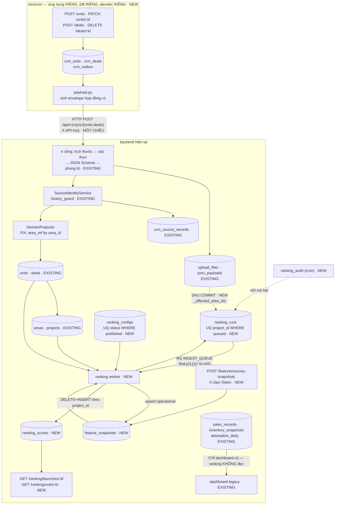

# Lộ trình: phân cấp Dự án → Phân khu → Căn → Giao dịch, và tích hợp Mini CRM ↔ backend

> Lập ngày 2026-08-12. Thay thế các phase đang hoạt động của lộ trình cũ.
> Toàn bộ nội dung cũ được giữ NGUYÊN VĂN ở `## Archived Roadmap History` cuối file.
>
> Đối chiếu mã nguồn tại thời điểm lập: backend `alembic head = 0016_completed_with_conflicts`
> (16 revision), Mini CRM `alembic head = 0002_minicrm_crud` (2 revision), hợp đồng
> đồng bộ `schema_version = 1`.

## Current Status

```text
- Phase 5: COMPLETE
- Phase 5.5 P0: COMPLETE
- Phase A (domain and contract freeze): COMPLETE — REVISED 2026-08-12 (g),
  see "Ownership Model — REVISED" immediately below
- Phase B: NOT STARTED
- Ranking Phase 6: DEFERRED / NOT STARTED
```

---

## Ownership Model — REVISED 2026-08-12 (đợt g)

> **Đây là bản sửa đổi kiến trúc, thay thế mô hình sở hữu ở §1/§2 bên dưới và ở
> mục "Phase A" của tài liệu này.** Quyết định đầy đủ, có test canh, nằm ở
> [`docs/crm/phase_a_domain_freeze.md`](crm/phase_a_domain_freeze.md) — tài liệu
> đó là **nguồn sự thật chuẩn** cho mô hình sở hữu; phần dưới đây là tóm tắt và
> con trỏ.

```text
CŨ (§1/§2 bên dưới, đợt (f)):
  Backend sở hữu Project/Area tuyệt đối.
  Mini CRM CHỈ ĐỌC (tham chiếu), hoặc ĐỀ XUẤT (v2) — không có thẩm quyền.
  Quy trình: Mini CRM đề xuất → backend DUYỆT → status='pending'→'active'.

MỚI (đợt g — ĐANG CÓ HIỆU LỰC):
  Mini CRM SỞ HỮU cả bốn tầng: Project, Area, Unit, Deal.
  Backend là BẢN SAO CHỈ ĐỌC (mirror/projection) + đường nhập + API đọc.
  Backend KHÔNG BAO GIỜ tự tạo, tự sửa các thực thể nghiệp vụ này.
  FE ĐỌC từ backend; FE GHI qua Mini CRM (hoặc một cổng ghi Mini CRM tường minh —
  DECISION REQUIRED D-4).
```

### Ma trận sở hữu (chuẩn, thay thế bảng ở §2.1 bên dưới)

| Entity | Canonical owner | Mini CRM role | Backend role | FE role | Allowed writer |
|---|---|---|---|---|---|
| **Project** | **Mini CRM** | Tác giả — CRUD + phiên bản | Bản sao chỉ đọc — kiểm + soi gương | Đọc backend; ghi qua Mini CRM | Mini CRM; backend chỉ qua tầng chiếu |
| **Area** | **Mini CRM** | Tác giả — CRUD + phiên bản + 3 trường kế hoạch (`bedrooms`/`area_sqm`/`total_units`, BẮT BUỘC, CÓ THẨM QUYỀN) | Bản sao chỉ đọc | Đọc backend; ghi qua Mini CRM | Mini CRM; backend chỉ qua tầng chiếu |
| **Unit** | **Mini CRM** | Tác giả | Bản sao chỉ đọc | Đọc backend; ghi qua Mini CRM | Mini CRM; backend chỉ qua tầng chiếu |
| **Deal** | **Mini CRM** | Tác giả | Bản sao chỉ đọc | Đọc backend; ghi qua Mini CRM | Mini CRM; backend chỉ qua tầng chiếu |
| **Sync state** | Chia đôi theo nửa | Sở hữu nửa GỬI (`crm_outbox`) | Sở hữu nửa NHẬN (`upload_files`, `crm_source_records`) | Đọc nửa NHẬN từ backend | Mỗi bên ghi nửa của mình |
| **Analytics** (`absorption_daily`, ranking, …) | **Backend** | Không vai trò | Chủ sở hữu — **dẫn xuất**, tính từ bản sao | Đọc từ backend | Bộ tính của backend |

### Vì sao đảo ngược, và cái gì KHÔNG đổi

Đảo ngược theo chỉ đạo kiến trúc tường minh của chủ dự án. Bốn quyết định ở §1/§2
gốc (backend sở hữu, quy trình duyệt, `proposed_*` không ràng buộc, `area_ref` ba
hình dạng) **bị thay thế**; phần lớn quyết định còn lại — phân cấp bốn tầng,
Project ≠ tenant, luật `external_id` bất biến, luật phiên bản/tombstone, JOIN thay
vì phi chuẩn hoá, thứ tự cha–con, v1 bất biến, phạm vi dự án tĩnh fail-closed —
**không đổi**, vì chúng không phụ thuộc vào ai sở hữu Project/Area. Bảng đối chiếu
đầy đủ ở `phase_a_domain_freeze.md` §S.

### Hai hệ quả mới, chưa có ở bản (f)

1. **Bốn đường ghi hiện có ở backend vào `projects`/`areas`**
   (`src/services/projects.py:110,170,222,249` `VERIFIED`) **mâu thuẫn với mô hình
   mới**. Phase A không gỡ chúng (Phase A không đổi runtime) —
   `REQUIRED IN PHASE D — NOT IMPLEMENTED NOW`.
2. **Rủi ro bảo mật mới, nghiêm trọng:** Mini CRM không có xác thực ghi nào. Dưới
   mô hình cũ điều đó vô hại (Mini CRM chỉ là bộ sinh dữ liệu tổng hợp). Dưới mô
   hình mới, Mini CRM là hệ thống bản ghi mà FE ghi qua — không xác thực nghĩa là
   bất kỳ ai chạm được cổng của nó đều ghi được mọi dữ liệu nghiệp vụ, và backend
   sẽ trung thành soi gương việc đó. Xem `DECISION REQUIRED D-2` trong Risk
   Register bên dưới. **Đây là điều kiện phải đóng trước khi Phase F/G (FE ghi)
   bắt đầu** — không chặn Phase B.

### §1 và §2 bên dưới, và mục "Phase A" của tài liệu này

Nội dung §1 ("Quyết định miền: phân cấp") và §2 ("Nguồn sự thật") ngay dưới đây,
cùng mục `## Phase A — Domain and contract freeze` ở phần sau, được viết TRƯỚC
quyết định đảo ngược này và phản ánh mô hình CŨ. Chúng được **giữ nguyên văn** làm
tài liệu lịch sử — không xoá, không sửa — nhưng **không còn là quyết định có hiệu
lực**. Nơi có mâu thuẫn, `phase_a_domain_freeze.md` (đợt g) thắng.

| Nhãn | Nghĩa |
|---|---|
| `VERIFIED` | Đã kiểm bằng mã nguồn / migration / test trong repo, có dẫn chứng |
| `PROPOSED` | Thiết kế đề xuất, CHƯA có mã nguồn |
| `NOT STARTED` | Chưa bắt đầu |
| `CONTRACT CHANGE REQUIRED` | Không làm được nếu không sửa `crm_sync_v1.schema.json` |
| `MIGRATION REQUIRED` | Không làm được nếu không thêm migration |
| `DECISION REQUIRED` | Quyết định nghiệp vụ / kiến trúc thuộc chủ dự án, lộ trình KHÔNG tự chốt |
| `LIKELY — VERIFY BEFORE IMPLEMENTATION` | Đường dẫn file suy đoán, phải kiểm trước khi sửa |

---

## 0. Xác minh baseline

Từng khẳng định được đối chiếu với repo. **Ba khẳng định lệch với thực tế** và được
ghi lại nguyên trạng thay vì được chấp nhận.

| # | Khẳng định | Kết quả | Bằng chứng |
|---|---|---|---|
| 1 | Phase 5 hardening is complete | **LỆCH VỀ TỪ NGỮ** | `pipeline_status.md:444` ghi *"Phase 5 chuyển từ `PARTIAL / FAIL` sang **`IMPLEMENTED`**"* — không dùng chữ COMPLETE, và mục *"Còn nợ sau hotfix"* (`pipeline_status.md:604–620`) liệt kê 6 khoản nợ còn mở (nguồn khảo sát chưa ai được giao, từ vựng trạng thái căn `UNKNOWN`, `listed_at`/giá BLOCKED, `full_snapshot` chưa hệ nguồn nào dùng, Mini CRM vẫn là hạ tầng tổng hợp, chi phí khoá chưa đo dưới tải). **Cổng đồng thời của Phase 5 thì ĐẠT** — phần đó là COMPLETE. Lộ trình này dùng trạng thái thật: *cổng Phase 5 đạt, phần nợ ngoài cổng vẫn mở.* |
| 2 | Backend concurrency defect is fixed | **ĐÚNG** `VERIFIED` | `src/services/source_identity.py::_load()` dùng `SELECT ... FOR UPDATE`; `lock_identities()` khoá toàn lô theo `ORDER BY source_record_id`; `sync_runs.py` gọi trước vòng lặp bản ghi. `tests/test_services/test_sync_concurrency.py` (22 test). `minicrm/tests/test_real_failure_windows.py:124` khẳng định bản revision CAO NHẤT luôn thắng bất kể thứ tự đến |
| 3 | Phase 5.5 P0 is complete | **ĐÚNG** `VERIFIED` | `pipeline_status.md:132–135`: *"Phase 5.5 P0 implementation — Status: COMPLETE"* |
| 4 | Backend read surface and RBAC exist | **ĐÚNG** `VERIFIED` | `src/services/dashboard_auth.py` (3 vai trò, `secrets.compare_digest`, fail-closed 503). `GET /sync-runs`, `GET /sync-errors`, `GET /sync-runs/{id}/payload` đòi `pipeline_operator+` (`src/api/sync.py:479,550,634`). `GET /deals` mở (`src/api/inventory.py`) — **cùng mức mở với `/inventory`, có chủ đích, nhưng là rủi ro R-05 của lộ trình này** |
| 5 | Mini CRM outbox/resend/replay-stale exists | **ĐÚNG** `VERIFIED` | `minicrm/app/routers/outbox.py`: `GET /outbox`, `GET /outbox/{id}`, `POST /outbox/{id}/resend`, `POST /outbox/replay-stale`. `minicrm/app/crud.py::resend()`, `replay_stale()`. 17 test ở `minicrm/tests/test_outbox.py` |
| 6 | Frontend operational consuming UI is incomplete | **ĐÚNG** `VERIFIED` | `frontend/src/api/endpoints.js` khai `listSyncRuns`/`listSyncErrors`/`listDeals` kèm chú thích nguyên văn *"Hiện CHƯA có màn hình nào gọi các hàm này"*. `frontend/src/App.jsx` không có route vận hành nào |
| 7 | Mini CRM outbox outside backend RBAC by explicit scope decision | **ĐÚNG** `VERIFIED` | Quyết định phạm vi của chủ dự án ở đợt Phase 5.5 P0 ("Leave Mini CRM unprotected"). Ràng buộc kiến trúc kèm theo vẫn mở: `DECISION REQUIRED #3` của lộ trình cũ ("FE gọi thẳng Mini CRM hay backend proxy") CHƯA được chốt |
| 8 | Freshness threshold may still be unresolved | **ĐÚNG, và mạnh hơn thế** `VERIFIED` | `pipeline_status.md:11–14`: *"chốt ngưỡng `STALE_AFTER_MS` — **BLOCKED** (thiếu quyết định nghiệp vụ)"*. `frontend/src/utils/freshness.js:12` vẫn là ngưỡng tạm 24h, gắn nhãn tường minh |
| 9 | Ranking Phase 6 has not started | **ĐÚNG** `VERIFIED` | `src/ranking/` không tồn tại. `tests/test_ranking_boundary.py` (16 test) canh sự VẮNG MẶT. `ranking_runs`/`ranking_scores` rỗng |

### Ba điểm lệch khác, ngoài danh sách được giao kiểm

| Điểm lệch | Thực tế |
|---|---|
| Header lộ trình cũ ghi *"Đối chiếu với `alembic head = 0013_calculator_comparisons`"* | Head thật là `0016_completed_with_conflicts`. Lộ trình cũ đã lạc hậu 3 revision |
| Lộ trình cũ §1 gọi `area_ref = {"area_id": ...}` là **P0 duy nhất chặn luồng** (bị `_project_unit` từ chối) | **ĐÃ SỬA.** `src/services/domain_projection.py::_resolve_area` (dòng 215–296) xử lý CẢ HAI hình dạng của `area_ref`, và luôn giới hạn theo `project_id`. Khẳng định P0 đó không còn đúng |
| Lộ trình cũ `DECISION REQUIRED #4` hỏi *"`_terminal_status` coi conflict là 'chặn' ⇒ lô một-bản-ghi-conflict thành `failed`. Đúng hay sai?"* | **ĐÃ TRẢ LỜI VÀ ĐÃ SỬA** ở Phase 5.5 P0: trạng thái mới `completed_with_conflicts` (migration `0016`) |

---

## 1. Quyết định miền: phân cấp

### 1.1 Phân cấp đích

```text
Project                (dự án mở bán)
└── Area               (phân khu × loại căn)
    └── Unit           (căn hộ)
        └── Deal       (giao dịch trên căn)
```

**Thực tế vật lý hôm nay** (`VERIFIED`, migration `0001` + `0007`):

```text
areas.project_id  → projects.id     (FK fk_areas_project_id)
units.area_id     → areas.id        (FK fk_units_area_id)
deals.unit_id     → units.id        (FK fk_deals_unit_id)
```

Phân cấp đích **đã tồn tại đầy đủ ở tầng khoá ngoại**. Cái chưa tồn tại là *đường
đồng bộ* cho hai tầng trên và *phạm vi phân quyền* theo dự án.

Điểm cần nói rõ để không ai đọc nhầm: **`units` và `deals` KHÔNG có cột
`project_id`.** Dự án của một căn được suy ra qua `area_id → areas.project_id`;
dự án của một giao dịch suy ra qua `unit_id → units.area_id → areas.project_id`.
Mọi truy vấn phạm vi dự án ở Phase D/E vì thế là một phép JOIN hai–ba tầng, và đó
là lý do Phase D bắt buộc phải nói về index.

### 1.2 Danh tính bất biến

| Thực thể | Danh tính nội bộ | Danh tính nguồn | Trạng thái hôm nay |
|---|---|---|---|
| Project | `projects.id` (UUID, PK) | `external_id` | **KHÔNG TỒN TẠI** → `MIGRATION REQUIRED` |
| Area | `areas.id` (UUID, PK) | `external_id` | **KHÔNG TỒN TẠI** → `MIGRATION REQUIRED` |
| Unit | `units.id` (UUID, PK) | `units.external_unit_id`, duy nhất theo `uq_units_source_identity (source_instance_id, external_unit_id)` | `VERIFIED` |
| Deal | `deals.id` (UUID, PK) | `deals.external_deal_id`, duy nhất theo `uq_deals_source_identity` | `VERIFIED` |

Quy tắc bất biến, áp cho cả bốn tầng:

* Danh tính nội bộ (UUID) **không bao giờ đổi** và không bao giờ lộ ra làm khoá nghiệp vụ ở hệ nguồn.
* Danh tính nguồn (`external_id`) **bền vững trọn đời và KHÔNG BAO GIỜ dùng lại**, kể cả sau tombstone — đây là giả định A1 của hợp đồng v1, đã được `minicrm/app/models.py` thi hành bằng hai sequence không lùi (`crm_unit_external_seq`, `crm_deal_external_seq`).
* Ranh giới cô lập của danh tính nguồn là `source_instance_id`, **không phải** `project_id`. Hai instance hệ nguồn khác nhau được phép cấp trùng `external_id` mà không đụng nhau; cùng một instance thì không.

### 1.3 Sở hữu quan hệ cha–con

| Quan hệ | Ai quyết định | Cưỡng chế ở đâu |
|---|---|---|
| Area thuộc Project | Backend | FK `fk_areas_project_id` + `uq_areas_project_name_unit_type` |
| Unit thuộc Area | Hệ nguồn khai (`area_ref`), backend PHÂN GIẢI | `_resolve_area` giới hạn theo `project_id` của phong bì; không tra được ⇒ TỪ CHỐI bản ghi, KHÔNG tự tạo phân khu |
| Deal thuộc Unit | Hệ nguồn khai (`external_unit_id`) | Mini CRM kiểm cục bộ (`_require_mirrored_unit`); backend phân giải và từ chối nếu không thấy |

### 1.4 Project là thực thể NGHIỆP VỤ hay ranh giới BẢO MẬT? — quyết định

**Khuyến nghị: Project là thực thể NGHIỆP VỤ. Ranh giới bảo mật được mô hình hoá
RIÊNG, dưới dạng *thành viên dự án* (project membership) gắn vào vai trò đã có.**

Ba lý do rút ra từ mã nguồn, không phải từ nguyên tắc chung:

1. **Ranh giới cô lập của luồng nhập đã có chủ, và nó không phải Project.** `uq_units_source_identity` khoá trên `(source_instance_id, external_unit_id)` — *không* có `project_id`. Nếu tuyên bố Project là tenant, hệ thống sẽ có **hai trục cô lập cạnh tranh nhau**: `source_instance_id` cho dữ liệu vào, `project_id` cho dữ liệu ra. Một căn cùng `external_id` ở hai dự án sẽ bị `uq_units_source_identity` từ chối dù mô hình tenant nói là hợp lệ. Đó là mâu thuẫn thiết kế, không phải chi tiết cài đặt.
2. **Project mang nội dung nghiệp vụ mà một tenant không nên mang**: `launch_date`, `headline`, `introduce`, `cover_image_url`, `absorption_calculator`, và cả một quy trình duyệt (`status`, `reviewed_by`, `reviewed_at`, `review_reason` — migration `0002`). Tenant là một nhãn phân vùng; đây là một hồ sơ nghiệp vụ.
3. **Vai trò hôm nay là ba token tĩnh, không phải bảng người dùng** (`src/services/dashboard_auth.py`). Không có thực thể "người dùng" nào để gắn tenant vào. Ép Project thành tenant sẽ buộc phải dựng cả hệ người dùng cùng lúc — trộn hai thay đổi lớn, đúng loại việc mà Phase 1 của lộ trình cũ đã từ chối làm.

**Hệ quả thiết kế:** phạm vi bảo mật = `(role, project_scope)` với `project_scope`
là *tập* `project_id` hoặc ký hiệu `ALL`. Xem Phase E.

### 1.5 Project có thuộc một tổ chức/tenant không?

**Không, và KHÔNG thêm tầng tổ chức trong lộ trình này.** `projects` không có cột
`organization_id`, không có bảng `organizations`, và không có yêu cầu nghiệp vụ nào
trong repo đòi hỏi nó. Thêm một tầng tenant vào lúc chưa có hệ người dùng thật là
thêm một trục phân quyền không ai kiểm được. `DECISION REQUIRED D-6` giữ chỗ cho
câu hỏi này nếu sau này có nhiều chủ đầu tư dùng chung một cài đặt.

### 1.6 Area có được chuyển sang Project khác không?

**KHÔNG. Cấm, và cưỡng chế bằng lỗi tường minh.**

Lý do vật lý: `absorption_daily`, `sales_records`, `inventory_snapshots` đều khoá
theo `area_id` và **không** mang `project_id`. Chuyển một area sang dự án khác sẽ
im lặng dời toàn bộ lịch sử hấp thụ theo nó, không để lại vết nào. `_resolve_area`
lại luôn giới hạn theo `project_id` của phong bì, nên sau khi chuyển, mọi lô cũ
của hệ nguồn sẽ đột ngột không phân giải được.

Cách làm thay thế bắt buộc: **tombstone area cũ + tạo area mới** — hai thao tác
nhìn thấy được, có mốc thời gian, không viết lại quá khứ.

### 1.7 Unit có được chuyển sang Area khác không?

**CÓ, nhưng chỉ TRONG CÙNG một dự án.**

Đây không phải tính năng mới: `units.area_id` là cột thường (không phải khoá), và
một lô `upsert` mang `area_ref` khác sẽ khiến `_upsert` ghi `area_id` mới ngay hôm
nay. Nghĩa là hành vi **đã tồn tại nhưng CHƯA được khai báo và CHƯA có test**.

Ba điều Phase D phải làm rõ ràng thay vì để nó xảy ra tình cờ:

* Cross-project move **phải bị chặn**: `_resolve_area` chỉ tìm trong `project_id`
  của phong bì, nên một area của dự án khác sẽ trả `AREA_NOT_FOUND` — đúng, nhưng
  hôm nay đó là *tác dụng phụ*, không phải khẳng định có test.
* Deal đi theo Unit tự động (`deals.unit_id` không đổi) — không cần sự kiện riêng.
* `areas.total_units` KHÔNG tự điều chỉnh khi unit chuyển đi. Đây là số kế hoạch
  do backend sở hữu, không phải số đếm — phải ghi rõ để không ai "sửa" nó.

### 1.8 Xoá và tombstone

**Không có xoá vật lý ở bất kỳ tầng nào bởi một lô đồng bộ.** Hợp đồng v1 đã nói
điều đó cho `unit`/`deal` (`operation: delete` = tombstone); lộ trình này mở rộng
nguyên tắc lên `project`/`area`.

| Tầng | Cột tombstone hôm nay | Hành vi đề xuất khi xoá cha còn con sống |
|---|---|---|
| Project | **KHÔNG CÓ `deleted_at`**; có `status='archived'` (migration `0002`) | Dùng `status='archived'`, KHÔNG thêm `deleted_at`. Còn area sống ⇒ **TỪ CHỐI** |
| Area | **KHÔNG CÓ `deleted_at`**; có `status='archived'` | Như trên. Còn unit sống ⇒ **TỪ CHỐI** |
| Unit | `units.deleted_at` `VERIFIED` | Còn deal sống ⇒ `DECISION REQUIRED D-3` (hôm nay backend cho phép, Mini CRM không kiểm) |
| Deal | `deals.deleted_at` `VERIFIED` | Lá — không có con |

**Khuyến nghị mạnh: KHÔNG cascade tombstone xuống con.** Cascade ở tầng chiếu sẽ
đánh dấu đã xoá những dòng mà hệ nguồn vẫn tin là sống; lần đồng bộ sau, hệ nguồn
gửi lại con với revision cao hơn và backend sẽ hồi sinh nó — một vòng dao động
không hội tụ. Thay vào đó: **từ chối xoá cha khi còn con sống**, kèm lỗi có cấu
trúc liệt kê con còn sống.

### 1.9 Quy tắc duy nhất

| Ràng buộc | Trạng thái |
|---|---|
| `uq_areas_project_name_unit_type (project_id, area_name, unit_type)` | `VERIFIED`, migration `0001` |
| `uq_units_source_identity (source_instance_id, external_unit_id)` | `VERIFIED`, migration `0007` |
| `uq_deals_source_identity (source_instance_id, external_deal_id)` | `VERIFIED`, migration `0007` |
| `projects` — KHÔNG có ràng buộc duy nhất trên `name` | `VERIFIED`, có chủ đích (`src/services/projects.py:107`: cùng khu đô thị mở bán nhiều đợt) |
| `unit_code` duy nhất trong một phân khu, xét trên căn còn sống | Hợp đồng v1 KHAI điều này (`unit_payload.unit_code`) nhưng **KHÔNG có ràng buộc DB nào cưỡng chế** — `MIGRATION REQUIRED` nếu muốn thi hành (partial unique index `WHERE deleted_at IS NULL`) |
| `uq_projects_source_identity`, `uq_areas_source_identity` | **CHƯA TỒN TẠI** → `MIGRATION REQUIRED` |

### 1.10 Tham chiếu bắt buộc trong mọi payload đồng bộ

```text
project.external_id       →  BẮT BUỘC (mới)
area.external_id          →  BẮT BUỘC (mới)
area.project_ref          →  BẮT BUỘC (mới)
unit.area_ref             →  BẮT BUỘC (đã có)
unit.project_ref          →  ở PHONG BÌ, không lặp ở bản ghi (đã có)
deal.external_unit_id     →  BẮT BUỘC (đã có)
deal.area_ref/project_ref →  KHÔNG mang; suy ra qua unit (xem §3)
```

---

## 2. Nguồn sự thật

### 2.1 Bảng sở hữu — đề xuất

| Entity | Mini CRM owns | Backend owns | FE consumes |
|---|---|---|---|
| **Project** | ❌ (chỉ giữ bản sao đọc để kiểm cục bộ) | ✅ **danh tính + toàn bộ nội dung nghiệp vụ** | ✅ từ backend |
| **Area** | ⚠️ **ĐỀ XUẤT được**, không quyết định | ✅ **phê duyệt + thuộc tính kế hoạch** (`bedrooms`, `area_sqm`, `total_units`) | ✅ từ backend |
| **Unit** | ✅ **sở hữu hoàn toàn** | ❌ chỉ chiếu | ✅ từ backend |
| **Deal** | ✅ **sở hữu hoàn toàn** | ❌ chỉ chiếu | ✅ từ backend |
| **Sync status** | ✅ nửa gửi (`crm_outbox`) | ✅ nửa nhận (`upload_files`, `sync_runs`) | ✅ **từ backend** cho nửa nhận; nửa gửi xem `DECISION REQUIRED D-4` |
| **Ranking data** | ❌ | ✅ (Phase 6, chưa bắt đầu) | ❌ chưa có |

### 2.2 Vì sao Project KHÔNG chuyển quyền sở hữu sang Mini CRM

Yêu cầu của đợt này liệt kê "Project CRUD" và "Backend project/area projection",
đọc thoáng thì có vẻ Mini CRM phải trở thành tác giả của dự án. **Khuyến nghị là
không**, vì bốn dữ kiện trong repo:

1. `projects` mang `launch_date` (NOT NULL), `absorption_calculator`, ảnh bìa
   Cloudinary, và quy trình duyệt `pending → active/rejected/archived`. Một CRM
   bán hàng không có khái niệm nào trong số đó.
2. `MINICRM_PROJECT_ID` trong `.env.example:124` đã ghi rõ hướng phụ thuộc:
   *"UUID một dự án ĐÃ CÓ ở backend — Mini CRM không tạo được dự án."*
3. Hợp đồng v1 `$defs/project_ref` ghi: *"Trỏ tới một dự án ĐÃ CÓ. Dự án do hệ
   thống này sở hữu; CRM không tạo được dự án mới."*
4. AGENTS.md đặt human-in-the-loop là **yêu cầu cứng** của dự án. Cho một hệ nguồn
   tổng hợp tự tạo dự án là đi vòng qua chính điểm duyệt đó.

**Vậy "Project CRUD ở Mini CRM" nghĩa là gì trong lộ trình này?** Là một **sổ đăng
ký dự án cục bộ, chỉ đọc, đồng bộ XUỐNG** (backend → Mini CRM) để Mini CRM kiểm
được tham chiếu trước khi tạo outbox. CRUD đầy đủ (create/update/delete) áp dụng
cho **Area đề xuất**, **Unit**, **Deal** — ba tầng mà Mini CRM thật sự sở hữu.

### 2.3 Area: mô hình "hệ nguồn ĐỀ XUẤT, người vận hành DUYỆT"

Đây là quyết định kiến trúc đáng chú ý nhất của lộ trình này, và nó **không cần
bảng mới**: `areas` đã có sẵn `status IN ('pending','active','rejected','archived')`,
`created_by`, `reviewed_by`, `reviewed_at`, `review_reason` từ migration `0002` —
những cột hiện chưa được dùng cho mục đích này.

```text
Mini CRM tạo area  →  outbox  →  backend chiếu vào areas với status='pending'
                                 và bedrooms/area_sqm/total_units = giá trị chờ
                              →  unit trỏ vào area 'pending' bị TỪ CHỐI
                                 (AREA_PENDING_APPROVAL)
                              →  người vận hành duyệt, điền số kế hoạch
                              →  status='active'  →  unit phân giải được
```

Ba thứ mô hình này giải quyết cùng lúc:

* Backend không phải bịa `bedrooms`/`area_sqm`/`total_units` (ba cột NOT NULL với
  CHECK `area_sqm > 0`) từ một payload không mang chúng.
* Nguyên tắc "phía nhận KHÔNG tự tạo phân khu" của hợp đồng v1 được giữ đúng tinh
  thần: phân khu vẫn không xuất hiện *ở trạng thái dùng được* nếu không có con
  người.
* Yêu cầu HITL của dự án được áp cho đúng chỗ nó thuộc về.

`DECISION REQUIRED D-1` giữ lựa chọn thay thế (backend là tác giả duy nhất của
area, Mini CRM chỉ đồng bộ xuống) nếu chủ dự án muốn ít cơ động hơn và ít đường
ghi hơn.

### 2.4 Luồng bắt buộc giữ nguyên

```text
Mini CRM local CRUD  →  outbox  →  HTTP ingestion  →  backend projection  →  FE reads from backend
```

**FE KHÔNG gọi thẳng Mini CRM.** Không có ngoại lệ nào trong lộ trình này. Điều đó
để lại đúng một khoảng trống đã biết: FE không nhìn thấy được nửa GỬI của đường
đồng bộ (`crm_outbox`) — xem `DECISION REQUIRED D-4`, kế thừa nguyên vẹn từ
`DECISION REQUIRED #3` của lộ trình cũ, vẫn chưa được chốt.

---

## 3. Tham chiếu ổn định

### 3.1 Hợp đồng v1 hỗ trợ được đến đâu — đối chiếu từng dòng

| Tham chiếu yêu cầu | Hợp đồng v1 | Kết luận |
|---|---|---|
| `project.external_id` | **KHÔNG.** `record.entity` là `enum ["unit","deal"]` — không có thực thể `project` | `CONTRACT CHANGE REQUIRED` |
| `area.external_id` | **KHÔNG.** Cùng lý do | `CONTRACT CHANGE REQUIRED` |
| `area.project_ref` | **KHÔNG.** Không có bản ghi area để mang nó | `CONTRACT CHANGE REQUIRED` |
| `unit.project_ref` | **CÓ, ở tầng PHONG BÌ** — `$defs/project_ref`, chỉ chấp nhận `{project_id: uuid}` (`oneOf` một nhánh) | Đủ dùng. Lưu ý: **cả lô cùng một dự án**, không thể trộn dự án trong một phong bì |
| `unit.area_ref` | **CÓ** — `unit_payload.area_ref`, hai hình dạng: `{area_id}` hoặc `{area_name, unit_type}` | Đủ dùng, và `_resolve_area` xử lý cả hai `VERIFIED` |
| `deal.project_ref` | **KHÔNG** — `deal_payload` chỉ có `external_unit_id`, `deal_status`, ba mốc thời gian | Suy ra qua unit. **Khuyến nghị KHÔNG thêm** — xem §3.3 |
| `deal.area_ref` | **KHÔNG** | Như trên |

### 3.2 CONTRACT CHANGE REQUIRED — phạm vi chính xác

```text
CONTRACT CHANGE REQUIRED  →  schema_version 2

1. record.entity:      ["unit","deal"]  →  ["project","area","unit","deal"]
2. $defs/area_payload:      MỚI  { project_ref, area_name, unit_type,
                                   bedrooms?, area_sqm?, total_units? }
3. $defs/project_payload:   MỚI  — CHỈ khi D-1 chọn phương án "Mini CRM đề xuất
                                   dự án". Theo khuyến nghị §2.2 thì KHÔNG cần
4. records ordering:   "unit trước deal"  →  "project → area → unit → deal"
5. snapshot_scope.entities:  ["unit","deal"]  →  thêm "area" (và "project" nếu 3)
```

**Hai bản sao phải đổi cùng lúc.** `minicrm/contracts/crm_sync_v1.schema.json` và
bản của backend được so khớp bằng SHA-256 ở `minicrm/tests/test_contract_copy.py`;
sửa một bên là test đỏ ngay. Đó là cơ chế đã có và phải giữ.

**Tương thích ngược:** `schema_version` là `const: 1` — phía nhận *"từ chối thẳng
giá trị không nhận ra, không đoán"*. Nên v2 **không tự động tương thích ngược**;
backend phải chấp nhận cả `1` và `2`, và một hệ nguồn v1 phải tiếp tục chạy được
không sửa gì. Đây là hạng mục exit gate của Phase A, không phải giả định.

### 3.3 Vì sao KHÔNG thêm `project_ref`/`area_ref` vào `deal_payload`

Thêm vào sẽ tạo **hai đường dẫn tới cùng một sự thật**: `deal → unit → area →
project` và `deal.project_ref`. Hai đường thì có ngày chúng lệch nhau, và lúc đó
không có luật nào nói bên nào đúng. Deal đã bắt buộc trỏ vào một unit tồn tại; dự
án và phân khu của nó **là** dự án và phân khu của unit đó, theo định nghĩa.

Nếu Phase D cần lọc deal theo dự án nhanh, câu trả lời là **index**, không phải
cột trùng lặp — xem Phase D, mục "Indexes và performance".

---

## 4. Phiên bản và idempotency

### 4.1 Trường bắt buộc cho MỌI thực thể phân cấp

```text
external_id          danh tính nguồn, bền vững trọn đời, không tái sử dụng
source_revision      bộ đếm, tăng MỖI lần ghi kể cả xoá, ≥ 1
created_at           mốc tạo ở hệ nguồn
updated_at           mốc ghi cuối ở hệ nguồn
deleted_at           tombstone; NULL = còn sống
external_batch_id    lô đã chở bản ghi này
```

**Phát hiện quan trọng cho việc lập kế hoạch:** `crm_source_records` — sổ danh
tính/phiên bản của backend — **đã trung lập với thực thể**. `source_entity` là
`sa.Text()` với **CHECK duy nhất là `<> ''`** (migration `0006:224`), không có
enum. Vì vậy `project`/`area` ghi vào sổ này **KHÔNG cần migration nào cho
`crm_source_records`**. Toàn bộ máy quyết định sáu nhánh (`insert`/`update`/
`skip_stale`/`duplicate_noop`/`conflict`/`tombstone`) và khoá hàng `FOR UPDATE`
của Phase 5 áp dụng cho hai tầng mới **không sửa một dòng nào**.

Migration cần thiết chỉ nằm ở `projects` và `areas` (§1.2, §1.9).

### 4.2 Luật tăng phiên bản

* Tăng **mỗi lần ghi**, kể cả xoá mềm, kể cả sửa một trường. Không dùng đồng hồ.
* Mini CRM đã làm đúng luật này cho unit/deal (`source_revision` bump trong cùng
  transaction với ghi) — mở rộng nguyên xi cho area.
* `source_revision` **thắng** `source_updated_at` khi cả hai cùng có (hợp đồng v1).

### 4.3 Bảng hành vi — kế thừa nguyên vẹn từ Phase 5

| Tình huống | Quyết định | Đã có test |
|---|---|---|
| Phát lại bản CŨ (revision thấp hơn) | `skip_stale`, không ghi đè | `minicrm/tests/test_real_backend_sync.py:548,562` |
| Cùng revision, cùng `payload_hash` | `duplicate_noop` | `tests/test_services/test_source_identity.py` |
| Cùng revision, KHÁC `payload_hash` | `conflict` — GHI NHẬN, giữ bản cũ, lô kết thúc `completed_with_conflicts` | `tests/test_services/test_source_identity.py`, migration `0016` |
| First-insert race | `INSERT ... ON CONFLICT DO NOTHING RETURNING` rồi `_load()` lại (chờ khoá) | `tests/test_services/test_sync_concurrency.py` (22 test) |
| Gửi lại đúng `external_batch_id` | `replayed=true`, trả kết quả cũ, không xử lý lần hai | `minicrm/tests/test_real_backend_sync.py:521,529` |
| Phát lại payload cũ dưới batch id MỚI | Lô mới, nhưng bản ghi `skip_stale` | `minicrm/tests/test_outbox.py` |

**Nghĩa vụ của Phase C/D: chứng minh bảng trên vẫn đúng khi bản ghi là `area`,
không phải giả định nó đúng.**

### 4.4 Thứ tự xoá và thứ tự cha–con

```text
Tạo:  project → area → unit → deal      (cha trước)
Xoá:  deal → unit → area → project      (con trước — NGƯỢC LẠI)
```

Một lô trộn nhiều tầng **được phép**, với điều kiện các bản ghi trong lô đã sắp
theo thứ tự trên. Hợp đồng v1 đã có tiền lệ đúng dạng này ("mọi record entity=unit
phải đứng trước mọi record entity=deal"); v2 mở rộng cùng một câu.

### 4.5 Ranh giới transaction — giữ nguyên, không đàm phán lại

```text
Mini CRM:  [transaction: kiểm → ghi (revision+1) → dựng phong bì TỪ DÒNG ĐÃ GHI
                       → kiểm hợp đồng → ghi crm_outbox]  COMMIT  →  POST
Backend:   [transaction lô: khoá danh tính toàn lô (ORDER BY source_record_id)
                       → per-record SAVEPOINT → chiếu → ghi sổ]  COMMIT
```

Ba tính chất phải được bảo toàn khi thêm hai tầng, và Phase C/D phải có test cho
từng cái: (a) phong bì dựng từ **dòng đã ghi**, không từ thân request; (b) kiểm hợp
đồng **trong** transaction; (c) gửi **ngoài** transaction.

---

## 5. Thứ tự sự kiện

### 5.1 Area đến trước Project của nó thì sao?

Theo §2.2, Project do backend sở hữu và **không đến qua đường đồng bộ** — nên tình
huống này chỉ xảy ra khi `project_ref.project_id` trỏ vào một dự án không tồn tại.

**Hành vi: TỪ CHỐI CẢ LÔ ở tầng phong bì** (`PROJECT_NOT_FOUND`, HTTP 4xx), không
phải từ chối từng bản ghi. Lý do: `project_ref` là thuộc tính của phong bì; nếu nó
sai thì mọi bản ghi trong lô đều sai, và từ chối từng dòng chỉ tạo N lỗi giống hệt
nhau cho một nguyên nhân duy nhất.

### 5.2 Unit đến trước Area của nó thì sao?

**Hành vi: TỪ CHỐI BẢN GHI ĐÓ, giữ nguyên phần còn lại của lô.** Đây là hành vi
ĐÃ CÓ (`_resolve_area` → lỗi có cấu trúc, không tự tạo area) và đã được test ở
`minicrm/tests/test_real_backend_sync.py:429`.

**KHÔNG defer, KHÔNG dead-letter.** Cả hai đòi hạ tầng mới (hàng đợi chờ, job quét
lại, chính sách hết hạn) cho một tình huống mà hệ nguồn tự tránh được bằng cách
sắp thứ tự — và nếu hệ nguồn không sắp được thì việc phát lại lô (`resend`) đã là
cơ chế phục hồi sẵn có. Thêm dead-letter là thêm một nơi dữ liệu có thể nằm lại
mà không ai nhìn.

### 5.3 Mini CRM nên TỪ CHỐI hay XẾP HÀNG bản ghi cục bộ không hợp lệ?

**TỪ CHỐI, ở tầng cục bộ, TRƯỚC khi tạo outbox.** Đây đã là nguyên tắc đang chạy:

* `_require_mirrored_unit` — deal chỉ tạo được khi unit của nó **đã được backend
  soi gương**, không chỉ tồn tại cục bộ (`minicrm/app/crud.py:467`).
* `contract.assert_valid` chạy **trong** transaction ⇒ payload hỏng ⇒ rollback ⇒
  *"không tồn tại bản ghi đã commit nào mà Mini CRM không diễn đạt nổi thành
  payload hợp lệ"*.

Mở rộng nguyên xi cho area: area chỉ tạo được khi `project_id` cấu hình tồn tại và
đã được xác nhận; unit chỉ tạo được khi area của nó đã `mirrored` **và đã được
duyệt** (`status='active'`).

### 5.4 Backend: reject / defer / dead-letter cho bản ghi mồ côi?

**REJECT**, với lỗi có cấu trúc ghi vào `upload_errors` (`error_category`,
`json_path`, `source_record_id`, `record_locator` — bốn cột đã có từ migration
`0006`). Lô kết thúc `partially_completed` nếu có bản ghi khác thành công, `failed`
nếu không có bản nào. Phục hồi = hệ nguồn sửa thứ tự và gửi lô mới; hoặc người
trực bấm `POST /sync-runs/{id}/reprocess` sau khi cha đã tồn tại.

### 5.5 Xoá cha lan xuống con như thế nào?

**Không lan.** §1.8. Backend **từ chối** tombstone một area còn unit sống, kèm
danh sách `external_id` của con còn sống trong `message` của lỗi — để người vận
hành biết chính xác phải xử lý gì, thay vì nhận một câu "có ràng buộc".

### 5.6 Tombstone của con được xử lý ra sao?

Độc lập với cha. Một unit bị tombstone vẫn giữ nguyên `area_id`; nó biến mất khỏi
mọi mặt đọc "còn sống" nhưng vẫn ở nguyên trong sổ để `skip_stale` và
`duplicate_noop` còn so được. Lưu ý đã ghi ở `pipeline_status.md:583`: unit đã
tombstone có `source_revision` **thấp hơn** `crm_source_records` — đó là **đúng**,
vì `_tombstone()` chỉ đặt `deleted_at`, còn `units.source_revision` mang phiên bản
của lần upsert NỘI DUNG cuối. Đừng "sửa".

### 5.7 Một lô có được chứa nhiều tầng phân cấp không?

**CÓ**, với ràng buộc thứ tự ở §4.4 và ràng buộc phong bì ở §3.1 (cả lô cùng một
dự án). Cấm trộn sẽ buộc mỗi thao tác nghiệp vụ ("mở một phân khu mới với 40 căn")
thành nhiều lô, và lúc đó tính nguyên tử của thao tác đó không còn ai giữ.

---

## Phase A — Domain and contract freeze

> **STATUS: COMPLETE — REVISED.** Phase A đã được thực thi. Kết quả CHUẨN nằm ở
> [`docs/crm/phase_a_domain_freeze.md`](crm/phase_a_domain_freeze.md) (bản (g),
> mô hình Mini CRM sở hữu), không phải ở đặc tả kế hoạch dưới đây. Đặc tả này
> được viết TRƯỚC khi Phase A chạy và mô tả phạm vi công việc dự kiến — nó vẫn
> đúng ở phần "Objective/Scope/Exit gate" nhưng **`Acceptance criteria` bên dưới
> tham chiếu mã lỗi của mô hình CŨ đã bị thay thế** (`AREA_PENDING_APPROVAL` —
> xem `phase_a_domain_freeze.md` §S-2). Giữ nguyên văn làm lịch sử kế hoạch.

**Objective.** Chốt mô hình miền bốn tầng, từ vựng, ngữ nghĩa xoá, tên sự kiện và
phong bì `schema_version 2` — **trước khi** viết một dòng mã nào, để không phase
nào sau đó phải đoán.

**Scope.** Chỉ tài liệu + schema JSON + quyết định. Không mã nghiệp vụ, không
migration, không endpoint.

**Files/modules likely affected.**
* `minicrm/contracts/crm_sync_v1.schema.json` `VERIFIED` (thêm bản `v2` cạnh nó)
* Bản sao schema phía backend — `LIKELY — VERIFY BEFORE IMPLEMENTATION` (đường dẫn chính xác phải tra từ `src/services/contract_validation.py`)
* `docs/crm/sync_contract_v1_draft.md` `LIKELY — VERIFY BEFORE IMPLEMENTATION`
* `docs/crm/activation_prerequisites.md` `LIKELY — VERIFY BEFORE IMPLEMENTATION`
* File này (`docs/roadmap.md`) `VERIFIED`

**Database impact.** Không.
**API/contract impact.** `CONTRACT CHANGE REQUIRED` — định nghĩa `schema_version 2`, quy tắc song hành v1/v2.
**FE impact.** Không.
**Mini CRM impact.** Không (chỉ nhận đầu vào của phase sau).
**Security impact.** Chốt mô hình phạm vi `(role, project_scope)` trên giấy; chưa cưỡng chế.
**Migration requirement.** Không.
**Dependencies.** Không.

**Risks.** Chốt sai từ vựng trạng thái căn (R-11) sẽ đông cứng một quyết định
`UNKNOWN` đã mở từ Phase 3. Phase A phải nêu nó, không được lặng lẽ chọn.

**Tests.** `minicrm/tests/test_contract_copy.py` `VERIFIED` (mở rộng: băm cả v2).
Test đọc schema khẳng định v1 **không đổi một byte**.

**Acceptance criteria.**
```text
- Bảng sở hữu §2.1 được chủ dự án xác nhận hoặc sửa.
- schema_version 2 tồn tại dưới dạng file, hợp lệ theo Draft 2020-12.
- v1 và v2 cùng được liệt kê là phiên bản backend chấp nhận.
- Mọi mã lỗi mới (PROJECT_NOT_FOUND, AREA_PENDING_APPROVAL,
  PARENT_HAS_LIVE_CHILDREN, AREA_CROSS_PROJECT_MOVE) có định nghĩa và HTTP status.
- D-1 và D-2 đã được trả lời.
```

**Exit gate.**
```text
No ambiguous parent-child or source-of-truth rule remains.
```

**Not in scope.** Bất kỳ mã chạy được nào. Phase 6. Từ vựng trạng thái căn (chỉ
nêu, không chốt, trừ khi chủ dự án chốt trong phase này).

---

## Phase B — Mini CRM hierarchy CRUD

> **SUPERSEDED BY OWNERSHIP REVISION (đợt g) — chưa thực thi, cần viết lại trước
> khi bắt đầu.** Đặc tả dưới đây giả định mô hình CŨ (Mini CRM chỉ đọc Project,
> chỉ đề xuất Area, `_require_approved_area`). Mô hình có hiệu lực: **Mini CRM là
> tác giả CRUD đầy đủ cho CẢ BỐN tầng**, không có bước duyệt, ba trường kế hoạch
> của Area bắt buộc và có thẩm quyền ngay từ hệ nguồn. Giữ nguyên văn làm lịch sử
> kế hoạch; xem [`docs/crm/phase_a_domain_freeze.md`](crm/phase_a_domain_freeze.md)
> §A1.1/§A1.2 và §A2.4 cho mô hình chuẩn trước khi triển khai Phase B thật.

**Objective.** Mini CRM biết đến Project (chỉ đọc) và Area (đề xuất được), kiểm
mọi tham chiếu cục bộ trước khi bất cứ thứ gì rời khỏi máy.

**Scope.** Project registry cục bộ; Area CRUD; quan hệ project–area; kiểm cục bộ;
`source_revision` cho area; ràng buộc duy nhất; kiểm cha tồn tại; chính sách xoá;
schema API; migration Mini CRM; siết Unit/Deal CRUD theo phạm vi area.

**Files/modules likely affected.**
* `minicrm/app/models.py` `VERIFIED` — thêm `crm_projects`, `crm_areas`, sequence `crm_area_external_seq`
* `minicrm/alembic/versions/0003_minicrm_hierarchy.py` **NEW**
* `minicrm/app/crud.py` `VERIFIED` — thêm `create_area`/`update_area`/`delete_area`, siết `create_unit` (`_require_approved_area`)
* `minicrm/app/schemas.py` `VERIFIED`, `minicrm/app/routers/areas.py` **NEW**, `minicrm/app/routers/projects.py` **NEW**
* `minicrm/app/config.py` `VERIFIED` — `MINICRM_PROJECT_ID` giữ nguyên vai trò

**Database impact.** Mini CRM: 2 bảng mới + 1 sequence. Backend: **không đụng**.
**API/contract impact.** API cục bộ của Mini CRM (mới). Hợp đồng đồng bộ: không (Phase C).
**FE impact.** Không.
**Mini CRM impact.** Đây là phase của nó.
**Security impact.** Không đổi — Mini CRM vẫn không có auth (quyết định phạm vi, R-10).
**Migration requirement.** `MIGRATION REQUIRED` — **chỉ ở cây Alembic của Mini CRM**. Cây backend giữ nguyên `0016`. `minicrm/tests/test_real_backend_sync.py:677` canh hai cây không trộn.
**Dependencies.** Phase A.

**Risks.** Cây Alembic bị trộn (R-13) — đã có test canh. `crm_projects` trôi khỏi
`projects` của backend (R-08): bản sao cục bộ phải mang `mirrored_at` như unit/deal
để nhìn thấy được độ lệch, không được giả vờ luôn đúng.

**Tests.**
```text
- area cục bộ: tạo/sửa/xoá, revision tăng mỗi lần ghi
- trùng (area_name, unit_type) trong cùng project  →  từ chối
- unit trỏ vào area chưa duyệt                     →  từ chối cục bộ, KHÔNG outbox
- unit trỏ vào area của project khác               →  từ chối cục bộ
- xoá area còn unit sống                           →  từ chối cục bộ
- payload hỏng                                     →  rollback, không dòng nào commit
- migration 0003 up/down, và test cô lập hai cây Alembic
```

**Acceptance criteria.**
```text
- Mọi tham chiếu cross-project bị từ chối CỤC BỘ, trước khi có dòng outbox nào.
- Không tồn tại bản ghi đã commit nào mà Mini CRM không dựng nổi payload hợp lệ.
- Mọi ghi hợp lệ là nguyên tử (một transaction, một revision bump, một dòng outbox).
```

**Exit gate.**
```text
Invalid cross-project references are rejected locally.
All valid writes are transactionally consistent.
```

**Not in scope.** Gửi đi (Phase C). Chiếu ở backend (Phase D). Auth Mini CRM.

---

## Phase C — Outbox and hierarchy synchronization

> **SUPERSEDED BY OWNERSHIP REVISION (đợt g).** Đặc tả dưới đây phần lớn vẫn đúng
> về CƠ CHẾ (outbox, thứ tự, resend/replay), nhưng phong bì phải đóng gói CẢ
> `project` lẫn `area` (không chỉ `area`) và không mang `proposed_*`. Xem
> [`docs/crm/sync_contract_v2_draft.md`](crm/sync_contract_v2_draft.md) cho hình
> dạng payload chuẩn trước khi triển khai.

**Objective.** Mỗi ghi hợp lệ ở Mini CRM sinh ra **đúng một** ý định đồng bộ bền
vững, phát lại được, đúng thứ tự cha–con.

**Scope.** Sự kiện outbox cho area (và project nếu D-1 chọn vậy); sự kiện unit/deal
theo phạm vi; dựng payload v2; thứ tự sự kiện; resend/replay; stale/conflict;
phục hồi sau sự cố; idempotency; hành vi lô.

**Files/modules likely affected.**
* `minicrm/app/crud.py` `VERIFIED` — dựng phong bì v2, `deliver()`, `resend()`, `replay_stale()`
* `minicrm/app/contract.py` `VERIFIED` — kiểm v2, mở rộng `ROUTE_ENTITY`
* `minicrm/app/sync_client.py` `VERIFIED` — đường `/sync/areas`
* `minicrm/app/routers/outbox.py` `VERIFIED` — lọc theo `entity`

**Database impact.** Không (dùng `crm_outbox` đã có; `entity` là Text tự do).
**API/contract impact.** Phát payload `schema_version 2`.
**FE impact.** Không.
**Security impact.** Không đổi.
**Migration requirement.** **Không** — `crm_outbox.entity` không có enum CHECK.
**Dependencies.** Phase A, Phase B.

**Risks.** R-02 (thứ tự sự kiện), R-06 (đua revision), R-12. Rủi ro riêng của
phase: một lô trộn tầng mà chỉ tầng con thất bại sẽ để lại trạng thái nửa vời ở
hệ nguồn — phải nhìn thấy được qua `mirrored_revision < source_revision`, không
được nuốt.

**Tests.**
```text
- một ghi  →  đúng MỘT dòng outbox
- lô trộn tầng: thứ tự project → area → unit → deal được giữ trong records[]
- resend cùng batch id      →  replayed, không nhân bản
- replay-stale              →  batch id MỚI, bản ghi skip_stale
- backend sập giữa chừng    →  ghi cục bộ còn, outbox có http_status NULL
- resend sau khi backend hồi →  mirrored đúng
- hai resend đồng thời      →  không lô thứ hai ở backend
- payload v2 hợp lệ theo schema v2, và KHÔNG hợp lệ theo v1 (chứng minh phân biệt)
```

**Acceptance criteria.**
```text
- Không có ghi hợp lệ nào không có dòng outbox tương ứng.
- Không có dòng outbox nào không phát lại được nguyên văn.
- Thứ tự cha–con trong records[] đúng ở 100% lô sinh tự động.
```

**Exit gate.**
```text
Every valid Mini CRM write produces exactly one durable, replayable sync intent.
```

**Not in scope.** Chiếu ở backend. Job retry tự động (hôm nay resend là **thủ
công, có chủ đích** — thêm job nền là hạ tầng mới, `DECISION REQUIRED D-5`).

---

## Phase D — Backend projection

> **SUPERSEDED BY OWNERSHIP REVISION (đợt g).** "Project nếu có" ở Objective gốc
> giờ là BẮT BUỘC, không phải tuỳ chọn: Project luôn đi qua đường đồng bộ ở v2.
> Không còn `AREA_PENDING_APPROVAL`/bước duyệt — chiếu Area là ghi thẳng năm
> trường có thẩm quyền. Migration `0017` phải thêm `external_id`+`source_*` cho
> **cả `projects` VÀ `areas`** (bản gốc chỉ tính `areas`), cộng một kế hoạch di
> trú cho dự án/phân khu hiện có không có `external_id` (D-10 mới trong
> `phase_a_domain_freeze.md`). Xem tài liệu đó §A2.4 và §9 của
> `sync_contract_v2_draft.md` trước khi triển khai.

**Objective.** Chiếu area (và project nếu có) vào mô hình miền mà **không bao giờ
lặng lẽ chấp nhận một tham chiếu cha sai**.

**Scope.** Chiếu Project/Area; toàn vẹn quan hệ; chiếu Unit/Deal theo phạm vi;
danh tính nguồn; khoá đồng thời; stale/replay; tombstone; xử lý mồ côi; API đọc;
index; cô lập migration.

**Files/modules likely affected.**
* `src/services/domain_projection.py` `VERIFIED` — `_project_area`, mở rộng `_resolve_area` (từ chối area `pending`)
* `src/services/source_identity.py` `VERIFIED` — **không đổi logic**, chỉ nhận `source_entity` mới
* `src/services/sync_runs.py` `VERIFIED` — thứ tự tầng trong lô
* `src/services/contract_validation.py`, `src/services/contract_adapter.py` `VERIFIED` — chấp nhận v1 **và** v2
* `src/api/sync.py` `VERIFIED` — đường `/sync/areas`
* `src/api/inventory.py`, `src/api/dashboard.py` `VERIFIED` — API đọc theo phạm vi
* `src/models/tables.py`, `src/models/schemas.py` `VERIFIED`
* `alembic/versions/0017_hierarchy_source_identity.py` **NEW**

**Database impact.**
```text
projects:  + external_id (Text, NULL), + source_system, + source_instance_id,
           + source_revision, + source_updated_at
           + uq_projects_source_identity (source_instance_id, external_id)
             — partial unique WHERE external_id IS NOT NULL, để dự án do backend
               tạo (external_id NULL) không đụng nhau
areas:     + external_id, + source_system, + source_instance_id,
           + source_revision, + source_updated_at
           + uq_areas_source_identity  (cùng dạng partial)
crm_source_records:  KHÔNG ĐỔI — source_entity đã là Text không enum (0006:224)
index:     ix_units_area_id_status đã có (0007:107)
           ix_deals_unit_id        đã có (0007:165)
           CẦN MỚI: đường lọc deal theo project cần một index bắc cầu hoặc một
                    materialized path — đo trước, đừng thêm mù
```
**API/contract impact.** Nhận `schema_version 2`; v1 tiếp tục chạy không sửa.
**FE impact.** Không trong phase này (API mới có, chưa ai gọi).
**Security impact.** API đọc mới **phải** đi qua RBAC ngay từ đầu — không lặp lại
vết `GET /deals` mở (R-05).
**Migration requirement.** `MIGRATION REQUIRED` — **chỉ cây backend**, đúng một
revision `0017`. `tests/test_ranking_boundary.py` đếm số revision và sẽ đỏ; cập
nhật con số đó là **bằng chứng migration tồn tại**, không phải nới lỏng guard.
**Dependencies.** Phase A, C.

**Risks.** R-03 (mồ côi), R-04 (cascade), R-06 (đua revision), R-13 (cô lập
migration), và rủi ro riêng: `projects.external_id` NULL cho dự án cũ nghĩa là
**hai loại dự án cùng tồn tại** (do backend tạo / do CRM biết tới). Phải khai
tường minh, không để thành trạng thái ngầm.

**Tests.**
```text
- area mới  →  chiếu vào areas với status='pending'
- unit trỏ area 'pending'          →  TỪ CHỐI, AREA_PENDING_APPROVAL
- unit trỏ area 'active'           →  chiếu bình thường
- area của project khác            →  TỪ CHỐI, không rò rỉ xuyên dự án
- project_ref không tồn tại        →  TỪ CHỐI CẢ LÔ
- tombstone area còn unit sống     →  TỪ CHỐI, PARENT_HAS_LIVE_CHILDREN
- unit đổi area trong cùng project →  chấp nhận, deal đi theo
- unit đổi sang area dự án khác    →  TỪ CHỐI
- area: skip_stale / duplicate_noop / conflict / tombstone (4 nhánh, như unit)
- hai lô đồng thời cùng một area   →  revision cao nhất thắng
- lô trộn tầng sai thứ tự          →  lỗi có cấu trúc, không chiếu nửa vời
- payload v1 cũ                    →  vẫn chạy đúng như trước (không hồi quy)
- migration 0017 up/down; hai cây Alembic vẫn tách
```

**Acceptance criteria.**
```text
- Không tham chiếu cha sai nào được chấp nhận, ở bất kỳ tầng nào.
- Mọi từ chối để lại một dòng upload_errors có json_path và source_record_id.
- Bảng quyết định sáu nhánh đúng cho `area` y như cho `unit`.
- Hệ nguồn v1 không phải sửa gì.
```

**Exit gate.**
```text
Backend projection preserves hierarchy and cannot silently accept invalid parent references.
```

**Not in scope.** Phase 6. Màn hình FE. Job retry nền.

---

## Phase E — Project-scoped authorization

> **SUPERSEDED BY OWNERSHIP REVISION (đợt g).** Nếu đặc tả dưới đây cấp quyền
> `create_update_project`/`create_update_area` cho `admin`, điều đó SAI dưới mô
> hình mới: **không vai trò backend nào ghi được bất kỳ thực thể nghiệp vụ nào**,
> kể cả admin — xem `docs/crm/authorization_matrix.json` (đợt g) và
> `phase_a_domain_freeze.md` §A7.2. Objective ("không đường nào đọc được dữ liệu
> ngoài quyền") không đổi — đây chỉ là mặt ĐỌC, không phải mặt GHI.

**Objective.** Không có đường nào — kể cả gọi API trực tiếp — đọc được dữ liệu của
một dự án mà người gọi không có quyền.

**Scope.** Vai trò × phạm vi dự án; ba vai trò hiện có; thành viên dự án; truy cập
xuyên dự án; cưỡng chế ở backend; metadata quyền cho FE; hành vi 401/403; audit.

**Files/modules likely affected.**
* `src/services/dashboard_auth.py` `VERIFIED` — mở rộng `DashboardPrincipal` thêm `project_scope`
* `src/config.py` `VERIFIED` — cấu hình phạm vi theo token
* `src/api/inventory.py`, `src/api/dashboard.py`, `src/api/sync.py`, `src/api/files.py` `VERIFIED` — gắn `Depends`
* `alembic/versions/0018_project_membership.py` **NEW** — **chỉ khi** D-2 chọn phạm vi động

**Database impact.** **Phụ thuộc D-2.**
```text
D-2 = "phạm vi TĨNH theo token"   →  KHÔNG migration. Mỗi token mang một danh
                                      sách project_id (hoặc ALL) trong env.
                                      Khớp đúng mô hình ba-token-tĩnh đang chạy.
D-2 = "thành viên ĐỘNG qua API"   →  MIGRATION REQUIRED: bảng project_members,
                                      và cần cả một hệ người dùng thật trước đó.
```
**Khuyến nghị: phạm vi TĨNH.** Nó là bước nhỏ nhất tiếp theo từ cơ chế đã có, và
nó không đòi dựng hệ người dùng cùng lúc với phân cấp miền.

**API/contract impact.** Mọi API đọc nhận `project_id` bắt buộc hoặc suy ra được;
403 khi ngoài phạm vi. Endpoint mới `GET /me/permissions` (`PROPOSED`).
**FE impact.** FE phải đọc được phạm vi để không hiện dự án mà nó sẽ bị 403.
**Security impact.** Đây là phase của nó.
**Migration requirement.** Xem trên.
**Dependencies.** Phase D (phải có gì để phân quyền).

**Câu hỏi chính sách bắt buộc trả lời trong phase này.**
```text
Một người dùng xem được NHIỀU dự án không?
   → CÓ. project_scope là một TẬP, không phải một giá trị. Một token = một tập.

pipeline_operator chỉ reprocess được dự án được giao?
   → CÓ. Phạm vi áp cho cả đọc và hành động. Reprocess một lô thuộc dự án ngoài
     phạm vi  →  403, và ghi audit dòng bị từ chối (không im lặng).

admin xuyên được mọi dự án?
   → CÓ, bằng project_scope = ALL. Nhưng ALL phải là một giá trị TƯỜNG MINH trong
     cấu hình, không phải hệ quả của việc bỏ trống. Bỏ trống = KHÔNG DỰ ÁN NÀO
     (fail-closed, cùng nguyên tắc với DASHBOARD_AUTH_DISABLED → 503).

Có ai xem được metadata dự án mà không xem được units?
   → CÓ, và đây là ca cần thiết: FE phải liệt kê được dự án để dựng bộ chọn.
     Tách hai mức: project:list (tên + id + trạng thái đồng bộ) và project:read
     (units/deals/absorption). business_viewer có cả hai TRONG phạm vi của mình;
     ngoài phạm vi thì không có mức nào.
```

**Risks.** R-01 (Project ≠ tenant — nếu Phase E lỡ tay biến `project_scope` thành
khoá phân vùng dữ liệu thì mâu thuẫn §1.4 quay lại), R-05 (rò rỉ xuyên dự án),
R-10.

**Tests.**
```text
- token phạm vi {P1} gọi dữ liệu P2  →  403, ở TỪNG endpoint, không sót cái nào
- token phạm vi {} (chưa cấu hình)   →  không dự án nào, không phải mọi dự án
- suy ra dự án qua deal → unit → area→ vẫn bị chặn đúng (đường JOIN không phải cửa hậu)
- reprocess ngoài phạm vi            →  403 + một dòng audit
- X-Role giả mạo                     →  bỏ qua hoàn toàn (không có header đó)
- test liệt kê route: MỌI route đọc dữ liệu dự án đều có Depends phân quyền
  (test đọc bảng định tuyến, cùng kiểu với test_ranking_boundary.py)
```

**Acceptance criteria.**
```text
- Test liệt kê route chứng minh không có route dữ liệu dự án nào không được bảo vệ.
- GET /deals không còn mở (sửa vết R-05).
- Mọi 403 đều có error_code và đều được audit.
```

**Exit gate.**
```text
No cross-project data access is possible through direct API calls.
```

**Not in scope.** Hệ người dùng thật, đăng nhập, JWT (`.env.example` đã có khoá
JWT cho MVP 3 nhưng chưa có mã — đừng bật dở dang). Auth cho Mini CRM. API quản
trị vai trò.

---

## Phase F — FE project and area context

**Objective.** Mọi màn hình nghiệp vụ có một ngữ cảnh Dự án → Phân khu **nhìn thấy
được, chia sẻ được bằng link, và tôn trọng quyền**.

**Scope.** Bộ chọn dự án; bộ chọn phân khu; giữ trạng thái trên URL; trạng thái
loading/empty/error; lựa chọn theo quyền; reset khi đổi dự án; hiển thị độ tươi từ
backend; hiển thị trạng thái đồng bộ; trạng thái không có quyền; deep link.

**Files/modules likely affected.**
* `frontend/src/components/ProjectSelector.jsx` **NEW**
* `frontend/src/components/AreaSelector.jsx` `VERIFIED` — nhận `projectId`, reset đúng
* `frontend/src/api/endpoints.js` `VERIFIED` — **gỡ `activeProjectId()`**: nó cache "dự án đầu tiên" trong một promise toàn cục và là nguồn lỗi reset phạm vi chờ sẵn (R-09)
* `frontend/src/pages/DashboardPage.jsx`, `UploadPage.jsx`, `CatalogPage.jsx`, `ImportSelectPage.jsx` `VERIFIED`
* `frontend/src/App.jsx` `VERIFIED` — route mang `:projectId`
* `frontend/src/utils/freshness.js` `VERIFIED` — **chỉ nối dây nhãn/ngưỡng**, `STALE_AFTER_MS` vẫn chờ D-7

**Database impact.** Không. **Migration.** Không.
**API/contract impact.** Tiêu thụ `GET /me/permissions` và các API theo phạm vi của Phase E.
**Mini CRM impact.** Không — FE không gọi Mini CRM.
**Security impact.** FE **không** là nơi cưỡng chế; nó chỉ không hiện thứ sẽ 403.
**Dependencies.** Phase E.

**Luồng mong đợi.**
```text
Chọn Dự án  →  nạp Phân khu được phép  →  chọn Phân khu  →  nạp Units/Deals theo phạm vi
```

**Risks.** R-09 (lỗi reset phạm vi) là rủi ro số một của phase này: đổi dự án mà
`areaId` cũ còn sót lại sẽ hiện dữ liệu dự án A dưới nhãn dự án B — sai lặng lẽ,
đúng loại đã bị Phase 5.5 P0 phạt một lần. R-12 (D-7 chưa chốt).

**Tests.**
```text
- component test: đổi project  →  areaId reset về null, bảng con về loading
- deep link /projects/{id}/areas/{id}  →  khôi phục đúng ngữ cảnh
- deep link tới dự án ngoài phạm vi     →  màn hình 403 tường minh, không màn trắng
- không có dự án nào trong phạm vi      →  empty state có hướng dẫn, không crash
- badge độ tươi đọc last_successful_sync của BACKEND, không new Date()
```
**Lưu ý bắt buộc:** repo **chưa có bộ test frontend nào** (`package.json` không có
vitest/jest) — `VERIFIED`. Phase F vì thế **bao gồm việc dựng bộ test FE**, và đó
là chi phí có thật phải nằm trong ước lượng, không phải một dòng ghi chú.

**Acceptance criteria.**
```text
- Không màn hình nghiệp vụ nào hiện số liệu mà không nói rõ Dự án và Phân khu nào.
- Đổi dự án reset sạch mọi trạng thái con.
- Không có bằng chứng thời gian nào lấy từ đồng hồ trình duyệt.
```

**Exit gate.**
```text
Every business table visibly identifies its Project and Area scope.
```

**Not in scope.** Console vận hành đầy đủ. Realtime. Sửa dữ liệu (Phase G).

---

## Phase G — FE scoped tables and operations

> **SUPERSEDED BY OWNERSHIP REVISION (đợt g) — thay đổi ĐÍCH GHI.** "Form CRUD"
> cho Project/Area/Unit/Deal KHÔNG còn gửi tới backend (`CatalogPage.jsx` hôm nay
> `POST`/`PATCH` thẳng vào `src/api/dashboard.py`, đường này bị đóng ở mô hình
> mới). Đích ghi là **Mini CRM**, qua cổng ghi được chọn ở `D-4`. Phase G **bị
> chặn bởi `D-14`** (xác thực ghi Mini CRM, chưa chốt) trước khi bất kỳ form nào
> có thể an toàn gọi tới Mini CRM từ FE.

**Objective.** Người dùng làm việc với dữ liệu **trong** phạm vi đang chọn, và
không thể vô tình tạo/sửa ra ngoài nó.

**Scope.** Bảng Project; bảng Area; bảng Unit theo phạm vi; bảng Deal theo phạm vi;
form CRUD; lỗi validate; trạng thái lạc quan vs đã xác nhận; chỉ báo
stale/failure/conflict; phân trang/lọc/sắp xếp; tombstone; link tới chi tiết đồng
bộ; hành động theo vai trò.

**Files/modules likely affected.**
* `frontend/src/components/ProjectTable.jsx`, `AreaTable.jsx`, `UnitTable.jsx`, `DealTable.jsx` **NEW**
* `frontend/src/pages/CatalogPage.jsx` `VERIFIED` — đã có CRUD dự án/phân khu, mở rộng thay vì dựng mới
* `frontend/src/api/endpoints.js` `VERIFIED` — nối `listDeals` (đã khai, chưa ai gọi)
* `frontend/src/components/FileStatusTable.jsx` `VERIFIED` — mẫu tham chiếu cho "cột đổi nghĩa theo ngữ cảnh"

**Database impact.** Không. **Migration.** Không.
**Security impact.** Hành động theo vai trò chỉ là **ẩn/hiện**; cưỡng chế ở Phase E.
**Dependencies.** Phase E, F.

**Nguyên tắc phạm vi.** Theo chỉ đạo phạm vi FE đã có của chủ dự án: **dùng
frontend hiện có, sửa tối thiểu, không dựng console vận hành mới** trừ khi thiếu
màn hình bắt buộc. Bảng Unit/Deal là màn hình bắt buộc thiếu; console vận hành
không phải.

**Risks.** R-09. Rủi ro riêng: cập nhật lạc quan trên một hệ **bất đồng bộ theo
thiết kế** (ghi ở Mini CRM chỉ xuất hiện ở backend sau một vòng HTTP) sẽ hiển thị
trạng thái chưa có thật. **Khuyến nghị: KHÔNG dùng optimistic update** ở các bảng
này; hiện trạng thái "đang đồng bộ" tường minh.

**Tests.**
```text
- bảng chỉ hiện bản ghi trong phạm vi đang chọn (component + API client test)
- form tạo unit ghim area đang chọn, không cho chọn area ngoài phạm vi
- lỗi validate của backend hiện đúng ô, không nuốt
- bản ghi tombstone hiện rõ là đã xoá, không biến mất không dấu vết
- bản ghi conflict có chỉ báo và link tới lô đồng bộ
- người dùng business_viewer không thấy nút hành động của operator
```

**Acceptance criteria.**
```text
- Không thao tác nào tạo/sửa được bản ghi ngoài phạm vi đang chọn.
- Mọi trạng thái bất thường (stale/failed/conflict/tombstoned) nhìn thấy được.
```

**Exit gate.**
```text
Users cannot accidentally create or edit records outside the selected scope.
```

**Not in scope.** Console vận hành. Sửa payload thô. Phase 6.

---

## Phase H — Real E2E and hardening

**Objective.** Chứng minh trên **container thật và HTTP thật** rằng phân cấp, phiên
bản, quyền, retry và phép chiếu là tất định.

**Scope.** Toàn bộ ma trận dưới đây, chạy trên `api` + `minicrm` + `db` +
`minicrm_db` + `redis` thật (compose đã có `VERIFIED`).

**Files/modules likely affected.**
* `minicrm/tests/test_real_hierarchy_sync.py` **NEW**
* `minicrm/tests/test_real_backend_sync.py`, `test_real_failure_windows.py`, `test_real_endpoints.py` `VERIFIED` — mở rộng, **không nới lỏng**
* `tests/test_api/`, `tests/test_services/` `VERIFIED`
* `minicrm/tests/real_env.py` `VERIFIED` — fixture môi trường thật

**Ma trận bắt buộc.**
```text
Project create           →  backend projection
Area create under Project→  backend projection
Unit create under Area   →  backend projection
Deal create under Unit   →  backend projection
Update mỗi tầng
Delete/tombstone mỗi tầng
Sự kiện cha/con sai thứ tự
Tham chiếu cross-project sai
Phát lại bản cũ (stale replay)
Cùng revision trùng lặp
Cùng revision đụng độ
Backend sập
Mini CRM khởi động lại
Backend khởi động lại
Ghi đồng thời
Truy cập xuyên dự án không có quyền
Resend/replay phục hồi
```

**Database impact.** Không. **Migration.** Không.
**Dependencies.** A–G.
**Risks.** R-06, R-07, R-13. Rủi ro riêng: chạy nhiều suite song song trên **cùng
một test database** gây `DeadlockDetectedError` giả — đã gặp thật ở đợt Phase 5.5
P0 và được xác định là tranh chấp giữa các tiến trình, **không phải khiếm khuyết
mã**. Phase H phải chạy tuần tự hoặc tách database.

**Acceptance criteria.**
```text
- 17/17 kịch bản trên có test THẬT, không mock, không skip.
- Test skip KHÔNG được tính là pass.
- Ba lần chạy toàn bộ liên tiếp cho kết quả giống hệt nhau.
- ruff check src/ tests/ minicrm/  →  sạch.
```

**Exit gate.**
```text
Hierarchy, revisions, permissions, retries, and projections are deterministic.
```

**Not in scope.** Phase 6. Đo hiệu năng dưới tải (đã ghi là khoản nợ từ Phase 5,
vẫn mở).

---

## 6. Kế hoạch API

Mọi endpoint dưới đây: **`PROPOSED — NOT IMPLEMENTED`**.

Quy ước chung, áp cho tất cả: tiền tố `/api/v1`; xác thực `Authorization: Bearer
<role token>` (`src/services/dashboard_auth.py`); chưa cấu hình token nào ⇒ **503
`DASHBOARD_AUTH_DISABLED`**, không phải mở; lỗi trả `{message, error_code}`;
`limit`/`offset` với trần trên (tiền lệ `MAX_SYNC_RUNS_PER_PAGE = 200`).

### 6.1 Project CRUD

```text
PROPOSED — NOT IMPLEMENTED

method          GET /projects                          (đã có, cần SIẾT phạm vi)
request         ?status=&limit=&offset=
response        { items:[{project_id,name,launch_date,status,
                          last_successful_sync,last_sync_status}], total,limit,offset }
authentication  Bearer, bắt buộc
authorization   business_viewer+
project scope   LỌC theo project_scope của token; ngoài phạm vi = KHÔNG hiện
area scope      n/a
pagination      limit ≤ 200, offset
sorting         launch_date DESC, id  (tất định — luôn có tie-breaker)
filtering       status
error behavior  401 thiếu/sai token · 403 không đủ vai trò · 503 chưa cấu hình
idempotency     n/a (đọc)
freshness       mỗi dòng mang last_successful_sync từ upload_files (api_push)

method          POST /projects                         (đã có, cần SIẾT)
authorization   admin  ← hôm nay KHÔNG có auth (rủi ro R-05)
idempotency     KHÔNG idempotent. Không có ràng buộc duy nhất trên name (có chủ
                đích). Client phải tự tránh double-submit.

method          PATCH /projects/{project_id}           (đã có, cần SIẾT)
authorization   admin; hoặc pipeline_operator TRONG phạm vi (D-2)
project scope   403 nếu ngoài phạm vi

method          DELETE /projects/{project_id}
response        204; hoặc 409 PARENT_HAS_LIVE_CHILDREN kèm danh sách area còn sống
authorization   admin
                Thực hiện bằng status='archived', KHÔNG xoá vật lý, KHÔNG cột mới.
```

### 6.2 Area CRUD

```text
PROPOSED — NOT IMPLEMENTED

method          GET /projects/{project_id}/areas
request         ?status=&include_archived=&limit=&offset=
response        { items:[{area_id,area_name,unit_type,bedrooms,area_sqm,
                          total_units,units_remaining,status,external_id,
                          source_revision}], total,limit,offset }
authentication  Bearer
authorization   business_viewer+
project scope   BẮT BUỘC trên đường dẫn; 403 nếu ngoài phạm vi (KHÔNG 404 — 404 sẽ
                tiết lộ dự án đó không tồn tại hay chỉ là không được xem)
area scope      n/a (đây là bộ liệt kê)
pagination      limit ≤ 200
sorting         area_name, unit_type, area_id
filtering       status
error behavior  403 ngoài phạm vi · 404 dự án không tồn tại TRONG phạm vi
idempotency     n/a
freshness       n/a

method          POST /projects/{project_id}/areas      (đã có dạng POST /areas)
authorization   admin (tạo trực tiếp)  |  hệ nguồn qua /sync/areas (tạo 'pending')
idempotency     uq_areas_project_name_unit_type  →  409 nếu trùng
                Đường đồng bộ thì idempotent theo (source_instance_id, external_id).

method          PATCH /areas/{area_id}                 (đã có, cần SIẾT)
authorization   admin cho bedrooms/area_sqm/total_units/status
                pipeline_operator cho nội dung hiển thị, trong phạm vi

method          POST /areas/{area_id}/approve
request         { total_units, bedrooms, area_sqm, review_reason? }
response        { area_id, status:'active', reviewed_by, reviewed_at }
authorization   admin
                ĐIỂM HITL của phân cấp. Dùng cột đã có của migration 0002.
idempotency     Duyệt lại một area 'active'  →  409, không phải no-op im lặng.

method          DELETE /areas/{area_id}
response        204 | 409 PARENT_HAS_LIVE_CHILDREN kèm external_id các unit sống
```

### 6.3 Units theo phạm vi

```text
PROPOSED — NOT IMPLEMENTED

method          GET /projects/{project_id}/units
request         ?status=&include_deleted=&q=&limit=&offset=
response        { items:[{unit_id,external_unit_id,area_id,area_name,unit_type,
                          unit_code,status,source_revision,deleted_at,updated_at}],
                  total,limit,offset }
authorization   business_viewer+
project scope   BẮT BUỘC. JOIN units→areas WHERE areas.project_id = :p
area scope      không lọc (toàn dự án)
pagination      limit ≤ 200
sorting         updated_at DESC, id
filtering       status, include_deleted, q (unit_code)
error behavior  403 ngoài phạm vi
idempotency     n/a
freshness       header hoặc trường last_successful_sync của dự án

method          GET /areas/{area_id}/units
                Như trên, thêm WHERE units.area_id = :a.
                Phạm vi dự án suy ra TỪ area — và vẫn phải kiểm, không tin
                area_id do client đưa.
```

### 6.4 Deals theo phạm vi

```text
PROPOSED — NOT IMPLEMENTED

method          GET /projects/{project_id}/deals
response        { items:[{deal_id,external_deal_id,unit_id,external_unit_id,
                          area_id,status,source_status,reserved_at,sold_at,
                          lost_at,source_revision,deleted_at}], total,limit,offset }
authorization   business_viewer+
project scope   BẮT BUỘC. JOIN deals→units→areas — ba tầng. ĐO trước khi tin là
                nhanh; ix_deals_unit_id + ix_units_area_id_status đã có nhưng
                chưa ai đo đường ba tầng này.
sorting         updated_at DESC, id
filtering       status, unit_id, include_deleted
                THAY THẾ GET /deals?project_id= hiện tại, endpoint đang MỞ (R-05).

method          GET /areas/{area_id}/deals             — như trên, lọc theo area
```

### 6.5 Danh sách dự án của người dùng hiện tại

```text
PROPOSED — NOT IMPLEMENTED

method          GET /me/permissions
request         —
response        { role:'business_viewer'|'pipeline_operator'|'admin',
                  project_scope:'ALL' | [project_id,...],
                  capabilities:['project:list','project:read','sync:read',
                                'sync:reprocess','area:approve', ...] }
authentication  Bearer, bắt buộc
authorization   bất kỳ vai trò hợp lệ nào
project scope   TRẢ VỀ phạm vi, không lọc theo nó
pagination      n/a · sorting n/a · filtering n/a
error behavior  401 · 503 chưa cấu hình
idempotency     n/a (đọc)
freshness       n/a
                ĐÂY LÀ ENDPOINT FE PHỤ THUỘC ở Phase F. Nó KHÔNG được là nguồn
                cưỡng chế — chỉ là nguồn HIỂN THỊ. Cưỡng chế nằm ở từng route.
```

### 6.6 Đường nhận đồng bộ mới

```text
PROPOSED — NOT IMPLEMENTED

method          POST /sync/areas
request         Phong bì schema_version 2, records[].entity = 'area'
response        202 { sync_run_id, external_batch_id, replayed,
                      decisions{...}, projections{...} }
authentication  X-API-Key, buộc vào source_instance_id (đường máy–với–máy đã có)
authorization   credential phải khớp source_instance_id của phong bì
project scope   project_ref của phong bì; không tồn tại → 4xx PROJECT_NOT_FOUND
idempotency     external_batch_id — gửi lại  →  replayed=true, kết quả cũ
freshness       ghi upload_files.transport_mode='api_push'
                KHÔNG dùng RBAC người ở đây — đây là mặt máy–với–máy, cùng khuôn
                với /sync/units và /sync/deals đã có. Quyết định này giống hệt
                quyết định đã ghi ở Phase 5.5 P0 cho /sync-runs/{id}/errors.
```

---

## 7. Chiến lược kiểm thử

### 7.1 Theo tầng

| Tầng | Vị trí | Nội dung |
|---|---|---|
| domain/unit | `tests/test_services/` | luật phân cấp, thứ tự, quyết định phiên bản; không DB nếu có thể |
| Mini CRM API | `minicrm/tests/test_crud_*.py` | CRUD area, kiểm cha, revision, từ chối cục bộ |
| backend projection | `tests/test_services/test_domain_projection.py` | chiếu area, phân giải cha, mồ côi, tombstone |
| contract | `minicrm/tests/test_contract_copy.py` | SHA-256 hai bản sao; v1 bất biến; v2 hợp lệ |
| outbox | `minicrm/tests/test_outbox.py` | một ghi = một dòng, resend, replay-stale, thứ tự |
| concurrency | `tests/test_services/test_sync_concurrency.py` | đua revision ở tầng area; khoá `FOR UPDATE` |
| RBAC/project-scope | `tests/test_api/` **NEW** | ma trận vai trò × phạm vi × route |
| frontend component | `frontend/src/**/*.test.jsx` **NEW — chưa có framework** | bộ chọn, reset, empty/error |
| frontend API client | `frontend/src/api/*.test.js` **NEW** | truyền phạm vi, xử lý 401/403 |
| real-container E2E | `minicrm/tests/test_real_*.py` | ma trận Phase H |
| migration/isolation | `tests/test_migrations/`, `test_ranking_boundary.py` | up/down, hai cây tách, đếm revision |

### 7.2 Test PHỦ ĐỊNH bắt buộc

```text
area tham chiếu project khác          →  từ chối, không rò rỉ
unit tham chiếu area khác project     →  từ chối
deal tham chiếu project khác          →  không thể diễn đạt (deal không mang
                                          project_ref) — test chứng minh đường
                                          suy ra qua unit KHÔNG phải cửa hậu
truy cập dự án không có quyền         →  403 ở MỌI route, kể cả đường JOIN
con lạc hậu sau khi cha bị xoá        →  cha không xoá được khi con còn sống;
                                          nếu cha archived trước, con đến sau bị
                                          từ chối chứ không hồi sinh cha
sự kiện trùng lặp                     →  duplicate_noop, không tác dụng phụ
sự kiện sai thứ tự                    →  lỗi có cấu trúc, không chiếu nửa vời
lô một phần                           →  partially_completed / completed_with_conflicts
                                          đúng theo _terminal_status
backend sập                           →  ghi cục bộ còn, outbox thấy được, resend phục hồi
```

### 7.3 Quy tắc đếm kết quả

```text
- Test SKIP KHÔNG được tính là PASS.
- Không nới lỏng assertion nào đang có để làm xanh một thay đổi mới.
- Chạy toàn bộ TUẦN TỰ trên một test database, hoặc tách database cho từng suite.
  Chạy song song trên cùng một database đã từng tạo DeadlockDetectedError GIẢ.
- Không truyền `-p no:logging` (tắt plugin cấp caplog, biến 2 test thành ERROR).
```

---

## 8. Risk Register

| # | Risk | Severity | Impact | Mitigation | Owner/decision |
|---|---|---|---|---|---|
| R-01 | Nhầm Project với tenant | **CAO** | Hai trục cô lập cạnh tranh; `uq_units_source_identity` mâu thuẫn mô hình tenant; refactor sâu để gỡ | Chốt §1.4 ở Phase A: Project = nghiệp vụ, phạm vi bảo mật mô hình RIÊNG | Chủ dự án, Phase A |
| R-02 | Thứ tự sự kiện cha–con | **CAO** | Bản ghi con bị từ chối hàng loạt; lô nửa vời | Kiểm cục bộ trước outbox (§5.3); thứ tự bắt buộc trong `records[]`; test sai thứ tự | Kỹ thuật, Phase C |
| R-03 | Bản ghi mồ côi | **CAO** | Dữ liệu không truy được về dự án; số liệu sai lặng lẽ | REJECT + lỗi có cấu trúc; KHÔNG defer/dead-letter (§5.4) | Kỹ thuật, Phase D |
| R-04 | Xoá lan (cascade) | **CAO** | Xoá dữ liệu hệ nguồn vẫn tin là sống; vòng hồi sinh không hội tụ | Cấm cascade; từ chối xoá cha khi còn con sống (§1.8) | Kỹ thuật, Phase D |
| R-05 | Rò rỉ dữ liệu xuyên dự án | **CAO** | `GET /deals` và `GET /inventory` **đang MỞ** hôm nay `VERIFIED` | Phase E siết mọi route; test liệt kê route chứng minh không sót | Kỹ thuật, Phase E |
| R-06 | Đua `source_revision` | TRUNG BÌNH | Mất cập nhật im lặng — đã từng xảy ra thật ở Phase 5 | Cơ chế đã có (`FOR UPDATE` + `lock_identities`) áp nguyên cho area; test đồng thời cấp area | Kỹ thuật, Phase C/D |
| R-07 | Trôi phiên bản hợp đồng | **CAO** | Hai bản sao lệch; không ai biết bản nào là hợp đồng | SHA-256 test đã có; v1 phải bất biến; v2 song hành, không thay thế | Kỹ thuật, Phase A |
| R-08 | Nguồn nghiệp vụ trùng lặp | TRUNG BÌNH | `crm_projects` cục bộ trôi khỏi `projects` backend | Bản sao mang `mirrored_at`/`mirrored_revision` như unit/deal; độ lệch nhìn thấy được | Kỹ thuật, Phase B |
| R-09 | Lỗi reset phạm vi ở FE | **CAO** | Dữ liệu dự án A hiện dưới nhãn dự án B — sai lặng lẽ, đúng loại F-1/F-2 đã bị phạt | Gỡ `activeProjectId()` cache toàn cục; phạm vi trên URL; test component cho reset | Kỹ thuật, Phase F |
| R-10 | Mini CRM vẫn không bảo vệ | **CAO** — nâng từ TRUNG BÌNH ở đợt (g) | Ai chạm được :8100 thì ghi/sửa/xoá được MỌI dự án, phân khu, căn, giao dịch — không chỉ dữ liệu tổng hợp nữa, vì Mini CRM giờ là hệ thống bản ghi chuẩn (D-1 đảo ngược) | Bind mạng nội bộ compose (đã có) là KHÔNG ĐỦ một khi FE ghi qua nó. Xem `D-14`, chặn Phase F/G | Chủ dự án — **DECISION REQUIRED (D-14), chưa chốt** |
| R-11 | Chưa có hệ nguồn CRM thật | **CAO** | Mọi hình dạng payload là do chính dự án tự chọn; từ vựng trạng thái căn vẫn `UNKNOWN` | Không tuyên bố tương thích CRM thật; giữ mục này mở ở mọi báo cáo | Chủ dự án — mở từ Phase 3 |
| R-12 | Chính sách độ tươi chưa chốt | TRUNG BÌNH | Huy hiệu độ tươi không có căn cứ nghiệp vụ; `STALE_AFTER_MS` vẫn là ngưỡng tạm | D-7; sửa được bằng **một dòng cấu hình**, không cần kỹ thuật thêm | Chủ sản phẩm — **BLOCKED** |
| R-13 | Cô lập migration | TRUNG BÌNH | Hai cây Alembic trộn vào một `alembic_version` | Đã có test canh (`test_real_backend_sync.py:677`); Phase B chỉ đụng cây Mini CRM, Phase D chỉ đụng cây backend, **không phase nào đụng cả hai** | Kỹ thuật, Phase B/D |
| R-14 | Không có bộ test FE | TRUNG BÌNH | Mọi khẳng định về hành vi FE là thủ công | Phase F **bao gồm** dựng framework test FE; đây là chi phí thật, không phải ghi chú | Kỹ thuật, Phase F |

---

## 9. DECISION REQUIRED

> **D-1 và D-2 dưới đây đã ĐƯỢC CHỐT — theo hướng NGƯỢC VỚI khuyến nghị gốc.**
> Xem "Ownership Model — REVISED" ở đầu tài liệu và
> [`docs/crm/phase_a_domain_freeze.md`](crm/phase_a_domain_freeze.md). Giữ
> nguyên văn khuyến nghị gốc bên dưới làm lịch sử; **quyết định thật sự có hiệu
> lực được ghi ở dòng "CHỐT (đợt g)" ngay dưới mỗi mục.**

Không quyết định nào khác dưới đây được lộ trình tự chốt.

```text
D-1  QUYỀN SỞ HỮU AREA
     (a) Mini CRM ĐỀ XUẤT, backend DUYỆT  ← khuyến nghị GỐC (§2.3, dùng cột đã có)
     (b) Backend là tác giả duy nhất, đồng bộ XUỐNG Mini CRM
     CHỐT (đợt g), NGƯỢC VỚI khuyến nghị gốc: (c) MINI CRM LÀ TÁC GIẢ DUY NHẤT,
     backend chỉ soi gương. Ba trường kế hoạch (bedrooms/area_sqm/total_units)
     BẮT BUỘC và CÓ THẨM QUYỀN ngay từ hệ nguồn — không còn `proposed_*`, không
     còn bước duyệt. Theo chỉ đạo kiến trúc tường minh của chủ dự án.
     Ảnh hưởng: Phase B, C, D và toàn bộ §3.2 — xem phase_a_domain_freeze.md thay
     vì §2.3/§3.2 bên dưới cho đặc tả có hiệu lực.

D-2  PHẠM VI DỰ ÁN: TĨNH HAY ĐỘNG
     (a) Tĩnh, theo token, cấu hình qua env  ← khuyến nghị GỐC (không migration)
     (b) Động, bảng project_members + hệ người dùng thật  (MIGRATION REQUIRED)
     CHỐT (đợt g), theo đúng khuyến nghị gốc: (a) TĨNH. Ảnh hưởng: Phase E không
     cần migration cho phạm vi phân quyền ĐỌC ở backend.

D-14 XÁC THỰC GHI CỦA MINI CRM — MỚI, NGHIÊM TRỌNG, chưa chốt (đợt g)
     Mini CRM hôm nay KHÔNG có xác thực nào — đúng khi nó chỉ là bộ sinh dữ liệu
     tổng hợp để kiểm thử (quyết định R-10/D-cũ, "Leave Mini CRM unprotected").
     Đảo ngược sở hữu ở D-1 đổi hẳn tiền đề đó: Mini CRM giờ là hệ thống bản ghi
     CHUẨN mà FE ghi qua, nên không xác thực nghĩa là bất kỳ ai chạm được cổng
     :8100 đều tạo/sửa/xoá được MỌI dự án, phân khu, căn, giao dịch — và backend
     sẽ trung thành soi gương việc đó vì soi gương chính là việc của nó.
     Yêu cầu đã đóng băng: PHẢI có xác thực ghi ở Mini CRM TRƯỚC KHI tồn tại bất
     kỳ đường ghi nào từ FE. Cơ chế cụ thể CHƯA CHỐT.
     Chặn: phần FE-ghi của Phase F/G. KHÔNG chặn Phase B (Mini CRM CRUD nội bộ,
     chưa có FE nào gọi tới).
     Xem docs/crm/authorization_matrix.json → mini_crm_write_authorization.

D-3  XOÁ UNIT KHI CÒN DEAL SỐNG
     Hôm nay backend CHO PHÉP, Mini CRM KHÔNG kiểm. Giữ, hay siết cho đồng nhất
     với luật cha–con của area/project?

D-4  NƠI TỔNG HỢP OUTBOX  (kế thừa nguyên vẹn từ DECISION REQUIRED #3 cũ)
     FE gọi thẳng Mini CRM (:8100), hay backend proxy, hay FE KHÔNG BAO GIỜ thấy
     nửa gửi? Lộ trình này mặc định phương án ba, và ghi rõ đó là một khoảng
     trống có chủ đích chứ không phải một thiếu sót.

D-5  RETRY TỰ ĐỘNG CHO OUTBOX
     Hôm nay resend là THỦ CÔNG, có chủ đích. Thêm job nền = hạ tầng mới.

D-6  TẦNG TỔ CHỨC / TENANT
     Có bao giờ nhiều chủ đầu tư dùng chung một cài đặt không? Nếu CÓ, câu trả
     lời phải đến TRƯỚC Phase E, không phải sau.

D-7  NGƯỠNG ĐỘ TƯƠI  (STALE_AFTER_MS)  —  vẫn BLOCKED
     pipeline_status.md 2026-08-12 (e): không suy ra được ngưỡng nghiệp vụ từ
     lưu lượng do kỹ sư sinh ra. Cần một SLA nghiệp vụ tường minh, hoặc dữ liệu
     nhịp đồng bộ từ một CRM thật.

D-8  TỪ VỰNG TRẠNG THÁI CĂN          (kế thừa, mở từ Phase 3, vẫn UNKNOWN)
D-9  SỞ HỮU VIỆC XỬ ĐỤNG ĐỘ          (kế thừa; backend nay ghi nhận
                                       completed_with_conflicts, nhưng AI xử lý
                                       thì vẫn chưa ai được giao)
D-10 CẮT SANG domain_units_deals      (kế thừa; PRODUCTION_CALCULATOR vẫn legacy —
                                       Phase 6 tính điểm từ units/deals, nếu
                                       dashboard vẫn đọc legacy thì hai bên sẽ
                                       mâu thuẫn ngay ngày đầu)
D-11 NGUỒN ẢNH CHỤP ĐẶC TRƯNG KHẢO SÁT (kế thừa; điều kiện tiên quyết của Phase 6)
```

---

## 10. Phase 6 — Ranking Calculation Systems

```text
Trạng thái: DEFERRED / NOT STARTED
```

**Không đổi số, không đổi nội dung, không bắt đầu.** Phase A–H của lộ trình này là
công việc *hạ tầng miền và tích hợp*, chạy **trước** Phase 6 chứ không thay thế nó.
Đánh số lại thành "Phase 7" sẽ chỉ khiến mọi tham chiếu "Phase 6" trong
`pipeline_status.md`, `tests/test_ranking_boundary.py` và `docs/ranking/` trỏ sai.

Bằng chứng Phase 6 chưa bắt đầu (`VERIFIED`, kiểm lại khi lập lộ trình này):
`src/ranking/` không tồn tại; `tests/test_ranking_boundary.py` (16 test, không cần
DB) xanh; `ranking_runs` và `ranking_scores` rỗng; đúng một `ranking_configs` đã
publish (hạt giống v1 của Phase 2).

Hai điều kiện tiên quyết của Phase 6 **vẫn chưa được đáp ứng và không nằm trong
phạm vi lộ trình này**: D-11 (ai sản xuất đặc trưng khảo sát) và D-10 (bao giờ cắt
bộ tính sang `domain_units_deals`). Đặc tả kỹ thuật đầy đủ của Phase 6 giữ nguyên
ở `## Archived Roadmap History` bên dưới.

---

## Archived Roadmap History

> **Nội dung lịch sử — giữ nguyên văn.** Toàn bộ lộ trình 6 giai đoạn lập ngày
> 2026-08-11 được lưu lại đầy đủ dưới đây: mọi ngày tháng, bằng chứng, kết quả
> test, quyết định chuẩn (§2 C1–C14), exit gate và đặc tả Phase 1–6.
>
> **Thay đổi DUY NHẤT so với bản gốc: mức tiêu đề bị hạ 2 bậc** (`#` → `###`,
> `##` → `####`, …) để nội dung lồng đúng dưới mục này. Không một chữ nào của
> nội dung bị sửa, thêm hoặc xoá.
>
> **Đọc phần này như tài liệu LỊCH SỬ.** Ba khẳng định trong đó đã lạc hậu và đã
> được ghi lại ở §0 của lộ trình mới: `alembic head` (0013 → 0016), "P0 duy nhất
> chặn luồng" về `area_ref` (đã sửa), và `DECISION REQUIRED #4` về
> `_terminal_status` (đã trả lời bằng `completed_with_conflicts`).

---

### Lộ trình 6 giai đoạn: sửa lỗi → bảng xếp hạng → Mini CRM độc lập → CRUD → kiểm thử → bộ tính điểm

> **Baseline kế hoạch: `docs/ranking/implementation_plan.md`.** Khi tài liệu cũ
> hoặc mã nguồn mâu thuẫn với nó, mâu thuẫn được nêu ở §2 kèm **một** quyết định
> chuẩn duy nhất.
>
> Ngày lập: 2026-08-11. Đối chiếu với `alembic head = 0013_calculator_comparisons`.

| Nhãn | Nghĩa |
|---|---|
| `EXISTING` | Có mã nguồn, đã nối vào đường chạy, có test |
| `BROKEN` | Có mã nguồn nhưng hành vi SAI — phải sửa |
| `INCOMPLETE` | Có mã nguồn nhưng chưa đủ để dùng cho mục tiêu này |
| `NEW` | Chưa tồn tại, phải xây |
| `BLOCKED` | Không làm được cho tới khi có Mini CRM thật / dữ liệu thật |
| `UNKNOWN` | Repo không đủ bằng chứng — KHÔNG được đoán |

---

#### 1. Executive Summary

Backend hiện tại **đã đủ dữ liệu để chạy bộ xếp hạng ngay**, nhưng có **một lỗi
P0 chặn đường Mini CRM → miền**, **năm tài liệu/docstring nói sai hiện trạng**,
và **một lỗ hổng quy trình migration** phải đóng trước khi thêm bất kỳ bảng nào.

Bốn kết luận chốt:

1. **P0 duy nhất chặn luồng:** `area_ref` dạng `{"area_id": ...}` được JSON Schema
   chấp nhận, được `contract_adapter` chuyển đúng, rồi bị `DomainProjector._project_unit`
   **từ chối** với `MISSING_FIELD` trên `area_name`. Không fixture nào phủ ca này,
   nên lỗi sẽ nổ lần đầu tiên một CRM thật dùng `area_id`.
2. **Không cần trường nguồn mới nào** để chạy xếp hạng: `units` + `deals` + `areas`
   đủ cho bốn đặc trưng vận hành tất định.
3. **Mini CRM phải là một ứng dụng + database + lịch sử Alembic HOÀN TOÀN RIÊNG.**
   `alembic/env.py` hiện tại `import src.config` — dùng lại nó cho Mini CRM sẽ
   trộn hai lịch sử migration vào một `alembic_version`. Không thể chấp nhận.
4. **Không tái tổ chức thư mục tuần này.** Việc gộp module là đúng về dài hạn
   nhưng nó đổi ~60 đường import cùng lúc với việc thêm 4 bảng và một hệ thống
   mới — hai loại thay đổi không được trộn. Chi tiết và lịch hoãn ở §3.

Phán quyết: **GO**, với điều kiện Phase 1 đóng xong trước khi mở Phase 2.

---

#### 2. Repository Conflicts and Canonical Decisions

| # | Mâu thuẫn | Bên A | Bên B | **Quyết định chuẩn** | Hành động |
|---|---|---|---|---|---|
| C1 | Đơn vị nguyên tử của việc xếp hạng lại | `data_contracts.md` §5.3: **phân khu** | `implementation_plan.md` §1: **dự án** | **DỰ ÁN.** `rank_in_project` (endpoint "ranking by launch") dịch chuyển khi bất kỳ căn nào đổi điểm; phạm vi phân khu không giữ được nó đúng | Sửa `data_contracts.md` §5.3 và `rerank_unit: "area"` → `"project"` ở §2.4 |
| C2 | `unit_ids`/`area_ids` trong payload job | `data_contracts.md` §5.1: dùng để giải phạm vi | `implementation_plan.md` §9.1: chỉ kiểm toán | **CHỈ KIỂM TOÁN.** Công việc luôn là toàn dự án | Sửa `data_contracts.md` §5.1 |
| C3 | Khoá của `feature_snapshots` | `data_contracts.md` §6 Q7: `(feature_key, scope, scope_id)` | `implementation_plan.md` §4.2: `(project_id, feature_key, scope, scope_id)` | **CÓ `project_id`.** Không có nó, đặc trưng phạm vi `unit_type` rò rỉ xuyên dự án | Sửa `data_contracts.md` §6 Q6/Q7 |
| C4 | `days_on_market_norm` | `data_contracts.md` §6 Q6: đặc trưng vận hành, tính từ `units.created_at` | `implementation_plan.md` §5.2: `BLOCKED`, cần `listed_at` | **BLOCKED / HOÃN.** `units.created_at` là lúc bắt đầu soi gương, không phải lúc mở bán | Gỡ khỏi `data_contracts.md` §6 Q6; **không** đưa vào config seed |
| C5 | Nội dung config v1 | `data_contracts.md` §4.2: ví dụ có 4 đặc trưng khảo sát | `implementation_plan.md` §4.3: seed chỉ có 4 đặc trưng vận hành | **SEED = CHỈ VẬN HÀNH.** Khảo sát vào ở v2. Nếu seed v1 chứa đặc trưng khảo sát thì `coverage = 0.15 < 0.5` ⇒ **mọi căn bị bỏ qua, không có thứ hạng nào** | Gắn nhãn ví dụ ở `data_contracts.md` §4.2 là "minh hoạ v4", không phải seed |
| C6 | Quy trình migration | `Makefile::migrate` → `alembic upgrade head` trực tiếp | `docs/runbooks/migrations.md` + `scripts/migrate.sh`: bắt buộc sao lưu → migrate → xác minh | **`scripts/migrate.sh` là đường DUY NHẤT.** `make migrate` đang là cửa hậu đúng loại đã gây sự cố ở Phase 8D | Đổi `Makefile::migrate` thành `bash scripts/migrate.sh $(rev)` |
| C7 | `make typecheck` | Makefile gọi `mypy src/` | `requirements.txt` **không có mypy** | **GỠ target** hoặc thêm mypy vào requirements. Một lệnh trong Makefile mà chạy là hỏng thì không ai tin Makefile nữa | Gỡ `typecheck` khỏi `.PHONY` và khỏi `check` |
| C8 | `models/tables.py` docstring | "CHỈ khai báo 5 bảng" | thực tế khai 14 bảng | **Sửa docstring** | — |
| C9 | `sync_runs.py` docstring | "units và deals chưa tồn tại" | 0007 đã tạo, `DomainProjector` đang ghi | **Sửa docstring** | — |
| C10 | `json_payload.py` `SUPPORTED_ENTITIES` comment | "chưa có bảng nghiệp vụ nào để ghi vào" | đã có | **Sửa comment** | — |
| C11 | `domain_absorption.persist()` docstring | "Chưa có đường gọi nào ở production" | `src/jobs/recompute_domain.py` gọi nó | **Sửa docstring** | — |
| C12 | `models/tables.py::projects` comment | "Không có đường ghi nào vào bảng này trong MVP 1" | `ProjectService.create_project` ghi | **Sửa comment** | — |
| C13 | Bảng alias trạng thái unit | `sync_contract_v1_draft.md` §7 đề xuất `con_trong` → `available` | `domain_projection.py` chỉ hạ chữ thường, **không có bảng alias cho unit** | **`UNKNOWN` — giữ nguyên mã nguồn, đánh dấu chặn.** Bịa bảng alias là bịa từ vựng của một CRM chưa tồn tại | Thêm mục vào `activation_prerequisites.md` |
| C14 | `AreaService.summary()` nhận biết bộ tính | `units_sold` đọc `sales_records`, `units_remaining` đọc `inventory_snapshots` — **không lọc theo calculator** | `avg_velocity_30d`/`updated_at` **có** lọc | **`INCOMPLETE`, P1.** Cắt sang `domain_units_deals` hôm nay sẽ cho dashboard nửa vời. Không chặn tuần này vì **cấm cắt sang** | Ghi vào `activation_prerequisites.md` |

---

#### Phase 1 — Fixes and Module Structure

##### Objective

Đóng mọi lỗi đã xác nhận, mọi tài liệu nói sai hiện trạng, và lỗ hổng quy trình
migration — **trước khi** thêm bất kỳ bảng nào. Quyết định dứt khoát việc tái tổ
chức module: cái gì làm ngay, cái gì hoãn, và vì sao.

##### Current evidence

| Khu vực | Trạng thái | Bằng chứng | Rủi ro |
|---|---|---|---|
| `area_ref` dạng `area_id` | **BROKEN** | `crm_sync_v1.schema.json` `$defs.area_ref` cho phép `{area_id}`; `contract_adapter._flatten_area_ref` trả `{"area_id": ...}`; `domain_projection._project_unit` gọi `_require_text(data,"area_name")` → `MISSING_FIELD`. **0/17 fixture phủ ca này**; `test_domain_projection.py` không có test nào | **P0.** CRM thật dùng `area_id` ⇒ 100% bản ghi unit bị từ chối ngay lô đầu |
| `Makefile::migrate` | **BROKEN (quy trình)** | `Makefile:30` chạy `alembic upgrade head` trực tiếp, bỏ qua `scripts/migrate.sh` | **P0.** Đúng loại cửa hậu đã gây sự cố Phase 8D (migrate trước khi sao lưu) |
| `Makefile::typecheck` | **BROKEN** | gọi `mypy src/`; `requirements.txt` không có mypy | P2. Lệnh hỏng làm mất niềm tin vào Makefile |
| 5 docstring/comment nói sai hiện trạng | **BROKEN (tài liệu)** | C8–C12 ở §2 | P1. Người mới đọc sẽ tin `units`/`deals` chưa tồn tại |
| `tests/conftest.py` không có `clean_db` dùng chung | **INCOMPLETE** | `test_db.sh:11` nhắc tới "Fixture clean_db" nhưng conftest chỉ có `client`, `mock_llm`, `pytest_sessionstart`; **11 module tự khai fixture dọn riêng** | P1. Đã từng gây sự cố (ghi trong `pipeline_status.md`: "thêm test mới làm 175 test đang xanh chuyển thành lỗi") |
| `source_extracted_at` không được lưu | **INCOMPLETE** | Có trong schema, `contract_adapter` bỏ qua, không cột nào nhận | P2. Không dùng làm mốc độ tươi được |
| `AreaService.summary()` nửa vời theo calculator | **INCOMPLETE** | `absorption.py:327-341` vs `:347-365` | P1 (không chặn tuần này) |
| `alembic/env.py` phụ thuộc `src.config` | **EXISTING, ràng buộc thiết kế** | `env.py:8` `from src.config import get_settings` | P0 cho Phase 3: Mini CRM **không được** dùng lại cây Alembic này |
| `alembic/versions/.gitkeep` bị xoá | **INCOMPLETE** | `git status` báo `D` | P2 |

##### Subphases

```text
Subphase ID:   1A — Sửa lỗi P0 area_ref
Goal:          Payload dùng {"area_ref":{"area_id":"<uuid>"}} đi hết đường tới units
FIX:           domain_projection._project_unit — giải phân khu theo area_id khi có
ADD:           Fixture 18_unit_by_area_id.json; 3 test
MODIFY:        history_guard._read_unit_mirror — trả thêm area_id để merge partial đúng
DEFER:         —
Files/modules: src/services/domain_projection.py, src/services/history_guard.py,
               docs/crm/fixtures/18_unit_by_area_id.json,
               tests/test_services/test_domain_projection.py
Database:      KHÔNG đổi schema
API/job:       KHÔNG đổi hợp đồng
Dependencies:  không
Tests:         test_unit_resolves_area_by_area_id
               test_area_id_outside_project_is_rejected  → UNKNOWN_AREA
               test_area_id_wins_when_both_present_after_partial_merge
Acceptance:    3 test xanh; toàn bộ test_domain_projection.py xanh; conformance
               chạy sạch trên fixture 18
Pipeline:      §"Mini CRM flow" — area_ref resolution: BROKEN → IMPLEMENTED
Rollback:      git revert; không có trạng thái DB nào để hoàn tác
```

**Quy tắc giải phân khu — chốt dứt khoát:**

```text
nếu data['area_id'] có mặt và khác null:
    tra areas WHERE id = :area_id AND project_id = :project_id
    không thấy → UNKNOWN_AREA  (KHÔNG rơi về area_name)
ngược lại:
    tra areas WHERE project_id AND area_name AND unit_type   (đường hiện tại)
```

`area_id` **thắng** khi cả hai cùng có sau khi merge partial. Lý do: `area_id`
là danh tính trực tiếp, `area_name`/`unit_type` là khoá tự nhiên suy diễn.

```text
Subphase ID:   1B — Đóng lỗ hổng quy trình migration
Goal:          Không còn đường nào migrate mà bỏ qua bước sao lưu
FIX:           Makefile::migrate → bash scripts/migrate.sh $(rev)
               Makefile::typecheck → gỡ bỏ (mypy không có trong requirements)
               Makefile::check → bỏ typecheck khỏi chuỗi
ADD:           alembic/versions/.gitkeep (khôi phục)
MODIFY:        —
DEFER:         Thêm mypy vào requirements (quyết định riêng, không thuộc tuần này)
Files/modules: Makefile, alembic/versions/.gitkeep
Database:      KHÔNG
API/job:       KHÔNG
Dependencies:  không
Tests:         `make migrate` không có $(rev) → thông báo lỗi rõ ràng, không chạy
               `make check` chạy hết, không lỗi lệnh thiếu
Acceptance:    Không grep ra `alembic upgrade` nào ngoài scripts/migrate.sh,
               docker/entrypoint.sh (đã chặn production) và scripts/test_db.sh
Pipeline:      §"Migration process" — ghi nhận cửa hậu Makefile đã đóng
Rollback:      git revert
```

```text
Subphase ID:   1C — Sửa tài liệu nói sai hiện trạng
Goal:          Không docstring nào mô tả một hệ thống không còn tồn tại
FIX:           C8, C9, C10, C11, C12 (§2)
ADD:           —
MODIFY:        src/models/tables.py (2 chỗ), src/services/sync_runs.py,
               src/services/json_payload.py, src/services/domain_absorption.py
DEFER:         —
Database:      KHÔNG
API/job:       KHÔNG
Dependencies:  không
Tests:         không có test cho docstring — kiểm bằng đọc trong review
Acceptance:    grep "chưa tồn tại|chưa có đường gọi|CHỈ khai báo 5 bảng" trong
               src/ trả về rỗng
Pipeline:      §"Documentation accuracy" — BROKEN → IMPLEMENTED
Rollback:      git revert
```

```text
Subphase ID:   1D — Fixture dọn database dùng chung
Goal:          Một chỗ duy nhất quyết định "dọn bảng nào, theo thứ tự nào"
FIX:           11 module tự khai fixture dọn riêng, biết 8–9 bảng khác nhau
ADD:           tests/conftest.py::db_url, ::sync_engine, ::clean_db
               (TRUNCATE ... RESTART IDENTITY CASCADE theo danh sách bảng ở MỘT chỗ)
MODIFY:        Chuyển dần từng module sang fixture chung — KHÔNG đổi hết một lượt
DEFER:         Chuyển nốt module cuối sang Phase 5
Files/modules: tests/conftest.py + module test đổi dần
Database:      KHÔNG (chỉ ảnh hưởng DB test)
API/job:       KHÔNG
Dependencies:  không
Tests:         Chạy `TEST_TARGET=tests bash scripts/test_db.sh` HAI LẦN liên tiếp
               không dựng lại DB — cùng số test xanh cả hai lần
Acceptance:    Hai lượt chạy liên tiếp cho kết quả giống hệt; danh sách bảng cần
               dọn nằm ở đúng một hằng số
Pipeline:      §"Test isolation" — INCOMPLETE → IMPLEMENTED
Rollback:      git revert; fixture cũ vẫn còn ở module chưa chuyển
```

```text
Subphase ID:   1E — Tái tổ chức module  → HOÃN TOÀN BỘ SANG SAU TUẦN MVP
Goal:          Ghi lại bản đồ di chuyển để làm sau, KHÔNG thực hiện tuần này
```

**Vì sao hoãn — quyết định dứt khoát.** Việc gộp module là đúng về dài hạn, nhưng
thực hiện tuần này sẽ **đổi ~60 đường import cùng lúc với việc thêm 4 bảng và một
hệ thống mới**. Khi test đỏ, sẽ không phân biệt được "đỏ vì đổi import" với "đỏ vì
logic xếp hạng sai". Trộn hai loại thay đổi là cách chắc chắn nhất để mất một
ngày trong bảy.

Bản đồ di chuyển, để làm **sau khi Phase 5 đóng**:

| Module | Đường hiện tại | Đường đích | Ảnh hưởng import | Ảnh hưởng migration | Test phải sửa | An toàn bây giờ? |
|---|---|---|---|---|---|---|
| ingestion pipeline | `src/services/excel_parser.py`, `file_upload.py`, `import_records.py`, `src/jobs/parse_upload.py`, `src/api/files.py` | `src/ingestion/` | ~12 import | **không** | `test_excel_parser`, `test_import_records`, `test_parse_upload`, `test_files` | **HOÃN** — chạm luồng legacy đang chạy |
| Mini CRM integration (bên nhận) | `src/services/sync_runs.py`, `json_payload.py`, `source_identity.py`, `domain_projection.py`, `history_guard.py`, `contract_adapter.py`, `contract_validation.py`, `sync_credentials.py`, `sync_payloads.py`, `conformance.py`, `snapshot_gate.py`, `src/api/sync.py`, `src/contracts/` | `src/crm_sync/` | ~25 import | **không** | 12 module | **HOÃN** — vùng đông người sửa nhất tuần này |
| ranking engine | — | `src/ranking/` | 0 (mới) | — | — | **AN TOÀN — làm ngay ở Phase 2** |
| survey feature pipeline | — | `src/ranking/features/` | 0 (mới) | — | — | **AN TOÀN — làm ngay ở Phase 2** |
| shared domain/models | `src/models/tables.py`, `schemas.py` | `src/domain/` | ~40 import | **không** | gần như mọi module | **HOÃN** — chi phí cao nhất, lợi ích thấp nhất |
| jobs/workers | `src/jobs/`, `src/worker.py`, `src/scheduler.py` | giữ nguyên | — | — | — | **ĐÃ ĐÚNG — không đụng** |
| API | `src/api/` | giữ nguyên | — | — | — | **ĐÃ ĐÚNG — không đụng** |
| operations/reconciliation | `src/services/reconciliation.py`, `domain_recompute_audit.py`, `parallel_run.py`, `comparison_rules.py`, `src/api/ops.py`, `reconciliation.py`, `parallel_run.py` | `src/ops/` | ~15 import | **không** | 8 module | **HOÃN** |
| database/migrations | `alembic/` | giữ nguyên | — | — | — | **ĐÃ ĐÚNG — không đụng** |
| tests | `tests/` phản chiếu `src/` | theo `src/` khi di chuyển | — | — | — | **HOÃN cùng src** |

**Nguyên tắc áp dụng ngay:** mã nguồn `NEW` của Phase 2 đi thẳng vào cấu trúc
đích (`src/ranking/`), không đi qua `src/services/` rồi mới chuyển. Nhờ đó phần
mới sinh ra đã đúng chỗ, và khối lượng di chuyển sau này không tăng thêm.

##### Exit gate — Phase 1

- [ ] `TEST_TARGET=tests bash scripts/test_db.sh` xanh toàn bộ, chạy **hai lần** cùng kết quả
- [ ] `ruff check src/ tests/ scripts/` sạch trên file đã đụng
- [ ] Không P0 nào còn mở (`area_ref`, `Makefile::migrate`)
- [ ] `alembic current` = `0013_calculator_comparisons` (Phase 1 **không** đổi schema)
- [ ] `python -m scripts.baseline_dev_data --compare docs/baselines/dev_0013.json` → KHỚP
- [ ] `pipeline_status.md` có mục mới ngày 2026-08-11 (§11)
- [ ] `docs/ranking/data_contracts.md` đã sửa theo C1–C5

---

#### Phase 2 — Ranking Business Tables

##### Objective

Thêm đúng bốn bảng, bằng hai migration cộng thêm, **không đụng bảng nào đang có**.

##### Current evidence

| Khu vực | Trạng thái | Bằng chứng | Rủi ro |
|---|---|---|---|
| `alembic head` | **EXISTING** | `0013_calculator_comparisons`, chuỗi tuyến tính 0001→0013, không nhánh | thấp |
| `units`/`deals`/`areas` đủ cho đặc trưng vận hành | **EXISTING** | `0007_s3_domain_model` + `0001` | thấp |
| 4 bảng xếp hạng | **NEW** | không tồn tại | — |
| `src/models/tables.py` | **INCOMPLETE** | thiếu 4 bản chiếu Core | thấp |
| `env.py` `target_metadata = None` | **EXISTING** | autogenerate tắt — mọi migration viết tay | trung bình: dễ lệch giữa migration và bản chiếu Core; đã có `test_tables_match_migration.py` canh |

##### Quyết định bảng — làm hay hoãn

| Bảng | Mục đích | Nguồn sự thật | Bên ghi | Bên đọc | Hiện tại / chỉ-thêm | Lưu giữ | Trạng thái |
|---|---|---|---|---|---|---|---|
| `feature_snapshots` | Giá trị đặc trưng chuẩn hoá [0,1] | bộ tính vận hành + bộ tổng hợp khảo sát ngoài | job xếp hạng, endpoint khảo sát | job xếp hạng, API preview | **hiện tại** (upsert) | vô thời hạn | **NEW — LÀM** |
| `ranking_configs` | Trọng số + chính sách có version | kỹ sư | API config, migration seed | job xếp hạng, API đọc | **chỉ-thêm** | vĩnh viễn | **NEW — LÀM** |
| `ranking_runs` | Vòng đời một lần xếp hạng | ứng dụng này | bên xếp hàng, worker | API trạng thái, job audit | **chỉ-thêm** | vĩnh viễn | **NEW — LÀM** |
| `ranking_scores` | Điểm + thứ hạng hiện hành | dẫn xuất | worker xếp hạng | API đọc | **hiện tại** (xoá-rồi-chèn) | thay thế mỗi lần chạy | **NEW — LÀM** |
| `ranking_audit` | — | — | — | — | — | — | **HOÃN — KHÔNG TẠO.** Mọi trạng thái nó định ghi đã có ở `ranking_runs` (`status`, `attempt`, `enqueued_at`). Audit là một JOB |
| `survey_raw_responses` | — | — | — | — | — | — | **HOÃN.** Đề bài chốt: khảo sát vào dưới dạng ảnh chụp đã chuẩn hoá. Nhận thô = một hệ thống khác |
| `ranking_score_history` | — | — | — | — | — | — | **HOÃN.** Chưa ai đọc. `ranking_runs` đã đủ để trả lời "lần nào chạy, kết quả ra sao" |
| `feature_history` | — | — | — | — | — | — | **HOÃN.** Cùng lý do |
| `event_log` | — | — | — | — | — | — | **HOÃN — và có lẽ vĩnh viễn.** Đề bài cấm event sourcing. `upload_files` + `crm_source_records` + `ranking_runs` đã là ba nhật ký chuyên dụng |

##### Subphases

```text
Subphase ID:   2A — Migration 0014_ranking_foundation
Goal:          feature_snapshots + ranking_configs + seed config v1 published
FIX:           —
ADD:           alembic/versions/0014_ranking_foundation.py
MODIFY:        src/models/tables.py (+2 bản chiếu Core)
DEFER:         —
Files/modules: alembic/versions/0014_*, src/models/tables.py
Database:      TẠO 2 bảng; KHÔNG alter bảng nào đang có
API/job:       KHÔNG
Dependencies:  Phase 1 exit gate
Tests:         tests/test_migrations/test_0014_ranking_foundation.py
Acceptance:    xem dưới
Pipeline:      §"Ranking data layer" — DESIGNED → IMPLEMENTED WITH SYNTHETIC FIXTURES ONLY
Rollback:      alembic downgrade 0013_calculator_comparisons
```

**Schema chính xác — 0014:**

```sql
CREATE TABLE feature_snapshots (
    id              uuid          NOT NULL,
    project_id      uuid          NOT NULL,
    feature_key     text          NOT NULL,
    scope           text          NOT NULL,
    scope_id        text          NOT NULL,   -- uuid-as-text | unit_type literal
    feature_value   numeric(6,4)  NOT NULL,
    sample_count    integer       NULL,
    confidence      numeric(5,4)  NULL,
    source          text          NOT NULL,
    feature_version text          NOT NULL,
    calculated_at   timestamptz   NOT NULL,
    created_at      timestamptz   NOT NULL,
    updated_at      timestamptz   NOT NULL,
    CONSTRAINT pk_feature_snapshots PRIMARY KEY (id),
    CONSTRAINT fk_feature_snapshots_project_id
        FOREIGN KEY (project_id) REFERENCES projects(id) ON DELETE CASCADE,
    CONSTRAINT ck_feature_snapshots_key_not_blank   CHECK (feature_key <> ''),
    CONSTRAINT ck_feature_snapshots_scope           CHECK (scope IN ('unit','area','unit_type')),
    CONSTRAINT ck_feature_snapshots_scope_id_not_blank CHECK (scope_id <> ''),
    CONSTRAINT ck_feature_snapshots_value_range     CHECK (feature_value >= 0 AND feature_value <= 1),
    CONSTRAINT ck_feature_snapshots_sample_count    CHECK (sample_count IS NULL OR sample_count >= 0),
    CONSTRAINT ck_feature_snapshots_confidence      CHECK (confidence IS NULL OR (confidence >= 0 AND confidence <= 1)),
    CONSTRAINT ck_feature_snapshots_source          CHECK (source IN ('operational','survey_external')),
    CONSTRAINT ck_feature_snapshots_version_not_blank CHECK (feature_version <> ''),
    CONSTRAINT ck_feature_snapshots_updated_after_created CHECK (updated_at >= created_at)
);
CREATE UNIQUE INDEX uq_feature_snapshots_identity
    ON feature_snapshots (project_id, feature_key, scope, scope_id);
CREATE INDEX ix_feature_snapshots_project_scope
    ON feature_snapshots (project_id, scope, scope_id);

CREATE TABLE ranking_configs (
    id                  uuid          NOT NULL,
    version             integer       NOT NULL,
    status              text          NOT NULL DEFAULT 'draft',
    weights             jsonb         NOT NULL,
    min_weight_coverage numeric(5,4)  NOT NULL DEFAULT 0.5,
    note                text          NOT NULL DEFAULT '',
    copied_from_version integer       NULL,
    created_by          text          NOT NULL,
    created_at          timestamptz   NOT NULL,
    published_by        text          NULL,
    published_at        timestamptz   NULL,
    archived_at         timestamptz   NULL,
    CONSTRAINT pk_ranking_configs PRIMARY KEY (id),
    CONSTRAINT uq_ranking_configs_version UNIQUE (version),
    CONSTRAINT ck_ranking_configs_version_positive CHECK (version > 0),
    CONSTRAINT ck_ranking_configs_status  CHECK (status IN ('draft','published','archived')),
    CONSTRAINT ck_ranking_configs_weights_not_empty CHECK (weights <> '{}'::jsonb),
    CONSTRAINT ck_ranking_configs_coverage_range CHECK (min_weight_coverage > 0 AND min_weight_coverage <= 1),
    CONSTRAINT ck_ranking_configs_created_by_not_blank CHECK (created_by <> ''),
    CONSTRAINT ck_ranking_configs_published_stamp CHECK ((status = 'published') = (published_at IS NOT NULL)),
    CONSTRAINT ck_ranking_configs_archived_stamp  CHECK ((status = 'archived') = (archived_at IS NOT NULL))
);
-- ĐÚNG MỘT config đang phát hành — cưỡng chế ở DB
CREATE UNIQUE INDEX uq_ranking_configs_published
    ON ranking_configs (status) WHERE status = 'published';
```

**Backfill 0014 (bắt buộc):** `INSERT` config `version=1`, `status='published'`,
`published_by='migration_0014'`, `min_weight_coverage=0.5`, weights:

```json
{
  "unit_available":       { "weight": 0.50, "direction": "positive", "missing_value_policy": "zero",    "min_confidence": 0.0 },
  "has_active_deal":      { "weight": 0.20, "direction": "negative", "missing_value_policy": "zero",    "min_confidence": 0.0 },
  "area_velocity_norm":   { "weight": 0.20, "direction": "positive", "missing_value_policy": "neutral", "min_confidence": 0.0 },
  "area_conversion_norm": { "weight": 0.10, "direction": "positive", "missing_value_policy": "neutral", "min_confidence": 0.0 }
}
```

Tổng = 1.0, **không có đặc trưng khảo sát** (quyết định C5).

```text
Subphase ID:   2B — Migration 0015_ranking_results
Goal:          ranking_runs + ranking_scores
FIX:           —
ADD:           alembic/versions/0015_ranking_results.py
MODIFY:        src/models/tables.py (+2 bản chiếu Core)
Database:      TẠO 2 bảng; KHÔNG alter bảng nào đang có
Dependencies:  2A (ranking_scores.config_version_id → ranking_configs)
Tests:         tests/test_migrations/test_0015_ranking_results.py
Rollback:      alembic downgrade 0014_ranking_foundation
               (DROP ranking_scores TRƯỚC ranking_runs — có FK)
```

**Schema chính xác — 0015:** `ranking_runs` và `ranking_scores` đúng như
`implementation_plan.md` §4.4/§4.5, cộng thêm `'skipped_stale'` trong tập
`status`. Ba ràng buộc quan trọng nhất:

```sql
-- CHỐNG DỒN: tối đa MỘT run đang chờ mỗi dự án
CREATE UNIQUE INDEX uq_ranking_runs_queued_per_project
    ON ranking_runs (project_id) WHERE status = 'queued';

-- Một điểm hiện hành mỗi căn
CREATE UNIQUE INDEX uq_ranking_scores_unit ON ranking_scores (unit_id);

-- Trạng thái và mốc thời gian không được mâu thuẫn (soi gương ck_forecast_jobs_*)
ALTER TABLE ranking_runs ADD CONSTRAINT ck_ranking_runs_finished_by_status
  CHECK ((status IN ('queued','running') AND finished_at IS NULL)
      OR (status IN ('completed','partially_completed','failed','skipped_stale')
          AND finished_at IS NOT NULL));
```

##### Thứ tự migration, upgrade/downgrade, backfill, idempotency

| | 0014 | 0015 |
|---|---|---|
| Depends on | `0013_calculator_comparisons` | `0014_ranking_foundation` |
| Upgrade | tạo 2 bảng + 4 index + seed 1 dòng | tạo 2 bảng + 6 index |
| Downgrade | `DROP TABLE ranking_configs; DROP TABLE feature_snapshots` | `DROP TABLE ranking_scores; DROP TABLE ranking_runs` (**thứ tự bắt buộc**) |
| Backfill | **CÓ** — config v1 published | **KHÔNG** — lần chạy job đầu sinh hết |
| Khoá upsert | `(project_id, feature_key, scope, scope_id)` / không có (luôn INSERT) | `(project_id) WHERE status='queued'` / không có (delete+insert) |
| Xoá/tombstone | ghi đè, không đánh dấu xoá | không bao giờ xoá run; điểm bị **xoá-rồi-chèn** theo dự án |
| Mất gì khi downgrade | lịch sử config + mọi giá trị khảo sát đã nhập | mọi thứ hạng + lịch sử vận hành. **Dữ liệu nghiệp vụ không đổi** |

##### Test cases — Phase 2

| # | Test | Kỳ vọng |
|---|---|---|
| T2.1 | `alembic upgrade 0015` trên DB rỗng | 15 revision chạy sạch |
| T2.2 | `alembic downgrade 0013` rồi `upgrade 0015` | Sạch cả hai chiều, không dữ liệu thừa |
| T2.3 | INSERT `feature_value = 1.5` | vi phạm `ck_feature_snapshots_value_range` |
| T2.4 | INSERT hai dòng cùng `(project_id, feature_key, scope, scope_id)` | vi phạm `uq_feature_snapshots_identity` |
| T2.5 | Cùng `feature_key`+`scope_id` ở **hai dự án khác nhau** | **THÀNH CÔNG** — chứng minh cô lập `unit_type` |
| T2.6 | Publish config thứ hai khi đã có một `published` | vi phạm `uq_ranking_configs_published` |
| T2.7 | `status='published'` mà `published_at IS NULL` | vi phạm `ck_ranking_configs_published_stamp` |
| T2.8 | Hai `ranking_runs` `status='queued'` cùng `project_id` | vi phạm `uq_ranking_runs_queued_per_project` |
| T2.9 | `status='completed'` mà `finished_at IS NULL` | vi phạm `ck_ranking_runs_finished_by_status` |
| T2.10 | Hai `ranking_scores` cùng `unit_id` | vi phạm `uq_ranking_scores_unit` |
| T2.11 | `DELETE FROM projects` | cascade xoá `feature_snapshots`, `ranking_runs`, `ranking_scores`; **không** đụng `units`/`deals` |
| T2.12 | Sau 0014: `SELECT count(*) FROM ranking_configs WHERE status='published'` | `= 1`, `version = 1`, `Σ weight = 1.0` |
| T2.13 | `test_tables_match_migration.py` | 4 bản chiếu Core khớp migration |
| T2.14 | Dấu vân toàn bảng `absorption_daily`, `sales_records`, `inventory_snapshots` trước/sau 0014+0015 | **không đổi một byte** |

##### Exit gate — Phase 2

- [ ] T2.1–T2.14 xanh
- [ ] `bash scripts/migrate.sh 0015_ranking_results` chạy sạch trên DB dev (có sao lưu đã xác minh)
- [ ] `alembic current` = `0015_ranking_results`
- [ ] `docs/baselines/dev_0015.json` được tạo và đối chiếu
- [ ] `SELECT DISTINCT absorption_calculator FROM projects` = `legacy_aggregate`
- [ ] `pipeline_status.md` cập nhật

---

#### Phase 3 — Independent Mini CRM Environment

##### Objective

Dựng một ứng dụng Mini CRM **hoàn toàn độc lập**: mã nguồn riêng, database riêng,
lịch sử Alembic riêng, service Docker riêng. Nó gọi backend hiện tại **chỉ qua
HTTP công khai**; backend hiện tại **không bao giờ** gọi vào bên trong nó.

##### Current evidence

| Khu vực | Trạng thái | Bằng chứng | Rủi ro |
|---|---|---|---|
| Mini CRM | **NEW** | không tồn tại; `scripts/sync_simulator.py` tự khai "KHÔNG PHẢI MINI CRM" | — |
| `alembic/env.py` `import src.config` | **EXISTING, ràng buộc** | `env.py:8` | **P0**: dùng lại cây Alembic này cho Mini CRM sẽ trộn hai lịch sử vào một bảng `alembic_version` |
| Cấp khoá API | **EXISTING** | `SyncCredentialService.issue`, `scripts/sync_simulator.py --issue-key` | thấp |
| Compose network | **EXISTING** | mạng mặc định của compose; service gọi nhau bằng tên | thấp |
| 17 fixture tổng hợp | **EXISTING** | `docs/crm/fixtures/` | dùng làm dữ liệu seed cho Mini CRM |

##### Ranh giới cô lập — bất di bất dịch

```text
┌─ minicrm/ ─────────────────────┐        ┌─ (gốc repo) ────────────────────┐
│ ứng dụng    minicrm/app/       │        │ ứng dụng    src/                │
│ database    minicrm_db:5432    │        │ database    db:5432             │
│                /minicrm        │        │                /AbsorptionForecast│
│ alembic     minicrm/alembic/   │        │ alembic     alembic/            │
│ env.py      RIÊNG — không      │        │ env.py      import src.config   │
│             import src.*       │        │                                 │
│ bảng        crm_units,         │        │ bảng        units, deals, ...   │
│             crm_deals,         │        │                                 │
│             crm_outbox         │        │                                 │
└────────────┬───────────────────┘        └───────────▲─────────────────────┘
             │  HTTP POST /api/v1/sync/{units,deals}  │
             │  X-API-Key: <khoá cấp cho instance>    │
             └────────────────────────────────────────┘
                        MỘT CHIỀU DUY NHẤT
```

**Bốn điều tuyệt đối cấm:**

1. `minicrm/` **không** import bất cứ thứ gì từ `src/`.
2. `src/` **không** import bất cứ thứ gì từ `minicrm/`.
3. Hai ứng dụng **không** dùng chung database, schema, hay bảng `alembic_version`.
4. Backend **không** có client, webhook hay job polling trỏ vào Mini CRM. Mini CRM
   đẩy; backend nhận. (Ràng buộc này đã có từ mọi phase trước — không được nới.)

##### Subphases

```text
Subphase ID:   3A — Bộ khung Mini CRM
Goal:          Ứng dụng FastAPI + Postgres + Alembic riêng, chạy được, /health xanh
ADD:           minicrm/app/{main,config,db,models,schemas}.py
               minicrm/alembic/{env.py,script.py.mako,versions/}
               minicrm/alembic.ini
               minicrm/Dockerfile
               minicrm/requirements.txt   (fastapi, uvicorn, sqlalchemy, asyncpg,
                                            psycopg2-binary, alembic, pydantic-settings,
                                            httpx — KHÔNG có prophet/langgraph/rq)
MODIFY:        docker-compose.yml (+2 service: minicrm_db, minicrm)
Database:      Database MỚI, HOÀN TOÀN RIÊNG
Dependencies:  không (chạy song song với Phase 2)
Tests:         minicrm/tests/test_health.py
Acceptance:    `docker compose up -d minicrm` → GET localhost:8100/health = 200
               `docker compose exec minicrm_db psql -d minicrm -c "\dt"` KHÔNG có
               bảng nào của backend
Rollback:      docker compose rm -sf minicrm minicrm_db; docker volume rm minicrm_pgdata
```

**Dịch vụ Docker — thêm vào `docker-compose.yml`:**

```yaml
  minicrm_db:
    image: postgres:15-alpine
    environment:
      POSTGRES_USER: ${MINICRM_POSTGRES_USER:-minicrm}
      POSTGRES_PASSWORD: ${MINICRM_POSTGRES_PASSWORD:-minicrm}
      POSTGRES_DB: ${MINICRM_POSTGRES_DB:-minicrm}
    ports:
      - "5433:5432"          # KHÁC cổng của db backend — tránh nhầm khi gõ tay
    volumes:
      - minicrm_pgdata:/var/lib/postgresql/data
    healthcheck:
      test: ["CMD-SHELL", "pg_isready -U ${MINICRM_POSTGRES_USER:-minicrm} -d ${MINICRM_POSTGRES_DB:-minicrm}"]
      interval: 5s
      timeout: 5s
      retries: 10
      start_period: 10s
    restart: unless-stopped

  minicrm:
    build:
      context: ./minicrm
      dockerfile: Dockerfile
    environment:
      MINICRM_DATABASE_URL: postgresql+asyncpg://${MINICRM_POSTGRES_USER:-minicrm}:${MINICRM_POSTGRES_PASSWORD:-minicrm}@minicrm_db:5432/${MINICRM_POSTGRES_DB:-minicrm}
      # Backend được gọi qua TÊN SERVICE trên mạng compose — không phải localhost
      MINICRM_SYNC_BASE_URL: http://api:8000
      MINICRM_SYNC_API_KEY: ${MINICRM_SYNC_API_KEY:?phải cấp khoá trước, xem 3C}
      MINICRM_SOURCE_SYSTEM: mini_crm
      MINICRM_SOURCE_INSTANCE_ID: mini-crm-dev
      MINICRM_PROJECT_ID: ${MINICRM_PROJECT_ID:?uuid dự án ở backend}
      MINICRM_RUN_MIGRATIONS: "true"     # dev only; production dùng script riêng
    ports:
      - "8100:8000"
    depends_on:
      minicrm_db:
        condition: service_healthy
      api:
        condition: service_started      # backend phải sống trước khi CRM đẩy
    healthcheck:
      test: ["CMD", "curl", "-fsS", "http://localhost:8000/health"]
      interval: 15s
      timeout: 5s
      retries: 5
      start_period: 20s
    restart: unless-stopped

volumes:
  minicrm_pgdata:
```

**Biến môi trường — tiền tố `MINICRM_` cho MỌI biến.** Mini CRM đọc cấu hình bằng
`SettingsConfigDict(env_prefix="MINICRM_")`, nên nó **không thể** vô tình đọc
trúng `DATABASE_URL` của backend dù hai container có chung `.env`.

**Lệnh vận hành:**

| Việc | Lệnh |
|---|---|
| Migrate | `docker compose exec minicrm alembic -c alembic.ini upgrade head` |
| Dev cục bộ | `cd minicrm && uvicorn app.main:app --reload --port 8100` |
| Test | `cd minicrm && pytest tests/ -v` (DB test riêng: `minicrm_test`) |
| Seed | `docker compose exec minicrm python -m app.seed --project-id <uuid>` |
| Reset dữ liệu | `docker compose exec minicrm python -m app.seed --reset` |
| Reset toàn bộ | `docker compose rm -sf minicrm_db && docker volume rm minicrm_pgdata` |

```text
Subphase ID:   3B — Schema Mini CRM (migration 0001 của CÂY RIÊNG)
Goal:          Bảng tối thiểu để sinh payload units/deals hợp lệ theo hợp đồng v1
ADD:           minicrm/alembic/versions/0001_minicrm_initial.py
Database:      crm_units, crm_deals, crm_outbox — trong database minicrm
Dependencies:  3A
Tests:         minicrm/tests/test_migration_0001.py
Acceptance:    upgrade + downgrade sạch; bảng alembic_version của minicrm CHỈ có
               revision của minicrm
Rollback:      alembic downgrade base (trên cây minicrm)
```

**Schema tối thiểu — chỉ đủ để sinh payload hợp lệ, không hơn:**

```sql
-- Tiền tố crm_ để không ai nhầm với units/deals của backend khi đọc log
CREATE TABLE crm_units (
    id             uuid        NOT NULL PRIMARY KEY,
    external_id    text        NOT NULL UNIQUE,   -- "U-0001"
    area_name      text        NOT NULL,
    unit_type      text        NOT NULL,
    unit_code      text        NOT NULL,
    unit_status    text        NOT NULL,
    source_revision bigint     NOT NULL DEFAULT 1,
    deleted_at     timestamptz NULL,
    created_at     timestamptz NOT NULL,
    updated_at     timestamptz NOT NULL,
    CONSTRAINT ck_crm_units_status
        CHECK (unit_status IN ('available','reserved','sold','blocked')),
    CONSTRAINT ck_crm_units_revision_positive CHECK (source_revision > 0)
);
CREATE UNIQUE INDEX uq_crm_units_code_live
    ON crm_units (area_name, unit_type, unit_code) WHERE deleted_at IS NULL;

CREATE TABLE crm_deals (
    id              uuid        NOT NULL PRIMARY KEY,
    external_id     text        NOT NULL UNIQUE,   -- "D-0001"
    external_unit_id text       NOT NULL REFERENCES crm_units(external_id),
    deal_status     text        NOT NULL,
    reserved_at     timestamptz NULL,
    sold_at         timestamptz NULL,
    lost_at         timestamptz NULL,
    source_revision bigint      NOT NULL DEFAULT 1,
    deleted_at      timestamptz NULL,
    created_at      timestamptz NOT NULL,
    updated_at      timestamptz NOT NULL,
    -- Soi gương ĐÚNG ràng buộc của backend, để Mini CRM không bao giờ sinh ra
    -- payload mà backend chắc chắn từ chối
    CONSTRAINT ck_crm_deals_status CHECK (deal_status IN
        ('lead','qualified','interested','viewing','reserved','sold','lost')),
    CONSTRAINT ck_crm_deals_sold_requires_sold_at
        CHECK (deal_status <> 'sold' OR sold_at IS NOT NULL),
    CONSTRAINT ck_crm_deals_reserved_requires_reserved_at
        CHECK (deal_status <> 'reserved' OR reserved_at IS NOT NULL),
    CONSTRAINT ck_crm_deals_lost_requires_lost_at
        CHECK (deal_status <> 'lost' OR lost_at IS NOT NULL),
    CONSTRAINT ck_crm_deals_sold_after_reserved
        CHECK (sold_at IS NULL OR reserved_at IS NULL OR sold_at >= reserved_at)
);
CREATE UNIQUE INDEX uq_crm_deals_holding_per_unit
    ON crm_deals (external_unit_id)
    WHERE deal_status IN ('reserved','sold') AND deleted_at IS NULL;

-- Nhật ký gửi đi. Đây là thứ khiến "gửi lại đúng lô cũ" và "gửi bản cũ" DEMO ĐƯỢC.
CREATE TABLE crm_outbox (
    id                uuid        NOT NULL PRIMARY KEY,
    external_batch_id text        NOT NULL UNIQUE,
    entity            text        NOT NULL,
    payload           jsonb       NOT NULL,
    http_status       integer     NULL,
    response          jsonb       NULL,
    sent_at           timestamptz NULL,
    created_at        timestamptz NOT NULL,
    CONSTRAINT ck_crm_outbox_entity CHECK (entity IN ('units','deals'))
);
```

**KHÔNG có** khách hàng, hợp đồng, PII, giá, hoa hồng, lịch thanh toán, nhân viên
bán hàng. Hợp đồng v1 không yêu cầu chúng, và thêm vào là mời PII vào một hệ
thống chưa có tầng bảo vệ nào.

```text
Subphase ID:   3C — Cấp khoá và nối dây
Goal:          Mini CRM gọi được /api/v1/sync/units và nhận 202
ADD:           minicrm/app/sync_client.py  (httpx, chỉ POST, không có logic nghiệp vụ)
MODIFY:        .env.example (+5 biến MINICRM_*)
Dependencies:  3A, 3B, backend đang chạy
Tests:         minicrm/tests/test_sync_client.py (mock HTTP)
Acceptance:    Một lô 1 unit từ Mini CRM → backend trả 202; upload_files có dòng mới
               với source_instance_id='mini-crm-dev'
Rollback:      thu hồi khoá: SyncCredentialService.revoke
```

Cấp khoá: `docker compose exec api python -m scripts.sync_simulator --issue-key
--instance mini-crm-dev`, rồi đặt vào `MINICRM_SYNC_API_KEY`. Khoá thô chỉ hiện
đúng một lần — backend chỉ lưu hash.

##### Exit gate — Phase 3

- [ ] `docker compose up -d` dựng cả 8 service; `minicrm` và `minicrm_db` xanh
- [ ] `minicrm_db` **không** chứa bảng nào của backend; `db` **không** chứa bảng `crm_*`
- [ ] Hai bảng `alembic_version` độc lập, revision khác nhau
- [ ] `grep -rn "from src\." minicrm/` → rỗng; `grep -rn "minicrm" src/` → rỗng
- [ ] Một lô thật từ Mini CRM đi tới `upload_files`
- [ ] `pipeline_status.md` cập nhật: Mini CRM availability BLOCKED → **IMPLEMENTED WITH SYNTHETIC FIXTURES ONLY** (đây là Mini CRM *của chúng ta*, không phải CRM của khách hàng — xem §12 R3)

---

#### Phase 4 — Minimal Mini CRM CRUD

##### Objective

Đủ CRUD để chứng minh mười kịch bản, không hơn một endpoint nào.

##### Current evidence

| Khu vực | Trạng thái | Bằng chứng | Rủi ro |
|---|---|---|---|
| CRUD Mini CRM | **NEW** | — | — |
| Sinh payload | **NEW** | — | trung bình: sai hình dạng ⇒ 422, phát hiện ngay |
| Sinh `source_revision` | **NEW** | — | **cao nếu làm sai**: revision không tăng đơn điệu ⇒ `skip_stale`/`conflict` giả |

##### API tối thiểu

| Method | Path | Đồng bộ? | Ghi chú |
|---|---|---|---|
| `POST` | `/units` | **đồng bộ** | tạo + đẩy ngay, trả kết quả backend |
| `PATCH` | `/units/{external_id}` | **đồng bộ** | đổi `unit_status`, tăng revision |
| `DELETE` | `/units/{external_id}` | **đồng bộ** | tombstone mềm + đẩy `operation:"delete"` |
| `POST` | `/deals` | **đồng bộ** | tạo + đẩy |
| `PATCH` | `/deals/{external_id}` | **đồng bộ** | đổi trạng thái + mốc thời gian |
| `DELETE` | `/deals/{external_id}` | **đồng bộ** | tombstone mềm + đẩy |
| `POST` | `/outbox/{external_batch_id}/resend` | **đồng bộ** | **gửi lại NGUYÊN VĂN** — chứng minh idempotency |
| `POST` | `/outbox/replay-stale` | **đồng bộ** | gửi payload cũ với revision cũ — chứng minh `skip_stale` |
| `GET` | `/outbox` | — | xem lịch sử gửi + phản hồi backend |
| `GET` | `/units`, `/deals` | — | xem trạng thái nội bộ CRM |

**Đồng bộ, không bất đồng bộ.** Mini CRM là công cụ demo: người bấm nút phải thấy
kết quả backend ngay trong phản hồi. Thêm hàng đợi ở đây là thêm một trạng thái
trung gian để sai mà không đổi lại được gì.

##### Sinh danh tính và phiên bản — chốt dứt khoát

```text
external_id      "U-%04d" / "D-%04d" từ một sequence trong DB Mini CRM.
                 BỀN VỮNG TRỌN ĐỜI, KHÔNG BAO GIỜ DÙNG LẠI (giả định A1).
                 Tombstone KHÔNG giải phóng id.

source_revision  BẮT ĐẦU 1. MỖI lần ghi (kể cả delete) → +1, trong CÙNG
                 transaction với việc ghi dòng. Không dùng đồng hồ.

external_batch_id  "mc-{entity}-{uuid4}"  — MỘT giá trị cho MỘT lần gửi.
                 Nút "gửi lại" dùng LẠI giá trị cũ (đó chính là phép thử).

area_ref         LUÔN dùng {"area_name","unit_type"} ở MVP.
                 MỘT hình dạng duy nhất, vĩnh viễn (data_contracts §1.7).
```

##### Subphases

```text
Subphase ID:   4A — CRUD units + sinh payload
Goal:          Tạo/sửa/xoá căn ở Mini CRM và đẩy sang backend
ADD:           minicrm/app/api/units.py, minicrm/app/payload.py
Dependencies:  Phase 3
Tests:         minicrm/tests/test_units_crud.py, test_payload_shape.py
Acceptance:    Payload sinh ra qua ContractValidator của backend KHÔNG vi phạm nào
               (test dùng chung file src/contracts/crm_sync_v1.schema.json — CHÉP
               vào minicrm/contracts/ lúc build, KHÔNG import từ src/)
Rollback:      xoá router
```

> **Chi tiết quan trọng:** Mini CRM cần bản sao của JSON Schema để tự kiểm trước
> khi gửi. Nó **chép** file lúc build (`COPY ../src/contracts/crm_sync_v1.schema.json`
> vào image) chứ **không import** từ `src/`. Chép giữ được ranh giới cô lập; import
> phá nó. Cái giá là hai bản có thể lệch — nên có một test ở backend so sha256 của
> hai bản và **hỏng khi lệch**.

```text
Subphase ID:   4B — CRUD deals
Goal:          Tạo/sửa/xoá giao dịch, tôn trọng thứ tự căn-trước-giao-dịch
ADD:           minicrm/app/api/deals.py
Dependencies:  4A
Tests:         minicrm/tests/test_deals_crud.py
Acceptance:    Tạo deal trỏ tới căn chưa đẩy → Mini CRM TỰ TỪ CHỐI 422 trước khi
               gửi (không để backend trả UNKNOWN_UNIT_REFERENCE)
               Chuyển reserved → sold LUÔN mang theo reserved_at (chốt A4)
Rollback:      xoá router
```

```text
Subphase ID:   4C — Outbox, gửi lại, gửi bản cũ
Goal:          Chứng minh idempotency và skip_stale bằng thao tác thật
ADD:           minicrm/app/api/outbox.py
Dependencies:  4A, 4B
Tests:         minicrm/tests/test_outbox_replay.py
Acceptance:    resend cùng external_batch_id → backend trả 200 + replayed:true
               replay-stale → backend trả decisions.skip_stale = 1
Rollback:      xoá router
```

```text
Subphase ID:   4D — Seed và simulator khi chưa có UI
Goal:          Dựng một dự án demo đầy đủ bằng một lệnh
ADD:           minicrm/app/seed.py
Dependencies:  4A–4C
Tests:         minicrm/tests/test_seed.py
Acceptance:    `python -m app.seed --project-id <uuid>` tạo 3 phân khu × 16 căn
               + 12 deal, đẩy hết, backend có 48 units + 12 deals,
               ranking_scores có 48 dòng
Rollback:      `python -m app.seed --reset` xoá đúng dòng seed ở Mini CRM
               (KHÔNG xoá gì ở backend — backend chỉ tombstone qua đường đồng bộ)
```

**Mười kịch bản demo — bảng nghiệm thu:**

| # | Kịch bản | Thao tác Mini CRM | Kỳ vọng ở backend |
|---|---|---|---|
| 1 | Tạo căn | `POST /units` | `202`, `decisions.insert=1`, `projections.inserted=1`, ranking run `queued` |
| 2 | Đổi trạng thái căn | `PATCH /units/U-0001` | `decisions.update=1`, thứ hạng đổi |
| 3 | Tạo giao dịch | `POST /deals` | `202`, `insert=1` |
| 4 | Đổi trạng thái giao dịch | `PATCH /deals/D-0001` | `update=1`, `has_active_deal` đổi |
| 5 | Tombstone | `DELETE /units/U-0001` | `tombstone=1`, căn **biến mất** khỏi `ranking_scores` |
| 6 | Gửi lại | `POST /outbox/{id}/resend` | `200`, `replayed=true`, **không** ranking run mới |
| 7 | Gửi bản cũ | `POST /outbox/replay-stale` | `skip_stale=1`, **không** ranking run mới |
| 8 | Kích hoạt backend | bất kỳ thao tác nào ở 1–5 | `ranking_runs` có dòng `queued` |
| 9 | Xem trạng thái đồng bộ | `GET /outbox` | `http_status`, `sync_run_id`, `decisions` |
| 10 | Xem thứ hạng mới | backend `GET /api/v1/ranking/launches/{id}` | thứ hạng phản ánh thao tác |

##### Exit gate — Phase 4

- [ ] 10/10 kịch bản chạy được bằng tay qua HTTP thật
- [ ] `minicrm/tests/` xanh toàn bộ
- [ ] Test so sha256 hai bản JSON Schema — khớp
- [ ] Không import chéo (`grep` hai chiều rỗng)
- [ ] `pipeline_status.md` cập nhật

---

#### Phase 5 — Testing and Hardening

##### Objective

Không giai đoạn nào được đánh dấu xong vì "đã có mã nguồn". Chỉ xong khi test và
tiêu chí nghiệm thu **cùng** đạt.

##### Current evidence

| Khu vực | Trạng thái | Bằng chứng | Rủi ro |
|---|---|---|---|
| Bộ test hiện có | **EXISTING** | 839 hàm `def test_` / 39 module (đếm từ repo) | thấp |
| Test đồng bộ, danh tính, chốt lịch sử, tombstone | **EXISTING** | `test_sync*.py`, `test_source_identity.py`, `test_history_guard.py` | thấp |
| Test worker thật | **EXISTING** | `test_recompute_domain_worker.py`, `test_parallel_run_worker.py` — mẫu `SimpleWorker(...).work(burst=True)` | dùng lại nguyên mẫu |
| Test xếp hạng | **NEW** | — | — |
| Test đồng thời / sai thứ tự | **NEW** | — | **cao** — đây là chỗ lỗi ẩn lâu nhất |
| Test hồi quy legacy | **INCOMPLETE** | `test_legacy_boundary.py` có; chưa phủ ranking | trung bình |

##### Subphases

```text
Subphase ID:   5A — Test đơn vị hàm thuần
Test command:  pytest tests/test_ranking/test_score.py tests/test_ranking/test_features.py -v
Expected:      100% xanh, KHÔNG cần database
Failure means: công thức sai, hoặc hàm tính điểm đã lén chạm I/O
Fix required:  tách phần chạm DB ra khỏi hàm tính
Acceptance:    Cùng đầu vào ⇒ cùng đầu ra qua 100 lần lặp; không import src.db
```

```text
Subphase ID:   5B — Test ràng buộc DB + migration
Test command:  TEST_TARGET=tests/test_migrations bash scripts/test_db.sh
Expected:      T2.1–T2.14 xanh
Failure means: ràng buộc thiếu hoặc downgrade không đối xứng
Fix required:  sửa migration, KHÔNG sửa test cho vừa
Acceptance:    upgrade/downgrade sạch cả hai chiều; mọi CHECK được kiểm bằng
               một lệnh INSERT vi phạm
```

```text
Subphase ID:   5C — Test service + API xếp hạng
Test command:  TEST_TARGET=tests/test_ranking bash scripts/test_db.sh
Expected:      claim, stale-guard, delete+insert, chốt run, 4 endpoint đọc
Failure means: ranh giới transaction sai
Fix required:  xem lại T4–T7 ở implementation_plan §10.2
Acceptance:    Căn tombstone biến mất; căn dưới ngưỡng coverage bị bỏ qua và
               ĐƯỢC GHI vào error_summary
```

```text
Subphase ID:   5D — Test đồng thời, retry, sai thứ tự, cửa sổ sự cố
Test command:  TEST_TARGET=tests/test_ranking/test_concurrency.py bash scripts/test_db.sh
Expected:      6 test xanh
Failure means: chốt chống dồn hoặc chống ghi đè không hoạt động
Acceptance:    xem bảng dưới
```

| Test | Kỳ vọng |
|---|---|
| Hai worker cùng claim một run | đúng **một** thắng; worker thua thoát êm, không lỗi |
| Job retry sau `failed` | claim lại được; kết quả **giống hệt** lần trước |
| Run cũ ghi sau run mới | `status='skipped_stale'`, `ranking_scores` **không đổi** |
| Chết giữa COMMIT và enqueue | `ranking_audit` phát hiện, xếp hàng lại, **có cảnh báo** |
| Chết giữa claim và ghi | run kẹt `running`; audit đưa về `queued` sau ngưỡng |
| 20 lô đồng bộ liên tiếp | **≤ 2** ranking run (chống dồn) |

```text
Subphase ID:   5E — Test đầu-cuối Mini CRM → thứ hạng
Test command:  TEST_TARGET=tests/test_e2e/test_minicrm_to_ranking.py bash scripts/test_db.sh
Expected:      10 kịch bản §4 chạy tự động
Failure means: đứt ở một mắt xích — đọc ranking_runs.error_summary trước tiên
Acceptance:    Từ POST /units ở Mini CRM tới ranking_scores đổi: < 10 giây
```

```text
Subphase ID:   5F — Hồi quy legacy (KHÔNG ĐƯỢC BỎ)
Test command:  TEST_TARGET=tests/test_services/test_legacy_boundary.py bash scripts/test_db.sh
               + TEST_TARGET=tests/test_api/test_seeded_dashboard.py bash scripts/test_db.sh
Expected:      xanh y như trước Phase 2
Failure means: bộ xếp hạng đã chạm vào thứ nó bị cấm chạm
Acceptance:    Dấu vân toàn bảng absorption_daily / sales_records /
               inventory_snapshots KHÔNG ĐỔI qua một lần xếp hạng đầy đủ
```

##### Danh mục test bắt buộc — bản đồ phủ

| Loại | Ở đâu | Trạng thái |
|---|---|---|
| Unit | `tests/test_ranking/test_score.py`, `test_features.py` | `NEW` |
| Service | `tests/test_ranking/test_service.py` | `NEW` |
| API | `tests/test_ranking/test_api.py`, `test_config_api.py` | `NEW` |
| Contract/conformance | `tests/test_services/test_conformance.py` + fixture 18 | **MODIFY** |
| Migration upgrade | `tests/test_migrations/test_0014_*`, `test_0015_*` | `NEW` |
| Migration downgrade | cùng file trên | `NEW` |
| Ràng buộc DB | cùng file trên (T2.3–T2.11) | `NEW` |
| Integration | `tests/test_ranking/test_sync_trigger.py` | `NEW` |
| End-to-end | `tests/test_e2e/test_minicrm_to_ranking.py` | `NEW` |
| Retry | `tests/test_ranking/test_concurrency.py` | `NEW` |
| Cửa sổ sự cố | cùng file trên | `NEW` |
| Trùng/gửi lại | `tests/test_api/test_sync_idempotency.py` | **EXISTING**, mở rộng |
| Cũ/đụng độ | `tests/test_services/test_source_identity.py` | **EXISTING** |
| Worker đồng thời | `tests/test_ranking/test_concurrency.py` | `NEW` |
| Kết quả sai thứ tự | cùng file trên | `NEW` |
| Xoá theo tombstone | `tests/test_ranking/test_service.py` | `NEW` |
| Ảnh chụp khảo sát | `tests/test_ranking/test_survey_api.py` | `NEW` |
| Publish/rollback config | `tests/test_ranking/test_config_api.py` | `NEW` |
| Hồi quy legacy | `tests/test_services/test_legacy_boundary.py` | **EXISTING**, mở rộng |

##### Exit gate — Phase 5

- [ ] 5A–5F xanh
- [ ] `TEST_TARGET=tests bash scripts/test_db.sh` chạy **hai lần** liên tiếp, cùng kết quả
- [ ] `ruff check src/ tests/ scripts/ minicrm/` sạch trên file đã đụng
- [ ] Không P0 nào mở
- [ ] `pipeline_status.md` cập nhật

**Kết quả thực tế (2026-08-12):** Phase 5 **COMPLETE**. Backend 1049 passed /
1 skipped (×3 lần giống nhau) · concurrency 22 passed ×10 lần · Mini CRM 220
passed · E2E container thật 78 passed · ruff sạch. Một khiếm khuyết đồng thời
THẬT đã được tìm ra và vá (khoá hàng ở `SourceIdentityService`) — xem
`pipeline_status.md`, đợt `2026-08-12 (c)`.

---

#### Phase 5.5 — FE/BE/Mini CRM Infrastructure Completion

**Status: PROPOSED / NOT STARTED**

> **Phase 5.5 chuẩn bị hạ tầng và hợp đồng cho Phase 6. Nó KHÔNG cài đặt bộ tính
> điểm, ảnh chụp đặc trưng, worker xếp hạng, cò kích hoạt xếp hạng, API xếp hạng,
> hay nguồn sản xuất khảo sát.**

##### Objective

Làm cho FE, BE và Mini CRM nói **cùng một ngôn ngữ về trạng thái dữ liệu**, trước
khi Phase 6 đặt một bộ tính điểm lên trên bản sao.

Nguyên tắc duy nhất, và mọi thứ trong phase này là hệ quả của nó:

> **Frontend không bao giờ được ngụ ý rằng dữ liệu là mới, đã đồng bộ, đầy đủ, đã
> chiếu, hay sẵn sàng cho nghiệp vụ — trừ khi backend có BẰNG CHỨNG cho trạng thái
> đó.**

Hôm nay nguyên tắc này đang bị vi phạm ở hai chỗ đo được (xem *Current baseline*).
Phase 6 sẽ khuếch đại cả hai: một bảng xếp hạng tính từ dữ liệu cũ mà giao diện
nói là mới thì tệ hơn hẳn không có bảng xếp hạng nào.

##### Current baseline

Đối chiếu với repo ngày 2026-08-12. Baseline được xác nhận, **trừ một khác biệt**:

| Hạng mục | Baseline đề bài | Thực tế repo | Khớp |
|---|---|---|---|
| Backend suite | 1049 passed, 1 skipped | 1049 passed, 1 skipped (×3) | ✔ |
| Concurrency suite | 22 passed ×10 | 22 passed ×10 | ✔ |
| Mini CRM suite | 220 passed | 220 passed | ✔ |
| Real E2E suite | 78 passed | 78 passed | ✔ |
| Backend Alembic head | `0015_ranking_results` | `0015_ranking_results (head)` | ✔ |
| Mini CRM Alembic head | `0002_minicrm_crud` | `0002_minicrm_crud` | ✔ |
| Ranking engine/worker/trigger | ABSENT | ABSENT (`tests/test_ranking_boundary.py`, 15 passed) | ✔ |
| `ranking_runs` sau Phase 5 | 0 | 0 (và `ranking_scores` = 0) | ✔ |
| Đường dẫn roadmap | `roadmap.md` | **`docs/roadmap.md`** — không có `roadmap.md` ở gốc | ✘ |

**Khác biệt duy nhất: file lộ trình nằm ở `docs/roadmap.md`.** Phase 5.5 được ghi
vào đó; không tạo file thứ hai ở gốc repo, vì hai bản lộ trình sẽ lệch nhau.

###### Hai vi phạm nguyên tắc, đã đo được

**F-1 — `GET /files` trộn lô đồng bộ CRM vào lịch sử upload file. P0.**

```text
status:    PARTIAL (endpoint chạy, nhưng phạm vi sai)
file:      src/api/files.py:253  ·  src/models/schemas.py:80 (FileSummary)
symbol:    list_files() — chỉ lọc theo project_id, KHÔNG lọc transport_mode
evidence:  upload_files chứa CẢ hai đường vào. Truy vấn DB dev ngày 2026-08-12:
             transport_mode=api_push    filename=NULL    361 dòng
             transport_mode=file_upload filename=<tên>     5 dòng
           `FileSummary` không có transport_mode / source_system /
           external_batch_id, nên người vận hành KHÔNG phân biệt được hai loại.
           FE `FileStatusTable.jsx:24-28` render cột "Tên file" ⇒ 361 dòng trống
           đứng trên 5 dòng thật.
```

Đây đúng là loại lỗi Phase 5.5 tồn tại để đóng: giao diện hiển thị một thứ có thật
(lô đồng bộ) dưới một cái tên sai (file upload), và người đọc không có cách nào
biết.

**F-2 — FE bịa ra dấu thời gian "đã đồng bộ" bằng đồng hồ trình duyệt. P0.**

```text
status:    IMPLEMENTED (nhưng SAI ngữ nghĩa)
file:      frontend/src/pages/DashboardPage.jsx:52, :87-90
symbol:    setLastSync(new Date())
evidence:  `lastSync` được đặt bằng giờ MÁY KHÁCH ngay sau khi fetch xong, rồi
           render cạnh nút "Làm mới" như một mốc đồng bộ. Nó đo thời điểm TRÌNH
           DUYỆT tải, không đo thời điểm dữ liệu được tính.
           Backend ĐÃ có bằng chứng đúng: `AbsorptionSummaryOut.updated_at`
           ("Lần tính gần nhất") — `src/models/schemas.py:151`. FE bỏ qua nó.
```

Một dashboard hiển thị "10:42" cạnh chữ đồng bộ, trong khi số liệu được tính từ
hôm qua, là lời khẳng định sai nguy hiểm nhất mà giao diện này đang phát ra.

##### Scope

**TRONG phạm vi:** ngữ nghĩa vòng đời, hợp đồng API còn thiếu, kiến trúc thông tin
hai dashboard, đặc tả bảng, định nghĩa KPI/độ tươi, quy tắc UX, và danh sách quyết
định cần chốt.

**NGOÀI phạm vi, tuyệt đối:** bộ tính điểm, `feature_snapshots`, worker xếp hạng,
cò kích hoạt sau COMMIT, API xếp hạng, nguồn sản xuất khảo sát, mọi phép tính điểm.
`tests/test_ranking_boundary.py` canh ranh giới này và phải còn xanh khi Phase 5.5
kết thúc.

**Không migration.** Mọi thứ đề xuất ở đây đọc được từ schema hiện có. Nếu một mục
nào đó cần schema mới, nó bị đẩy sang Phase 6 kèm lý do — không lặng lẽ thêm bảng.

---

##### Current state model

###### Luồng thật, đầu tới cuối

```text
[Mini CRM]  thao tác CRUD (HTTP tới :8100)
   │
   ├─ TRANSACTION:  ghi crm_units/crm_deals (source_revision += 1)
   │                → dựng phong bì TỪ DÒNG ĐÃ GHI
   │                → kiểm hợp đồng (bản sao schema, SHA-256 khớp backend)
   │                → ghi crm_outbox (http_status = NULL)
   │  COMMIT  ←──── không một byte nào rời khỏi máy trước điểm này
   │
   └─ POST /api/v1/sync/{units|deals}  (X-API-Key, hợp đồng v1)
         │
      [Backend]  4 cổng, đúng thứ tự: xác thực → kích thước → hợp đồng → nghiệp vụ
         │
         ├─ TRANSACTION:  lock_identities()  (khoá tất định, chống deadlock)
         │                → mỗi bản ghi trong một SAVEPOINT:
         │                     read_mirror → merge → SourceIdentityService.apply()
         │                     (SELECT … FOR UPDATE) → guard_history →
         │                     DomainProjector.project()
         │                → ghi upload_files + upload_errors
         │  COMMIT
         │
         └─ HTTP 202 (lô mới) | 200 (lô đã xử lý, replayed=true)
               │
         Mini CRM ghi http_status + response vào crm_outbox, đóng dấu mirrored_*
               │
   [FE]  ✗ KHÔNG CÓ ĐƯỜNG NÀO. frontend/src/api/endpoints.js không gọi
         /sync, /sync-runs, /inventory, /reconciliation, /ops.
```

```text
status:   IMPLEMENTED tới hết bước backend COMMIT
file:     minicrm/app/crud.py · minicrm/app/sync_client.py · src/api/sync.py
          src/services/sync_runs.py::apply_records · src/services/source_identity.py
          src/services/domain_projection.py
test:     minicrm/tests/test_real_backend_sync.py (28) ·
          minicrm/tests/test_real_failure_windows.py (30) ·
          tests/test_services/test_sync_concurrency.py (22)
evidence:  78 test đầu-cuối chạy qua container thật, HTTP thật, hai database thật.

status:   MISSING ở bước FE
file:     frontend/src/api/endpoints.js
evidence: không có lời gọi nào tới bất kỳ endpoint nào của luồng đồng bộ.
```

###### Nguồn sự thật

| Dữ liệu | Nguồn sự thật | Ai được ghi |
|---|---|---|
| Nội dung căn/giao dịch | **Mini CRM** (hệ nguồn) | chỉ tầng chiếu, qua đồng bộ |
| Thứ tự sự kiện | `source_revision` do hệ nguồn cấp | không ai khác |
| Bản ghi đã được chấp nhận chưa | `crm_source_records` (backend) | `SourceIdentityService` |
| Trạng thái một lô | `upload_files` (backend) | `SyncRunService` |
| Lô đã gửi những gì | `crm_outbox` (Mini CRM) | `SyncClient` |
| Dự án, phân khu | **Backend** — CRM tham chiếu, không tạo được | API dashboard |

**Đồng bộ MỘT CHIỀU.** Backend không gọi, không poll, không import Mini CRM. Kiểm
bằng `grep -rn "minicrm" src/` → rỗng.

###### Đồng bộ và bất đồng bộ

| Bước | Kiểu | Ghi chú |
|---|---|---|
| CRUD Mini CRM → ghi cục bộ | **đồng bộ** | trả về sau COMMIT |
| Đẩy HTTP sang backend | **đồng bộ với người gọi CRUD** | nằm SAU commit; hỏng không rollback |
| Backend nhận → chiếu miền | **đồng bộ trong request** | không qua hàng đợi (`src/api/sync.py` docstring) |
| Tính lại hấp thụ miền | **bất đồng bộ** (RQ) | `INGEST_QUEUE`, sau COMMIT |
| FE thấy thay đổi | **KHÔNG CÓ ĐƯỜNG** | MISSING |

###### Ý nghĩa mã HTTP — bảng chuẩn hoá

| Mã | Ai phát | Nghĩa CHÍNH XÁC | Nghĩa KHÔNG phải |
|---|---|---|---|
| `200` | backend `/sync/{entity}` | lô này **đã xử lý trước đó**, trả kết quả đã lưu, `replayed=true` | không phải "vừa xử lý xong" |
| `202` | backend `/sync/{entity}` | lô **được nhận và xử lý xong trong request**; đọc `decisions`/`projections` mới biết kết quả | **KHÔNG** phải "mọi bản ghi đã được ghi" |
| `201` | Mini CRM `POST /units\|/deals` | bản ghi **cục bộ** đã commit | **KHÔNG** nói gì về backend; đọc `sync.status` |
| `200` | Mini CRM `PATCH`/`DELETE` | thay đổi **cục bộ** đã commit | như trên |
| `409` | Mini CRM | trạng thái hệ thống chưa cho phép (`UNIT_NOT_MIRRORED`, `UNIT_ALREADY_HELD`, `RECORD_TOMBSTONED`) | không phải lỗi dữ liệu |
| `409` | backend | `ENTITY_MISMATCH` (đường dẫn ≠ bản ghi) | |
| `422` | Mini CRM | dữ liệu người gọi sai; **chưa ghi gì, chưa gửi gì** (`sent: false`) | |
| `422` | backend | `CONTRACT_VALIDATION_FAILED` / `UNKNOWN_PROJECT` — cả lô bị từ chối | |
| `413` | backend | vượt trần kích thước, chặn TRƯỚC khi parse JSON | |
| `401/403` | backend | khoá API sai / không thuộc `source_instance_id` này | |
| `5xx` | backend | lỗi hệ thống phía nhận | **KHÔNG** phải lỗi payload |

**Điểm nguy hiểm nhất, phải nói rõ ở UI:** `202` nghĩa là *lô đã được xử lý*, không
phải *mọi bản ghi đã được ghi*. Một lô có thể trả `202` với
`projections.rejected = 12`. Ba trạng thái phải tách bạch trong giao diện:

```text
HTTP thành công   ≠   dòng được chấp nhận   ≠   đã chiếu vào bảng nghiệp vụ
```

###### Ghi cục bộ so với chiếu miền

```text
status:   IMPLEMENTED
file:     minicrm/app/crud.py (docstring "MỘT THỨ TỰ, KHÔNG CÓ NGOẠI LỆ")
evidence: thứ tự bắt buộc GHI → COMMIT → GỬI. Đẩy hỏng SAU commit để lại thay đổi
          cục bộ đã commit mà backend chưa thấy. Cái giá đó được TRẢ BẰNG KHẢ NĂNG
          NHÌN THẤY: dòng outbox còn nguyên, mirrored_revision < source_revision,
          phản hồi trả sync_failed/sync_pending.
test:     minicrm/tests/test_real_failure_windows.py::test_a_write_during_the_outage_still_commits_locally
```

###### Hành vi khi mất kết nối

```text
status:   IMPLEMENTED, đã kiểm bằng cách TẮT container `api` thật
file:     minicrm/app/sync_client.py::SyncClient.deliver
evidence: ConnectError/ConnectTimeout ⇒ sync_failed (lô CHẮC CHẮN chưa rời máy).
          ReadTimeout        ⇒ sync_pending (đã gửi, KHÔNG biết kết quả);
          http_status giữ NULL, không ghi mã lỗi bịa ra.
test:     test_real_failure_windows.py::test_the_outage_is_reported_as_failed_not_pending
```

###### Retry / resend / replay — ba thứ KHÁC NHAU

| Thao tác | Ai kích hoạt | `external_batch_id` | Backend làm gì | Kiểm điều gì |
|---|---|---|---|---|
| **retry** | *không tồn tại* | — | — | Mini CRM **không** retry ngầm. `MISSING — có chủ đích` |
| **resend** | người vận hành, tường minh | **dùng lại id CŨ** | nhận ra lô đã xử lý → trả kết quả đã lưu, `replayed=true`, HTTP 200 | tính bất biến của **LÔ** |
| **replay-stale** | người vận hành, tường minh | **id MỚI**, payload + revision CŨ | chạy tầng so phiên bản → `skip_stale` | thứ tự **PHIÊN BẢN** |
| **reprocess** | backend, `POST /sync-runs/{id}/reprocess` | id của chính lô đó | chạy lại từ payload thô ĐÃ LƯU | phục hồi lô hỏng phía nhận |

```text
status:   IMPLEMENTED (cả bốn)
file:     minicrm/app/routers/outbox.py · src/api/sync.py::reprocess_sync_run
evidence: dùng lại id cũ cho replay-stale sẽ khiến nó không bao giờ chạm tầng so
          phiên bản, và phép thử skip_stale luôn "đạt" mà chẳng kiểm gì.
          `POST /outbox/replay-stale` TỪ CHỐI (409 BATCH_NOT_STALE) một lô không
          thật sự cũ — điều kiện tiền đề được kiểm, không giả định.
```

**Hệ quả cho UI:** ba nút này không được gộp thành một nút "Thử lại". Chúng làm ba
việc khác nhau và trả ba kết quả khác nhau.

###### Stale / conflict / tombstone / revision

| Khái niệm | Quyết định | Bảng nghiệp vụ | Bằng chứng đọc được |
|---|---|---|---|
| **stale** | `skip_stale` | **không chạm** | `decisions.skip_stale`, `projections.untouched` |
| **duplicate** | `duplicate_noop` | không chạm | `decisions.duplicate_noop` |
| **conflict** | `conflict` | không chạm, GIỮ bản đã chấp nhận | `crm_source_records.conflict_count`, `conflict_payload_hash`, `conflict_detected_at`; `upload_errors.error_code = VERSION_CONFLICT` |
| **tombstone** | `tombstone` | `deleted_at` được đặt; **KHÔNG xoá vật lý** | `crm_source_records.state = 'tombstoned'` |
| **revision** | — | — | `source_revision` (hệ nguồn cấp) — `payload_hash` **KHÔNG** phải phiên bản |

```text
status:   IMPLEMENTED
file:     src/services/source_identity.py (bảng quyết định ở docstring)
test:     tests/test_services/test_sync_concurrency.py (22 test, ×10 lần)
```

###### Bằng chứng độ tươi — hiện có gì

| Bằng chứng | Có? | Ở đâu |
|---|---|---|
| `upload_files.finished_at` (lô xong lúc nào) | **IMPLEMENTED** | `SyncRunDetail.finished_at` |
| `crm_source_records.last_seen_at` (bản ghi được nhìn thấy lần cuối) | **IMPLEMENTED** (bảng) | **MISSING** ở API |
| `AbsorptionSummaryOut.updated_at` (lần tính gần nhất) | **IMPLEMENTED** | `src/models/schemas.py:151` — FE bỏ qua |
| `crm_units.mirrored_revision` (Mini CRM biết mình lệch bao nhiêu) | **IMPLEMENTED** | chỉ ở Mini CRM |
| **Backend biết mình lệch bao nhiêu so với hệ nguồn** | **MISSING** | không có đối ứng |
| Lô đồng bộ thành công gần nhất của một instance | **MISSING** ở API | dữ liệu có trong `upload_files` |

**Bất đối xứng đáng chú ý:** Mini CRM biết chính xác nó còn nợ backend bao nhiêu
(`mirrored_revision < source_revision`). Backend **không có** chỉ báo tương đương —
nó không biết hệ nguồn có thay đổi nào chưa gửi tới. Đó là ranh giới đúng của một
đồng bộ đẩy, nhưng nó có nghĩa là **độ tươi chỉ đo được ở phía Mini CRM**, và
dashboard vận hành phải nói rõ điều đó thay vì ngụ ý backend biết hết.

###### Mơ hồ ngữ nghĩa chưa giải quyết

1. **`units.source_revision` sau tombstone.** `_tombstone()` chỉ đặt `deleted_at`/
   `updated_at`; `source_revision` giữ phiên bản của lần upsert NỘI DUNG cuối. Ở DB
   dev có 25 dòng như thế. **Hành vi CÓ CHỦ ĐÍCH**, nhưng một truy vấn đối chiếu
   ngây thơ sẽ đọc thành bất nhất → dashboard phải loại trừ dòng đã tombstone.
2. **`upload_files` mang hai loại việc.** File upload và lô đồng bộ dùng chung bảng,
   chung `status` enum. `ParseStatus` (`pending|parsing|done|failed`) và trạng thái
   lô (`completed|partially_completed|failed`) **không cùng từ vựng**. `DECISION REQUIRED`.
3. **`_terminal_status` coi `conflict` là "chặn".** Một lô một bản ghi mà kết quả là
   `conflict` sẽ được đánh `failed` (`src/services/sync_runs.py::_terminal_status`).
   Đụng độ là kết quả HỢP LỆ, không phải lô hỏng. Giao diện sẽ đọc nó thành lỗi hạ
   tầng. `DECISION REQUIRED`.
4. **Từ vựng trạng thái căn.** Backend nhận đúng 4 giá trị tiếng Anh, không có bảng
   alias cho căn. Một CRM thật phát `con_trong` sẽ mất toàn bộ bản ghi ngay lô đầu.
   Chưa giải quyết từ Phase 3.

---

##### FE pipeline state model

Mười một trạng thái, tách theo **phạm vi** — trộn chúng vào một cột "trạng thái" là
nguồn gốc của mọi hiểu nhầm.

| State | Nghĩa | Nguồn sự thật | Bằng chứng backend | Nhãn FE (đề xuất) | Người dùng làm gì | Làm mới |
|---|---|---|---|---|---|---|
| `local_saved` | đã commit ở Mini CRM, **chưa** gửi | Mini CRM | *không có* — backend chưa biết | "Đã lưu cục bộ" | chờ | không |
| `queued` | có dòng outbox, chưa có phản hồi | `crm_outbox.http_status IS NULL AND sent_at IS NULL` | không | "Đang chờ gửi" | chờ / gửi lại | poll |
| `syncing` | request đang bay | *phù du* — **MISSING**, không lưu ở đâu | không | "Đang đồng bộ" | chờ | poll |
| `synced` | backend nhận và chiếu xong | `crm_outbox.http_status = 202` **và** `mirrored_revision = source_revision` | `upload_files.status='completed'`, `projections.inserted/updated ≥ 1` | "Đã đồng bộ" | — | dừng poll |
| `sync_failed` | **chắc chắn** chưa có tác dụng | `http_status` 4xx/5xx, hoặc `last_error` do ConnectError | lô có thể không tồn tại phía backend | "Đồng bộ lỗi" | **Gửi lại** | poll |
| `retryable` | `sync_failed` mà nguyên nhân đã hết | suy ra: `sync_failed` + backend đang sống | — | "Có thể gửi lại" | **Gửi lại** | — |
| `stale_skipped` | lô cũ, backend cố ý bỏ qua | `decisions.skip_stale ≥ 1` | `upload_files.error_summary` | "Bỏ qua (bản cũ)" | **không làm gì** | — |
| `conflict` | cùng phiên bản, khác nội dung | `crm_source_records.conflict_count > 0` | `upload_errors.error_code='VERSION_CONFLICT'` | "Xung đột phiên bản" | điều tra | — |
| `tombstoned` | đã xoá mềm có chủ đích | `crm_source_records.state='tombstoned'`, `units.deleted_at` | | "Đã xoá" | — | — |
| `partially_synced` | lô có cả dòng qua và dòng hỏng | `upload_files.status='partially_completed'` | `rows_ok > 0 AND rows_failed > 0` | "Đồng bộ một phần" | xem dòng lỗi | — |
| `unknown` | **đã gửi, không biết kết quả** | `crm_outbox.http_status IS NULL AND attempts > 0` | có thể đã tới nơi | "Chưa rõ kết quả" | **không tự gửi lại** | poll |

**`unknown` là trạng thái quan trọng nhất và dễ bị bỏ nhất.** Nó khác `sync_failed`:
một lô timeout **có thể đã được xử lý**. Gộp hai thứ vào một chữ "lỗi" sẽ khiến
người vận hành gửi lại một lô đã tới nơi. Mini CRM đã phân biệt đúng
(`SyncPushError.outcome`); FE phải giữ nguyên sự phân biệt đó.

```text
status:   IMPLEMENTED — local_saved, queued, synced, sync_failed, stale_skipped,
                        conflict, tombstoned, partially_synced, unknown
status:   MISSING     — syncing (không lưu ở đâu; chỉ suy được ở client)
status:   RECOMMENDED — retryable (suy ra, không phải trạng thái lưu trữ)
file:     minicrm/app/schemas.py::SyncOut (synced|replayed|sync_failed|sync_pending)
          src/services/source_identity.py (6 decision)
          src/services/sync_runs.py::_terminal_status (3 trạng thái lô)
```

###### Năm phạm vi trạng thái, KHÔNG được trộn

```text
1. entity status         units.status / deals.status        — CRM sở hữu, NGHIỆP VỤ
2. outbox status         crm_outbox.http_status/attempts    — Mini CRM, VẬN CHUYỂN
3. sync-run status       upload_files.status                — backend, XỬ LÝ LÔ
4. pipeline health       tổng hợp nhiều lô                  — SUY RA, chưa có API
5. business freshness    updated_at của số liệu             — SUY RA, chưa có API
```

Một căn `sold` (1) trong một lô `failed` (3) trong một pipeline `degraded` (4) là
trạng thái hoàn toàn nhất quán. Trộn chúng vào một cột sẽ tạo ra một con số vô nghĩa.

---

##### Dashboard information architecture

**Hai khu vực TÁCH BIỆT, hai đối tượng người dùng, hai câu hỏi khác nhau.**

```text
┌─ VẬN HÀNH (Ingestion & Sync) ────────┐   ┌─ NGHIỆP VỤ (Business) ───────────┐
│ "Đường ống có khoẻ không?"           │   │ "Bán được bao nhiêu?"            │
│ người dùng: kỹ sư / vận hành dữ liệu │   │ người dùng: đội kinh doanh       │
├──────────────────────────────────────┤   ├──────────────────────────────────┤
│ 1. Pipeline Overview                 │   │ 7. Business Units                │
│ 2. Sync Runs                         │   │ 8. Business Deals                │
│ 3. Outbox / Retry Queue              │   │    + huy hiệu độ tươi            │
│ 4. Failed & Conflicted Records       │   │    + cảnh báo đồng bộ một phần   │
│ 5. Data Freshness                    │   │    + xử lý tombstone             │
│ 6. Entity Coverage & Data Quality    │   │                                  │
│ + Tombstones · Audit/detail drawer   │   │                                  │
└──────────────────────────────────────┘   └──────────────────────────────────┘
```

**Quy tắc phân tách, không thương lượng:**

* Chỉ số hạ tầng (tỷ lệ lô hỏng, độ trễ, tồn đọng outbox) **không bao giờ** đứng
  cạnh KPI nghiệp vụ (đã bán, tồn kho) mà không có nhãn rõ ràng.
* Dashboard nghiệp vụ **được phép** hiển thị **một** chỉ báo hạ tầng: **huy hiệu độ
  tươi**. Nó là thứ duy nhất từ phía hạ tầng làm thay đổi cách đọc con số nghiệp vụ.
* Dashboard nghiệp vụ **không** hiển thị `sync_run_id`, `external_batch_id`,
  `payload_hash`. Đó là danh tính hạ tầng.

---

##### Dashboard table specifications

Ký hiệu: **[có]** = đọc được từ schema hiện tại · **[GAP]** = cần hợp đồng mới.

###### Bảng 1 — Pipeline Overview

```text
purpose:            một màn hình trả lời "đường ống có khoẻ không"
primary question:   "Có gì đang hỏng hoặc đang tồn đọng ngay lúc này?"
```

| # | Cột | Ý nghĩa | Nguồn |
|---|---|---|---|
| 1 | `pipeline_health` | ok / degraded / down | **[GAP]** suy ra |
| 2 | `source_instance_id` | cài đặt hệ nguồn | `upload_files` **[có]** |
| 3 | `last_successful_sync_at` | lô `completed` gần nhất | `upload_files.finished_at` **[có, cần API]** |
| 4 | `runs_24h` | số lô 24h qua | **[có, cần API]** |
| 5 | `failed_runs_24h` | lô `failed`/`partially_completed` | **[có, cần API]** |
| 6 | `rows_rejected_24h` | dòng bị từ chối | `rows_failed` **[có, cần API]** |
| 7 | `conflicts_open` | đụng độ chưa xử lý | `crm_source_records.conflict_count` **[có, cần API]** |
| 8 | `outbox_backlog` | dòng chưa có phản hồi | **Mini CRM** `/outbox` **[có]** |
| 9 | `oldest_pending_age` | tuổi mục chờ lâu nhất | **Mini CRM** **[có]** |

```text
default sort:     không (một dòng mỗi source_instance_id)
filters:          source_instance_id · khoảng thời gian
pagination:       không cần
row click:        → Bảng 2 đã lọc theo instance
safe actions:     không có hành động ghi ở màn hình này
empty state:      "Chưa có lô đồng bộ nào" — KHÔNG hiển thị 0 như thể khoẻ mạnh
loading:          skeleton từng thẻ, KHÔNG hiện số cũ dưới lớp mờ
error:            "Không đọc được trạng thái đường ống" + nút thử lại;
                  TUYỆT ĐỐI không rơi về 0
stale:            > ngưỡng ⇒ huy hiệu vàng + "Số liệu tính lúc HH:MM"
backend support:  PARTIAL — dữ liệu có trong upload_files, KHÔNG có endpoint tổng hợp
contract gaps:    GET /api/v1/sync/health  (PROPOSED)
                  outbox_backlog/oldest_pending_age chỉ Mini CRM biết ⇒ hoặc FE gọi
                  hai nguồn, hoặc DECISION REQUIRED về nơi tổng hợp
acceptance:       khi backend không phản hồi, thẻ hiện "không rõ", KHÔNG hiện "ok"
```

###### Bảng 2 — Sync Runs

```text
purpose:            lịch sử lô, đủ để truy một thay đổi từ đầu tới cuối
primary question:   "Lô này làm được gì, và có gì rơi không?"
```

| # | Cột | Nguồn | Ghi chú |
|---|---|---|---|
| 1 | `started_at` | `uploaded_at` **[có]** | mới nhất trước |
| 2 | `source_system` / `source_instance_id` | **[có]** | |
| 3 | `source_entity` | **[có]** | units / deals |
| 4 | `external_batch_id` | **[có]** | id do hệ nguồn đặt |
| 5 | `status` | **[có]** | completed / partially_completed / failed |
| 6 | `received` | `rows_received` **[có]** | |
| 7 | `inserted` | `projections.inserted` **[có]** | trong `error_summary` JSONB |
| 8 | `updated` | `projections.updated` **[có]** | |
| 9 | `skipped_stale` | `decisions.skip_stale` **[có]** | |
| 10 | `tombstoned` | `projections.tombstoned` **[có]** | |
| 11 | `conflicts` | `decisions.conflict` **[có]** | |
| 12 | `failed` | `rows_failed` **[có]** | |
| 13 | `duration` | `finished_at − uploaded_at` **[GAP]** — chưa tính sẵn | |
| 14 | `sync_run_id` | **[có]** | ẩn mặc định |

```text
default sort:     started_at DESC
filters:          instance · entity · status · khoảng thời gian · "chỉ lô có dòng rơi"
search:           external_batch_id (khớp chính xác) · sync_run_id
pagination:       server-side, limit/offset — cùng kiểu GET /files (limit ≤ 200)
row click:        mở detail drawer
detail drawer:    toàn bộ SyncRunDetail + danh sách lỗi phân trang
                  (GET /sync-runs/{id} và /errors ĐÃ CÓ)
safe actions:     "Chạy lại lô" → POST /sync-runs/{id}/reprocess  [có]
                  chỉ bật khi status ∈ {failed, partially_completed}
                  (REPROCESSABLE_STATUSES, src/services/sync_runs.py:67)
empty state:      "Chưa có lô nào cho bộ lọc này"
error/stale:      như Bảng 1
backend support:  PARTIAL — GET /sync-runs/{id} CÓ; **GET /sync-runs (list) MISSING**
contract gaps:    GET /api/v1/sync-runs  (PROPOSED)
                  `replayed` KHÔNG được lưu trong upload_files — chỉ có trong phản
                  hồi HTTP. Cột "replayed" ở bảng lô là **CONTRACT GAP**.
acceptance:       mọi cột đọc từ backend; không cột nào tính ở client từ phỏng đoán
```

###### Bảng 3 — Outbox / Retry Queue

```text
purpose:            những gì hệ nguồn đã gửi hoặc còn nợ
primary question:   "Có thay đổi nào chưa tới backend không?"
source of truth:    MINI CRM — backend KHÔNG có bảng này
```

| # | Cột | Nguồn | Ghi chú |
|---|---|---|---|
| 1 | `created_at` | `crm_outbox` **[có]** | |
| 2 | `external_batch_id` | **[có]** | |
| 3 | `entity` | **[có]** | units / deals |
| 4 | `record_count` | `OutboxOut.record_count` **[có]** | |
| 5 | `http_status` | **[có]** | **NULL = chưa biết**, không phải lỗi |
| 6 | `attempts` | **[có]** | |
| 7 | `sent_at` | **[có]** | NULL khi chưa có phản hồi |
| 8 | `last_error` | **[có]** | lỗi truyền tải, không có mã HTTP |
| 9 | `replay_of` | **[có]** | lô gốc nếu đây là bản phát lại |
| 10 | `age` | `now − created_at` **[GAP]** — tính ở FE được | |

```text
default sort:     created_at DESC
filters:          entity · "chỉ chưa xong" (http_status IS NULL) · "chỉ lỗi"
search:           external_batch_id
pagination:       server-side, limit ≤ 500 [có]
row click:        drawer — payload + response NGUYÊN VĂN (GET /outbox/{id} [có])
safe actions:     "Gửi lại"        → POST /outbox/{id}/resend        [có]
                  "Phát lại bản cũ" → POST /outbox/replay-stale       [có]
                  HAI nút TÁCH BIỆT, nhãn khác nhau, không gộp
empty state:      "Không có lô nào đang chờ" — trạng thái TỐT, hiện màu trung tính
loading/error:    như trên
stale state:      dòng http_status IS NULL và age > ngưỡng ⇒ tô cảnh báo
backend support:  IMPLEMENTED — nhưng ở MINI CRM (:8100), không phải backend
contract gaps:    DECISION REQUIRED — FE gọi thẳng Mini CRM, hay backend proxy?
                  Gọi thẳng phá vỡ "một FE ↔ một BE"; proxy phá vỡ "backend không
                  gọi Mini CRM" (ràng buộc cô lập từ Phase 3).
acceptance:       http_status NULL hiển thị là "chưa rõ", KHÔNG phải "lỗi"
```

###### Bảng 4 — Failed and Conflicted Records

```text
purpose:            dòng bị rơi, ở mức BẢN GHI chứ không phải mức lô
primary question:   "Bản ghi nào không vào được, và vì sao?"
```

| # | Cột | Nguồn |
|---|---|---|
| 1 | `created_at` | `upload_errors` **[có]** |
| 2 | `source_record_id` | **[có]** — external ID của hệ nguồn |
| 3 | `error_category` | **[có]** — schema / field / business / conflict |
| 4 | `error_code` | **[có]** — `UNKNOWN_AREA`, `VERSION_CONFLICT`, `HISTORY_TIMESTAMP_DROPPED`… |
| 5 | `message` | **[có]** |
| 6 | `json_path` | **[có]** — định vị trong phong bì |
| 7 | `field_name` | **[có]** |
| 8 | `raw_value_redacted` | **[có]** — đã che |
| 9 | `sync_run_id` | `file_id` **[có]** |
| 10 | `retry_status` | **[có]** — `open` |

```text
default sort:     created_at DESC, rồi json_path (phân trang ổn định [có])
filters:          error_category [có, endpoint hỗ trợ] · error_code [GAP] · instance [GAP]
search:           source_record_id
pagination:       limit ≤ 500 [có]
row click:        drawer — lỗi + lô + link tới bản ghi nguồn
safe actions:     KHÔNG có hành động ghi ở mức bản ghi (đúng: sửa ở hệ nguồn)
                  chỉ "Xem lô" và "Chạy lại lô"
empty state:      "Không có bản ghi nào bị từ chối"
backend support:  PARTIAL — GET /sync-runs/{id}/errors CÓ, nhưng **chỉ theo MỘT lô**
contract gaps:    GET /api/v1/sync-errors (xuyên lô)  (PROPOSED)
                  Không có cách nào hỏi "mọi lỗi 24h qua" — phải biết trước id lô.
acceptance:       error_category `conflict` hiển thị KHÁC `business`/`schema`;
                  đụng độ KHÔNG phải lỗi định dạng
```

###### Bảng 5 — Data Freshness

```text
purpose:            dữ liệu cũ tới mức nào, và ai chịu trách nhiệm cho độ cũ đó
primary question:   "Số tôi đang nhìn tính từ lúc nào?"
```

| # | Cột | Nguồn |
|---|---|---|
| 1 | `scope` | dự án / phân khu / instance — **[GAP]** |
| 2 | `last_successful_sync_at` | `upload_files` **[có, cần API]** |
| 3 | `last_projection_at` | `units.updated_at` max **[có, cần API]** |
| 4 | `last_calculation_at` | `AbsorptionSummaryOut.updated_at` **[có]** |
| 5 | `freshness_age` | `now −` (3) **[GAP]** |
| 6 | `freshness_status` | fresh / aging / stale **[GAP]** — cần ngưỡng |
| 7 | `pending_upstream` | thay đổi chưa gửi — **chỉ Mini CRM biết** |

```text
backend support:  PARTIAL — mọi mốc đều CÓ trong DB; không mốc nào có endpoint
contract gaps:    GET /api/v1/data-freshness  (PROPOSED)
                  ngưỡng fresh/aging/stale — **DECISION REQUIRED**, không tự đặt
acceptance:       FE hiển thị mốc CỦA BACKEND, không bao giờ dùng đồng hồ trình
                  duyệt (sửa F-2)
```

###### Bảng 6 — Entity Coverage and Data Quality

```text
purpose:            hệ nguồn đã phủ được bao nhiêu, và chất lượng ra sao
primary question:   "Bản sao có đầy đủ và đáng tin không?"
```

| # | Cột | Nguồn |
|---|---|---|
| 1 | `entity` | units / deals |
| 2 | `records_total` | `crm_source_records` count **[có, cần API]** |
| 3 | `records_active` | `state='active'` **[có, cần API]** |
| 4 | `records_tombstoned` | `state='tombstoned'` **[có, cần API]** |
| 5 | `records_conflicted` | `conflict_count > 0` **[có, cần API]** |
| 6 | `projected_rows` | `units`/`deals` count **[có]** qua `/inventory` |
| 7 | `projection_coverage` | (6)/(3) **[GAP]** |
| 8 | `contract_rejections_24h` | `upload_errors` category=schema **[có, cần API]** |
| 9 | `anomalies` | `InventoryOut.anomalies` **[có]** |

```text
backend support:  PARTIAL — GET /inventory trả `anomalies` [có];
                  không có endpoint thống kê crm_source_records
contract gaps:    GET /api/v1/sync/coverage  (PROPOSED)
acceptance:       tombstone đếm RIÊNG, không trộn vào "thiếu";
                  xoá có chủ đích ≠ dữ liệu rơi
```

###### Bảng 7 — Business Units

```text
purpose:            quỹ căn, theo cách đội kinh doanh đọc
primary question:   "Còn bao nhiêu căn, trạng thái nào?"
```

| # | Cột | Nguồn |
|---|---|---|
| 1 | `unit_code` | `InventoryUnitOut` **[có]** |
| 2 | `area_name` / `unit_type` | **[có]** |
| 3 | `status` | available / reserved / sold / blocked **[có]** |
| 4 | `active_deal_status` | giao dịch đang giữ, NULL nếu không **[có]** |
| 5 | `external_unit_id` | mã ở hệ nguồn **[có]** |
| 6 | `last_updated_at` | `units.updated_at` **[GAP]** — không có trong `InventoryUnitOut` |
| 7 | `sync_state` | huy hiệu: synced / partial / stale **[GAP]** |

```text
default sort:     area_name, unit_code
filters:          area · unit_type · status · "ẩn căn đã xoá" (mặc định BẬT)
pagination:       MAX_UNITS_PER_PAGE = 500 [có]
row click:        drawer — lịch sử giao dịch của căn
safe actions:     KHÔNG CÓ. CRM sở hữu mọi trường này; sửa ở đây là ghi ngược
                  chiều đồng bộ. Đọc-only, và nói rõ vì sao.
empty state:      "Chưa có căn nào trong bản sao"
stale state:      banner toàn trang, KHÔNG phải huy hiệu từng dòng
backend support:  IMPLEMENTED — GET /api/v1/inventory (src/api/inventory.py)
contract gaps:    `deleted_at` CÓ trong InventoryUnitOut [có] nhưng
                  `updated_at` thì KHÔNG ⇒ không hiện được "cập nhật lần cuối"
                  PRODUCTION_CALCULATOR = CALCULATOR_LEGACY ⇒ thẻ tổng hợp đọc dữ
                  liệu TỔNG HỢP CŨ, còn bảng căn đọc bản sao CRM. **Hai nguồn khác
                  nhau trên cùng một trang.** DECISION REQUIRED.
acceptance:       căn tombstone ẩn mặc định, nhưng đếm được và bật lại được
```

###### Bảng 8 — Business Deals

```text
purpose:            giao dịch theo trạng thái, cho phễu bán hàng
primary question:   "Giao dịch đang ở đâu trong phễu?"
```

| # | Cột | Nguồn |
|---|---|---|
| 1 | `external_deal_id` | `deals` **[có]** |
| 2 | `unit_code` | join `units` **[có]** |
| 3 | `status` | lead…sold/lost (7 giá trị) **[có]** |
| 4 | `source_status` | chữ NGUYÊN VĂN của hệ nguồn **[có]** |
| 5 | `reserved_at` / `sold_at` / `lost_at` | **[có]** |
| 6 | `updated_at` | **[có ở bảng]** |
| 7 | `deleted_at` | **[có ở bảng]** |

```text
backend support:  MISSING — KHÔNG có endpoint nào liệt kê deals.
                  /inventory chỉ trả units + tổng hợp phân khu.
contract gaps:    GET /api/v1/deals  (PROPOSED) — thiếu hoàn toàn
acceptance:       `status` và `source_status` hiển thị CẢ HAI khi khác nhau —
                  đó là chỗ duy nhất thấy được ánh xạ alias đã làm gì
```

---

##### KPI and freshness definitions

| KPI | Công thức | Nguồn sự thật | Cửa sổ | Mức gộp | Cảnh báo |
|---|---|---|---|---|---|
| **sync success rate** | `completed / tổng lô` | `upload_files.status` | 24h | instance | `partially_completed` tính là gì? **DECISION REQUIRED** |
| **accepted-row rate** | `rows_ok / rows_received` | `upload_files` | 24h | instance | **≠** tỷ lệ HTTP thành công |
| **stale rate** | `Σ decisions.skip_stale / Σ rows_received` | `error_summary` JSONB | 24h | instance | stale cao = hệ nguồn gửi lặp, **không phải lỗi** |
| **conflict rate** | `Σ decisions.conflict / Σ rows_received` | `error_summary` | 24h | instance | > 0 luôn cần người xem |
| **failure rate** | `Σ rows_failed / Σ rows_received` | `upload_files` | 24h | instance | |
| **outbox backlog** | `count(http_status IS NULL)` | **Mini CRM** | tức thời | instance | backend KHÔNG biết |
| **oldest pending age** | `now − min(created_at)` cùng điều kiện | **Mini CRM** | tức thời | instance | chỉ báo tồn đọng tốt nhất |
| **median sync latency** | `p50(finished_at − uploaded_at)` | `upload_files` | 24h | instance | **CONTRACT GAP** — không tính sẵn |
| **p95 sync latency** | `p95(…)` | như trên | 24h | instance | **CONTRACT GAP** |
| **data freshness** | `now − max(units.updated_at)` | `units` | tức thời | dự án | ngưỡng **DECISION REQUIRED** |
| **projection coverage** | `count(units) / count(crm_source_records WHERE state='active')` | hai bảng | tức thời | dự án | **CONTRACT GAP** — không có endpoint |
| **contract rejection rate** | `count(upload_errors WHERE error_category='schema') / rows_received` | `upload_errors` | 24h | instance | > 0 = lỗi TÍCH HỢP, không phải lỗi dữ liệu |

###### Năm mức "thành công" — KHÔNG được nhập một

```text
1. HTTP success        202/200 trả về            ⇒ lô tới nơi và được xử lý
2. accepted rows       rows_ok > 0               ⇒ một số dòng qua được kiểm
3. completed projection projections.inserted/updated ⇒ bảng nghiệp vụ ĐÃ đổi
4. fresh data          updated_at trong ngưỡng   ⇒ số liệu đủ mới để đọc
5. business-ready      (3) và (4) và không đụng độ mở ⇒ dùng để ra quyết định
```

Một lô đạt (1) mà không đạt (3) là chuyện **bình thường** (`skip_stale`,
`duplicate_noop`). Một giao diện chỉ hiện (1) sẽ nói "đã đồng bộ" cho một lô không
đổi gì. Đây là hiểu nhầm tốn kém nhất mà Phase 5.5 phải chặn.

**Ngưỡng độ tươi:** phải **cấu hình được**, không hard-code. Lộ trình này **không**
tự đặt ngưỡng — xem `DECISION REQUIRED`.

---

##### FE–BE–Mini CRM gap matrix

| Capability | FE | BE | Mini CRM | Gap | Ưu tiên | Khuyến nghị |
|---|---|---|---|---|---|---|
| Vòng đời đồng bộ | ✗ | ✔ | ✔ | FE mù hoàn toàn | **P0** | dựng model trạng thái trước khi vẽ UI |
| **Tách lô đồng bộ khỏi file upload** | ✗ | ✗ | n/a | **F-1**: 361 dòng NULL trong `/files` | **P0** | thêm `transport_mode` vào filter + response |
| **Độ tươi có bằng chứng** | ✗ (đồng hồ client) | ✔ (`updated_at`) | ✔ (`mirrored_*`) | **F-2** | **P0** | FE dùng mốc backend, bỏ `new Date()` |
| Danh sách lô đồng bộ | ✗ | ✗ | n/a | không có endpoint list | **P0** | `GET /sync-runs` |
| Chi tiết lô | ✗ | ✔ | n/a | chỉ thiếu FE | P1 | dùng lại `GET /sync-runs/{id}` |
| Lỗi theo lô | ✗ | ✔ | n/a | chỉ thiếu FE | P1 | dùng lại `/errors` |
| Lỗi XUYÊN lô | ✗ | ✗ | n/a | phải biết trước id lô | P1 | `GET /sync-errors` |
| Outbox nhìn thấy được | ✗ | ✗ | ✔ | chỉ Mini CRM có | P1 | quyết định nơi tổng hợp |
| Resend / replay-stale | ✗ | n/a | ✔ | thiếu FE | P1 | **hai** nút riêng biệt |
| Reprocess lô | ✗ | ✔ | n/a | thiếu FE | P1 | bật theo `REPROCESSABLE_STATUSES` |
| Xử lý stale | ✗ | ✔ | ✔ | FE chưa có nhãn | **P0** | stale ≠ lỗi, phải khác màu |
| Đụng độ | ✗ | ✔ | n/a | FE chưa có nhãn; `_terminal_status` coi là `failed` | **P0** | tách nhãn + xem lại phân loại |
| Tombstone | ✗ | ✔ | ✔ | FE chưa có nhãn | P1 | ẩn mặc định, đếm được |
| Đồng bộ một phần | ✗ | ✔ | n/a | thiếu FE | **P0** | `partially_completed` phải hiện rõ |
| Danh sách deals | ✗ | ✗ | ✔ | **không có endpoint** | P1 | `GET /deals` |
| `updated_at` của căn | ✗ | ✗ | n/a | thiếu ở `InventoryUnitOut` | P1 | thêm trường |
| Phân trang | ✔ (files) | ✔ | ✔ | nhất quán | P2 | giữ limit/offset |
| Lọc / sắp xếp | phần nào | tối thiểu | tối thiểu | không sắp xếp phía server | P2 | thêm khi có nhu cầu thật |
| Phân loại lỗi | ✗ | ✔ | ✔ | FE chưa dùng | P1 | ánh xạ `error_category` → màu |
| Phân quyền | ✗ | ✗ | ✗ | **KHÔNG CÓ AUTH** | **P0** | xem bên dưới |
| Truy vết / audit | ✗ | ✔ | ✔ | payload nguyên văn có, FE không đọc | P1 | drawer có che dữ liệu |
| Poll / SSE / WS | poll 60s (dashboard) | ✗ | ✗ | không realtime | P2 | poll là đủ ở quy mô này |
| Dashboard nghiệp vụ | phần nào | phần nào | n/a | hai nguồn số liệu khác nhau | P1 | chốt calculator |

**Phân quyền — P0, và nó lớn hơn giao diện.**

```text
status:   MISSING
file:     src/api/inventory.py (docstring), src/api/sync.py
evidence: "Chưa có tầng xác thực nào trong mã nguồn (MVP 3 mới làm — SRS §2.4)."
          Đường đồng bộ CÓ xác thực (X-API-Key, buộc vào source_instance_id) và
          endpoint vận hành CÓ token (X-Ops-Token, rỗng ⇒ 503). Nhưng
          /inventory, /files, /areas, /absorption, /sync-runs **mở hoàn toàn**.
```

Dashboard vận hành phơi bày payload nguyên văn, mã lỗi, và nút gửi lại. **Không
được xây nó trên một API không xác thực.** Đây là điều kiện tiên quyết của Stage B,
không phải việc dọn dẹp sau.

---

##### Proposed contracts

Mọi mục dưới đây là **`PROPOSED CONTRACT — NOT IMPLEMENTED`**. Không dòng mã nào
được viết trong Phase 5.5 cho tới khi hợp đồng được duyệt.

###### Đã có, dùng lại — không đề xuất mới

```text
IMPLEMENTED — POST   /api/v1/sync/{entity}          src/api/sync.py::start_sync
IMPLEMENTED — GET    /api/v1/sync-runs/{id}         src/api/sync.py::sync_run_detail
IMPLEMENTED — GET    /api/v1/sync-runs/{id}/errors  src/api/sync.py::sync_run_errors
IMPLEMENTED — POST   /api/v1/sync-runs/{id}/reprocess  src/api/sync.py::reprocess_sync_run
IMPLEMENTED — GET    /api/v1/inventory              src/api/inventory.py::inventory
IMPLEMENTED — GET    /api/v1/ops/domain-recompute   src/api/ops.py  (X-Ops-Token)
IMPLEMENTED — GET/POST /api/v1/reconciliation/runs  src/api/reconciliation.py
IMPLEMENTED — GET    /outbox, /outbox/{id}          minicrm/app/routers/outbox.py
IMPLEMENTED — POST   /outbox/{id}/resend            minicrm/app/routers/outbox.py
IMPLEMENTED — POST   /outbox/replay-stale           minicrm/app/routers/outbox.py
```

###### C-1 · `GET /api/v1/sync-runs` — PROPOSED CONTRACT — NOT IMPLEMENTED

```text
method:        GET
params:        project_id? · source_instance_id? · source_entity? · status?
               · started_after? · started_before? · has_failures?
               · limit (≤200, mặc định 50) · offset
response:      { items: [SyncRunSummary], limit, offset, total }
               SyncRunSummary = sync_run_id, source_system, source_instance_id,
               source_entity, external_batch_id, status, rows_received, rows_ok,
               rows_failed, decisions, projections, started_at, finished_at
pagination:    limit/offset — GIỐNG GET /files, không phát minh kiểu thứ hai
sorting:       started_at DESC cố định (khoá phụ sync_run_id cho phân trang ổn định)
filters:       như trên
errors:        422 INVALID_UUID · 404 PROJECT_NOT_FOUND
freshness:     mỗi dòng TỰ mang mốc; không có mốc toàn cục
authorization: DECISION REQUIRED (xem P0 phân quyền)
cache:         không cache; poll theo cấu hình
rationale:     `upload_files` đã có mọi cột. Đây thuần tuý là một đường ĐỌC.
```

###### C-2 · `GET /api/v1/files?transport_mode=` — PROPOSED CONTRACT — NOT IMPLEMENTED

```text
Sửa F-1. Hai thay đổi tương thích ngược:
  1. thêm query `transport_mode` (file_upload | api_push | all; mặc định file_upload)
  2. thêm vào FileSummary: transport_mode, source_system, external_batch_id
     (filename thành nullable một cách TƯỜNG MINH)
rationale:     mặc định `file_upload` sửa lỗi hiển thị hiện tại NGAY mà không
               phá client nào — không client nào đang cố ý đọc lô đồng bộ ở đây.
risk:          đổi mặc định là đổi hành vi. Ghi rõ trong pipeline_status.
```

###### C-3 · `GET /api/v1/sync-errors` — PROPOSED CONTRACT — NOT IMPLEMENTED

```text
params:        project_id? · source_instance_id? · error_category? · error_code?
               · source_record_id? · created_after? · limit (≤500) · offset
response:      { items: [SyncRecordError + sync_run_id + external_batch_id], … }
sorting:       created_at DESC, json_path  (khoá phụ để phân trang ổn định — cùng
               lý do đã ghi ở sync_run_errors)
rationale:     hôm nay muốn xem lỗi phải BIẾT TRƯỚC id lô. Không trả lời được câu
               hỏi vận hành cơ bản nhất: "có gì hỏng trong 24h qua?"
```

###### C-4 · `GET /api/v1/sync/health` — PROPOSED CONTRACT — NOT IMPLEMENTED

```text
params:        project_id? · window (mặc định 24h)
response:      per instance: last_successful_sync_at, runs, failed_runs,
               rows_received, rows_rejected, conflicts_open,
               median_latency_ms, p95_latency_ms
freshness:     BẮT BUỘC trả `computed_at`. FE hiển thị mốc này, không dùng đồng hồ
               trình duyệt (nguyên tắc sửa F-2).
caveat:        KHÔNG trả `outbox_backlog` — backend không biết và không được đoán.
```

###### C-5 · `GET /api/v1/data-freshness` — PROPOSED CONTRACT — NOT IMPLEMENTED

```text
response:      per project: last_successful_sync_at, last_projection_at,
               last_calculation_at, computed_at, thresholds{fresh,aging}
caveat:        ngưỡng đọc từ CẤU HÌNH, trả kèm để FE không hard-code.
               Backend KHÔNG kết luận "business-ready" — đó là quyết định nghiệp vụ.
```

###### C-6 · `GET /api/v1/deals` — PROPOSED CONTRACT — NOT IMPLEMENTED

```text
params:        project_id (bắt buộc) · area_id? · status? · unit_code?
               · include_deleted (mặc định false) · limit (≤500) · offset
response:      external_deal_id, unit_id, unit_code, status, source_status,
               reserved_at, sold_at, lost_at, updated_at, deleted_at
rationale:     Bảng 8 không dựng được nếu thiếu. Đọc thuần từ `deals`.
```

###### C-7 · `GET /api/v1/sync/coverage` — PROPOSED CONTRACT — NOT IMPLEMENTED

```text
response:      per entity: records_total, records_active, records_tombstoned,
               records_conflicted, projected_rows, computed_at
caveat:        `projection_coverage` KHÔNG được tính sẵn thành một tỷ lệ duy nhất
               — dòng tombstone làm mẫu số mơ hồ. Trả số THÔ, để FE trình bày.
```

###### C-8 · `InventoryUnitOut.updated_at` — PROPOSED CONTRACT — NOT IMPLEMENTED

```text
Thêm MỘT trường vào response model đã có. `units.updated_at` đã tồn tại; chỉ là
chưa được trả ra. Không có nó thì Bảng 7 không hiện được "cập nhật lần cuối".
```

**Không đề xuất:** endpoint outbox ở backend. Backend đọc outbox nghĩa là backend
biết tới Mini CRM — phá vỡ ràng buộc cô lập đã giữ suốt Phase 3–5. Xem
`DECISION REQUIRED`.

---

##### UX rules

| Tình huống | Hành vi BẮT BUỘC | Cấm |
|---|---|---|
| **Tải lần đầu** | skeleton theo hình dạng bảng | hiện `0` hay bảng rỗng như thể đã tải xong |
| **Làm mới nền** | giữ dữ liệu cũ, chỉ báo tinh tế, cập nhật `computed_at` | che toàn màn hình |
| **Làm mới thủ công** | nút luôn bật, hiện đang chạy | double-submit |
| **Dữ liệu cũ trong cache** | banner "Số liệu tính lúc HH:MM (mốc backend)" | ngụ ý là mới |
| **Backend mất kết nối** | giữ dữ liệu cuối + banner đỏ "Không kết nối được — số liệu từ HH:MM" | về 0 · ẩn bảng · nói "không có dữ liệu" |
| **Một phần dashboard hỏng** | hỏng CỤC BỘ ở đúng thẻ đó | cả trang thành trang lỗi |
| **Bấm gửi lại** | xác nhận, khoá nút, hiện kết quả THẬT của backend | báo thành công lạc quan |
| **Mốc "số liệu tính lúc"** | luôn hiện, luôn từ **backend** | `new Date()` (F-2) |
| **Cập nhật lạc quan** | chỉ cho thao tác **cục bộ** ở Mini CRM, gắn nhãn "Đã lưu cục bộ" | ngụ ý đã đồng bộ |
| **Đồng bộ xong sau đó** | dòng tự chuyển sang "Đã đồng bộ" khi poll xác nhận | |
| **Làm mới trùng** | huỷ request cũ, một nguồn dữ liệu duy nhất | hai request chồng nhau |
| **Từ dòng outbox hỏng → bản ghi nguồn** | link theo `external_id` sang căn/giao dịch | ngõ cụt |
| **Xem payload thô** | trong drawer, **đã che**, có nhãn cảnh báo | hiện mặc định trong bảng |
| **Quyền gửi lại** | chỉ vai trò vận hành | ai cũng bấm được |

###### Bảy trạng thái, bảy cách hiển thị KHÁC NHAU

```text
dữ liệu cũ          xám / vàng   "Tính lúc HH:MM"        — dữ liệu ĐÚNG, chỉ cũ
đồng bộ hỏng        đỏ           "Chưa gửi được"          — cần GỬI LẠI
từ chối hợp đồng    cam          "Sai hợp đồng"           — sửa TÍCH HỢP, không phải dữ liệu
bỏ qua bản cũ       xanh dương   "Bỏ qua (bản cũ)"        — ĐÚNG, KHÔNG phải lỗi
xung đột            tím          "Xung đột phiên bản"     — cần NGƯỜI xử
xoá có chủ đích     xám nhạt     "Đã xoá"                 — ĐÚNG, ẩn mặc định
đồng bộ một phần    vàng         "N/M dòng vào được"      — cần xem chi tiết
```

**Bốn trong bảy trạng thái này KHÔNG phải lỗi.** Tô đỏ tất cả sẽ tạo ra một
dashboard luôn đỏ, và người vận hành sẽ thôi nhìn nó — lúc đó lỗi thật đi qua mà
không ai thấy.

---

##### Implementation stages

###### Stage A — Semantic and contract alignment

```text
objective:      chốt từ vựng TRƯỚC khi vẽ pixel hay viết endpoint
BE contract:    không code. Sản phẩm là tài liệu + quyết định đã chốt.
FE work:        không code. Rà từng nhãn hiện có xem có ngụ ý sai không.
Mini CRM dep:   không. SyncOut đã là bộ trạng thái tham chiếu.
risks:          bỏ qua stage này ⇒ mỗi bảng tự đặt tên trạng thái riêng, và
                dashboard nói ba thứ tiếng
acceptance:     11 trạng thái có định nghĩa · 5 phạm vi tách bạch · 3 thao tác
                retry/resend/replay phân biệt · error taxonomy ánh xạ màu ·
                chính sách tombstone chốt · sở hữu đụng độ chốt
dependencies:   DECISION REQUIRED #1,2,3,4,10
```

###### Stage B — Operational dashboard MVP

```text
objective:      trả lời "đường ống có khoẻ không" bằng bằng chứng backend
BE contract:    C-1 (sync-runs list) · C-3 (sync-errors) · C-4 (sync health) · C-2 (F-1)
                **và một tầng xác thực** — không phơi payload thô trên API mở
FE work:        Bảng 1,2,3,4 + detail drawer · nhãn trạng thái theo Stage A
Mini CRM dep:   Bảng 3 đọc /outbox — cần chốt DECISION #3 (gọi thẳng hay proxy)
risks:          xây trước khi có auth ⇒ phải làm lại; F-1 chưa sửa ⇒ bảng lô lẫn
                361 dòng rác ngay ngày đầu
acceptance:     mọi cột truy được về file/route/model · không cột nào suy đoán ở
                client · mất kết nối hiện "không rõ", không hiện "ok"
dependencies:   Stage A · DECISION #3,5,6,7
```

###### Stage C — Business dashboard integration

```text
objective:      số liệu nghiệp vụ, kèm bằng chứng độ tươi
BE contract:    C-5 (freshness) · C-6 (deals) · C-8 (unit.updated_at)
FE work:        Bảng 7,8 · huy hiệu độ tươi · chỉ báo đồng bộ một phần ·
                ẩn tombstone mặc định · **gỡ setLastSync(new Date())** (F-2)
Mini CRM dep:   không
risks:          hai nguồn số liệu (legacy vs domain) trên cùng một trang — nếu
                không chốt sẽ ra hai con số "đã bán" khác nhau
acceptance:     mọi thẻ số mang mốc CỦA BACKEND · không màn hình nghiệp vụ nào
                hiện sync_run_id/batch_id · căn tombstone đếm được nhưng ẩn
dependencies:   Stage A · DECISION #1,2,8
```

###### Stage D — Performance and polish

```text
objective:      dùng được ở quy mô thật
BE contract:    lọc/sắp xếp phía server nếu đo được là cần; index nếu profiler chỉ ra
FE work:        phân trang server-side khắp nơi · huỷ request trùng · làm mới nền
                · lưu bộ lọc / xuất file NẾU người dùng thật sự cần
Mini CRM dep:   không
risks:          tối ưu trước khi đo. Realtime (SSE/WS) là hạ tầng mới — chỉ làm khi
                poll đã chứng minh là không đủ, không làm vì nghe hiện đại hơn
acceptance:     poll không làm backend tải thêm đáng kể · phân trang giữ thứ tự ổn
                định (khoá phụ) · không tính năng nào thêm vào mà chưa có nhu cầu
dependencies:   Stage B, C
```

---

##### Dependencies

```text
Phase 5 COMPLETE                     ✔  (khoá hàng đồng thời đã vá)
Backend head 0015_ranking_results    ✔  Phase 5.5 KHÔNG thêm migration
Mini CRM head 0002_minicrm_crud      ✔
Tầng xác thực                        ✘  CHẶN Stage B — SRS §2.4 xếp vào MVP 3
Chốt calculator (legacy ↔ domain)    ✘  CHẶN Stage C
Chốt nơi tổng hợp outbox             ✘  CHẶN Bảng 3
Ngưỡng độ tươi                       ✘  CHẶN Bảng 5 và mọi huy hiệu
```

---

##### DECISION REQUIRED

Mười một quyết định. **Không quyết định nào trong số này được lộ trình tự chốt** —
chúng là quyết định nghiệp vụ hoặc quyết định kiến trúc thuộc về chủ dự án.

```text
1.  NGƯỠNG ĐỘ TƯƠI
    Bao lâu thì "aging"? Bao lâu thì "stale"? Khác nhau theo dự án không?
    Không có ngưỡng ⇒ không có huy hiệu độ tươi ⇒ nguyên tắc gốc không cưỡng chế được.

2.  TỪ VỰNG TRẠNG THÁI CĂN CHUẨN
    Giữ 4 giá trị tiếng Anh, hay thêm bảng alias như deals đã có?
    Mở từ Phase 3. Một CRM thật phát `con_trong` sẽ mất toàn bộ bản ghi lô đầu.

3.  NƠI TỔNG HỢP OUTBOX
    FE gọi thẳng Mini CRM (:8100), hay backend proxy?
    Gọi thẳng phá "một FE ↔ một BE". Proxy phá "backend không biết Mini CRM" —
    ràng buộc cô lập đã giữ suốt Phase 3–5. KHÔNG có lựa chọn nào miễn phí.

4.  SỞ HỮU VIỆC XỬ ĐỤNG ĐỘ
    Ai giải quyết `conflict`? Hệ nguồn (gửi lại revision cao hơn) hay người vận
    hành (ở backend)? Hôm nay backend chỉ GHI NHẬN và giữ bản cũ. Và:
    `_terminal_status` coi conflict là "chặn" ⇒ lô một-bản-ghi-conflict thành
    `failed`. Đúng hay sai?

5.  QUYỀN GỬI LẠI
    Ai được bấm resend/replay-stale/reprocess? Có cần log thao tác không?

6.  HIỂN THỊ PAYLOAD THÔ VÀ CHE DỮ LIỆU
    Payload lưu nguyên văn ở cả hai phía. Ai được xem? `redact()` đã có ở backend
    cho `upload_errors`; chưa có quy tắc cho drawer outbox.

7.  MÔ HÌNH VAI TRÒ / PHÂN QUYỀN
    KHÔNG CÓ AUTH trên các endpoint đọc. P0, và là điều kiện tiên quyết của Stage B.

8.  CHÍNH SÁCH NGUỒN SỰ THẬT CHO SỐ LIỆU NGHIỆP VỤ
    `PRODUCTION_CALCULATOR = CALCULATOR_LEGACY`. Dashboard đọc dữ liệu tổng hợp
    CŨ; bảng căn đọc bản sao CRM. Bao giờ cắt sang? Trước hay sau Phase 6?
    Phase 6 tính điểm từ `units`/`deals` — nếu dashboard vẫn đọc legacy thì bảng
    xếp hạng và các thẻ số liệu sẽ mâu thuẫn nhau NGAY NGÀY ĐẦU.

9.  ĐỘ TRỄ LÀM MỚI DASHBOARD
    60s như hiện tại có đúng không? Khác nhau giữa vận hành và nghiệp vụ?

10. POLLING SO VỚI SSE/WEBSOCKET
    Khuyến nghị: **poll**, ở quy mô pilot. Realtime là hạ tầng mới cho một nhu cầu
    chưa được đo. Cần quyết định tường minh để không ai tự thêm.

11. TIÊU CHÍ SẴN SÀNG CHO PHASE 6
    Phase 5.5 xong tới đâu thì Phase 6 được bắt đầu? Toàn bộ 4 stage, hay Stage
    A + B là đủ? **Và câu hỏi cũ chưa ai trả lời: ai sản xuất ảnh chụp đặc trưng
    khảo sát?** Không có nó, Phase 6 giao ra HẠ TẦNG xếp hạng, không phải một bảng
    xếp hạng có ý nghĩa.
```

---

##### Exit gates — Phase 5.5

```text
- [ ] Trạng thái vòng đời của FE, BE và Mini CRM là KHÔNG mơ hồ.
- [ ] Mỗi bảng dashboard có một nguồn sự thật đã xác định.
- [ ] Mỗi KPI có công thức và caveat.
- [ ] Ngữ nghĩa độ tươi được ghi thành tài liệu.
- [ ] Trạng thái failed / stale / conflicted / tombstoned / partially synced
      phân biệt được bằng MẮT.
- [ ] FE KHÔNG suy ra "đã chiếu thành công" chỉ từ việc lưu cục bộ.
- [ ] Mọi hợp đồng còn thiếu được liệt kê tường minh và xếp ưu tiên.
- [ ] retry, resend và replay được phân biệt rõ ràng.
- [ ] Dashboard vận hành và dashboard nghiệp vụ TÁCH BIỆT.
- [ ] Không cần bất kỳ cài đặt xếp hạng nào để hoàn thành Phase 5.5.
- [ ] Phase 6 vẫn NOT STARTED cho tới khi hợp đồng Phase 5.5 được duyệt.
```

Hai cổng bổ sung, phát sinh từ chính bản khảo sát này:

```text
- [ ] F-1 đã sửa: GET /files không còn trộn lô đồng bộ vào lịch sử upload file.
- [ ] F-2 đã sửa: không màn hình nào hiển thị mốc thời gian lấy từ đồng hồ trình duyệt.
```

---

##### Relationship to Phase 6

Phase 6 đặt một bộ tính điểm lên trên `units` + `deals`. Điều đó **khuếch đại** mọi
thứ Phase 5.5 sửa:

| Nếu Phase 5.5 bị bỏ qua | Phase 6 tạo ra |
|---|---|
| FE không biết dữ liệu cũ | bảng xếp hạng tính từ dữ liệu cũ, trình bày như hiện tại |
| `skip_stale` trông như lỗi | người vận hành "sửa" một hệ thống đang chạy đúng |
| Đụng độ chìm trong lô `failed` | căn xếp hạng theo một trạng thái đã lỗi thời |
| Không có projection coverage | xếp hạng trên một quỹ hàng thiếu, không ai biết thiếu |
| Dashboard đọc legacy, ranking đọc domain | hai con số "đã bán" mâu thuẫn trên cùng màn hình |

**Phase 5.5 không tạo ra tính năng cho người dùng cuối. Nó tạo ra điều kiện để
tính năng của Phase 6 nói thật.**

Phase 6 giữ nguyên **NOT STARTED**. Không mục nào ở đây cho phép khởi động nó.

---

##### Deliverables — Phase 5.5

```text
1.  Từ điển trạng thái vòng đời (11 trạng thái × 5 phạm vi)     — tài liệu
2.  Đặc tả 8 bảng dashboard, kèm nguồn cho từng cột              — tài liệu
3.  Sổ định nghĩa KPI (12 KPI, công thức + caveat + CONTRACT GAP) — tài liệu
4.  Ma trận khoảng trống FE/BE/Mini CRM, xếp P0–P3               — tài liệu
5.  8 hợp đồng API đề xuất (C-1…C-8), CHƯA cài đặt               — tài liệu
6.  Quy tắc UX + 7 cách hiển thị trạng thái phân biệt            — tài liệu
7.  Kế hoạch 4 stage kèm tiêu chí nghiệm thu                     — tài liệu
8.  11 quyết định cần chốt, có chủ sở hữu                        — CẦN NGƯỜI QUYẾT
```

**Toàn bộ deliverable của Phase 5.5 là TÀI LIỆU và QUYẾT ĐỊNH.** Không dòng mã nào
được viết cho tới khi các hợp đồng ở mục 5 và các quyết định ở mục 8 được duyệt.

---

#### Phase 6 — Ranking Calculation Systems

##### Objective

Chốt tầng tính điểm **sau khi** tầng dữ liệu và luồng đầu-cuối đã ổn định.

##### Current evidence

| Khu vực | Trạng thái | Bằng chứng | Rủi ro |
|---|---|---|---|
| `units.status`, `deals.status` | **EXISTING** | 0007 | thấp |
| `deals.sold_at` để tính vận tốc | **EXISTING** | 0007, `ix_deals_sold_at` | thấp |
| `areas.total_units` làm mẫu số | **EXISTING** | 0001 | thấp |
| Đặc trưng khảo sát | **BLOCKED bởi bộ tổng hợp ngoài** | không có nguồn | **cao** — đây là lý do tồn tại của cả bộ xếp hạng |
| `listed_at` | **BLOCKED BY REAL MINI CRM** | không có cột, không có trường hợp đồng | trung bình |
| Giá | **BLOCKED** | không tồn tại ở bất kỳ đâu | trung bình |

##### Chuỗi khái niệm

```text
source facts          units.status · deals.status · deals.sold_at · areas.total_units
   ↓ biến đổi tất định
feature values        [0,1], lưu ở feature_snapshots
   ↓ kèm
confidence/freshness  feature_snapshots.confidence · .calculated_at
   ↓ nhân
ranking config        ranking_configs.weights (version hoá)
   ↓
score                 [0,1], 4 chữ số thập phân
   ↓
rank scope            rank_in_area VÀ rank_in_project
   ↓
final rank            tất định, không hoà không phân định được
```

##### Bảng đặc trưng

| Đặc trưng | Nguồn | Công thức | Phạm vi | Chuẩn hoá | Chính sách thiếu | Confidence | Độ tươi | Trạng thái |
|---|---|---|---|---|---|---|---|---|
| `unit_available` | `units.status` | `1.0` nếu `='available'` else `0.0` | unit | {0,1} | `zero` | không | mỗi lần chạy | **EXISTING data → NEW code** |
| `has_active_deal` | `deals` | `1.0` nếu có deal `IN ('reserved','sold') AND deleted_at IS NULL`; direction **negative** | unit | {0,1} | `zero` | không | mỗi lần chạy | **EXISTING data → NEW code** |
| `area_velocity_norm` | `deals.sold_at` ⋈ `units` ⋈ `areas` | `min( sold_30d / max(total_units,1) / 0.20 , 1.0)` | area | [0,1] | `neutral` | không | mỗi lần chạy | **EXISTING data → NEW code** |
| `area_conversion_norm` | `deals` ⋈ `units` | `sold / max(deal còn sống trong phân khu, 1)` | area | [0,1] | `neutral` | không | mỗi lần chạy | **EXISTING data → NEW code** |
| `view_quality` | khảo sát ngoài | bên ngoài chuẩn hoá sẵn | unit \| area | [0,1] | `skip` | **0.6** | `calculated_at` của ảnh chụp | **NEW — cần bộ tổng hợp** |
| `natural_light` | khảo sát ngoài | như trên | unit \| area | [0,1] | `skip` | **0.6** | như trên | **NEW — cần bộ tổng hợp** |
| `privacy` | khảo sát ngoài | như trên | unit \| area | [0,1] | `neutral` | **0.5** | như trên | **NEW — cần bộ tổng hợp** |
| `noise_level` | khảo sát ngoài | như trên; direction **negative** | unit \| area | [0,1] | `neutral` | **0.5** | như trên | **NEW — cần bộ tổng hợp** |
| `days_on_market` | — | `min((now − listed_at).days/180, 1.0)` | unit | [0,1] | `skip` | không | — | **BLOCKED — cần `units.listed_at`. CẤM dùng `units.created_at`** |
| `price` / `price_per_sqm` | — | — | unit | — | — | — | — | **BLOCKED — không có trường giá** |
| historical booking velocity (mức căn) | — | — | unit | — | — | — | — | **BLOCKED — `deals` không có nhật ký sự kiện** |
| unit-level conversion trend | — | — | unit | — | — | — | — | **DEFERRED — đã có ở mức phân khu** |
| floor / view / orientation | — | — | unit | — | — | — | — | **BLOCKED — `unit_code` không tách được; không có quy ước đặt tên nào trong repo (`UNKNOWN`)** |

##### Định nghĩa còn lại

| Hạng mục | Quyết định |
|---|---|
| Direction | `positive` giữ nguyên giá trị; `negative` dùng `1 − v` |
| Thiếu giá trị | `skip` (bỏ cả trọng số khỏi mẫu số) \| `zero` (0.0, giữ trọng số) \| `neutral` (0.5, giữ trọng số) |
| Ngưỡng phủ trọng số | `min_weight_coverage`, mặc định `0.5`. Dưới ngưỡng ⇒ **bỏ qua căn**, ghi lý do vào `ranking_runs.error_summary` |
| Ngưỡng confidence | theo từng đặc trưng trong config; `confidence < min_confidence` ⇒ áp chính sách thiếu |
| Kế thừa phạm vi | `unit` → `area` → `unit_type`, cụ thể nhất thắng, **cô lập bởi `project_id`** |
| Phá hoà | `score DESC`, `units.created_at ASC`, `units.id ASC` — tất định. (`created_at` an toàn ở vai trò này: chỉ cần ổn định, không mang nghĩa nghiệp vụ) |
| Độ chính xác | `numeric(6,4)`, làm tròn 4 chữ số |
| Lưu đóng góp | `ranking_scores.contributions` jsonb: `{feature_key: {value, weight, direction, contribution, source, confidence, resolved_from}}` |
| Phạm vi thứ hạng | **cả hai**: `rank_in_area` và `rank_in_project` |
| Toàn bộ vs theo phạm vi | **luôn toàn dự án** (quyết định C1) |
| Version config | `ranking_configs.version` đóng dấu lên `ranking_runs` **và** mọi dòng `ranking_scores` |
| Preview / dry-run | `POST /ranking/configs/{id}/preview` — **không ghi gì**, kiểm chứng bằng đếm dòng ở session khác |
| Giải thích được | `GET /ranking/units/{unit_id}` trả `contributions` + `resolved_from` + `disclaimer` |
| Cảnh báo chất lượng dữ liệu | `weight_coverage < 0.8` ⇒ cờ `low_coverage`; `feature_freshness_at` cũ hơn 7 ngày ⇒ cờ `stale_features`. Cả hai **hiện ra ở API**, không chặn tính toán |
| LLM | **cấm tuyệt đối trên đường tính điểm.** LLM chỉ được đọc `contributions` đã tính xong để diễn giải bằng lời — không bao giờ tạo ra hay sửa một con số |

##### Exit gate — Phase 6

- [ ] 4 đặc trưng vận hành khớp công thức trong test đơn vị
- [ ] Publish config v2 (thêm 4 đặc trưng khảo sát) ⇒ tự động tính lại mọi dự án
- [ ] Rollback về v1 trả về đúng thứ hạng cũ (so từng dòng)
- [ ] `GET /ranking/units/{id}` trả `contributions` cộng lại đúng bằng `score`
- [ ] Không đường nào từ mã tính điểm tới `src/services/llm.py`

---

#### 9. Migration and Ownership Matrix

**Hai lịch sử Alembic, không bao giờ dùng chung trạng thái.**

| Migration | Hệ sở hữu | Revision | Phụ thuộc | Tạo/sửa | Test upgrade | Test downgrade | Rủi ro |
|---|---|---|---|---|---|---|---|
| 0001–0013 | **Backend** | `0001_initial_schema` … `0013_calculator_comparisons` | tuyến tính | 29 bảng + lineage bộ tính | **EXISTING** | **EXISTING** | — (đã chạy) |
| **0014** | **Backend** | `0014_ranking_foundation` | `0013_calculator_comparisons` | `feature_snapshots`, `ranking_configs` + seed v1 | `NEW` T2.1 | `NEW` T2.2 | **thấp** — thuần cộng thêm |
| **0015** | **Backend** | `0015_ranking_results` | `0014_ranking_foundation` | `ranking_runs`, `ranking_scores` | `NEW` T2.1 | `NEW` T2.2 | **thấp** — thuần cộng thêm |
| 0016 | **Backend** | `0016_units_listed_at` | `0015_ranking_results` | `units.listed_at` | — | — | **BLOCKED** — không có nguồn để backfill; điền `created_at` vào đây là bịa dữ liệu |
| **MC-0001** | **Mini CRM** | `0001_minicrm_initial` | — (gốc riêng) | `crm_units`, `crm_deals`, `crm_outbox` | `NEW` | `NEW` | **thấp** — database riêng |

**Cưỡng chế cô lập:**

| | Backend | Mini CRM |
|---|---|---|
| `alembic.ini` | `/alembic.ini` | `/minicrm/alembic.ini` |
| `script_location` | `alembic` | `minicrm/alembic` |
| `env.py` đọc config từ | `src.config.get_settings()` | `minicrm.app.config` (`env_prefix="MINICRM_"`) |
| Bảng `alembic_version` | database `AbsorptionForecast` | database `minicrm` |
| Lệnh migrate | `bash scripts/migrate.sh <rev>` | `docker compose exec minicrm alembic upgrade head` |

Một test ở CI phải khẳng định: `minicrm/alembic/env.py` **không** chứa chuỗi
`src.` — nếu có, hai lịch sử đã bị nối vào nhau.

---

#### 10. End-to-End Data Flow



---

#### 11. Pipeline Status Update Plan

**Quy tắc: KHÔNG viết lại mục cũ.** Mỗi subphase xong thì **thêm** một mục mới có
ngày ở đầu `pipeline_status.md`, giữ nguyên toàn bộ lịch sử bên dưới.

Khuôn mẫu bắt buộc cho mỗi mục:

```markdown
# Đợt <YYYY-MM-DD> — <tên subphase>

## Trạng thái trước → sau
| Hạng mục | Trước | Sau |

## Bằng chứng
<đường dẫn file:dòng · revision · lệnh đã chạy>

## Lệnh và kết quả THẬT
**Command:** <lệnh nguyên văn>
**Result:** PASS | FAIL | PARTIAL
**Passed/failed:** <số>
**Notes:** <ghi chú>

## Chặn còn lại
## Phạm vi KHÔNG làm trong đợt này
```

| Subphase | Mục sửa | Trước | Sau | Bằng chứng ghi lại | Lệnh kiểm | Chặn còn lại |
|---|---|---|---|---|---|---|
| 1A | `area_ref` resolution | `BROKEN` | `IMPLEMENTED` | fixture 18 + 3 test | `TEST_TARGET=tests/test_services/test_domain_projection.py bash scripts/test_db.sh` | bảng alias trạng thái unit vẫn `UNKNOWN` |
| 1B | Migration process | `INCOMPLETE` | `IMPLEMENTED` | `Makefile` diff | `make migrate` không rev → lỗi rõ | — |
| 1C | Documentation accuracy | `BROKEN` | `IMPLEMENTED` | 5 docstring | grep rỗng | — |
| 1D | Test isolation | `INCOMPLETE` | `IMPLEMENTED` | `conftest.py::clean_db` | chạy hai lượt cùng kết quả | module chưa chuyển hết |
| 2A | Ranking data layer (config/feature) | `DESIGNED BUT NOT IMPLEMENTED` | `IMPLEMENTED WITH SYNTHETIC FIXTURES ONLY` | `alembic current = 0014` | T2.1–T2.7, T2.12 | — |
| 2B | Ranking data layer (run/score) | `DESIGNED BUT NOT IMPLEMENTED` | `IMPLEMENTED WITH SYNTHETIC FIXTURES ONLY` | `alembic current = 0015` | T2.8–T2.14 | — |
| 3A–3C | Mini CRM environment | `BLOCKED BY REAL MINI CRM` | `IMPLEMENTED WITH SYNTHETIC FIXTURES ONLY` | `docker compose ps`; hai `alembic_version` | `minicrm/tests` xanh | **CRM của KHÁCH HÀNG vẫn `BLOCKED`** |
| 4A–4D | Mini CRM CRUD | `NEW` | `IMPLEMENTED WITH SYNTHETIC FIXTURES ONLY` | 10 kịch bản | `minicrm/tests` xanh | như trên |
| 5A–5F | Ranking pipeline | `DESIGNED` | `IMPLEMENTED WITH SYNTHETIC FIXTURES ONLY` | toàn bộ suite | `TEST_TARGET=tests bash scripts/test_db.sh` ×2 | — |
| 6 | Survey features | `BLOCKED` | vẫn `BLOCKED` cho tới khi có bộ tổng hợp thật | — | — | **không đóng được tuần này** |

**Cảnh báo về nhãn ở Phase 3–4.** Mini CRM ta tự viết là **fixture tổng hợp có
giao diện**, không phải bằng chứng tương thích. Nhãn đúng là
`IMPLEMENTED WITH SYNTHETIC FIXTURES ONLY`. Mục `Mini CRM availability` trong
`activation_prerequisites.md` **vẫn ⬜** cho tới khi một CRM do bên khác xây gửi
payload thật.

---

#### 12. Critical Risks and Blockers

| # | Rủi ro | Mức | Vì sao nguy hiểm | Giảm thiểu |
|---|---|---|---|---|
| R1 | **Đặc trưng khảo sát không có dữ liệu** | **CAO** | Đây là lý do tồn tại của bộ xếp hạng. Không có nó, thứ hạng chỉ nói "căn này còn trống, phân khu này bán nhanh" — thứ đã tra được bằng một câu SQL | Chốt AI/bên nào sản xuất ảnh chụp khảo sát **trước Ngày 1**. Nếu chưa có, sản phẩm tuần này là *hạ tầng xếp hạng*, không phải *xếp hạng* |
| R2 | **`area_ref` dạng `area_id` (P0)** | **CAO** | CRM thật dùng `area_id` ⇒ 100% bản ghi unit bị từ chối lô đầu | Subphase 1A, ngày 1 |
| R3 | **Nhầm Mini CRM tự viết với bằng chứng tương thích** | **CAO** | Một Mini CRM có UI trông thuyết phục hơn hẳn một file JSON. Nó vẫn do chính ta viết theo đúng cách ta hiểu hợp đồng | Nhãn `IMPLEMENTED WITH SYNTHETIC FIXTURES ONLY` ở mọi tài liệu; `activation_prerequisites.md` giữ ⬜; banner trong UI Mini CRM |
| R4 | **Từ vựng trạng thái unit (`UNKNOWN`)** | TRUNG BÌNH | Mã nguồn chỉ nhận 4 giá trị tiếng Anh viết thường, không có bảng alias | Hỏi đội CRM ngày 1. **Không bịa bảng alias** |
| R5 | **Dồn job xếp hạng** | TRUNG BÌNH | Xếp hạng toàn dự án × mỗi lô ⇒ có thể lụt hàng đợi | Partial unique `WHERE status='queued'` — DB cưỡng chế, ngày 2 |
| R6 | **Trộn tái tổ chức module với việc thêm hệ thống mới** | TRUNG BÌNH | Test đỏ mà không biết đỏ vì đâu | Hoãn toàn bộ 1E; mã `NEW` đi thẳng vào `src/ranking/` |
| R7 | **Lệch giữa hai bản JSON Schema** | TRUNG BÌNH | Mini CRM chép schema; hai bản trôi khỏi nhau | Test so sha256, **hỏng khi lệch** |
| R8 | **`AreaService.summary()` nửa vời theo calculator** | TRUNG BÌNH | Cắt sang `domain_units_deals` cho dashboard nửa vời | Ghi vào `activation_prerequisites.md`; **cấm cắt sang tuần này** |
| R9 | Lệch đồng hồ nhiều máy | THẤP | Chốt chống ghi đè dùng `computed_at` | An toàn với compose một máy; ghi rõ giới hạn |
| R10 | `listed_at`, giá | THẤP (đã biết) | Không có nguồn | `BLOCKED`, không lấp bằng dữ liệu bịa |

---

#### 13. Definition of Done

**Schema**
- [ ] `alembic current` (backend) = `0015_ranking_results`; upgrade **và** downgrade đã chạy thật
- [ ] `alembic current` (Mini CRM) = `0001_minicrm_initial`, ở **database khác**
- [ ] Mọi CHECK/partial-unique được kiểm bằng một lệnh INSERT vi phạm
- [ ] `ranking_configs` có đúng một dòng `published`, `Σ weight = 1.0`
- [ ] `docs/baselines/dev_0015.json` tạo và đối chiếu KHỚP

**Hành vi**
- [ ] Mini CRM `POST /units` → `ranking_scores` đổi trong < 10 giây
- [ ] Lô không đổi gì ⇒ **không** sinh ranking run
- [ ] 20 lô liên tiếp ⇒ ≤ 2 ranking run
- [ ] Gửi lại cùng `external_batch_id` ⇒ `replayed=true`, không run mới
- [ ] Bản cũ ⇒ `skip_stale`, không run mới
- [ ] Căn tombstone **biến mất** khỏi `ranking_scores`
- [ ] Publish/rollback config ⇒ tính lại toàn bộ, thứ hạng khôi phục đúng
- [ ] Xếp hạng hỏng **không** rollback lô CRM đã commit

**Ranh giới không được vượt**
- [ ] `absorption_daily`, `sales_records`, `inventory_snapshots` **không đổi một dòng**
- [ ] `projects.absorption_calculator` = `legacy_aggregate` ở mọi dự án
- [ ] Dashboard cũ trả đúng số liệu như trước
- [ ] `grep -rn "from src\." minicrm/` rỗng; `grep -rn "minicrm" src/` rỗng
- [ ] Không LLM trên đường tính điểm

**Trung thực**
- [ ] Mọi phản hồi ranking mang `disclaimer`
- [ ] `activation_prerequisites.md`: Mini CRM availability **vẫn ⬜**
- [ ] Không tài liệu nào nói ranking đã kiểm chứng với CRM thật

---

#### 14. One-Week MVP Cut Line

| Ngày | Trong phạm vi | Ngoài phạm vi |
|---|---|---|
| **1** | 1A (`area_ref` P0), 1B (Makefile), 1C (docstring) | 1D có thể trượt sang ngày 6 |
| **2** | 2A + 2B (migration 0014, 0015), bản chiếu Core | mọi thứ thuộc Mini CRM |
| **3** | `src/ranking/features.py`, `src/ranking/score.py` + test đơn vị | API |
| **4** | `src/ranking/service.py`, `src/jobs/ranking.py`, dây sau-COMMIT | Mini CRM |
| **5** | API config + API đọc + endpoint khảo sát | 3A–3C nếu ngày 1–4 trượt |
| **6** | 3A–3C (môi trường Mini CRM), 4A–4C (CRUD), 1D | 4D seed nếu thiếu giờ |
| **7** | 5D–5F (đồng thời, e2e, hồi quy), cập nhật tài liệu, demo | 6 (tinh chỉnh trọng số) |

**Đường cắt cứng — bỏ trước, theo thứ tự này:**

1. Mini CRM UI (Phase 3–4) — `scripts/sync_simulator.py` đã chứng minh được cả 10 kịch bản qua HTTP thật
2. Endpoint preview của config
3. `area_conversion_norm` (giữ 3 đặc trưng, chỉnh lại trọng số cho tổng = 1.0)
4. `rank_in_area` (giữ `rank_in_project`) — **chỉ khi** UI không cần nó

**Không bao giờ cắt:** 1A, 1B, 2A, 2B, 5B, 5F. Không cái nào trong sáu mục này là
tính năng; chúng là những thứ ngăn tuần sau phải làm lại từ đầu.

---

```text
MUST FIX FIRST:
- area_ref dạng {"area_id": ...}: schema chấp nhận, DomainProjector._project_unit
  từ chối với MISSING_FIELD trên area_name. 0/17 fixture phủ. (P0)
- Makefile::migrate chạy `alembic upgrade head` trực tiếp, bỏ qua
  scripts/migrate.sh — đúng cửa hậu đã gây sự cố Phase 8D. (P0)
- Makefile::typecheck gọi mypy, mypy không có trong requirements.txt.
- 5 docstring/comment nói sai hiện trạng (C8–C12).
- tests/conftest.py không có fixture dọn DB dùng chung; 11 module tự khai riêng.

MUST ADD:
- Migration 0014_ranking_foundation: feature_snapshots + ranking_configs
  + seed config v1 published (CHỈ 4 đặc trưng vận hành, Σ = 1.0).
- Migration 0015_ranking_results: ranking_runs + ranking_scores.
- src/ranking/{features,score,service}.py + src/jobs/ranking.py + ranking_audit.
- Dây kích hoạt sau COMMIT ở SyncRunService, chống dồn bằng partial unique.
- API: config (draft/publish/preview/rollback), đọc (launch/unit/run), khảo sát.
- minicrm/: ứng dụng + DB + cây Alembic + service Docker HOÀN TOÀN RIÊNG.
- minicrm CRUD units/deals + outbox resend/replay-stale + seed.

MUST TEST:
- T2.1–T2.14: migration upgrade/downgrade + mọi ràng buộc DB.
- Đồng thời: hai worker cùng claim; kết quả sai thứ tự bị chặn.
- Cửa sổ sự cố COMMIT→enqueue: audit vớt, CÓ cảnh báo kể cả khi vá thành công.
- Idempotency: gửi lại → replayed; bản cũ → skip_stale; cả hai KHÔNG sinh run mới.
- Tombstone: căn biến mất khỏi ranking_scores.
- Đầu-cuối Mini CRM → thứ hạng < 10 giây.
- HỒI QUY LEGACY: dấu vân absorption_daily/sales_records/inventory_snapshots
  KHÔNG ĐỔI qua một lần xếp hạng đầy đủ.

MUST UPDATE IN pipeline_status.md:
- Mục MỚI có ngày cho mỗi subphase; KHÔNG viết lại lịch sử.
- 1A: area_ref BROKEN → IMPLEMENTED.
- 2A/2B: Ranking data layer DESIGNED → IMPLEMENTED WITH SYNTHETIC FIXTURES ONLY.
- 3/4: Mini CRM environment → IMPLEMENTED WITH SYNTHETIC FIXTURES ONLY
  (CRM của khách hàng VẪN BLOCKED).
- 5: Ranking pipeline → IMPLEMENTED WITH SYNTHETIC FIXTURES ONLY.
- Mọi mục kèm lệnh test nguyên văn và kết quả THẬT.

BLOCKED BY REAL MINI CRM:
- units.listed_at → days_on_market (không có nguồn để backfill).
- Bảng alias trạng thái unit (UNKNOWN — mã nguồn chỉ nhận 4 giá trị tiếng Anh).
- Chứng minh tương thích với payload thật.
- source_extracted_at làm mốc độ tươi (được kiểm, không được lưu).

DEFER:
- Tái tổ chức module (1E) — toàn bộ, sang sau tuần MVP.
- ranking_audit, survey_raw_responses, ranking_score_history, feature_history,
  event_log — KHÔNG tạo bảng nào trong số này.
- Migration 0016_units_listed_at.
- Sửa AreaService.summary() cho nhất quán calculator (P1, không chặn vì cấm cắt sang).
- Đặc trưng giá, tầng/hướng, conversion mức căn.

FINAL GO/NO-GO:
- GO
- Reason: units + deals + areas đã đủ cho bốn đặc trưng vận hành tất định; không
  cần một trường nguồn mới nào để bộ xếp hạng chạy. Toàn bộ phần thiếu là hai
  migration thuần cộng thêm, một dây xếp hàng sau COMMIT, và một sửa lỗi P0 —
  không mục nào đụng tới luồng nạp, luồng Excel/CSV hay dashboard cũ.
- Blocking item: KHÔNG có mục nào chặn MVP kỹ thuật. Chặn GIÁ TRỊ SẢN PHẨM: chưa
  ai chốt bên nào sản xuất ảnh chụp đặc trưng khảo sát. Không có chúng, thứ giao
  cuối tuần là HẠ TẦNG xếp hạng đã kiểm chứng, không phải một bảng xếp hạng có ý
  nghĩa. Phải chốt việc này trước Ngày 1, không phải phát hiện vào Ngày 6.
```
