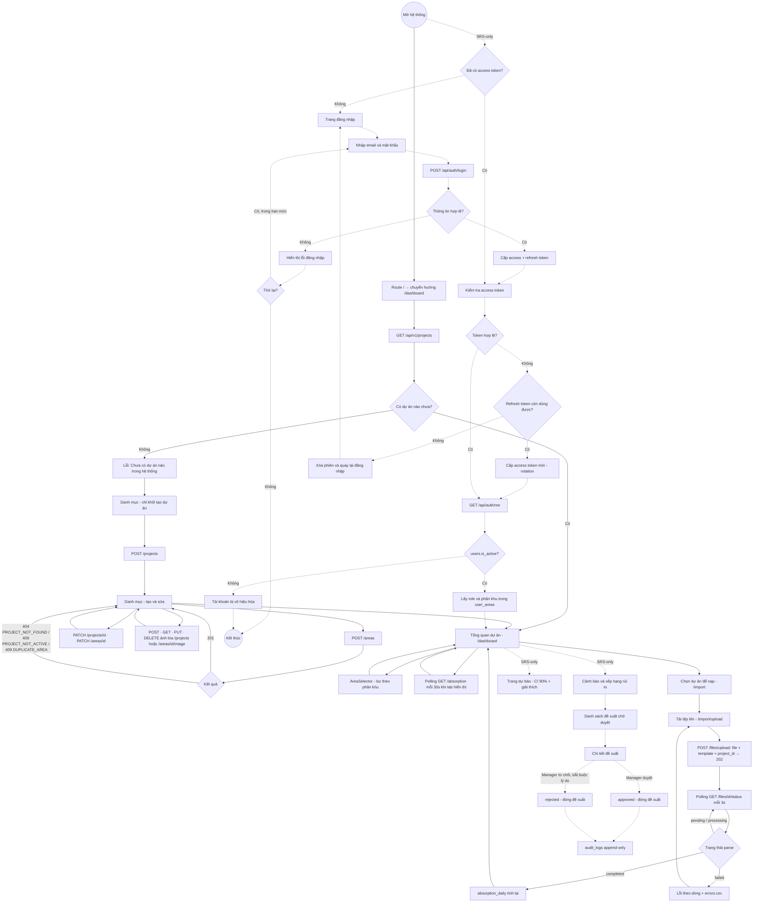

# User Flow Documentation

> **What changed.** The previous version of this file described *only* the supplied
> flow diagram and deliberately ignored every other source. It has been re-based on
> evidence: `docs/product/SRS.md` (business requirements), `pipeline_status.md`
> (implementation status, 2026-08-07), and `alembic/versions/*` (data model).
> Node names and Mermaid syntax are preserved where the node survives the check.
> See §10 for the full change log.

**Evidence legend** — every claim in this document carries one or more of:

| Tag | Meaning | Source |
|---|---|---|
| `SRS` | **Required by business requirements.** Says nothing about whether it exists. | `docs/product/SRS.md` |
| `PIPE` | **Implemented and verified.** Endpoint/page exists and is exercised by tests. | `pipeline_status.md` |
| `DB` | **Data structure exists.** A table/column/constraint supports it. Not proof of behaviour. | `alembic/versions/*` |
| `REPO` | Read directly from source files to resolve a detail the three documents leave open. | repo |
| `NONE` | No evidence in any source. | — |

**Status markers used in tables:** `[SRS-only]` specified but not built · `[Built]`
implemented · `[Schema-only]` table/column exists, no behaviour · `[Unsupported]`
appears only in prior documentation · `[NEEDS CONFIRMATION]` unresolved conflict.

---

## 1. Scope

This document describes the user flow of the AbsorptionForecast AI Agent across two
clearly separated layers, because they do not currently coincide:

- **Layer A — the flow a user can actually take today.** MVP 1 only: create a project
  and its areas, upload an Excel/CSV batch, watch it parse, read the absorption
  dashboard. `PIPE §7 "Đã có"`.
- **Layer B — the flow the SRS requires but which is not built.** Authentication,
  RBAC scoping, forecast/alert pages, and the HITL approval loop. `SRS §5.3–5.4`,
  absent per `PIPE Known Issues`.

### In scope

| Concern | Layer | Covered |
|---|---|---|
| Catalog bootstrap: create project → create area | A | Yes |
| Edit project / area, cover-image lifecycle | A | Yes |
| Upload → background parse → validation errors | A | Yes |
| Project-scoped absorption dashboard with area filter | A | Yes |
| Authentication, token refresh, account status | B | Yes, marked `[SRS-only]` |
| Role and area scoping (`user_areas`) | B | Yes, marked `[SRS-only]` |
| Forecast, alert, suggestion pages | B | Yes, marked `[SRS-only]` |
| HITL approval of proposals | B | Yes, marked `[SRS-only]` |

### Out of scope

- Anything the SRS lists as outside MVP (`SRS §1.2`): multi-model comparison, what-if
  simulation, multi-channel alerting, CRM/ERP integration, SSO/OAuth2, MFA, multi-tenant.
- Registration and password reset — **`NONE`**: no source specifies them. The SRS
  provisions users only through `POST /api/users` by a Manager (`SRS §5.4`).
- Delete of a project or area — **`NONE`**: explicitly listed as not built
  (`PIPE §7 "Chưa làm"`) and never specified.

---

## 2. End-to-end flow

### 2.1 Layer A — what runs today (`PIPE §1`, `PIPE §6b`, `PIPE §7`)

The ordering constraint is a hard one, not a UX preference: master data must exist
before ingestion, because `POST /files/upload` requires `project_id` and the importer
resolves `area_id` per row (`PIPE §1`).

```
Mở hệ thống (no login — none exists)
  → / redirects to /dashboard
  → GET /api/v1/projects
     ├─ empty  → Danh mục (/catalog) shows the create-only block
     │            → POST /projects → project auto-selected
     │            → POST /areas
     └─ present → first project by name becomes the active scope
  → Tổng quan dự án (/dashboard): SummaryCards + AbsorptionChart + AreaSelector
  → Nạp dữ liệu (/import → /import/upload)
     → POST /files/upload {file, template, project_id} → 202
     → poll GET /files/{id}/status every 3s until done/failed
     → on errors: GET /files/{id}/errors, download errors.csv
  → absorption_daily recomputed → dashboard reflects the new batch
```

### 2.2 Layer B — what the SRS requires and nobody has built

```
Mở hệ thống → AUTH_CHECK → login / token refresh → LOAD_PROFILE → USER_ACTIVE
  → LOAD_SCOPE (role + user_areas)          [SRS-only]
  → project & area scoped dashboard         [partially Built: no scoping]
  → forecast + explanation + alert pages    [SRS-only]
  → proposal inbox → approve / reject       [SRS-only, hard requirement]
  → audit log                               [SRS-only]
```

`SRS §5.4`, `SRS FR-014/FR-015/FR-018`; `AGENTS.md` states the HITL step is a hard
project requirement. `PIPE Known Issues`: *"Không có tầng xác thực nào trong mã nguồn."*

---

## 3. Detailed flow

### 3.1 Layer A — implemented

| Step | State/Page | Action | Condition | Next State | Evidence |
|---|---|---|---|---|---|
| A1 | `START` — Mở hệ thống | Browser opens the SPA | — | `/dashboard` | `REPO` App.jsx:38 — `/` → `Navigate to /dashboard` |
| A2 | `LOAD_PROJECTS` | `GET /api/v1/projects`, take `rows[0]` as active scope | — | `HAS_PROJECT` | `PIPE §7`; `REPO` endpoints.js:29–42 |
| A3 | `HAS_PROJECT` | Evaluate project list | empty | `CATALOG_EMPTY` (via nav "Danh mục"; the dashboard raises *"Chưa có dự án nào trong hệ thống"*) | `REPO` endpoints.js:36; `docs/bugs.md` BUG-CATALOG-CREATE-001 |
| A4 | `HAS_PROJECT` | Evaluate project list | ≥ 1 project | `DASHBOARD` | `PIPE §7` |
| A5 | `CATALOG_EMPTY` — Danh mục, create-only block | `POST /api/v1/projects {name, launch_date, headline?, introduce?}` | valid | 201, project auto-selected → `CATALOG` | `PIPE §3`, `PIPE §6b` step 0 |
| A6 | `CATALOG_EMPTY` | same | blank `name` / bad `launch_date` | 422, stay | `PIPE §3 Mã lỗi` |
| A7 | `CATALOG` — Danh mục | `POST /api/v1/areas {project_id, area_name, unit_type, bedrooms, area_sqm, total_units}` | project exists and `status='active'` | 201 `AreaDetail` | `PIPE §3`; `DB 0001` `uq_areas_project_name_unit_type` |
| A8 | `CATALOG` | same | project missing → 404 `PROJECT_NOT_FOUND`; not active → 409 `PROJECT_NOT_ACTIVE`; duplicate → 409 `DUPLICATE_AREA` | stay, banner shows backend message | `PIPE §3`, `PIPE §6b` step 3; `DB 0002` `ck_areas_status` |
| A9 | `CATALOG` | `PATCH /projects/{id}` / `PATCH /areas/{id}` — only fields present are written | ≥ 1 field, else 422 `NO_CHANGES` | 200 | `PIPE §3` |
| A10 | `CATALOG` | Cover image: `POST` (201) / `GET` (200) / `PUT` (200) / `DELETE` (204) `/{projects\|areas}/{id}/image` | one image max per entity | 200/201/204 | `PIPE §3 Ảnh bìa`; `DB 0002` `cover_image_url`, `DB 0004` `cover_image_public_id` |
| A11 | `CATALOG` | Attach image at creation time | — | **two calls, not atomic** — record survives a failed upload | `PIPE §3`, `PIPE §7 "Chưa làm"` |
| A12 | `DASHBOARD` — Tổng quan dự án | `GET /absorption/summary?project_id=` + `GET /absorption` | — | render SummaryCards, AbsorptionChart | `PIPE Tests Executed`; `SRS §5.2` |
| A13 | `DASHBOARD` | `AreaSelector` filters the chart by one or more areas | — | stay on `DASHBOARD` | `SRS §5.2`; `REPO` AreaSelector.jsx |
| A14 | `DASHBOARD` | Poll `GET /absorption` every 30s while the tab is visible; manual Refresh | tab hidden → polling stops | stay | `SRS §5.2 Real-time`; `REPO` DashboardPage.jsx:5–6, 61 |
| A15 | `IMPORT_SELECT` (`/import`) | Choose the project to load data into | — | `UPLOAD` | `PIPE §2` |
| A16 | `UPLOAD` (`/import/upload`) | `POST /files/upload` multipart: `file`, `template` ∈ {sales, inventory, areas}, `project_id` | ≤ 20 MB, allowed extension | **202 Accepted**, job queued | `REPO` files.py:145–175; `SRS §5.2` |
| A17 | `UPLOAD` | same | `(project_id, checksum)` already present | rejected as duplicate | `DB 0001` `uq_upload_files_project_checksum` |
| A18 | `UPLOAD` | Poll `GET /files/{id}/status` every 3s | `pending` / `processing` | keep polling | `SRS §5.2`; `DB 0001` `ck_upload_files_status` |
| A19 | `UPLOAD` | Poll result | `completed` / `failed` | stop, show `rows_ok` / `rows_failed` | `DB 0001`; `PIPE §7` |
| A20 | `UPLOAD` | Error rate above 0.5 | — | whole batch rolled back, nothing partially written | `PIPE §7`; `SRS NFR-R3` |
| A21 | `ERROR_PANEL` | `GET /files/{id}/errors`, download `errors.csv` | `rows_failed > 0` | per-row / per-column error list | `PIPE §7`; `DB 0001` `upload_errors` |
| A22 | worker | `absorption_daily` recomputed after each successful load | — | `DASHBOARD` shows new figures | `PIPE §7`; `DB 0001` `absorption_daily` |

**Note on step A16:** the SRS contract is `POST /api/files/upload` (`SRS §6`); the built
route is `POST /api/v1/files/upload` and additionally requires `template` and
`project_id` form fields that the SRS does not mention. See issue I-12.

### 3.2 Layer B — specified, not implemented

Listed so the flow is documented, **not** as a description of working behaviour. Every
row is `[SRS-only]`; the "Next State" column is the SRS-intended target.

| Step | State/Page | Action | Condition | Next State | Evidence |
|---|---|---|---|---|---|
| B1 | `AUTH_CHECK` | Check for a stored access token | — | `VALIDATE_TOKEN` / `LOGIN` | `SRS §5.4`; **not built** — no `/login` route (`REPO` App.jsx:38–43) |
| B2 | `LOGIN` → `LOGIN_INPUT` → `LOGIN_REQUEST` | `POST /api/auth/login` with email + password | — | `ISSUE_TOKEN` / `LOGIN_ERROR` | `SRS FR-018`, `SRS §6`; **no endpoint exists** (`PIPE Known Issues`) |
| B3 | `LOGIN_ERROR` → `LOGIN_RETRY` | Retry or abandon | ≤ 5 attempts/min/IP; lockout 15 min after 10 consecutive failures | `LOGIN_INPUT` / `EXIT_AUTH` | `SRS NFR-S10` — the limit the earlier draft called unspecified |
| B4 | `VALIDATE_TOKEN` → `TOKEN_VALID` | Verify HS256 access token (TTL 30 min) | valid | `LOAD_PROFILE` | `SRS NFR-S7` |
| B5 | `REFRESH_TOKEN` → `ISSUE_NEW_TOKEN` | `POST /api/auth/refresh`; rotation — the old token is revoked and linked via `replaced_by` | refresh token < 7 days, not revoked | `LOAD_PROFILE` | `SRS NFR-S7`; `DB 0001` `refresh_tokens.replaced_by`, partial unique `uq_refresh_tokens_replaced_by` |
| B6 | `FORCE_LOGIN` | Clear the session | refresh unusable | `LOGIN` | `SRS §5.4` |
| B7 | `LOAD_PROFILE` → `USER_ACTIVE` | `GET /api/auth/me`; read `users.is_active` | `false` | `ACCOUNT_DISABLED` → `EXIT_AUTH` | `DB 0001` `users.is_active` exists; **no code reads it** (`PIPE Known Issues`) |
| B8 | `LOAD_SCOPE` | Load role + assigned areas | — | scoped dashboard | `SRS FR-018`; `DB 0001` `user_areas` (PK `(user_id, area_id)`); **no `RBACGuard` in code** |
| B9 | `FORECAST_PAGE` | `GET /api/forecasts`, `/{id}/explanation` | forecast exists for the area | render CI 90% + Vietnamese explanation | `SRS §5.3`; `DB 0001` `forecasts`/`explanations`; **`src/jobs/forecast.py` is a stub with a `TODO (MVP 2)`** |
| B10 | `ALERT_PAGE` | `GET /api/alerts`, `GET /api/suggestions` | days-to-sellout < threshold | alert list + risk ranking | `SRS FR-009/FR-012`; `DB 0001` `alerts`, `suggestions`; no endpoint |
| B11 | `PROPOSAL_INBOX` | `GET /api/proposals?status=…` | Manager | `PROPOSAL_DETAIL` | `SRS FR-014`; `DB 0001` `proposals` |
| B12 | `PROPOSAL_DETAIL` | `POST /proposals/{id}/approve` or `/reject` | one-way `pending → approved \| rejected`, at most one decision | proposal closed, audit row written | `SRS FR-015/FR-016`; `DB 0001` `uq_approvals_proposal_id`, `ck_proposals_closed_at_by_status` |

---

## 4. Authentication and authorization

**Current state: there is none.** `PIPE Known Issues` states it plainly — no login
endpoint, no JWT middleware, no authorization dependency; `users`, `refresh_tokens`
and `user_areas` are migrated and seeded but no code reads them. Verified in the repo:
`src/` contains no `/api/auth/*` route and `frontend/src/App.jsx` has no `/login`
route. `AuthButtons.jsx` is a UI placeholder whose own header comment says the real
auth belongs to MVP 3.

Consequences that must be documented rather than glossed over:

- Every implemented endpoint is **open**. Anyone who can reach the API can create,
  edit, upload, and replace or delete cover images (`PIPE §7 "Chưa có phân quyền"`).
- `projects.created_by`, `areas.created_by`, `reviewed_by`, and `upload_files.uploaded_by`
  are always `NULL` (`PIPE §7`; `DB 0002` made them nullable FKs to `users`).
- The SRS requirement that authentication is mandatory on every endpoint except health
  (`SRS NFR-S1`) is **unmet**.

### Role model — unresolved three-way conflict `[NEEDS CONFIRMATION]`

| Source | Role values |
|---|---|
| `SRS §2.3`, `FR-018` | `sales_staff` · `sales_manager` · `viewer` |
| `DB 0001` `ck_users_role` | `admin` · `manager` · `analyst` |
| `REPO` `AuthButtons.jsx` `ROLE_LABEL` | `sales_staff` · `sales_manager` · `executive` |

The database **will reject** any user row carrying an SRS role name. Authentication
cannot be built until one vocabulary wins; picking the SRS names requires a new
migration altering `ck_users_role`. See Q1.

### Authorization rules that are specified but not enforced anywhere

| Rule | Source | Status |
|---|---|---|
| Only Sales Manager may import data, change thresholds, approve | `SRS NFR-S3` | `[SRS-only]` |
| Sales Staff sees only areas in `user_areas` | `SRS FR-018` | `[Schema-only]` — table exists, nothing filters on it |
| Viewer is read-only, no audit log | `SRS §2.3` | `[SRS-only]` |
| Permission to **create a project** | — | **`NONE`** — no source defines it; see I-3 |

---

## 5. Project and area navigation

### 5.1 Active project — no "default project" exists

The earlier draft described a `RESTORE_PROJECT` decision over a *"valid default
project"*. No such concept exists in any source:

- **`SRS`** — the pilot is scoped to a single project (`SRS §2.4`); no default-project
  requirement appears.
- **`DB`** — no column on `users` or elsewhere stores a preferred project.
- **`PIPE` / `REPO`** — `activeProjectId()` calls `GET /projects` and takes `rows[0]`,
  caching the promise for the session (`endpoints.js:29–42`). `GET /projects` orders by
  `name`, which is exactly how the "dashboard opens on an almost-empty project" bug
  arose (`PIPE Bugs Fixed`).

So the real behaviour is **"first project alphabetically"**, not "restore a valid
default", and there is no project-selection page: `/catalog` is where a project gets
chosen, and it drives the catalog forms only — not the dashboard scope. See I-6.

### 5.2 Area navigation — filter, not workspace

| Documented previously | Actual |
|---|---|
| `PROJECT_OVERVIEW → AREA_SELECT → AREA_PICKED → AREA_OVERVIEW` with five tabs | `/dashboard` is project-scoped; `AreaSelector` is a **multi-select filter** on the same page. No area route, no area overview, no tabs. |

Route table verified in `REPO` App.jsx:38–43 — `/dashboard`, `/import`, `/catalog`,
`/import/upload`, and a `NotReady` catch-all. Three of the four documented tab targets
(`SALES_ANALYTICS`, `FORECAST_PAGE`, `ALERT_PAGE`) have no page **and** no backing
endpoint; `DATA_PAGE` maps loosely onto the upload-history table that already exists
inside the import flow.

### 5.3 Project / area approval workflow — schema only, do not document as a flow

`DB 0002` adds `status ∈ {pending, active, rejected, archived}`, `created_by`,
`reviewed_by`, `reviewed_at`, `review_reason` to both `projects` and `areas`. That is
**data structure, not behaviour**:

- No approve/reject endpoint exists, and nothing filters by `status` — a `pending`
  project behaves exactly like an active one (`PIPE §7 "Chưa làm"`).
- Newly created rows are `active` immediately (`INITIAL_STATUS = "active"`, `PIPE §4`).
- The single observable effect is that `POST /areas` refuses a non-`active` parent
  project with 409 `PROJECT_NOT_ACTIVE` (`PIPE §3`).
- **The SRS never asks for a project/area approval workflow at all.** Its HITL
  requirement (`SRS FR-014/FR-015`) is about *forecast proposals*. See Q3.

---

## 6. Missing or inconsistent flows

| Issue | Evidence | Impact | Recommended change | Priority |
|---|---|---|---|---|
| **I-1** Prior doc presented the auth/token/account-status flow as *the* entry path | `PIPE Known Issues`: no auth layer in the codebase; no `/login` route in `App.jsx` | Readers plan work against a journey no user can take; the open-API risk stays invisible | Split into Layer A / Layer B as done here; keep auth marked `[SRS-only]` | **P0** |
| **I-2** Role vocabulary conflicts three ways | `SRS §2.3` vs `DB 0001 ck_users_role` vs `AuthButtons.jsx` | Any user row using SRS role names is rejected by the CHECK constraint; auth cannot be built until resolved | Choose one vocabulary; if SRS wins, add a migration altering `ck_users_role` | **P0** `[NEEDS CONFIRMATION]` |
| **I-3** `HAS_CREATE_PERMISSION` ("Có quyền tạo project?") | `NONE` — not in SRS, no column models it, `POST /projects` is unauthenticated | Documents an authorization branch that does not exist and was never required | Remove from the flow; if the team wants it, raise it as a new requirement first | **P1** |
| **I-4** `WAIT_PERMISSION` page | `NONE` in all three sources | Invents a page and a waiting state | Removed from the diagram | **P1** |
| **I-5** Prior doc: entire implemented MVP 1 journey absent (catalog, images, template upload, error CSV, dashboard polling) | `PIPE §1`, `§3`, `§6b`, `§7` | The only working flow was undocumented — highest practical cost | Documented as Layer A, §3.1 | **P0** |
| **I-6** `RESTORE_PROJECT` / "valid default project" / `PROJECT_SELECT` page | No such column (`DB`), no such page (`REPO`); real rule is `rows[0]` by name | Misleads on scope selection and hides the alphabetical-ordering bug class | Replaced by §5.1 describing the real rule | **P1** |
| **I-7** Area workspace with five tabs | No area route or tab component; `FORECAST_PAGE`/`ALERT_PAGE` have no endpoint (`src/jobs/forecast.py` is a `TODO (MVP 2)` stub) | Presents MVP 2 pages as if navigable today | Marked `[SRS-only]`; area interaction described as a filter | **P1** |
| **I-8** HITL approval flow missing from the doc entirely | `SRS FR-014/015` (P0); `AGENTS.md` calls it a hard requirement; `DB 0001` `proposals`/`approvals` fully modelled | The project's single non-negotiable rule was undocumented | Added as B11–B12 and to the diagram, marked `[SRS-only]` | **P0** |
| **I-9** Proposal/approval vocabulary conflicts with the SRS | `SRS FR-014` `pending/approved/rejected` vs `DB 0001 ck_proposals_status` `open/approved/rejected/cancelled`; `SRS` decision `approve/reject` vs `ck_approvals_decision` `approved/rejected` | An implementation following the SRS literally will violate a CHECK constraint on first insert | Align the SRS wording to the schema, or migrate the constraint; also decide who may `cancel` | **P1** `[NEEDS CONFIRMATION]` |
| **I-10** Reject requires a reason, approve does not — but the column forbids blanks | `SRS §5.4`: `reason` optional on approve; `DB 0001`: `approvals.reason` NOT NULL + `ck_approvals_reason_not_blank` | An approval with no reason cannot be stored; the endpoint would 500 or need a filler string | Either make `reason` nullable in a migration, or make it mandatory on both decisions in the SRS | **P1** `[NEEDS CONFIRMATION]` |
| **I-11** Project/area approval columns documented nowhere, and unrequested | `DB 0002` adds the columns; `PIPE §7`: no endpoint, no filtering; SRS never mentions it | Risk of reading the table as a live governance flow — precisely the inference to avoid | Documented as `[Schema-only]` in §5.3 | **P2** |
| **I-12** API surface differs from the SRS contract | SRS `/api/…` + `/api/health`; built `/api/v1/…` + `GET /health`; upload additionally requires `template` and `project_id` | Client and test code written from the SRS will 404 | Record `/api/v1` as the real base path; update `SRS §6` or version the contract | **P2** |
| **I-13** Duplicate-upload scope differs | `SRS §2.4`: global SHA-256 checksum; `DB 0001`: `uq_upload_files_project_checksum` — per project | The same file *can* be uploaded once per project; deliberate, but the SRS reads otherwise | Correct the SRS wording to `(project_id, checksum)` | **P2** |
| **I-14** Prior "open questions" already answered by the SRS | Q6 login retry limit → `SRS NFR-S10`; Q7 logout → `SRS §6` `POST /api/auth/logout`; Q2 token handling → `SRS NFR-S7` | Stale questions divert review effort | Removed; only genuinely unresolved items remain in §9 | **P2** |
| **I-15** Real-time layer (WebSocket, LISTEN/NOTIFY) absent from both doc and code | `SRS FR-021/022/023`, `SRS §5.3/5.4`; no WebSocket route in `src/` | MVP 2/3 UX assumption is undocumented and unbuilt | Noted here; polling is the only live mechanism today (A14, A18) | **P2** |

---

## 7. Revised Mermaid diagram

Only edges backed by evidence are drawn. Layer A is the implemented flow; Layer B is
drawn with dotted edges and is **not** navigable today. Uncertain branches carry `%%`
comments.



---

## 8. Implementation alignment

| Flow/Feature | SRS | Pipeline | Alembic support | Documentation status |
|---|---|---|---|---|
| Create project | Not specified (single pilot project assumed, `§2.4`) | ✅ `POST /api/v1/projects` | ✅ `projects` (0001) + `status` (0002) | Documented §3.1 A5 — **exceeds SRS** |
| Create / edit area | Not specified as a user action | ✅ `POST /areas`, `PATCH /areas/{id}` | ✅ `uq_areas_project_name_unit_type`, 5 CHECKs (0001) | Documented §3.1 A7–A9 |
| Cover image (Cloudinary) | ❌ not in SRS | ⚠️ built, **never run against real Cloudinary** (`PIPE §7`) | ✅ `cover_image_url` (0002), `cover_image_public_id` (0004) | Documented §3.1 A10–A11 |
| Upload Excel/CSV + row validation | ✅ FR-001/002 (P0) | ✅ upload → parse → errors → `errors.csv` | ✅ `upload_files`, `upload_errors` | Documented §3.1 A16–A21 |
| Absorption calculation + trend chart | ✅ FR-003/004 (P0) | ✅ `absorption_daily` recomputed per load | ✅ `absorption_daily` (0001) | Documented §3.1 A12–A14, A22 |
| Dashboard polling (30s / 3s) | ✅ `§5.2` | ✅ implemented client-side | n/a | Documented §3.1 A14, A18 |
| Prophet forecast + CI 90% | ✅ FR-005/006/007 (P0) | ❌ `src/jobs/forecast.py` is a `TODO (MVP 2)` stub | ✅ `forecasts`, `forecast_points`, `ck_forecasts_pred_bounds` | `[SRS-only]` §3.2 B9 |
| Sellout alerts + threshold config | ✅ FR-009/010 | ❌ no endpoint | ✅ `alerts`, `settings` | `[SRS-only]` §3.2 B10 |
| LLM explanation (LangGraph) | ✅ FR-011 (P0) | ⚠️ `src/services/llm.py` client only, no agent pipeline | ✅ `explanations` (UNIQUE `forecast_id`), `llm_calls` | `[SRS-only]` §3.2 B9 |
| Risk ranking + suggestions | ✅ FR-012/013 (P0) | ❌ | ✅ `suggestions` | `[SRS-only]` §3.2 B10 |
| **HITL approve / reject** | ✅ FR-014/015 (P0), hard requirement in `AGENTS.md` | ❌ no endpoint | ✅ `proposals`, `approvals`, `uq_approvals_proposal_id` | `[SRS-only]` §3.2 B11–B12 |
| Audit log | ✅ FR-016, NFR-L1/L2 (P0) | ❌ nothing writes to it | ✅ `audit_logs` + 3 indexes | `[SRS-only]` |
| Login / JWT / refresh rotation | ✅ FR-018, NFR-S7 (P0) | ❌ none | ✅ `users`, `refresh_tokens`, partial unique on `replaced_by` | `[SRS-only]` §4 |
| RBAC + area scoping | ✅ FR-018, NFR-S2/S3 (P0) | ❌ none | ✅ `user_areas`; ⚠️ `ck_users_role` values conflict | `[SRS-only]` §4 `[NEEDS CONFIRMATION]` |
| Account disabled handling | Implied by `users.is_active` | ❌ nothing reads it | ✅ `users.is_active` (0001) | `[SRS-only]` §3.2 B7 |
| WebSocket / LISTEN-NOTIFY | ✅ FR-021/022/023 | ❌ no WS route | n/a | `[SRS-only]`, I-15 |
| MAPE report, LLM call counting | ✅ FR-019 (P1) / FR-020 (P2) | ❌ | ✅ `forecasts.mape`, `llm_calls` | `[SRS-only]` |
| Project/area approval workflow | ❌ **not in SRS** | ❌ columns only, nothing filters on `status` | ✅ `status`, `reviewed_by`, `review_reason` (0002) | `[Schema-only]` §5.3, Q3 |
| Default-project restore | ❌ not in SRS | ⚠️ `rows[0]` by name, not a stored default | ❌ no column | Corrected §5.1, I-6 |
| Project-create permission | ❌ | ❌ endpoint is open | ❌ | `[Unsupported]` — removed, I-3 |
| Area workspace with 5 tabs | ❌ (SRS lists components, not an area route) | ❌ no route | n/a | `[Unsupported]` — removed, I-7 |
| Waiting-for-permission page | ❌ | ❌ | ❌ | `[Unsupported]` — removed, I-4 |
| Delete project / area | ❌ | ❌ explicitly not built | n/a | Out of scope §1 |

---

## 9. Open questions

Stale questions answered by the SRS have been dropped (I-14). What remains is genuinely
unresolved and blocks work.

| # | Question | Why it matters | Status |
|---|---|---|---|
| **Q1** | Which role vocabulary is authoritative — `sales_staff/sales_manager/viewer` (SRS), `admin/manager/analyst` (`ck_users_role`, 0001), or the frontend's `executive` variant? | Auth cannot be implemented; the CHECK constraint rejects SRS role names outright. A new migration is required if the SRS wins. | `[NEEDS CONFIRMATION]` — blocks MVP 3 |
| **Q2** | Is creating projects and areas through the UI an agreed product capability, and who may do it? | The feature is built and shipped but appears in no requirement, and it is unauthenticated. `SRS NFR-S3` restricts import/config/approval to Managers but is silent on catalog creation. | `[NEEDS CONFIRMATION]` |
| **Q3** | Is the project/area approval workflow added in `0002` (`pending/active/rejected/archived`, `reviewed_by`, `review_reason`) a real requirement? | Seven columns and two FKs per table exist for a flow no source specifies. Either the SRS is missing a requirement, or the schema carries dead weight. | `[NEEDS CONFIRMATION]` |
| **Q4** | Proposal states: SRS says `pending`; the schema says `open`, and adds `cancelled`. Who may cancel a proposal, and when? | An implementation written from the SRS violates `ck_proposals_status` on the first insert. | `[NEEDS CONFIRMATION]` |
| **Q5** | Must an *approval* carry a reason? `approvals.reason` is NOT NULL and non-blank; the SRS makes it optional on approve. | Determines whether a migration or an SRS edit is needed before the HITL endpoint can be written. | `[NEEDS CONFIRMATION]` |
| **Q6** | Should the active project become an explicit, persisted user choice rather than "first by name"? | The current rule already produced one shipped bug (`PIPE Bugs Fixed`) and does not survive multiple projects. | Open |
| **Q7** | Is the area-scoped workspace (overview + Bán hàng / Dự báo / Cảnh báo / Dữ liệu tabs) an agreed UX target for MVP 2? | The SRS specifies components, not an area route. Building it changes routing and RBAC filtering. | `[NEEDS CONFIRMATION]` |
| **Q8** | Which API contract governs — `/api/...` (SRS §6) or the shipped `/api/v1/...`, and does `health` live at `/health` or `/api/health`? | Client code and integration tests written from the SRS will 404 today. | Open |
| **Q9** | Is per-project duplicate detection (`uq_upload_files_project_checksum`) intended, against the SRS's global checksum rule? | Decides whether the same file may be loaded into two projects. The schema choice looks deliberate; the SRS text does not reflect it. | Open |
| **Q10** | What happens to an access token that expires while the user is mid-session? | Only bootstrap validation is specified; `SRS NFR-S7` sets a 30-minute TTL but no in-session renewal trigger. | Open |

---

## 10. Change log

| # | Change | Reason |
|---|---|---|
| 1 | Re-based the document from "diagram only" to evidence-ranked sources (SRS → pipeline → Alembic → prior doc), with an explicit evidence tag on every claim | The prior framing made the document unfalsifiable: it described a diagram, not the system |
| 2 | Split the flow into **Layer A (implemented)** and **Layer B (SRS-only)** | Prevents reading the auth/forecast/HITL journey as working behaviour |
| 3 | Added the whole implemented MVP 1 journey — catalog create/edit, cover image, template upload, parse polling, error CSV, absorption dashboard | It was entirely missing (I-5) |
| 4 | Added the HITL approve/reject flow, marked `[SRS-only]` | P0 requirement and a hard project rule; previously absent (I-8) |
| 5 | Removed `HAS_CREATE_PERMISSION` and `WAIT_PERMISSION` | No evidence in any source (I-3, I-4) |
| 6 | Replaced `RESTORE_PROJECT` / `PROJECT_SELECT` with the real "first project by name" rule | No default-project column or page exists (I-6) |
| 7 | Replaced the area workspace + 5 tabs with the actual `AreaSelector` filter; the tab targets are listed as `[SRS-only]` | No area route or endpoint (I-7) |
| 8 | Documented the `0002` project/area approval columns as `[Schema-only]`, not as a flow | Table existence is not business behaviour (I-11) |
| 9 | Recorded the role-vocabulary, proposal-state, and approval-reason conflicts as `[NEEDS CONFIRMATION]` | Schema and SRS disagree; both would break an implementation (I-2, I-9, I-10) |
| 10 | Recorded the `/api/v1` base path, the `template`/`project_id` upload fields, and per-project checksum scope | Shipped contract differs from `SRS §6` (I-12, I-13) |
| 11 | Dropped stale open questions answered by the SRS (retry limit, logout, token handling); kept and added ten that are genuinely unresolved | `SRS NFR-S10`, `§6`, `NFR-S7` answer them (I-14) |
| 12 | Preserved Vietnamese node labels, Mermaid `flowchart TD` syntax, and the surviving node IDs (`START`, `AUTH_CHECK`, `LOGIN*`, `TOKEN_VALID`, `REFRESH_TOKEN`, `USER_ACTIVE`, `CATALOG_EMPTY`, `EXIT_AUTH`) | Continuity with the prior document and with reviewers' vocabulary |

---

**Overall status:** **Needs major revision** (the prior version — this revision
addresses it). The earlier document was accurate *about the diagram* and materially
inaccurate *about the system*: it described an authentication-first journey that does
not exist in code, omitted the only flow that does, and left the project's one
non-negotiable requirement — HITL approval — undocumented.

**Top 3 issues**

1. **The documented entry path is unbuildable and the built path was undocumented.**
   No auth layer exists (`PIPE Known Issues`), yet auth was the spine of the flow;
   meanwhile the working catalog → upload → dashboard journey appeared nowhere (I-1, I-5).
2. **Role vocabulary is contradictory across all three sources**, and `ck_users_role`
   will reject the SRS role names. Authentication and RBAC cannot start until this is
   settled (I-2, Q1).
3. **The HITL approval flow — a hard project requirement — was missing from the
   documentation and is absent from the code**, while the schema for it is complete.
   Schema readiness has been mistaken for progress (I-8).

**Top 3 recommended next actions**

1. **Settle the schema/SRS conflicts before writing MVP 3 code** — role values (Q1),
   proposal states including `cancelled` (Q4), and whether an approval needs a reason
   (Q5). Each is a one-line decision that determines whether a migration is required.
2. **Decide the status of the unrequested features**: catalog CRUD and cover images are
   shipped but unspecified (Q2), and the `0002` project/area approval columns specify
   nothing (Q3). Either add them to the SRS or record them as deliberate scope additions.
3. **Close the authorization gap or state the risk explicitly.** Every endpoint is open,
   including image replace/delete, and `created_by` / `uploaded_by` are always NULL — so
   no action is currently attributable, which is incompatible with `SRS NFR-L2` audit
   requirements.
